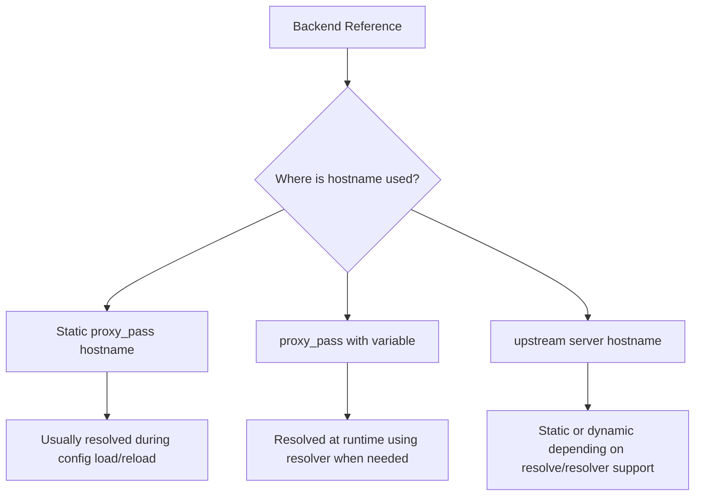
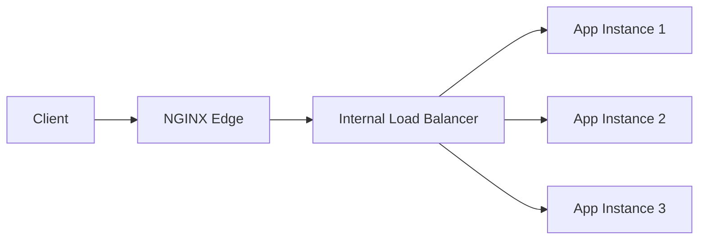
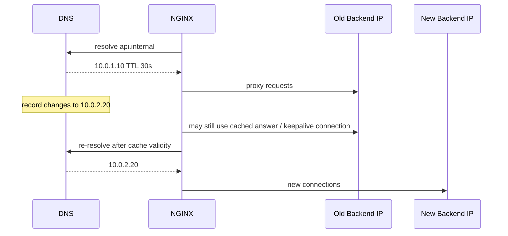
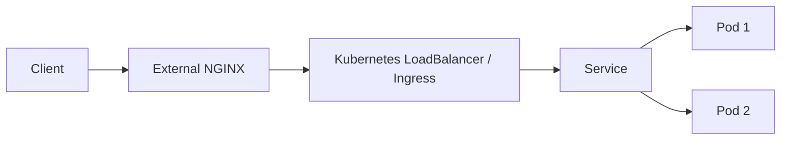
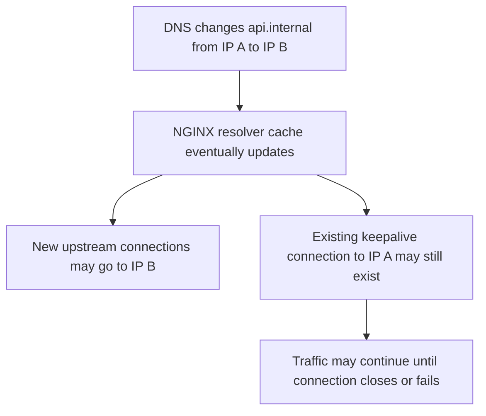

# Part 041 — DNS Resolution and Dynamic Upstreams

Dynamic upstream looks simple:

```nginx
proxy_pass http://api.service.local:8080;
```

But in production, that single line hides several questions:

- When is `api.service.local` resolved?
- How long is the answer cached?
- What happens when the DNS answer changes?
- What happens when the name is temporarily unresolvable?
- Does NGINX use all A/AAAA records or just one?
- Does it re-resolve in the background or only during request processing?
- Does this behavior change when the hostname appears inside an `upstream` block?
- Does Kubernetes DNS behave the same as cloud load balancer DNS?

This part is about those questions.

The core idea:

> DNS in NGINX is not merely name lookup. It is part of the load balancing, failure recovery, deployment, and rollback model.

If you treat DNS as a static string, your proxy may keep sending traffic to dead IPs. If you treat DNS as magic service discovery, you may create request-path resolver dependency, latency spikes, or inconsistent routing.

---

## 1. The wrong mental model

Many engineers assume this:


That is not always true.

A more accurate model depends on how the backend is declared:



The operational consequence is huge:

- static resolution couples backend membership to NGINX reload;
- runtime resolution couples request routing to resolver availability and cache behavior;
- dynamic upstream resolution can update peer IPs without constantly regenerating config;
- every model has a failure mode.

There is no universally correct DNS pattern. There is only a pattern that matches your deployment topology.

---

## 2. Three DNS resolution modes you must distinguish

### Mode A — Static hostname in `proxy_pass`

Example:

```nginx
location /api/ {
    proxy_pass http://api.internal:8080;
}
```

In this model, the hostname is part of static configuration. NGINX resolves it when the configuration is loaded or reloaded.

Good for:

- stable virtual machines;
- stable internal load balancer names;
- environments where backend IP change is rare;
- simple systems where deploy process reloads NGINX after backend membership changes.

Dangerous for:

- Kubernetes service names if pods/endpoints change frequently and you expect NGINX to track them directly;
- cloud load balancer names with changing IP answers;
- container DNS where service IPs may change while NGINX stays alive;
- emergency failover by DNS alone.

The trap:

> Low DNS TTL does not help if NGINX resolved the name only at config load.

If the name changes and NGINX does not re-resolve it, TTL is irrelevant to the running worker.

### Mode B — Variable in `proxy_pass`

Example:

```nginx
resolver 127.0.0.53 valid=30s ipv6=off;

set $api_upstream api.internal:8080;

location /api/ {
    proxy_pass http://$api_upstream;
}
```

When `proxy_pass` contains variables and the address is a domain name, NGINX uses a configured resolver if it cannot find the name among defined upstream groups.

This is runtime resolution.

Good for:

- dynamic backend names;
- cloud DNS targets that change behind a stable name;
- simple runtime service discovery;
- cases where reload is undesirable for every endpoint update.

Dangerous for:

- URI rewriting semantics if you forget that variable `proxy_pass` changes URI replacement behavior;
- resolver outage dependency;
- accidentally resolving user-controlled hostnames;
- per-request dynamic routing without whitelist;
- DNS poisoning if resolver is not trusted.

### Mode C — `upstream` block with dynamic resolving

Modern NGINX Open Source supports resolver configuration in `upstream` context and `resolve` on upstream `server` entries in recent versions. Historically, parts of this behavior were NGINX Plus-only, so older guidance on the internet is often stale.

Example pattern:

```nginx
upstream api_backend {
    zone api_backend 64k;
    resolver 127.0.0.53 valid=30s ipv6=off;
    resolver_timeout 5s;

    server api-1.internal:8080 resolve;
    server api-2.internal:8080 resolve;
}

server {
    listen 80;

    location /api/ {
        proxy_pass http://api_backend;
    }
}
```

Good for:

- preserving upstream group semantics;
- load balancing across dynamically resolved names;
- avoiding variable `proxy_pass` URI pitfalls;
- long-running NGINX processes that should track DNS changes.

Dangerous for:

- assuming the feature exists in old distro packages;
- forgetting shared memory `zone` where required by dynamic upstream features;
- not testing behavior on your exact NGINX build;
- using public/untrusted resolvers for internal upstream discovery.

---

## 3. Static `proxy_pass`: safe when the name is not service discovery

Static `proxy_pass` is not bad. It is bad only when you use it for a problem it does not solve.

Reasonable static model:

```nginx
upstream api_gateway_internal_lb {
    server internal-api-lb.example.net:443;
    keepalive 64;
}

server {
    listen 443 ssl;
    server_name app.example.com;

    location /api/ {
        proxy_ssl_server_name on;
        proxy_ssl_name internal-api-lb.example.net;
        proxy_pass https://api_gateway_internal_lb;
    }
}
```

Here the DNS name likely points to an internal load balancer. NGINX does not need pod-level or instance-level discovery. The load balancer owns backend membership.

This is often the cleanest architecture:



The invariant:

> If NGINX uses static DNS, the thing behind the DNS name must itself be stable enough to absorb backend churn.

That thing can be:

- cloud load balancer;
- Kubernetes ClusterIP service;
- service mesh ingress;
- internal API gateway;
- manually managed upstream with reload automation.

Static DNS becomes problematic when the DNS answer itself is the backend membership list.

---

## 4. Variable `proxy_pass`: powerful but easy to misuse

Runtime DNS through variables is attractive because it seems to solve stale IPs.

Example:

```nginx
resolver 10.0.0.2 valid=10s ipv6=off;
resolver_timeout 2s;

map $host $tenant_origin {
    default "";
    tenant-a.example.com tenant-a-origin.internal:8080;
    tenant-b.example.com tenant-b-origin.internal:8080;
}

server {
    listen 443 ssl;
    server_name tenant-a.example.com tenant-b.example.com;

    if ($tenant_origin = "") {
        return 421;
    }

    location / {
        proxy_set_header Host $host;
        proxy_pass http://$tenant_origin;
    }
}
```

This is acceptable because the target is selected from a whitelist.

This is dangerous:

```nginx
location /proxy/ {
    proxy_pass http://$arg_url;
}
```

That is not service discovery. That is an SSRF primitive.

### Important URI warning

Do not casually rewrite this:

```nginx
location /api/ {
    proxy_pass http://api.internal/v1/;
}
```

into this:

```nginx
set $backend api.internal;

location /api/ {
    proxy_pass http://$backend/v1/;
}
```

The moment variables enter `proxy_pass`, you must re-check URI forwarding semantics. Variable `proxy_pass` can remove the predictable prefix-replacement behavior you expected from static `proxy_pass` with URI.

Safer pattern:

```nginx
resolver 10.0.0.2 valid=30s ipv6=off;

set $backend api.internal:8080;

location /api/ {
    rewrite ^/api/(.*)$ /v1/$1 break;
    proxy_pass http://$backend;
}
```

Now URI mutation is explicit.

---

## 5. `resolver`: not optional when runtime DNS is used

Runtime DNS needs a resolver.

Example:

```nginx
resolver 10.0.0.2 10.0.0.3 valid=30s ipv6=off;
resolver_timeout 2s;
```

Important details:

| Directive | Purpose |
|---|---|
| `resolver` | DNS server NGINX should query for runtime name resolution |
| `valid` | Overrides DNS answer cache validity window |
| `ipv4=off` / `ipv6=off` | Controls A/AAAA lookup behavior |
| `resolver_timeout` | Maximum DNS resolution time |

Production guidance:

- use local or trusted internal DNS resolvers;
- do not depend on public DNS for private service discovery;
- set `resolver_timeout` lower than the client-facing request timeout budget;
- set `valid` intentionally, not blindly;
- disable IPv6 lookup if your environment does not route IPv6 correctly;
- monitor resolver failures as upstream routing failures.

Bad:

```nginx
resolver 8.8.8.8 valid=1s;
```

Better:

```nginx
resolver 169.254.20.10 valid=30s ipv6=off; # example local node DNS cache
resolver_timeout 2s;
```

Best depends on your platform. In Kubernetes it might be CoreDNS or NodeLocal DNSCache. In cloud VMs it might be provider DNS. In regulated/internal environments it may be an enterprise resolver with audit and split-horizon records.

---

## 6. TTL is not a correctness guarantee

DNS TTL says how long a resolver answer may be cached. It does not guarantee:

- all NGINX workers update simultaneously;
- existing keepalive connections are closed;
- failed old IPs disappear instantly;
- clients stop seeing stale routes;
- upstream application state has moved safely.

Consider this deployment:



DNS changes do not equal traffic drain.

If old backend must stop receiving traffic, you need an explicit drain model:

- remove from service discovery;
- wait at least DNS validity window;
- wait for upstream keepalive idle timeout;
- stop accepting new app requests;
- wait for in-flight requests;
- then terminate.

DNS alone is an announcement system, not a lifecycle controller.

---

## 7. Kubernetes service discovery patterns

In Kubernetes, you need to choose what NGINX should discover.

### Pattern A — NGINX outside cluster → Kubernetes LoadBalancer/Ingress



NGINX sees one stable endpoint.

Pros:

- simple;
- NGINX does not need pod discovery;
- Kubernetes owns pod churn;
- good separation of concerns.

Cons:

- another hop;
- less direct visibility into individual pod health;
- LB semantics may differ across cloud providers.

### Pattern B — NGINX inside cluster → ClusterIP Service

```nginx
resolver kube-dns.kube-system.svc.cluster.local valid=30s ipv6=off;

location /api/ {
    proxy_pass http://api.default.svc.cluster.local:8080;
}
```

Usually you do not need direct pod IP discovery. The Kubernetes Service VIP handles endpoint membership.

Pros:

- stable service name;
- fewer NGINX dynamic DNS concerns;
- Kubernetes handles pod changes.

Cons:

- load balancing happens below NGINX;
- NGINX may not observe individual pod failures;
- kube-proxy/IPVS/eBPF behavior matters.

### Pattern C — NGINX directly discovers headless service endpoints

```nginx
upstream api_pods {
    zone api_pods 64k;
    resolver kube-dns.kube-system.svc.cluster.local valid=10s ipv6=off;
    resolver_timeout 2s;

    server api-headless.default.svc.cluster.local:8080 resolve;
}
```

Pros:

- NGINX can load balance across pod IPs directly;
- useful when you need NGINX upstream-level metrics and algorithms.

Cons:

- pod churn now affects NGINX directly;
- DNS response size and TTL behavior matter;
- stale pod IPs can cause transient 502/504;
- readiness/liveness semantics must be understood.

Use this only when you actually need NGINX to own upstream selection.

---

## 8. Cloud load balancer DNS

Cloud load balancer names often resolve to changing IPs.

Example:

```nginx
location /payments/ {
    proxy_pass https://internal-payments-lb.example.net;
}
```

This may work for months, then fail during LB maintenance or failover if NGINX keeps stale IPs.

Safer options:

### Option 1 — reload NGINX periodically or on DNS change

Simple, but operationally crude.

```bash
nginx -t && nginx -s reload
```

Works if reload is safe and infrequent.

### Option 2 — variable `proxy_pass` with resolver

```nginx
resolver 10.0.0.2 valid=30s ipv6=off;
resolver_timeout 2s;

set $payments_lb internal-payments-lb.example.net;

location /payments/ {
    proxy_ssl_server_name on;
    proxy_ssl_name internal-payments-lb.example.net;
    proxy_pass https://$payments_lb;
}
```

Use this when the load balancer DNS answer changes and NGINX must track it without reload.

### Option 3 — dynamic upstream resolution

```nginx
upstream payments_lb {
    zone payments_lb 64k;
    resolver 10.0.0.2 valid=30s ipv6=off;
    resolver_timeout 2s;

    server internal-payments-lb.example.net:443 resolve;
}

location /payments/ {
    proxy_ssl_server_name on;
    proxy_ssl_name internal-payments-lb.example.net;
    proxy_pass https://payments_lb;
}
```

Prefer this when available and tested, because it preserves upstream group behavior better than variable `proxy_pass`.

---

## 9. The hidden dependency: DNS as part of availability

When you use runtime DNS, DNS is on the request path.

Failure modes:

| Failure | Effect |
|---|---|
| Resolver timeout | Request can fail before upstream connection |
| NXDOMAIN | No backend selected |
| SERVFAIL | Routing failure |
| Stale answer | Traffic goes to removed backend |
| Poisoned answer | Traffic goes to attacker-controlled IP |
| IPv6 answer in IPv4-only network | Connect timeout / unreachable |
| DNS cache too short | Higher resolver QPS and latency |
| DNS cache too long | Slower failover |

The correct question is not “what TTL should I use?”

The correct question is:

> What failure are we optimizing for: fast failover, resolver stability, backend drain, or request latency?

For most internal production systems, `valid=10s` to `valid=60s` is a reasonable starting window, but it must match deployment frequency, DNS capacity, and incident expectations.

---

## 10. DNS and upstream keepalive

DNS changes affect new connection selection. They do not necessarily kill existing upstream keepalive connections.



Implication:

- keepalive improves performance;
- keepalive can delay full traffic movement;
- backend drain must account for idle connection lifetime;
- low DNS TTL alone does not guarantee immediate cutover.

If you need fast evacuation, tune both:

```nginx
upstream api_backend {
    zone api_backend 64k;
    resolver 10.0.0.2 valid=10s ipv6=off;
    resolver_timeout 2s;

    server api.internal:8080 resolve;

    keepalive 64;
    keepalive_timeout 15s;
    keepalive_time 5m;
    keepalive_requests 1000;
}
```

Do not set keepalive timeouts blindly low. That can create connection churn and backend CPU overhead.

---

## 11. Security boundary: never let the client choose the DNS target

This is the most important security rule in this part:

> Dynamic upstream must be selected from trusted configuration, not from arbitrary user input.

Bad:

```nginx
location /fetch/ {
    resolver 10.0.0.2;
    proxy_pass http://$arg_host$request_uri;
}
```

An attacker can attempt:

```txt
/fetch/?host=169.254.169.254
/fetch/?host=internal-admin.service.local
/fetch/?host=redis.default.svc.cluster.local:6379
```

Better:

```nginx
map $arg_target $safe_origin {
    default "";
    catalog catalog-api.internal:8080;
    search  search-api.internal:8080;
}

server {
    location /internal-proxy/ {
        if ($safe_origin = "") {
            return 400;
        }

        proxy_pass http://$safe_origin;
    }
}
```

Better still: avoid exposing generic proxy behavior at all. Create explicit routes.

---

## 12. DNS failure observability

Your logs should reveal whether a failure came from DNS, connection, timeout, upstream status, or response transfer.

Useful log format:

```nginx
log_format edge_json escape=json
  '{'
    '"ts":"$time_iso8601",'
    '"request_id":"$request_id",'
    '"host":"$host",'
    '"method":"$request_method",'
    '"uri":"$request_uri",'
    '"status":$status,'
    '"upstream_addr":"$upstream_addr",'
    '"upstream_status":"$upstream_status",'
    '"upstream_connect_time":"$upstream_connect_time",'
    '"upstream_header_time":"$upstream_header_time",'
    '"upstream_response_time":"$upstream_response_time",'
    '"request_time":$request_time'
  '}';
```

Look for:

- empty `$upstream_addr` with 502/504: backend not selected or DNS/connect failure;
- multiple `$upstream_addr` entries: retry happened;
- connect time near timeout: network/backend unavailable;
- response time high but connect/header low: slow streaming/body transfer;
- sudden NXDOMAIN/SERVFAIL in error logs: resolver/discovery issue.

Also monitor resolver infrastructure separately. NGINX logs are not enough.

---

## 13. Production decision matrix

| Environment | Recommended NGINX discovery pattern |
|---|---|
| VM app instances manually managed | Static `upstream` + config generation + reload |
| Cloud internal load balancer | Static if LB IP is stable enough; dynamic resolver if DNS changes matter |
| Docker Compose local dev | Runtime resolver can help, but keep it simple |
| Kubernetes inside cluster | Prefer ClusterIP Service unless NGINX must own pod balancing |
| Kubernetes direct pod balancing | Headless Service + dynamic upstream resolution + careful TTL/readiness |
| Multi-tenant dynamic origin | Whitelisted `map` + runtime resolver; never raw user host |
| Regulated production | Explicit registry + generated config + validation + audit trail |

---

## 14. Checklist before using dynamic DNS

Ask these before enabling runtime DNS:

1. What exact NGINX version and build are we running?
2. Is the feature available in this package, or only in newer NGINX/Plus?
3. Is the resolver trusted and local to the network?
4. What happens if resolver is unavailable?
5. What TTL or `valid` value matches our deployment and failover model?
6. Do we need IPv6 lookup?
7. Does upstream keepalive delay traffic movement?
8. Are dynamic targets whitelisted?
9. Are DNS failures visible in logs and alerts?
10. Have we tested DNS change, NXDOMAIN, SERVFAIL, stale IP, and resolver timeout?

---

## 15. Failure injection lab

Use a local resolver or container DNS where you can change records.

### Step 1 — Start two upstreams

```bash
python3 -m http.server 9001 --bind 127.0.0.1
python3 -m http.server 9002 --bind 127.0.0.1
```

### Step 2 — Point a test name to one backend

Use `/etc/hosts` for config-load testing, but remember NGINX runtime resolver does not use `/etc/hosts` in the same way as system libc resolution. For true runtime DNS behavior, use a DNS server you control.

### Step 3 — Test static resolution

```nginx
location /static-dns/ {
    proxy_pass http://test-api.local:9001;
}
```

Change DNS. Observe whether traffic moves without reload.

### Step 4 — Test runtime resolution

```nginx
resolver 127.0.0.1:5353 valid=5s ipv6=off;
resolver_timeout 1s;

set $runtime_backend test-api.local:9001;

location /runtime-dns/ {
    proxy_pass http://$runtime_backend;
}
```

Change DNS. Observe update timing.

### Step 5 — Break DNS

Stop the resolver.

Observe:

- access log status;
- error log message;
- client latency;
- whether cached answer continues to work;
- what happens after cache validity expires.

---

## 16. Operational invariant

For production:

> Do not deploy dynamic upstream discovery unless you can explain exactly how backend membership changes, how NGINX learns the change, how long stale traffic can continue, and what happens when DNS fails.

DNS is not a deployment system. DNS is one signal inside a deployment system.

The strongest NGINX platforms make this explicit:

- backend registry is controlled;
- config generation is deterministic;
- dynamic DNS is used only where it has clear value;
- resolver is trusted and monitored;
- rollback does not depend on wishful TTL behavior;
- logs expose upstream address, status, and timing.

---

## 17. What to remember

- Static `proxy_pass` hostname resolution is usually tied to config load/reload.
- Variable `proxy_pass` can trigger runtime DNS resolution, but changes URI semantics and increases security risk.
- Dynamic upstream resolution preserves upstream-group semantics when supported by your NGINX version/build.
- Low DNS TTL does not guarantee immediate traffic movement.
- Upstream keepalive can keep old connections alive after DNS changes.
- DNS resolver availability becomes part of your edge availability.
- Never route to arbitrary client-provided hostnames.
- Use DNS deliberately, not as vague service-discovery magic.

Next, we will study retry behavior. DNS tells NGINX where traffic could go. Retry semantics decide whether one failed attempt should become another attempt — and that can be catastrophic for non-idempotent operations.
