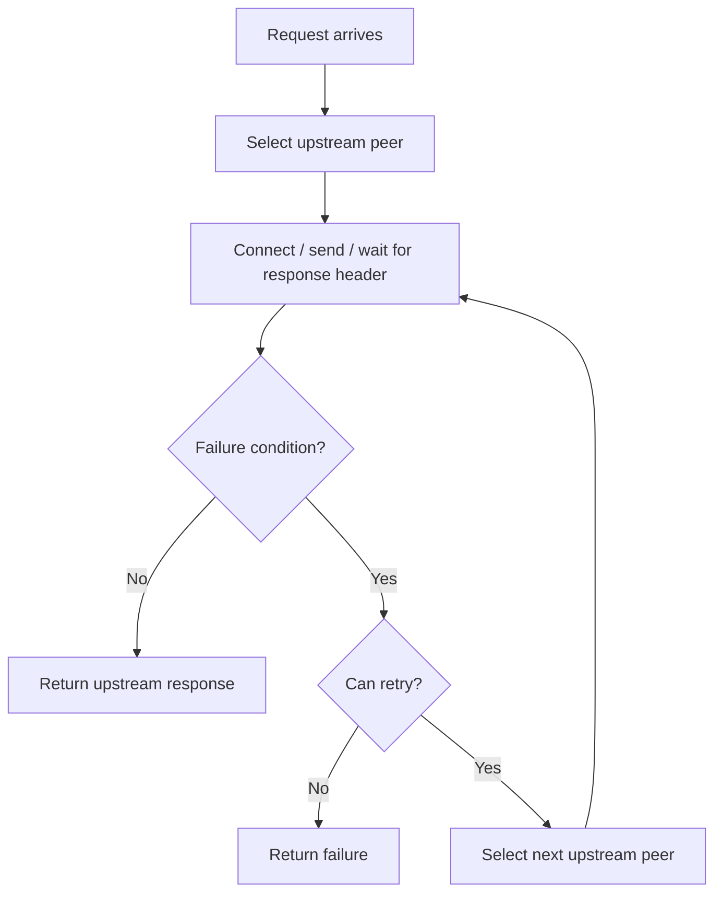
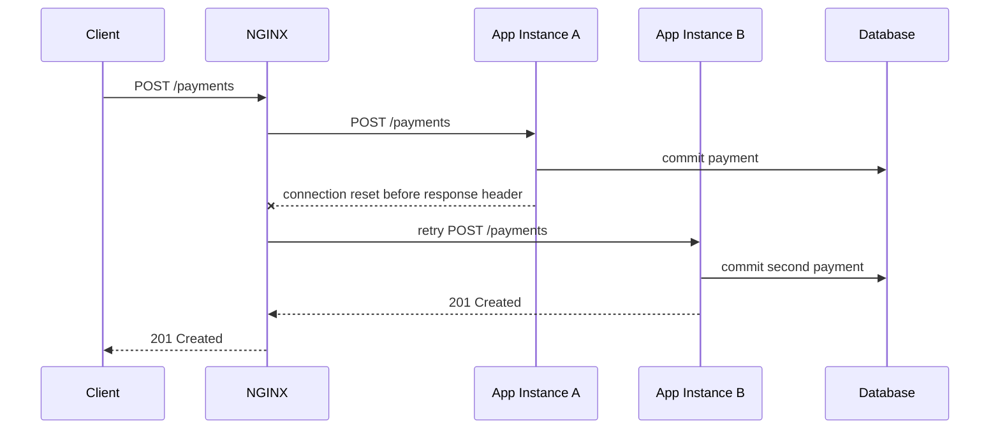
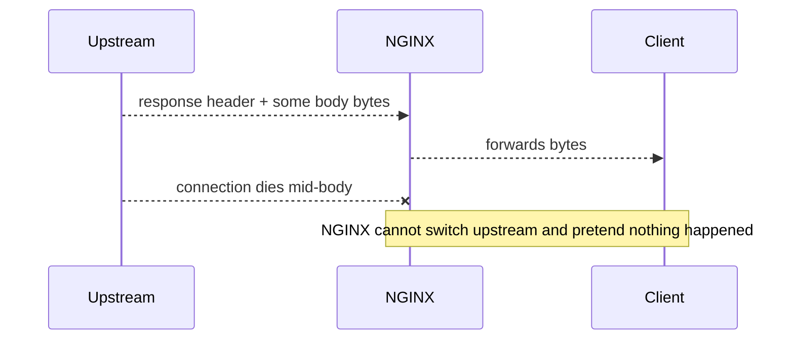
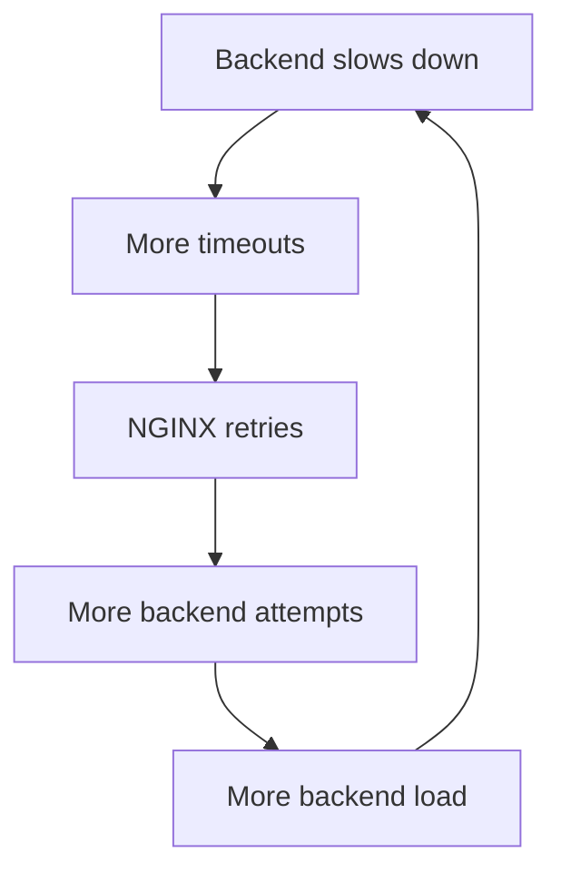
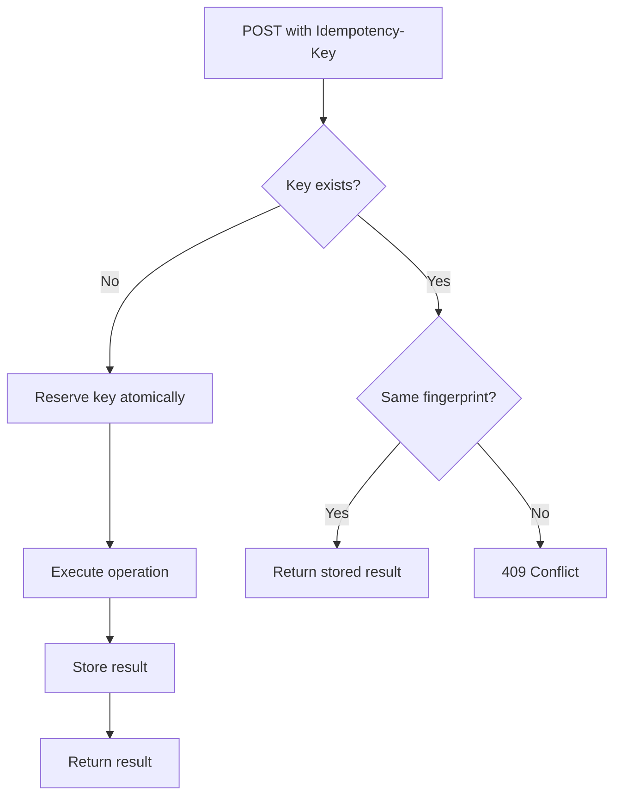
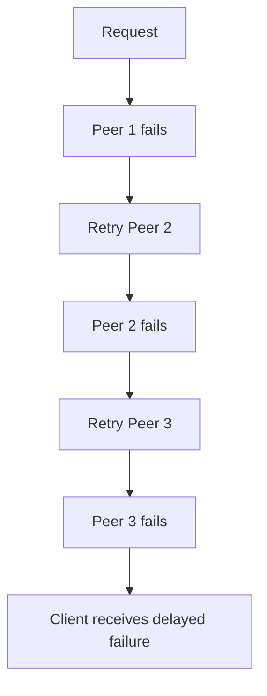

# Part 042 — Retry Semantics, Idempotency, and Duplicate Write Prevention

Retries look harmless until they duplicate money movement, submit the same form twice, create two cases, charge the same card twice, or send two notifications.

In NGINX, retry behavior is controlled mainly by:

```nginx
proxy_next_upstream
proxy_next_upstream_tries
proxy_next_upstream_timeout
```

The dangerous part is not the directive. The dangerous part is the assumption that retrying is always reliability.

A better mental model:

> A retry is a second execution attempt under uncertainty.

Uncertainty means NGINX often does not know whether the upstream did nothing, partially processed the request, fully committed the request, or committed it but failed before returning a response.

---

## 1. What `proxy_next_upstream` really means

NGINX can pass a request to the next upstream server when certain failure conditions happen.

Example:

```nginx
upstream api_backend {
    server 10.0.1.10:8080;
    server 10.0.1.11:8080;
}

location /api/ {
    proxy_pass http://api_backend;

    proxy_next_upstream error timeout http_502 http_503 http_504;
    proxy_next_upstream_tries 2;
    proxy_next_upstream_timeout 3s;
}
```

This says:

- if a configured failure condition occurs;
- and NGINX has not already committed response bytes to the client;
- and retry limits allow it;
- then try another upstream peer.

This is not the same as “make the request successful.”

It is:



Retry is bounded by what NGINX can safely observe.

---

## 2. Failure classes are not equal

`proxy_next_upstream` supports several classes of failure.

Conceptual grouping:

| Class | Example | Meaning |
|---|---|---|
| Transport/connect failure | `error`, `timeout` | Could not connect, send, or read response header reliably |
| Invalid upstream behavior | `invalid_header` | Upstream sent empty/invalid response |
| Upstream 5xx | `http_500`, `http_502`, `http_503`, `http_504` | Upstream responded with server-side failure |
| Upstream throttling | `http_429` | Upstream says too many requests |
| Client/authorization-ish status | `http_403`, `http_404` | Usually not a backend availability signal |
| Non-idempotent opt-in | `non_idempotent` | Explicitly allows retrying methods like POST/PATCH/LOCK after request was sent |
| Off | `off` | Disable next-upstream retry |

The default is roughly conservative:

```nginx
proxy_next_upstream error timeout;
```

But “default” does not mean “correct for your business operation.”

---

## 3. Idempotency is the key boundary

A method is idempotent when repeating the same request has the same intended effect as doing it once.

Common approximation:

| HTTP Method | Usually safe to retry? | Caveat |
|---|---:|---|
| `GET` | Often yes | Only if it has no side effects |
| `HEAD` | Often yes | Should not mutate state |
| `OPTIONS` | Often yes | Usually safe |
| `PUT` | Sometimes | Idempotent by HTTP semantics, but app logic may not be |
| `DELETE` | Sometimes | Repeated delete may be acceptable or may create audit noise |
| `POST` | Usually no | Often creates new state |
| `PATCH` | Usually no | Often partial mutation |

Do not blindly equate method with business safety.

Example:

```http
GET /send-reminder-email?id=123
```

This is syntactically `GET`, but semantically unsafe.

Example:

```http
POST /payments/confirm
Idempotency-Key: 01J...
```

This is syntactically `POST`, but can be made safe if the application enforces idempotency.

The invariant:

> Retry safety is a property of the operation contract, not only the HTTP method.

---

## 4. The duplicate-write problem

Consider a payment API.



From the client perspective: one request, one success.

From the system perspective: two commits.

This is why NGINX normally does not pass non-idempotent methods such as `POST`, `LOCK`, and `PATCH` to the next server after the request has already been sent, unless you explicitly enable `non_idempotent`.

Do not enable this casually:

```nginx
proxy_next_upstream error timeout non_idempotent;
```

That line is a business decision, not a networking tweak.

---

## 5. When NGINX can no longer fix the response

NGINX can only retry if no response has been sent to the client yet.



Once the client has received part of the response, retrying would produce a corrupted mixed response.

Therefore:

- failure before response header may be retryable;
- failure after response begins is usually not fixable by NGINX;
- streaming endpoints have different failure behavior from buffered endpoints;
- buffering can increase NGINX's ability to catch upstream failure before client sees bytes, but it increases memory/disk pressure and latency characteristics.

---

## 6. Retry budget: tries and time

Never deploy retries without a budget.

```nginx
proxy_next_upstream error timeout http_502 http_503 http_504;
proxy_next_upstream_tries 2;
proxy_next_upstream_timeout 3s;
```

Two dimensions matter:

| Directive | Controls |
|---|---|
| `proxy_next_upstream_tries` | maximum number of attempts |
| `proxy_next_upstream_timeout` | maximum total time spent retrying |

Bad:

```nginx
proxy_next_upstream error timeout http_500 http_502 http_503 http_504;
proxy_next_upstream_tries 0;
proxy_next_upstream_timeout 0;
```

Depending on upstream size and failure state, unbounded-ish retry behavior can amplify load and latency.

Better:

```nginx
proxy_next_upstream error timeout http_502 http_503 http_504;
proxy_next_upstream_tries 2;
proxy_next_upstream_timeout 2s;
```

For user-facing APIs, retries should usually consume a small portion of the total latency budget, not the whole budget.

---

## 7. Retry amplification

Retries can turn one incident into a larger incident.

Suppose:

- 10,000 requests/sec arrive;
- backend has 50% transient failure;
- NGINX retries each failed request once.

Backend attempt rate becomes:

```txt
10,000 initial attempts/sec + 5,000 retry attempts/sec = 15,000 attempts/sec
```

If retries are slow and timeouts are high, concurrency grows too.



This is retry storm.

To avoid it:

- keep retry count low;
- keep retry timeout low;
- avoid retrying on `http_500` unless you know another peer may succeed;
- use rate limiting/load shedding where needed;
- make upstream health selection meaningful;
- expose retry counts in logs.

---

## 8. Status-code retry policy

Not every 5xx should be retried.

### `http_502`, `http_503`, `http_504`

Often useful retry candidates:

- bad gateway from a broken peer;
- temporary unavailable;
- gateway timeout;
- peer restarting.

Example:

```nginx
proxy_next_upstream error timeout http_502 http_503 http_504;
```

### `http_500`

Be careful.

A 500 may mean:

- all peers will fail because the request is invalid for current app state;
- one peer is unhealthy;
- a deploy introduced a bug;
- a downstream dependency failed.

Retrying 500 can hide bugs and amplify load.

Use only if:

- errors are known to be per-instance transient;
- the operation is safe to retry;
- retries are bounded;
- logs show when retry happened.

### `http_429`

Usually dangerous.

If one upstream says “too many requests,” retrying to another peer may bypass intended throttling and increase system pressure.

Use only when 429 is known to mean per-peer capacity, not global rate limiting.

### `http_403` and `http_404`

Usually do not retry.

They are generally semantic responses, not availability failures. Retrying them often adds load without benefit.

---

## 9. Separate read APIs from write APIs

Do not use one retry policy for the whole application.

Better:

```nginx
location /api/catalog/ {
    proxy_pass http://catalog_backend;

    proxy_next_upstream error timeout http_502 http_503 http_504;
    proxy_next_upstream_tries 2;
    proxy_next_upstream_timeout 2s;
}

location /api/orders/ {
    proxy_pass http://orders_backend;

    proxy_next_upstream off;
}
```

This is crude but safe.

More nuanced:

```nginx
map $request_method $retry_policy {
    default off;
    GET     read_retry;
    HEAD    read_retry;
    OPTIONS read_retry;
}
```

NGINX does not let you use a variable as a direct `proxy_next_upstream` policy value in the way a programming language would switch blocks, so route structure often remains clearer than clever dynamic directives.

Use location/API boundary as policy boundary.

---

## 10. Idempotency keys: when retrying writes becomes possible

If the business requires retrying writes, the application must provide idempotency.

Example request:

```http
POST /payments
Idempotency-Key: payment-req-01JABC...
Content-Type: application/json
```

Application invariant:

```txt
same operation identity + same tenant + same endpoint + same request body
= same committed result, not a duplicate commit
```

Server-side design:



Only after this contract exists should you even consider retrying unsafe methods.

Even then, edge retry is not always the best layer. Sometimes the client or application worker owns retry better because it can reason about operation identity.

---

## 11. Config patterns

### Pattern A — Conservative default for APIs

```nginx
location /api/ {
    proxy_pass http://api_backend;

    proxy_connect_timeout 1s;
    proxy_send_timeout 5s;
    proxy_read_timeout 10s;

    proxy_next_upstream error timeout http_502 http_503 http_504;
    proxy_next_upstream_tries 2;
    proxy_next_upstream_timeout 2s;
}
```

This is reasonable for mostly read-heavy APIs, but still requires method/endpoint review.

### Pattern B — No edge retry for writes

```nginx
location /api/orders/ {
    proxy_pass http://orders_backend;

    proxy_next_upstream off;
}
```

Use this when duplicate write risk is unacceptable.

### Pattern C — Split reads/writes by route

```nginx
location /api/orders/query/ {
    proxy_pass http://orders_backend;
    proxy_next_upstream error timeout http_502 http_503 http_504;
    proxy_next_upstream_tries 2;
    proxy_next_upstream_timeout 2s;
}

location /api/orders/commands/ {
    proxy_pass http://orders_backend;
    proxy_next_upstream off;
}
```

This aligns with CQRS-like API design.

### Pattern D — Explicit write retry only with idempotency key enforcement

```nginx
map $http_idempotency_key $has_idempotency_key {
    default 1;
    "" 0;
}

server {
    location /api/payments/ {
        if ($has_idempotency_key = 0) {
            return 428;
        }

        proxy_pass http://payments_backend;

        # Only consider this if the application enforces idempotency atomically.
        proxy_next_upstream error timeout http_502 http_503 http_504 non_idempotent;
        proxy_next_upstream_tries 2;
        proxy_next_upstream_timeout 2s;
    }
}
```

This is still not a universal recommendation. It is a high-risk policy that depends on strong application-level guarantees.

---

## 12. Observability: prove whether a retry happened

A retry that is invisible is a production liability.

Use upstream variables:

```nginx
log_format edge_json escape=json
  '{'
    '"ts":"$time_iso8601",'
    '"request_id":"$request_id",'
    '"method":"$request_method",'
    '"uri":"$request_uri",'
    '"status":$status,'
    '"request_time":$request_time,'
    '"upstream_addr":"$upstream_addr",'
    '"upstream_status":"$upstream_status",'
    '"upstream_connect_time":"$upstream_connect_time",'
    '"upstream_header_time":"$upstream_header_time",'
    '"upstream_response_time":"$upstream_response_time"'
  '}';
```

When retries happen, upstream variables may contain comma-separated values.

Example:

```json
{
  "status": 200,
  "upstream_addr": "10.0.1.10:8080, 10.0.1.11:8080",
  "upstream_status": "504, 200",
  "upstream_response_time": "1.002, 0.043"
}
```

That says:

- first upstream attempt timed out;
- second upstream succeeded;
- the client saw only final success;
- your backend still experienced two attempts.

For write paths, this log line should trigger review.

---

## 13. Retry policy as an architecture artifact

For serious systems, retry policy should be documented like an API contract.

Example table:

| Route | Method | Side effect? | Idempotency key? | Edge retry? | Reason |
|---|---|---:|---:|---:|---|
| `/catalog/products` | GET | No | N/A | Yes, bounded | Read path, transient peer failure acceptable |
| `/orders` | POST | Yes | No | No | Duplicate order risk |
| `/payments` | POST | Yes | Required | Maybe | Only if app idempotency is proven |
| `/reports/export` | POST | Starts job | Required | No/Maybe | Depends on job dedupe |
| `/notifications/send` | POST | Yes | Required | Prefer app retry | Avoid duplicate delivery |
| `/files/upload` | PUT | Yes | Object key | Maybe | Safe if object write is idempotent |

Do this before writing NGINX config.

---

## 14. Integration with upstream health

Retry works best when NGINX has meaningful peer selection.

If all peers are equally broken, retry only burns time.



Retry is useful when:

- a subset of peers is bad;
- failure is quick;
- next peer likely succeeds;
- operation is safe;
- retry budget is small.

Retry is harmful when:

- dependency shared by all peers is down;
- timeout is long;
- operation is unsafe;
- backend is overloaded;
- error is deterministic for the request.

---

## 15. Timeout and retry coupling

A retry policy without timeout design is incomplete.

Bad:

```nginx
proxy_connect_timeout 10s;
proxy_read_timeout 60s;
proxy_next_upstream error timeout http_502 http_503 http_504;
proxy_next_upstream_tries 3;
```

A user-facing request could sit for a long time while NGINX burns through slow attempts.

Better:

```nginx
proxy_connect_timeout 500ms;
proxy_send_timeout 2s;
proxy_read_timeout 5s;
proxy_next_upstream error timeout http_502 http_503 http_504;
proxy_next_upstream_tries 2;
proxy_next_upstream_timeout 2s;
```

This makes retry a small fast-recovery mechanism, not an unbounded waiting room.

Match numbers to your SLO.

If your endpoint SLO is p95 under 300 ms, a 2-second retry timeout is already too large.

---

## 16. Retry and request buffering

Request buffering affects retry feasibility.

If NGINX buffers the full request body before sending upstream, it may be able to retry certain failures before the upstream receives the body.

If NGINX streams the request body to upstream with buffering disabled, retry becomes more dangerous because partial body transmission may already have happened.

Relevant pattern:

```nginx
location /upload/ {
    proxy_request_buffering off;
    proxy_next_upstream off;
    proxy_pass http://upload_backend;
}
```

For large uploads, disabling retries is usually safer.

Why?

- the upstream may have received partial bytes;
- object storage write may have started;
- retrying to another peer may create orphaned partial objects;
- client retry with resumable protocol may be more correct than edge retry.

---

## 17. Retry and streaming responses

For SSE, WebSocket, gRPC streaming, or token streaming, edge retry is usually limited.

Once response data begins, NGINX cannot transparently retry without violating stream semantics.

Config tendency:

```nginx
location /events/ {
    proxy_pass http://events_backend;

    proxy_buffering off;
    proxy_read_timeout 1h;
    proxy_next_upstream off;
}
```

The recovery contract belongs to:

- client reconnect;
- event cursor;
- stream offset;
- application-level resume token;
- gRPC retry policy, where applicable and safe.

Do not expect NGINX to make a broken long-lived stream invisible.

---

## 18. Anti-patterns

### Anti-pattern 1 — Retry everything

```nginx
proxy_next_upstream error timeout invalid_header http_500 http_502 http_503 http_504 http_403 http_404 http_429 non_idempotent;
```

This is not resilience. This is ambiguity amplification.

### Anti-pattern 2 — Same policy for all paths

```nginx
location / {
    proxy_next_upstream error timeout http_500 http_502 http_503 http_504;
}
```

This mixes read, write, upload, streaming, auth, admin, and callback semantics.

### Anti-pattern 3 — Retrying slow dependency failure

If all app instances are waiting on the same database, retrying another app instance does not fix the database.

### Anti-pattern 4 — Hiding 500s with retries

Retries can make dashboards look better while increasing tail latency and backend load.

### Anti-pattern 5 — Retrying non-idempotent operations because “users hate errors”

Users hate duplicate payments more.

---

## 19. Failure injection lab

Create two upstreams:

- one returns 504 or sleeps;
- one returns 200.

Example pseudo services:

```bash
# terminal 1
while true; do { echo -e 'HTTP/1.1 504 Gateway Timeout\r\nContent-Length: 0\r\n\r\n'; } | nc -l 9001; done

# terminal 2
while true; do { echo -e 'HTTP/1.1 200 OK\r\nContent-Length: 2\r\n\r\nok'; } | nc -l 9002; done
```

NGINX:

```nginx
upstream retry_lab {
    server 127.0.0.1:9001;
    server 127.0.0.1:9002;
}

server {
    listen 8080;

    location /read/ {
        proxy_pass http://retry_lab;
        proxy_next_upstream error timeout http_504;
        proxy_next_upstream_tries 2;
        proxy_next_upstream_timeout 2s;
    }

    location /write/ {
        proxy_pass http://retry_lab;
        proxy_next_upstream off;
    }
}
```

Test:

```bash
curl -i http://localhost:8080/read/
curl -i -X POST http://localhost:8080/write/
```

Observe:

- read path may retry;
- write path should not;
- logs should show upstream attempt list;
- tail latency changes with retry timeout.

---

## 20. Production review checklist

Before enabling or changing retries, answer:

1. Which routes are read-only?
2. Which routes mutate state?
3. Which write routes enforce idempotency keys?
4. Which status codes represent per-peer transient failure?
5. Which status codes represent deterministic application failure?
6. What is the maximum retry count?
7. What is the maximum retry time budget?
8. What is the endpoint SLO?
9. Can retries amplify overload?
10. Are retry attempts visible in logs?
11. Are duplicate writes detectable in business metrics?
12. Do upload/streaming endpoints disable edge retry?
13. Does client/app retry already exist?
14. Is there a single owner of retry policy?

---

## 21. Operational invariant

The production invariant is simple:

> NGINX retries are allowed only where repeated execution is safe, bounded, observable, and aligned with the business operation.

Do not start from the directive.

Start from the operation:

- What does this request do?
- Can it be done twice?
- If NGINX times out, did the upstream maybe commit?
- If a second peer gets the request, can it dedupe?
- Does retry improve user outcome more than it risks system correctness?

For high-stakes systems, especially financial, enforcement, case management, notification, workflow, and regulatory platforms, correctness beats superficial availability.

---

## 22. What to remember

- Retry is a second execution attempt under uncertainty.
- `proxy_next_upstream` controls when NGINX may try another upstream peer.
- NGINX cannot retry after response bytes have been sent to the client.
- Non-idempotent requests are not normally retried after being sent unless `non_idempotent` is explicitly enabled.
- Retry policy must be route-specific, not global by convenience.
- Writes require application-level idempotency before edge retry is even considered.
- Retry count and retry time must be bounded.
- Logs must expose upstream attempt chains.
- Streaming/upload endpoints usually need different recovery contracts.

Next, we will use these concepts to design request routing with `map`, `split_clients`, header/cookie rules, and canary traffic without turning NGINX into an unreadable programming language.
