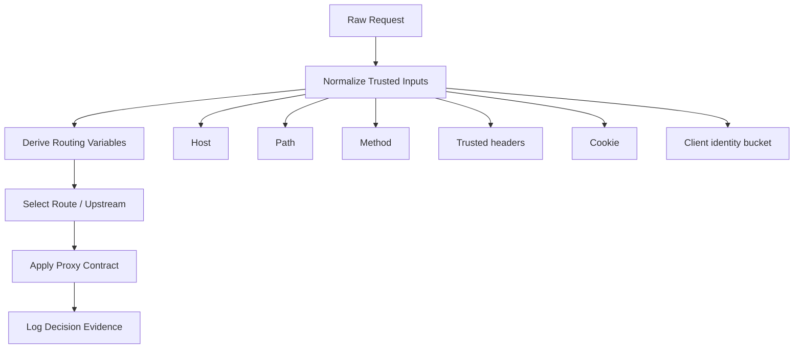
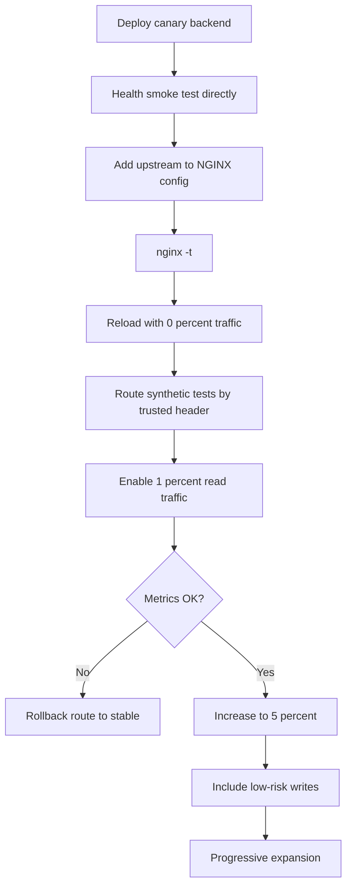

# Part 043 — Request Routing with `map`, `split_clients`, Header, Cookie, and Canary

Routing is where NGINX starts looking like a programming language.

That is exactly why production teams get into trouble.

They begin with one rule:

```nginx
if ($http_x_env = beta) { ... }
```

Then add another:

```nginx
if ($cookie_variant = b) { ... }
```

Then a canary rule, a mobile rule, an internal-user rule, a regional rule, a temporary migration rule, and a partner exception. Six months later, nobody can answer a basic question:

> For this request, which backend will receive traffic, and why?

This part is about routing discipline.

NGINX can route by host, path, method, header, cookie, IP, query parameter, random-ish percentage bucket, and derived variables. The skill is not knowing that these inputs exist. The skill is designing routing as an explicit, auditable, deterministic policy system.

---

## 1. The production mental model

Request routing should be treated as a decision table.

Not a pile of conditions.

Not a hidden script.

Not an emergency patch added under pressure.

A production routing system has five components:



Each step has a responsibility:

| Step | Responsibility |
|---|---|
| Normalize inputs | Convert messy request facts into bounded values. |
| Derive variables | Use `map`, `geo`, `split_clients`, or routing labels. |
| Select route | Choose upstream, location, cache policy, auth policy, or feature flag. |
| Apply proxy contract | Set headers, timeouts, retries, buffering, and error handling. |
| Log evidence | Emit enough data to explain why a request went where it went. |

The invariant:

> NGINX routing must be explainable from config and logs without reading application code.

---

## 2. What not to do: condition soup

A common anti-pattern:

```nginx
location /api/ {
    if ($http_x_canary = "1") {
        proxy_pass http://api_canary;
    }

    if ($cookie_beta = "true") {
        proxy_pass http://api_beta;
    }

    if ($http_user_agent ~* "Mobile") {
        proxy_pass http://api_mobile;
    }

    proxy_pass http://api_stable;
}
```

This looks intuitive if you think like an application developer.

It is not a good NGINX design.

Problems:

1. The precedence is implicit.
2. The fallback is unclear.
3. Multiple conditions can be true.
4. Reviewers cannot see the full decision table.
5. Logs usually do not show which condition won.
6. A future edit can silently change routing semantics.
7. `if` inside `location` has sharp edges and is rarely the right primitive for policy routing.

A better structure:

```nginx
map $http_x_canary $route_from_header {
    default stable;
    "1"     canary;
}

map $cookie_beta $route_from_cookie {
    default "";
    "true"  beta;
}

map "$route_from_cookie:$route_from_header" $api_route {
    default         stable;
    "beta:stable"  beta;
    "beta:canary"  beta;
    ":canary"      canary;
}

map $api_route $api_upstream {
    default http://api_stable;
    beta    http://api_beta;
    canary  http://api_canary;
}

location /api/ {
    proxy_pass $api_upstream;
}
```

This is not always the final form, but it shows the principle: make routing a table.

---

## 3. Routing input taxonomy

Not every request input deserves equal trust.

| Input | Typical use | Trust level | Notes |
|---|---|---:|---|
| Host | Virtual host selection | Medium | Must be normalized and guarded by default server. |
| Path | API/resource routing | High | After NGINX parsing, still beware encoded path ambiguity. |
| Method | Read/write policy | High | Use for routing sparingly; useful for rate/auth policy. |
| Cookie | User stickiness, feature bucket | Low/Medium | Client-controlled unless signed/enforced by app. |
| Header | Canary, internal routing, auth context | Low by default | Trust only if set by a trusted upstream hop. |
| Query parameter | Debug/preview | Low | Usually bad for durable routing. |
| IP/CIDR | internal/external segmentation | Medium | Correct only after real IP trust boundary is fixed. |
| Random percentage | canary, A/B test | Deterministic if key stable | Use stable identity key, not request-random. |

Key rule:

> A client-controlled header is not an authorization signal.

A header may be useful for routing only when it is introduced or sanitized by a trusted layer. For example, a private gateway may inject `X-Internal-Tenant`, but the public edge must first remove any user-supplied version of that header.

```nginx
proxy_set_header X-Internal-Tenant "";
proxy_set_header X-Internal-Tenant $trusted_tenant;
```

Or better, avoid sending ambiguous client-authored internal headers at all.

---

## 4. `map` as a routing table

`map` creates a variable based on one or more source variables.

Basic shape:

```nginx
map $http_x_api_version $api_version {
    default v1;
    "2"     v2;
    "v2"    v2;
}
```

Then use it later:

```nginx
map $api_version $api_upstream {
    default http://api_v1;
    v2      http://api_v2;
}

location /api/ {
    proxy_pass $api_upstream;
}
```

The important mental model:

> `map` is declarative variable derivation, not imperative branching.

The declaration can be large without directly adding per-request cost until the resulting variable is actually used. This makes `map` a good primitive for production policy tables.

---

## 5. `map` matching priority

`map` has its own matching rules.

The priority is:

1. exact string without mask;
2. longest prefix mask, such as `*.example.com`;
3. longest suffix mask, such as `mail.*`;
4. first matching regex in file order;
5. `default`.

Example:

```nginx
map $host $tenant_group {
    hostnames;

    default            unknown;
    api.example.com    api;
    *.example.com      public_subdomain;
    admin.*            admin_pattern;
    ~^dev-[a-z0-9-]+\.example\.com$ dev;
}
```

For `$host = api.example.com`, exact string wins.

For `$host = blog.example.com`, longest prefix mask may win.

For `$host = admin.internal`, suffix mask may win.

For regex, order matters.

So do not scatter regex entries randomly in included files. Treat them like firewall rules: first match wins.

---

## 6. Hostname routing with `map`

Host-based routing is often better expressed with `server_name`, but `map` is useful when host determines a secondary policy:

- tenant group;
- cache zone selection;
- upstream family;
- CORS policy;
- log namespace;
- security mode;
- feature rollout group.

Example:

```nginx
map $host $tenant_class {
    hostnames;
    default              invalid;
    .customer-a.test     customer_a;
    .customer-b.test     customer_b;
    .preview.internal    preview;
}

map $tenant_class $tenant_cache_mode {
    default     no_cache;
    customer_a  public_static;
    customer_b  public_static;
    preview     no_cache;
}
```

Do not use unconstrained host input directly in filesystem paths or upstream names.

Bad:

```nginx
root /srv/tenants/$host/public;
```

Better:

```nginx
map $host $tenant_root {
    default "";
    app.customer-a.example.com /srv/tenants/customer-a/public;
    app.customer-b.example.com /srv/tenants/customer-b/public;
}

server {
    if ($tenant_root = "") { return 444; }

    root $tenant_root;
}
```

Even better: generate explicit server blocks from a tenant registry when tenant count and compliance requirements justify it.

---

## 7. Header-based routing

Header-based routing is useful for:

- canary testing;
- internal preview environments;
- partner-specific upstreams;
- migration flags;
- protocol translation boundaries;
- regional steering after identity is known.

Example:

```nginx
map $http_x_release_track $release_track {
    default stable;
    stable  stable;
    canary  canary;
}

map $release_track $api_upstream {
    default http://api_stable;
    canary  http://api_canary;
}

location /api/ {
    proxy_set_header X-Release-Track $release_track;
    proxy_pass $api_upstream;
}
```

But there is a trust boundary problem.

A public client can send:

```http
X-Release-Track: canary
```

If that causes privileged routing, you have exposed internal control to the internet.

Safer pattern:

```nginx
map $remote_addr $trusted_network {
    default 0;
    10.0.0.0/8 1;
}
```

`map` itself does not support CIDR matching; for IP ranges use `geo`. Then combine:

```nginx
geo $from_trusted_network {
    default 0;
    10.0.0.0/8 1;
    192.168.0.0/16 1;
}

map "$from_trusted_network:$http_x_release_track" $release_track {
    default      stable;
    "1:canary"  canary;
}
```

Now the header only matters from trusted source networks.

---

## 8. Cookie-based routing

Cookie routing is common for beta users and sticky experiences.

Example:

```nginx
map $cookie_release_track $release_track_from_cookie {
    default "";
    stable  stable;
    canary  canary;
    beta    beta;
}

map $release_track_from_cookie $api_upstream {
    default http://api_stable;
    canary  http://api_canary;
    beta    http://api_beta;
}
```

Cookie-based routing is user-stable, but not inherently trustworthy.

A user can usually edit cookies.

That is fine for harmless beta UI selection. It is not fine for:

- authorization;
- tenant selection;
- billing plan selection;
- admin path access;
- legal/regulatory workflow routing;
- bypassing validation logic.

Invariant:

> Cookie routing can select experience. It must not grant authority.

For security-sensitive behavior, the application or identity layer must validate signed claims and pass a trusted result to NGINX through a controlled channel.

---

## 9. Query-parameter routing

Query-parameter routing is tempting:

```nginx
/api/orders?version=v2
```

It is useful for local debugging and preview links, but poor for durable production routing.

Problems:

- URLs get shared.
- Caches may key incorrectly.
- Observability becomes noisy.
- Users can force paths unintentionally.
- Search bots and clients may preserve parameters.
- API clients may accidentally depend on migration flags.

If you must use query-based routing, put it behind a controlled condition:

```nginx
geo $from_office {
    default 0;
    203.0.113.0/24 1;
}

map "$from_office:$arg_backend" $debug_backend {
    default "";
    "1:v2"  v2;
}
```

And log it aggressively:

```nginx
log_format api_json escape=json
  '{"uri":"$request_uri",'
  '"arg_backend":"$arg_backend",'
  '"debug_backend":"$debug_backend"}';
```

---

## 10. Stable percentage routing with `split_clients`

`split_clients` creates variables suitable for A/B testing or traffic splitting.

Example:

```nginx
split_clients "${remote_addr}${http_user_agent}" $canary_bucket {
    1%      canary;
    *       stable;
}
```

Then:

```nginx
map $canary_bucket $api_upstream {
    default http://api_stable;
    canary  http://api_canary;
}
```

The input string is hashed, and ranges of hash values map to percentages.

Important:

> `split_clients` is deterministic for the same input string.

That means the key matters.

Bad key:

```nginx
split_clients "$request_id" $bucket { ... }
```

This changes per request, so the same user may jump between variants.

Better key:

```nginx
split_clients "$cookie_user_id" $bucket { ... }
```

Or:

```nginx
split_clients "$remote_addr$http_user_agent" $bucket { ... }
```

But each key has trade-offs.

| Key | Stability | Risk |
|---|---:|---|
| `$remote_addr` | medium | NAT groups many users together. |
| `$remote_addr$http_user_agent` | medium | User-agent changes; still NAT-biased. |
| `$cookie_user_id` | high | Requires reliable cookie assignment. |
| authenticated user id header | high | Must come from trusted identity layer. |
| `$request_id` | none | Per-request randomization; bad for user experience. |

---

## 11. Canary routing

Canary is not merely sending 1% of traffic to a new upstream.

A production canary has at least seven controls:

1. percentage;
2. eligibility;
3. route scope;
4. method scope;
5. rollback path;
6. observability label;
7. safety boundaries for writes.

A better canary design:

```nginx
# 1. Eligibility: only API v1 read traffic participates.
map "$request_method:$uri" $canary_eligible {
    default 0;
    ~^GET:/api/catalog/ 1;
    ~^GET:/api/search/  1;
}

# 2. Stable bucketing.
split_clients "$cookie_uid" $canary_bucket {
    2%      canary;
    *       stable;
}

# 3. Final route.
map "$canary_eligible:$canary_bucket" $release_track {
    default      stable;
    "1:canary"  canary;
}

map $release_track $api_upstream {
    default http://api_stable;
    canary  http://api_canary;
}

location /api/ {
    proxy_set_header X-Release-Track $release_track;
    proxy_pass $api_upstream;
}
```

This prevents accidental canarying of all paths and methods.

For high-risk systems, start canary with read-only traffic.

---

## 12. Header override for emergency routing

Operators often need a controlled override.

Example use cases:

- send synthetic tests to canary;
- route internal QA to preview;
- let trusted support reproduce an issue;
- force a small request subset to legacy backend.

Pattern:

```nginx
geo $operator_network {
    default 0;
    10.10.0.0/16 1;
}

map "$operator_network:$http_x_force_backend" $forced_backend {
    default "";
    "1:stable" stable;
    "1:canary" canary;
    "1:legacy" legacy;
}

split_clients "$cookie_uid" $canary_bucket {
    2% canary;
    *  stable;
}

map "$forced_backend:$canary_bucket" $release_track {
    default stable;
    ":canary" canary;
    "stable:stable" stable;
    "stable:canary" stable;
    "canary:stable" canary;
    "canary:canary" canary;
    "legacy:stable" legacy;
    "legacy:canary" legacy;
}
```

This makes override precedence explicit.

Do not let public clients set force headers.

---

## 13. Route selection via variable `proxy_pass`

Using variables in `proxy_pass` is powerful but should be used carefully.

Example:

```nginx
map $release_track $api_target {
    default http://api_stable;
    canary  http://api_canary;
}

location /api/ {
    proxy_pass $api_target;
}
```

This is compact.

But it changes several operational concerns:

1. You need to understand URI replacement semantics with variable `proxy_pass`.
2. You may need runtime DNS resolution if the variable contains a hostname not statically resolved.
3. You must ensure the variable cannot become arbitrary user-controlled URL.
4. Some proxy behaviors are less obvious to future maintainers.

Safer when possible:

```nginx
location /api/ {
    error_page 418 = @api_canary;

    if ($release_track = canary) { return 418; }

    proxy_pass http://api_stable;
}

location @api_canary {
    proxy_pass http://api_canary;
}
```

But this uses `if` as a controlled terminator via `return`, not as arbitrary imperative mutation. Still, for many teams, a map-to-variable target is clearer if heavily validated.

A robust compromise:

```nginx
map $release_track $api_upstream_name {
    default api_stable;
    canary  api_canary;
}

map $api_upstream_name $api_target {
    default http://api_stable;
    api_stable http://api_stable;
    api_canary http://api_canary;
}
```

The first map expresses domain state. The second map restricts target values.

---

## 14. Routing by API version

There are several API versioning strategies:

| Strategy | Example | Edge routing complexity |
|---|---|---:|
| path version | `/v1/orders` | low |
| header version | `X-API-Version: 2` | medium |
| media type | `Accept: application/vnd.app.v2+json` | medium/high |
| host version | `v2.api.example.com` | low/medium |
| implicit user rollout | cookie/identity bucket | medium/high |

Path version is easiest for NGINX:

```nginx
location /v1/ {
    proxy_pass http://api_v1/;
}

location /v2/ {
    proxy_pass http://api_v2/;
}
```

Header version needs a map:

```nginx
map $http_x_api_version $api_version {
    default v1;
    "2"     v2;
    "v2"    v2;
}

map $api_version $versioned_api {
    default http://api_v1;
    v2      http://api_v2;
}

location /api/ {
    proxy_set_header X-Resolved-API-Version $api_version;
    proxy_pass $versioned_api;
}
```

The edge should not silently guess too much.

When clients send invalid versions, prefer explicit error:

```nginx
map $http_x_api_version $api_version_valid {
    default 0;
    ""  1;
    "1" 1;
    "2" 1;
}

server {
    if ($api_version_valid = 0) { return 400; }
}
```

Again: `if` with `return` is a controlled guard.

---

## 15. Routing by method

Method-based routing is useful for policy, not usually for service ownership.

Good uses:

- stricter rate limits for writes;
- no retry for writes;
- cache only GET/HEAD;
- route read-only synthetic canary;
- block unsupported methods at edge.

Example:

```nginx
map $request_method $is_write_method {
    default 1;
    GET     0;
    HEAD    0;
    OPTIONS 0;
}

map $is_write_method $retry_policy {
    default no_retry;
    0       safe_retry;
}
```

Then apply policy with separate locations or generated snippets:

```nginx
location /api/ {
    include snippets/proxy-common.conf;

    # Use conservative default here.
    proxy_next_upstream error timeout;
    proxy_next_upstream_tries 1;

    proxy_pass http://api_backend;
}
```

NGINX cannot easily make every directive value dynamic. Sometimes the right design is not one clever location, but multiple explicit locations or generated config.

---

## 16. Route labels for observability

Every routing decision should be logged.

Example:

```nginx
log_format api_json escape=json
  '{'
  '"ts":"$time_iso8601",'
  '"request":"$request",'
  '"status":$status,'
  '"host":"$host",'
  '"uri":"$uri",'
  '"route":"$api_route",'
  '"release_track":"$release_track",'
  '"upstream":"$upstream_addr",'
  '"upstream_status":"$upstream_status",'
  '"request_time":$request_time,'
  '"upstream_response_time":"$upstream_response_time"'
  '}';
```

Without route labels, canary debugging becomes guesswork.

Minimum useful fields:

| Field | Why |
|---|---|
| `$host` | confirms virtual host. |
| `$uri` / `$request_uri` | confirms normalized vs raw request target. |
| route variable | explains routing decision. |
| release/canary bucket | explains rollout membership. |
| `$upstream_addr` | shows actual peer. |
| `$upstream_status` | shows retry chain status. |
| `$request_time` | total edge time. |
| `$upstream_response_time` | upstream timing chain. |

---

## 17. Config layout for routing tables

As routing grows, file layout matters.

Recommended structure:

```text
/etc/nginx/
  nginx.conf
  conf.d/
    00-log-format.conf
    10-upstreams.conf
    20-routing-maps.conf
    30-security-maps.conf
    40-servers.conf
  snippets/
    proxy-common.conf
    api-timeouts.conf
    api-headers.conf
```

`map` blocks live in `http` context. Do not bury them inside server blocks.

A good convention:

- `20-routing-maps.conf` derives route labels;
- `30-security-maps.conf` derives security policy labels;
- server blocks consume labels;
- locations apply proxy behavior;
- log format emits labels.

This makes review easier.

---

## 18. Generated routing config

At scale, hand-maintained maps become dangerous.

Example tenant routing table:

```nginx
map $host $tenant_id {
    default "";
    tenant-a.example.com tenant_a;
    tenant-b.example.com tenant_b;
    tenant-c.example.com tenant_c;
}
```

If this is generated from a registry, validate the registry before rendering NGINX config.

Validation rules:

1. Hostnames must be lowercase canonical names.
2. No duplicate hostnames.
3. No wildcard unless explicitly allowed.
4. No empty upstream target.
5. No user-provided value becomes raw NGINX syntax.
6. Rendered config must pass `nginx -t`.
7. Smoke tests must verify a sample of routes.
8. Rollback artifact must exist before reload.

This is where platform engineering begins: NGINX config is an artifact, not a pet file edited manually on a server.

---

## 19. Canary rollout workflow

A real rollout should be boring.

Example workflow:



Never start with all traffic.

Never start with write-heavy routes.

Never use canary without clear rollback.

A good rollback is a config change that maps all traffic to stable:

```nginx
map $anything $release_track {
    default stable;
}
```

This is crude but effective during incidents.

---

## 20. Shadow traffic warning

Teams sometimes ask: can NGINX duplicate production requests to another backend for shadow testing?

NGINX has modules and patterns for mirroring in some distributions/modules, but shadowing is dangerous for writes.

A mirrored request can:

- execute side effects;
- create duplicate records;
- send emails;
- mutate state;
- trigger fraud/risk workflows;
- pollute analytics;
- violate data minimization rules.

The safer model:

- shadow only GET/HEAD first;
- add an explicit header like `X-Shadow-Request: 1`;
- shadow backend must enforce read-only/no-side-effect mode;
- scrub sensitive data where required;
- exclude auth/session mutation routes;
- isolate logs and metrics;
- never mirror payment, enforcement, notification, case mutation, or regulatory decision endpoints without application-level safeguards.

For most teams, canary is safer than blind shadowing.

---

## 21. Decision matrix

| Need | Prefer | Avoid |
|---|---|---|
| route by host/path | `server_name`, `location` | generic variable proxy unless needed |
| derive route from header/cookie | `map` | nested `if` chains |
| percentage rollout | `split_clients` with stable key | per-request random key |
| internal override | trusted header + source check | public client-controlled header |
| tenant routing | generated explicit table | raw `$host` in path/upstream |
| canary writes | application idempotency + careful route scope | edge-only retry/canary magic |
| explain decisions | route labels in logs | hidden implicit selection |

---

## 22. Production checklist

Before shipping routing config, ask:

1. Is the routing precedence obvious?
2. Is every input classified by trust level?
3. Are client-controlled headers sanitized or ignored?
4. Are invalid values rejected or mapped to a safe default?
5. Are upstream names constrained to a whitelist?
6. Is canary eligibility scoped by path/method?
7. Is the percentage key stable per user/session?
8. Can operators force stable routing during incident?
9. Are route decisions visible in access logs?
10. Does `nginx -T` show a reviewable complete policy table?
11. Are maps generated from a validated registry if large?
12. Does rollback require only one safe config change?
13. Are writes protected from duplicate execution?
14. Are route labels propagated to upstream for debugging?
15. Are tests covering expected and unexpected inputs?

---

## 23. What to remember

- Routing must be a decision table, not condition soup.
- `map` is the main primitive for readable derived routing variables.
- `split_clients` is deterministic for the same input string; choose the key carefully.
- Header and cookie routing are useful but not inherently trustworthy.
- Canary needs eligibility, percentage, observability, and rollback.
- Variable `proxy_pass` is powerful but must be constrained.
- Every route decision should be visible in logs.
- Generated config is often safer than hand-maintained giant maps when scale grows.

Next, we will widen the lens from routing mechanics to API Gateway patterns: how NGINX can act as a policy edge for APIs without pretending to be a full application platform.
