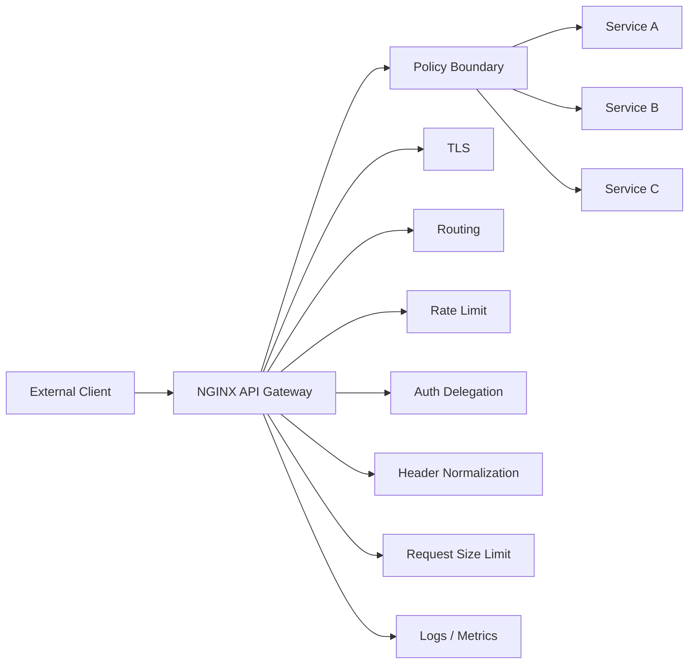
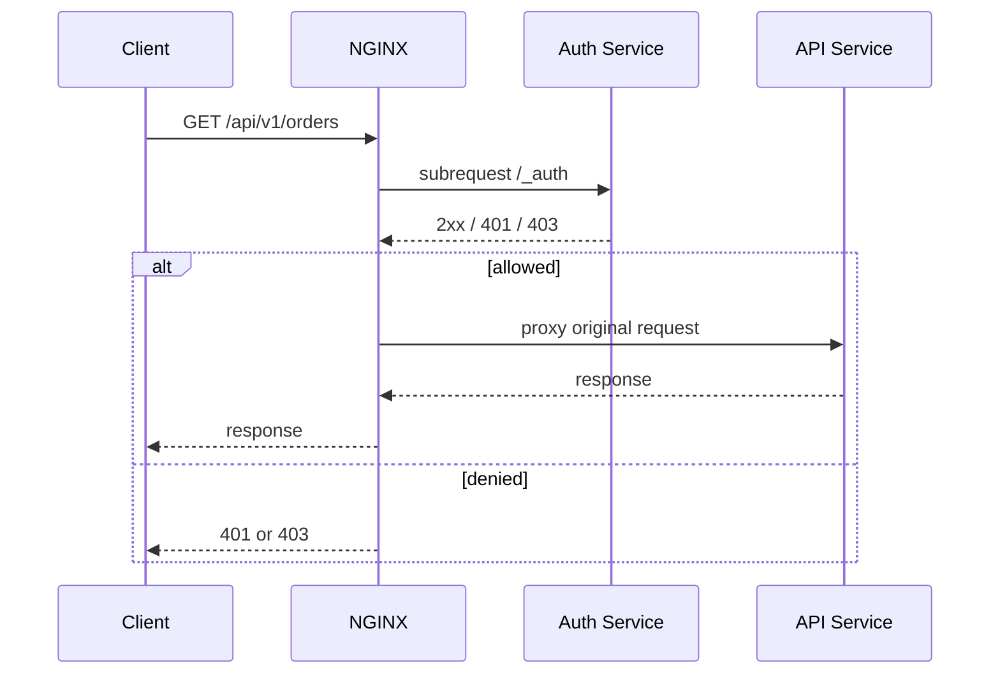
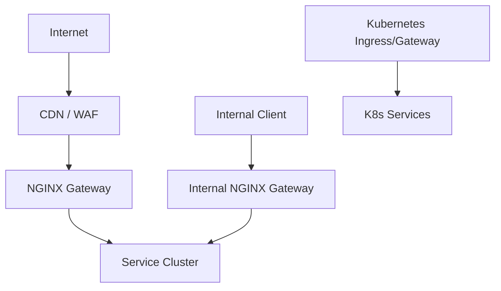

# Part 044 — API Gateway Patterns with NGINX: Routing, Shielding, and Policy Edge

NGINX can be used as an API gateway.

But that sentence is easy to misunderstand.

NGINX Open Source is not automatically a full API management platform. It does not magically provide developer portals, API product lifecycle, quota billing, schema governance, analytics UI, OAuth consent, distributed plugin systems, or fleet-wide control plane semantics.

What it does provide very well is a fast, predictable, configurable policy edge for HTTP traffic.

A strong NGINX API gateway design uses NGINX for what it is good at:

- listener and virtual host control;
- TLS termination;
- request routing;
- reverse proxying;
- header normalization;
- rate limiting;
- body size limits;
- request buffering;
- response buffering;
- caching where safe;
- delegated auth checks;
- basic access control;
- consistent logs;
- controlled error envelopes;
- upstream isolation;
- failure boundary enforcement.

It does not turn NGINX into a business rules engine.

The most important production principle:

> NGINX should enforce edge contracts. Applications should own domain semantics.

---

## 1. API gateway mental model

An API gateway sits between clients and services.

Its job is not simply “forward requests.”

Its job is to convert an uncontrolled external request into a bounded internal request.



The gateway should answer these questions before a request reaches the service:

1. Is this host/path/method valid?
2. Is the request too large?
3. Is the client allowed to make this category of request?
4. Is the request rate acceptable?
5. Which service owns this route?
6. What upstream contract should be used?
7. What headers are allowed to cross the boundary?
8. How long may the request occupy resources?
9. What should be logged for audit and debugging?
10. What is the fallback behavior when the service fails?

If NGINX cannot answer a question cleanly, that is a design signal. Maybe the application, identity provider, service mesh, API management platform, or control plane should own it instead.

---

## 2. API gateway is a boundary, not a shortcut

A weak gateway hides system complexity behind one endpoint.

A strong gateway reduces uncontrolled complexity before it hits internal services.

Bad model:

```text
Client -> NGINX -> random backend behavior
```

Good model:

```text
Client -> NGINX contract -> service contract
```

The gateway contract includes:

| Contract | Example |
|---|---|
| public route | `/api/v1/orders` |
| allowed methods | `GET`, `POST` |
| request size | `1m` for JSON, larger only for upload routes |
| timeout | 2s for read, 10s for specific long operations |
| auth mode | external auth subrequest, mTLS, Basic for internal tools, app-owned JWT |
| rate limit key | user id, API key, IP, tenant, or route |
| retry policy | only safe idempotent reads |
| buffering | on for normal JSON APIs, off for streaming |
| error handling | gateway errors distinguishable from app errors |
| logs | route, upstream, auth result, latency, request id |

This is why API gateway config should be reviewed like application code.

---

## 3. Reference config skeleton

A simple but disciplined skeleton:

```nginx
http {
    log_format api_json escape=json
      '{'
      '"ts":"$time_iso8601",'
      '"request_id":"$request_id",'
      '"remote_addr":"$remote_addr",'
      '"host":"$host",'
      '"method":"$request_method",'
      '"uri":"$request_uri",'
      '"route":"$api_route",'
      '"status":$status,'
      '"upstream":"$upstream_addr",'
      '"upstream_status":"$upstream_status",'
      '"request_time":$request_time,'
      '"upstream_response_time":"$upstream_response_time"'
      '}';

    upstream orders_api {
        server 10.0.1.10:8080;
        server 10.0.1.11:8080;
        keepalive 64;
    }

    upstream catalog_api {
        server 10.0.2.10:8080;
        server 10.0.2.11:8080;
        keepalive 64;
    }

    map $uri $api_route {
        default unknown;
        ~^/api/v1/orders(/|$)  orders;
        ~^/api/v1/catalog(/|$) catalog;
    }

    server {
        listen 443 ssl http2;
        server_name api.example.com;

        access_log /var/log/nginx/api.access.json api_json;

        location /api/v1/orders/ {
            include snippets/api-common.conf;
            proxy_pass http://orders_api;
        }

        location /api/v1/catalog/ {
            include snippets/api-common.conf;
            proxy_pass http://catalog_api;
        }

        location / {
            return 404;
        }
    }
}
```

`snippets/api-common.conf`:

```nginx
proxy_http_version 1.1;
proxy_set_header Connection "";

proxy_set_header Host $host;
proxy_set_header X-Request-ID $request_id;
proxy_set_header X-Forwarded-For $proxy_add_x_forwarded_for;
proxy_set_header X-Forwarded-Proto $scheme;
proxy_set_header X-Forwarded-Host $host;

client_max_body_size 1m;

proxy_connect_timeout 1s;
proxy_send_timeout 5s;
proxy_read_timeout 5s;

proxy_next_upstream error timeout http_502 http_503 http_504;
proxy_next_upstream_tries 2;
proxy_next_upstream_timeout 3s;
```

This is not complete for every system. It is a baseline shape.

---

## 4. Route ownership

Every public route should have one owner.

A gateway with ambiguous ownership becomes a shared dumping ground.

Route registry example:

| Public route | Owner | Upstream | Auth | Timeout | Retry | Rate limit |
|---|---|---|---|---:|---|---|
| `/api/v1/orders/` | Orders team | `orders_api` | user auth | 5s | safe reads only | user+route |
| `/api/v1/catalog/` | Catalog team | `catalog_api` | optional user | 3s | reads | IP+route |
| `/api/v1/files/upload/` | Files team | `files_api` | user auth | 60s | none | user |
| `/api/v1/admin/` | Platform | `admin_api` | mTLS + auth | 5s | none | strict |

Generated NGINX config should ideally come from this kind of registry.

Manual route config tends to drift.

---

## 5. Host and path normalization

The gateway should reject unknown entry points.

```nginx
server {
    listen 443 ssl default_server;
    server_name _;
    return 444;
}

server {
    listen 443 ssl http2;
    server_name api.example.com;

    location /api/v1/ { ... }
    location / { return 404; }
}
```

Do not pass unknown paths to a generic backend unless that backend is intentionally the router.

Bad:

```nginx
location / {
    proxy_pass http://monolith;
}
```

This preserves accidental APIs forever.

Better:

```nginx
location /api/v1/orders/ { proxy_pass http://orders_api; }
location /api/v1/catalog/ { proxy_pass http://catalog_api; }
location / { return 404; }
```

For large APIs, generate route blocks. Do not make one vague catch-all the permanent architecture.

---

## 6. Method policy

Block methods you do not support.

```nginx
map $request_method $method_allowed {
    default 0;
    GET     1;
    HEAD    1;
    POST    1;
    PUT     1;
    PATCH   1;
    DELETE  1;
    OPTIONS 1;
}

server {
    if ($method_allowed = 0) { return 405; }
}
```

For specific routes, be stricter:

```nginx
location /api/v1/catalog/ {
    limit_except GET HEAD OPTIONS {
        deny all;
    }

    include snippets/api-common.conf;
    proxy_pass http://catalog_api;
}
```

Be careful: method policy at edge must align with application behavior. Returning 405 at NGINX is useful only when the API contract is clear.

---

## 7. Request size shielding

Request body limits are one of the simplest and most effective gateway controls.

Global default:

```nginx
client_max_body_size 1m;
```

Upload route override:

```nginx
location /api/v1/files/upload/ {
    client_max_body_size 100m;
    proxy_request_buffering on;
    proxy_pass http://files_api;
}
```

Why not set `100m` globally?

Because every route would then permit large request bodies, including login, search, metadata update, and webhook endpoints.

Better invariant:

> Large body allowance is route-specific.

For JSON APIs, small limits protect upstream CPU, memory, disk, and parser paths.

---

## 8. Header normalization and internal headers

The gateway must control what identity and routing headers enter the system.

Recommended approach:

```nginx
proxy_set_header X-Request-ID $request_id;
proxy_set_header X-Forwarded-For $proxy_add_x_forwarded_for;
proxy_set_header X-Forwarded-Proto $scheme;
proxy_set_header X-Forwarded-Host $host;
```

For internal-only headers, do not forward client-supplied values blindly.

Bad:

```nginx
proxy_set_header X-User-ID $http_x_user_id;
```

Better:

```nginx
proxy_set_header X-User-ID "";
```

Or set it only from a trusted auth subrequest result:

```nginx
auth_request /_auth;
auth_request_set $auth_user $upstream_http_x_auth_user;
proxy_set_header X-Authenticated-User $auth_user;
```

The gateway should create a clean internal request, not preserve every client claim.

---

## 9. Authentication delegation with `auth_request`

The `auth_request` module lets NGINX perform authorization based on a subrequest.

Conceptually:



Example:

```nginx
location = /_auth {
    internal;
    proxy_pass http://auth_service/validate;
    proxy_pass_request_body off;
    proxy_set_header Content-Length "";
    proxy_set_header X-Original-URI $request_uri;
    proxy_set_header X-Original-Method $request_method;
}

location /api/v1/orders/ {
    auth_request /_auth;
    auth_request_set $auth_user $upstream_http_x_auth_user;

    proxy_set_header X-Authenticated-User $auth_user;
    proxy_pass http://orders_api;
}
```

Important boundaries:

- NGINX delegates the decision.
- The auth service owns identity interpretation.
- The application should still enforce domain authorization for high-risk operations.
- Cache auth subrequests only with extreme care.
- Timeouts for auth must be small and explicit.
- Auth failure must be observable separately from upstream failure.

---

## 10. Auth is not only “is logged in”

API authorization often has layers:

| Layer | Example owner |
|---|---|
| TLS client identity | NGINX / platform |
| authentication | identity provider / auth service |
| coarse route access | gateway/auth service |
| tenant membership | app/auth service |
| object-level permission | application |
| workflow transition permission | application/domain engine |
| audit obligation | application + gateway logs |

NGINX can help with coarse checks.

It should not usually decide whether user A can approve case B in workflow state C.

That belongs to the domain system.

For regulatory or enforcement platforms, this distinction matters. Edge authorization without domain state creates false confidence.

---

## 11. Rate limiting as gateway shielding

Rate limiting protects upstream systems from excessive request rates.

Basic shape:

```nginx
limit_req_zone $binary_remote_addr zone=per_ip:10m rate=10r/s;

server {
    location /api/ {
        limit_req zone=per_ip burst=20 nodelay;
        proxy_pass http://api_backend;
    }
}
```

But per-IP rate limiting is often too blunt:

- NAT can group many users behind one IP.
- Attackers can rotate IPs.
- Internal services may share egress IPs.
- Premium tenants may need different quotas.

Better keys when available:

```nginx
limit_req_zone $auth_user zone=per_user:20m rate=5r/s;
limit_req_zone $api_key zone=per_key:20m rate=20r/s;
limit_req_zone $tenant_id zone=per_tenant:20m rate=100r/s;
```

But keys must be non-empty and trustworthy.

Use maps to avoid collapsing anonymous users into one empty-key bucket unintentionally:

```nginx
map $auth_user $rate_key_user {
    default $auth_user;
    ""      $binary_remote_addr;
}

limit_req_zone $rate_key_user zone=user_or_ip:20m rate=10r/s;
```

---

## 12. Rate limit dry run and rollout

Rate limits can cause outages if enabled aggressively.

A safer rollout:

1. log candidate keys;
2. enable `limit_req_dry_run on` where available;
3. inspect would-be rejected traffic;
4. set conservative burst;
5. exclude health checks and internal control routes;
6. deploy per-route, not globally;
7. alert on 429/503 changes;
8. adjust clients to honor retry behavior.

Example:

```nginx
limit_req_zone $binary_remote_addr zone=api_ip:20m rate=20r/s;

location /api/v1/search/ {
    limit_req_dry_run on;
    limit_req zone=api_ip burst=50;
    proxy_pass http://search_api;
}
```

Then turn off dry run after validation:

```nginx
limit_req_dry_run off;
```

A rate limit without observability is a hidden partial outage.

---

## 13. CORS at the API gateway

CORS is a browser security contract, not a backend authentication system.

For APIs, gateway-level CORS can be useful when:

- routes share one public host;
- allowed origins are centrally managed;
- preflight requests should not hit upstream;
- auth and cookies are standardized.

Example pattern:

```nginx
map $http_origin $cors_origin {
    default "";
    "https://app.example.com" $http_origin;
    "https://admin.example.com" $http_origin;
}

location /api/ {
    if ($request_method = OPTIONS) {
        add_header Access-Control-Allow-Origin $cors_origin always;
        add_header Access-Control-Allow-Credentials "true" always;
        add_header Access-Control-Allow-Methods "GET,POST,PUT,PATCH,DELETE,OPTIONS" always;
        add_header Access-Control-Allow-Headers "Authorization,Content-Type,X-Request-ID" always;
        add_header Access-Control-Max-Age 600 always;
        return 204;
    }

    add_header Access-Control-Allow-Origin $cors_origin always;
    add_header Access-Control-Allow-Credentials "true" always;

    proxy_pass http://api_backend;
}
```

Do not combine credentialed CORS with wildcard origin.

And do not confuse CORS with access control. Non-browser clients are not constrained by CORS.

---

## 14. API versioning at the gateway

Versioning can be represented at the edge, but ownership must remain clear.

Path-based versioning:

```nginx
location /api/v1/orders/ { proxy_pass http://orders_v1; }
location /api/v2/orders/ { proxy_pass http://orders_v2; }
```

Header-based versioning:

```nginx
map $http_x_api_version $orders_upstream {
    default http://orders_v1;
    "2"     http://orders_v2;
}

location /api/orders/ {
    proxy_set_header X-Resolved-API-Version $http_x_api_version;
    proxy_pass $orders_upstream;
}
```

Gateway versioning is useful for traffic steering. It does not replace schema compatibility, client lifecycle management, or deprecation policy.

A mature API gateway config should include explicit deprecation headers where needed:

```nginx
location /api/v1/legacy/ {
    add_header Deprecation "true" always;
    add_header Sunset "Wed, 31 Dec 2026 23:59:59 GMT" always;
    proxy_pass http://legacy_api;
}
```

---

## 15. Response shaping and error boundaries

Gateway-generated errors should be distinguishable from application errors.

Example:

```nginx
proxy_intercept_errors on;
error_page 502 503 504 = @gateway_error;

location @gateway_error {
    internal;
    default_type application/json;
    add_header X-Error-Origin gateway always;
    return 503 '{"error":"service_unavailable","origin":"gateway"}\n';
}
```

This is useful for clients and observability.

But do not over-shape every application error at the gateway. If the application returns a domain-specific validation error, the gateway should usually pass it through.

Boundary:

| Error type | Owner |
|---|---|
| invalid route | gateway |
| body too large | gateway |
| rate limited | gateway |
| auth gateway failure | gateway/auth service |
| upstream unavailable | gateway as wrapper |
| domain validation | application |
| object permission denied | application/domain auth |
| workflow transition invalid | application |

---

## 16. Caching API responses

API caching can be powerful and dangerous.

Good candidates:

- public catalog data;
- documentation metadata;
- read-only reference data;
- expensive GET responses with clear cache keys;
- responses independent of user identity.

Bad candidates:

- user dashboards;
- personalized regulatory case lists;
- authorization-dependent resources;
- mutable workflow state;
- responses with `Set-Cookie`;
- endpoints where stale data causes business harm.

A safe pattern:

```nginx
proxy_cache_path /var/cache/nginx/api levels=1:2 keys_zone=api_cache:100m inactive=10m max_size=5g;

map $request_method $cacheable_method {
    default 0;
    GET 1;
    HEAD 1;
}

map $upstream_http_set_cookie $has_set_cookie {
    default 1;
    "" 0;
}

location /api/v1/catalog/ {
    proxy_cache api_cache;
    proxy_cache_methods GET HEAD;
    proxy_cache_bypass $http_authorization;
    proxy_no_cache $http_authorization $has_set_cookie;
    add_header X-Cache-Status $upstream_cache_status always;
    proxy_pass http://catalog_api;
}
```

For authenticated APIs, assume no edge cache until proven safe.

---

## 17. API gateway observability

A gateway is often the best place to get consistent traffic evidence.

Minimum API log fields:

```nginx
log_format api_json escape=json
  '{'
  '"ts":"$time_iso8601",'
  '"request_id":"$request_id",'
  '"remote_addr":"$remote_addr",'
  '"method":"$request_method",'
  '"host":"$host",'
  '"uri":"$request_uri",'
  '"route":"$api_route",'
  '"status":$status,'
  '"body_bytes_sent":$body_bytes_sent,'
  '"request_length":$request_length,'
  '"request_time":$request_time,'
  '"upstream_addr":"$upstream_addr",'
  '"upstream_status":"$upstream_status",'
  '"upstream_connect_time":"$upstream_connect_time",'
  '"upstream_header_time":"$upstream_header_time",'
  '"upstream_response_time":"$upstream_response_time",'
  '"http_referer":"$http_referer",'
  '"user_agent":"$http_user_agent"'
  '}';
```

For API gateway operations, dashboards should separate:

- NGINX-generated 4xx;
- upstream-generated 4xx;
- NGINX 499 client disconnects;
- NGINX 502/503/504 upstream failure;
- upstream latency;
- total request latency;
- rate-limit rejects;
- auth rejects;
- per-route traffic;
- per-upstream retries.

Do not treat all 4xx as the same. A 401 from auth, 413 from NGINX, 404 from gateway, and 422 from app mean different things.

---

## 18. Multi-service upstream isolation

A gateway should prevent one service's failure from damaging all routes.

Isolation controls:

| Control | Why |
|---|---|
| separate upstream groups | isolate peer pools. |
| route-specific timeouts | slow route does not define global timeout. |
| route-specific body limits | upload route does not loosen all APIs. |
| route-specific rate limits | noisy endpoint does not consume all quota. |
| route-specific retries | unsafe writes are not retried globally. |
| separate logs/labels | incident blast radius is visible. |
| separate cache policy | one route cannot poison another. |

Example:

```nginx
location /api/v1/search/ {
    proxy_read_timeout 2s;
    limit_req zone=search burst=100 nodelay;
    proxy_pass http://search_api;
}

location /api/v1/reports/export/ {
    proxy_read_timeout 60s;
    limit_req zone=exports burst=5;
    proxy_buffering off;
    proxy_pass http://reports_api;
}
```

This is better than a single `/api/` location with one generic policy.

---

## 19. Gateway anti-patterns

### Anti-pattern 1: One giant location

```nginx
location /api/ {
    proxy_pass http://all_services;
}
```

This hides ownership and policy.

### Anti-pattern 2: Public headers as authority

```nginx
proxy_set_header X-Tenant-ID $http_x_tenant_id;
```

This forwards untrusted claims.

### Anti-pattern 3: Global large body limit

```nginx
client_max_body_size 500m;
```

This allows every endpoint to receive giant payloads.

### Anti-pattern 4: Global retries

```nginx
proxy_next_upstream error timeout http_500 http_502 http_503 http_504 non_idempotent;
```

This can duplicate writes.

### Anti-pattern 5: Gateway as domain brain

If NGINX config starts encoding complex business workflow transitions, stop.

Put that logic in the application/domain engine.

---

## 20. Open Source vs Plus/API Management boundary

NGINX Open Source can cover many API gateway primitives:

- routing;
- reverse proxy;
- TLS;
- rate limiting;
- request size limits;
- basic auth;
- auth subrequest if module is built;
- caching;
- logs;
- passive upstream failure handling.

NGINX Plus and related F5 products can add capabilities depending on edition/module:

- active health checks;
- richer live activity monitoring/API;
- JWT validation module;
- key-value store capabilities;
- advanced session persistence;
- dynamic upstream management;
- commercial support;
- WAF integrations;
- enterprise API gateway packaging.

The architectural question is not “can NGINX do it?”

The better question:

> Can this capability be operated safely by our team with our deployment model, incident process, and compliance requirements?

For some organizations, NGINX Open Source plus generated config is enough.

For others, the missing control plane becomes the real cost.

---

## 21. API gateway deployment topology

Common topologies:



Design choices:

| Topology | Strength | Risk |
|---|---|---|
| edge VM gateway | simple, explicit | manual scaling/config drift if unmanaged |
| containerized gateway | portable | config reload and networking need care |
| Kubernetes Ingress | integrates with services | annotation sprawl, controller-specific behavior |
| Gateway API | cleaner resource model | still evolving operational maturity |
| CDN + NGINX | layered defense | header/trust boundary complexity |
| service mesh + NGINX | east/west + north/south split | policy duplication |

NGINX can sit in several places. Do not reuse the same policy assumptions everywhere.

A public edge gateway and an internal service gateway have different threat models.

---

## 22. Operational playbook

### Symptom: sudden 404 spike

Check:

1. Did a route disappear from generated config?
2. Did location matching precedence change?
3. Did host normalization reject traffic?
4. Did path rewrite change URI before proxy?
5. Are requests hitting default server?

### Symptom: sudden 413 spike

Check:

1. Was `client_max_body_size` reduced?
2. Did clients start sending larger payloads?
3. Did upload route lose its override?
4. Are proxies/CDNs adding body constraints earlier?

### Symptom: sudden 401/403 spike

Check:

1. Is auth service healthy?
2. Did `auth_request` timeout?
3. Did upstream auth headers change?
4. Are cookies/Authorization headers reaching NGINX?
5. Did clock/certificate/JWKS rotation break auth service?

### Symptom: sudden 429 spike

Check:

1. Which rate limit zone fired?
2. Which key is used?
3. Are many users collapsing into one key?
4. Did NAT/egress change?
5. Did a client retry loop begin?
6. Did dry-run evidence predict this?

### Symptom: sudden 502/504 spike

Check:

1. `$upstream_addr` and `$upstream_status` chains.
2. connect vs header vs response time.
3. recent upstream deploy.
4. keepalive stale connection behavior.
5. DNS/service discovery changes.
6. retry attempts and retry budget.

---

## 23. Production checklist

Before calling an NGINX deployment an API gateway, verify:

1. Unknown hosts are rejected.
2. Unknown paths are not silently proxied.
3. Every route has an owner.
4. Every route has method policy.
5. Body size limits are route-specific.
6. Auth boundary is explicit.
7. Internal identity headers are sanitized.
8. Rate limits have safe keys.
9. Rate limit rollout has dry-run or equivalent observation.
10. Retry policy is safe for route semantics.
11. Timeouts are route-specific.
12. CORS is allowlisted and credential-safe.
13. Cache is disabled by default for authenticated APIs.
14. Gateway errors are distinguishable from app errors.
15. Logs include route, upstream, status, and timing.
16. Config is validated with `nginx -t` in CI.
17. Rollback artifact exists before reload.
18. Route registry and generated config are auditable.
19. Ownership is clear across platform and app teams.
20. The gateway is not encoding domain workflow logic.

---

## 24. What to remember

- NGINX can be an excellent API policy edge.
- An API gateway should bound requests before they hit services.
- Route ownership and policy ownership must be explicit.
- Header normalization is a security boundary.
- `auth_request` delegates authorization; it does not replace domain permission checks.
- Rate limiting is shielding, not a substitute for capacity planning.
- Cache authenticated APIs only when correctness is proven.
- Logs must make gateway decisions explainable.
- NGINX Open Source is powerful, but API management/control-plane needs may require additional tooling.

Next, we will turn this into a complete reverse proxy production lab: multiple backends, route policy, headers, timeouts, logs, canary routing, and failure injection.
