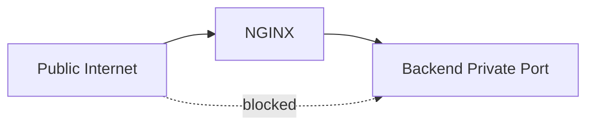
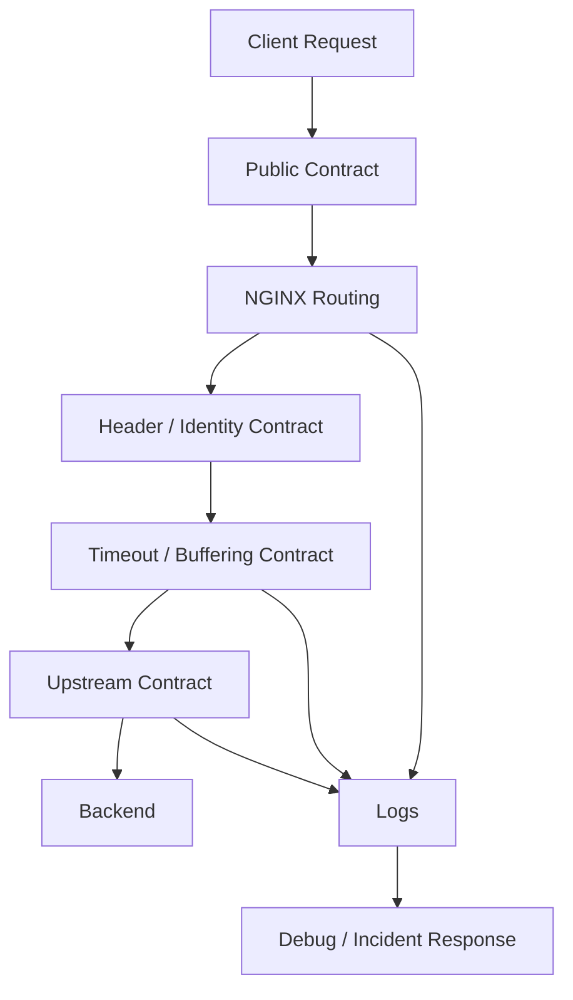

# Part 045 — Reverse Proxy Production Lab

This part is a lab.

The goal is not to memorize one perfect NGINX config.

The goal is to build a reverse proxy skeleton that survives the first real production incident:

- a backend becomes slow;
- an upstream deploy returns 500;
- one instance is stopped;
- DNS changes;
- clients upload large request bodies;
- a WebSocket endpoint needs different timeouts;
- logs need to explain which upstream handled the request;
- a reload must not drop active traffic;
- rollback must be boring.

A reverse proxy is production-ready only when it has operational invariants.

Not just directives.

---

## 1. What we are building

We will build an NGINX reverse proxy in front of three example backend families:

- Java service;
- Node.js service;
- Go service.

The specific framework does not matter.

The reverse proxy contract matters.

```mermaid
flowchart LR
    C[Client] --> N[NGINX Reverse Proxy]

    N --> J[Java API :8081]
    N --> D[Node API :8082]
    N --> G[Go API :8083]

    N --> L[Access Log]
    N --> E[Error Log]

    J --> H1[/healthz]
    D --> H2[/healthz]
    G --> H3[/healthz]
```

The proxy will own:

- public host and port;
- client-facing HTTP contract;
- routing by path;
- forwarded headers;
- request size limits;
- timeout boundaries;
- buffering policy;
- upstream retry policy;
- error envelope for selected gateway failures;
- access logs with upstream fields;
- reload and rollback workflow.

The applications will own:

- domain validation;
- business authentication and authorization;
- business error response;
- request processing;
- database access;
- application health semantics.

This boundary is not cosmetic.

If NGINX starts implementing domain behavior, your edge becomes an untestable shadow application.

---

## 2. Lab invariants

Before touching config, define invariants.

These are the rules the lab must satisfy.

### 2.1 Routing invariants

```txt
/api/java/*  -> Java backend
/api/node/*  -> Node backend
/api/go/*    -> Go backend
/healthz     -> NGINX-level health response
/status      -> local-only status/debug endpoint, never public
```

The proxy must not accidentally route an unknown path to a random backend.

Unknown public paths should return an explicit `404`.

### 2.2 Identity invariants

NGINX must forward identity metadata in a controlled way:

```txt
X-Request-ID       stable request correlation id
X-Real-IP          trusted client address from NGINX perspective
X-Forwarded-For    proxy chain
X-Forwarded-Proto  external scheme
X-Forwarded-Host   external host
Host               external host unless there is a deliberate reason not to
```

The backend must not treat user-supplied forwarded headers as truth unless NGINX is the trusted ingress.

### 2.3 Failure invariants

```txt
upstream connect failure       -> 502
upstream read timeout          -> 504
client body too large          -> 413
unknown route                  -> 404
bad gateway envelope           -> controlled JSON for API routes
non-idempotent retry           -> disabled unless explicitly justified
```

### 2.4 Operational invariants

```txt
nginx -t must pass before reload
nginx -T output must be reviewable in CI
reload must be graceful
rollback must restore previous config atomically
logs must contain upstream address, status, and response time
```

A config that works only when every backend is healthy is not a production config.

---

## 3. Directory layout

Use a layout that separates global policy, reusable snippets, upstream pools, and site routing.

```txt
/etc/nginx/
├── nginx.conf
├── conf.d/
│   ├── 00-maps.conf
│   ├── 10-upstreams.conf
│   └── 20-reverse-proxy-lab.conf
├── snippets/
│   ├── proxy-common.conf
│   ├── proxy-timeouts-standard.conf
│   ├── proxy-timeouts-streaming.conf
│   ├── proxy-headers.conf
│   └── api-gateway-errors.conf
└── runtime/
    └── current-release.txt
```

The names are intentional.

- `00-maps.conf` is evaluated before configs that use the variables.
- `10-upstreams.conf` defines backend groups.
- `20-reverse-proxy-lab.conf` defines the virtual server.
- `snippets/` contains reusable contracts.

Avoid a single giant file.

Avoid twenty tiny snippets with hidden ordering dependencies.

The config graph should be understandable from `nginx -T`.

---

## 4. Minimal backend contract

Each backend should expose these endpoints:

```txt
GET /healthz       shallow liveness/readiness response
GET /whoami        returns service name, instance id, request headers
GET /slow?t=1000   sleeps for t milliseconds
GET /fail          returns 500
POST /echo         echoes request metadata and body size
```

Do not make `/healthz` depend on every downstream dependency unless you deliberately want the load balancer to remove the instance when that dependency is degraded.

There are usually two health endpoints:

```txt
/livez     process is alive
/readyz    instance can receive traffic
```

For this lab, we use `/healthz` as a simple readiness stand-in.

---

## 5. Example docker-compose topology

This lab can be run on a laptop with containers.

```yaml
services:
  nginx:
    image: nginx:stable
    ports:
      - "8080:80"
    volumes:
      - ./nginx/nginx.conf:/etc/nginx/nginx.conf:ro
      - ./nginx/conf.d:/etc/nginx/conf.d:ro
      - ./nginx/snippets:/etc/nginx/snippets:ro
    depends_on:
      - java-api
      - node-api
      - go-api

  java-api:
    image: eclipse-temurin:21-jre
    command: ["java", "-jar", "/app/app.jar"]
    volumes:
      - ./java-api/app.jar:/app/app.jar:ro
    environment:
      SERVICE_NAME: java-api
      INSTANCE_ID: java-1

  node-api:
    image: node:22-alpine
    working_dir: /app
    command: ["node", "server.js"]
    volumes:
      - ./node-api:/app:ro
    environment:
      SERVICE_NAME: node-api
      INSTANCE_ID: node-1

  go-api:
    image: golang:1.24-alpine
    working_dir: /app
    command: ["go", "run", "main.go"]
    volumes:
      - ./go-api:/app:ro
    environment:
      SERVICE_NAME: go-api
      INSTANCE_ID: go-1
```

The exact container tags will change over time.

Do not build long-lived operational knowledge around a specific demo image.

The invariant is the topology.

---

## 6. Global `nginx.conf`

Start with a boring global file.

```nginx
user nginx;
worker_processes auto;

error_log /var/log/nginx/error.log warn;
pid /var/run/nginx.pid;

events {
    worker_connections 4096;
    multi_accept off;
}

http {
    include       /etc/nginx/mime.types;
    default_type  application/octet-stream;

    server_tokens off;

    log_format edge_json escape=json
      '{'
      '"time":"$time_iso8601",'
      '"request_id":"$request_id",'
      '"remote_addr":"$remote_addr",'
      '"realip_remote_addr":"$realip_remote_addr",'
      '"host":"$host",'
      '"method":"$request_method",'
      '"uri":"$request_uri",'
      '"status":$status,'
      '"bytes_sent":$bytes_sent,'
      '"request_time":$request_time,'
      '"upstream_addr":"$upstream_addr",'
      '"upstream_status":"$upstream_status",'
      '"upstream_response_time":"$upstream_response_time",'
      '"upstream_connect_time":"$upstream_connect_time",'
      '"upstream_header_time":"$upstream_header_time",'
      '"referer":"$http_referer",'
      '"user_agent":"$http_user_agent"'
      '}';

    access_log /var/log/nginx/access.log edge_json;

    sendfile on;
    tcp_nopush on;

    keepalive_timeout 65s;

    include /etc/nginx/conf.d/*.conf;
}
```

Important decisions:

- global config does not contain application routes;
- logs include upstream fields;
- `server_tokens off` reduces version disclosure;
- `worker_processes auto` lets NGINX match CPU layout;
- `worker_connections` is explicit;
- `include /etc/nginx/conf.d/*.conf` is the only broad include.

Do not over-tune this file early.

Most production problems in reverse proxy labs come from bad routing, bad timeouts, bad headers, and bad reload workflow—not from exotic kernel tuning.

---

## 7. Request id strategy

NGINX has a built-in `$request_id` variable when compiled with the request ID module.

For production, you need one request id rule:

```txt
If a trusted upstream gateway already assigned a request id, preserve it.
Otherwise generate one at NGINX.
```

Create `conf.d/00-maps.conf`:

```nginx
map $http_x_request_id $edge_request_id {
    default $http_x_request_id;
    ""      $request_id;
}
```

Then forward `$edge_request_id`, not blindly `$http_x_request_id`.

This distinction matters.

A client can send `X-Request-ID: lol`.

That may be acceptable for correlation, but do not let unauthenticated client-supplied ids become security identifiers, idempotency keys, fraud signals, or audit ids without validation.

---

## 8. Upstream pools

Create `conf.d/10-upstreams.conf`:

```nginx
upstream java_api {
    zone java_api 64k;
    server java-api:8080 max_fails=2 fail_timeout=10s;
    keepalive 32;
}

upstream node_api {
    zone node_api 64k;
    server node-api:8080 max_fails=2 fail_timeout=10s;
    keepalive 32;
}

upstream go_api {
    zone go_api 64k;
    server go-api:8080 max_fails=2 fail_timeout=10s;
    keepalive 32;
}
```

A few notes:

- `zone` shares runtime state across workers.
- `max_fails` and `fail_timeout` are passive health controls.
- `keepalive` keeps idle upstream connections for reuse.
- These upstream groups currently have one server each, but the shape is ready for multiple instances.

In a real system, one service would usually have multiple instances:

```nginx
upstream java_api {
    zone java_api 128k;
    least_conn;

    server java-api-1.internal:8080 max_fails=2 fail_timeout=10s;
    server java-api-2.internal:8080 max_fails=2 fail_timeout=10s;
    server java-api-3.internal:8080 max_fails=2 fail_timeout=10s;

    keepalive 64;
}
```

Do not add `least_conn` by habit.

Use it when request durations vary meaningfully.

---

## 9. Common proxy headers

Create `snippets/proxy-headers.conf`:

```nginx
proxy_set_header Host              $host;
proxy_set_header X-Request-ID      $edge_request_id;
proxy_set_header X-Real-IP         $remote_addr;
proxy_set_header X-Forwarded-For   $proxy_add_x_forwarded_for;
proxy_set_header X-Forwarded-Proto $scheme;
proxy_set_header X-Forwarded-Host  $host;
proxy_set_header X-Forwarded-Port  $server_port;
```

This is the most common place where reverse proxy systems become untrustworthy.

The backend must know:

- which host the client used;
- what scheme the client used;
- what client address NGINX saw;
- which request id ties logs together.

But the backend must also know that these headers are trustworthy only because traffic comes from NGINX, not from the public internet directly.

At infrastructure level, prevent direct access to backend ports.



A reverse proxy without network isolation is only a suggestion.

---

## 10. Standard timeout snippet

Create `snippets/proxy-timeouts-standard.conf`:

```nginx
proxy_connect_timeout 2s;
proxy_send_timeout    30s;
proxy_read_timeout    30s;
send_timeout          30s;
```

These values are not universal.

They encode a policy:

```txt
Connection establishment should be fast.
Normal API responses should complete within 30 seconds.
Slow work should move to async job/polling/streaming endpoints.
```

Do not set `proxy_read_timeout 300s` globally because one report endpoint is slow.

Create a separate route for the slow endpoint.

---

## 11. Streaming timeout snippet

Create `snippets/proxy-timeouts-streaming.conf`:

```nginx
proxy_connect_timeout 2s;
proxy_send_timeout    60s;
proxy_read_timeout    1h;
send_timeout          1h;
```

This should be used only for routes that intentionally stream:

- Server-Sent Events;
- WebSocket;
- long-running token stream;
- watch endpoint;
- subscription feed.

A long timeout is an architectural claim.

It means you expect long-lived connections and have capacity for them.

---

## 12. Common proxy behavior

Create `snippets/proxy-common.conf`:

```nginx
proxy_http_version 1.1;
proxy_set_header Connection "";

proxy_buffering on;
proxy_request_buffering on;

proxy_redirect off;

proxy_next_upstream error timeout http_502 http_503 http_504;
proxy_next_upstream_tries 2;
proxy_next_upstream_timeout 5s;

include /etc/nginx/snippets/proxy-headers.conf;
include /etc/nginx/snippets/proxy-timeouts-standard.conf;
```

This is the default for normal API traffic.

Key choices:

- HTTP/1.1 upstream enables keepalive reuse.
- Clearing `Connection` avoids forwarding hop-by-hop connection state incorrectly.
- Buffering is enabled for normal APIs.
- Request buffering is enabled to protect upstreams from slow clients.
- Retry is limited.
- Retry is only for failures where NGINX did not get a useful upstream response, or where gateway-class errors are selected.

Do not enable `non_idempotent` here.

A global retry policy that retries `POST` after partial upstream processing is a data corruption machine.

---

## 13. API gateway error snippet

Create `snippets/api-gateway-errors.conf`:

```nginx
proxy_intercept_errors on;

error_page 502 = @api_bad_gateway;
error_page 503 = @api_unavailable;
error_page 504 = @api_gateway_timeout;
```

Then in the server block define named locations:

```nginx
location @api_bad_gateway {
    internal;
    default_type application/json;
    return 502 '{"error":"bad_gateway","request_id":"$edge_request_id"}\n';
}

location @api_unavailable {
    internal;
    default_type application/json;
    return 503 '{"error":"service_unavailable","request_id":"$edge_request_id"}\n';
}

location @api_gateway_timeout {
    internal;
    default_type application/json;
    return 504 '{"error":"gateway_timeout","request_id":"$edge_request_id"}\n';
}
```

Do not intercept every backend error blindly.

There is a difference between:

```txt
backend returned business 404       -> application owns it
backend returned validation 422     -> application owns it
backend crashed / unavailable       -> gateway may normalize it
upstream connect timeout            -> gateway owns it
```

If NGINX normalizes all errors, clients lose domain meaning.

---

## 14. Main reverse proxy server

Create `conf.d/20-reverse-proxy-lab.conf`:

```nginx
server {
    listen 80 default_server;
    server_name _;

    access_log /var/log/nginx/reverse-proxy-lab.access.log edge_json;
    error_log  /var/log/nginx/reverse-proxy-lab.error.log warn;

    client_max_body_size 10m;

    add_header X-Edge-Request-ID $edge_request_id always;

    location = /healthz {
        access_log off;
        default_type text/plain;
        return 200 "ok\n";
    }

    location = /status {
        allow 127.0.0.1;
        deny all;
        stub_status;
    }

    location /api/java/ {
        include /etc/nginx/snippets/proxy-common.conf;
        include /etc/nginx/snippets/api-gateway-errors.conf;
        proxy_pass http://java_api/;
    }

    location /api/node/ {
        include /etc/nginx/snippets/proxy-common.conf;
        include /etc/nginx/snippets/api-gateway-errors.conf;
        proxy_pass http://node_api/;
    }

    location /api/go/ {
        include /etc/nginx/snippets/proxy-common.conf;
        include /etc/nginx/snippets/api-gateway-errors.conf;
        proxy_pass http://go_api/;
    }

    location /api/go/events/ {
        include /etc/nginx/snippets/proxy-headers.conf;
        include /etc/nginx/snippets/proxy-timeouts-streaming.conf;

        proxy_http_version 1.1;
        proxy_set_header Connection "";

        proxy_buffering off;
        proxy_request_buffering off;

        proxy_pass http://go_api/events/;
    }

    location @api_bad_gateway {
        internal;
        default_type application/json;
        return 502 '{"error":"bad_gateway","request_id":"$edge_request_id"}\n';
    }

    location @api_unavailable {
        internal;
        default_type application/json;
        return 503 '{"error":"service_unavailable","request_id":"$edge_request_id"}\n';
    }

    location @api_gateway_timeout {
        internal;
        default_type application/json;
        return 504 '{"error":"gateway_timeout","request_id":"$edge_request_id"}\n';
    }

    location / {
        default_type application/json;
        return 404 '{"error":"not_found","request_id":"$edge_request_id"}\n';
    }
}
```

This server is intentionally explicit.

There is no catch-all `proxy_pass`.

That is a production safety feature.

---

## 15. Understand `proxy_pass` slash behavior in the lab

Look at this route:

```nginx
location /api/java/ {
    proxy_pass http://java_api/;
}
```

The location prefix `/api/java/` is replaced with `/` before forwarding.

So:

```txt
/api/java/whoami -> upstream /whoami
/api/java/v1/a   -> upstream /v1/a
```

If you write this instead:

```nginx
location /api/java/ {
    proxy_pass http://java_api;
}
```

NGINX forwards the original URI:

```txt
/api/java/whoami -> upstream /api/java/whoami
```

Both forms are valid.

They mean different contracts.

The lab uses URI stripping because the backend does not need to know the public prefix.

In production, choose deliberately:

| Public route | Upstream route | Recommended when |
|---|---|---|
| `/api/orders/*` | `/*` | backend owns service-local routes |
| `/api/orders/*` | `/api/orders/*` | backend is aware of gateway prefix |
| `/v1/*` | `/v1/*` | API version is domain contract |
| `/tenant-a/*` | `/*` | tenant prefix is edge concern |

Do not let this be accidental.

---

## 16. Backend example: Node.js

A minimal backend can be this small.

```js
const http = require("http");

const service = process.env.SERVICE_NAME || "node-api";
const instance = process.env.INSTANCE_ID || "node-local";

function sleep(ms) {
  return new Promise(resolve => setTimeout(resolve, ms));
}

const server = http.createServer(async (req, res) => {
  if (req.url === "/healthz") {
    res.writeHead(200, { "content-type": "text/plain" });
    res.end("ok\n");
    return;
  }

  if (req.url.startsWith("/slow")) {
    const url = new URL(req.url, "http://localhost");
    const t = Number(url.searchParams.get("t") || "1000");
    await sleep(t);
  }

  if (req.url === "/fail") {
    res.writeHead(500, { "content-type": "application/json" });
    res.end(JSON.stringify({ error: "backend_failure", service, instance }) + "\n");
    return;
  }

  if (req.url === "/whoami" || req.url.startsWith("/slow")) {
    res.writeHead(200, { "content-type": "application/json" });
    res.end(JSON.stringify({
      service,
      instance,
      method: req.method,
      url: req.url,
      headers: req.headers
    }, null, 2) + "\n");
    return;
  }

  res.writeHead(404, { "content-type": "application/json" });
  res.end(JSON.stringify({ error: "not_found", service, instance }) + "\n");
});

server.listen(8080, () => console.log(`${service} listening on 8080`));
```

The important part is not Node.

The important part is that `/whoami` lets you inspect what NGINX actually forwarded.

---

## 17. Smoke tests

After starting the stack:

```bash
curl -i http://localhost:8080/healthz
```

Expected:

```txt
HTTP/1.1 200 OK
...
ok
```

Test Java route:

```bash
curl -s http://localhost:8080/api/java/whoami | jq .
```

Test Node route:

```bash
curl -s http://localhost:8080/api/node/whoami | jq .
```

Test Go route:

```bash
curl -s http://localhost:8080/api/go/whoami | jq .
```

Check headers in backend output.

You should see something like:

```json
{
  "headers": {
    "host": "localhost",
    "x-request-id": "...",
    "x-real-ip": "172.18.0.1",
    "x-forwarded-for": "172.18.0.1",
    "x-forwarded-proto": "http",
    "x-forwarded-host": "localhost"
  }
}
```

The exact IP depends on your container network.

The invariant is that the backend receives the edge metadata.

---

## 18. Unknown route test

```bash
curl -i http://localhost:8080/unknown
```

Expected:

```txt
HTTP/1.1 404 Not Found
Content-Type: application/json
X-Edge-Request-ID: ...

{"error":"not_found","request_id":"..."}
```

This is important.

A reverse proxy should fail closed.

Unknown routes should not be silently proxied.

---

## 19. Upstream failure test

Stop one backend:

```bash
docker compose stop node-api
```

Then call:

```bash
curl -i http://localhost:8080/api/node/whoami
```

Expected:

```txt
HTTP/1.1 502 Bad Gateway
Content-Type: application/json

{"error":"bad_gateway","request_id":"..."}
```

Now inspect logs:

```bash
docker compose exec nginx tail -n 5 /var/log/nginx/reverse-proxy-lab.access.log
```

A useful log line should include:

```json
{
  "status": 502,
  "upstream_addr": "...",
  "upstream_status": "502",
  "upstream_response_time": "..."
}
```

If logs cannot tell you which upstream failed, your incident response will start with guessing.

---

## 20. Timeout test

Call a slow backend:

```bash
curl -i "http://localhost:8080/api/java/slow?t=35000"
```

With `proxy_read_timeout 30s`, expected outcome is gateway timeout:

```txt
HTTP/1.1 504 Gateway Time-out
```

This test proves the edge has a bounded wait policy.

But it also reveals an application issue.

If a normal API endpoint needs more than the standard timeout, choose one:

1. make the endpoint faster;
2. move it to async job/polling;
3. expose it as a streaming endpoint;
4. assign a route-specific timeout with explicit capacity planning.

Do not silently increase global timeout.

---

## 21. Body size test

Send a body larger than `client_max_body_size`:

```bash
python3 - <<'PY' | curl -i -X POST --data-binary @- http://localhost:8080/api/go/echo
print("x" * (11 * 1024 * 1024))
PY
```

Expected:

```txt
HTTP/1.1 413 Request Entity Too Large
```

This is an edge contract.

If an API accepts large uploads, isolate it:

```nginx
location /api/go/uploads/ {
    client_max_body_size 200m;

    include /etc/nginx/snippets/proxy-common.conf;
    proxy_pass http://go_api/uploads/;
}
```

Never raise body size globally because one route needs uploads.

---

## 22. Streaming endpoint test

For Server-Sent Events, the route should disable response buffering.

```nginx
location /api/go/events/ {
    proxy_buffering off;
    proxy_request_buffering off;
    include /etc/nginx/snippets/proxy-timeouts-streaming.conf;
    proxy_pass http://go_api/events/;
}
```

Smoke test:

```bash
curl -N http://localhost:8080/api/go/events/stream
```

If events arrive in bursts instead of continuously, buffering is probably still active somewhere.

This may be NGINX buffering, application buffering, framework buffering, TCP behavior, or an intermediary CDN/proxy.

Debug from closest to backend outward.

---

## 23. Reload workflow

Never reload directly from a blind file write.

Use this workflow:

```bash
sudo nginx -t
sudo nginx -T > /tmp/nginx.rendered.$(date +%Y%m%d%H%M%S).conf
sudo nginx -s reload
```

In CI/CD:

```bash
nginx -t -c /etc/nginx/nginx.conf
nginx -T -c /etc/nginx/nginx.conf > rendered-nginx.conf
```

Review the rendered config artifact.

You are not deploying individual files.

You are deploying the complete rendered configuration graph.

---

## 24. Atomic config release pattern

For larger fleets, avoid editing `/etc/nginx/conf.d` in place.

Use release directories:

```txt
/opt/nginx-config/releases/
├── 20260707-120000/
│   ├── nginx.conf
│   ├── conf.d/
│   └── snippets/
├── 20260707-123000/
│   ├── nginx.conf
│   ├── conf.d/
│   └── snippets/
└── current -> /opt/nginx-config/releases/20260707-123000
```

Then `/etc/nginx/nginx.conf` can include from the symlinked current release.

Deploy flow:

```bash
release=/opt/nginx-config/releases/20260707-123000

sudo ln -sfn "$release" /opt/nginx-config/current
sudo nginx -t
sudo nginx -s reload
```

Rollback:

```bash
sudo ln -sfn /opt/nginx-config/releases/20260707-120000 /opt/nginx-config/current
sudo nginx -t
sudo nginx -s reload
```

Atomic symlink replacement is not enough by itself.

You still need `nginx -t` before reload.

---

## 25. CI validation checklist

A useful NGINX config pipeline should check:

```txt
[ ] nginx -t passes
[ ] nginx -T artifact is stored
[ ] no duplicate default_server for same listen socket unless intentional
[ ] no public /status endpoint
[ ] no wildcard proxy catch-all unless explicitly approved
[ ] no global huge client_max_body_size
[ ] no global very long proxy_read_timeout
[ ] every proxy route includes proxy headers
[ ] every API route has request id in response/log
[ ] every upstream has explicit max_fails/fail_timeout policy
[ ] every streaming route has buffering decision documented
[ ] every upload route has body size documented
[ ] every route has smoke tests
```

This checklist catches boring failures.

Production is mostly boring failures chained together.

---

## 26. Failure drill: backend instance down

Scenario:

```txt
java-api instance is stopped
```

Expected behavior with one instance:

```txt
/api/java/* returns 502 until instance recovers
/api/node/* unaffected
/api/go/* unaffected
```

Expected behavior with multiple Java instances:

```txt
NGINX passively avoids failed instance after max_fails/fail_timeout threshold
other Java instances continue receiving requests
logs show upstream retry chain when applicable
```

Questions to answer during the drill:

- Did NGINX return 502 or 504?
- Did retry happen?
- Was the method safe to retry?
- Did access logs show both upstream attempts?
- Did error logs identify connection refused, timeout, or reset?
- Did the application logs show partial processing?

Do not call a system resilient until you have done this drill.

---

## 27. Failure drill: backend slow

Scenario:

```txt
/api/java/slow?t=35000
```

Expected:

```txt
NGINX returns 504 around proxy_read_timeout
upstream_response_time indicates wait duration
backend may still finish later unless cancellation is propagated
```

This exposes a subtle issue.

A timeout at NGINX does not automatically cancel the backend work.

For expensive operations, the application should observe client cancellation where possible.

Otherwise a timeout storm can keep burning backend CPU after clients are gone.

---

## 28. Failure drill: bad deploy

Scenario:

```txt
new backend deploy returns 500 for /whoami
```

Expected:

```txt
NGINX should not hide domain 500 unless policy says gateway owns it
access log shows upstream_status=500
application owner can correlate request id
rollback happens at app tier or route tier
```

Do not solve all 500s at NGINX.

A backend 500 is usually domain/service ownership.

An upstream connection failure is usually edge/platform ownership.

---

## 29. Failure drill: bad NGINX config

Introduce a syntax error:

```nginx
location /broken {
    proxy_pass http://go_api
}
```

Missing semicolon.

Run:

```bash
nginx -t
```

Expected:

```txt
configuration file ... test failed
```

Existing worker processes should keep serving old valid config until you reload successfully.

This is why `nginx -t` belongs in the deploy path.

---

## 30. Observability queries

With JSON logs, you can answer concrete questions.

### 30.1 Which upstream is slow?

```bash
jq -r 'select(.upstream_response_time != "") | [.uri, .upstream_addr, .upstream_response_time] | @tsv' \
  /var/log/nginx/reverse-proxy-lab.access.log
```

### 30.2 Which requests returned gateway errors?

```bash
jq -r 'select(.status == 502 or .status == 503 or .status == 504) | [.time, .request_id, .uri, .status, .upstream_addr, .upstream_status] | @tsv' \
  /var/log/nginx/reverse-proxy-lab.access.log
```

### 30.3 Which client receives many 413s?

```bash
jq -r 'select(.status == 413) | [.remote_addr, .uri, .request_id] | @tsv' \
  /var/log/nginx/reverse-proxy-lab.access.log
```

This is why structured logging was part of the baseline.

If you cannot ask these questions quickly, your reverse proxy is opaque.

---

## 31. Production hardening extensions

Once the lab works, add these only as needed:

| Need | Candidate NGINX control |
|---|---|
| client rate abuse | `limit_req` |
| connection flood | `limit_conn` |
| private admin route | `allow` / `deny` / mTLS |
| large uploads | route-specific `client_max_body_size` |
| streaming | route-specific `proxy_buffering off` |
| WebSocket | `Upgrade` / `Connection` handling |
| origin shielding | proxy cache |
| client identity from prior LB | `real_ip_header`, `set_real_ip_from` |
| dynamic DNS upstream | `resolver`, `resolve`, controlled TTL |
| blue-green | `map`, route labels, separate upstreams |
| canary | `split_clients`, cookie/header override |

Do not add controls because they are fashionable.

Add controls because they protect a specific invariant.

---

## 32. Bad lab patterns to avoid

### 32.1 Catch-all proxy

```nginx
location / {
    proxy_pass http://backend;
}
```

This is acceptable only if the public contract is exactly “everything goes to that backend.”

For multi-service gateways, it is dangerous.

### 32.2 Global long timeout

```nginx
proxy_read_timeout 10m;
```

This hides slow endpoints and increases connection occupancy.

### 32.3 Blind forwarded headers

```nginx
proxy_set_header X-Forwarded-For $http_x_forwarded_for;
```

This trusts client-provided data.

Use `$proxy_add_x_forwarded_for` and real IP trust rules deliberately.

### 32.4 Global huge body size

```nginx
client_max_body_size 2g;
```

This turns every endpoint into an upload endpoint.

### 32.5 No upstream fields in logs

```nginx
log_format main '$remote_addr $request $status';
```

This is not enough for reverse proxy operations.

---

## 33. Final acceptance criteria

The lab is complete when all of this is true:

```txt
[ ] /healthz returns 200 from NGINX
[ ] /api/java/whoami reaches Java backend
[ ] /api/node/whoami reaches Node backend
[ ] /api/go/whoami reaches Go backend
[ ] unknown route returns JSON 404
[ ] backend down returns controlled 502
[ ] slow backend returns controlled 504
[ ] large body returns 413
[ ] streaming route streams without buffering bursts
[ ] access logs include request id and upstream fields
[ ] nginx -t passes before reload
[ ] rollback can restore previous config
```

This is not “done forever.”

It is a production baseline you can evolve.

---

## 34. Mental model recap

Reverse proxy production readiness is a contract problem.



The proxy is healthy when the path from request to upstream to logs is deterministic.

A good NGINX reverse proxy does not just pass traffic.

It narrows ambiguity.

---

## 35. References

- NGINX documentation — Reverse Proxy: `https://docs.nginx.com/nginx/admin-guide/web-server/reverse-proxy/`
- NGINX documentation — `ngx_http_proxy_module`: `https://nginx.org/en/docs/http/ngx_http_proxy_module.html`
- NGINX documentation — `ngx_http_upstream_module`: `https://nginx.org/en/docs/http/ngx_http_upstream_module.html`
- NGINX documentation — Command-line parameters: `https://nginx.org/en/docs/switches.html`
- NGINX documentation — Controlling nginx: `https://nginx.org/en/docs/control.html`
