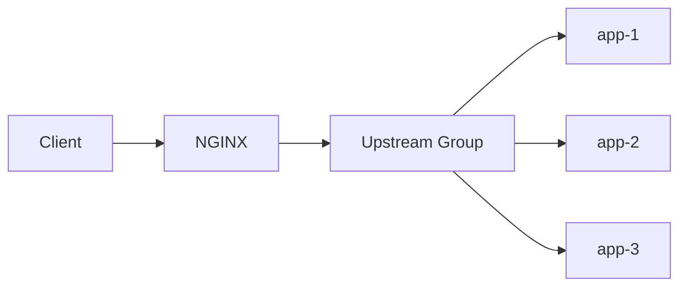
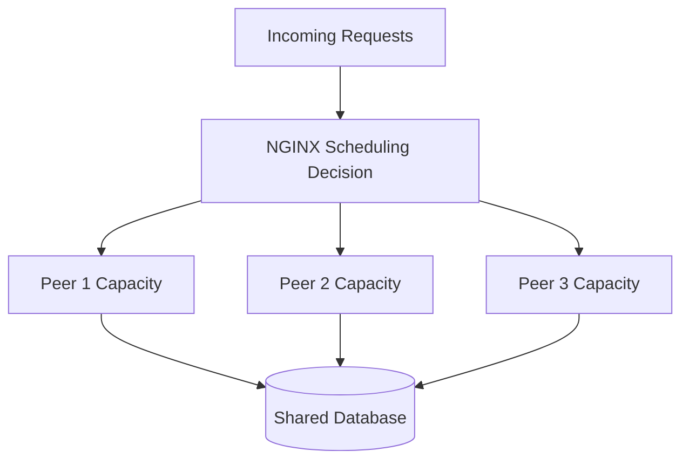
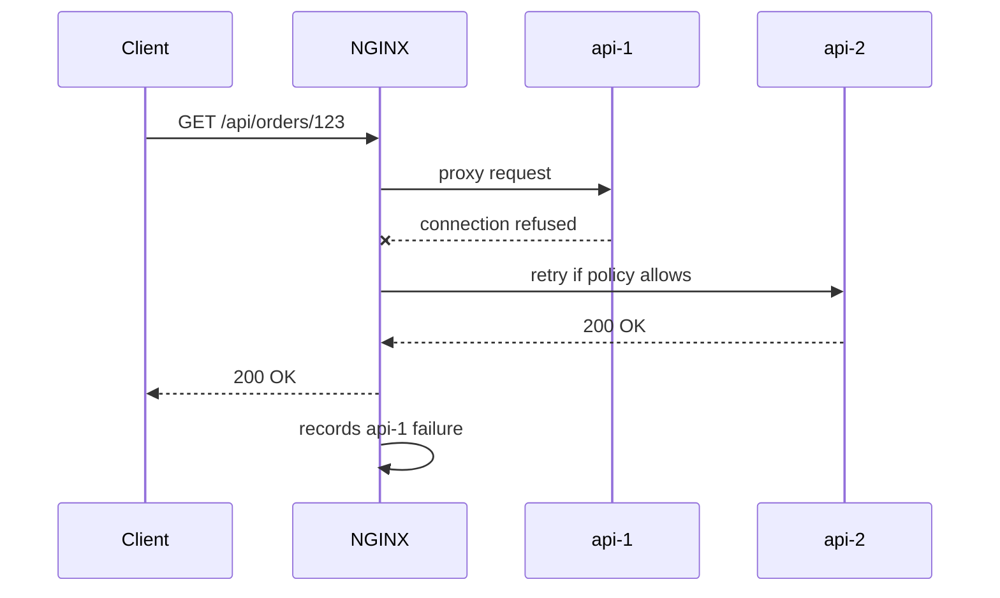
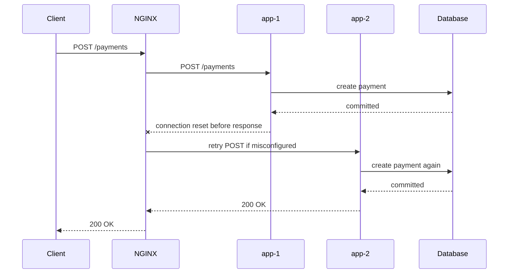
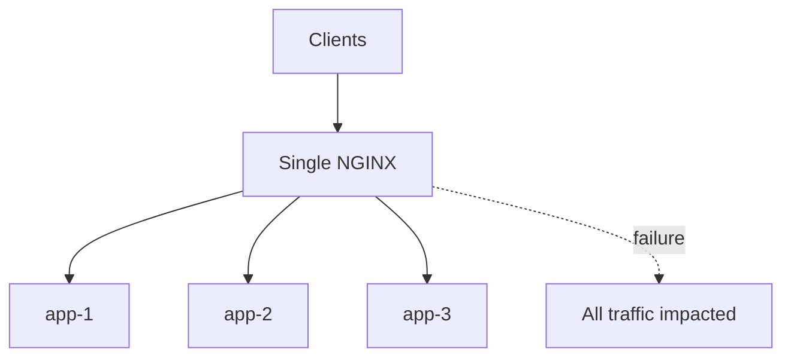

# Part 046 — HTTP Load Balancing Mental Model: Balancing ≠ Resilience

Load balancing is one of the most misunderstood parts of NGINX.

People often treat it as a magic availability feature:

> “We put NGINX in front of three app instances, so now it is highly available.”

That is incomplete.

Load balancing distributes requests.

Resilience requires correct distribution, failure detection, retry discipline, capacity planning, connection management, health semantics, observability, and safe deployment behavior.

A load balancer can improve availability.

It can also amplify failure.

---

## 1. Core mental model

An HTTP load balancer receives a request and chooses an upstream peer.



The choice depends on:

- load balancing method;
- peer weight;
- peer availability state;
- active connection count for some methods;
- hash key for some methods;
- passive failure history;
- retry policy;
- worker-local and shared upstream state;
- keepalive connection availability;
- route-specific config.

The key abstraction is the **upstream group**.

```nginx
upstream orders_api {
    server orders-1.internal:8080;
    server orders-2.internal:8080;
    server orders-3.internal:8080;
}

server {
    location /api/orders/ {
        proxy_pass http://orders_api/;
    }
}
```

`orders_api` is a scheduling domain.

It is not just a DNS alias.

---

## 2. Balancing is not resilience

A system with three broken instances is not resilient.

A system with three healthy instances but a bad retry policy can duplicate writes.

A system with three instances and no overload control can fail all instances at once.

A system with three instances but direct public access to each backend has bypassed the edge.

A system with three instances but no logs cannot be debugged.

Load balancing answers one question:

```txt
Which upstream peer should receive this request?
```

Resilience answers more questions:

```txt
What if the chosen peer is slow?
What if the request is non-idempotent?
What if every peer is saturated?
What if one peer just restarted and has cold caches?
What if keepalive sockets are stale?
What if DNS changed?
What if a backend returns 500 but still committed the write?
What if a client disconnects?
What if the load balancer itself is the single point of failure?
```

This part is about building the mental model for those questions.

---

## 3. Work unit: request, connection, or stream?

For HTTP/1.1 normal APIs, the obvious work unit is a request.

But production traffic is messier.

| Traffic shape | Load balancing implication |
|---|---|
| short GET requests | request distribution dominates |
| long POST requests | active connection count matters |
| WebSocket | connection distribution dominates |
| SSE/token stream | long-lived read timeout and occupancy matter |
| gRPC unary | request-like but HTTP/2 transport matters |
| gRPC streaming | stream/connection lifetime matters |
| large upload | request body buffering and upstream occupancy matter |
| cacheable GET | cache layer may absorb request before upstream |

You cannot choose a load balancing method well until you know the work unit.

Round-robin may be fine for uniform short requests.

It may be poor for mixed short and long requests.

---

## 4. Upstream group as a queueing boundary

A backend pool is a capacity pool.



The load balancer can distribute traffic across app instances.

It cannot create database capacity.

If all app instances bottleneck on the same downstream database, more app instances may only increase concurrent pressure.

That is the first load balancing trap:

> Horizontal app scaling can amplify downstream saturation.

Therefore, load balancing design must include downstream awareness.

Not routing logic inside NGINX.

Awareness in capacity planning.

---

## 5. Default method: weighted round-robin

If no method is configured, NGINX uses round-robin.

```nginx
upstream api {
    server api-1.internal:8080;
    server api-2.internal:8080;
    server api-3.internal:8080;
}
```

With equal weights, NGINX distributes requests across peers in rotation.

Add weights:

```nginx
upstream api {
    server api-1.internal:8080 weight=3;
    server api-2.internal:8080 weight=1;
    server api-3.internal:8080 weight=1;
}
```

The intended distribution ratio is roughly:

```txt
api-1 : api-2 : api-3 = 3 : 1 : 1
```

Weights express relative capacity.

They are not percentages.

They are scheduling hints.

Use weights when instances are not equivalent:

- different CPU/memory size;
- different generation hardware;
- different region latency;
- warm vs cold node;
- partial canary;
- migration phase.

Do not use weights to hide a broken service.

A peer that should not receive traffic should be removed or marked down.

---

## 6. Least connections

`least_conn` selects the peer with the fewest active connections, taking weights into account.

```nginx
upstream api {
    least_conn;

    server api-1.internal:8080;
    server api-2.internal:8080;
    server api-3.internal:8080;
}
```

This is useful when request durations vary.

Example:

```txt
/api/search     often 50 ms
/api/report     often 15 s
/api/export     often 60 s
```

Round-robin sees three requests.

Least-connections sees occupancy.

But least-connections is not perfect.

It measures active connections at NGINX’s view of the world.

It does not know:

- CPU queue length inside the app;
- database wait time;
- garbage collection pressure;
- per-tenant heavy requests;
- thread pool saturation;
- async runtime starvation.

It is a better scheduling signal for mixed-duration traffic, not an oracle.

---

## 7. IP hash and session affinity

`ip_hash` maps a client IP address to a peer.

```nginx
upstream api {
    ip_hash;

    server api-1.internal:8080;
    server api-2.internal:8080;
    server api-3.internal:8080;
}
```

This gives a form of affinity:

```txt
same client IP -> same backend, unless backend unavailable
```

Use it carefully.

It can help when the backend has local session state.

But local session state is often the real problem.

Common traps:

- many users behind one NAT collapse onto one backend;
- mobile networks change IPs;
- corporate proxies make one IP represent thousands of users;
- IPv6 behavior differs from IPv4 details;
- removing/adding peers can remap clients;
- client IP may be wrong if real IP trust is wrong.

Session affinity is a compatibility tool.

It is not a substitute for externalized session state.

---

## 8. Generic hash

Generic hash lets you choose the key.

```nginx
upstream api_by_tenant {
    hash $http_x_tenant_id consistent;

    server api-1.internal:8080;
    server api-2.internal:8080;
    server api-3.internal:8080;
}
```

The key can be a variable combination:

```nginx
hash "$http_x_tenant_id:$uri" consistent;
```

Use generic hash for:

- cache server distribution;
- tenant locality;
- shard-aware routing;
- stateful compatibility;
- reducing remap with `consistent` when peers change.

Danger:

A client-controlled hash key can become a load-skew weapon.

If clients can choose `X-Tenant-ID`, they can concentrate traffic on one peer unless the value is authenticated/validated upstream.

Hashing is deterministic.

Deterministic does not mean fair.

---

## 9. Least time and random: availability boundary

NGINX documentation has evolved over time.

Always check your exact NGINX version, distribution, build flags, and whether you are using NGINX Open Source or NGINX Plus.

The mental model:

- `least_time` uses response time plus active connection information;
- `random` distributes randomly, optionally using “power of two choices” style selection;
- some features historically belonged to NGINX Plus and have changed availability across recent versions;
- commercial-only features still exist, especially around active health checks, dynamic reconfiguration API, advanced session persistence, queueing, and some runtime state features.

Do not design from memory.

Design from the directive documentation for the version you run.

---

## 10. Passive health checks

NGINX Open Source supports passive failure accounting through upstream server parameters.

```nginx
upstream api {
    server api-1.internal:8080 max_fails=2 fail_timeout=10s;
    server api-2.internal:8080 max_fails=2 fail_timeout=10s;
    server api-3.internal:8080 max_fails=2 fail_timeout=10s;
}
```

Interpretation:

```txt
If a peer has enough unsuccessful attempts within fail_timeout,
NGINX temporarily considers it unavailable for fail_timeout.
```

But what counts as unsuccessful?

That depends on the relevant `*_next_upstream` directive.

For HTTP proxying, it is influenced by `proxy_next_upstream`.

This is crucial.

Passive health is not a background checker.

It learns from live traffic failures.



Passive checks can hide a single failure from the client if retry succeeds.

They can also duplicate side effects if retry policy is wrong.

---

## 11. Active health checks

Active health checks are different.

They send synthetic health probes out of band.

```txt
NGINX -> backend /healthz
```

If the probe fails, the backend can be removed before real client traffic hits it.

This is generally an NGINX Plus feature in standard NGINX product boundaries.

Open Source users often approximate active checks with external systems:

- service discovery only publishes ready instances;
- Kubernetes readiness probes remove endpoints;
- Consul/Envoy/HAProxy sidecar updates upstream list;
- deployment controller removes instance before reload;
- external monitor triggers config change.

Do not confuse passive failure accounting with active health checking.

They solve different parts of the problem.

---

## 12. `max_fails` and `fail_timeout` are not health checks alone

Consider:

```nginx
server api-1.internal:8080 max_fails=1 fail_timeout=10s;
```

If one request gets connection refused, the peer may be avoided for a while.

But this does not prove the service is unhealthy.

Possible causes:

- transient restart;
- connection backlog overflow;
- network blip;
- keepalive stale socket;
- one bad process accept loop;
- NGINX worker local view;
- application thread pool exhaustion.

Now consider:

```nginx
server api-1.internal:8080 max_fails=5 fail_timeout=10s;
```

This is less sensitive.

But it may allow more client-visible failures before isolation.

The tuning question is not “what number is best?”

The tuning question is:

```txt
How many failed live requests are acceptable before temporarily avoiding a peer?
```

---

## 13. Retry semantics are part of load balancing

Load balancing decides the first peer.

Retry decides the next peer.

```nginx
location /api/ {
    proxy_pass http://api;

    proxy_next_upstream error timeout http_502 http_503 http_504;
    proxy_next_upstream_tries 2;
    proxy_next_upstream_timeout 3s;
}
```

Retry policy must account for method safety.

Safe-ish candidates:

```txt
GET, HEAD, OPTIONS
```

Dangerous candidates:

```txt
POST, PATCH, DELETE, non-idempotent PUT
```

Even `PUT` can be dangerous if application semantics are not truly idempotent.

The failure mode:



From the client perspective, the request succeeded once.

From the business perspective, it may have committed twice.

Never treat retry as a pure availability knob.

Retry is correctness logic.

---

## 14. Load balancing and keepalive interaction

Upstream keepalive reduces connection churn.

```nginx
upstream api {
    server api-1.internal:8080;
    server api-2.internal:8080;
    keepalive 64;
}

location /api/ {
    proxy_http_version 1.1;
    proxy_set_header Connection "";
    proxy_pass http://api;
}
```

But keepalive changes the capacity picture.

Each NGINX worker may hold idle upstream connections.

If you have:

```txt
8 NGINX workers
64 keepalive connections
many upstream groups
many backend instances
```

You can create significant idle file descriptor pressure.

Also, keepalive does not mean every request reuses an existing connection.

Reuse depends on:

- worker handling the request;
- idle connection availability in that worker;
- upstream peer selected;
- protocol compatibility;
- backend keepalive timeout;
- whether backend closed the socket;
- request/response headers.

The point is not to fear keepalive.

The point is to size it as part of the load balancing design.

---

## 15. Shared state and `zone`

Without shared upstream state, workers may have independent views of some runtime state.

Use `zone` when you need shared runtime state for an upstream group:

```nginx
upstream api {
    zone api 128k;

    server api-1.internal:8080;
    server api-2.internal:8080;
    server api-3.internal:8080;

    keepalive 64;
}
```

This becomes more important when using features that rely on shared counters/state:

- runtime peer state;
- DNS `resolve` on upstream servers;
- failure accounting across workers;
- advanced dynamic capabilities depending on version/edition.

The mental model:

```txt
workers process requests independently;
shared zones let selected upstream state be coordinated.
```

Do not assume every piece of state is globally synchronized unless the directive says so.

---

## 16. Single NGINX is still a single point of failure

Putting NGINX in front of multiple app instances gives app-tier balancing.

It does not automatically make NGINX highly available.



For NGINX high availability, you need an HA design:

- multiple NGINX instances;
- cloud load balancer in front;
- anycast/BGP in advanced environments;
- VRRP/keepalived in some private environments;
- DNS failover with clear TTL limitations;
- Kubernetes Service/Ingress controller replicas;
- consistent config distribution;
- health checks for NGINX itself.

Do not confuse backend HA with edge HA.

---

## 17. Capacity model

A simplified load balancer capacity model:

```txt
client concurrency
x average request duration
x response size
x buffering behavior
x upstream connection reuse
x retry multiplier
x error rate
= edge and backend pressure
```

Retry multiplier is often forgotten.

If you receive 10,000 requests/sec and 5% trigger one retry:

```txt
backend attempts/sec = 10,000 + 500 = 10,500
```

If an incident causes 40% to retry twice:

```txt
backend attempts/sec = 10,000 + 8,000 = 18,000
```

Your load balancer can nearly double backend pressure during failure.

This is why retry budgets exist.

---

## 18. Fairness vs efficiency

Different algorithms optimize different things.

| Method | Optimizes for | Weakness |
|---|---|---|
| round-robin | simple distribution | ignores request duration |
| weighted round-robin | relative capacity | bad weights create skew |
| least_conn | active occupancy | does not know internal app saturation |
| ip_hash | affinity by client IP | NAT/proxy skew |
| generic hash | deterministic key locality | key skew and client manipulation |
| least_time | response-time-aware choice | version/edition availability and metric lag |
| random/two choices | distributed LB environments | availability/version boundary must be checked |

There is no universally best method.

The correct method depends on workload shape.

---

## 19. Choosing a method by workload

### 19.1 Uniform stateless APIs

Use default round-robin first.

```nginx
upstream api {
    server api-1:8080;
    server api-2:8080;
    server api-3:8080;
}
```

Add weights only if capacities differ.

### 19.2 Mixed request duration

Use `least_conn`.

```nginx
upstream api {
    least_conn;
    server api-1:8080;
    server api-2:8080;
    server api-3:8080;
}
```

Still monitor p95/p99 and active connections.

### 19.3 Stateful legacy session

Use `ip_hash` only as a compatibility bridge.

```nginx
upstream legacy_app {
    ip_hash;
    server legacy-1:8080;
    server legacy-2:8080;
}
```

Plan migration to external session state.

### 19.4 Cache shard or tenant locality

Use consistent generic hash.

```nginx
upstream tenant_cache {
    hash $http_x_tenant_id consistent;
    server cache-1:8080;
    server cache-2:8080;
    server cache-3:8080;
}
```

Validate the hash key.

### 19.5 Multi-load-balancer distributed environment

Consider random/two-choices if supported in your version/edition and if multiple load balancers do not share perfect global state.

The point is to avoid all LBs making the same deterministic bad choice from stale local observations.

---

## 20. Health endpoint design

Backend health endpoints must be designed for load balancers.

Bad health endpoint:

```txt
/healthz checks database, Redis, third-party payment provider, SMTP, object storage, feature flag service, and analytics sink
```

This can remove all app instances during a downstream dependency incident.

Better:

```txt
/livez   process is alive
/readyz  process can serve core traffic
/deepz   diagnostic dependency check, not always used for LB removal
```

Health semantics depend on failure domain.

If Redis is down but most read-only endpoints can still serve, do you want all instances removed?

Usually no.

Load balancer health must reflect routing decision, not dashboard completeness.

---

## 21. Failure state taxonomy

From NGINX perspective, upstream failures differ.

| Failure | Likely NGINX status | Meaning |
|---|---:|---|
| connection refused | 502 | backend not accepting |
| DNS resolution failure | 502 | name could not resolve or no peer |
| connect timeout | 504-ish / gateway timeout path | network/backend accept path slow |
| read timeout | 504 | backend did not send timely response |
| backend returned 500 | 500 | application produced error |
| backend returned 503 | 503 | application/backing dependency unavailable |
| backend reset after partial response | often 502 | response broken |

Do not collapse all failures into “NGINX problem.”

NGINX reports the boundary where failure became visible.

Root cause may be elsewhere.

---

## 22. Observability fields for load balancing

Your access log should include at least:

```txt
$status
$request_time
$upstream_addr
$upstream_status
$upstream_connect_time
$upstream_header_time
$upstream_response_time
$request_id or equivalent
```

These fields answer:

```txt
Which peer handled the request?
Did NGINX retry across multiple peers?
Was the delay before connect, before header, or during body?
Was the status generated by NGINX or upstream?
How long did the client-observed request take?
```

Example retry log shape:

```txt
upstream_addr="10.0.1.10:8080, 10.0.1.11:8080"
upstream_status="502, 200"
upstream_response_time="0.001, 0.028"
```

That is gold during incidents.

---

## 23. Load balancing anti-patterns

### 23.1 One global upstream for unrelated services

```nginx
upstream all_backends {
    server orders:8080;
    server payments:8080;
    server users:8080;
}
```

This is not load balancing.

This is random misrouting.

Create one upstream group per service capability.

### 23.2 Retrying all methods globally

```nginx
proxy_next_upstream error timeout http_500 http_502 http_503 http_504 non_idempotent;
```

This risks duplicate writes.

### 23.3 Hiding all upstream errors

```nginx
proxy_intercept_errors on;
error_page 500 502 503 504 /generic.json;
```

This destroys domain error semantics.

### 23.4 Health check endpoint that depends on everything

This can create cascading outage.

### 23.5 Weights as permanent debt

Weights often start as a migration aid and become undocumented reality.

Document why each weight exists.

---

## 24. Design exercise

You own a service with this traffic:

```txt
80% GET /items/:id     p95 40 ms
15% GET /search        p95 500 ms
4%  POST /orders       p95 200 ms, non-idempotent without idempotency key
1%  GET /export        p95 45 seconds
```

A naive config:

```nginx
upstream api {
    server api-1:8080;
    server api-2:8080;
    server api-3:8080;
}

location / {
    proxy_pass http://api;
    proxy_read_timeout 60s;
    proxy_next_upstream error timeout http_500 http_502 http_503 http_504;
}
```

Problems:

- `/export` forces long timeout for every route.
- `POST /orders` may be retried incorrectly depending on policy and failure point.
- `http_500` retry can duplicate application-level failure effects.
- round-robin may place long exports unevenly.
- no route-specific observability labels.

Better shape:

```nginx
upstream api_standard {
    least_conn;
    server api-1:8080 max_fails=2 fail_timeout=10s;
    server api-2:8080 max_fails=2 fail_timeout=10s;
    server api-3:8080 max_fails=2 fail_timeout=10s;
    keepalive 64;
}

upstream api_export {
    least_conn;
    server api-1:8080 max_fails=1 fail_timeout=10s;
    server api-2:8080 max_fails=1 fail_timeout=10s;
    server api-3:8080 max_fails=1 fail_timeout=10s;
    keepalive 16;
}

location /export {
    proxy_pass http://api_export;
    proxy_read_timeout 60s;
    proxy_next_upstream error timeout http_502 http_503 http_504;
    proxy_next_upstream_tries 1;
}

location /orders {
    proxy_pass http://api_standard;
    proxy_read_timeout 5s;
    proxy_next_upstream error timeout http_502 http_503 http_504;
    proxy_next_upstream_tries 1;
}

location / {
    proxy_pass http://api_standard;
    proxy_read_timeout 10s;
    proxy_next_upstream error timeout http_502 http_503 http_504;
    proxy_next_upstream_tries 2;
}
```

This is still simplified.

The important step is route-specific policy.

---

## 25. Load balancing decision checklist

Before choosing a method, ask:

```txt
[ ] Are requests uniform or mixed-duration?
[ ] Are backends equal capacity?
[ ] Is session affinity required? Why?
[ ] Is the affinity key trusted?
[ ] Are requests idempotent?
[ ] What should be retried?
[ ] What should never be retried?
[ ] What is the acceptable live-failure count before avoiding a peer?
[ ] What is the connection reuse target?
[ ] What are backend max connections and thread/worker limits?
[ ] What downstream dependency is the real bottleneck?
[ ] How will we detect skew?
[ ] How will we drain a backend?
[ ] How will we reintroduce a backend after recovery?
[ ] Is NGINX itself highly available?
```

These questions matter more than the directive names.

---

## 26. Mental model recap

HTTP load balancing is a scheduling problem under uncertainty.

NGINX sees:

- request metadata;
- connection state;
- upstream peer list;
- selected runtime counters;
- failures it observes at the proxy boundary;
- timing data.

NGINX does not automatically know:

- application queue depth;
- database saturation;
- business idempotency;
- tenant cost;
- downstream dependency graph;
- whether a retry is semantically safe.

Therefore, production load balancing is not just this:

```nginx
upstream api {
    server a;
    server b;
    server c;
}
```

It is this:

```txt
method + weights + health semantics + retry policy + timeout policy + keepalive + logs + deployment lifecycle + capacity model
```

Balancing is distribution.

Resilience is controlled behavior under failure.

---

## 27. References

- NGINX documentation — Using nginx as HTTP load balancer: `https://nginx.org/en/docs/http/load_balancing.html`
- NGINX documentation — `ngx_http_upstream_module`: `https://nginx.org/en/docs/http/ngx_http_upstream_module.html`
- NGINX documentation — `ngx_http_proxy_module`: `https://nginx.org/en/docs/http/ngx_http_proxy_module.html`
- F5 NGINX documentation — HTTP Load Balancing: `https://docs.nginx.com/nginx/admin-guide/load-balancer/http-load-balancer/`
- F5 NGINX documentation — HTTP Health Checks: `https://docs.nginx.com/nginx/admin-guide/load-balancer/http-health-check/`
