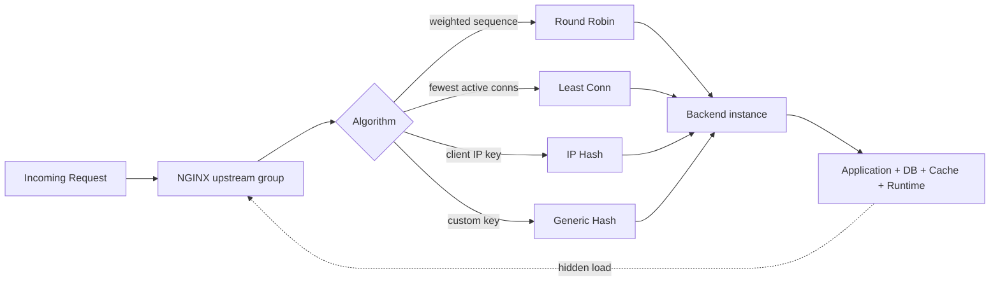
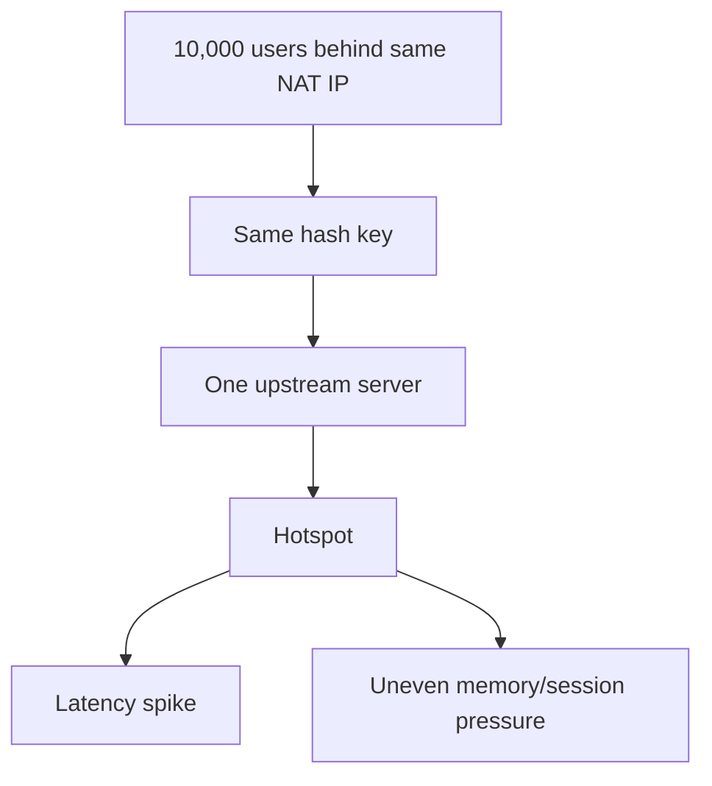

# Part 047 — Round Robin, Least Connections, IP Hash, and Generic Hash

Load balancing algorithm adalah **policy pemilihan upstream**.

Ia bukan health check. Ia bukan autoscaler. Ia bukan circuit breaker. Ia bukan jaminan fairness bisnis. Ia hanya menjawab satu pertanyaan kecil tetapi sangat kritis:

> Untuk request ini, server upstream mana yang dipilih?

Di production, pertanyaan kecil ini punya konsekuensi besar:

- apakah long request menumpuk di satu backend,
- apakah session state pecah,
- apakah tenant besar membuat cache shard panas,
- apakah backend baru langsung dibanjiri traffic,
- apakah retry menggandakan write,
- apakah satu node lambat menyebabkan tail latency seluruh cluster naik.

Top 1% engineer tidak memilih algoritma load balancing karena “umumnya pakai ini”. Ia memilih berdasarkan **state model, latency distribution, connection lifetime, key distribution, retry policy, dan failure recovery behavior**.

Dokumentasi resmi NGINX menyebut round-robin sebagai default weighted method; `least_conn` memilih server dengan active connection paling sedikit dengan mempertimbangkan weight; `ip_hash` memakai client IP sebagai key; dan `hash` memakai key buatan user, dengan opsi `consistent` untuk mengurangi remapping ketika upstream berubah.

---

## 1. Mental Model: Load Balancer sebagai Function

Secara konseptual, sebuah NGINX upstream bisa dilihat seperti function:

```txt
selected_server = f(request, upstream_state, algorithm_config)
```

Komponen inputnya:

```txt
request:
  uri
  method
  headers
  cookies
  remote address
  variables

upstream_state:
  list of servers
  weight
  active connections
  failed/unavailable status
  keepalive state
  worker-local/shared state

algorithm_config:
  round-robin | least_conn | ip_hash | hash key [consistent]
```

Yang sering salah dipahami: load balancer tidak selalu punya pengetahuan penuh tentang “load” aktual aplikasi.

NGINX bisa tahu beberapa sinyal lokal:

- berapa active upstream connection,
- apakah connect/read/send gagal,
- apakah server sedang ditandai failed secara passive,
- weight tiap server,
- key hash tertentu.

Tetapi NGINX tidak otomatis tahu:

- CPU backend,
- GC pause JVM,
- queue di thread pool aplikasi,
- saturation database downstream,
- tenant mana yang membuat query mahal,
- logical operation mana yang idempotent,
- memory pressure di runtime backend.

Karena itu, algoritma load balancing harus diperlakukan sebagai **approximation**, bukan oracle.



---

## 2. Upstream Group Anatomy

Basic upstream:

```nginx
upstream app_backend {
    server 10.0.10.11:8080;
    server 10.0.10.12:8080;
    server 10.0.10.13:8080;
}

server {
    listen 443 ssl;
    server_name api.example.com;

    location / {
        proxy_pass http://app_backend;
    }
}
```

Tanpa directive algoritma eksplisit, NGINX memakai weighted round-robin.

Dengan parameter server:

```nginx
upstream app_backend {
    server 10.0.10.11:8080 weight=5 max_fails=3 fail_timeout=10s;
    server 10.0.10.12:8080 weight=3 max_fails=3 fail_timeout=10s;
    server 10.0.10.13:8080 weight=2 max_fails=3 fail_timeout=10s;
}
```

Beberapa parameter yang akan sering muncul:

| Parameter | Fungsi | Hal yang sering disalahpahami |
|---|---|---|
| `weight` | Rasio preferensi pemilihan server | Bukan limit traffic absolut. |
| `max_fails` | Jumlah failure dalam window `fail_timeout` untuk menandai server unavailable | Failure dihitung berdasarkan kondisi yang dianggap gagal oleh `*_next_upstream`. |
| `fail_timeout` | Window failure sekaligus durasi server dianggap unavailable | Passive health check hanya terjadi dari traffic nyata. |
| `backup` | Server dipakai saat primary unavailable | Tidak bisa dipakai bersama beberapa metode seperti `hash`, `ip_hash`, dan `random`. |
| `down` | Server dianggap permanently unavailable | Berguna untuk menjaga hash ring/slot ketika remove sementara. |

---

## 3. Algorithm 1 — Round Robin

Round robin adalah default.

```nginx
upstream app_backend {
    server 10.0.10.11:8080;
    server 10.0.10.12:8080;
    server 10.0.10.13:8080;
}
```

Dengan weight:

```nginx
upstream app_backend {
    server 10.0.10.11:8080 weight=3;
    server 10.0.10.12:8080 weight=1;
    server 10.0.10.13:8080 weight=1;
}
```

Secara mental:

```txt
weighted sequence = [A, A, A, B, C]
request 1 -> A
request 2 -> A
request 3 -> A
request 4 -> B
request 5 -> C
request 6 -> A
...
```

Ini bukan implementasi internal persis yang perlu kamu hafal. Yang penting adalah efeknya: server dengan weight lebih besar akan menerima proporsi request lebih besar.

### Kapan round robin cocok?

Gunakan round robin ketika:

- aplikasi stateless,
- semua instance relatif homogen,
- request duration relatif seragam,
- tidak butuh client affinity,
- backend tidak punya per-client state,
- traffic cukup besar sehingga distribusi rasio menjadi stabil.

Contoh cocok:

```txt
GET /products
GET /public/articles
GET /health-data/reference
POST /auth/token  # jika backend stateless dan dependency seragam
```

### Kapan round robin buruk?

Round robin buruk ketika request duration sangat bervariasi.

Bayangkan 3 backend:

```txt
A: menangani request 30 detik
B: menangani request 50 ms
C: menangani request 50 ms
```

Round robin tetap mengirim request baru ke A berdasarkan urutan/weight, walaupun A sedang sibuk dengan request panjang. Ia tidak tahu bahwa A sedang lambat kecuali failure/timeout terjadi.

Akibatnya:

- long request bisa membuat satu backend punya concurrency jauh lebih besar,
- tail latency naik,
- backend tertentu mengalami queue buildup,
- sistem tampak “balanced by count” tapi tidak “balanced by work”.

### Trap: request count fairness bukan load fairness

Dua server menerima jumlah request sama:

```txt
A: 100 requests x 10 ms  = 1 second work
B: 100 requests x 2 sec  = 200 seconds work
```

Secara request count terlihat adil. Secara work tidak adil.

Karena itu, round robin aman hanya jika request cost relatif homogen atau sistem punya mekanisme lain yang mencegah cost skew.

---

## 4. Algorithm 2 — Least Connections

`least_conn` memilih server dengan active connection paling sedikit, sambil tetap mempertimbangkan weight.

```nginx
upstream app_backend {
    least_conn;

    server 10.0.10.11:8080;
    server 10.0.10.12:8080;
    server 10.0.10.13:8080;
}
```

Dengan weight:

```nginx
upstream app_backend {
    least_conn;

    server 10.0.10.11:8080 weight=4;
    server 10.0.10.12:8080 weight=2;
    server 10.0.10.13:8080 weight=1;
}
```

Mental model:

```txt
choose server with smallest active_connection_count adjusted by weight
```

### Kapan least_conn cocok?

Gunakan `least_conn` ketika:

- request duration bervariasi,
- ada long polling,
- ada WebSocket-like upstream connection pattern,
- ada SSE endpoint,
- ada endpoint report/export yang lama,
- backend cost tidak seragam tapi active connection cukup merepresentasikan work.

Contoh:

```nginx
upstream report_backend {
    least_conn;

    server 10.0.20.11:8080;
    server 10.0.20.12:8080;
    server 10.0.20.13:8080;
}

server {
    location /reports/export/ {
        proxy_pass http://report_backend;
        proxy_read_timeout 300s;
    }
}
```

### Kenapa least_conn sering lebih masuk akal untuk real apps?

Real apps jarang punya request cost seragam.

```txt
GET /profile          20 ms
GET /orders           80 ms
GET /orders/search    500 ms
POST /reports/export  30 s
GET /stream           minutes
```

Round robin hanya melihat urutan. Least connections setidaknya melihat server mana yang masih sibuk.

### Trap: active connection bukan CPU load

`least_conn` juga approximation.

Satu active connection bisa murah:

```txt
GET /static-metadata -> waiting cache -> 3 ms CPU
```

Satu active connection bisa mahal:

```txt
POST /rules/evaluate -> CPU-heavy decision engine -> 2 sec CPU
```

Atau sebaliknya, active connection lama bisa murah karena sedang idle menunggu event.

Jadi `least_conn` baik ketika connection lifetime berkorelasi cukup baik dengan work. Ia buruk ketika work berat terjadi cepat tetapi CPU/DB pressure tidak terlihat dari jumlah koneksi.

### Trap: long-lived connection bisa membuat server tampak sibuk selamanya

Untuk WebSocket/SSE, `least_conn` sering lebih baik dari round robin. Tetapi jika connection long-lived sangat tidak merata antar tenant, server yang kebetulan menampung tenant aktif bisa terus terlihat sibuk dan request baru dialihkan ke server lain.

Ini bisa bagus atau buruk.

Bagus karena melindungi server yang sudah banyak connection.
Buruk jika long-lived connection itu idle dan tidak mengonsumsi banyak resource.

Decision-nya harus berdasarkan resource dominan:

| Dominan | Sinyal active connection berguna? |
|---|---:|
| Memory per connection | Ya, cukup berguna. |
| File descriptor | Ya. |
| CPU per message | Kadang. |
| DB query per request | Lemah. |
| Tenant-specific burst | Lemah tanpa route isolation. |

---

## 5. Algorithm 3 — IP Hash

`ip_hash` memilih upstream berdasarkan IP address client.

```nginx
upstream app_backend {
    ip_hash;

    server 10.0.10.11:8080;
    server 10.0.10.12:8080;
    server 10.0.10.13:8080;
}
```

Tujuannya: client yang sama cenderung masuk ke server yang sama.

Ini sering disebut “sticky by IP”.

### Kapan ip_hash cocok?

Gunakan hanya jika:

- aplikasi masih punya server-side session lokal,
- kamu butuh affinity sederhana,
- client IP cukup stabil dan cukup tersebar,
- kamu menerima risiko skew akibat NAT/proxy,
- kamu belum punya session store eksternal.

Contoh legacy:

```txt
PHP session file lokal per node
old Java servlet session in-memory
stateful websocket gateway without shared session registry
```

### Kenapa ip_hash berbahaya di internet modern?

Karena “client IP” tidak selalu berarti “user”.

Satu IP bisa mewakili ribuan user:

```txt
enterprise NAT
mobile carrier NAT
campus network
public Wi-Fi
corporate proxy
CDN/proxy layer jika real IP salah dikonfigurasi
```

Akibatnya satu upstream bisa menjadi hotspot.



### Trap: `ip_hash` tidak otomatis memakai `X-Forwarded-For`

Jika NGINX berada di belakang CDN/load balancer, `$remote_addr` bisa berisi IP proxy, bukan IP user asli.

Sebelum memakai IP-based routing, trust boundary harus benar:

```nginx
set_real_ip_from 10.0.0.0/8;
real_ip_header X-Forwarded-For;
real_ip_recursive on;
```

Tetapi ini hanya aman jika header berasal dari hop yang dipercaya. Kalau kamu menerima `X-Forwarded-For` langsung dari internet, user bisa memalsukan routing identity.

### Menghapus server pada ip_hash

Jika server perlu dikeluarkan sementara, jangan langsung hapus line-nya jika ingin menjaga mapping sebanyak mungkin.

Gunakan `down`:

```nginx
upstream app_backend {
    ip_hash;

    server 10.0.10.11:8080;
    server 10.0.10.12:8080 down;
    server 10.0.10.13:8080;
}
```

Dengan begitu posisi server tetap dipertahankan dalam konfigurasi, dan mapping tidak berubah total karena list server berubah.

### Better alternative

Untuk sistem modern, lebih baik hilangkan kebutuhan sticky session:

```txt
session state -> Redis/database/session service
file upload state -> object storage
workflow state -> durable database
websocket routing -> shared registry / message broker
```

Kalau tetap butuh affinity, generic hash dengan key yang lebih eksplisit biasanya lebih defensible daripada client IP.

---

## 6. Algorithm 4 — Generic Hash

`hash` memilih upstream berdasarkan key yang kamu tentukan.

```nginx
upstream app_backend {
    hash $request_uri consistent;

    server 10.0.10.11:8080;
    server 10.0.10.12:8080;
    server 10.0.10.13:8080;
}
```

Key bisa berupa variable NGINX:

```nginx
hash $cookie_session_id consistent;
hash $arg_tenant_id consistent;
hash $http_x_tenant_id consistent;
hash $request_uri consistent;
hash "$scheme|$host|$request_uri" consistent;
```

### Kapan generic hash cocok?

Gunakan generic hash ketika kamu ingin mempertahankan affinity berdasarkan domain-specific key:

| Use case | Key candidate |
|---|---|
| Tenant sharding | `$http_x_tenant_id` setelah divalidasi |
| Cache backend | `$request_uri` atau normalized cache key |
| User affinity | stable session cookie |
| Document processing | document id |
| Stateful collaboration | room id / workspace id |
| Consistent routing for expensive warm cache | normalized resource key |

### `consistent` penting untuk perubahan cluster

Tanpa consistent hashing, menambah/menghapus server bisa meremap banyak key.

Dengan `consistent`, remapping dikurangi. Ini sangat penting untuk:

- cache servers,
- warm local memory,
- tenant affinity,
- stateful-but-recoverable workloads.

Tetapi “consistent” bukan berarti zero movement. Ia hanya mengurangi movement.

### Trap: hash key harus trustworthy dan bounded

Jangan hash langsung pada header arbitrary dari user tanpa validasi.

Buruk:

```nginx
upstream tenant_backend {
    hash $http_x_tenant_id consistent;
    server 10.0.10.11:8080;
    server 10.0.10.12:8080;
}
```

Kalau header bisa dipalsukan, user bisa memengaruhi routing. Dalam sistem multi-tenant, ini bisa menjadi policy bypass atau load attack.

Lebih aman:

```nginx
map $http_x_tenant_id $tenant_route_key {
    default "anonymous";
    "tenant-a" "tenant-a";
    "tenant-b" "tenant-b";
    "tenant-c" "tenant-c";
}

upstream tenant_backend {
    hash $tenant_route_key consistent;
    server 10.0.10.11:8080;
    server 10.0.10.12:8080;
    server 10.0.10.13:8080;
}
```

Untuk environment serius, validasi tenant identity sebaiknya terjadi di auth layer, bukan hanya whitelist statis.

### Trap: key skew membuat hotspot

Generic hash tidak otomatis membuat load rata. Ia membuat key tertentu masuk ke server tertentu.

Jika satu tenant menyumbang 70% traffic:

```txt
tenant-a -> server 1 -> 70% traffic
tenant-b -> server 2 -> 10% traffic
tenant-c -> server 3 -> 10% traffic
tenant-d -> server 2 -> 5% traffic
tenant-e -> server 3 -> 5% traffic
```

Secara hash benar. Secara kapasitas buruk.

Solusi:

- pecah heavy tenant ke dedicated upstream,
- gunakan sub-key seperti tenant + bucket,
- pindahkan state ke external store,
- gunakan rate limiting per tenant,
- gunakan route-specific load balancing,
- jangan memakai affinity jika tidak benar-benar perlu.

---

## 7. Catatan Versi: Least Time

Walaupun judul part ini fokus pada round robin, least connections, IP hash, dan generic hash, kamu perlu tahu `least_time`.

Current NGINX documentation mencantumkan `least_time` sebagai load balancing method. Di upstream module docs, `least_time` memilih server dengan average response time terendah dan active connections paling sedikit, dengan parameter seperti `header` atau `last_byte`. Dokumentasi juga mencatat bahwa sebelum versi 1.31.0 directive ini commercial-only.

Konsekuensi praktis:

```txt
Jika fleet kamu campur versi lama dan baru, jangan anggap least_time tersedia di semua node.
```

Gunakan `nginx -V` dan `nginx -t` di CI/CD untuk membuktikan capability, bukan asumsi.

Contoh:

```nginx
upstream app_backend {
    least_time header;

    server 10.0.10.11:8080;
    server 10.0.10.12:8080;
    server 10.0.10.13:8080;
}
```

Kapan dipertimbangkan:

- backend homogen tetapi latency real berbeda,
- upstream punya intermittent slowness,
- kamu punya versi NGINX yang mendukungnya,
- kamu mengerti bahwa average response time adalah sinyal historis dan bisa terlambat merespons perubahan mendadak.

Untuk seri ini, kita tetap menempatkan `least_conn` sebagai default advanced choice karena lebih umum, lebih mudah dipahami, dan lebih stabil secara operasional lintas versi.

---

## 8. Choosing Algorithm by System Shape

| System shape | Recommended starting point | Reason |
|---|---|---|
| Stateless CRUD API, uniform latency | Round robin | Simple, predictable. |
| Heterogeneous instance capacity | Weighted round robin or weighted least_conn | Respect measured capacity. |
| Variable request duration | Least connections | Avoid piling new work onto busy nodes. |
| Long polling/SSE/WebSocket-ish | Least connections | Active connection count matters. |
| Legacy server-local session | IP hash, temporary | Simple affinity, but fragile. |
| Tenant/resource affinity | Generic hash with validated key | Domain-specific stickiness. |
| Cache shard backend | Generic hash consistent | Minimize remapping and cache miss storm. |
| Multiple independent load balancers | Consider hash/random-two/architecture-specific strategy | Each LB may not see full global load. |
| Strict correctness write API | Algorithm is secondary; idempotency/retry policy is primary | Avoid duplicate write. |

---

## 9. Route-Specific Upstream Is Better Than One Global Algorithm

A common production mistake is using one upstream group for all endpoints.

```nginx
upstream app_backend {
    least_conn;
    server 10.0.10.11:8080;
    server 10.0.10.12:8080;
}

server {
    location / {
        proxy_pass http://app_backend;
    }
}
```

It works, but it hides workload differences.

Better:

```nginx
upstream app_default_backend {
    server 10.0.10.11:8080;
    server 10.0.10.12:8080;
}

upstream app_stream_backend {
    least_conn;
    server 10.0.20.11:8080;
    server 10.0.20.12:8080;
}

upstream app_report_backend {
    least_conn;
    server 10.0.30.11:8080 max_fails=2 fail_timeout=10s;
    server 10.0.30.12:8080 max_fails=2 fail_timeout=10s;
}

server {
    location /api/stream/ {
        proxy_pass http://app_stream_backend;
        proxy_read_timeout 1h;
    }

    location /api/reports/export/ {
        proxy_pass http://app_report_backend;
        proxy_read_timeout 300s;
    }

    location / {
        proxy_pass http://app_default_backend;
    }
}
```

Ini membuat algoritma sesuai dengan workload.

---

## 10. Worker State and Shared View

NGINX punya multiple worker. Beberapa state upstream bisa worker-local kecuali kamu memakai shared memory zone untuk upstream state tertentu.

Pattern production:

```nginx
upstream app_backend {
    zone app_backend_zone 64k;

    least_conn;
    server 10.0.10.11:8080 max_conns=200;
    server 10.0.10.12:8080 max_conns=200;
}
```

Kenapa ini penting?

Tanpa shared state, worker bisa punya pandangan berbeda tentang counters/failure/limits tertentu. Untuk capacity controls seperti `max_conns`, dokumentasi upstream module memperingatkan bahwa limit dapat bekerja per worker jika server group tidak berada di shared memory.

Gunakan `zone` ketika kamu mengandalkan upstream state lintas worker.

---

## 11. Algorithm Failure Modes

### Round robin failure modes

| Failure | Cause | Mitigation |
|---|---|---|
| Slow backend tetap dapat request baru | Tidak melihat active work | `least_conn`, split route, timeout. |
| Count fair tapi CPU unfair | Cost per request skew | Route isolation, app-level queue, rate limit. |
| New backend cold langsung dapat traffic | Tidak ada slow start di OSS baseline | Weighted ramp, canary upstream, Plus `slow_start` jika tersedia. |

### Least_conn failure modes

| Failure | Cause | Mitigation |
|---|---|---|
| Active conn tidak merepresentasikan CPU | Work cepat tapi CPU-heavy | Route isolation, metrics, app concurrency limit. |
| Idle long connection membuat node tampak sibuk | WebSocket/SSE idle | Separate pool, capacity model by memory/FD. |
| Bursty retry pindah ke node “kosong” | Node kosong mungkin cold | Retry budget, warmup, rate limiting. |

### IP hash failure modes

| Failure | Cause | Mitigation |
|---|---|---|
| NAT hotspot | Banyak user di satu IP | Hindari IP affinity, gunakan session store. |
| Proxy IP dianggap client | Real IP salah | `set_real_ip_from`, trust boundary. |
| Mapping berubah saat server dihapus | Server list berubah | Gunakan `down` saat remove sementara. |

### Generic hash failure modes

| Failure | Cause | Mitigation |
|---|---|---|
| Hot tenant | Key distribution skew | Dedicated pool, bucketed key, per-tenant rate limit. |
| User memalsukan key | Header/cookie tidak trusted | Auth-derived key, whitelist, signed token. |
| Cache miss storm saat resize | Key remap | `consistent`, gradual migration. |

---

## 12. Observability: Prove the Algorithm Works

Minimal log fields:

```nginx
log_format upstream_lb_json escape=json
'{'
  '"time":"$time_iso8601",'
  '"request_id":"$request_id",'
  '"host":"$host",'
  '"uri":"$request_uri",'
  '"status":$status,'
  '"upstream_addr":"$upstream_addr",'
  '"upstream_status":"$upstream_status",'
  '"request_time":$request_time,'
  '"upstream_connect_time":"$upstream_connect_time",'
  '"upstream_header_time":"$upstream_header_time",'
  '"upstream_response_time":"$upstream_response_time"'
'}';
```

Questions to answer from logs:

```txt
Is traffic distributed according to expected ratio?
Do retries cluster on specific upstreams?
Does one upstream have higher response time?
Does one tenant hash to one overloaded upstream?
Does a backend marked unavailable recover as expected?
Are 502/504 correlated with one upstream address?
```

A load balancing algorithm is not production-ready until you can prove its behavior from telemetry.

---

## 13. Mini Lab: Compare Algorithms

Use three backend containers that return their identity and optional delay.

Pseudo app behavior:

```txt
GET /fast     -> 10 ms
GET /slow     -> 2 sec
GET /whoami   -> backend id
```

Round robin test:

```nginx
upstream rr_backend {
    server app1:8080;
    server app2:8080;
    server app3:8080;
}
```

Least conn test:

```nginx
upstream lc_backend {
    least_conn;
    server app1:8080;
    server app2:8080;
    server app3:8080;
}
```

IP hash test:

```nginx
upstream iph_backend {
    ip_hash;
    server app1:8080;
    server app2:8080;
    server app3:8080;
}
```

Generic hash test:

```nginx
upstream tenant_backend {
    hash $arg_tenant consistent;
    server app1:8080;
    server app2:8080;
    server app3:8080;
}
```

Run:

```bash
# Round robin distribution
for i in $(seq 1 30); do curl -s http://localhost/whoami; done | sort | uniq -c

# Least conn under slow load
seq 1 20 | xargs -n1 -P20 -I{} curl -s http://localhost/slow >/dev/null

# Hash stability
for i in $(seq 1 10); do curl -s 'http://localhost/whoami?tenant=tenant-a'; done
for i in $(seq 1 10); do curl -s 'http://localhost/whoami?tenant=tenant-b'; done
```

Observe:

- round robin distributes by request sequence,
- least_conn avoids nodes with many active slow requests,
- ip_hash depends on client IP visibility,
- generic hash depends on key distribution.

---

## 14. Production Decision Checklist

Before approving an upstream algorithm, answer:

```txt
[ ] Is the workload stateless?
[ ] Is request duration roughly uniform?
[ ] Does any endpoint keep connections open?
[ ] Does any endpoint produce CPU/DB-heavy work?
[ ] Is user/session affinity actually required?
[ ] Is the affinity key trustworthy?
[ ] Can a single tenant/user/key dominate traffic?
[ ] What happens when one server is removed?
[ ] What happens when one server recovers cold?
[ ] Are retries safe for this route?
[ ] Are upstream selection and latency visible in logs?
[ ] Is upstream state shared across workers where required?
[ ] Does CI verify this directive is supported by deployed NGINX version?
```

---

## 15. The Practical Rule

Start with this:

```txt
Default API traffic        -> weighted round robin
Variable/long requests     -> least_conn
Legacy sticky session      -> ip_hash only as transitional solution
Domain-specific affinity   -> hash <validated-key> consistent
Cache shard routing        -> hash <cache-key> consistent
Latency-aware selection    -> least_time only after version/capability verification
```

Then prove with logs.

Do not ship an algorithm because it looks elegant. Ship it because the failure model is understood.

---

## References

- NGINX official docs — HTTP Load Balancing: https://nginx.org/en/docs/http/load_balancing.html
- NGINX official docs — `ngx_http_upstream_module`: https://nginx.org/en/docs/http/ngx_http_upstream_module.html
- F5 NGINX docs — HTTP Load Balancing: https://docs.nginx.com/nginx/admin-guide/load-balancer/http-load-balancer/
