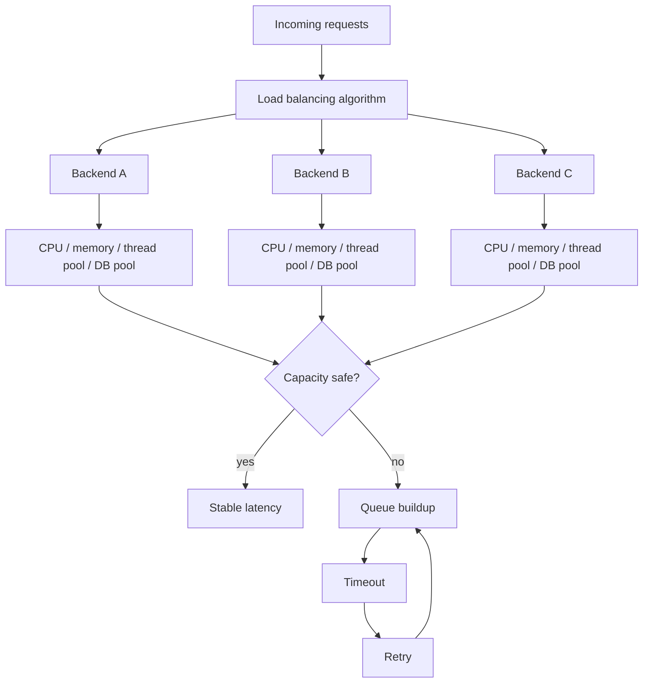
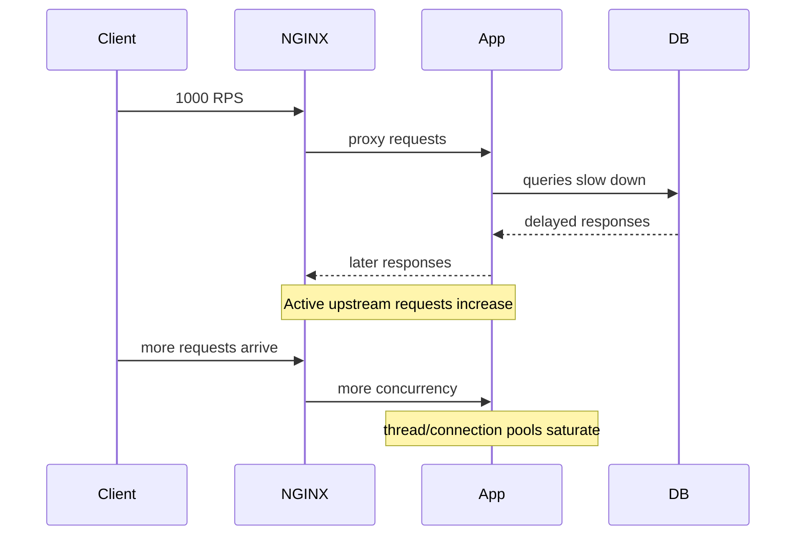

# Part 048 — Weights, Capacity Modelling, and Hotspot Avoidance

Part 047 membahas algoritma. Part ini membahas hal yang lebih sulit: **apakah distribusi traffic itu aman terhadap kapasitas nyata backend?**

Banyak konfigurasi NGINX terlihat benar:

```nginx
upstream app_backend {
    server app-a:8080 weight=3;
    server app-b:8080 weight=2;
    server app-c:8080 weight=1;
}
```

Tetapi pertanyaan production-nya bukan “apakah syntax valid?”. Pertanyaannya:

```txt
Kenapa weight A = 3?
Apakah 3 berarti CPU 3x?
Apakah A punya DB connection pool 3x?
Apakah A punya JVM heap 3x?
Apakah workload tiap request sama?
Apakah tenant besar jatuh ke A?
Apakah A baru restart dan cache-nya masih dingin?
Apa yang terjadi saat B down?
```

Weight tanpa capacity model adalah angka kosmetik.

---

## 1. Mental Model: Load Balancing ≠ Capacity Control

Load balancing menjawab:

```txt
Ke mana request berikutnya dikirim?
```

Capacity control menjawab:

```txt
Berapa banyak kerja yang boleh masuk sebelum sistem rusak?
```

Keduanya berbeda.



Jika kapasitas tidak dikontrol, load balancer hanya mendistribusikan overload.

---

## 2. Weight adalah Rasio, Bukan Limit

`weight` mengatur preferensi relatif.

```nginx
upstream app_backend {
    server app-a:8080 weight=5;
    server app-b:8080 weight=1;
    server app-c:8080 weight=1;
}
```

Secara kasar, dalam round robin weighted:

```txt
A menerima 5 bagian
B menerima 1 bagian
C menerima 1 bagian
Total = 7 bagian

A ≈ 5/7 traffic
B ≈ 1/7 traffic
C ≈ 1/7 traffic
```

Tetapi `weight=5` tidak berarti:

```txt
A maksimum 5 requests
A maksimum 5 RPS
A punya CPU 5x
A punya memory 5x
A boleh selalu menerima 5x traffic
```

Ia hanya rasio pemilihan.

### Weight default

Jika tidak ditentukan, weight default adalah `1`.

```nginx
upstream app_backend {
    server app-a:8080; # weight=1
    server app-b:8080; # weight=1
}
```

### Weight dengan least_conn

`least_conn` tetap mempertimbangkan weight. Artinya server berkapasitas lebih besar boleh menerima active connection lebih banyak sebelum dianggap “setara sibuk”.

```nginx
upstream app_backend {
    least_conn;
    server app-a:8080 weight=4;
    server app-b:8080 weight=2;
    server app-c:8080 weight=1;
}
```

Mental modelnya:

```txt
not simply: choose fewest active connections
but: choose fewest active connections relative to configured weight
```

---

## 3. Jangan Mengukur Capacity dari CPU Core Saja

Salah:

```txt
app-a has 8 cores -> weight=8
app-b has 4 cores -> weight=4
```

Ini bisa benar hanya jika CPU adalah bottleneck utama dan semua resource lain proporsional.

Dalam aplikasi real, bottleneck bisa ada di:

- CPU,
- memory,
- JVM heap,
- GC behavior,
- event loop,
- thread pool,
- DB connection pool,
- downstream API quota,
- disk IO,
- network bandwidth,
- lock contention,
- tenant-specific state,
- cache hit ratio.

Weight harus berasal dari **measured sustainable capacity under SLO**, bukan hardware shape mentah.

### Capacity harus diukur dengan constraint

Format yang lebih benar:

```txt
Instance A sustainable capacity:
  endpoint mix: production-like
  p95 latency target: <= 200 ms
  error rate target: <= 0.1%
  CPU target: <= 65%
  memory headroom: >= 25%
  DB pool saturation: <= 70%
  downstream quota headroom: >= 30%
  result: 800 RPS

Instance B sustainable capacity:
  same constraints
  result: 400 RPS

Suggested weight ratio: A:B = 2:1
```

Bukan:

```txt
A has more CPU, give it more weight.
```

---

## 4. Little's Law sebagai Sanity Check

Untuk request/response workload, gunakan sanity check sederhana:

```txt
concurrency ≈ throughput × latency
```

Contoh:

```txt
RPS = 1,000
average upstream service time = 100 ms = 0.1 sec
estimated active upstream requests = 1,000 × 0.1 = 100
```

Jika latency naik menjadi 1 detik:

```txt
estimated active upstream requests = 1,000 × 1 = 1,000
```

Ini menjelaskan kenapa latency spike bisa berubah menjadi concurrency spike, lalu menjadi timeout/retry storm.



Load balancing algorithm tidak memperbaiki bottleneck downstream. Ia hanya menentukan server mana yang menerima gejalanya.

---

## 5. `max_conns` sebagai Guardrail

NGINX upstream `server` mendukung `max_conns` untuk membatasi jumlah active connections simultan ke proxied server.

```nginx
upstream app_backend {
    zone app_backend_zone 64k;

    least_conn;
    server app-a:8080 weight=2 max_conns=200;
    server app-b:8080 weight=1 max_conns=100;
}
```

Ini berguna untuk mencegah satu backend menerima concurrency lebih besar dari yang bisa ditangani.

Tetapi `max_conns` bukan silver bullet.

Dokumentasi upstream module memperingatkan dua hal penting:

1. Jika upstream group tidak berada di shared memory, limit dapat bekerja per worker.
2. Dengan idle keepalive connections, multiple worker, dan shared memory, total active + idle connection bisa melebihi nilai `max_conns`.

Maka production pattern-nya:

```nginx
upstream app_backend {
    zone app_backend_zone 128k;

    least_conn;
    server app-a:8080 max_conns=200;
    server app-b:8080 max_conns=200;
}
```

Dan tetap ukur dari backend:

```txt
NGINX max_conns is a front-door guardrail.
Application concurrency limit is the real execution guardrail.
DB pool limit is another downstream guardrail.
```

### Jangan memakai max_conns sebagai queue tersembunyi

Jika semua backend mencapai `max_conns`, request baru harus gagal cepat atau dialihkan sesuai policy. Jangan menjadikan NGINX sebagai tempat antrean tanpa batas.

Overload yang sehat:

```txt
fail fast -> client retry with backoff -> system recovers
```

Overload yang buruk:

```txt
queue invisibly -> latency rises -> client timeout -> retry storm -> collapse
```

---

## 6. Hotspot Taxonomy

Hotspot bukan hanya “server A menerima request lebih banyak”. Ada beberapa tipe.

### 6.1 Request count hotspot

Satu backend menerima request count lebih tinggi.

Penyebab:

- weight salah,
- hash skew,
- NAT/IP hash,
- worker-local state anomaly,
- multiple load balancer tidak punya global view.

### 6.2 Work hotspot

Request count mirip, tetapi cost berbeda.

```txt
A: banyak cheap request
B: sedikit expensive request
```

Penyebab:

- route mix tidak merata,
- tenant besar,
- query/report/export endpoint,
- cache miss pattern.

### 6.3 Connection hotspot

Satu backend punya banyak long-lived connection.

Penyebab:

- WebSocket/SSE,
- long polling,
- slow clients jika buffering dimatikan,
- upstream streaming.

### 6.4 Cache hotspot

Satu node menjadi panas karena cache key tertentu.

Penyebab:

- `hash $request_uri consistent` dengan key sangat populer,
- tenant besar,
- viral content,
- poor shard key cardinality.

### 6.5 Cold-start hotspot

Backend baru/recovered langsung menerima traffic terlalu besar.

Penyebab:

- no warmup,
- JVM/JIT/cache cold,
- connection pool belum stabil,
- autoscaler menambah instance tetapi dependency belum siap.

### 6.6 Failure redistribution hotspot

Saat satu backend down, traffic-nya pindah ke backend lain dan membuat mereka ikut jatuh.

Penyebab:

- no headroom,
- retry storm,
- failover capacity tidak dihitung,
- passive health check terlambat.

---

## 7. Capacity Headroom untuk Failure

Jika ada 3 backend, masing-masing running di 70% capacity, apa yang terjadi jika satu backend down?

```txt
Before failure:
A = 70%
B = 70%
C = 70%

After C down:
A ≈ 105%
B ≈ 105%
```

Sistem tidak N+1 safe.

Agar tahan satu node failure:

```txt
For 3 equal backends:
max steady-state utilization should be <= 66%
```

Agar ada ruang untuk retry, spike, GC, dan dependency slowness, target real biasanya lebih rendah.

Production invariant:

```txt
A load-balanced pool is healthy only if remaining capacity can absorb expected failure mode.
```

Weight harus dihitung dengan failure domain.

---

## 8. Weight Design from Measured Capacity

Misal hasil benchmark production-like:

| Backend | Sustainable RPS @ SLO | Suggested share |
|---|---:|---:|
| app-a | 900 | 3 |
| app-b | 600 | 2 |
| app-c | 300 | 1 |

Config:

```nginx
upstream app_backend {
    server app-a:8080 weight=3;
    server app-b:8080 weight=2;
    server app-c:8080 weight=1;
}
```

Tetapi jangan berhenti di sini. Tambahkan guardrail:

```nginx
upstream app_backend {
    zone app_backend_zone 128k;

    least_conn;
    server app-a:8080 weight=3 max_conns=450 max_fails=3 fail_timeout=10s;
    server app-b:8080 weight=2 max_conns=300 max_fails=3 fail_timeout=10s;
    server app-c:8080 weight=1 max_conns=150 max_fails=3 fail_timeout=10s;
}
```

Nilai `max_conns` tidak harus langsung sama dengan capacity RPS. Ia harus berasal dari concurrency safe limit:

```txt
safe_concurrency ≈ sustainable_RPS × allowed_service_time_seconds
```

Contoh:

```txt
app-a sustainable RPS = 900
allowed p95 service time = 0.5s
safe concurrency rough upper bound = 450
```

Ini hanya starting point. Validasi dengan load test dan observability.

---

## 9. Canary dengan Weight: Hati-Hati

Canary paling sederhana:

```nginx
upstream app_backend {
    server app-stable-a:8080 weight=99;
    server app-canary-a:8080 weight=1;
}
```

Masalah:

- pada low traffic, 1% tidak stabil secara statistik,
- keepalive bisa membuat distribusi terlihat tidak intuitif,
- route mix canary belum tentu sama dengan stable,
- user yang sama bisa bolak-balik jika app tidak stateless,
- weight-based canary tidak mudah dikontrol per tenant/user/header.

Untuk canary yang lebih deterministik, gunakan `split_clients` atau routing berbasis header/cookie seperti Part 043.

```nginx
split_clients "$request_id" $canary_bucket {
    1%      canary;
    *       stable;
}

map $http_x_canary $forced_canary {
    default $canary_bucket;
    "1"     canary;
}

map $forced_canary $target_upstream {
    stable  app_stable_backend;
    canary  app_canary_backend;
}

upstream app_stable_backend {
    server stable-a:8080;
    server stable-b:8080;
}

upstream app_canary_backend {
    server canary-a:8080;
}

server {
    location / {
        proxy_pass http://$target_upstream;
    }
}
```

Trade-off: variable `proxy_pass` punya DNS/resolution semantics sendiri. Jangan lupa resolver/dynamic upstream behavior dari Part 041.

---

## 10. Warmup dan Cold Backend Protection

NGINX Plus punya `slow_start` untuk menaikkan weight server secara gradual setelah recovery/availability. Di NGINX Open Source baseline, kamu perlu desain operational workaround.

OSS workaround:

### 10.1 Manual weighted ramp

```nginx
# Stage 1
server app-new:8080 weight=1;

# Stage 2
server app-new:8080 weight=3;

# Stage 3
server app-new:8080 weight=10;
```

Reload bertahap setelah metrik stabil.

### 10.2 Canary pool

```nginx
upstream app_canary_backend {
    server app-new:8080;
}
```

Route 1% traffic via `split_clients`, bukan langsung masuk pool utama.

### 10.3 App-level readiness

Jangan anggap process listening berarti siap.

Readiness harus memvalidasi:

```txt
config loaded
DB connection warmed
cache critical ready or acceptable
thread pool initialized
JIT/warm path acceptable
migration compatibility ok
```

NGINX passive check tidak menggantikan readiness semantics.

---

## 11. Backup Servers: Disaster Path, Bukan Capacity Freebie

`backup` server dipakai ketika primary unavailable.

```nginx
upstream app_backend {
    server app-a:8080;
    server app-b:8080;
    server app-dr:8080 backup;
}
```

Gunakan untuk:

- emergency fallback,
- degraded backend,
- static maintenance app,
- secondary region path dengan konsekuensi jelas.

Jangan gunakan untuk:

- normal capacity tersembunyi,
- server yang tidak pernah diuji,
- cross-region failover tanpa data consistency plan,
- backend lama yang skemanya tertinggal.

Backup server yang tidak dites adalah placebo.

Checklist:

```txt
[ ] Backup path tested monthly
[ ] Data/schema compatible
[ ] Latency expectation documented
[ ] Error budget impact understood
[ ] Logs identify backup usage
[ ] Alert fires when backup receives traffic
```

---

## 12. Avoiding Hotspots with Route Isolation

Satu upstream global:

```nginx
upstream app_backend {
    least_conn;
    server app-a:8080;
    server app-b:8080;
    server app-c:8080;
}

location / {
    proxy_pass http://app_backend;
}
```

Ini mudah, tetapi workload bercampur:

```txt
/fast
/search
/report/export
/stream
/admin/bulk-operation
```

Better:

```nginx
upstream app_normal_backend {
    server app-a:8080;
    server app-b:8080;
}

upstream app_heavy_backend {
    least_conn;
    server heavy-a:8080 max_conns=50;
    server heavy-b:8080 max_conns=50;
}

upstream app_stream_backend {
    least_conn;
    server stream-a:8080 max_conns=10000;
    server stream-b:8080 max_conns=10000;
}

server {
    location /api/reports/export/ {
        proxy_pass http://app_heavy_backend;
        proxy_read_timeout 300s;
    }

    location /api/stream/ {
        proxy_pass http://app_stream_backend;
        proxy_buffering off;
        proxy_read_timeout 1h;
    }

    location / {
        proxy_pass http://app_normal_backend;
    }
}
```

Isolation gives you:

- independent algorithm,
- independent timeout,
- independent concurrency budget,
- independent scaling,
- easier incident isolation.

---

## 13. Avoiding Hotspots with Key Design

For hash-based routing, key design is capacity design.

Bad key:

```nginx
hash $http_x_tenant_id consistent;
```

If one tenant dominates, one backend dominates.

Better for heavy tenant with independent objects:

```nginx
hash "$http_x_tenant_id|$arg_document_bucket" consistent;
```

Or use explicit routing:

```nginx
map $http_x_tenant_id $tenant_pool {
    default shared_tenant_backend;
    tenant_big_a dedicated_tenant_a_backend;
}
```

Then:

```nginx
location / {
    proxy_pass http://$tenant_pool;
}
```

Again, variable upstream needs careful resolver/upstream design. But architecturally, the core idea stands:

```txt
Do not pretend all tenants have equal weight.
```

---

## 14. Load Shedding Before Backend Collapse

NGINX has rate/connection limiting modules that can protect the edge. We cover them in depth later, but capacity design must include them early.

Examples:

```nginx
limit_req_zone $binary_remote_addr zone=per_ip_api:10m rate=20r/s;
limit_conn_zone $binary_remote_addr zone=per_ip_conn:10m;

server {
    location /api/ {
        limit_req zone=per_ip_api burst=40 nodelay;
        limit_conn per_ip_conn 20;

        proxy_pass http://app_backend;
    }
}
```

For multi-tenant systems, prefer tenant key after auth/trust boundary:

```nginx
limit_req_zone $tenant_id zone=per_tenant_api:20m rate=100r/s;
```

Never rely only on backend autoscaling. Autoscaling reacts after load exists. Load shedding prevents overload from becoming collapse.

---

## 15. Observability for Capacity and Hotspot Detection

Add upstream address and timing to logs.

```nginx
log_format capacity_json escape=json
'{'
  '"time":"$time_iso8601",'
  '"request_id":"$request_id",'
  '"method":"$request_method",'
  '"uri":"$uri",'
  '"status":$status,'
  '"request_time":$request_time,'
  '"upstream_addr":"$upstream_addr",'
  '"upstream_status":"$upstream_status",'
  '"upstream_connect_time":"$upstream_connect_time",'
  '"upstream_header_time":"$upstream_header_time",'
  '"upstream_response_time":"$upstream_response_time",'
  '"tenant":"$http_x_tenant_id"'
'}';
```

Dashboard questions:

```txt
Traffic share by upstream_addr
P50/P95/P99 upstream_response_time by upstream_addr
Error rate by upstream_addr
Retry count inferred from comma-separated upstream_addr/status
Top tenants by request count
Top tenants by upstream_response_time sum
Connection count by backend
502/504 by upstream
```

Hotspot query examples:

```txt
Group by upstream_addr:
  count requests
  avg upstream_response_time
  p95 upstream_response_time
  error rate

Group by tenant + upstream_addr:
  count requests
  total request_time
  p95 request_time
```

If you cannot attribute load to upstream and tenant/route, you are debugging blind.

---

## 16. Failure Redistribution Test

Test scenario:

```txt
3 backend instances
steady traffic at 60% of total capacity
kill one backend
observe p95 latency and error rate
```

Expected safe behavior:

```txt
one backend marked unavailable
remaining backends absorb traffic
p95 increases within expected range
error rate bounded
no retry storm
system recovers when backend returns
```

Danger behavior:

```txt
one backend fails
NGINX retries aggressively
remaining backends saturate
latency spikes
clients timeout and retry
all backends fail
```

Use this before claiming the pool is highly available.

---

## 17. Capacity Review Template

Use this in design review.

```txt
Upstream name:
Routes using it:
Algorithm:
Weight rationale:
Backend instance types:
Measured sustainable RPS per instance:
Measured safe concurrency per instance:
SLO target:
Dominant resource:
Known heavy tenants/routes:
max_conns configured:
zone configured:
keepalive configured/verified:
retry policy:
timeout policy:
failure mode tested:
N+1 headroom:
observability fields:
rollback plan:
```

Example:

```txt
Upstream name: app_report_backend
Routes using it: /api/reports/export/*
Algorithm: least_conn
Weight rationale: all instances homogeneous; no weight override
Measured sustainable RPS: 30 export jobs/min per instance
Safe concurrency: 25 per instance
SLO target: 95% complete < 120s
Dominant resource: DB read replica + JVM heap
max_conns: 25 per server
zone: app_report_backend_zone 64k
retry policy: connect/timeout only, no non_idempotent retry
failure mode: one instance kill tested at 60% pool load
observability: upstream_addr/status/response_time + tenant_id
```

---

## 18. Anti-Patterns

### Anti-pattern 1 — Weight by vibes

```nginx
server app-a:8080 weight=10;
server app-b:8080 weight=1;
```

No benchmark. No SLO. No reason.

### Anti-pattern 2 — One pool for all traffic

```nginx
location / {
    proxy_pass http://everything_backend;
}
```

Fast, slow, streaming, admin, and export traffic all fight in one queue.

### Anti-pattern 3 — Hash by untrusted header

```nginx
hash $http_x_user_id consistent;
```

If clients can spoof the header, they can influence routing.

### Anti-pattern 4 — No failure headroom

```txt
All nodes run at 80%.
One node fails.
Remaining nodes collapse.
```

That is not high availability. That is high utilization with optimistic routing.

### Anti-pattern 5 — Canary by weight only

Weight canary is fine for rough ramp, but poor for controlled blast-radius by tenant/user/route.

---

## 19. Production Patterns

### Pattern A — Homogeneous stateless API

```nginx
upstream api_backend {
    zone api_backend_zone 64k;

    server api-a:8080 max_conns=500;
    server api-b:8080 max_conns=500;
    server api-c:8080 max_conns=500;
}
```

Algorithm: default weighted round robin.

### Pattern B — Variable latency API

```nginx
upstream api_backend {
    zone api_backend_zone 64k;

    least_conn;
    server api-a:8080 max_conns=400;
    server api-b:8080 max_conns=400;
    server api-c:8080 max_conns=400;
}
```

Algorithm: least connections.

### Pattern C — Heavy report pool

```nginx
upstream report_backend {
    zone report_backend_zone 64k;

    least_conn;
    server report-a:8080 max_conns=30;
    server report-b:8080 max_conns=30;
}
```

Route-specific isolation.

### Pattern D — Cache shard backend

```nginx
upstream cache_backend {
    zone cache_backend_zone 64k;

    hash "$scheme|$host|$uri|$args" consistent;
    server cache-a:8080;
    server cache-b:8080;
    server cache-c:8080;
}
```

But normalize key carefully. Raw `$args` can create excessive cardinality or cache poisoning risk if not controlled.

### Pattern E — Legacy session affinity as transition

```nginx
upstream legacy_backend {
    ip_hash;
    server legacy-a:8080;
    server legacy-b:8080;
}
```

Add migration plan:

```txt
Move session state to Redis/database.
Remove ip_hash.
Switch to least_conn or round robin.
```

---

## 20. The Practical Rule

Weights should satisfy this invariant:

```txt
For expected workload and failure mode, each backend receives work proportional to measured sustainable capacity, with enough headroom to absorb retry, failover, and latency variance without violating SLO.
```

Hotspot avoidance should satisfy this invariant:

```txt
No single route, tenant, key, connection class, or recovered backend can silently consume enough capacity to collapse the shared pool.
```

NGINX config is not the architecture. It is the executable edge expression of your capacity assumptions.

If the assumptions are wrong, the config will still reload successfully — and production will fail anyway.

---

## References

- NGINX official docs — HTTP Load Balancing: https://nginx.org/en/docs/http/load_balancing.html
- NGINX official docs — `ngx_http_upstream_module`: https://nginx.org/en/docs/http/ngx_http_upstream_module.html
- F5 NGINX docs — HTTP Load Balancing: https://docs.nginx.com/nginx/admin-guide/load-balancer/http-load-balancer/
