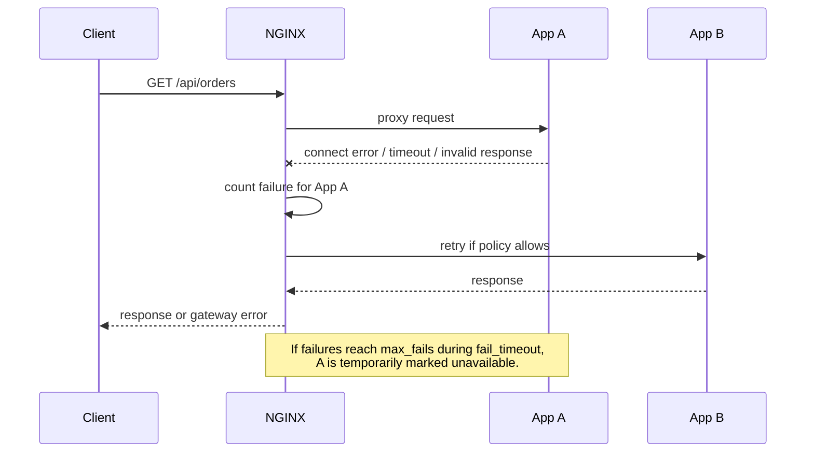
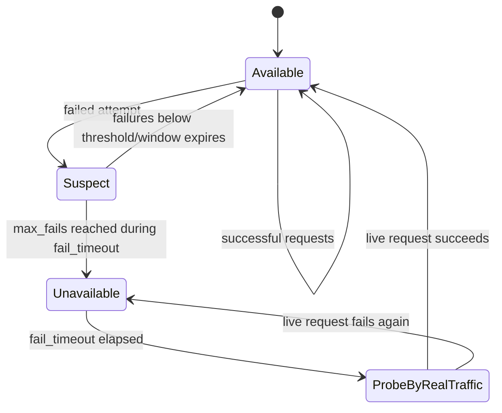
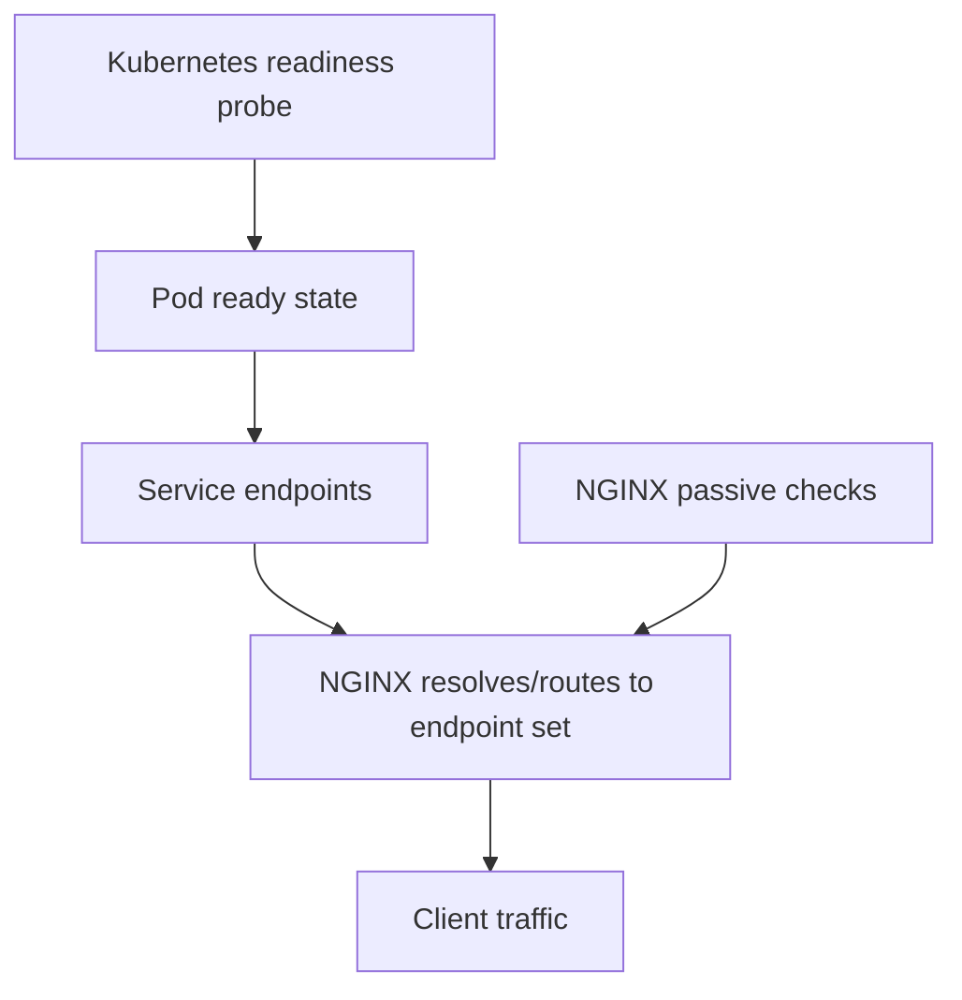
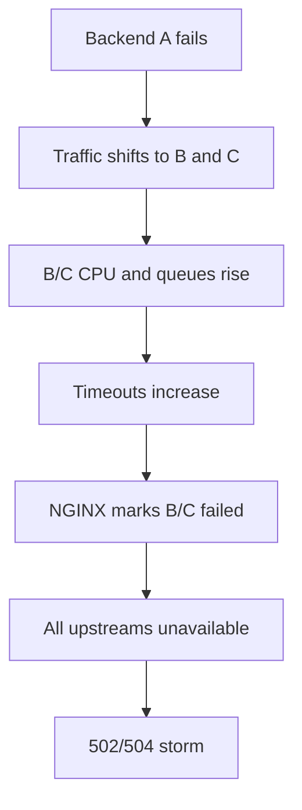

# Part 049 — Passive Health Checks in NGINX Open Source

Part 046 sampai Part 048 membangun mental model load balancing: algoritma, weight, capacity, dan hotspot.

Sekarang kita masuk ke pertanyaan yang lebih tajam:

```txt
Bagaimana NGINX tahu sebuah upstream sedang rusak?
```

Di NGINX Open Source, jawaban default-nya adalah:

```txt
NGINX tahu dari kegagalan request nyata yang sedang lewat.
```

Itulah **passive health check**.

Passive health check bukan background probe. Bukan scheduler yang memanggil `/health`. Bukan readiness checker. Bukan semantic health model. Ia adalah mekanisme inferensi dari failure ketika NGINX mencoba memakai upstream untuk request sungguhan.

Ini membuatnya murah dan sederhana, tetapi juga punya batas keras.

---

## 1. Mental Model: Passive Means “Learn from Pain”

Passive health check bekerja seperti ini:



The health model is not:

```txt
NGINX checks whether backend is healthy.
```

The actual model is:

```txt
NGINX observes failed communication attempts while serving real traffic.
If enough failures happen in a window, it temporarily avoids that server.
```

That difference matters.

A backend can be broken but still receive the first request that reveals the breakage.

---

## 2. The Two Core Knobs: `max_fails` and `fail_timeout`

A basic upstream looks like this:

```nginx
upstream app_backend {
    server app-a:8080 max_fails=3 fail_timeout=10s;
    server app-b:8080 max_fails=3 fail_timeout=10s;
    server app-c:8080 max_fails=3 fail_timeout=10s;
}

server {
    listen 80;

    location / {
        proxy_pass http://app_backend;
    }
}
```

Read it as:

```txt
If app-a has 3 unsuccessful attempts within 10 seconds,
NGINX marks app-a unavailable for 10 seconds.
```

The same `fail_timeout` has two meanings:

```txt
1. the observation window for counting failures
2. the duration the server is considered unavailable after being marked failed
```

So this config:

```nginx
server app-a:8080 max_fails=2 fail_timeout=30s;
```

means:

```txt
If 2 failures happen within 30s,
mark app-a failed for 30s.
```

This dual meaning is a common source of bad tuning.

---

## 3. Defaults Are Small and Easy to Misread

The documented defaults are conceptually:

```txt
max_fails=1
fail_timeout=10s
```

That means one observed failure can make a backend temporarily unavailable for the fail timeout window.

This may be fine for a clearly dead backend.

It can be dangerous for transient network blips, small pools, long-lived requests, or heterogeneous workloads.

Example:

```nginx
upstream app_backend {
    server app-a:8080;
    server app-b:8080;
}
```

This is not “no health check behavior”. It still has the default upstream failure parameters unless disabled or overridden.

To disable this passive failure marking for a server:

```nginx
upstream app_backend {
    server app-a:8080 max_fails=0;
    server app-b:8080 max_fails=0;
}
```

But disabling failure marking is rarely the right first choice. Usually you should tune it deliberately.

---

## 4. What Counts as a Failure?

Do not assume every HTTP 500 automatically marks a server failed.

NGINX has multiple upstream modules:

```txt
proxy_pass      -> proxy_next_upstream
fastcgi_pass    -> fastcgi_next_upstream
uwsgi_pass      -> uwsgi_next_upstream
grpc_pass       -> grpc_next_upstream
scgi_pass       -> scgi_next_upstream
```

The definition of an unsuccessful attempt is tied to the relevant `*_next_upstream` behavior.

For HTTP proxying, common conditions include:

```nginx
proxy_next_upstream error timeout invalid_header http_500 http_502 http_503 http_504;
```

But adding status-code-based retry is a design decision, not a harmless improvement.

```txt
error           = communication-level failure
 timeout        = upstream did not respond in time
 invalid_header = upstream response was malformed
 http_500       = app returned 500
 http_502       = bad gateway from upstream layer
 http_503       = unavailable
 http_504       = upstream gateway timeout
```

Communication failure and application failure are not the same.

A backend that returns 500 because one endpoint has a bug may still be perfectly healthy for other endpoints.

---

## 5. Passive Health Check Is Route-Blind

Consider this backend:

```txt
GET /api/catalog       healthy
GET /api/orders        healthy
POST /api/payments     broken due to downstream payment provider
```

If you configure:

```nginx
proxy_next_upstream error timeout invalid_header http_500 http_502 http_503 http_504;
```

and `POST /api/payments` returns 500 repeatedly, NGINX may treat the backend as failed for the entire upstream server, not just the payments route.

That is a route-blind failure model.

Better route-specific policy:

```nginx
location /api/catalog/ {
    proxy_next_upstream error timeout invalid_header http_502 http_503 http_504;
    proxy_pass http://catalog_backend;
}

location /api/payments/ {
    proxy_next_upstream error timeout invalid_header;
    proxy_next_upstream_tries 1;
    proxy_pass http://payments_backend;
}
```

The edge should not turn a domain-specific failure into global backend eviction unless that is intentional.

---

## 6. Passive Health Check Is Traffic-Triggered

A dead backend with no traffic may remain unknown.

```txt
No request sent to backend
=> no failed communication attempt
=> no passive failure observation
```

This has a production consequence:

```txt
The first user after an idle period may become the health probe.
```

This is acceptable for some internal services.

It is unacceptable for latency-sensitive, externally visible, or high-value flows where the first request after deploy must not discover brokenness.

---

## 7. The Single-Server Trap

If an upstream group has only one server, `max_fails` and `fail_timeout` are ignored for the purpose of marking the server unavailable.

Why?

Because if there is only one server, there is nowhere else to send traffic.

Example:

```nginx
upstream app_backend {
    server app-a:8080 max_fails=1 fail_timeout=10s;
}
```

This does not give you meaningful load-balancer-level failover.

It only creates a comforting illusion.

The actual resilience model is:

```txt
If app-a fails, clients fail.
```

A single backend can still benefit from timeout control, buffering, logging, TLS termination, and header normalization — but not upstream failover.

---

## 8. Failure Window Timeline

Suppose:

```nginx
server app-a:8080 max_fails=3 fail_timeout=10s;
```

Timeline:

```txt
T+00s request to app-a fails
T+03s request to app-a fails
T+08s request to app-a fails
      => 3 failures within 10s
      => app-a marked unavailable

T+08s to T+18s
      => app-a avoided when alternatives exist

After T+18s
      => app-a may be tried again by live traffic
```

Important:

```txt
NGINX does not prove app-a is healthy at T+18s.
It allows live traffic to test it again.
```

That first request after the fail window is the probe.

---

## 9. Passive Recovery Is Also Passive

Passive health check has passive failure detection and passive recovery.



There is no background loop like:

```txt
every 5s GET /health
if 2 passes then healthy
```

That is active health checking, covered in Part 050.

---

## 10. Basic Passive Health Check Config

A reasonable starting point for stateless HTTP services:

```nginx
upstream app_backend {
    zone app_backend_zone 64k;

    server app-1:8080 max_fails=3 fail_timeout=10s;
    server app-2:8080 max_fails=3 fail_timeout=10s;
    server app-3:8080 max_fails=3 fail_timeout=10s;
}

server {
    listen 80;

    location / {
        proxy_connect_timeout 1s;
        proxy_send_timeout 10s;
        proxy_read_timeout 30s;

        proxy_next_upstream error timeout invalid_header http_502 http_503 http_504;
        proxy_next_upstream_tries 2;
        proxy_next_upstream_timeout 3s;

        proxy_pass http://app_backend;
    }
}
```

Why this shape?

```txt
max_fails=3
    Avoid evicting a backend on one transient error.

fail_timeout=10s
    Keep the failure window short enough for recovery.

proxy_next_upstream excludes http_500
    Avoid treating all app bugs as server health failure.

proxy_next_upstream_tries=2
    Bound retry amplification.

proxy_next_upstream_timeout=3s
    Bound total retry delay.
```

This is not universal. It is a safe shape for many stateless read-heavy services.

---

## 11. Why `zone` Matters

Add a shared upstream zone when you care about consistent upstream runtime state across workers:

```nginx
upstream app_backend {
    zone app_backend_zone 64k;
    server app-1:8080 max_fails=3 fail_timeout=10s;
    server app-2:8080 max_fails=3 fail_timeout=10s;
}
```

Without shared state, each worker can have its own view of upstream state. With a zone, the group configuration and runtime state can be shared.

In production, use a zone by default for non-trivial upstream groups because it makes several advanced and runtime-aware behaviors more coherent.

Do not choose the zone size randomly. Small groups need little space; large dynamic groups need more. Monitor startup/reload errors and vendor documentation for module-specific requirements.

---

## 12. Tuning `max_fails`

`max_fails=1` is fast but aggressive.

```nginx
server app-a:8080 max_fails=1 fail_timeout=10s;
```

Good when:

```txt
backend failures are almost always real outages
pool has enough alternatives
requests are cheap to retry
latency SLO prefers quick avoidance
```

Risky when:

```txt
network has transient blips
backend occasionally closes idle connections
request cost is high
pool is small
traffic is uneven
```

`max_fails=3` or `5` is more conservative:

```nginx
server app-a:8080 max_fails=5 fail_timeout=10s;
```

Good when:

```txt
you want evidence before eviction
app has occasional sporadic failures
pool is small
traffic is high enough to observe failures quickly
```

Risky when:

```txt
backend hard-fails and you waste too many user requests before eviction
```

The tuning question is:

```txt
How many real user requests am I willing to sacrifice before this server is avoided?
```

---

## 13. Tuning `fail_timeout`

Short `fail_timeout`:

```nginx
server app-a:8080 max_fails=3 fail_timeout=5s;
```

Pros:

```txt
faster recovery
less time excluding a backend after transient failure
useful for elastic environments
```

Cons:

```txt
bad backend may re-enter too quickly
first request after window repeatedly suffers
can create oscillation
```

Long `fail_timeout`:

```nginx
server app-a:8080 max_fails=3 fail_timeout=60s;
```

Pros:

```txt
keeps clearly bad backend out longer
reduces repeated probing by user traffic
stabilizes pool during real outage
```

Cons:

```txt
slower recovery
more load shifted to remaining servers
can overload the healthy pool
```

The tuning question is:

```txt
Is recovery speed more important than avoiding repeated bad probes?
```

---

## 14. Passive Checks and Retry Are Coupled

Passive health check tells NGINX when a server looks bad.

Retry policy tells NGINX whether to try another server for the current request.

They must be designed together.

Bad config:

```nginx
proxy_next_upstream error timeout invalid_header http_500 http_502 http_503 http_504;
proxy_next_upstream_tries 0;
```

`0` for tries means no explicit small bound. Depending on pool size and conditions, this can create too much retry behavior.

Safer:

```nginx
proxy_next_upstream error timeout invalid_header http_502 http_503 http_504;
proxy_next_upstream_tries 2;
proxy_next_upstream_timeout 3s;
```

For write endpoints:

```nginx
location /api/payments/ {
    proxy_next_upstream error timeout invalid_header;
    proxy_next_upstream_tries 1;
    proxy_pass http://payments_backend;
}
```

The invariant:

```txt
A retry is allowed only when the request can be safely repeated or when the upstream has not received it.
```

---

## 15. The Duplicate Write Failure Mode

Imagine:

```txt
Client -> NGINX -> app-a
app-a writes order to DB
app-a times out before response reaches NGINX
NGINX retries to app-b
app-b writes same order again
```

From the load balancer perspective:

```txt
The first attempt timed out.
Retry seems helpful.
```

From the business system perspective:

```txt
The order was created twice.
```

Passive health checks plus retries can accidentally turn partial failures into duplicate side effects.

For non-idempotent flows, prefer:

```nginx
location /api/orders/ {
    proxy_next_upstream error timeout invalid_header;
    proxy_next_upstream_tries 1;
    proxy_pass http://orders_backend;
}
```

Then solve reliability at the application layer:

```txt
idempotency key
unique business key
transactional outbox
saga compensation
safe retry token
```

NGINX cannot infer business idempotency.

---

## 16. HTTP Status Codes as Health Signals

Use status-code retry carefully.

Usually safer as failure signals:

```txt
502 Bad Gateway
503 Service Unavailable
504 Gateway Timeout
```

More dangerous:

```txt
500 Internal Server Error
```

Why?

`500` can mean:

```txt
server process broken
one endpoint bug
one tenant bad input bug
one downstream dependency failure
programming exception for a specific route
```

If you use `http_500` for upstream failure marking, you may evict healthy capacity because one route or tenant causes failures.

Better pattern:

```nginx
location /api/read-heavy/ {
    proxy_next_upstream error timeout invalid_header http_502 http_503 http_504;
    proxy_next_upstream_tries 2;
    proxy_pass http://read_backend;
}

location /api/write-heavy/ {
    proxy_next_upstream error timeout invalid_header;
    proxy_next_upstream_tries 1;
    proxy_pass http://write_backend;
}
```

---

## 17. Backend Readiness Is Not Passive Health

An application health endpoint may expose:

```http
GET /health/ready
200 OK
```

NGINX Open Source passive health checks do not call it.

You can route it:

```nginx
location = /health/ready {
    proxy_pass http://app_backend;
}
```

But this only lets an external system call the health endpoint. It does not make Open Source NGINX use that endpoint for active upstream health checking.

Common external systems that may use readiness:

```txt
Kubernetes readiness probe
cloud load balancer health check
service discovery controller
deployment orchestrator
external synthetic monitor
```

The correct architecture may be:



In this model, readiness removes bad pods before NGINX sees them, while passive checks handle communication failures during traffic.

---

## 18. Passive Checks in Kubernetes and Dynamic Environments

In Kubernetes, NGINX may sit in several places:

```txt
outside cluster -> routes to NodePort/LoadBalancer/Ingress
inside cluster  -> routes to ClusterIP service
as ingress      -> controller watches endpoints
```

Passive health checks alone are not enough for pod lifecycle.

Why?

```txt
A pod can be alive but not ready.
A pod can be terminating but still have open connections.
A pod can pass TCP connect but fail app readiness.
A service IP may hide endpoint churn.
```

Production invariant:

```txt
Use orchestrator readiness for membership.
Use NGINX passive checks for observed communication failures.
Use timeout/retry budgets for bounded degradation.
```

Do not expect passive checks to replace readiness probes.

---

## 19. Passive Checks and Slow Startup

A backend restarting with cold JVM, cold cache, or warming DB pool may accept connections but respond slowly.

Passive checks may see:

```txt
connect succeeds
read timeout occurs
backend marked failed
later re-enters
read timeout again
oscillation
```

Mitigations:

```txt
application readiness should stay false until warm enough
traffic ramp should avoid immediate full load
upstream timeout should reflect expected cold path
retry budget should be bounded
remaining pool must have enough headroom
```

NGINX Plus has `slow_start` for gradual recovery in supported contexts. In Open Source, design ramping outside NGINX or through deployment/orchestrator traffic control.

---

## 20. “All Upstreams Failed” Behavior

If all upstream servers are considered unavailable or fail attempts, the client gets an error such as `502 Bad Gateway` or `504 Gateway Timeout`, depending on where failure occurs.

This is not a health-check problem only. It is a capacity and failure-domain problem.

If you have three backends and one fails:

```txt
remaining capacity must absorb shifted traffic
```

If remaining capacity cannot absorb traffic, then passive health checks may trigger cascade:



Health checks do not create spare capacity.

---

## 21. Observability: Log the Upstream Story

A useful access log must include upstream fields.

```nginx
log_format edge_json escape=json
  '{'
    '"ts":"$time_iso8601",'
    '"remote_addr":"$remote_addr",'
    '"host":"$host",'
    '"method":"$request_method",'
    '"uri":"$request_uri",'
    '"status":$status,'
    '"request_time":$request_time,'
    '"upstream_addr":"$upstream_addr",'
    '"upstream_status":"$upstream_status",'
    '"upstream_connect_time":"$upstream_connect_time",'
    '"upstream_header_time":"$upstream_header_time",'
    '"upstream_response_time":"$upstream_response_time",'
    '"request_id":"$request_id"'
  '}';
```

Important variables:

```txt
$upstream_addr
    Which upstream server(s) were tried.

$upstream_status
    Status returned by each upstream attempt.

$upstream_connect_time
    Time to establish upstream connection.

$upstream_header_time
    Time until response header from upstream.

$upstream_response_time
    Total upstream response time.
```

If retries happen, these variables may contain comma-separated values.

That is useful. It shows the attempt chain.

Example log interpretation:

```json
{
  "status": 200,
  "upstream_addr": "10.0.1.10:8080, 10.0.1.11:8080",
  "upstream_status": "504, 200",
  "upstream_connect_time": "0.001, 0.001",
  "upstream_response_time": "5.001, 0.043"
}
```

Meaning:

```txt
First upstream timed out.
Second upstream succeeded.
Client saw 200.
But the system had a hidden failure/retry.
```

If you only observe client status, you miss upstream degradation.

---

## 22. Error Log Signals

During passive failure, error log messages may show patterns like:

```txt
connect() failed while connecting to upstream
upstream timed out while connecting to upstream
upstream timed out while reading response header from upstream
upstream prematurely closed connection
no live upstreams while connecting to upstream
```

Do not debug these as isolated messages.

Classify them:

```txt
connect failure
    backend process down, port closed, network/security group issue

connect timeout
    network path issue, SYN backlog, packet loss, firewall, overloaded host

read timeout
    app slow, DB slow, thread pool saturated, long request, bad timeout

premature close
    app crash, upstream keepalive mismatch, proxy protocol mismatch, app server limit

no live upstreams
    all candidates marked failed or unavailable
```

The phrase “upstream failed” is not root cause. It is a symptom at the edge.

---

## 23. Safe Passive Check Profiles

### Profile A — Stateless read API

```nginx
upstream read_api {
    zone read_api_zone 64k;
    least_conn;

    server read-1:8080 max_fails=3 fail_timeout=10s;
    server read-2:8080 max_fails=3 fail_timeout=10s;
    server read-3:8080 max_fails=3 fail_timeout=10s;
}

location /api/read/ {
    proxy_connect_timeout 1s;
    proxy_read_timeout 10s;
    proxy_next_upstream error timeout invalid_header http_502 http_503 http_504;
    proxy_next_upstream_tries 2;
    proxy_next_upstream_timeout 2s;
    proxy_pass http://read_api;
}
```

Reasoning:

```txt
Read requests are often safely retryable.
Retries are bounded.
500 is excluded to avoid route-local bug causing server eviction.
```

### Profile B — Write API

```nginx
upstream write_api {
    zone write_api_zone 64k;
    server write-1:8080 max_fails=3 fail_timeout=10s;
    server write-2:8080 max_fails=3 fail_timeout=10s;
}

location /api/write/ {
    proxy_connect_timeout 1s;
    proxy_read_timeout 30s;
    proxy_next_upstream error timeout invalid_header;
    proxy_next_upstream_tries 1;
    proxy_pass http://write_api;
}
```

Reasoning:

```txt
Do not retry side-effecting writes across backends at the edge.
Let the app own idempotency.
```

### Profile C — Long-running report API

```nginx
upstream report_api {
    zone report_api_zone 64k;
    server report-1:8080 max_fails=2 fail_timeout=30s;
    server report-2:8080 max_fails=2 fail_timeout=30s;
}

location /api/reports/ {
    proxy_connect_timeout 2s;
    proxy_read_timeout 300s;
    proxy_next_upstream error timeout invalid_header;
    proxy_next_upstream_tries 1;
    proxy_pass http://report_api;
}
```

Reasoning:

```txt
A long report timing out does not automatically mean the backend is globally unhealthy.
Retrying long reports can double expensive work.
```

---

## 24. Passive Health Check Failure Drills

Do not ship passive health checks without drills.

### Drill 1 — Backend process down

```bash
# stop one backend
systemctl stop app-a

# send traffic
for i in $(seq 1 100); do curl -s -o /dev/null -w "%{http_code}\n" http://edge/api/read/; done
```

Expected:

```txt
some early failures or retries
app-a marked failed after threshold
traffic continues to app-b/app-c
logs show upstream attempt chain
```

### Drill 2 — Backend accepts connection but hangs

Use a test backend that accepts TCP but never responds.

Expected:

```txt
connect_time low
header_time/read timeout high
bounded retry
no unbounded request pileup
```

### Drill 3 — Backend returns 500 for one route

Expected:

```txt
route does not evict backend globally unless policy says so
500s visible in logs
no duplicate write retry
```

### Drill 4 — All backends overloaded

Expected:

```txt
NGINX reports no live upstreams or gateway errors
alerts fire on upstream_status/upstream_response_time
system does not retry-amplify itself to death
```

---

## 25. Anti-Patterns

### Anti-pattern 1 — Treat passive checks as readiness

```txt
“NGINX will stop sending traffic to unready pods.”
```

No. NGINX Open Source passive checks only learn from failed traffic attempts.

### Anti-pattern 2 — Enable retry on every status

```nginx
proxy_next_upstream error timeout invalid_header http_500 http_502 http_503 http_504 http_403 http_404;
```

This confuses application semantics with infrastructure health.

### Anti-pattern 3 — No retry bounds

```nginx
proxy_next_upstream error timeout invalid_header http_502 http_503 http_504;
```

Without explicit tries/time budget, retry behavior can become harder to reason about.

### Anti-pattern 4 — One backend and fake failover

```nginx
upstream app_backend {
    server app-a:8080 max_fails=1 fail_timeout=10s;
}
```

There is no alternative target.

### Anti-pattern 5 — Health tuning without capacity math

```txt
A fails.
Traffic shifts to B/C.
B/C overload.
Health checks mark B/C failed.
Outage expands.
```

Health checks require spare capacity.

---

## 26. Review Checklist

For every upstream group, review:

```txt
[ ] How many servers exist in the group?
[ ] Is there a shared upstream zone?
[ ] What is max_fails?
[ ] What is fail_timeout?
[ ] What failure conditions count via *_next_upstream?
[ ] Are retry tries/time explicitly bounded?
[ ] Are write endpoints protected from duplicate side effects?
[ ] Are long-running endpoints protected from expensive retry duplication?
[ ] Can remaining servers absorb traffic when one server is marked failed?
[ ] Are upstream attempts visible in access logs?
[ ] Are connect/header/response times logged?
[ ] Do alert rules catch hidden retries even when client status is 200?
[ ] Has failover been tested with failure injection?
```

---

## 27. Production Decision Matrix

| Scenario | Passive check enough? | Recommended approach |
|---|---:|---|
| Small internal stateless service | Often yes | `max_fails`, `fail_timeout`, bounded retry |
| Public high-value API | Partially | passive checks + external readiness/synthetic checks |
| Kubernetes pods | No, not alone | orchestrator readiness + passive edge failure handling |
| Payment/write flow | Health yes, retry no | passive failure detection, no edge retry after send |
| Large dynamic pool | Often insufficient alone | service discovery, readiness, active checks or controller |
| Need semantic `/ready` check | No | active checks or external LB/orchestrator |
| Need pre-warm before traffic | No | deployment readiness/ramp/active checks |
| Need zero first-user failure after deploy | No | active checks/readiness before membership |

---

## 28. Minimal Production Template

```nginx
upstream app_backend {
    zone app_backend_zone 64k;

    least_conn;
    server app-1:8080 max_fails=3 fail_timeout=10s;
    server app-2:8080 max_fails=3 fail_timeout=10s;
    server app-3:8080 max_fails=3 fail_timeout=10s;
}

server {
    listen 80;

    location /api/read/ {
        proxy_connect_timeout 1s;
        proxy_send_timeout 10s;
        proxy_read_timeout 15s;

        proxy_next_upstream error timeout invalid_header http_502 http_503 http_504;
        proxy_next_upstream_tries 2;
        proxy_next_upstream_timeout 3s;

        proxy_pass http://app_backend;
    }

    location /api/write/ {
        proxy_connect_timeout 1s;
        proxy_send_timeout 10s;
        proxy_read_timeout 30s;

        proxy_next_upstream error timeout invalid_header;
        proxy_next_upstream_tries 1;

        proxy_pass http://app_backend;
    }
}
```

The important part is not these exact numbers.

The important part is that each number expresses a failure policy.

---

## 29. The Practical Rule

Passive health checks are good at this:

```txt
Avoid repeatedly sending live traffic to an upstream that has recently failed communication attempts.
```

They are bad at this:

```txt
Proving readiness before traffic.
Understanding business health.
Checking route-specific semantics.
Preventing duplicate writes.
Creating spare capacity.
Guaranteeing zero first-user failure.
```

The invariant:

```txt
Use passive checks as a bounded failure-reaction mechanism, not as your complete service health model.
```

If production requires knowing health before traffic arrives, you need active checks, orchestrator readiness, external membership control, or a higher-level traffic management system.

That is exactly what Part 050 covers.

---

## References

- NGINX official docs — HTTP Load Balancing: https://nginx.org/en/docs/http/load_balancing.html
- NGINX official docs — `ngx_http_upstream_module`: https://nginx.org/en/docs/http/ngx_http_upstream_module.html
- NGINX official docs — `ngx_http_proxy_module`: https://nginx.org/en/docs/http/ngx_http_proxy_module.html
- F5 NGINX docs — HTTP Health Checks: https://docs.nginx.com/nginx/admin-guide/load-balancer/http-health-check/
