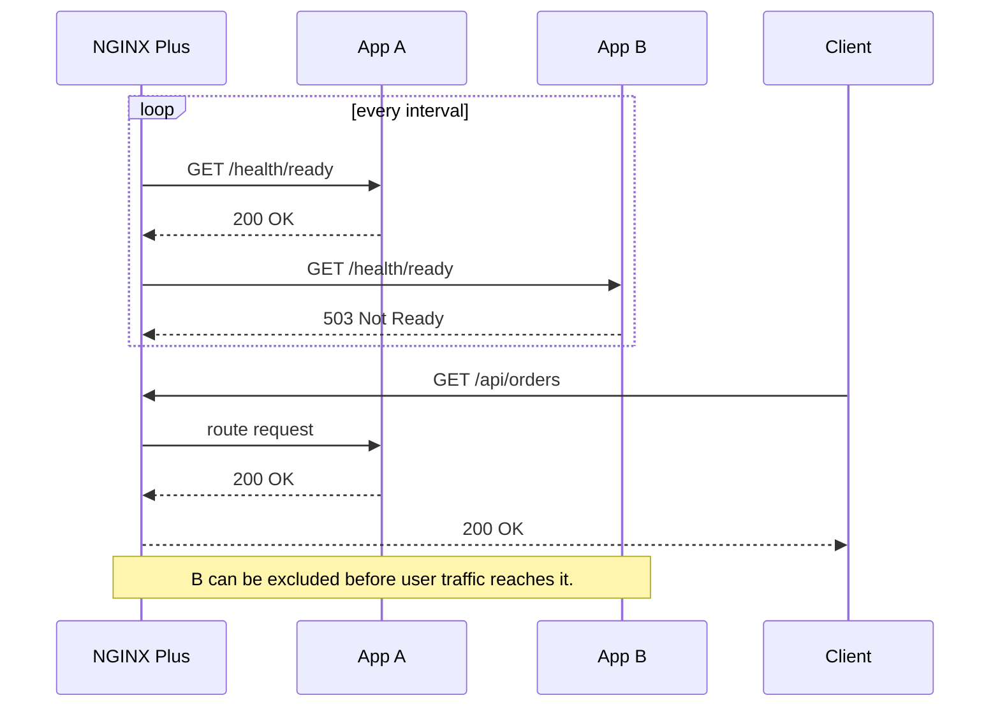
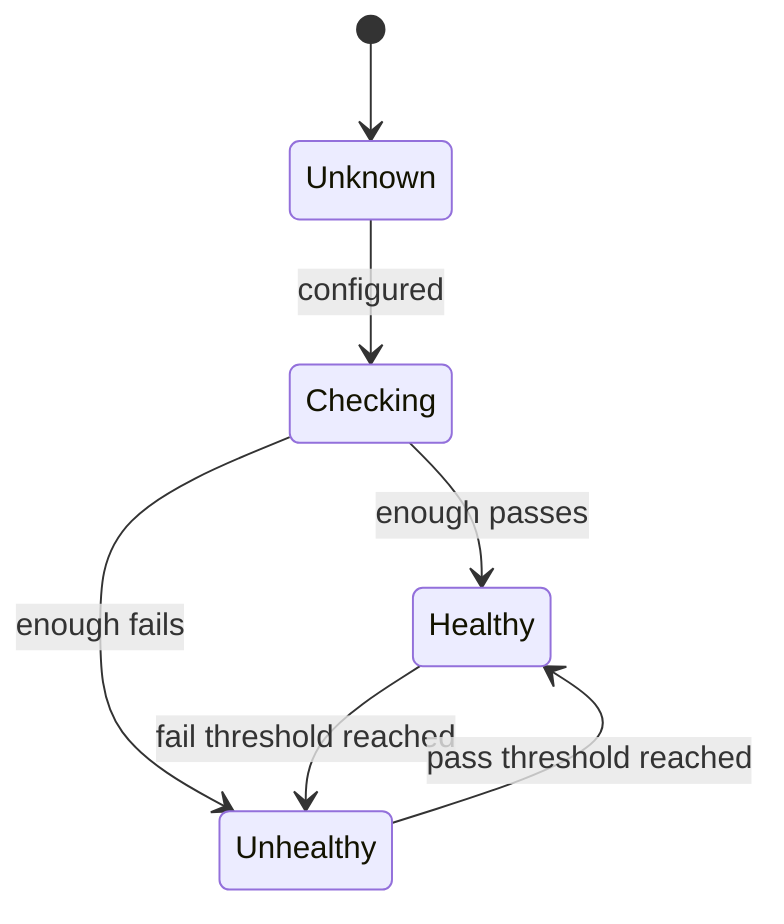
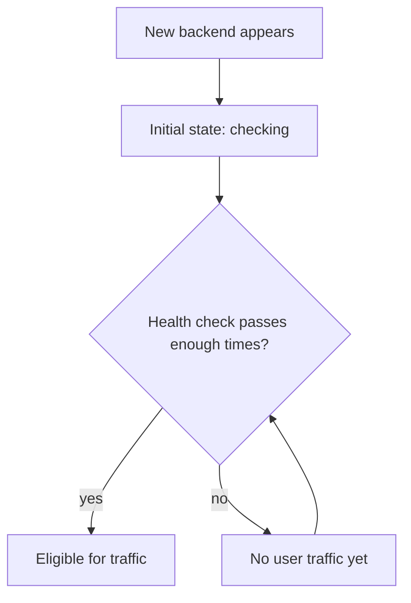
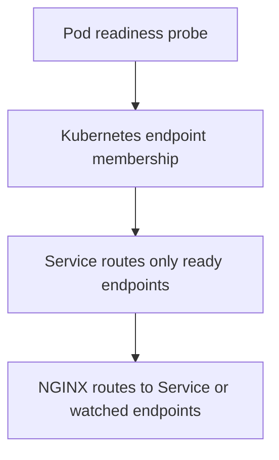
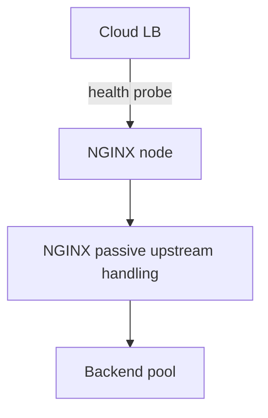
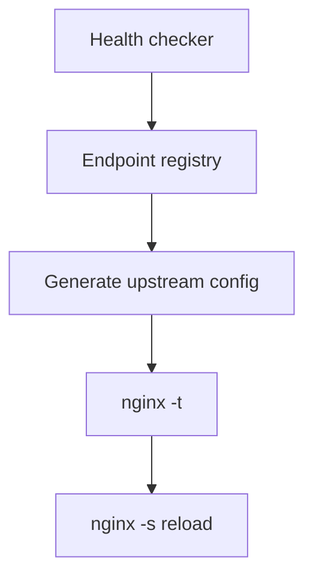
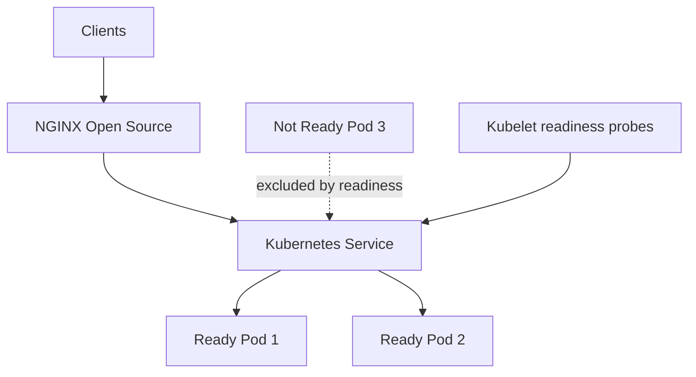
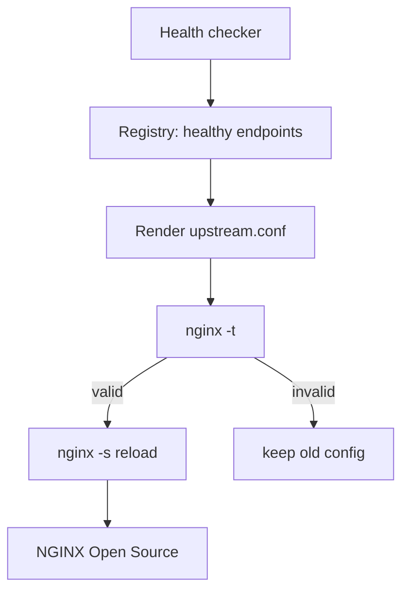

# Part 050 — Active Health Checks and NGINX Plus Boundary

Part 049 established a hard boundary:

```txt
NGINX Open Source passive health checks learn from failed live traffic.
```

That is useful, but incomplete.

Sometimes production needs a stronger property:

```txt
Do not send user traffic to a backend until it has proven readiness.
```

That is the role of **active health checks**.

In the NGINX product line, active upstream health checks are an **NGINX Plus capability**. This part is intentionally explicit about that boundary, because many architecture mistakes happen when teams design as if Open Source NGINX is doing background health probes when it is not.

---

## 1. Mental Model: Active Means “Probe Before Pain”

Passive health check:

```txt
real user request fails
NGINX learns from the failure
future requests avoid the server temporarily
```

Active health check:

```txt
NGINX periodically sends probe requests
NGINX updates upstream health state
user traffic is routed based on that state
```



This changes the user experience.

With passive checks:

```txt
The first unlucky user may discover failure.
```

With active checks:

```txt
The health-checker can discover failure before a user does.
```

---

## 2. The Product Boundary

Do not blur this:

```txt
NGINX Open Source:
    passive health checks via upstream failure parameters
    no built-in periodic HTTP upstream health probe in core OSS HTTP load balancing

NGINX Plus:
    active health checks via health_check directive and related modules
    richer upstream state, API, monitoring, and some traffic-management features
```

This does not mean Open Source NGINX is weak.

It means the architecture must assign responsibilities honestly.

If you need active health decisions with Open Source NGINX, use one of these patterns:

```txt
orchestrator readiness controls membership
external load balancer performs health checks
service discovery removes bad endpoints
config generator rewrites upstream list and reloads NGINX
sidecar/controller manages endpoint state
```

But do not pretend `max_fails` is the same as probing `/ready`.

---

## 3. Basic NGINX Plus Active Health Check Shape

A representative NGINX Plus HTTP health-check configuration looks like:

```nginx
upstream app_backend {
    zone app_backend_zone 64k;

    server app-1:8080;
    server app-2:8080;
    server app-3:8080;
}

server {
    listen 80;

    location / {
        proxy_pass http://app_backend;
        health_check uri=/health/ready;
    }
}
```

Important points:

```txt
The upstream group must use a shared memory zone.
The health_check directive is configured in the location that proxies to the upstream.
NGINX Plus periodically checks the servers in the referenced upstream group.
```

This is not just syntax. It is a different operating model.

---

## 4. Health Check State Machine

A useful active health-check mental model:



Production health check design usually needs at least four concepts:

```txt
interval
    how often checks run

failure threshold
    how many failed checks before unhealthy

pass threshold
    how many successful checks before healthy/recovered

match condition
    what response counts as healthy
```

Without thresholds, a single transient response can cause flapping.

---

## 5. Probe Endpoint Design: `/live` Is Not `/ready`

A common mistake:

```txt
Use /health for everything.
```

Better separation:

```txt
/live
    Is the process alive enough that restarting it is not necessary?

/ready
    Is the process ready to receive real production traffic?

/startup
    Has the application completed bootstrapping/warmup?
```

For load balancer routing, active health checks usually want readiness, not liveness.

A JVM service can be live while not ready:

```txt
process started
HTTP port open
Spring context still warming
connection pool not initialized
cache not loaded
migrations not done
```

If the health check only proves the process is alive, NGINX Plus can still route traffic too early.

---

## 6. Shallow vs Deep Readiness

A shallow readiness check:

```http
GET /health/ready
200 OK
```

It verifies:

```txt
process can answer HTTP
basic app router is alive
```

A deep readiness check might verify:

```txt
database connection
message broker
cache
critical downstream service
tenant configuration loaded
license/config validity
```

Deep checks can prevent bad routing.

But they can also create new failure modes:

```txt
health endpoint overloads dependencies
optional dependency outage removes all capacity
shared DB blip marks every app unhealthy
checks become more expensive than traffic
```

The production rule:

```txt
Readiness should check dependencies required to safely serve the traffic behind that upstream, but it must not become a high-cost distributed transaction.
```

---

## 7. Match Blocks: Health Is a Predicate

Active checks become much more useful when health is not just “any 2xx”.

Example shape:

```nginx
match app_ready {
    status 200;
    header Content-Type = application/json;
    body ~ '"status"\s*:\s*"ready"';
}

upstream app_backend {
    zone app_backend_zone 64k;
    server app-1:8080;
    server app-2:8080;
}

server {
    listen 80;

    location / {
        proxy_pass http://app_backend;
        health_check uri=/health/ready match=app_ready;
    }
}
```

Conceptual contract:

```txt
A server is healthy only if the probe response satisfies the match predicate.
```

But keep predicates stable.

Bad predicate:

```txt
body contains current release version and timestamp and dynamic dependency details
```

Better predicate:

```txt
stable status code + minimal readiness signal
```

Health checks should be boring.

---

## 8. Mandatory Checks: Avoid Routing Before First Pass

In dynamic environments, a new server may appear before it is ready.

Without mandatory readiness behavior, there is a risk window:

```txt
server added to upstream
traffic reaches it
first health result arrives later
```

NGINX Plus supports health-check modes intended to prevent traffic until checks pass.

Use that when onboarding new instances that need warmup.

Mental model:



This is critical for:

```txt
JVM warmup
cache warmup
schema migration windows
large config load
model/service initialization
multi-tenant metadata load
```

---

## 9. Slow Start and Recovery Risk

Health becoming green does not mean full capacity is available.

A backend may be:

```txt
freshly restarted
cache cold
JIT cold
DB pool small
thread pool not saturated yet but fragile
```

If full traffic returns instantly, the backend can fail again.

A safer recovery model:

```txt
health pass -> small traffic share -> gradual ramp -> normal capacity
```

NGINX Plus has `slow_start` in supported upstream contexts to gradually ramp traffic to a recovered server.

Conceptual shape:

```nginx
upstream app_backend {
    zone app_backend_zone 64k;

    server app-1:8080 slow_start=30s;
    server app-2:8080 slow_start=30s;
}
```

The exact available combinations depend on NGINX version, module, and load-balancing method. Always validate against the official directive documentation for your deployed version.

The principle is independent of product:

```txt
Do not treat recovered as instantly full-capacity.
```

---

## 10. Active Health Checks Are Not Perfect

Active checks reduce first-user failure, but they do not prove correctness.

They can produce false positives:

```txt
/ready returns 200 but real endpoint fails
health endpoint bypasses auth/routing path
health endpoint does not touch critical dependency
probe checks only one tenant/default path
```

They can produce false negatives:

```txt
health endpoint depends on optional service
health endpoint has its own bug
probe timeout too aggressive
health path blocked by internal rate limit
```

They can cause harm:

```txt
probe traffic overloads dependency
all nodes mark unhealthy from shared dependency blip
health check storm during deploy
flapping causes traffic oscillation
```

Active checks are control-plane traffic. Treat them as production traffic.

---

## 11. Interval, Fails, and Passes

A simplified tuning model:

```txt
interval = how often to check
fails    = how many consecutive failures before unhealthy
passes   = how many consecutive successes before healthy
```

Fast detection:

```txt
interval=2s
fails=2
=> roughly 4s detection after repeated failure
```

Conservative detection:

```txt
interval=5s
fails=3
=> roughly 15s detection
```

Fast recovery:

```txt
passes=1
```

Stable recovery:

```txt
passes=2 or 3
```

Trade-off:

```txt
Fast detection catches failure quickly but can flap on transient issues.
Slow detection is stable but allows bad traffic longer.
Fast recovery restores capacity quickly but may reintroduce bad nodes.
Slow recovery is stable but can overload remaining pool.
```

The correct value is not universal. It depends on:

```txt
request rate
failure cost
pool size
remaining capacity
startup behavior
dependency volatility
SLO budget
```

---

## 12. Timeout for Health Checks

A health check with no meaningful timeout is dangerous.

If timeout is too high:

```txt
bad server remains in checking state too long
probe workers/resources are tied up
failure detection becomes slow
```

If timeout is too low:

```txt
slow but valid startup is treated as failure
GC pauses or transient latency cause flapping
```

Health-check timeout should be shorter than normal user request timeout, but long enough to tolerate normal readiness endpoint latency.

Example policy:

```txt
normal API read timeout: 10s
readiness endpoint target: < 100ms
health check timeout: 1s
```

If readiness takes 5 seconds, the readiness endpoint is doing too much.

---

## 13. Status Code Policy

A simple readiness contract:

```txt
200 = ready
503 = not ready
```

Avoid ambiguous contracts:

```txt
200 with JSON status=down
302 redirect to login
401 unauthorized
500 from readiness dependency exception
```

Health endpoint should be:

```txt
unauthenticated only on a private network or protected path
non-cacheable
fast
stable
machine-readable
minimal
```

Example response:

```http
HTTP/1.1 200 OK
Content-Type: application/json
Cache-Control: no-store

{"status":"ready"}
```

For not ready:

```http
HTTP/1.1 503 Service Unavailable
Content-Type: application/json
Cache-Control: no-store

{"status":"not_ready","reason":"warming"}
```

Do not leak secrets, topology, credentials, or dependency hostnames in health responses exposed beyond trusted networks.

---

## 14. Health Checks and Dependency Modeling

Ask this question:

```txt
If dependency X is down, should this instance receive traffic?
```

Examples:

| Dependency | Include in readiness? | Reason |
|---|---:|---|
| Primary database for write API | Usually yes | writes cannot succeed safely |
| Optional analytics sink | Usually no | should degrade asynchronously |
| Redis session store for session-based app | Usually yes | requests may fail without it |
| Email provider for checkout | depends | checkout may enqueue email later |
| Feature flag service | depends | app may have cached defaults |
| Search backend for search route only | route-specific | do not remove whole app if only search fails |

Route-specific readiness is often better than global readiness.

If one app serves many domains, a single `/ready` endpoint may be too coarse.

---

## 15. Per-Upstream Health Endpoints

Instead of one giant backend:

```nginx
upstream app_backend {
    zone app_backend_zone 64k;
    server app-1:8080;
    server app-2:8080;
}
```

Consider separate upstreams by capability:

```nginx
upstream catalog_backend {
    zone catalog_backend_zone 64k;
    server app-1:8080;
    server app-2:8080;
}

upstream payment_backend {
    zone payment_backend_zone 64k;
    server app-1:8080;
    server app-2:8080;
}

server {
    location /api/catalog/ {
        proxy_pass http://catalog_backend;
        health_check uri=/health/catalog-ready;
    }

    location /api/payments/ {
        proxy_pass http://payment_backend;
        health_check uri=/health/payment-ready;
    }
}
```

This keeps a payment dependency failure from unnecessarily removing catalog capacity, if your app can safely serve catalog requests.

---

## 16. gRPC Active Health Checks

For gRPC, active health checks need protocol-aware behavior.

The gRPC ecosystem has a standard health checking protocol. NGINX Plus supports gRPC health checks in modern releases.

Conceptual model:

```txt
NGINX Plus sends gRPC health check request
backend responds SERVING or NOT_SERVING
traffic routing uses the health state
```

Why this matters:

```txt
HTTP GET /ready may not represent gRPC server health.
HTTP/2 transport can be healthy while a gRPC service is not serving.
Specific gRPC service names may have different readiness.
```

Do not check a gRPC backend with an unrelated HTTP endpoint unless that endpoint truly represents the gRPC serving path.

---

## 17. TCP/UDP Active Health Checks

At Layer 4, health is harder.

For TCP, possible health signals:

```txt
can connect to port
can complete protocol handshake
can receive expected banner/response
```

For UDP, possible health signals:

```txt
send probe datagram
expect response datagram
match expected response
```

NGINX Plus documents active health checking for TCP and UDP load balancing.

But L4 health checks are often semantically weaker than application checks.

Example:

```txt
TCP port 5432 accepts connection
but database rejects auth
or primary/replica role is wrong
or write transactions fail
```

For stateful services, health must include role and safety, not merely port availability.

---

## 18. Active Checks and Stateful Backends

Be careful with databases, brokers, and stateful systems.

A TCP health check might say:

```txt
server is reachable
```

But routing may require:

```txt
server is primary
server is writable
server has quorum
server is not lagging too far
server is not in maintenance
```

For stateful systems, NGINX is often not the right brain for topology decisions.

Better patterns:

```txt
database-native proxy/controller
service discovery exposing only safe endpoints
application-level connection routing
operator-managed role labels
```

NGINX can proxy L4 traffic, but it should not be forced to understand every state machine unless the health check safely encodes that state.

---

## 19. Open Source Alternatives to Active Health Checks

If you are using NGINX Open Source and need active membership control, choose a pattern explicitly.

### Pattern A — Kubernetes readiness controls endpoints



Use when:

```txt
workloads run in Kubernetes
readiness semantics belong to app/orchestrator
NGINX does not need direct active probing
```

### Pattern B — External load balancer health checks



Use when:

```txt
cloud LB controls which NGINX instances receive traffic
NGINX still manages app upstreams with passive checks
```

### Pattern C — Config generator + reload



Use when:

```txt
bare metal or VM environment
simple endpoint membership changes
reload frequency is controlled
```

Risk:

```txt
reload storms
bad generator bugs
split-brain registry
slow convergence
```

### Pattern D — Service discovery DNS

```txt
Only healthy endpoints appear in DNS.
NGINX resolves dynamic upstream names.
```

Use carefully. DNS TTL, resolver behavior, keepalive connections, and stale records matter.

---

## 20. Decision: Do You Need NGINX Plus Active Checks?

NGINX Plus active checks become more compelling when you need several of these:

```txt
background probes before user traffic
semantic HTTP/gRPC health checks
pass/fail thresholds
match body/header/status conditions
slow-start recovery
runtime upstream visibility/API
enterprise support/commercial features
consistent behavior across VM/bare metal environments
```

They are less necessary when:

```txt
Kubernetes readiness already controls endpoint membership
cloud load balancer already performs active backend checks
service discovery reliably exposes only ready instances
traffic is low-risk internal and passive checks are enough
budget/operational model favors OSS with external control plane
```

The decision is architectural, not ideological.

---

## 21. Failure Mode: Bad Health Endpoint Takes Down the Pool

Imagine every backend implements readiness as:

```txt
GET /health/ready
    SELECT COUNT(*) FROM large_table
    call Redis
    call payment provider
    call email provider
    call analytics
```

At deploy time:

```txt
NGINX Plus probes every backend every few seconds
readiness endpoint overloads DB
DB slows down
health checks fail
all backends become unhealthy
traffic collapses
```

The health system created the outage.

Health endpoints must be cheap.

A better readiness endpoint:

```txt
verify local app initialized
verify required config loaded
verify DB pool has recent successful lightweight check cached briefly
verify critical dependencies with cached result or circuit breaker
return quickly
```

Do not run expensive dependency checks on every probe.

---

## 22. Failure Mode: Shared Dependency Removes All Capacity

Suppose every app depends on the same database.

If readiness returns 503 whenever DB has a short blip:

```txt
all app instances become unhealthy
NGINX has no live upstreams
clients receive 502/503
```

But if the DB recovers in 1 second, removing every app instance may be worse than serving degraded retries for a moment.

Model dependency failure explicitly:

```txt
Should app be removed from load balancer?
Should app return 503 per request?
Should app serve stale data?
Should app degrade only affected routes?
Should edge shed traffic earlier?
```

Readiness is a routing decision, not just a diagnostic endpoint.

---

## 23. Failure Mode: Health Check Bypasses the Real Path

A health endpoint can pass while real traffic fails because:

```txt
health endpoint does not use auth middleware
health endpoint does not use tenant resolver
health endpoint does not hit route-specific code
health endpoint is served by a different process/thread pool
health endpoint bypasses TLS/mTLS path
```

Mitigation:

```txt
Health check should verify the minimum path required for safe traffic.
Critical route groups may need separate readiness.
Synthetic user tests should cover real paths beyond health checks.
```

Active health check is not a replacement for synthetic monitoring.

---

## 24. Failure Mode: Probe Source Is Not Trusted Correctly

Health endpoints are often unauthenticated for simplicity.

That is acceptable only if protected by network and routing policy.

Hardening checklist:

```txt
[ ] Health endpoint not exposed to public internet unless safe
[ ] Response contains no secrets/topology
[ ] Endpoint has no side effects
[ ] Endpoint is not cacheable
[ ] Endpoint is not rate-limited in a way that blocks NGINX probes
[ ] Probe source ranges are known
[ ] Logs distinguish health checks from user traffic
```

Example server-side app policy:

```txt
Allow /health/ready from private edge subnet.
Return minimal response.
Do not require user auth.
Do not expose dependency details publicly.
```

---

## 25. Observability for Active Health

You need to observe both:

```txt
user traffic behavior
health-check control-plane behavior
```

Metrics to track:

```txt
number of healthy upstreams per group
number of unhealthy upstreams per group
health check pass/fail count
health check latency
transition events healthy -> unhealthy
transition events unhealthy -> healthy
client error rate
upstream retry count
remaining pool utilization
```

Alerts should avoid two extremes:

```txt
alert on one failed probe
    too noisy

alert only when all servers down
    too late
```

Better alert examples:

```txt
healthy upstream count < desired N for 5 minutes
health transition rate > threshold
all upstreams unhealthy for any critical group
client 5xx and unhealthy upstream count both rising
```

---

## 26. Active and Passive Checks Together

Active checks and passive checks are complementary.

Active checks answer:

```txt
Should this backend receive traffic at all?
```

Passive checks answer:

```txt
Did this backend recently fail real traffic communication?
```

Use both when available.

Example combined policy:

```txt
Active check removes backend when /ready fails.
Passive check reacts to unexpected connect/read failures during traffic.
Retry budget protects clients from one failed attempt.
Capacity plan ensures remaining backends can absorb shifted traffic.
Observability detects hidden retries and pool shrinkage.
```

No single mechanism is the resilience system.

---

## 27. Production Rollout Strategy

Do not enable active checks for every upstream all at once.

Rollout plan:

```txt
1. Add health endpoint to application.
2. Load test endpoint cost.
3. Verify endpoint semantics during startup, deploy, dependency failure, and shutdown.
4. Configure active check in staging.
5. Observe check latency and transitions.
6. Enable for one low-risk upstream.
7. Tune interval/fails/passes.
8. Add alerts for unhealthy count and transition flapping.
9. Expand to critical upstreams.
10. Document operational playbook.
```

Failure drills:

```txt
app process down
app returns 503 readiness
app slow readiness
one dependency down
all dependencies slow
new instance cold start
rolling deploy
network partition between NGINX and app
```

---

## 28. Health Check Contract Template

A good backend readiness contract:

```txt
Endpoint:
    GET /health/ready

Success:
    200 OK
    {"status":"ready"}

Failure:
    503 Service Unavailable
    {"status":"not_ready","reason":"warming|dependency|maintenance"}

Performance:
    p99 < 100ms under normal conditions
    hard timeout < 1s

Security:
    private network only or edge-restricted
    no secrets
    no detailed topology

Semantics:
    ready means safe to receive production traffic for this upstream group
    not_ready means remove from load-balanced traffic

Operational:
    response is logged
    state transitions are observable
    deploy/shutdown behavior is documented
```

---

## 29. Example Architecture: VM Fleet with NGINX Plus

```mermaid
flowchart TD
    A[Clients] --> B[NGINX Plus Edge]
    B --> C{Active health state}
    C -->|healthy| D[app-1]
    C -->|healthy| E[app-2]
    C -->|unhealthy| F[app-3 excluded]
    B --> G[Access logs]
    B --> H[Plus API / metrics]
    D --> I[/health/ready]
    E --> I
    F --> I
```

Properties:

```txt
NGINX Plus probes readiness.
Unhealthy app is excluded before user traffic.
Passive failure handling still protects against unexpected communication failures.
Metrics expose upstream health state.
```

Good fit when:

```txt
VM/bare metal environment
central edge tier
need active health without building custom controller
need operational visibility and support
```

---

## 30. Example Architecture: Kubernetes with NGINX Open Source



Properties:

```txt
Kubernetes controls pod readiness membership.
NGINX Open Source does reverse proxy/load balancing at its layer.
Passive checks handle communication failures.
No assumption that NGINX probes /ready.
```

Good fit when:

```txt
orchestrator already owns readiness
NGINX is not the endpoint membership controller
commercial active checks are not needed
```

---

## 31. Example Architecture: Config Generator with OSS NGINX



This can work, but the control plane is now yours.

You must own:

```txt
health checker correctness
registry consistency
template correctness
reload rate limiting
rollback behavior
split-brain handling
observability of membership changes
```

Do not build this casually.

---

## 32. Anti-Patterns

### Anti-pattern 1 — Assuming OSS has active checks

```txt
“We set max_fails, so NGINX checks /health.”
```

No. `max_fails` is passive failure counting.

### Anti-pattern 2 — Using `/` as health

```nginx
health_check uri=/;
```

Bad if `/` is cached, redirected, static, auth-protected, or not representative.

### Anti-pattern 3 — Health endpoint does expensive work

```txt
Every probe queries DB, Redis, Kafka, and third-party APIs.
```

This can become self-inflicted load.

### Anti-pattern 4 — One global readiness for unrelated capabilities

```txt
Search dependency fails.
Whole app removed from catalog traffic.
```

Use route-specific upstreams or degrade per route where appropriate.

### Anti-pattern 5 — No alert on pool shrinkage

```txt
Clients still see 200 because remaining backends absorb traffic.
But healthy backend count drops from 10 to 3.
No one notices until the next failure.
```

Pool shrinkage is a reliability event.

---

## 33. Review Checklist

For each active health check:

```txt
[ ] Is this NGINX Plus or another system that actually performs active checks?
[ ] What exact endpoint or protocol is checked?
[ ] Does success mean safe to receive this upstream's production traffic?
[ ] Are interval, timeout, fails, and passes tuned deliberately?
[ ] Is there a match predicate for status/body/header when needed?
[ ] Is the endpoint cheap under load?
[ ] Does it avoid leaking sensitive details?
[ ] Does it distinguish readiness from liveness?
[ ] Does it behave correctly during startup?
[ ] Does it behave correctly during graceful shutdown?
[ ] Does it behave correctly during partial dependency failure?
[ ] Are health transitions logged/observable?
[ ] Are alerts based on healthy count and transition flapping?
[ ] Can remaining capacity absorb a failed instance?
[ ] Is recovery ramped or protected from cold-start overload?
```

---

## 34. Decision Matrix

| Need | OSS passive only | OSS + external control | NGINX Plus active checks |
|---|---:|---:|---:|
| React to failed live traffic | yes | yes | yes |
| Probe `/ready` before user traffic | no | yes | yes |
| Body/header/status match in NGINX | no | external | yes |
| gRPC health check at NGINX layer | no | external/custom | yes |
| TCP/UDP active checks at NGINX layer | no | external/custom | yes |
| Runtime upstream API/visibility | limited | custom | yes |
| Kubernetes-native readiness | external | yes | optional |
| Lowest product cost | yes | yes/custom cost | no |
| Lowest custom control-plane burden | yes | no | yes |

---

## 35. The Practical Rule

Active health checks are valuable when you need this invariant:

```txt
No backend receives user traffic until it has recently satisfied an explicit readiness predicate.
```

But the predicate must be truthful, cheap, stable, and operationally observable.

The deeper invariant:

```txt
Health checking is not monitoring.
Health checking is traffic eligibility control.
```

A bad health check is worse than no health check because it gives the load balancer false authority.

Use passive checks for bounded reaction to live failures.
Use active checks or orchestrator readiness for pre-traffic eligibility.
Use observability and failure drills to prove the system behaves under real degradation.

---

## References

- NGINX official docs — `ngx_http_upstream_hc_module`: https://nginx.org/en/docs/http/ngx_http_upstream_hc_module.html
- F5 NGINX docs — HTTP Health Checks: https://docs.nginx.com/nginx/admin-guide/load-balancer/http-health-check/
- F5 NGINX docs — gRPC Health Checks: https://docs.nginx.com/nginx/admin-guide/load-balancer/grpc-health-check/
- F5 NGINX docs — TCP Health Checks: https://docs.nginx.com/nginx/admin-guide/load-balancer/tcp-health-check/
- F5 NGINX docs — UDP Health Checks: https://docs.nginx.com/nginx/admin-guide/load-balancer/udp-health-check/
- NGINX official docs — HTTP Load Balancing: https://nginx.org/en/docs/http/load_balancing.html
- NGINX official docs — `ngx_http_upstream_module`: https://nginx.org/en/docs/http/ngx_http_upstream_module.html
