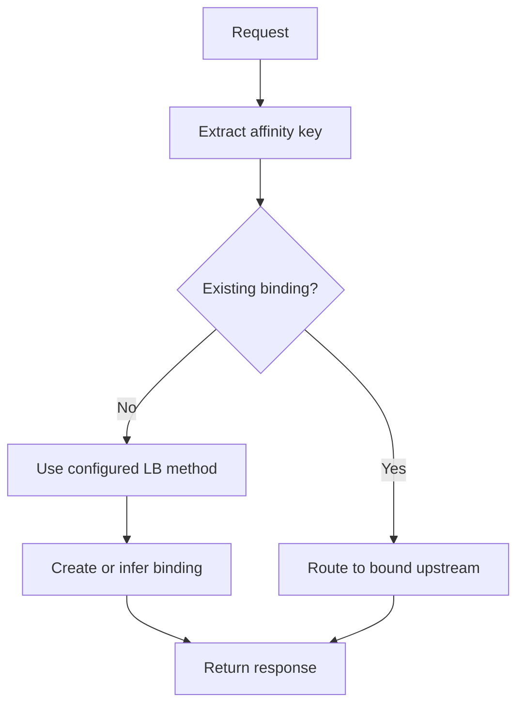
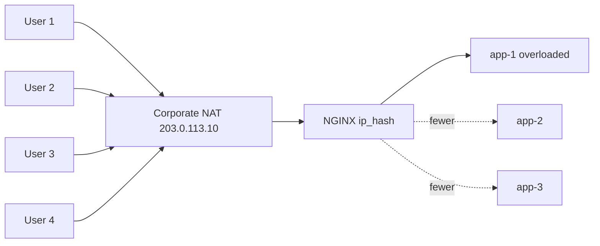
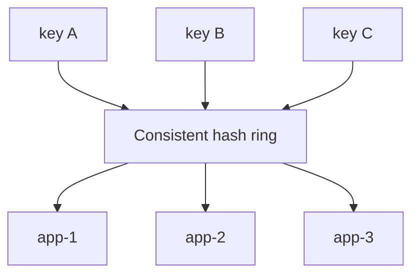
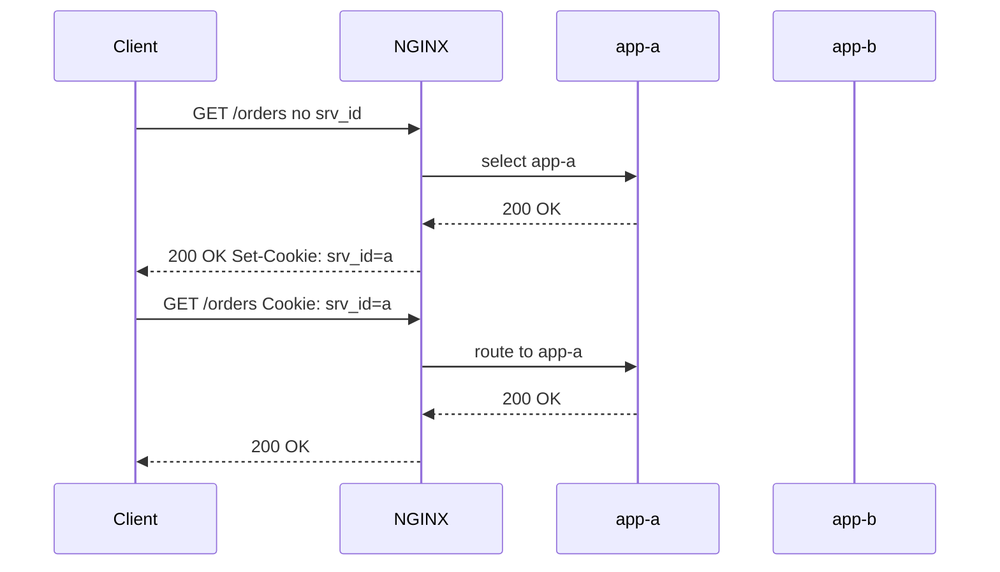
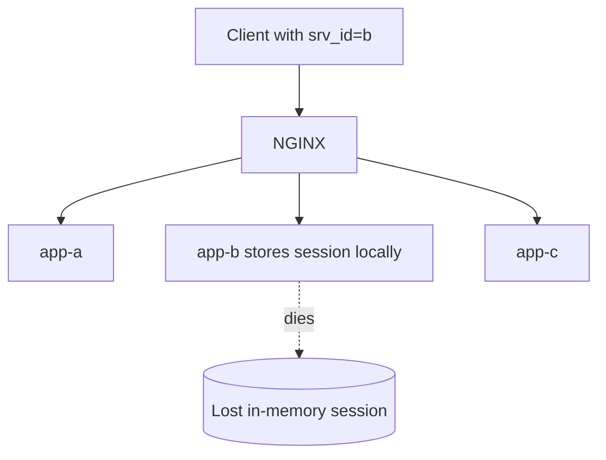
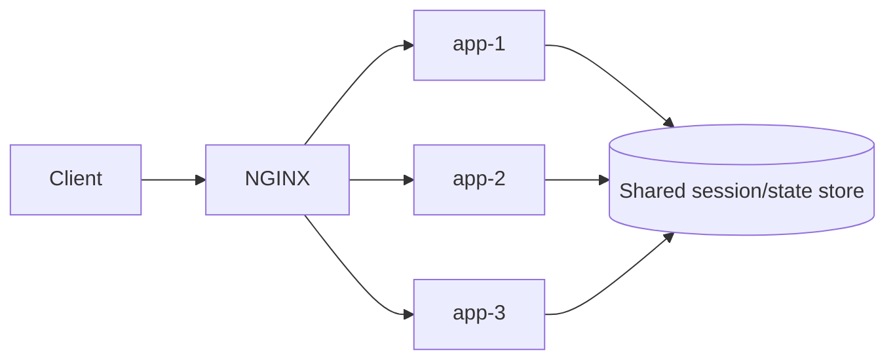

# Part 051 — Session Affinity, Sticky Sessions, and Stateful Backend Risk

Part 046 sampai Part 050 membangun model load balancing sebagai distribusi traffic, failure detection, dan upstream availability.

Sekarang kita masuk ke problem yang lebih licin:

```txt
Bagaimana jika request dari client yang sama harus terus masuk ke backend yang sama?
```

Itulah **session affinity** atau **sticky sessions**.

Secara permukaan, sticky session terlihat seperti fitur load balancer.

Secara arsitektur, sticky session adalah sinyal bahwa sistem punya **state locality**.

Kadang itu memang perlu.

Tetapi sering kali itu adalah bau desain:

```txt
Aplikasi terlihat horizontally scalable,
tetapi sebenarnya session/user/workflow terkunci ke satu node.
```

Di NGINX, pilihan affinity bergantung pada versi dan edisi:

- `ip_hash` dan `hash` adalah mekanisme affinity berbasis key.
- `sticky cookie`, `sticky route`, dan `sticky learn` adalah mekanisme session affinity yang lebih eksplisit di `ngx_http_upstream_module` modern.
- Dokumentasi resmi NGINX mencatat bahwa `sticky` muncul sebagai directive upstream dan sebelum versi 1.29.6 tersedia sebagai bagian dari commercial subscription.
- Banyak deployment enterprise/distro lama masih harus diperlakukan seperti dunia lama: Open Source hanya mengandalkan `ip_hash`/`hash`, sementara fitur sticky lengkap diasumsikan NGINX Plus sampai dibuktikan oleh versi binary yang benar.

Tujuan part ini bukan membuat semua sistem sticky.

Tujuannya:

```txt
Memahami kapan affinity diperlukan,
bagaimana NGINX mengikat request ke upstream,
dan bagaimana membatasi risiko stateful backend.
```

---

## 1. Mental Model: Affinity Is Routing Memory

Load balancing stateless:

```txt
request 1 from client A -> app-1
request 2 from client A -> app-2
request 3 from client A -> app-3
```

Session affinity:

```txt
request 1 from client A -> app-2
request 2 from client A -> app-2
request 3 from client A -> app-2
```

NGINX membutuhkan **key** untuk membuat routing memory.

Key bisa berasal dari:

- client IP,
- cookie,
- request header,
- URI,
- route suffix,
- token claim yang diekstrak di edge,
- application cookie,
- synthetic cookie yang dibuat NGINX.

Model internalnya:



Ada dua keluarga besar:

```txt
Deterministic affinity:
key -> hash -> upstream
```

Contoh:

- `ip_hash`
- `hash $cookie_session consistent`
- `hash $arg_user consistent`

Dan:

```txt
Stateful affinity:
session id -> stored binding -> upstream
```

Contoh:

- sticky cookie,
- sticky route,
- sticky learn.

Keduanya punya failure mode berbeda.

---

## 2. Why Sticky Sessions Exist

Sticky session biasanya muncul karena salah satu alasan berikut.

### 2.1 In-memory HTTP session

Aplikasi menyimpan session di memory lokal:

```txt
app-1 memory: session abc -> user 123
app-2 memory: no session abc
```

Jika request berikutnya masuk ke `app-2`, user terlihat logout atau state hilang.

Ini umum pada legacy Java servlet container, PHP session lokal, ASP.NET session in-proc, atau framework lama.

### 2.2 Long-running conversational workflow

Contoh:

- wizard multi-step,
- document editing session,
- live dashboard dengan ephemeral subscription,
- game lobby,
- approval workflow state sementara,
- regulator case triage dengan temporary lock di memory.

### 2.3 Warm per-node cache

Backend menyimpan cache lokal mahal:

```txt
user A sering membaca entity set X
node app-3 sudah punya cache X
```

Affinity bisa mengurangi cache miss.

Tetapi ini trade-off: cache locality dibayar dengan load imbalance.

### 2.4 WebSocket or long-lived connection ownership

WebSocket connection memang melekat ke satu backend selama koneksi hidup.

Affinity untuk reconnect bisa membantu jika server menyimpan subscription lokal.

Tetapi reconnect affinity tidak boleh menggantikan durable subscription model kalau correctness penting.

### 2.5 Stateful vendor product

Beberapa aplikasi enterprise lama mendesain session route sebagai bagian dari kontrak:

```txt
JSESSIONID=abc.nodeA
```

NGINX harus membaca route tersebut dan mengirim ke node yang sesuai.

---

## 3. The Dangerous Interpretation

Sticky session sering dijual sebagai:

```txt
Solusi agar aplikasi stateful bisa scalable.
```

Itu framing yang lemah.

Framing yang lebih benar:

```txt
Sticky session adalah compatibility layer untuk state locality.
Ia mengurangi gejala routing, bukan menghilangkan coupling state.
```

Jika backend mati:

```txt
client A -> app-2
app-2 dies
client A -> app-1
session lokal di app-2 hilang
```

Load balancer tidak bisa menghidupkan state yang tidak direplikasi.

Sticky session hanya menjawab pertanyaan:

```txt
Ke node mana request ini sebaiknya dikirim?
```

Ia tidak menjawab:

```txt
Apakah state masih ada?
Apakah state konsisten?
Apakah failover aman?
Apakah request boleh diproses di node lain?
```

---

## 4. Affinity Options in NGINX

Secara praktis, ada beberapa opsi.

| Mechanism | Key Source | State Stored in NGINX? | Strength | Typical Use |
|---|---:|---:|---|---|
| `ip_hash` | client IP | no | weak/simple | legacy affinity |
| `hash $key consistent` | chosen variable | no | moderate | cache/user shard affinity |
| sticky cookie | NGINX cookie | implicit binding | strong | generic session stickiness |
| sticky route | route marker | no/route-driven | strong | app server route suffix |
| sticky learn | app cookie/session | shared zone | strong but stateful | app-owned session id |

Key question:

```txt
Is affinity derived, declared, or learned?
```

Derived:

```txt
client IP -> upstream
```

Declared:

```txt
cookie route=a -> server route=a
```

Learned:

```txt
response Set-Cookie session=abc from app-2
NGINX stores abc -> app-2
```

---

## 5. `ip_hash`: Simple, Often Misleading

Basic config:

```nginx
upstream app_backend {
    ip_hash;

    server 10.0.10.11:8080;
    server 10.0.10.12:8080;
    server 10.0.10.13:8080;
}

server {
    listen 443 ssl;

    location / {
        proxy_pass http://app_backend;
    }
}
```

Mental model:

```txt
client IP -> hash -> selected backend
```

It is attractive because it requires no application change and no cookie.

But it has serious weaknesses.

### 5.1 NAT collapse

If thousands of clients come through one NAT or corporate proxy:

```txt
all users appear as 203.0.113.10
```

Then `ip_hash` can send a disproportionate amount of traffic to one backend.



### 5.2 Mobile IP churn

Mobile networks can change client IP.

```txt
request 1: 198.51.100.7 -> app-1
request 2: 198.51.100.44 -> app-3
```

Affinity breaks.

### 5.3 Proxy chain ambiguity

If NGINX sees the previous load balancer IP instead of real client IP, every user may hash to the same backend.

Bad:

```nginx
upstream app_backend {
    ip_hash;
    server 10.0.10.11:8080;
    server 10.0.10.12:8080;
}
```

If `$remote_addr` is always an internal L4 load balancer, the hash is useless.

You need real IP handling first:

```nginx
set_real_ip_from 10.0.0.0/8;
real_ip_header X-Forwarded-For;
real_ip_recursive on;
```

But this only works if the trust boundary is correct.

Part 032 already covered the danger:

```txt
Do not trust forwarded headers from arbitrary clients.
```

### 5.4 Membership changes remap users

When upstream membership changes, some clients move.

That can cause:

- logout,
- lost cart,
- cache coldness,
- inconsistent workflow state,
- unexpected backend load.

For cache-like use cases, consistent hashing is usually better than raw IP affinity.

---

## 6. `hash`: Better Key Control

`hash` lets you choose the key.

Example using a stable application cookie:

```nginx
upstream app_backend {
    hash $cookie_session_id consistent;

    server 10.0.10.11:8080;
    server 10.0.10.12:8080;
    server 10.0.10.13:8080;
}
```

This is better than `ip_hash` when the application has a stable session identifier.

You can also use a header:

```nginx
upstream app_backend {
    hash $http_x_account_id consistent;

    server 10.0.10.11:8080;
    server 10.0.10.12:8080;
    server 10.0.10.13:8080;
}
```

Or a mapped key:

```nginx
map $cookie_session_id $affinity_key {
    default $cookie_session_id;
    ""      $remote_addr;
}

upstream app_backend {
    hash $affinity_key consistent;

    server 10.0.10.11:8080;
    server 10.0.10.12:8080;
    server 10.0.10.13:8080;
}
```

This gives you a fallback.

But be careful:

```txt
A fallback key changes the routing identity.
```

If anonymous requests use IP and authenticated requests use session cookie, the selected backend may change after login.

That may be fine.

It may also be a bug.

---

## 7. Consistent Hashing: Reduce Remapping, Not Eliminate It

Without consistent hashing:

```txt
key -> hash % number_of_servers
```

Adding/removing a server changes `number_of_servers`, so many keys remap.

With consistent hashing:

```txt
key -> position on hash ring -> next server
```

Only a smaller portion of keys remap when membership changes.



Use it when:

- backend has local cache,
- session state is soft and recoverable,
- remapping cost matters,
- you can tolerate some movement.

Do not use it as a substitute for durable session storage when correctness matters.

---

## 8. Sticky Cookie

Sticky cookie means NGINX issues or inspects a cookie that identifies the selected upstream route.

Example:

```nginx
upstream app_backend {
    zone app_backend 64k;

    server 10.0.10.11:8080 route=a;
    server 10.0.10.12:8080 route=b;
    server 10.0.10.13:8080 route=c;

    sticky cookie srv_id expires=1h path=/ httponly secure samesite=lax;
}
```

Flow:



This is more explicit than `ip_hash`.

Advantages:

- independent from client IP,
- visible in browser/request traces,
- can use cookie attributes,
- can survive NAT and proxy changes,
- can be scoped by path/domain.

Risks:

- cookie becomes routing metadata,
- users can carry old route values,
- route value can leak topology if poorly named,
- cookie domain/path can accidentally cross applications,
- SameSite/Secure/HttpOnly must match application needs,
- multi-edge deployments need compatible routing state.

Do not name routes after internal hostnames.

Bad:

```nginx
server app-prod-az1-node-17.internal:8080 route=app-prod-az1-node-17.internal;
```

Better:

```nginx
server 10.0.10.11:8080 route=a;
server 10.0.10.12:8080 route=b;
```

Route identifiers should be opaque operational labels, not inventory disclosures.

---

## 9. Cookie Attribute Discipline

Sticky cookie is not only load balancing.

It is also browser state.

Treat it with the same discipline as other cookies.

Example baseline:

```nginx
sticky cookie srv_id expires=1h path=/ httponly secure samesite=lax;
```

Decision points:

| Attribute | Reason |
|---|---|
| `path=/` | apply to the intended app path only |
| `domain=` | avoid broad domain unless needed |
| `secure` | prevent plaintext transmission |
| `httponly` | prevent JavaScript access unless app truly needs it |
| `samesite=lax` | reasonable default for many same-site apps |
| `expires=` | avoid immortal routing decisions |

For cross-site embedded apps, `SameSite=None` may be required, but then `Secure` becomes non-negotiable in modern browsers.

The key architectural rule:

```txt
Sticky cookie lifetime must not outlive safe server identity assumptions.
```

If deployment recycles route labels aggressively, long cookie lifetime can bind users to wrong assumptions.

---

## 10. Sticky Route

Sticky route is useful when the application already encodes a route marker.

Common legacy pattern:

```txt
JSESSIONID=abc123.nodeA
```

NGINX can extract the route and match it against upstream server route values.

Example:

```nginx
map $cookie_jsessionid $route_cookie {
    default "";
    ~.+\.(?P<route>[A-Za-z0-9_-]+)$ $route;
}

upstream java_backend {
    zone java_backend 64k;

    server 10.0.10.11:8080 route=nodeA;
    server 10.0.10.12:8080 route=nodeB;

    sticky route $route_cookie;
}
```

Flow:

```txt
Cookie: JSESSIONID=abc.nodeB
map extracts route_cookie=nodeB
sticky route sends request to server route=nodeB
```

This is appropriate when:

- backend already owns session route semantics,
- you are migrating from Apache/mod_jk or vendor ADC,
- route suffix cannot be removed immediately,
- application failover semantics are known.

But it couples NGINX to app cookie format.

If the application changes cookie format, routing breaks.

Therefore:

```txt
Route extraction belongs in a named, tested map.
Do not bury regex inside a random location.
```

---

## 11. Sticky Learn

Sticky learn is a stronger form of stateful affinity.

NGINX learns a mapping between a session identifier and an upstream server from request/response variables.

Example pattern:

```nginx
upstream app_backend {
    zone app_backend 1m;

    server 10.0.10.11:8080;
    server 10.0.10.12:8080;

    sticky learn
        create=$upstream_cookie_SESSION
        lookup=$cookie_SESSION
        zone=client_sessions:1m
        timeout=30m;
}
```

Conceptually:

```txt
response from app-1 sets SESSION=abc
NGINX records abc -> app-1
future request with SESSION=abc -> app-1
```

This is powerful because the app can remain the source of session identifiers.

But now NGINX owns a runtime table.

That table has consequences:

- memory sizing,
- eviction behavior,
- reload behavior,
- multi-edge consistency,
- HA behavior,
- observability gap,
- failure recovery.

If you have multiple independent NGINX nodes, each node may learn independently unless runtime state synchronization is available and configured.

That means:

```txt
client request via edge A -> learned mapping exists
client request via edge B -> mapping may not exist
```

In active-active edge, sticky learn must be validated against your HA topology.

---

## 12. Route-Bound Draining

Modern upstream server parameters include `drain`.

Concept:

```txt
Do not send new unbound requests to this backend.
Only route requests already bound to it.
```

Example:

```nginx
upstream app_backend {
    zone app_backend 64k;

    server 10.0.10.11:8080 route=a drain;
    server 10.0.10.12:8080 route=b;
    server 10.0.10.13:8080 route=c;

    sticky cookie srv_id expires=30m path=/ httponly secure samesite=lax;
}
```

Use case:

```txt
app-a is being removed.
Existing sticky users can finish.
New users go elsewhere.
```

Important limitation:

```txt
Drain does not magically migrate in-memory state.
```

If a sticky user finishes slowly, the node remains needed.

If you terminate too early, that user loses state.

Draining must be paired with:

- max session lifetime,
- idle timeout,
- deployment window,
- active connection metrics,
- app-level session externalization plan.

---

## 13. Sticky Does Not Mean Safe Failover

Consider this topology:



When `app-b` dies, NGINX can select a new backend.

But the session state may be gone.

User experience:

- logout,
- retry failure,
- duplicate form submission,
- partial workflow loss,
- inconsistent lock ownership,
- support ticket.

Therefore the invariant is:

```txt
Sticky session can preserve locality while backend is alive.
It cannot provide durability after backend death.
```

If session correctness matters, use external state:

- Redis,
- database-backed session,
- replicated cache,
- token-based stateless session,
- event-sourced workflow state,
- durable lock table,
- workflow engine.

---

## 14. Affinity and Load Imbalance

Affinity reduces the load balancer's freedom.

Without affinity:

```txt
new request can go to any healthy backend
```

With affinity:

```txt
bound request must go to its bound backend if available
```

This can create skew.

Example:

```txt
100 users are bound to app-a
20 users are bound to app-b
30 users are bound to app-c
```

If those 100 users are also heavy users, app-a becomes hot.

NGINX may send new unbound users elsewhere, but existing bound load remains.

This matters for:

- B2B tenants with uneven traffic,
- regulatory case teams with batch-heavy usage,
- account-level hot tenants,
- long-lived WebSocket users,
- background pollers,
- browser tabs multiplying requests.

Affinity key choice should account for load shape.

Bad key:

```txt
tenant_id when one tenant is 70% of traffic
```

Better options:

```txt
tenant_id + user_id
session_id
workflow_id when workflows are evenly distributed
```

But only if correctness allows it.

---

## 15. Choosing the Affinity Key

A good affinity key is:

- stable enough for the session,
- available early in the request,
- not spoofable when security matters,
- high-cardinality enough to distribute load,
- scoped to the state that actually needs locality,
- not personally sensitive when logged,
- not tied to transient network infrastructure.

Decision table:

| Candidate | Stability | Cardinality | Risk | Use |
|---|---:|---:|---|---|
| client IP | medium/low | bad under NAT | spoof/trust issues | fallback only |
| session cookie | high | high | privacy/logging | common |
| user id | high | high | PII/logging | use hashed/mapped form |
| tenant id | high | low/uneven | hot tenant | only tenant-local state |
| JWT subject | high | high | token parsing at edge | external auth needed |
| workflow id | medium | high | missing on initial request | workflow-specific |

Never use a key only because it is convenient.

Use the key that matches the state locality boundary.

---

## 16. Affinity and Security

Affinity metadata can be abused.

Threat model:

```txt
Attacker sets sticky cookie manually
Attacker tries to force traffic to a specific backend
Attacker targets a weaker backend or overloads one node
```

Mitigations:

- use opaque route labels,
- avoid exposing hostnames,
- restrict cookie domain/path,
- rotate route labels carefully,
- validate that route value maps only to configured upstream route,
- combine with rate limiting,
- do not use affinity cookie as authentication,
- do not log raw sensitive session ids unnecessarily.

Important:

```txt
Sticky cookie proves routing history, not user identity.
```

It must never be used as an auth credential.

---

## 17. Affinity and Observability

You need to see whether affinity works.

Useful log fields:

```nginx
log_format upstream_json escape=json
'{'
  '"time":"$time_iso8601",'
  '"request_id":"$request_id",'
  '"remote_addr":"$remote_addr",'
  '"host":"$host",'
  '"uri":"$request_uri",'
  '"status":$status,'
  '"upstream_addr":"$upstream_addr",'
  '"upstream_status":"$upstream_status",'
  '"upstream_response_time":"$upstream_response_time",'
  '"affinity_cookie":"$cookie_srv_id",'
  '"route_cookie":"$route_cookie"'
'}';
```

Be careful with PII.

Prefer logging route id, not raw session id.

Useful questions:

```txt
Are bound users staying on the same upstream?
Are some upstreams overloaded because of sticky distribution?
Are many requests falling back because bound upstream is unavailable?
Are old route labels still appearing after deployment?
Are users carrying cookies for removed nodes?
```

---

## 18. Deployment Pattern: Sticky Cookie with Draining

A reasonable production pattern:

```nginx
upstream app_backend {
    zone app_backend 128k;

    server 10.0.10.11:8080 route=a max_fails=3 fail_timeout=10s;
    server 10.0.10.12:8080 route=b max_fails=3 fail_timeout=10s;
    server 10.0.10.13:8080 route=c max_fails=3 fail_timeout=10s;

    sticky cookie srv_id expires=30m path=/ httponly secure samesite=lax;
}

server {
    listen 443 ssl http2;
    server_name app.example.com;

    location / {
        proxy_http_version 1.1;
        proxy_set_header Host $host;
        proxy_set_header X-Request-ID $request_id;
        proxy_set_header X-Forwarded-For $proxy_add_x_forwarded_for;
        proxy_set_header X-Forwarded-Proto $scheme;

        proxy_connect_timeout 2s;
        proxy_send_timeout 30s;
        proxy_read_timeout 30s;

        proxy_pass http://app_backend;
    }
}
```

To drain app-a:

```nginx
upstream app_backend {
    zone app_backend 128k;

    server 10.0.10.11:8080 route=a drain max_fails=3 fail_timeout=10s;
    server 10.0.10.12:8080 route=b max_fails=3 fail_timeout=10s;
    server 10.0.10.13:8080 route=c max_fails=3 fail_timeout=10s;

    sticky cookie srv_id expires=30m path=/ httponly secure samesite=lax;
}
```

Then observe:

```txt
new unbound traffic should not go to route a
existing route a users should decline over time
active connections to app-a should trend down
application session count should trend down
error rate must not spike
```

---

## 19. Migration Away from Sticky Sessions

Sticky sessions are often a bridge.

Target architecture:



Migration steps:

### Step 1: Make state explicit

Inventory state:

| State | Current Location | Required Durability | Can Recompute? |
|---|---|---:|---:|
| auth session | app memory | high | no |
| CSRF token | app memory | medium | maybe |
| wizard draft | app memory | high | no |
| UI cache | app memory | low | yes |
| permission cache | app memory | medium | yes |

### Step 2: Separate durable and soft state

Durable state must leave local memory.

Soft state may remain local if fallback is safe.

### Step 3: Externalize durable session

Examples:

- Redis session store,
- database session table,
- stateless signed token,
- workflow table,
- distributed cache with replication.

### Step 4: Reduce affinity scope

Move from:

```txt
all routes sticky
```

To:

```txt
only legacy workflow routes sticky
```

Example:

```nginx
location /legacy-workflow/ {
    proxy_pass http://sticky_backend;
}

location /api/ {
    proxy_pass http://stateless_backend;
}
```

### Step 5: Remove sticky after evidence

Evidence:

- requests can be routed randomly without session loss,
- backend termination does not log users out,
- canary without affinity behaves correctly,
- support tickets do not increase,
- state store SLO is acceptable.

---

## 20. Kubernetes Note

Kubernetes changes affinity assumptions.

Pod IPs are ephemeral.

Pods are replaced often.

A route bound to a pod is fragile unless the controller updates upstreams and affinity state correctly.

Safer thinking:

```txt
Affinity to pod is operationally temporary.
Affinity to durable session state is architectural.
```

If using NGINX Ingress Controller or Gateway Fabric, treat annotations/policies as generated NGINX config and validate the actual generated behavior.

Do not assume the Kubernetes Service abstraction gives the same semantics as NGINX upstream affinity.

---

## 21. Failure Scenarios

### 21.1 Backend dies with local session

Symptom:

```txt
users bound to node b are logged out or lose workflow
```

NGINX view:

```txt
upstream b failed
request retried or routed elsewhere
```

App view:

```txt
session missing
```

Fix:

- externalize session,
- reduce sticky dependency,
- improve graceful shutdown,
- add drain before termination,
- add session replication if truly needed.

### 21.2 Sticky cookie points to removed route

Symptom:

```txt
some users repeatedly hit fallback path after deployment
```

Fix:

- reduce cookie TTL,
- keep route labels stable during deploy,
- avoid route label reuse until old cookies expire,
- observe unknown route values.

### 21.3 One tenant overloads one node

Symptom:

```txt
one upstream has high CPU, others idle
```

Cause:

```txt
affinity key has skewed distribution
```

Fix:

- change key granularity,
- split hot tenant workload,
- externalize cache/session,
- add route-specific capacity,
- use app-level sharding instead of LB stickiness.

### 21.4 Multi-edge inconsistent sticky learn

Symptom:

```txt
user behavior depends on which edge node received request
```

Fix:

- avoid sticky learn in active-active without state sharing,
- use deterministic key-based hash,
- use cookie route labels,
- externalize session,
- pin clients at higher-level load balancer only as temporary mitigation.

---

## 22. Operational Checklist

Before enabling sticky sessions, answer these:

```txt
What state requires locality?
Where is that state stored?
What happens when the selected backend dies?
What is the affinity key?
Is the key stable, high-cardinality, and safe?
Can users spoof the key?
How long does the binding live?
How do we drain a backend?
How do we remove a route label?
How do we observe bound vs unbound traffic?
How do we test failover?
What is the exit strategy away from stickiness?
```

If the team cannot answer these, sticky sessions will become an invisible reliability debt.

---

## 23. Lab: Observe Sticky Behavior

Create two toy backends that identify themselves.

Example backend response:

```json
{
  "node": "app-a",
  "session": "abc"
}
```

NGINX config:

```nginx
upstream sticky_lab {
    zone sticky_lab 64k;

    server 127.0.0.1:9001 route=a;
    server 127.0.0.1:9002 route=b;

    sticky cookie srv_id expires=10m path=/ httponly;
}

server {
    listen 8080;

    location / {
        proxy_set_header X-Request-ID $request_id;
        proxy_pass http://sticky_lab;
    }
}
```

Test:

```bash
curl -i http://localhost:8080/
```

Save cookie:

```bash
curl -c cookies.txt -i http://localhost:8080/
```

Reuse cookie:

```bash
curl -b cookies.txt -i http://localhost:8080/
```

Expected:

```txt
subsequent requests with srv_id go to same node
```

Drain route a:

```nginx
server 127.0.0.1:9001 route=a drain;
```

Reload:

```bash
nginx -t && nginx -s reload
```

Test:

```bash
# existing cookie for a may still route to a
curl -b cookies-a.txt -i http://localhost:8080/

# new client should avoid a
curl -i http://localhost:8080/
```

Observation:

```txt
drain is about new selection, not killing existing binding
```

---

## 24. Decision Matrix

| Situation | Recommended Approach |
|---|---|
| app is stateless | no sticky |
| local cache only | `hash $key consistent` if needed |
| legacy in-memory session | sticky cookie/route as bridge |
| JSESSIONID contains route | sticky route |
| app emits opaque session cookie | sticky learn only with HA plan |
| NAT-heavy clients | avoid `ip_hash` |
| multi-edge active-active | avoid local learned state unless synchronized |
| high-value workflow state | externalize state |
| backend removal required | use drain + session TTL + metrics |
| compliance/audit system | prefer durable state over sticky memory |

---

## 25. Core Invariants

Keep these invariants:

```txt
1. Affinity is routing memory, not state durability.
2. Sticky sessions reduce routing freedom and can create hotspots.
3. `ip_hash` is simple but weak under NAT, proxy chains, and mobile networks.
4. `hash consistent` is good for soft locality, not hard correctness.
5. Sticky cookie/route/learn must be version-checked against the actual NGINX binary.
6. Route labels must be opaque and stable for at least the cookie lifetime.
7. Drain prevents new unbound traffic; it does not migrate local memory.
8. If failover must preserve user workflow, state must be externalized or replicated.
```

---

## 26. What Comes Next

Part 052 continues directly from this.

Once backend affinity exists, deployment becomes harder:

```txt
How do we bring a recovered backend back without overwhelming it?
How do we remove a backend without breaking bound sessions?
How do we recover after passive failure?
```

That is the topic of **slow start, draining, and upstream recovery**.

---

## References

- NGINX upstream module documentation: `upstream`, `server`, `hash`, `ip_hash`, `sticky`, `route`, `drain`, `zone`, and embedded upstream variables.
- F5 NGINX documentation: HTTP load balancing and session persistence guidance.
- NGINX Gateway Fabric documentation: session persistence notes for OSS-style `ip_hash` and NGINX Plus cookie-based persistence.
