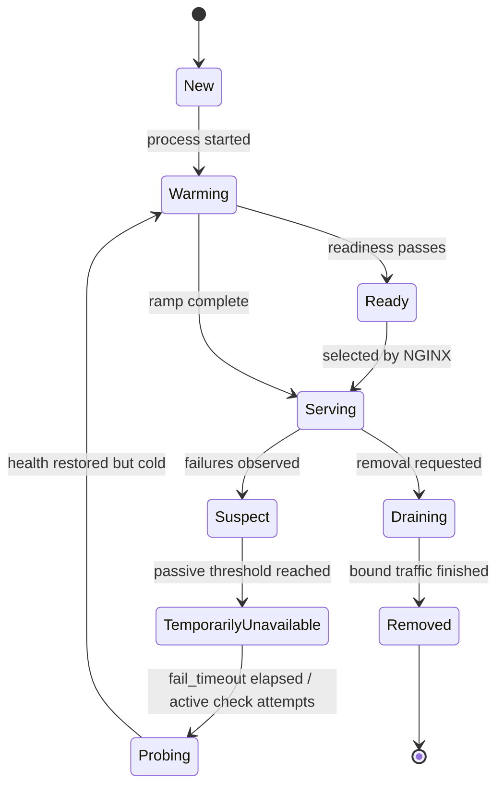
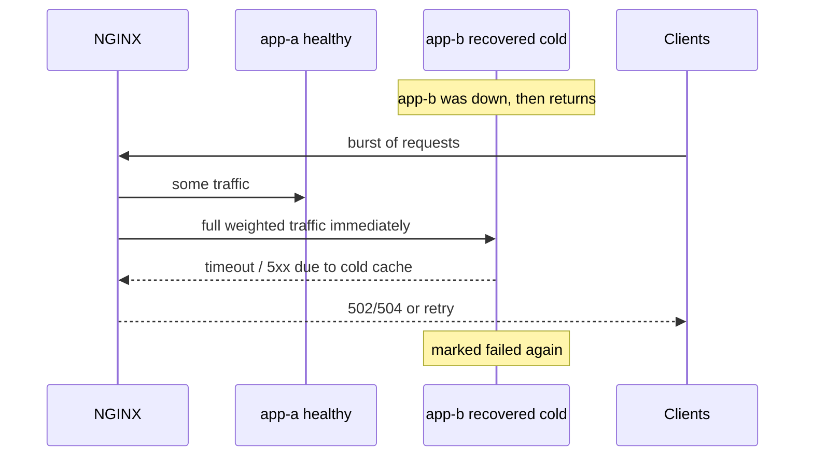
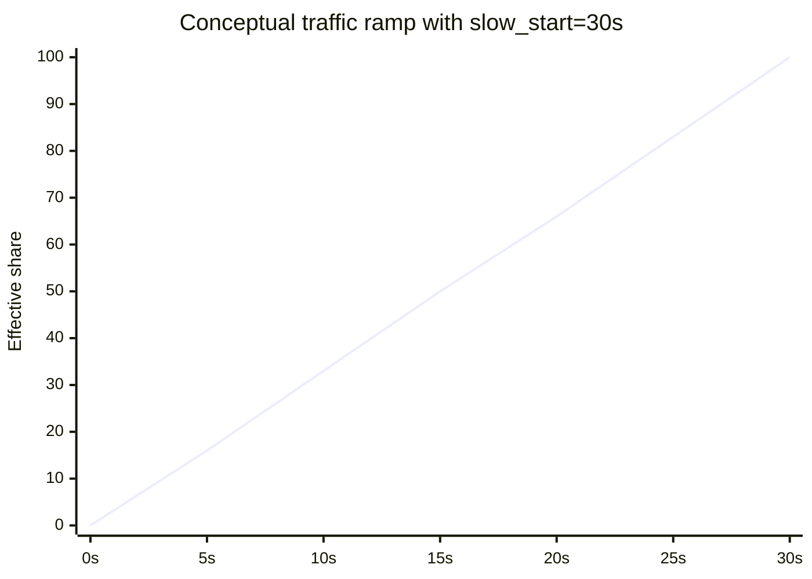
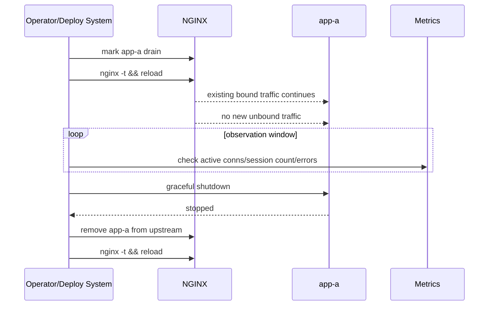
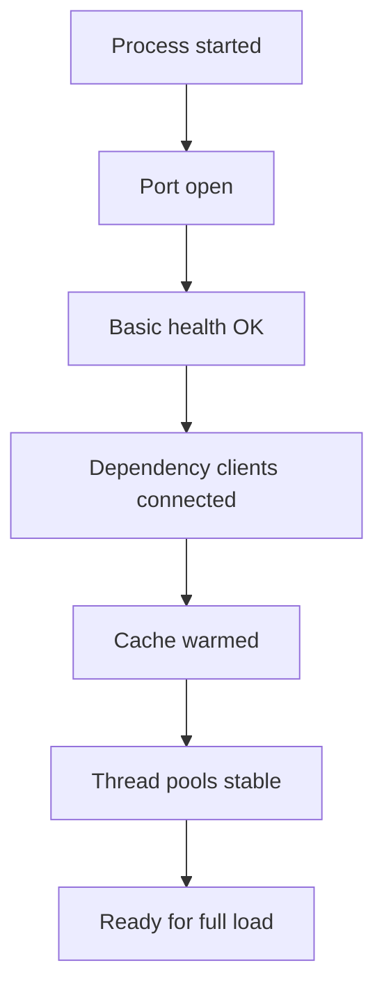

# Part 052 — Slow Start, Draining, and Upstream Recovery

Part 051 showed that affinity is routing memory.

Now we need to handle the lifecycle of upstream servers:

```txt
new backend enters pool
failed backend recovers
backend must be removed
backend is overloaded
backend is healthy but cold
backend is healthy but still warming up dependencies
```

This is where many NGINX deployments look fine in steady state but fail during change.

Production failures often happen not because the steady-state config is wrong, but because the **transition** is wrong.

```txt
Steady state: all nodes healthy.
Transition: one node added, removed, restarted, recovered, drained, or overloaded.
```

This part is about transition safety.

---

## 1. Mental Model: Backend Lifecycle Is a State Machine

A backend is not simply `up` or `down`.

A useful operational state machine is:



NGINX features map imperfectly to this machine.

| State Need | NGINX Open Source | NGINX Plus / Commercial Boundary |
|---|---|---|
| passive failure marking | `max_fails`, `fail_timeout` | yes |
| active readiness probe | external controller/app/LB | `health_check` |
| gradual ramp after recovery | external rollout/manual weights | `slow_start` |
| route-bound draining | modern `drain` parameter; version-sensitive | historically Plus/API first |
| dynamic membership without reload | limited/version-dependent DNS behavior | Plus API/state |
| queue while no upstream available | version/edition sensitive `queue` | documented commercial capability historically |

The key production lesson:

```txt
NGINX can participate in backend lifecycle control,
but it is not your whole deployment orchestrator.
```

---

## 2. Cold Start Is Not Readiness

A backend can pass readiness and still be unsafe for full traffic.

Examples:

- JVM has started but JIT is cold.
- database connection pool is not filled.
- cache is empty.
- local model/index is loading lazily.
- permission/rule cache is cold.
- TLS session cache is empty.
- thread pools are created but not exercised.
- dependency clients have not discovered endpoints.
- first request triggers migrations or lazy initialization.

Readiness answers:

```txt
Can this instance accept traffic at all?
```

Slow start answers:

```txt
How quickly should traffic ramp up after readiness?
```

They are different controls.

---

## 3. Failure Pattern: Recovered Backend Gets Crushed

Without slow start:



This creates a failure loop:

```txt
failed -> recovered -> overloaded -> failed -> recovered -> overloaded
```

The backend may never stabilize.

---

## 4. Passive Recovery in NGINX Open Source

Open Source passive health behavior is based on live traffic.

Example:

```nginx
upstream app_backend {
    server 10.0.10.11:8080 max_fails=3 fail_timeout=10s;
    server 10.0.10.12:8080 max_fails=3 fail_timeout=10s;
    server 10.0.10.13:8080 max_fails=3 fail_timeout=10s;
}
```

Meaning:

```txt
within fail_timeout window,
after max_fails unsuccessful attempts,
server is considered unavailable for fail_timeout duration
```

After that interval, NGINX can try it again with live traffic.

This is not a dedicated readiness probe.

It is:

```txt
live client request as probe
```

That matters.

If the backend is still broken, a real user may pay the cost.

If retries are enabled, NGINX may retry to another backend depending on `proxy_next_upstream` and whether request semantics allow it.

---

## 5. Slow Start: Commercial Boundary and Semantics

`slow_start` gradually recovers a server's effective weight from zero to its configured nominal value after it becomes healthy or available again.

Example:

```nginx
upstream app_backend {
    zone app_backend 64k;

    server 10.0.10.11:8080 slow_start=30s;
    server 10.0.10.12:8080;
}
```

Conceptually:

```txt
time 0s: server receives near-zero share
time 10s: server receives partial share
time 30s: server receives full configured share
```



Important boundaries:

- `slow_start` is documented as commercial/NGINX Plus capability.
- It cannot be used with `hash`, `ip_hash`, and `random` load balancing methods according to upstream module notes.
- If an upstream group has only one server, `max_fails`, `fail_timeout`, and `slow_start` are ignored for availability purposes.

Do not design an Open Source NGINX system assuming built-in slow-start exists.

---

## 6. Open Source Alternatives to Slow Start

If you do not have built-in `slow_start`, you can approximate ramping outside NGINX.

### 6.1 Weighted rollout by reload

Start with low weight:

```nginx
upstream app_backend {
    server 10.0.10.11:8080 weight=10;
    server 10.0.10.12:8080 weight=10;
    server 10.0.10.13:8080 weight=1; # new backend
}
```

Then increase:

```nginx
server 10.0.10.13:8080 weight=3;
```

Then:

```nginx
server 10.0.10.13:8080 weight=10;
```

This requires:

- config generation,
- `nginx -t`,
- safe reload,
- observability gate between steps,
- rollback.

It is not automatic.

But it is understandable and auditable.

### 6.2 Orchestrator-level readiness delay

In Kubernetes or systemd deployment:

```txt
start process
warm app
prime cache
verify dependencies
only then mark ready
```

This moves slow start outside NGINX.

It is often preferable when warmup is application-specific.

### 6.3 Canary first

Use `split_clients` or route-based canary:

```nginx
split_clients "$request_id" $canary_pool {
    1%      new_pool;
    *       stable_pool;
}

location / {
    proxy_pass http://$canary_pool;
}
```

But remember Part 041:

```txt
variable proxy_pass changes DNS/resolution and upstream semantics.
```

Use generated named locations if you need full upstream behavior.

### 6.4 External load balancer stage

Place new instances behind a separate upstream group and route a small percentage.

```nginx
upstream stable_backend {
    server 10.0.10.11:8080;
    server 10.0.10.12:8080;
}

upstream canary_backend {
    server 10.0.10.13:8080;
}
```

Then use `map` or `split_clients`.

This is explicit, but more config-heavy.

---

## 7. Draining: Stop New Traffic Before Stop Process

Draining means:

```txt
Stop assigning new traffic to an instance,
but allow existing or bound traffic to finish.
```

This is not the same as `down`.

`down` means:

```txt
Do not use this server.
```

`drain` means:

```txt
Only requests already bound to this server may continue to use it.
```

Example:

```nginx
upstream app_backend {
    zone app_backend 64k;

    server 10.0.10.11:8080 route=a drain;
    server 10.0.10.12:8080 route=b;
    server 10.0.10.13:8080 route=c;

    sticky cookie srv_id expires=30m path=/ httponly secure samesite=lax;
}
```

This is useful for sticky deployments.

For stateless deployments, `down` or removal may be enough, assuming in-flight requests are handled by process graceful shutdown.

---

## 8. Draining Timeline

A safe drain sequence:



Do not invert the order.

Bad sequence:

```txt
kill app first
then update NGINX
```

This creates unnecessary 502/504 and retry traffic.

---

## 9. Draining and Keepalive

Upstream keepalive can make draining feel confusing.

NGINX may have idle upstream connections cached.

But the core question is not whether a TCP connection exists.

The core question is:

```txt
Will NGINX select this backend for a new request?
```

Draining controls selection.

Application shutdown must still handle existing accepted requests.

Recommended app behavior:

```txt
on SIGTERM:
  stop accepting new app-level work if possible
  finish in-flight requests
  reject new long-running sessions
  close readiness
  exit after grace period
```

Recommended NGINX/deploy behavior:

```txt
remove from new selection before SIGTERM when possible
```

---

## 10. `down`: Hard Removal Without Deleting Config

`down` marks a server permanently unavailable while preserving config shape.

Example:

```nginx
upstream app_backend {
    server 10.0.10.11:8080 down;
    server 10.0.10.12:8080;
    server 10.0.10.13:8080;
}
```

Use it when:

- a backend must not receive traffic,
- you want fast rollback by removing `down`,
- DNS/name remains but target is unsafe,
- generated config should keep inventory visible.

Do not use `down` for graceful sticky drain if existing bound sessions need completion.

Use `drain` when route-bound continuation matters.

---

## 11. `backup`: Spare Capacity and Disaster Mode

`backup` servers receive traffic only when primary servers are unavailable.

Example:

```nginx
upstream app_backend {
    server 10.0.10.11:8080;
    server 10.0.10.12:8080;

    server 10.0.20.11:8080 backup;
}
```

Use cases:

- warm standby pool,
- emergency fallback region,
- lower-capacity failover group,
- maintenance window capacity.

Risk:

```txt
backup server may be cold exactly when needed most.
```

If backup pool has no traffic, it may hide:

- stale config,
- expired certificate to dependency,
- missing secrets,
- cold cache,
- schema mismatch,
- insufficient capacity.

Therefore backup pools need synthetic traffic or active health verification.

---

## 12. Queueing Is Not Recovery

Some NGINX configurations support queueing requests when an upstream server cannot be selected immediately.

Queueing can help short bursts.

But queueing can also hide overload and increase tail latency.

Mental model:

```txt
queue absorbs mismatch between arrival rate and service capacity
```

If overload persists:

```txt
queue grows -> latency grows -> timeout grows -> retries grow -> system collapses
```

Use queueing only with:

- tight timeout,
- clear maximum length,
- client retry policy awareness,
- load shedding plan,
- alerting on queue saturation.

Do not treat queueing as capacity.

---

## 13. Recovery Requires Dependency Warmup

A backend may become available in layers:



NGINX sees only what you expose.

If `/health` returns 200 at `B`, you are lying to the load balancer.

Better health endpoint split:

| Endpoint | Meaning | Used by |
|---|---|---|
| `/health/live` | process should not be killed | orchestrator liveness |
| `/health/ready` | can receive normal traffic | NGINX Plus active check / orchestrator readiness |
| `/health/startup` | bootstrapping still okay | Kubernetes startup probe |
| `/internal/warmup-status` | operational details | dashboards only |

NGINX can only enforce the contract you design.

---

## 14. Recovering After Passive Failure

Passive failure flow:

```txt
request to app-b fails
failure counted
max_fails reached within fail_timeout
app-b marked unavailable
fail_timeout passes
app-b can be tried again
```

This is reactive.

When app-b is tried again, the request may be user traffic.

If you need safer recovery, combine with:

- external health checker,
- orchestrator readiness,
- manual `down`/remove until verified,
- NGINX Plus active checks,
- canary routing,
- weighted warmup.

Operational pattern for Open Source:

```txt
1. backend fails
2. alert fires
3. remove or mark down if persistent
4. fix backend
5. run synthetic verification
6. add back with low weight
7. observe
8. restore full weight
```

This is boring.

Boring is good.

---

## 15. Recovery Playbook: Open Source Weighted Ramp

Assume node `10.0.10.13` recovered.

Initial state:

```nginx
upstream app_backend {
    server 10.0.10.11:8080 weight=10;
    server 10.0.10.12:8080 weight=10;
    server 10.0.10.13:8080 down;
}
```

Step 1: verify directly.

```bash
curl -fsS http://10.0.10.13:8080/health/ready
curl -fsS http://10.0.10.13:8080/internal/smoke
```

Step 2: add with low weight.

```nginx
server 10.0.10.13:8080 weight=1 max_fails=3 fail_timeout=10s;
```

Step 3: reload safely.

```bash
nginx -t && nginx -s reload
```

Step 4: observe.

```txt
5xx rate
p95/p99 latency
upstream_response_time for 10.0.10.13
upstream_status distribution
CPU/memory/GC/thread pools
DB pool saturation
cache miss rate
```

Step 5: increase weight.

```txt
1 -> 3 -> 5 -> 10
```

Step 6: rollback if needed.

```nginx
server 10.0.10.13:8080 down;
```

This is not as elegant as `slow_start`, but it is explicit and reviewable.

---

## 16. Recovery Playbook: NGINX Plus Slow Start

With NGINX Plus active checks and slow start:

```nginx
upstream app_backend {
    zone app_backend 64k;

    server 10.0.10.11:8080 max_fails=3 fail_timeout=10s slow_start=30s;
    server 10.0.10.12:8080 max_fails=3 fail_timeout=10s slow_start=30s;
    server 10.0.10.13:8080 max_fails=3 fail_timeout=10s slow_start=30s;
}

server {
    listen 443 ssl;

    location / {
        proxy_pass http://app_backend;
        health_check uri=/health/ready;
    }
}
```

Lifecycle:

```txt
health check fails -> backend excluded
health check passes -> backend becomes healthy
slow_start ramps traffic gradually
```

Still required:

- health endpoint correctness,
- alerting,
- active check tuning,
- understanding of non-idempotent retries,
- observability during recovery.

`slow_start` reduces risk.

It does not remove the need for deployment discipline.

---

## 17. Graceful Shutdown for Applications

NGINX cannot make a backend graceful if the backend terminates abruptly.

Application must cooperate.

A robust app shutdown sequence:

```txt
SIGTERM received
readiness returns false
stop accepting new background work
finish in-flight HTTP requests
close long-lived connections with retryable signal if possible
flush telemetry
close DB/client pools
de-register after grace period
exit
```

For Java services:

- ensure server shutdown grace period is configured,
- ensure executor pools stop accepting new tasks,
- ensure connection pools close after in-flight work,
- ensure readiness flips before process exit,
- ensure Kubernetes terminationGracePeriodSeconds is long enough.

For Node.js:

- stop accepting connections,
- track in-flight requests,
- close server after grace,
- handle keepalive sockets,
- avoid `process.exit()` before cleanup.

For Go:

- use `http.Server.Shutdown(ctx)`,
- set deadline,
- close background workers,
- propagate context cancellation.

NGINX-side drain is only half the story.

---

## 18. Long-Lived Requests and Draining

Long-lived requests complicate draining:

- WebSocket,
- SSE,
- long polling,
- file upload,
- report generation,
- streaming export,
- gRPC streaming.

If a connection can live for hours, draining can also take hours.

Design options:

| Option | Trade-off |
|---|---|
| wait indefinitely | safe but blocks deploy |
| hard cutoff | fast but user disruption |
| send reconnect signal | requires protocol support |
| limit max connection lifetime | predictable but may interrupt |
| separate long-lived upstream pool | isolates operational risk |

Example route split:

```nginx
location /events/ {
    proxy_read_timeout 1h;
    proxy_buffering off;
    proxy_pass http://stream_backend;
}

location /api/ {
    proxy_read_timeout 30s;
    proxy_pass http://api_backend;
}
```

Do not drain all workloads with the same assumptions.

---

## 19. Retry Interaction During Recovery

Retries can amplify recovery problems.

Scenario:

```txt
app-b is cold
NGINX sends request
app-b times out
NGINX retries app-a
client receives success
but app-b still did partial work
```

For idempotent reads, maybe acceptable.

For writes, dangerous.

Recovery and retry policy must be route-specific.

Example:

```nginx
location /api/read/ {
    proxy_next_upstream error timeout http_502 http_503 http_504;
    proxy_next_upstream_tries 2;
    proxy_pass http://app_backend;
}

location /api/write/ {
    proxy_next_upstream off;
    proxy_pass http://app_backend;
}
```

During recovery, cold backends should not receive write traffic until they are truly ready.

---

## 20. Observability for Recovery

Minimum useful log fields:

```nginx
log_format upstream_json escape=json
'{'
  '"time":"$time_iso8601",'
  '"request_id":"$request_id",'
  '"status":$status,'
  '"upstream_addr":"$upstream_addr",'
  '"upstream_status":"$upstream_status",'
  '"upstream_connect_time":"$upstream_connect_time",'
  '"upstream_header_time":"$upstream_header_time",'
  '"upstream_response_time":"$upstream_response_time",'
  '"request_time":"$request_time"'
'}';
```

Recovery dashboard should show:

- traffic per upstream,
- 5xx per upstream,
- p95/p99 per upstream,
- retry count inferred from comma-separated `$upstream_addr`,
- connection errors,
- timeout errors,
- active connections,
- app CPU/memory/GC,
- DB pool usage,
- cache warmup metrics.

Important:

```txt
A backend can look healthy globally while one route is failing.
```

Observe by route, not only by server.

---

## 21. Deployment Pattern: Safe Remove of One Node

Goal:

```txt
remove app-a without user-visible errors
```

### Stateless service

1. Mark app-a not ready in orchestrator.
2. Wait for NGINX/upstream generation to exclude it or reload config.
3. Observe no new requests to app-a.
4. Terminate app-a gracefully.
5. Remove from config/inventory.

### Sticky service

1. Mark app-a `drain`.
2. Reload NGINX.
3. Observe new unbound traffic avoids app-a.
4. Wait for bound session count or active connection count to fall.
5. Optionally reduce sticky cookie TTL before maintenance.
6. Stop app-a gracefully.
7. Remove route after old cookies expire or after fallback policy is tested.

### Long-lived connection service

1. Announce or signal reconnect if protocol supports it.
2. Stop new connection assignment.
3. Wait until active connections fall or max lifetime reached.
4. Close remaining connections with explicit retry instruction if possible.
5. Terminate.

---

## 22. Deployment Pattern: Safe Add of One Node

Goal:

```txt
add app-d without cold-start incident
```

Sequence:

```txt
start app-d
warm app-d
verify dependencies
synthetic smoke through direct address
add app-d with low weight or active health check
observe route-specific metrics
ramp up
```

Do not do this:

```txt
start app-d
immediately add equal weight
hope health endpoint means full capacity
```

Hope is not a rollout strategy.

---

## 23. Handling Hot Backend During Recovery

If one backend is hot:

```txt
CPU 95%, latency high, errors rising
```

Options:

### Option A: reduce weight

```nginx
server 10.0.10.11:8080 weight=3;
server 10.0.10.12:8080 weight=10;
server 10.0.10.13:8080 weight=10;
```

Useful when backend remains functional.

### Option B: drain

```nginx
server 10.0.10.11:8080 route=a drain;
```

Useful when sticky sessions exist and you want old sessions to finish.

### Option C: mark down

```nginx
server 10.0.10.11:8080 down;
```

Useful when backend is unsafe.

### Option D: shed traffic at edge

```nginx
limit_req zone=api burst=20 nodelay;
```

Useful when all backends are overloaded.

### Option E: disable expensive route

Return a controlled 503 for non-critical expensive endpoint.

```nginx
location /reports/export-heavy {
    return 503;
}
```

This is blunt, but better than total collapse.

---

## 24. Failure Injection Drill

Do not wait for production incident to learn these behaviors.

Lab topology:

```txt
NGINX -> app-a, app-b, app-c
```

Drill 1: kill app-b.

Expected:

- app-b failures counted,
- traffic shifts away,
- error budget impact known,
- retries visible,
- no duplicate writes on write route.

Drill 2: revive app-b cold.

Expected:

- Open Source: manual ramp or readiness delay protects it.
- Plus: active check and slow_start ramp it.

Drill 3: drain app-a.

Expected:

- no new unbound sessions,
- existing bound sessions continue,
- session count declines.

Drill 4: add overloaded app-d.

Expected:

- canary catches high latency,
- weight rollback works,
- alerts fire before full rollout.

---

## 25. Version and Edition Verification

Do not rely on memory.

Check actual binary:

```bash
nginx -V 2>&1
```

Check config support:

```bash
nginx -t
```

Create a tiny test upstream if you are unsure whether a directive is supported by the deployed package:

```nginx
upstream directive_probe {
    zone directive_probe 64k;
    server 127.0.0.1:9001 route=a drain;
    sticky cookie srv_id path=/;
}
```

Then:

```bash
nginx -t -c /path/to/probe.conf
```

This matters because:

- distro packages lag upstream,
- container images may differ,
- OSS/mainline/stable/Plus capabilities differ,
- directives have version history,
- generated Ingress config may not match raw NGINX expectations.

Production rule:

```txt
Architecture decisions must be validated against the deployed NGINX binary, not just documentation in your head.
```

---

## 26. Common Mistakes

### Mistake 1: using readiness as warmup

```txt
/health/ready returns 200 before app can handle real load
```

Fix:

- make readiness stricter,
- add warmup gate,
- use slow start or weighted ramp.

### Mistake 2: killing backend before draining

```txt
app terminated while NGINX still routes to it
```

Fix:

- drain or remove first,
- reload safely,
- wait,
- then terminate.

### Mistake 3: equal weight for cold backend

Fix:

- start low,
- observe,
- increase.

### Mistake 4: retrying writes during recovery

Fix:

- route-specific `proxy_next_upstream`,
- idempotency keys,
- upstream write safeguards.

### Mistake 5: assuming sticky drain migrates state

Fix:

- externalize session,
- enforce max session lifetime,
- build explicit migration behavior.

### Mistake 6: one-server upstream illusions

With a single upstream server, availability parameters cannot create redundancy.

```txt
one backend + max_fails is not HA
```

---

## 27. Production Runbook Template

### Add backend

```txt
Input:
- backend address
- route label if sticky
- target weight
- warmup evidence
- rollback plan

Steps:
1. Verify backend directly.
2. Add backend with low weight or rely on active health + slow_start.
3. nginx -t.
4. Reload.
5. Observe 5xx, latency, traffic share, app metrics.
6. Ramp.
7. Record result.
```

### Remove backend

```txt
Input:
- backend address
- sticky route label
- session TTL
- active connection count
- termination grace

Steps:
1. Mark drain/down/remove depending on state model.
2. nginx -t.
3. Reload.
4. Observe traffic decline.
5. Terminate app gracefully.
6. Remove from config.
7. Confirm no stale route traffic.
```

### Recover backend

```txt
Input:
- failure cause
- fix evidence
- smoke test result
- target ramp strategy

Steps:
1. Keep backend out of full traffic.
2. Verify readiness and dependencies.
3. Add low weight or health-check controlled recovery.
4. Observe.
5. Ramp.
6. Close incident with metrics.
```

---

## 28. Architecture Decision Record Template

```mdx
# ADR: Upstream Recovery Strategy for <service>

## Context
<service> runs behind NGINX and has <stateless/sticky/stateful> behavior.

## Decision
We will use <manual weighted ramp / NGINX Plus slow_start / orchestrator readiness delay>.

## NGINX Capability Boundary
- Deployed version: <nginx -V output summary>
- Edition: <OSS / Plus>
- Uses active health checks: <yes/no>
- Uses slow_start: <yes/no>
- Uses drain: <yes/no>

## Invariants
- No full traffic to cold backend.
- Writes are not retried unless idempotent.
- Backend is removed from new selection before shutdown.
- Rollback is tested with nginx -t.

## Observability
- upstream_addr
- upstream_status
- upstream_response_time
- route label
- backend CPU/memory/pool metrics

## Failure Handling
- If recovered backend errors > threshold, mark down.
- If latency exceeds threshold, reduce weight.
- If sticky sessions remain after TTL, force fallback policy.
```

---

## 29. Core Invariants

```txt
1. Backend lifecycle is a state machine, not a boolean.
2. Readiness is not full warmup.
3. Passive recovery uses live traffic as probe.
4. Slow start reduces cold-start overload but is edition/version-bound.
5. Draining stops new selection; it does not migrate application state.
6. `down`, `drain`, `backup`, and low weight solve different problems.
7. Retries during recovery must respect idempotency.
8. Long-lived connections need their own drain policy.
9. Recovery must be observable per upstream and per route.
10. Always validate capability against the deployed binary.
```

---

## 30. What Comes Next

Part 053 moves from backend lifecycle into release strategy:

```txt
canary
blue-green
header-based routing
progressive delivery
```

The key shift:

```txt
Part 052: how to safely move backend capacity.
Part 053: how to safely move user traffic between versions.
```

---

## References

- NGINX upstream module documentation: `server`, `down`, `backup`, `drain`, `slow_start`, `zone`, `max_fails`, `fail_timeout`, `hash`, and upstream embedded variables.
- F5 NGINX documentation: HTTP load balancing, server slow-start, active health checks, session persistence, and NGINX Plus boundary.
- NGINX command-line documentation: `nginx -t`, reload, and operational validation flow.
