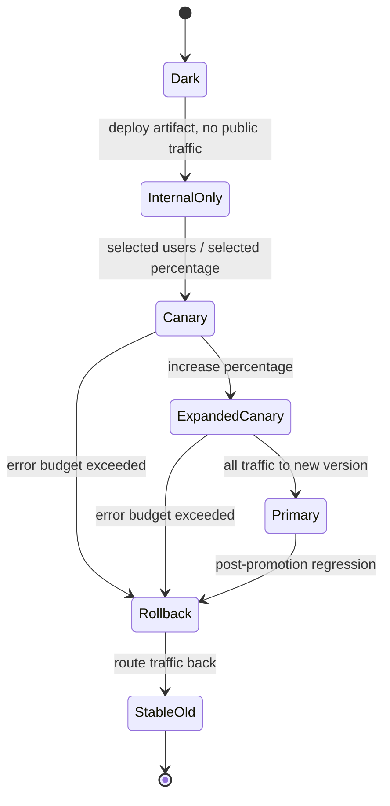
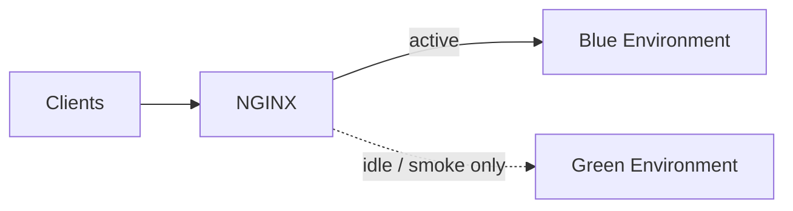
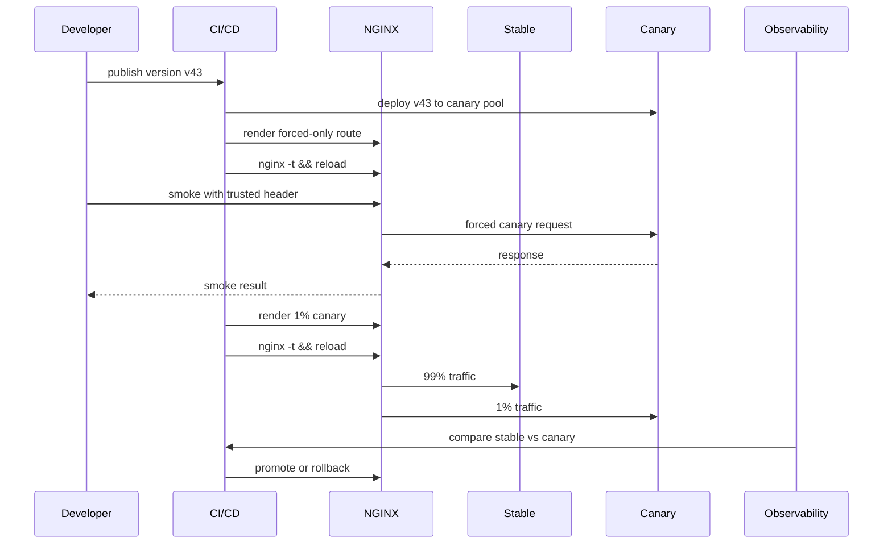

# Part 053 — Canary, Blue-Green, Header-Based Routing, and Progressive Delivery

Part 046 sampai Part 052 membangun fondasi load balancing:

```txt
upstream group
algorithm
weight
health check
session affinity
backend lifecycle
recovery/draining
```

Sekarang kita naik satu level: **traffic rollout**.

Pertanyaannya bukan lagi:

```txt
Bagaimana mendistribusikan traffic ke beberapa backend?
```

Pertanyaannya menjadi:

```txt
Bagaimana mengubah versi sistem production tanpa membuat semua user menjadi test subject sekaligus?
```

Itulah progressive delivery.

NGINX bukan deployment platform lengkap seperti Argo Rollouts, Flagger, Spinnaker, atau service mesh. Tetapi NGINX sangat kuat sebagai **edge traffic switch** jika kita memahami batasnya.

Progressive delivery dengan NGINX adalah tentang mengontrol **siapa mendapat versi apa**, **berapa persen traffic dialihkan**, **bagaimana override dilakukan**, **metrik apa yang dibaca**, dan **bagaimana rollback dilakukan dalam satu perubahan kecil**.

---

## 1. Mental Model: Release Is a Routing Problem

Dalam deployment naive, release dianggap sebagai mengganti binary:

```txt
old app stopped
new app started
traffic goes to new app
```

Dalam production engineering, release lebih aman dipandang sebagai routing state machine:



NGINX berada di bagian routing:

```txt
request attributes -> decision -> upstream version
```

Attributes bisa berupa:

```txt
Host
path
header
cookie
query argument
client IP
user-agent
geo/IP range
random bucket
manual override
```

Decision bisa berupa:

```txt
stable
canary
blue
green
shadow candidate
maintenance backend
fallback backend
```

Upstream version adalah backend yang benar-benar menerima request.

---

## 2. Progressive Delivery Vocabulary

Jangan mencampur istilah. Masing-masing punya risiko berbeda.

| Pattern | Makna | Kegunaan | Risiko Utama |
|---|---|---|---|
| blue-green | dua environment utuh; satu active, satu idle/standby | fast cutover/rollback | database/schema compatibility |
| canary | sebagian kecil traffic ke versi baru | deteksi regression sebelum full rollout | sample bias, sticky users, hidden endpoints |
| percentage rollout | traffic dibagi berdasarkan persentase | rollout bertahap | bucket instability bila key salah |
| header-based routing | user/tester memilih versi lewat header | internal validation, QA, support | header spoofing bila terbuka publik |
| cookie-based routing | user dipin ke variant | UX consistency | sticky bug, long-lived bad assignment |
| path-based routing | path tertentu ke backend tertentu | service decomposition | accidental API contract split |
| dark launch | deploy tanpa public traffic | warmup, readiness, smoke test | false confidence karena tidak ada real traffic |
| shadow/mirror traffic | copy traffic ke candidate tanpa memengaruhi response | compare behavior | NGINX OSS tidak punya generic HTTP mirror semantics sefleksibel dedicated tools; side effect risk |

Progressive delivery yang sehat selalu punya dua channel:

```txt
control plane: mengubah config / route policy
observability plane: membuktikan perubahan aman atau tidak
```

Jika hanya ada control plane tanpa observability, itu bukan progressive delivery. Itu gambling bertahap.

---

## 3. NGINX Primitives untuk Progressive Delivery

Primitives utama:

```txt
upstream
map
split_clients
proxy_pass with variable
return
error_page
access_log custom fields
headers/cookies/query args
```

NGINX `split_clients` membuat variable untuk A/B testing berdasarkan hash dari string input dan persentase yang didefinisikan. `map` membuat variable baru berdasarkan variable lain, dengan matching string/regex dan lazy evaluation ketika variable dipakai.

Minimal building blocks:

```nginx
upstream app_stable {
    server 10.0.10.11:8080 max_fails=2 fail_timeout=10s;
    server 10.0.10.12:8080 max_fails=2 fail_timeout=10s;
    keepalive 64;
}

upstream app_canary {
    server 10.0.20.11:8080 max_fails=2 fail_timeout=10s;
    keepalive 32;
}

map $request_id $rollout_bucket {
    default stable;
}

server {
    listen 443 ssl http2;
    server_name api.example.com;

    location / {
        proxy_pass http://app_stable;
    }
}
```

Itu belum canary. Itu hanya baseline.

---

## 4. Canary dengan `split_clients`

Canary percentage paling umum dilakukan dengan `split_clients`.

Contoh 1% canary:

```nginx
split_clients "${remote_addr}${http_user_agent}" $canary_bucket {
    1%      canary;
    *       stable;
}

map $canary_bucket $target_upstream {
    canary  app_canary;
    default app_stable;
}

server {
    listen 443 ssl http2;
    server_name api.example.com;

    location / {
        proxy_set_header Host $host;
        proxy_set_header X-Release-Bucket $canary_bucket;
        proxy_set_header X-Target-Upstream $target_upstream;

        proxy_pass http://$target_upstream;
    }
}
```

Namun konfigurasi ini punya masalah besar.

Key bucket memakai:

```txt
remote_addr + user_agent
```

Itu bisa berubah karena:

```txt
mobile network changes
NAT/proxy
IPv6 privacy address
browser/user-agent changes
real_ip belum dikonfigurasi benar
```

Akibatnya user bisa berpindah-pindah antara stable dan canary.

Untuk API yang stateless mungkin masih dapat diterima. Untuk UX stateful, ini buruk.

---

## 5. Stable Bucket Key: Pilih Identitas yang Benar

Bucket key menentukan stabilitas assignment.

| Key | Stabilitas | Risiko |
|---|---:|---|
| `$remote_addr` | rendah-menengah | NAT, mobile IP, proxy, real_ip salah |
| `$binary_remote_addr` | rendah-menengah | sama seperti IP, tapi efisien |
| `$http_user_agent` | rendah | spoofable, berubah |
| `$cookie_user_id` | tinggi jika cookie valid | privacy, missing cookie, spoofing bila tidak signed |
| `$arg_user_id` | rendah | user controlled, cache poisoning risk |
| `$http_x_user_id` | tinggi hanya jika dari trusted auth layer | spoofing jika diterima dari publik |
| `$request_id` | tidak stabil per request | cocok untuk pure random request-level split, bukan user-level canary |

Untuk canary user-level, key yang lebih baik biasanya:

```txt
signed user id cookie
trusted authenticated user id header dari internal auth gateway
account id
tenant id
```

Contoh dengan cookie:

```nginx
split_clients "$cookie_uid" $canary_bucket {
    1%      canary;
    *       stable;
}
```

Tetapi ini hanya aman jika cookie `uid` memang:

```txt
ada
stabil
bukan input sembarang
signed/encrypted atau minimal divalidasi oleh upstream auth layer
tidak berisi PII mentah yang bocor ke log
```

Jika user belum login atau cookie belum ada, buat fallback eksplisit:

```nginx
map $cookie_uid $rollout_key {
    ""       $binary_remote_addr;
    default  $cookie_uid;
}

split_clients "$rollout_key" $canary_bucket {
    1%      canary;
    *       stable;
}
```

Invariant:

```txt
The rollout key must be stable enough for the user journey being protected.
```

---

## 6. Header-Based Override untuk Internal Testing

Canary percentage bagus untuk public rollout, tetapi engineer/support/QA perlu forced routing.

Contoh:

```nginx
map $http_x_release_track $forced_track {
    default "";
    stable  stable;
    canary  canary;
}

split_clients "$rollout_key" $percentage_track {
    1%      canary;
    *       stable;
}

map $forced_track $effective_track {
    stable  stable;
    canary  canary;
    default $percentage_track;
}

map $effective_track $target_upstream {
    canary  app_canary;
    default app_stable;
}
```

Masalahnya: header public mudah dipalsukan.

Jangan biarkan semua client internet mengirim:

```txt
X-Release-Track: canary
```

kecuali memang tidak berbahaya.

Pattern lebih aman:

```nginx
geo $internal_tester_ip {
    default 0;
    10.0.0.0/8 1;
    192.168.0.0/16 1;
}

map "$internal_tester_ip:$http_x_release_track" $forced_track {
    default "";
    "1:stable" stable;
    "1:canary" canary;
}
```

Dengan begitu, forced track hanya diterima dari IP/network internal yang dipercaya.

Tetapi ini pun bergantung pada Part 032: real client IP harus benar. Jika `$remote_addr` masih IP load balancer/CDN dan `real_ip` salah, allowlist menjadi meaningless.

---

## 7. Cookie-Based Stickiness untuk Rollout Experience

Kadang user harus tetap pada variant yang sama setelah assignment pertama.

NGINX Open Source tidak ideal untuk membuat signed cookie assignment sendiri tanpa scripting module tambahan. Tetapi ia bisa membaca cookie yang dibuat oleh aplikasi atau auth layer.

Pattern yang sehat:

```txt
application/auth layer sets signed cookie: release_track=stable|canary
NGINX reads cookie
NGINX routes based on cookie
NGINX logs effective track
```

Config:

```nginx
map $cookie_release_track $cookie_track {
    canary  canary;
    stable  stable;
    default "";
}

split_clients "$rollout_key" $percentage_track {
    5%      canary;
    *       stable;
}

map $cookie_track $effective_track {
    canary  canary;
    stable  stable;
    default $percentage_track;
}

map $effective_track $target_upstream {
    canary  app_canary;
    default app_stable;
}
```

Danger:

```txt
cookie_release_track is user-controlled unless signed or issued by trusted server
```

NGINX can route by cookie. It cannot magically prove the cookie is legitimate unless you implement verification through njs/OpenResty/auth_request/app gateway/Plus JWT feature/etc.

---

## 8. Blue-Green dengan NGINX

Blue-green lebih sederhana secara traffic, tetapi lebih keras secara compatibility.

Model:

```txt
blue = current production
green = new production candidate
switch = one config variable / symlink / generated map
```



Config sederhana:

```nginx
upstream app_blue {
    server 10.0.10.11:8080;
    server 10.0.10.12:8080;
    keepalive 64;
}

upstream app_green {
    server 10.0.20.11:8080;
    server 10.0.20.12:8080;
    keepalive 64;
}

map $host $active_color {
    default blue;
}

map $active_color $target_upstream {
    green   app_green;
    default app_blue;
}

server {
    listen 443 ssl http2;
    server_name api.example.com;

    location / {
        proxy_set_header X-Release-Color $active_color;
        proxy_pass http://$target_upstream;
    }
}
```

Cutover cukup mengubah:

```nginx
map $host $active_color {
    default green;
}
```

Lalu:

```bash
nginx -t && nginx -s reload
```

Rollback:

```nginx
map $host $active_color {
    default blue;
}
```

Blue-green invariant:

```txt
Both blue and green must be able to operate against the current external dependencies during the cutover window.
```

Yang paling sering merusak blue-green bukan NGINX. Biasanya database/schema/message contract.

---

## 9. Database Compatibility Rule untuk Blue-Green/Canary

NGINX hanya mengalihkan request. Ia tidak melindungi database dari incompatible release.

Gunakan expand-contract pattern:

```txt
1. Expand schema: add nullable column/table/index/backward-compatible path.
2. Deploy app version that can read/write both old and new shape.
3. Shift traffic gradually.
4. Verify stability.
5. Contract old schema only after no old app depends on it.
```

Anti-pattern:

```txt
new app requires new non-null column
old app cannot write it
traffic split sends users to old and new simultaneously
database state becomes inconsistent
rollback fails because schema is already incompatible
```

Release traffic policy harus didesain bersama data compatibility.

```txt
Traffic can roll back quickly.
Data cannot always roll back quickly.
```

---

## 10. Canary by Path: Endpoint-Level Rollout

Kadang kita tidak ingin meng-canary semua aplikasi. Hanya endpoint tertentu.

Contoh:

```nginx
location /v1/search/ {
    proxy_pass http://search_canary;
}

location / {
    proxy_pass http://app_stable;
}
```

Lebih fleksibel:

```nginx
map $uri $route_family {
    default stable;
    ~^/v1/search/ search_candidate;
    ~^/v1/recommendations/ recommender_candidate;
}

map $route_family $target_upstream {
    search_candidate       search_canary;
    recommender_candidate  recommender_canary;
    default                app_stable;
}
```

Kelemahan path-based rollout:

```txt
user journey crosses multiple endpoints
only one endpoint is canary
observed result may be mixed-system behavior
```

Contoh:

```txt
POST /cart          -> stable
GET /cart          -> canary
POST /checkout     -> stable
```

Jika bug muncul, RCA bisa sulit karena user journey bukan satu versi utuh.

Gunakan route labels di log.

---

## 11. Canary by Tenant

Untuk B2B/SaaS/regulatory/case-management platform, tenant-based rollout sering lebih masuk akal daripada random user.

```nginx
map $http_x_tenant_id $tenant_track {
    default "";
    tenant-internal-001 canary;
    tenant-design-partner-007 canary;
}

split_clients "$http_x_tenant_id" $percentage_track {
    5%      canary;
    *       stable;
}

map $tenant_track $effective_track {
    canary  canary;
    default $percentage_track;
}
```

Tapi `$http_x_tenant_id` harus trusted.

Better architecture:

```txt
client -> auth gateway -> injects X-Tenant-Id -> NGINX internal boundary -> app
```

Public clients should not be able to choose tenant identity by sending arbitrary header.

If NGINX is the first public edge, prefer deriving tenant from:

```txt
SNI/host
path prefix with strict mapping
auth_request result
mTLS client certificate subject
trusted gateway header after real_ip boundary
```

---

## 12. Canary with `map` and Generated Config

For serious systems, do not hand-edit large canary maps.

Use a generated config from release metadata:

```yaml
service: payments-api
stable: payments-v42
canary: payments-v43
percentage: 5
forcedTenants:
  - tenant-internal-001
  - tenant-beta-014
forcedUsers:
  - user-123
killSwitch: false
```

Generated NGINX snippets:

```nginx
# generated: release/payments-api.routing.conf
map $http_x_tenant_id $payments_forced_track {
    default "";
    tenant-internal-001 canary;
    tenant-beta-014 canary;
}

split_clients "$http_x_tenant_id" $payments_percentage_track {
    5% canary;
    *  stable;
}

map $payments_forced_track $payments_effective_track {
    canary canary;
    stable stable;
    default $payments_percentage_track;
}
```

CI invariant:

```txt
Generated config must be deterministic, reviewed, tested with nginx -t, and logged with a release id.
```

---

## 13. Observability: Log the Decision, Not Just the Result

If rollout decision is not logged, debugging becomes guesswork.

Add fields:

```nginx
log_format edge_json escape=json
'{'
  '"ts":"$time_iso8601",'
  '"request_id":"$request_id",'
  '"host":"$host",'
  '"method":"$request_method",'
  '"uri":"$request_uri",'
  '"status":$status,'
  '"upstream":"$upstream_addr",'
  '"upstream_status":"$upstream_status",'
  '"request_time":$request_time,'
  '"upstream_response_time":"$upstream_response_time",'
  '"rollout_key":"$rollout_key",'
  '"release_track":"$effective_track",'
  '"target_upstream":"$target_upstream",'
  '"forced_track":"$forced_track",'
  '"percentage_track":"$percentage_track"'
'}';
```

Caution:

```txt
Do not log raw PII as rollout_key.
```

If rollout key is user id/email/account id, hash it upstream or use an opaque internal id.

Minimum useful rollout dimensions:

```txt
release_track
release_version
target_upstream
route_family
forced_reason
upstream_status
upstream_response_time
```

---

## 14. Canary Analysis: What to Compare

Do not compare only overall 5xx.

Compare per track:

```txt
stable 5xx rate vs canary 5xx rate
stable p95/p99 latency vs canary p95/p99 latency
stable upstream_connect_time vs canary upstream_connect_time
stable upstream_response_time vs canary upstream_response_time
stable retry count vs canary retry count
stable status mix vs canary status mix
stable request volume vs canary request volume
```

For API systems, compare semantic indicators:

```txt
business error codes
validation failure rate
timeout rate
idempotency conflict rate
database deadlock/retry rate
queue publish failure
external dependency failure
```

NGINX logs can show edge symptoms. Application metrics must show semantic correctness.

---

## 15. Rollout Guardrails

A production rollout should have explicit guardrails.

Example:

| Stage | Traffic | Duration | Promotion Condition | Rollback Condition |
|---|---:|---:|---|---|
| internal | forced only | 15 min | smoke pass | any critical failure |
| canary-1 | 1% | 30 min | no regression | 5xx + latency regression |
| canary-5 | 5% | 60 min | stable SLO | error budget burn |
| canary-25 | 25% | 60 min | stable SLO | dependency saturation |
| full | 100% | post-watch | stable | regression detected |

NGINX alone does not enforce those guardrails unless you wire it to automation.

Manual safe workflow:

```bash
# 1. Generate new routing config
./render-nginx-release --service payments-api --canary 5 > conf.d/releases/payments-api.conf

# 2. Validate entire config
nginx -t

# 3. Show diff
nginx -T | diff -u previous.rendered -

# 4. Reload
nginx -s reload

# 5. Observe track-specific metrics
./check-rollout payments-api --track canary --window 15m
```

---

## 16. Kill Switch Pattern

A canary config should include a kill switch.

```nginx
map $http_x_global_release_kill $public_header_kill {
    default 0;
}

# Better: generated config or local file, not public header.
map $host $release_kill_switch {
    default 0;
}

map "$release_kill_switch:$effective_track" $safe_track {
    default stable;
    "0:canary" canary;
    "0:stable" stable;
    "1:canary" stable;
    "1:stable" stable;
}

map $safe_track $target_upstream {
    canary  app_canary;
    default app_stable;
}
```

Rollback becomes changing one value:

```nginx
map $host $release_kill_switch {
    default 1;
}
```

Keep kill switch local and auditable. Do not let public clients control it.

---

## 17. Canary and Caches

Canary + cache is dangerous if cache key does not include the release dimension.

Bad:

```nginx
proxy_cache_key "$scheme$request_method$host$request_uri";
```

If stable and canary return different content, one version can poison cache for the other.

Safer when content differs:

```nginx
proxy_cache_key "$scheme$request_method$host$request_uri:$safe_track";
add_header X-Release-Track $safe_track always;
```

But this reduces cache hit rate.

Decision rule:

```txt
If response representation can differ by release track, the release track must be part of the cache key or caching must be disabled for that route.
```

For APIs, prefer disabling cache during risky canary unless the route is known pure and version-compatible.

---

## 18. Canary and WebSocket/SSE/gRPC

Long-lived protocols change rollout math.

HTTP request-level canary assumes many short requests. WebSocket/SSE can keep users on old connections for hours.

Implications:

```txt
percentage change does not immediately equal active connection distribution
rollback does not kill already-open canary connections unless you actively close/drain
latency/error metrics need protocol-specific interpretation
```

For WebSocket/SSE:

```nginx
location /events/ {
    proxy_http_version 1.1;
    proxy_set_header Connection "";
    proxy_buffering off;
    proxy_read_timeout 1h;
    proxy_pass http://$target_upstream;
}
```

For gRPC:

```nginx
location /my.Service/ {
    grpc_set_header X-Release-Track $safe_track;
    grpc_pass grpc://$target_upstream;
}
```

Rollout windows must account for connection stickiness.

---

## 19. Blue-Green and Connection Draining

Blue-green cutover changes new request routing. It does not instantly move existing connections.

Under graceful reload:

```txt
old workers keep serving existing connections until finished or timeout
new workers accept new connections with new config
```

For short HTTP, this is fine.

For long-lived protocols, old route may persist.

Plan:

```txt
1. Stop assigning new traffic to old color.
2. Keep old color alive during drain window.
3. Monitor active connections/traffic.
4. Terminate or wait based on protocol SLA.
5. Remove old color only when safe.
```

Do not shut down blue immediately after routing to green unless you know connection lifetime is short.

---

## 20. Failure Modes

| Failure | Cause | Symptom | Mitigation |
|---|---|---|---|
| user flips stable/canary | unstable rollout key | inconsistent UX | use stable user/account/tenant key |
| public users force canary | trusted header accepted from internet | unexpected traffic to candidate | allow override only behind trust boundary |
| canary poisons cache | cache key lacks release dimension | stable users see candidate response | include track in key or disable cache |
| rollback fails | DB/schema incompatible | old app crashes after rollback | expand-contract migration |
| canary invisible in logs | no release fields | RCA guesswork | log track/upstream/release id |
| 5% canary overloads candidate | candidate capacity too low | canary high latency/502 | weight/capacity model; max_conns; smaller rollout |
| long-lived connections survive rollback | WebSocket/SSE/gRPC | canary still active | drain policy and connection lifetime management |
| percentage not deterministic | uses `$request_id` | user bounces versions | use stable key for user-level rollout |
| canary only tests happy path | sample bias | production regression after full rollout | route/tenant/endpoint coverage matrix |

---

## 21. Production Config Pattern

A compact pattern:

```nginx
# http context

upstream app_stable {
    zone app_stable 64k;
    server 10.0.10.11:8080 max_fails=2 fail_timeout=10s;
    server 10.0.10.12:8080 max_fails=2 fail_timeout=10s;
    keepalive 64;
}

upstream app_canary {
    zone app_canary 64k;
    server 10.0.20.11:8080 max_fails=2 fail_timeout=10s;
    keepalive 32;
}

map $cookie_uid $rollout_key {
    ""      $binary_remote_addr;
    default $cookie_uid;
}

geo $trusted_override_source {
    default 0;
    10.0.0.0/8 1;
}

map "$trusted_override_source:$http_x_release_track" $forced_track {
    default "";
    "1:stable" stable;
    "1:canary" canary;
}

split_clients "$rollout_key" $percentage_track {
    5% canary;
    *  stable;
}

map $forced_track $effective_track {
    stable stable;
    canary canary;
    default $percentage_track;
}

map $host $release_kill_switch {
    default 0;
}

map "$release_kill_switch:$effective_track" $safe_track {
    default stable;
    "0:canary" canary;
    "0:stable" stable;
    "1:canary" stable;
    "1:stable" stable;
}

map $safe_track $target_upstream {
    canary app_canary;
    default app_stable;
}

server {
    listen 443 ssl http2;
    server_name api.example.com;

    access_log /var/log/nginx/api.rollout.log edge_json;

    location / {
        proxy_http_version 1.1;
        proxy_set_header Connection "";
        proxy_set_header Host $host;
        proxy_set_header X-Request-Id $request_id;
        proxy_set_header X-Release-Track $safe_track;
        proxy_set_header X-Release-Forced $forced_track;

        proxy_connect_timeout 1s;
        proxy_send_timeout 10s;
        proxy_read_timeout 30s;

        proxy_next_upstream error timeout;
        proxy_next_upstream_tries 2;

        proxy_pass http://$target_upstream;
    }
}
```

This is not the only correct pattern. It is a reference skeleton.

---

## 22. Verification Checklist

Before rollout:

```txt
[ ] stable upstream healthy
[ ] canary upstream healthy
[ ] config passes nginx -t
[ ] generated config reviewed
[ ] override path tested from trusted source
[ ] public spoofed override rejected or ignored
[ ] release track appears in access logs
[ ] cache key includes release track or cache disabled
[ ] canary has enough capacity for target percentage
[ ] DB/schema compatibility reviewed
[ ] rollback config prepared
[ ] alert dashboard split by release_track
```

During rollout:

```txt
[ ] canary receives expected traffic percentage
[ ] canary status distribution comparable to stable
[ ] canary p95/p99 not regressing beyond threshold
[ ] upstream connect/read errors not increasing
[ ] retry rate not hiding failures
[ ] business metrics healthy
[ ] no cache contamination
```

After rollout:

```txt
[ ] old version kept during drain window
[ ] release metadata archived
[ ] canary fields remain available for next release
[ ] rollback path still valid until old version retired
```

---

## 23. Common Anti-Patterns

### Anti-pattern 1: Canary by `$request_id`

```nginx
split_clients "$request_id" $track {
    5% canary;
    * stable;
}
```

This creates request-level randomness. It is not user-level canary.

Good for stateless experiments. Bad for coherent user journeys.

### Anti-pattern 2: Public Header Override

```nginx
map $http_x_release_track $target_upstream {
    canary app_canary;
    default app_stable;
}
```

Any public client can route itself to candidate.

### Anti-pattern 3: No Release Dimension in Logs

```txt
status=500 upstream=10.0.20.11
```

Which release? Which track? Forced or percentage? Unknown.

### Anti-pattern 4: Traffic Split without Capacity Math

```txt
canary backend has 1 small instance
rollout jumps to 25%
canary fails
team blames application
actual issue: canary capacity under-provisioned
```

### Anti-pattern 5: Rollback Assumed but Not Tested

A rollback path that has never been tested is a wish.

---

## 24. A More Realistic Deployment Workflow



This is the operational loop you want.

---

## 25. Summary

Progressive delivery with NGINX is not about clever snippets.

It is about making traffic assignment explicit, stable, observable, and reversible.

Key invariants:

```txt
1. Use a rollout key stable enough for the user journey.
2. Do not trust public headers for release routing.
3. Log the routing decision, not only the response.
4. Treat cache as release-aware or disable it during risky rollout.
5. Keep rollback compatible with data/schema changes.
6. Remember that NGINX can route traffic, but it cannot prove semantic correctness.
```

NGINX is excellent at being the switch.

You still need release discipline around it.

---

## References

- NGINX documentation: `ngx_http_split_clients_module`
- NGINX documentation: `ngx_http_map_module`
- NGINX documentation: `ngx_http_upstream_module`
- NGINX documentation: `ngx_http_proxy_module`
- NGINX documentation: `How nginx processes a request`
