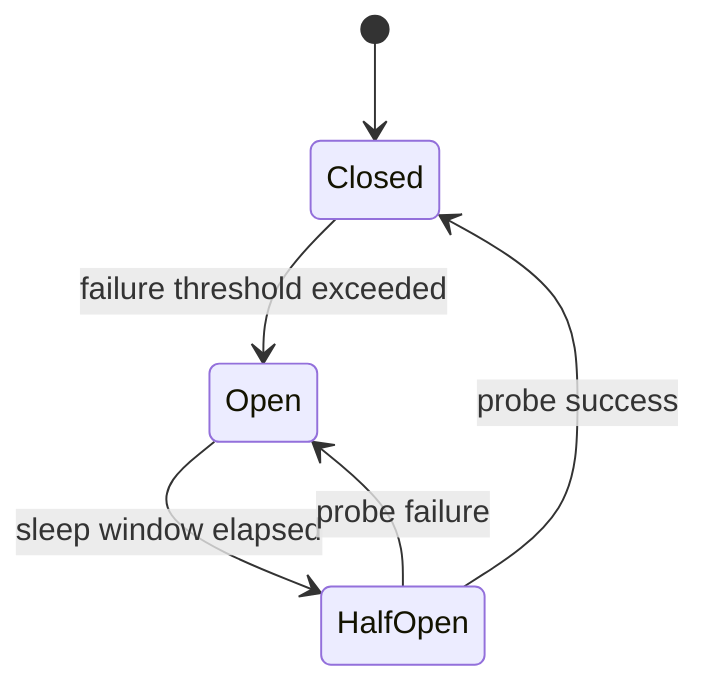
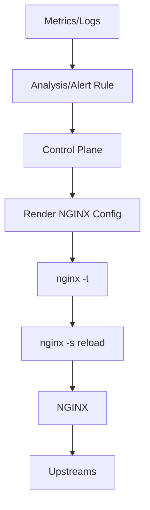

# Part 054 — Circuit-Breaker-Like Patterns in NGINX

Part 053 covered progressive delivery: controlling where traffic goes during release.

Now we discuss a tempting idea:

```txt
Can NGINX act as a circuit breaker?
```

The honest answer:

```txt
NGINX can implement several circuit-breaker-like controls.
NGINX Open Source is not a full adaptive circuit breaker by itself.
```

This distinction matters.

A real circuit breaker usually tracks failures over time, changes state between closed/open/half-open, blocks calls while open, probes recovery, and exposes state to application/control-plane logic.

NGINX has primitives:

```txt
passive upstream failure marking
retry to next upstream
timeouts
rate limiting
connection limiting
backup upstreams
error interception
stale cache fallback
manual kill switches
external health/control-plane integration
```

These can produce circuit-breaker-like behavior. But they are not the same as a rich per-dependency application circuit breaker with semantic failure classification.

---

## 1. Mental Model: Circuit Breaker Is a State Machine

Classic circuit breaker:



Meaning:

```txt
Closed   = traffic flows normally
Open     = traffic is blocked/fails fast
HalfOpen = small amount of traffic probes recovery
```

NGINX Open Source does not expose this exact state machine as a high-level primitive for HTTP upstream dependencies.

But parts of it map to NGINX features:

| Circuit Breaker Concept | NGINX Approximation |
|---|---|
| detect network failure | `proxy_next_upstream error timeout`, passive health checks |
| mark server unhealthy | `max_fails`, `fail_timeout` |
| block/reduce traffic | `limit_req`, `limit_conn`, route to fallback, manual map switch |
| probe recovery | passive retry after `fail_timeout`; active health check in Plus/external controller |
| fallback response | `error_page`, stale cache, backup upstream |
| observe state | access logs, error logs, `$upstream_*`; richer status in Plus/exporters |
| semantic failure threshold | mostly outside NGINX OSS; app/control plane needed |

So the working model is:

```txt
NGINX handles transport/proxy-level resilience well.
Application/control plane handles semantic resilience better.
```

---

## 2. Failure Classification: Not All Failures Are Equal

Circuit breaker quality depends on classifying failure correctly.

At the edge, NGINX can see:

```txt
connection refused
connection timeout
read timeout
upstream closed connection
HTTP status from upstream
response latency
upstream address selected
number of upstream attempts
client aborted connection
```

NGINX often cannot fully know:

```txt
was payment charged?
was database write committed?
was message published?
is HTTP 409 expected business behavior?
is HTTP 500 retryable or deterministic?
is slow response caused by dependency A or B?
```

That is why retry/circuit logic at NGINX must be conservative.

Bad mental model:

```txt
All 500s are retryable, all timeouts are safe to retry, all slow requests should be cut off.
```

Better mental model:

```txt
Transport failures can be handled at NGINX.
Semantic failures require app/domain knowledge.
```

---

## 3. Passive Upstream Failure as a Weak Breaker

NGINX Open Source passive health checks can temporarily mark an upstream server unavailable.

```nginx
upstream app {
    server 10.0.10.11:8080 max_fails=2 fail_timeout=10s;
    server 10.0.10.12:8080 max_fails=2 fail_timeout=10s;
}

server {
    location / {
        proxy_next_upstream error timeout;
        proxy_next_upstream_tries 2;
        proxy_pass http://app;
    }
}
```

Approximation:

```txt
Closed: server receives traffic
Open: server temporarily skipped after max_fails within fail_timeout
Half-open: after fail_timeout, NGINX may try it again passively
```

Limitations:

```txt
failure is per upstream server, not per business dependency
state is limited and version/config dependent
single-server upstream cannot be meaningfully removed from rotation
recovery probe is not a controlled small probe unless active health checks/control plane are used
HTTP status failures only count if configured in proxy_next_upstream-like directives
```

Use this for:

```txt
bad backend instance
network blip
process crash
connection refusal
node-level failure
```

Do not use it as the only protection for:

```txt
payment provider outage
DB partial degradation
write path idempotency failure
semantic 500 storm
```

---

## 4. Retry Is Not Circuit Breaking

Retries and circuit breakers are often confused.

Retry says:

```txt
try again somewhere else
```

Circuit breaker says:

```txt
stop trying for a while because trying is making things worse
```

In NGINX:

```nginx
proxy_next_upstream error timeout http_502 http_503 http_504;
proxy_next_upstream_tries 2;
proxy_next_upstream_timeout 3s;
```

This may improve availability for idempotent reads.

It may harm writes.

Example dangerous flow:

```txt
client POST /payments
NGINX sends to backend A
backend A charges card but times out before response
NGINX retries backend B
backend B charges again
client sees success once
user charged twice
```

Never treat retry as free resilience.

Route-specific policy:

```nginx
location /catalog/ {
    proxy_next_upstream error timeout http_502 http_503 http_504;
    proxy_next_upstream_tries 2;
    proxy_pass http://catalog;
}

location /payments/ {
    proxy_next_upstream error timeout;
    proxy_next_upstream_tries 1;
    proxy_pass http://payments;
}
```

Even `error timeout` for writes can be unsafe if request may already have reached upstream.

The application should own idempotency keys and duplicate suppression.

---

## 5. Fail Fast with Timeouts

Timeouts are one of the simplest breaker-like controls.

Without timeouts:

```txt
client waits
NGINX worker resources stay tied
upstream threads stay blocked
queues grow
latency collapses
```

With timeouts:

```txt
failure becomes bounded
resources return sooner
callers can retry at higher layer if safe
```

Example:

```nginx
location /api/ {
    proxy_connect_timeout 1s;
    proxy_send_timeout 5s;
    proxy_read_timeout 15s;
    send_timeout 15s;

    proxy_next_upstream error timeout http_502 http_503 http_504;
    proxy_next_upstream_tries 2;

    proxy_pass http://app;
}
```

But timeouts must reflect route semantics.

| Route | Timeout Strategy |
|---|---|
| health check | very short |
| search/autocomplete | short; fail fast |
| report generation | async preferred; if sync, long but isolated |
| payment/write | conservative retry; clear deadline |
| SSE/WebSocket | long read timeout with heartbeat |
| file upload | request body strategy + body timeout |

Timeouts are breakers for **duration**, not for **error rate**.

---

## 6. Rate Limiting as Load-Shedder

When failure is caused by overload, sending more traffic makes it worse.

`limit_req` can shed excess request rate using a leaky-bucket style mechanism.

```nginx
limit_req_zone $binary_remote_addr zone=per_ip_api:20m rate=10r/s;

server {
    location /api/ {
        limit_req zone=per_ip_api burst=20 nodelay;
        proxy_pass http://app;
    }
}
```

This is not a backend-specific circuit breaker, but it prevents edge overload amplification.

Use cases:

```txt
bot spike
client retry storm
expensive endpoint abuse
one tenant overwhelming shared backend
```

Better keys:

```txt
$binary_remote_addr for anonymous traffic
trusted tenant id for B2B APIs
API key id for developer APIs
user id for authenticated systems
```

Example tenant-based limit:

```nginx
limit_req_zone $http_x_tenant_id zone=tenant_api:50m rate=100r/s;

location /api/ {
    limit_req zone=tenant_api burst=200;
    proxy_pass http://app;
}
```

Only do this if `$http_x_tenant_id` is trusted. Public client-controlled tenant headers are unsafe.

---

## 7. Connection Limiting as Saturation Guard

`limit_conn` limits concurrent connections per key.

```nginx
limit_conn_zone $binary_remote_addr zone=per_ip_conn:20m;

server {
    location /download/ {
        limit_conn per_ip_conn 5;
        proxy_pass http://download_backend;
    }
}
```

Use for:

```txt
large downloads
long polling
WebSocket/SSE entrypoints
upload endpoints
expensive streaming resources
```

Do not confuse request rate and concurrency.

```txt
High RPS with short requests -> rate limiting
Low RPS with long requests -> connection limiting
```

Circuit-breaker-like effect:

```txt
prevent one key from consuming all edge/upstream capacity
```

---

## 8. Backup Upstream as Fallback

NGINX upstream supports backup servers.

```nginx
upstream app {
    server 10.0.10.11:8080 max_fails=2 fail_timeout=10s;
    server 10.0.10.12:8080 max_fails=2 fail_timeout=10s;
    server 10.0.99.10:8080 backup;
}
```

Backup receives traffic when primary servers are unavailable.

Good fallback candidates:

```txt
read-only degraded service
static maintenance service
legacy stable service
regional fallback for idempotent reads
```

Bad fallback candidates:

```txt
stale write service
service with incompatible schema
service that accepts writes without same guarantees
```

Backup upstream is a fallback mechanism, not proof of correctness.

---

## 9. Error Interception and Fallback Responses

NGINX can intercept certain upstream errors and serve a controlled response.

```nginx
location /api/ {
    proxy_intercept_errors on;
    error_page 502 503 504 = @api_unavailable;
    proxy_pass http://app;
}

location @api_unavailable {
    internal;
    default_type application/json;
    return 503 '{"error":"service_unavailable","retry_after_seconds":30}\n';
}
```

This is useful because it gives clients a stable contract.

But do not hide failures blindly.

Bad:

```txt
return 200 with fallback body for a failed write
```

Better:

```txt
return explicit 503/429/504 with retry guidance
```

Fallback response must preserve semantic truth.

---

## 10. Stale Cache as a Read-Side Breaker

For cacheable reads, stale cache can be a powerful resilience primitive.

```nginx
proxy_cache_path /var/cache/nginx/api levels=1:2 keys_zone=api_cache:100m inactive=30m max_size=10g;

server {
    location /catalog/ {
        proxy_cache api_cache;
        proxy_cache_key "$scheme$request_method$host$request_uri";
        proxy_cache_valid 200 5m;
        proxy_cache_use_stale error timeout http_500 http_502 http_503 http_504 updating;
        proxy_cache_background_update on;
        proxy_cache_lock on;

        add_header X-Cache-Status $upstream_cache_status always;
        proxy_pass http://catalog;
    }
}
```

Circuit-breaker-like behavior:

```txt
origin is failing -> serve stale cached response instead of amplifying origin load
```

Use for:

```txt
catalog
feature flags
public content
read-heavy metadata
non-critical recommendations
```

Do not use casually for:

```txt
balances
case status requiring strict freshness
permission decisions
authentication/authorization response
payment state
regulatory deadline state
```

Stale cache trades freshness for availability. That trade must be explicit.

---

## 11. Manual Kill Switch with `map`

When a dependency fails, sometimes the fastest safe response is manual routing.

```nginx
map $host $payments_kill_switch {
    default 0;
}

map $payments_kill_switch $payments_upstream {
    1       payments_disabled;
    default payments_api;
}

upstream payments_api {
    server 10.0.30.11:8080;
    server 10.0.30.12:8080;
}

upstream payments_disabled {
    server 127.0.0.1:9001;
}

server {
    location /payments/ {
        proxy_pass http://$payments_upstream;
    }
}
```

A local fallback service can return:

```json
{"error":"payments_temporarily_unavailable","retry_after_seconds":300}
```

This is not automatic circuit breaking. It is an operator-controlled breaker.

Advantages:

```txt
simple
auditable
fast rollback
works in Open Source
```

Disadvantages:

```txt
manual unless automated
requires reload unless dynamic config/control plane exists
coarse-grained
```

---

## 12. Automated Kill Switch via Generated Config

A safer production setup uses generated config from incident control state.

```yaml
service: payments
mode: disabled
reason: provider-outage-2026-07-07
retryAfterSeconds: 300
owner: payments-platform
expiresAt: 2026-07-07T14:30:00+07:00
```

Rendered:

```nginx
map $host $payments_kill_switch {
    default 1;
}
```

CI/CD:

```bash
render-nginx-breakers > /etc/nginx/conf.d/generated/breakers.conf
nginx -t
nginx -s reload
```

Add expiration. Kill switches that never expire become hidden product behavior.

---

## 13. Half-Open Approximation

A true breaker half-open state sends a small number of probes.

NGINX Open Source approximation:

```txt
server marked unavailable by passive checks
fail_timeout elapses
server becomes eligible again
real traffic may hit it
if it fails, it is marked again
```

This is coarse.

Better options:

```txt
NGINX Plus active health checks
Kubernetes readiness/liveness gates
external service discovery/control plane
small manual weight ramp
separate smoke-check pipeline before reintroducing traffic
```

Manual half-open with weights:

```nginx
upstream app {
    server 10.0.10.11:8080 weight=100;
    server 10.0.10.12:8080 weight=100;
    server 10.0.10.13:8080 weight=1; # recovering node
}
```

Then gradually raise:

```txt
1 -> 5 -> 25 -> 50 -> 100
```

This is not automatic, but it is controlled.

---

## 14. Per-Route Breakers

Dependency failures are often route-specific.

Bad pattern:

```nginx
location / {
    proxy_connect_timeout 1s;
    proxy_read_timeout 10s;
    proxy_next_upstream error timeout http_500 http_502 http_503 http_504;
    proxy_next_upstream_tries 3;
}
```

This treats every route the same.

Better:

```nginx
location /catalog/ {
    proxy_read_timeout 5s;
    proxy_next_upstream error timeout http_502 http_503 http_504;
    proxy_next_upstream_tries 2;
    proxy_cache_use_stale error timeout http_500 http_502 http_503 http_504;
    proxy_pass http://catalog;
}

location /checkout/ {
    proxy_read_timeout 20s;
    proxy_next_upstream error timeout;
    proxy_next_upstream_tries 1;
    proxy_pass http://checkout;
}

location /reports/ {
    limit_req zone=report_rate burst=5;
    proxy_read_timeout 120s;
    proxy_next_upstream off;
    proxy_pass http://reports;
}
```

Route semantics should drive breaker policy.

---

## 15. Retry Storms and Amplification

Retries can multiply load.

Example:

```txt
client retries 3 times
CDN retries 2 times
NGINX retries 2 times
app retries DB 3 times
```

Worst-case amplification:

```txt
3 * 2 * 2 * 3 = 36 attempts
```

During outage, this destroys the dependency faster.

NGINX-level rules:

```txt
keep proxy_next_upstream_tries small
set proxy_next_upstream_timeout
avoid retrying non-idempotent writes
return 429/503 with Retry-After where appropriate
coordinate retry budgets across layers
```

Example:

```nginx
proxy_next_upstream error timeout http_502 http_503 http_504;
proxy_next_upstream_tries 2;
proxy_next_upstream_timeout 2s;
add_header Retry-After 30 always;
```

But only add `Retry-After` when the response semantics justify it.

---

## 16. Overload Control Is Not the Same as Failure Handling

A backend can be healthy but overloaded.

Failure handling asks:

```txt
What do we do when a request fails?
```

Overload control asks:

```txt
How do we avoid sending more work than the system can complete?
```

NGINX overload tools:

```txt
limit_req
limit_conn
client_body limits
timeouts
max_conns on upstream servers
buffering strategy
cache/stale cache
static fallback
```

Example `max_conns`:

```nginx
upstream app {
    zone app 64k;
    server 10.0.10.11:8080 max_conns=200;
    server 10.0.10.12:8080 max_conns=200;
}
```

This limits concurrent active connections to a server. It is capacity guardrail, not semantic breaker.

---

## 17. Circuit-Breaker-Like Decision Matrix

| Problem | NGINX Primitive | Good Fit? | Notes |
|---|---|---:|---|
| backend instance crashed | passive health + retry | yes | route to other instances |
| backend process cold after deploy | slow start/manual weights | partial | Plus/external control helpful |
| provider outage behind app | timeout + app breaker | partial | app knows provider semantics better |
| read origin failing | stale cache | yes if freshness allows | cache key correctness required |
| bot spike | rate limit | yes | key must be correct/trusted |
| long-lived connection saturation | limit_conn + route isolation | yes | per endpoint config |
| payment duplicate risk | no NGINX-only solution | no | app idempotency required |
| tenant-specific overload | tenant rate limit | yes if tenant id trusted | combine with auth boundary |
| semantic 500 from business rule | no | no | app should classify |
| emergency disable feature | map kill switch | yes | manual or generated config |

---

## 18. Observability for Breaker-Like Behavior

Log these fields:

```nginx
log_format edge_resilience escape=json
'{'
  '"ts":"$time_iso8601",'
  '"request_id":"$request_id",'
  '"method":"$request_method",'
  '"uri":"$request_uri",'
  '"status":$status,'
  '"request_time":$request_time,'
  '"upstream_addr":"$upstream_addr",'
  '"upstream_status":"$upstream_status",'
  '"upstream_connect_time":"$upstream_connect_time",'
  '"upstream_header_time":"$upstream_header_time",'
  '"upstream_response_time":"$upstream_response_time",'
  '"cache_status":"$upstream_cache_status",'
  '"route_family":"$route_family",'
  '"breaker_mode":"$breaker_mode"'
'}';
```

Metrics to derive:

```txt
upstream attempt count
502/503/504 rate by route
429 rate by key/route
latency by upstream
connect timeout vs read timeout
cache stale served rate
breaker kill switch active duration
retry amplification estimate
```

Important distinction:

```txt
A lower 5xx rate after fallback may hide a degraded user experience.
```

Track explicit degraded responses.

---

## 19. Incident Playbook: Dependency Latency Spike

Scenario:

```txt
/api/search p99 jumps from 400ms to 8s
upstream 504 increases
client retry traffic increases
CPU on search backend rises
```

NGINX actions:

```txt
1. Reduce proxy_read_timeout for search if user journey tolerates fast failure.
2. Limit request rate for abusive/anonymous keys.
3. Enable stale cache for cacheable search responses if correctness allows.
4. Disable expensive query paths via route-level map if supported.
5. Avoid increasing retries.
6. Add/confirm Retry-After for 503/429.
```

Config sketch:

```nginx
map $arg_expensive $search_mode {
    default normal;
    "true" disabled;
}

location /api/search/ {
    limit_req zone=search_per_ip burst=20;

    if ($search_mode = disabled) {
        return 503 '{"error":"expensive_search_temporarily_disabled"}\n';
    }

    proxy_read_timeout 3s;
    proxy_next_upstream error timeout http_502 http_503 http_504;
    proxy_next_upstream_tries 1;

    proxy_cache search_cache;
    proxy_cache_use_stale error timeout http_500 http_502 http_503 http_504 updating;

    proxy_pass http://search;
}
```

Note: `if` has sharp edges in NGINX. For serious configs, prefer `map` + named locations/return where possible. Use `if` only for safe rewrite-module operations and with discipline.

---

## 20. Incident Playbook: Write Path Failing

Scenario:

```txt
POST /payments starts timing out
some requests may have reached upstream
provider is unstable
```

Do not blindly retry.

Safer NGINX posture:

```nginx
location /payments/ {
    proxy_connect_timeout 1s;
    proxy_send_timeout 10s;
    proxy_read_timeout 20s;

    proxy_next_upstream error timeout;
    proxy_next_upstream_tries 1;

    proxy_intercept_errors on;
    error_page 502 503 504 = @payments_unavailable;

    proxy_pass http://payments;
}

location @payments_unavailable {
    internal;
    default_type application/json;
    add_header Retry-After 300 always;
    return 503 '{"error":"payments_temporarily_unavailable","retry_after_seconds":300}\n';
}
```

Application posture:

```txt
require idempotency key
persist request state before external call
return reconcilable status
avoid duplicate charge
surface pending state if uncertain
```

NGINX cannot solve duplicate writes alone.

---

## 21. External Control Plane Pattern

For richer breaker semantics, use an external controller.



The controller can decide:

```txt
disable route
lower canary percentage
route to fallback
reduce timeout
activate cache stale mode
increase rate limit strictness
remove upstream from generated config
```

Guardrails:

```txt
all changes are diffed
all generated config passes nginx -t
automation has max blast radius
automation has expiry
automation emits audit event
human override exists
```

This turns NGINX into a reliable data plane while keeping complex policy elsewhere.

---

## 22. NGINX Plus Boundary

Some features are easier with NGINX Plus/commercial capabilities depending on version and module availability:

```txt
active health checks
richer live activity monitoring/API
dynamic upstream reconfiguration
slow_start historically commercial
advanced session persistence historically commercial
key-value store/API style dynamic controls
```

Open Source can still build robust systems, but often through:

```txt
reload-based generated config
external health checks
Kubernetes readiness/services
service discovery
observability-driven automation
application-level circuit breakers
```

Do not design assuming Plus-only features exist if your runtime is NGINX Open Source.

---

## 23. Testing Breaker-Like Behavior

You cannot trust resilience config until you break things intentionally.

Test cases:

```txt
[ ] upstream connection refused
[ ] upstream accepts connection but never responds
[ ] upstream returns 500
[ ] upstream returns 503
[ ] upstream is slow but eventually returns 200
[ ] one backend fails in multi-backend upstream
[ ] all backends fail
[ ] client retry storm
[ ] cache origin unavailable
[ ] POST endpoint timeout after receiving body
[ ] long-lived WebSocket/SSE during backend restart
```

Example local failure injection:

```bash
# Backend closed
systemctl stop app-a

# Backend slow
toxiproxy-cli toxic add app-a -t latency -a latency=5000

# Backend drops connections
iptables -A INPUT -p tcp --dport 8080 -j DROP

# Validate NGINX behavior
curl -i https://api.example.com/catalog/items
curl -i -X POST https://api.example.com/payments
```

Observe:

```txt
status
latency
upstream_addr sequence
upstream_status sequence
retry count
fallback response
cache status
error log
```

---

## 24. Production Reference Pattern

A conservative resilience skeleton:

```nginx
limit_req_zone $binary_remote_addr zone=anon_api:50m rate=20r/s;
limit_conn_zone $binary_remote_addr zone=anon_conn:20m;

upstream catalog {
    zone catalog 64k;
    server 10.0.10.11:8080 max_fails=2 fail_timeout=10s max_conns=300;
    server 10.0.10.12:8080 max_fails=2 fail_timeout=10s max_conns=300;
    keepalive 64;
}

upstream checkout {
    zone checkout 64k;
    server 10.0.20.11:8080 max_fails=1 fail_timeout=10s max_conns=100;
    server 10.0.20.12:8080 max_fails=1 fail_timeout=10s max_conns=100;
    keepalive 32;
}

map $host $catalog_breaker_mode {
    default normal;
}

server {
    listen 443 ssl http2;
    server_name api.example.com;

    location /catalog/ {
        limit_req zone=anon_api burst=50;

        proxy_cache catalog_cache;
        proxy_cache_use_stale error timeout http_500 http_502 http_503 http_504 updating;
        proxy_cache_lock on;

        proxy_connect_timeout 1s;
        proxy_read_timeout 5s;
        proxy_next_upstream error timeout http_502 http_503 http_504;
        proxy_next_upstream_tries 2;
        proxy_next_upstream_timeout 2s;

        proxy_pass http://catalog;
    }

    location /checkout/ {
        limit_conn anon_conn 10;

        proxy_connect_timeout 1s;
        proxy_read_timeout 20s;
        proxy_next_upstream error timeout;
        proxy_next_upstream_tries 1;

        proxy_intercept_errors on;
        error_page 502 503 504 = @checkout_unavailable;

        proxy_pass http://checkout;
    }

    location @checkout_unavailable {
        internal;
        default_type application/json;
        add_header Retry-After 60 always;
        return 503 '{"error":"checkout_temporarily_unavailable"}\n';
    }
}
```

Notice the route split:

```txt
catalog: retry + stale cache allowed
checkout: no cross-upstream retry after failure; explicit unavailable response
```

That is the difference between mechanical config and system design.

---

## 25. Summary

NGINX can provide circuit-breaker-like behavior, but only if you design around its actual primitives.

Key invariants:

```txt
1. Do not call retries a circuit breaker.
2. Use passive health checks for instance-level transport failure.
3. Use timeouts to bound resource occupation.
4. Use rate/connection limits to prevent overload amplification.
5. Use stale cache only where stale data is acceptable.
6. Use fallback responses that preserve semantic truth.
7. Use app-level idempotency for writes.
8. Use external control planes for adaptive breaker state.
9. Test failure modes intentionally before relying on them.
```

The top 1% skill is not knowing one magic directive.

It is knowing where NGINX's responsibility ends, where application semantics begin, and how to connect both without lying to yourself during an incident.

---

## References

- NGINX documentation: `ngx_http_proxy_module`
- NGINX documentation: `ngx_http_upstream_module`
- NGINX documentation: `ngx_http_limit_req_module`
- NGINX documentation: `ngx_http_limit_conn_module`
- NGINX documentation: content caching and stale cache directives
- NGINX documentation: request processing and internal redirects
