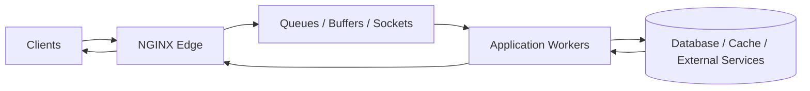
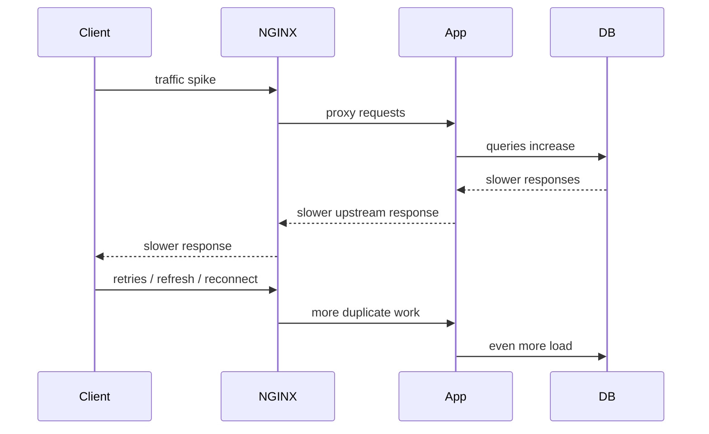
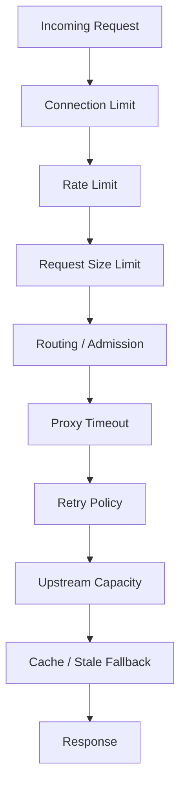

# Part 055 — Queueing, Overload, and Load Shedding

> NGINX tidak membuat backend menjadi kuat. NGINX hanya memberi kita tempat yang sangat strategis untuk **membatasi**, **mengantri**, **menolak**, **meng-cache**, dan **mengamati** traffic sebelum traffic itu menghancurkan sistem di belakangnya.

Part sebelumnya membahas circuit-breaker-like patterns. Sekarang kita masuk ke pondasi yang lebih keras: **overload control**.

Banyak engineer salah membaca gejala production:

- error naik dianggap “backend bug”;
- latency naik dianggap “network lambat”;
- retry dianggap “menambah reliability”;
- queue dianggap “menyerap spike”;
- autoscaling dianggap “pasti menyelesaikan overload”.

Padahal pada sistem nyata, overload sering bukan karena satu komponen mati. Overload sering muncul karena **traffic lebih cepat masuk daripada kemampuan sistem menyelesaikan pekerjaan**. Ketika itu terjadi, queue membesar, latency naik, retry memperbanyak request, backend makin lambat, dan akhirnya sistem collapse.

NGINX duduk di titik yang tepat untuk memutus spiral itu.

---

## 1. Mental model: overloaded system is a conservation problem

Sistem request/response bisa dipikirkan seperti pipa:



Ada tiga angka yang harus selalu hidup di kepala:

```txt
arrival_rate      = request masuk per detik
service_rate      = request selesai per detik
in_flight_work    = request yang sedang diproses / menunggu
```

Jika:

```txt
arrival_rate <= sustainable_service_rate
```

sistem stabil.

Jika:

```txt
arrival_rate > sustainable_service_rate
```

maka pekerjaan menumpuk.

NGINX bisa menumpuk pekerjaan di beberapa tempat:

- accept queue kernel;
- connection backlog;
- client body buffer;
- proxy buffer;
- upstream keepalive pool;
- upstream backend queue;
- application executor/thread pool;
- database connection pool;
- disk temp files;
- cache lock wait;
- client-side retry queue.

Masalahnya: **queue membuat sistem terlihat masih menerima traffic**, padahal sebenarnya sistem sedang menumpuk utang latency.

---

## 2. Queue is not capacity

Queue sering dianggap sebagai kapasitas tambahan. Ini keliru.

Queue hanya menunda kegagalan.

Misal backend sanggup menyelesaikan 1.000 request/detik. Traffic datang 2.000 request/detik selama 60 detik.

```txt
backlog growth = 2.000 - 1.000 = 1.000 request/detik
backlog after 60s = 60.000 request
```

Jika request itu tetap diterima, ada dua kemungkinan:

1. user menunggu sangat lama;
2. user timeout dan retry, tapi request lama tetap diproses backend.

Dua-duanya buruk. Yang kedua lebih buruk karena menciptakan duplicate work.

Dalam production, queue harus dipakai sebagai **shock absorber kecil**, bukan sebagai strategi capacity.

---

## 3. Latency collapse: dari lambat menjadi mati

Latency collapse biasanya berjalan seperti ini:



Ketika latency naik, client tidak selalu sabar. Browser refresh, mobile SDK retry, API clients retry, load balancer retry, NGINX retry, job workers retry.

Satu request logical bisa berubah menjadi beberapa request physical.

Itulah kenapa overload policy harus menjawab pertanyaan ini:

> Lebih baik memproses semua request dengan latency tak terbatas, atau menolak sebagian request dengan cepat agar sistem inti tetap hidup?

Untuk sistem production, jawabannya hampir selalu:

> Tolak lebih awal, dengan sinyal yang jelas, sebelum kerja mahal dimulai.

---

## 4. Where NGINX can control overload

NGINX punya beberapa titik kontrol:



Mapping primitif NGINX:

| Problem | Primitive |
|---|---|
| terlalu banyak request per key | `limit_req` |
| terlalu banyak koneksi per key | `limit_conn` |
| body terlalu besar | `client_max_body_size` |
| client terlalu lambat mengirim body/header | `client_body_timeout`, `client_header_timeout` |
| upstream terlalu lambat | `proxy_connect_timeout`, `proxy_read_timeout`, `proxy_send_timeout` |
| retry memperparah beban | `proxy_next_upstream*` |
| backend terlalu banyak concurrent connection | `max_conns` pada upstream server |
| origin overload untuk konten cacheable | `proxy_cache`, `proxy_cache_use_stale`, `proxy_cache_lock` |
| endpoint mahal | route-specific limit/routing |
| incident manual | kill switch via `map`, `return`, backup upstream |

NGINX bukan scheduler global. Ia tidak tahu CPU queue backend, DB wait time, atau business priority kecuali kita encode sinyalnya lewat routing, headers, status, atau config.

---

## 5. Load shedding: menolak request adalah fitur reliability

Load shedding berarti sengaja menolak sebagian request untuk menjaga sistem inti tetap melayani request yang lebih penting.

Contoh sinyal HTTP yang umum:

| Status | Makna operasional |
|---|---|
| `429 Too Many Requests` | client/key melewati rate policy |
| `503 Service Unavailable` | service sedang tidak mampu menerima request |
| `504 Gateway Timeout` | upstream tidak merespons dalam budget waktu gateway |
| `413 Payload Too Large` | body melebihi batas admission |

Perhatikan bedanya:

- `429` cocok untuk policy per user/IP/token/tenant;
- `503` cocok untuk overload global atau kill switch;
- `504` adalah gejala timeout upstream, bukan admission control ideal;
- `413` adalah admission control untuk request size.

Production invariant:

> Request yang sudah jelas tidak mungkin diproses dengan benar harus ditolak sebelum menyentuh dependency mahal.

---

## 6. Rate limiting dengan `limit_req`

`limit_req` membatasi **rate processing request** berdasarkan key tertentu.

Minimal pattern:

```nginx
http {
    limit_req_zone $binary_remote_addr zone=per_ip_api:20m rate=10r/s;

    server {
        location /api/ {
            limit_req zone=per_ip_api burst=20 nodelay;
            limit_req_status 429;

            proxy_pass http://api_backend;
        }
    }
}
```

Mental model:

```txt
limit_req_zone = definisi bucket + shared memory + rate
limit_req      = penggunaan bucket pada route tertentu
burst          = toleransi spike sementara
nodelay        = reject/allow langsung, bukan delay smoothing
```

NGINX `limit_req` berbasis leaky bucket. Artinya request yang melewati rate bisa ditunda atau ditolak tergantung konfigurasi `burst`, `delay`, dan `nodelay`.

### Key design

Key rate limit sangat penting.

| Key | Kelebihan | Risiko |
|---|---|---|
| `$binary_remote_addr` | mudah, compact | buruk di belakang NAT besar; butuh real IP benar |
| `$http_authorization` | per token | token panjang; leak risk di log bila tidak hati-hati |
| `$cookie_session` | per session | missing/rotating cookie |
| `$host` | per tenant host | semua user tenant berbagi bucket |
| `$request_uri` | per endpoint | cardinality tinggi, bisa memory pressure |
| `$remote_addr$uri` | per IP per endpoint | lebih granular, cardinality naik |

Rule praktis:

> Jangan rate-limit berdasarkan identitas yang bisa dipalsukan kecuali trust boundary sudah benar.

Jika `$remote_addr` masih IP load balancer, rate limit per IP menjadi tidak berguna. Ini mengikat langsung ke Part 032: real IP dan forwarded header trust boundary.

---

## 7. `burst`: toleransi spike, bukan kapasitas permanen

Contoh:

```nginx
limit_req_zone $binary_remote_addr zone=login_per_ip:10m rate=2r/s;

location /login {
    limit_req zone=login_per_ip burst=5 nodelay;
    limit_req_status 429;

    proxy_pass http://auth_backend;
}
```

Interpretasi:

- rate normal: 2 request/detik per IP;
- burst: toleransi antrian/spike sampai 5;
- `nodelay`: request dalam burst tidak ditunda, tetapi jika bucket penuh request ditolak.

Tanpa `nodelay`, NGINX bisa menunda request untuk meratakan rate. Ini kadang berguna, tapi di endpoint user-facing sering memperburuk perceived latency.

Untuk API production, saya lebih sering memilih:

```nginx
burst=N nodelay
```

lalu menolak cepat dengan `429`, daripada membuat client menggantung lama.

---

## 8. Rate limit per route, bukan global buta

Jangan mulai dengan satu global rate limit untuk semua path.

Endpoint berbeda punya biaya berbeda:

| Endpoint | Cost | Policy |
|---|---:|---|
| `GET /health` | sangat rendah | longgar / bypass |
| `GET /static/app.js` | rendah/cacheable | cache/CDN, bukan strict API limit |
| `GET /api/profile` | sedang | per user/IP |
| `POST /login` | mahal/security-sensitive | ketat per IP + username/tenant bila bisa |
| `POST /reports/export` | sangat mahal | quota, queue, atau async job |
| `POST /payments` | critical non-idempotent | jangan retry sembarangan; limit berbasis user/tenant |

Pattern:

```nginx
limit_req_zone $binary_remote_addr zone=default_api:20m rate=30r/s;
limit_req_zone $binary_remote_addr zone=login_ip:20m rate=3r/m;
limit_req_zone $tenant_id zone=tenant_api:20m rate=100r/s;

server {
    location /api/auth/login {
        limit_req zone=login_ip burst=5 nodelay;
        limit_req_status 429;
        proxy_pass http://auth_backend;
    }

    location /api/ {
        limit_req zone=default_api burst=60 nodelay;
        limit_req zone=tenant_api burst=200 nodelay;
        limit_req_status 429;
        proxy_pass http://api_backend;
    }
}
```

Catatan: multi-dimensional limit harus diuji hati-hati. Pastikan status/log bisa membedakan bucket mana yang menolak.

---

## 9. Dry-run first

Sebelum enforce rate limit di production, gunakan dry-run bila tersedia di versi/module Anda:

```nginx
limit_req_dry_run on;
```

Tujuannya:

- melihat berapa request yang akan ditolak;
- menghindari mematikan tenant penting;
- mengkalibrasi rate/burst;
- membedakan traffic manusia, bot, integration partner, dan internal service.

Production rollout:

```txt
observe only -> alert only -> enforce on low-risk route -> enforce broader -> tune per tenant
```

Jangan mengaktifkan rate limit besar-besaran tanpa observability.

---

## 10. Connection limiting dengan `limit_conn`

Rate limit membatasi request per waktu. Connection limit membatasi koneksi aktif.

Contoh:

```nginx
http {
    limit_conn_zone $binary_remote_addr zone=conn_per_ip:20m;

    server {
        location /download/ {
            limit_conn conn_per_ip 5;
            proxy_pass http://download_backend;
        }
    }
}
```

Connection limit berguna untuk:

- download besar;
- long polling;
- SSE;
- WebSocket;
- slow client attack;
- tenant yang membuka koneksi terlalu banyak.

Tetapi hati-hati: HTTP/2 multiplexing bisa membuat banyak request lewat satu koneksi. Connection limit bukan pengganti request concurrency limit.

---

## 11. Upstream `max_conns`: admission ke backend

Jika backend hanya sanggup menangani concurrency tertentu, Anda bisa membatasi koneksi aktif ke server upstream:

```nginx
upstream api_backend {
    zone api_backend 64k;

    server 10.0.10.11:8080 max_conns=200;
    server 10.0.10.12:8080 max_conns=200;
}
```

Mental model:

```txt
max_conns membatasi active connections ke server upstream,
bukan request bisnis secara sempurna.
```

Caveat penting:

- dengan keepalive, koneksi idle juga memakai file descriptor;
- tanpa shared `zone`, state per worker bisa membuat limit tidak global seperti yang Anda kira;
- HTTP request cost tidak sama; 200 koneksi ringan tidak sama dengan 200 export besar;
- jika semua upstream penuh, NGINX harus punya failure behavior yang jelas.

`max_conns` adalah guardrail, bukan autoscaler.

---

## 12. Timeout as overload control

Timeout sering dianggap cuma “agar tidak hang”. Sebenarnya timeout adalah overload control.

Contoh:

```nginx
location /api/ {
    proxy_connect_timeout 1s;
    proxy_send_timeout 10s;
    proxy_read_timeout 15s;

    proxy_pass http://api_backend;
}
```

Timeout terlalu panjang menyebabkan worker/backend terikat pada request yang sudah tidak bernilai.

Timeout terlalu pendek menyebabkan false failure.

Design rule:

```txt
client timeout > edge timeout > app timeout > dependency timeout
```

Tapi jangan hanya mengandalkan urutan. Pastikan setiap layer tahu apakah request masih worth processing.

Untuk endpoint mahal:

```nginx
location /api/reports/export {
    proxy_connect_timeout 1s;
    proxy_send_timeout 30s;
    proxy_read_timeout 60s;
    proxy_next_upstream off;

    proxy_pass http://report_backend;
}
```

Kenapa retry off? Karena export/report bisa mahal dan non-idempotent secara resource walaupun metodenya `GET`.

---

## 13. Retry can be load amplification

Retry bisa meningkatkan availability saat failure kecil. Retry juga bisa menghancurkan sistem saat overload.

Bad pattern:

```nginx
proxy_next_upstream error timeout http_500 http_502 http_503 http_504;
proxy_next_upstream_tries 5;
```

Jika backend overload dan mulai timeout, config ini bisa mengubah satu request menjadi lima percobaan.

Better pattern:

```nginx
location /api/read/ {
    proxy_next_upstream error timeout http_502 http_503 http_504;
    proxy_next_upstream_tries 2;
    proxy_next_upstream_timeout 3s;

    proxy_pass http://read_backend;
}

location /api/write/ {
    proxy_next_upstream off;
    proxy_pass http://write_backend;
}
```

Retry budget harus per route.

Invariant:

> Retry hanya boleh dilakukan jika duplicate execution aman atau request belum dikirim ke upstream.

---

## 14. Cache as overload protection

Cache bukan hanya performance. Cache adalah overload protection untuk origin.

Pattern:

```nginx
proxy_cache_path /var/cache/nginx/api levels=1:2 keys_zone=api_cache:100m inactive=30m max_size=5g;

server {
    location /api/catalog/ {
        proxy_cache api_cache;
        proxy_cache_valid 200 30s;
        proxy_cache_use_stale error timeout http_500 http_502 http_503 http_504 updating;
        proxy_cache_lock on;

        add_header X-Cache $upstream_cache_status always;
        proxy_pass http://catalog_backend;
    }
}
```

Saat origin lambat/error, `proxy_cache_use_stale` bisa mengembalikan response stale untuk menjaga user experience dan mengurangi tekanan origin.

Tapi cache safety wajib:

- cache key harus benar;
- private/authenticated data jangan bocor;
- `Vary` dan `Authorization` harus diperlakukan hati-hati;
- TTL harus sesuai business correctness;
- stale fallback harus observably visible.

---

## 15. Kill switch via `map`

Saat incident, Anda butuh cara cepat menurunkan beban.

Contoh kill switch endpoint mahal:

```nginx
map $uri $expensive_endpoint_disabled {
    default 0;
    ~^/api/reports/export 1;
}

server {
    location /api/ {
        if ($expensive_endpoint_disabled) {
            return 503 '{"error":"temporarily_unavailable"}';
        }

        proxy_pass http://api_backend;
    }
}
```

Dalam production yang lebih disiplin, jangan edit manual config di server. Generate map dari feature flag/config repo, validasi, lalu reload.

Better route-specific form:

```nginx
location /api/reports/export {
    return 503 '{"error":"export_temporarily_disabled"}';
}
```

Gunakan kill switch untuk:

- export/report mahal;
- search berat;
- endpoint fan-out;
- integration partner yang flood;
- tenant tertentu yang menyebabkan overload;
- feature baru yang menyebabkan DB pressure.

---

## 16. Backpressure is a contract

Backpressure bukan hanya membatasi. Backpressure harus memberi sinyal yang bisa dipahami client.

Response overload yang baik:

```nginx
limit_req_status 429;
add_header Retry-After 10 always;
```

Atau untuk route maintenance:

```nginx
return 503 '{"error":"temporarily_unavailable","retry_after_seconds":30}';
```

Untuk API publik, dokumentasikan:

- status code;
- retry behavior;
- exponential backoff;
- idempotency key requirement;
- quota window;
- per-tenant limit;
- apakah `Retry-After` wajib dipatuhi.

Tanpa client contract, rate limit hanya membuat traffic berpindah menjadi retry storm.

---

## 17. Overload-aware log format

Minimal log untuk overload:

```nginx
log_format edge_json escape=json
  '{'
    '"ts":"$time_iso8601",'
    '"request_id":"$request_id",'
    '"remote_addr":"$remote_addr",'
    '"host":"$host",'
    '"method":"$request_method",'
    '"uri":"$uri",'
    '"status":$status,'
    '"request_time":$request_time,'
    '"upstream_addr":"$upstream_addr",'
    '"upstream_status":"$upstream_status",'
    '"upstream_connect_time":"$upstream_connect_time",'
    '"upstream_header_time":"$upstream_header_time",'
    '"upstream_response_time":"$upstream_response_time",'
    '"upstream_cache_status":"$upstream_cache_status",'
    '"bytes_sent":$bytes_sent,'
    '"request_length":$request_length'
  '}';
```

Pertanyaan yang harus bisa dijawab dari log:

- request ditolak NGINX atau gagal di upstream?
- upstream mana yang lambat?
- apakah ada retry? Berapa upstream address/status yang muncul?
- connect lambat atau response body lambat?
- cache hit/miss/stale?
- endpoint mana yang menaikkan `request_time`?
- status 499 naik karena client timeout?

---

## 18. Overload dashboard

Dashboard overload minimal:

```txt
Traffic:
- requests/sec by route/status
- 2xx/3xx/4xx/5xx/429/499/502/503/504

Latency:
- p50/p90/p95/p99 request_time
- p50/p95 upstream_connect_time
- p50/p95 upstream_header_time
- p50/p95 upstream_response_time

Admission:
- limit_req rejected
- limit_conn rejected
- client body too large 413

Upstream:
- upstream_status distribution
- upstream_addr distribution
- retry count inferred from comma-separated upstream values
- max_conns saturation if observable externally

Cache:
- HIT/MISS/BYPASS/EXPIRED/STALE/UPDATING

System:
- worker connections
- file descriptors
- CPU
- disk I/O for temp/cache
- network throughput
```

NGINX Open Source metrics biasanya perlu diekstrak dari logs, `stub_status`, exporter, atau external telemetry. NGINX Plus punya API/monitoring yang lebih kaya, tetapi seri ini tetap Open Source-first kecuali boundary disebut eksplisit.

---

## 19. Failure mode catalogue

### 19.1 429 spike

Kemungkinan:

- traffic benar-benar naik;
- real IP salah sehingga semua client terlihat satu IP;
- burst terlalu kecil;
- bot/fraud attack;
- partner integration berubah behavior;
- endpoint baru memakai limit lama.

Action:

```txt
1. cek key limit
2. cek route affected
3. cek top remote_addr / tenant / token
4. cek upstream health
5. naikkan burst sementara hanya jika backend sehat
6. jangan menaikkan limit global tanpa data
```

### 19.2 499 spike

`499` berarti client menutup koneksi sebelum NGINX mengirim response.

Kemungkinan:

- upstream lambat sehingga client timeout;
- mobile network buruk;
- frontend timeout terlalu pendek;
- client retry storm;
- streaming endpoint tidak flush heartbeat;
- download terlalu besar.

Action:

```txt
compare request_time vs upstream_response_time
check client SDK timeout
check specific route
check upstream p99
```

### 19.3 502 spike

Kemungkinan:

- upstream connection refused;
- upstream reset;
- invalid response header;
- backend crash/restart;
- keepalive stale connection;
- protocol mismatch.

Action:

```txt
check error_log exact text
check upstream_addr distribution
check deploy/restart event
check proxy_http_version/headers
```

### 19.4 504 spike

Kemungkinan:

- upstream read timeout;
- DB slow;
- app thread pool saturated;
- dependency timeout too long;
- retry amplification;
- network partition.

Action:

```txt
check upstream_connect_time vs upstream_header_time vs upstream_response_time
reduce retry
shed expensive route
serve stale cache where safe
```

---

## 20. Admission control decision matrix

| Scenario | Better control |
|---|---|
| abusive IP floods login | `limit_req` per IP + auth-layer controls |
| partner exceeds agreed quota | `limit_req` per API key/tenant |
| backend thread pool saturates | upstream `max_conns`, shorter timeout, route shedding |
| DB overload from reports | disable/degrade report route, move async |
| static asset spike | CDN/browser cache/compression, not API rate limit |
| origin catalog unstable | proxy cache + stale + cache lock |
| slow upload clients | body size/timeouts, buffering strategy |
| WebSocket fanout too high | `limit_conn`, app-level session capacity |
| retry storm | reduce retry, idempotency contract, `Retry-After` |

---

## 21. Safe overload config skeleton

```nginx
http {
    # Identity must be correct before using remote_addr.
    # set_real_ip_from ...;
    # real_ip_header ...;

    limit_req_zone $binary_remote_addr zone=api_ip:50m rate=30r/s;
    limit_req_zone $binary_remote_addr zone=login_ip:20m rate=5r/m;
    limit_conn_zone $binary_remote_addr zone=conn_ip:20m;

    upstream api_backend {
        zone api_backend 64k;
        server 10.0.10.11:8080 max_conns=200 max_fails=2 fail_timeout=10s;
        server 10.0.10.12:8080 max_conns=200 max_fails=2 fail_timeout=10s;
        keepalive 64;
    }

    server {
        listen 443 ssl http2;
        server_name api.example.com;

        access_log /var/log/nginx/api.access.json edge_json;
        error_log  /var/log/nginx/api.error.log warn;

        client_max_body_size 2m;
        client_header_timeout 10s;
        client_body_timeout 15s;
        send_timeout 30s;

        location = /api/auth/login {
            limit_req zone=login_ip burst=5 nodelay;
            limit_req_status 429;
            add_header Retry-After 60 always;

            proxy_connect_timeout 1s;
            proxy_send_timeout 5s;
            proxy_read_timeout 10s;
            proxy_next_upstream off;

            proxy_pass http://api_backend;
        }

        location /api/ {
            limit_req zone=api_ip burst=60 nodelay;
            limit_conn conn_ip 20;
            limit_req_status 429;

            proxy_http_version 1.1;
            proxy_set_header Connection "";
            proxy_set_header Host $host;
            proxy_set_header X-Request-ID $request_id;
            proxy_set_header X-Real-IP $remote_addr;
            proxy_set_header X-Forwarded-For $proxy_add_x_forwarded_for;
            proxy_set_header X-Forwarded-Proto $scheme;

            proxy_connect_timeout 1s;
            proxy_send_timeout 10s;
            proxy_read_timeout 15s;

            proxy_next_upstream error timeout http_502 http_503 http_504;
            proxy_next_upstream_tries 2;
            proxy_next_upstream_timeout 3s;

            proxy_pass http://api_backend;
        }
    }
}
```

Ini bukan template universal. Ini skeleton untuk berpikir.

Ubah berdasarkan:

- endpoint cost;
- user/tenant contract;
- backend concurrency;
- client timeout;
- idempotency;
- cacheability;
- SLO.

---

## 22. Lab: simulate overload locally

Buat backend lambat:

```js
// slow-server.js
const http = require('http');

http.createServer((req, res) => {
  const url = new URL(req.url, 'http://localhost');
  const delay = Number(url.searchParams.get('delay') || '100');

  setTimeout(() => {
    res.writeHead(200, { 'content-type': 'application/json' });
    res.end(JSON.stringify({ ok: true, delay }));
  }, delay);
}).listen(8080);
```

Jalankan:

```bash
node slow-server.js
```

NGINX config:

```nginx
limit_req_zone $binary_remote_addr zone=test_ip:10m rate=5r/s;

upstream slow_backend {
    server 127.0.0.1:8080 max_conns=10;
    keepalive 8;
}

server {
    listen 8081;

    location / {
        limit_req zone=test_ip burst=10 nodelay;
        limit_req_status 429;

        proxy_connect_timeout 500ms;
        proxy_read_timeout 2s;
        proxy_next_upstream off;

        proxy_pass http://slow_backend;
    }
}
```

Load test:

```bash
wrk -t4 -c100 -d30s 'http://localhost:8081/?delay=500'
```

Observasi:

- berapa `429` muncul;
- apakah `504` muncul saat delay dinaikkan;
- apakah backend CPU naik;
- apakah NGINX error log mencatat upstream timeout;
- bagaimana latency berubah saat `burst` diubah;
- bagaimana hasil berubah saat `max_conns` dinaikkan/diturunkan.

---

## 23. Review checklist

Sebelum merge config overload control, tanya:

```txt
[ ] Apakah real client identity benar sebelum dipakai sebagai key?
[ ] Apakah limit per route, bukan global buta?
[ ] Apakah endpoint mahal punya policy berbeda?
[ ] Apakah status 429/503 dikontrakkan ke client?
[ ] Apakah Retry-After dipakai bila sesuai?
[ ] Apakah retry NGINX bisa memperbesar overload?
[ ] Apakah POST/PATCH/write tidak diretry sembarangan?
[ ] Apakah timeout disusun sebagai budget, bukan angka acak?
[ ] Apakah cache/stale aman untuk response tersebut?
[ ] Apakah log bisa membedakan NGINX rejection vs upstream failure?
[ ] Apakah ada dry-run / staged rollout?
[ ] Apakah kill switch tersedia untuk endpoint mahal?
```

---

## 24. Inti part ini

Overload adalah soal menjaga sistem tetap berada di wilayah stabil.

NGINX membantu karena ia berada di edge dan punya primitive untuk:

- menolak request terlalu cepat/terlalu banyak;
- membatasi koneksi;
- membatasi ukuran body;
- memotong timeout;
- membatasi retry;
- mengatur admission ke upstream;
- melayani stale cache;
- memberi sinyal ke client;
- mengamati pressure lewat log.

Tetapi NGINX tidak bisa menyelamatkan desain yang tidak punya idempotency, tidak punya quota, tidak punya SLO, dan tidak tahu endpoint mana yang mahal.

Production rule:

> Jangan biarkan queue tak terlihat menjadi strategi reliability. Saat overload, pilih request mana yang berhak masuk, tolak sisanya secara cepat dan terukur.

---

## References

- NGINX `ngx_http_limit_req_module`: https://nginx.org/en/docs/http/ngx_http_limit_req_module.html
- NGINX `ngx_http_limit_conn_module`: https://nginx.org/en/docs/http/ngx_http_limit_conn_module.html
- NGINX `ngx_http_proxy_module`: https://nginx.org/en/docs/http/ngx_http_proxy_module.html
- NGINX `ngx_http_upstream_module`: https://nginx.org/en/docs/http/ngx_http_upstream_module.html
- NGINX Admin Guide — Reverse Proxy: https://docs.nginx.com/nginx/admin-guide/web-server/reverse-proxy/
