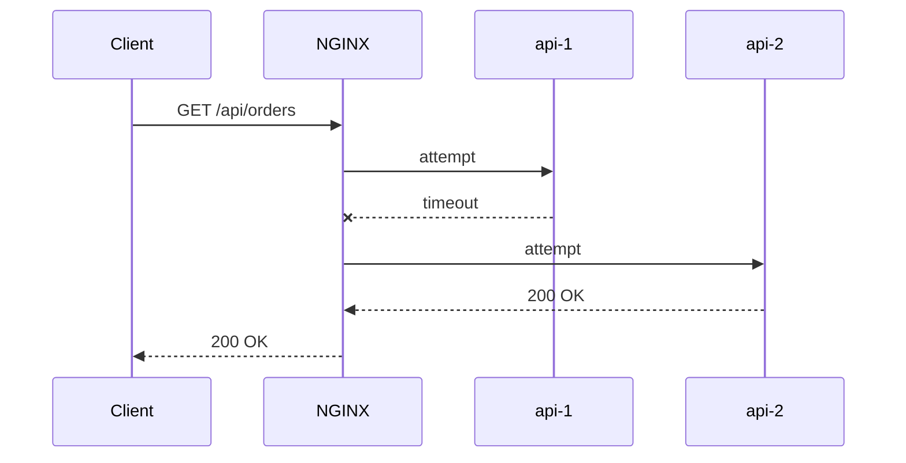

# Part 056 — Load Balancing Observability

> Kalau Anda tidak bisa menjelaskan request gagal karena NGINX, network, upstream selection, retry, timeout, app, atau client disconnect, maka Anda belum punya observability. Anda baru punya log.

Load balancing tanpa observability adalah blind routing. Saat semua sehat, ia terlihat benar. Saat incident, ia berubah menjadi dugaan.

Part ini membangun observability khusus untuk NGINX sebagai load balancer/reverse proxy:

- apa yang perlu dilog;
- bagaimana membaca `$upstream_*`;
- bagaimana membedakan connect latency, app latency, response latency;
- bagaimana mendeteksi retry dari satu access log;
- bagaimana membaca 502/504/499;
- bagaimana menghubungkan request ke upstream instance;
- bagaimana membuat dashboard dan alert yang berguna.

Kita tidak akan mengulang observability umum seperti “apa itu metrics/logs/traces”. Fokusnya NGINX.

---

## 1. Mental model: one request can have many upstream attempts

Saat NGINX melakukan proxy ke upstream, satu client request bisa menghasilkan satu atau lebih attempt ke upstream.



Dari sisi client: status akhir `200`.

Dari sisi upstream: satu attempt timeout, satu sukses.

Dari sisi capacity: backend mendapat dua attempt untuk satu request.

Dari sisi observability: jika log hanya menyimpan `$status`, Anda kehilangan failure attempt pertama.

Itulah kenapa `$upstream_*` wajib ada di log reverse proxy/load balancer.

---

## 2. NGINX access log harus menjadi event observability, bukan catatan Apache-style

Default combined log tidak cukup.

Bad production log:

```nginx
access_log /var/log/nginx/access.log combined;
```

Masalah:

- tidak ada upstream address;
- tidak ada upstream status;
- tidak ada upstream timing;
- tidak ada request id;
- tidak mudah diparse;
- sulit membedakan NGINX generated status vs upstream status;
- sulit melihat retry.

Better:

```nginx
log_format edge_json escape=json
  '{'
    '"ts":"$time_iso8601",'
    '"request_id":"$request_id",'
    '"remote_addr":"$remote_addr",'
    '"realip_remote_addr":"$realip_remote_addr",'
    '"xff":"$http_x_forwarded_for",'
    '"host":"$host",'
    '"scheme":"$scheme",'
    '"method":"$request_method",'
    '"uri":"$uri",'
    '"request_uri":"$request_uri",'
    '"status":$status,'
    '"body_bytes_sent":$body_bytes_sent,'
    '"request_length":$request_length,'
    '"request_time":$request_time,'
    '"upstream_addr":"$upstream_addr",'
    '"upstream_status":"$upstream_status",'
    '"upstream_connect_time":"$upstream_connect_time",'
    '"upstream_header_time":"$upstream_header_time",'
    '"upstream_response_time":"$upstream_response_time",'
    '"upstream_cache_status":"$upstream_cache_status",'
    '"referer":"$http_referer",'
    '"user_agent":"$http_user_agent"'
  '}';

access_log /var/log/nginx/edge.access.json edge_json;
```

In production, tambahkan field domain-specific:

```nginx
map $http_x_tenant_id $tenant_id {
    default $http_x_tenant_id;
    ""      "unknown";
}

log_format edge_json escape=json
  '{'
    '"ts":"$time_iso8601",'
    '"request_id":"$request_id",'
    '"tenant_id":"$tenant_id",'
    '"route":"$route_name",'
    '"upstream":"$upstream_addr",'
    '"status":$status,'
    '"urt":"$upstream_response_time"'
  '}';
```

Route name bisa dibuat via `map` agar dashboard tidak bergantung pada raw URI cardinality.

---

## 3. Understand timing fields

Timing yang paling penting:

| Variable | Makna |
|---|---|
| `$request_time` | total waktu request dari NGINX membaca request sampai response selesai dikirim ke client |
| `$upstream_connect_time` | waktu establish connection ke upstream |
| `$upstream_header_time` | waktu sampai header response pertama dari upstream diterima |
| `$upstream_response_time` | waktu sampai response upstream selesai diterima |

Interpretasi:

```txt
request_time ≈ client upload + NGINX queue/buffer + upstream attempts + response send to client
upstream_connect_time ≈ TCP/TLS connect to backend
upstream_header_time ≈ backend time to first byte/header
upstream_response_time ≈ backend full response receive time
```

### Case 1: connect time tinggi

```json
{
  "status": 504,
  "upstream_connect_time": "1.001",
  "upstream_header_time": "-",
  "upstream_response_time": "-"
}
```

Kemungkinan:

- backend host unreachable;
- SYN backlog penuh;
- security group/firewall;
- upstream process tidak listen;
- network partition;
- DNS mengarah ke IP salah.

### Case 2: header time tinggi

```json
{
  "status": 200,
  "upstream_connect_time": "0.002",
  "upstream_header_time": "2.817",
  "upstream_response_time": "2.820"
}
```

Kemungkinan:

- app lambat memproses;
- DB query lambat;
- thread pool saturated;
- lock contention;
- downstream dependency lambat;
- request menunggu queue di app sebelum menghasilkan response.

### Case 3: response time jauh lebih tinggi dari header time

```json
{
  "status": 200,
  "upstream_header_time": "0.050",
  "upstream_response_time": "15.500"
}
```

Kemungkinan:

- response body besar;
- streaming;
- upstream lambat mengirim body;
- NGINX buffering/temp file;
- network throughput bottleneck;
- backend menghasilkan body bertahap.

### Case 4: request time jauh lebih tinggi dari upstream response time

```json
{
  "status": 200,
  "request_time": 20.000,
  "upstream_response_time": "0.200"
}
```

Kemungkinan:

- client lambat menerima response;
- response besar ke slow client;
- upload client lambat;
- buffering/send timeout issue;
- downstream network problem.

Jangan selalu menyalahkan upstream saat `$request_time` tinggi. Lihat komponen upstream-nya.

---

## 4. Comma-separated upstream values: retry evidence

NGINX menyimpan beberapa nilai upstream dalam format dipisah koma/kolon ketika ada beberapa attempt.

Contoh:

```json
{
  "status": 200,
  "upstream_addr": "10.0.10.11:8080, 10.0.10.12:8080",
  "upstream_status": "504, 200",
  "upstream_response_time": "3.001, 0.120"
}
```

Interpretasi:

```txt
attempt #1 -> 10.0.10.11:8080 -> 504 -> 3.001s
attempt #2 -> 10.0.10.12:8080 -> 200 -> 0.120s
final client status -> 200
```

Ini sangat penting.

Tanpa parsing `$upstream_status`, error upstream bisa tersembunyi di balik final status sukses.

Metric yang harus diturunkan:

```txt
upstream_attempt_count = count(split(upstream_addr, ','))
retry_happened         = upstream_attempt_count > 1
first_upstream_status  = first(upstream_status)
final_upstream_status  = last(upstream_status)
```

Alert yang baik:

```txt
retry rate > baseline for 5 minutes
```

Bukan hanya:

```txt
5xx rate > threshold
```

Karena retry spike sering muncul sebelum user-visible 5xx naik.

---

## 5. Status taxonomy: who generated the failure?

Tabel dasar:

| Status | Bias diagnosis |
|---|---|
| `400` | client/request malformed atau NGINX parsing/security rejection |
| `401/403` | auth/access policy, bisa upstream atau NGINX |
| `404` | routing/static/app mismatch |
| `413` | NGINX admission control body size |
| `429` | NGINX/app rate limit |
| `499` | client closed connection sebelum response selesai |
| `500` | biasanya upstream app, kecuali NGINX internal edge case |
| `502` | bad gateway: upstream connection/protocol/invalid response |
| `503` | unavailable: upstream unavailable, limit, manual shedding, maintenance |
| `504` | gateway timeout ke upstream |

Untuk membedakan NGINX-generated vs upstream-generated, bandingkan:

```txt
$status
$upstream_status
```

Contoh:

```json
{"status":429,"upstream_status":"-"}
```

Kemungkinan besar ditolak di NGINX sebelum upstream.

```json
{"status":429,"upstream_status":"429"}
```

Upstream mengembalikan 429.

```json
{"status":503,"upstream_status":"-"}
```

Bisa NGINX no live upstream, limit, manual `return 503`, atau config edge lain. Lihat error log.

```json
{"status":503,"upstream_status":"503"}
```

Upstream mengembalikan 503.

---

## 6. Error log is the explanation layer

Access log memberi event. Error log memberi penyebab teknis.

Contoh class error log yang perlu dicari:

```txt
connect() failed (111: Connection refused) while connecting to upstream
upstream timed out (110: Connection timed out) while reading response header from upstream
upstream prematurely closed connection while reading response header from upstream
upstream sent too big header while reading response header from upstream
no live upstreams while connecting to upstream
limiting requests, excess: ... by zone ...
client intended to send too large body
client timed out while reading client request headers
```

Operational rule:

> Untuk 502/503/504, access log menunjukkan pola; error log menunjukkan mekanisme.

Jangan menaikkan timeout hanya karena 504. Baca error log dulu: connect timeout? read header timeout? read body timeout? no live upstream? invalid header?

---

## 7. Add upstream identity to application logs

NGINX log sendiri tidak cukup. Backend harus bisa menerima correlation ID.

```nginx
proxy_set_header X-Request-ID $request_id;
proxy_set_header X-Forwarded-For $proxy_add_x_forwarded_for;
proxy_set_header X-Forwarded-Proto $scheme;
proxy_set_header X-Forwarded-Host $host;
```

Jika ada existing trace header:

```nginx
map $http_x_request_id $edge_request_id {
    default $http_x_request_id;
    ""      $request_id;
}

proxy_set_header X-Request-ID $edge_request_id;
```

Untuk W3C Trace Context, jangan asal generate traceparent di NGINX Open Source tanpa scripting/control plane yang benar. Minimal preserve:

```nginx
proxy_set_header traceparent $http_traceparent;
proxy_set_header tracestate  $http_tracestate;
```

Better: trace generation dilakukan di application/service mesh/API gateway layer yang memang trace-aware.

---

## 8. Route labelling with `map`

Raw URI terlalu cardinality tinggi.

Bad metric label:

```txt
/api/users/123/orders/998/items/abc
```

Good route label:

```txt
GET /api/users/:userId/orders/:orderId/items/:itemId
```

NGINX tidak punya router semantic seperti framework application, tapi kita bisa approximate dengan `map`:

```nginx
map "$request_method $uri" $route_name {
    default "unknown";

    ~^GET\ /api/users/[^/]+$                  "GET /api/users/:id";
    ~^GET\ /api/users/[^/]+/orders$           "GET /api/users/:id/orders";
    ~^POST\ /api/orders$                      "POST /api/orders";
    ~^POST\ /api/reports/export$              "POST /api/reports/export";
}
```

Lalu log:

```nginx
'"route":"$route_name",'
```

Route label membantu:

- dashboard latency per route;
- error budget per API group;
- canary analysis;
- overload detection;
- rate limit tuning.

Jangan menjadikan NGINX sebagai sumber kebenaran utama route taxonomy jika application framework sudah punya route metadata. Tapi NGINX route label sangat berguna untuk edge-level diagnosis.

---

## 9. Upstream group observability

NGINX access log menampilkan `$upstream_addr`, tapi production biasanya butuh grouping:

```txt
api_backend
payment_backend
search_backend
report_backend
```

Buat variable upstream target:

```nginx
set $upstream_group "api_backend";
proxy_pass http://api_backend;
```

Atau route-specific:

```nginx
location /api/payments/ {
    set $upstream_group "payment_backend";
    proxy_pass http://payment_backend;
}

location /api/search/ {
    set $upstream_group "search_backend";
    proxy_pass http://search_backend;
}
```

Log:

```nginx
'"upstream_group":"$upstream_group",'
```

Dengan ini Anda bisa membedakan:

- service mana yang lambat;
- upstream group mana yang retry rate-nya naik;
- backend mana yang menghasilkan 502;
- apakah canary group lebih buruk dari stable.

---

## 10. Observing load balancing fairness

Load balancing bukan hanya “tidak error”. Anda juga perlu melihat distribusi traffic.

Metrics/log queries:

```txt
count by upstream_addr over 5m
p95 upstream_response_time by upstream_addr
5xx rate by upstream_addr
retry first-attempt failure by upstream_addr
request bytes/response bytes by upstream_addr
```

Gejala:

### 10.1 Satu backend menerima traffic terlalu banyak

Kemungkinan:

- weight salah;
- sticky/hash imbalance;
- keepalive interaction;
- DNS/service discovery issue;
- one backend lebih sering berhasil sehingga retries berpindah;
- `ip_hash` dengan NAT besar;
- canary routing salah.

### 10.2 Satu backend latency lebih tinggi

Kemungkinan:

- backend node noisy neighbor;
- DB connection pool lokal penuh;
- JVM GC;
- cache local cold;
- disk problem;
- network path buruk.

### 10.3 Satu backend sering 502/504

Kemungkinan:

- deploy broken hanya di node tersebut;
- pod terminating tapi masih menerima traffic;
- readiness gate salah;
- keepalive stale connection;
- port mismatch.

---

## 11. Detect passive health check behavior

Dengan passive health checks, NGINX menandai server unavailable berdasarkan kegagalan actual request.

Yang perlu diamati:

```txt
upstream_addr distribution over time
upstream_status failures by addr
period where addr disappears from traffic
max_fails/fail_timeout config
```

Contoh gejala:

```txt
10.0.10.11 starts returning 504
then disappears for ~10s
then reappears
then fails again
```

Kemungkinan:

```txt
max_fails=1 fail_timeout=10s
```

Awas: jika hanya ada satu server di upstream group, marking unavailable dapat tidak bekerja seperti ekspektasi karena tidak ada alternatif bermakna.

---

## 12. Observing retry amplification

Retry amplification bisa terlihat dari:

```txt
avg upstream_attempt_count > 1
first upstream status failure rate rising
final status still mostly 200
upstream request count > client request count
backend CPU rises faster than edge RPS
```

Contoh log:

```json
{
  "status": 200,
  "upstream_addr": "10.0.10.11:8080, 10.0.10.12:8080",
  "upstream_status": "504, 200",
  "upstream_response_time": "2.000, 0.080"
}
```

Ini user-visible sukses, tapi sistem sedang sakit.

Alert:

```txt
retry_rate = count(upstream_attempt_count > 1) / total_requests
```

Threshold harus baseline-based. Untuk beberapa sistem, retry normal hampir nol. Untuk yang lain, network transient bisa membuat 0.1–1% wajar.

---

## 13. 499 observability

`499` bukan standard HTTP status; ini NGINX-specific untuk client closed request.

Interpretasi jangan malas.

Jika:

```txt
status=499
upstream_response_time high
```

kemungkinan client timeout karena upstream lambat.

Jika:

```txt
status=499
upstream_response_time="-"
request_time small
```

kemungkinan client abort cepat, bot, browser navigation, bad network.

Jika:

```txt
status=499 mostly on large download
```

kemungkinan slow client/download interruption.

Jika:

```txt
499 rises after frontend release
```

kemungkinan client timeout config berubah.

Dashboard 499 harus dipotong by route, user agent, client platform, dan upstream timing.

---

## 14. Cache observability in load balancing path

Jika cache aktif, upstream observability harus memperhitungkan cache status:

```nginx
add_header X-Cache-Status $upstream_cache_status always;
```

Log:

```nginx
'"cache_status":"$upstream_cache_status",'
```

Nilai umum:

```txt
MISS
BYPASS
EXPIRED
STALE
UPDATING
REVALIDATED
HIT
```

Analisis:

| Pattern | Kemungkinan |
|---|---|
| HIT turun drastis | deploy mengubah cache key/header, purge, TTL salah |
| MISS spike | cache cold, key cardinality naik, query string berubah |
| STALE naik | origin error/timeout, stale fallback bekerja |
| BYPASS tinggi | Authorization/Cookie/no-cache policy terlalu luas |
| UPDATING tinggi | origin lambat, banyak request menunggu refresh |

Cache observability harus dikaitkan dengan upstream RPS. Jika HIT naik, upstream RPS harus turun. Jika tidak, cache mungkin tidak benar-benar melindungi origin.

---

## 15. Metrics from logs: derived signals

Dari log JSON, buat derived metrics:

```txt
edge_requests_total{route,status,host}
edge_request_duration_seconds{route}
upstream_connect_duration_seconds{upstream_group,upstream_addr}
upstream_header_duration_seconds{upstream_group,upstream_addr}
upstream_response_duration_seconds{upstream_group,upstream_addr}
upstream_attempts_total{route,upstream_group}
upstream_retry_total{route,upstream_group}
edge_client_abort_total{route}
edge_rate_limited_total{route,zone_if_available}
edge_gateway_errors_total{route,status}
edge_cache_status_total{route,cache_status}
```

Kalau menggunakan Prometheus, log-based metrics bisa dihasilkan dari pipeline seperti Vector/Fluent Bit/Logstash/OpenTelemetry Collector. NGINX Open Source juga punya `stub_status`, tetapi itu tidak memberi per-route/per-upstream detail setara access log.

---

## 16. `stub_status`: useful but limited

`stub_status` memberi basic runtime counters:

```nginx
server {
    listen 127.0.0.1:8080;

    location /nginx_status {
        stub_status;
        allow 127.0.0.1;
        deny all;
    }
}
```

Berguna untuk:

- active connections;
- accepted/handled requests;
- reading/writing/waiting states.

Tidak cukup untuk:

- per upstream latency;
- per route status;
- retry rate;
- cache status;
- tenant-level analysis;
- upstream instance health.

Jadi `stub_status` adalah node-level health signal, bukan observability lengkap.

---

## 17. NGINX Plus boundary: live activity monitoring/API

NGINX Plus memiliki observability/control plane yang lebih kaya, termasuk API/status untuk upstream zones, health checks, dan runtime state. Ini berguna untuk enterprise operations.

Namun prinsip desain tetap sama:

- jangan hanya lihat aggregate;
- tetap log request-level untuk RCA;
- tetap correlate ke application traces;
- tetap pisahkan final status dari upstream attempts;
- tetap alert pada retry/latency sebelum total outage.

Untuk Open Source, banyak hal bisa dicapai dengan log design yang benar plus exporter/pipeline.

---

## 18. Dashboard layout yang efektif

### 18.1 Edge overview

```txt
RPS by status class
p50/p95/p99 request_time
4xx/5xx/499/429 trends
Top hosts/routes by traffic
```

### 18.2 Upstream health

```txt
RPS by upstream_group
RPS by upstream_addr
5xx by upstream_addr
p95 upstream_connect_time by upstream_addr
p95 upstream_header_time by upstream_addr
p95 upstream_response_time by upstream_addr
retry rate by upstream_group
```

### 18.3 Route performance

```txt
p95 request_time by route
p95 upstream_header_time by route
error rate by route
499 by route
429 by route
cache status by route
```

### 18.4 Overload

```txt
rate limited count
connection limited count
upstream max_conns saturation proxy symptoms
timeout count
retry amplification
cache stale served
```

### 18.5 Deployment/canary

```txt
stable vs canary route status
stable vs canary p95/p99
upstream_addr distribution
first-attempt failure rate
rollback marker annotation
```

---

## 19. Alerting principles

Bad alert:

```txt
CPU > 80%
```

Better edge alerts:

```txt
5xx rate by route > SLO burn threshold
504 rate by upstream_group > baseline
retry rate > baseline x 3 for 5m
p99 upstream_header_time > route budget
499 rate spike with upstream_header_time spike
429 rate spike for critical tenant
cache HIT ratio drops below threshold for cache-critical route
no traffic to one expected upstream instance
traffic imbalance > expected weight tolerance
```

Alert harus mengarah ke tindakan.

Contoh actionable alert:

```txt
API gateway: retry rate for payment_backend is 8% for 10m.
First failed upstream mostly 10.0.20.14:8080 with upstream_status=504.
Final user-visible 5xx still <1% due to retry.
Recommended: inspect node 10.0.20.14, consider drain/remove, check app thread pool and DB latency.
```

Ini jauh lebih berguna daripada:

```txt
NGINX upstream errors high
```

---

## 20. RCA workflow: 504 spike

Step-by-step:

```txt
1. Identify affected host/route.
2. Compare $status and $upstream_status.
3. Check upstream_connect_time vs upstream_header_time vs upstream_response_time.
4. Check if retries happened.
5. Break down by upstream_addr.
6. Check error_log exact message.
7. Correlate request_id with application logs/traces.
8. Check deploy/config/network changes.
9. Decide: drain bad backend, reduce retry, shed route, serve stale, rollback.
```

Example:

```json
{
  "route": "GET /api/orders",
  "status": 504,
  "upstream_addr": "10.0.10.11:8080",
  "upstream_status": "504",
  "upstream_connect_time": "0.001",
  "upstream_header_time": "15.000",
  "upstream_response_time": "15.000"
}
```

Interpretation:

```txt
connect OK, backend accepted connection, but response header did not arrive before read timeout.
Likely app/dependency slow, not TCP reachability.
```

Next:

- inspect app logs by request id;
- check DB latency;
- check app thread pool;
- check route-specific expensive query;
- avoid blindly raising `proxy_read_timeout`.

---

## 21. RCA workflow: 502 spike

Example:

```json
{
  "status": 502,
  "upstream_addr": "10.0.10.12:8080",
  "upstream_status": "502",
  "upstream_connect_time": "0.000",
  "upstream_header_time": "-",
  "upstream_response_time": "-"
}
```

Check error log:

```txt
connect() failed (111: Connection refused) while connecting to upstream
```

Interpretation:

```txt
Backend not accepting connections: process down, pod terminating, port mismatch, readiness incorrect.
```

If error log says:

```txt
upstream sent too big header
```

Then problem is not availability. It is response header size. Possible cookie/header explosion.

If error log says:

```txt
upstream prematurely closed connection
```

Then backend accepted connection but closed before valid response. Check app crash, panic, worker recycle, protocol mismatch.

---

## 22. RCA workflow: imbalance

Symptom:

```txt
api-1 receives 70% traffic, api-2 receives 30%, weights are equal
```

Check:

```txt
[ ] algorithm: round robin, least_conn, ip_hash, hash?
[ ] sticky/session affinity enabled?
[ ] keepalive connection behavior?
[ ] does api-2 fail first attempts?
[ ] does api-1 respond faster under least_conn?
[ ] are both servers in same upstream group and config version?
[ ] are there multiple NGINX instances with different config?
[ ] are clients behind NAT with ip_hash?
[ ] are canary maps overriding route?
```

Observability needed:

```txt
request count by upstream_addr
latency by upstream_addr
failure by upstream_addr
attempt position by upstream_addr
```

Attempt position matters. A server might receive many first attempts but fail, while another receives successful retries.

---

## 23. Sampling and log volume

High-traffic NGINX logs can be enormous. Jangan langsung mematikan log penting. Gunakan strategi:

### 23.1 Always log errors and slow requests

NGINX `access_log` punya conditional logging dengan `if=`.

```nginx
map $status $log_error {
    default 0;
    ~^[45] 1;
}

access_log /var/log/nginx/error-access.json edge_json if=$log_error;
```

### 23.2 Separate full sampling

```nginx
split_clients "$request_id" $log_sample {
    1%      1;
    *       0;
}

access_log /var/log/nginx/sample-access.json edge_json if=$log_sample;
```

### 23.3 Keep aggregate metrics

If you sample logs, make sure aggregate metrics still come from unsampled counters, exporter, or log pipeline before sampling.

Rule:

> Sampling boleh untuk detail investigation, tapi SLO/error counters tidak boleh hilang.

---

## 24. Security and privacy in observability

Do not log secrets.

High-risk fields:

- `Authorization`;
- cookies;
- query string with token;
- email/phone/national ID;
- session IDs;
- signed URLs;
- payment data;
- PII-bearing request body.

Prefer:

```nginx
"uri":"$uri"
```

instead of always logging:

```nginx
"request_uri":"$request_uri"
```

because `$request_uri` includes query string.

If query string is needed for debugging, consider:

- sampled logs only;
- redaction in log pipeline;
- explicit allowlist parameters;
- secure retention policy.

Observability that leaks credentials is an incident generator.

---

## 25. Production log config skeleton

```nginx
map "$request_method $uri" $route_name {
    default "unknown";
    ~^GET\ /api/orders$              "GET /api/orders";
    ~^GET\ /api/orders/[^/]+$        "GET /api/orders/:id";
    ~^POST\ /api/orders$             "POST /api/orders";
    ~^POST\ /api/reports/export$     "POST /api/reports/export";
}

map $http_x_request_id $edge_request_id {
    default $http_x_request_id;
    ""      $request_id;
}

log_format edge_json escape=json
  '{'
    '"ts":"$time_iso8601",'
    '"request_id":"$edge_request_id",'
    '"remote_addr":"$remote_addr",'
    '"host":"$host",'
    '"method":"$request_method",'
    '"uri":"$uri",'
    '"route":"$route_name",'
    '"status":$status,'
    '"request_time":$request_time,'
    '"request_length":$request_length,'
    '"body_bytes_sent":$body_bytes_sent,'
    '"upstream_group":"$upstream_group",'
    '"upstream_addr":"$upstream_addr",'
    '"upstream_status":"$upstream_status",'
    '"upstream_connect_time":"$upstream_connect_time",'
    '"upstream_header_time":"$upstream_header_time",'
    '"upstream_response_time":"$upstream_response_time",'
    '"upstream_cache_status":"$upstream_cache_status",'
    '"user_agent":"$http_user_agent"'
  '}';

server {
    listen 443 ssl http2;
    server_name api.example.com;

    access_log /var/log/nginx/api.access.json edge_json;
    error_log /var/log/nginx/api.error.log warn;

    location /api/orders {
        set $upstream_group "order_backend";

        proxy_set_header X-Request-ID $edge_request_id;
        proxy_pass http://order_backend;
    }
}
```

---

## 26. Lab: observe retry and upstream latency

Backend A: always slow/failing.

```js
// bad-backend.js
const http = require('http');
http.createServer((req, res) => {
  setTimeout(() => {
    res.writeHead(504, { 'content-type': 'application/json' });
    res.end(JSON.stringify({ backend: 'bad', ok: false }));
  }, 1000);
}).listen(8081);
```

Backend B: healthy.

```js
// good-backend.js
const http = require('http');
http.createServer((req, res) => {
  res.writeHead(200, { 'content-type': 'application/json' });
  res.end(JSON.stringify({ backend: 'good', ok: true }));
}).listen(8082);
```

NGINX:

```nginx
upstream demo_backend {
    server 127.0.0.1:8081 max_fails=1 fail_timeout=5s;
    server 127.0.0.1:8082 max_fails=1 fail_timeout=5s;
}

server {
    listen 8080;
    access_log /tmp/nginx-demo-access.json edge_json;
    error_log  /tmp/nginx-demo-error.log info;

    location / {
        proxy_next_upstream error timeout http_504;
        proxy_next_upstream_tries 2;
        proxy_read_timeout 500ms;

        proxy_pass http://demo_backend;
    }
}
```

Request:

```bash
curl -s http://localhost:8080/
```

Inspect log:

```bash
tail -f /tmp/nginx-demo-access.json | jq .
```

Cari:

```txt
upstream_addr contains two addresses
upstream_status contains 504, 200
final status may be 200
```

Itu adalah bukti retry yang tersembunyi dari client.

---

## 27. Review checklist

Sebelum menyebut load balancer “observable”, pastikan:

```txt
[ ] Log berbentuk structured JSON atau mudah diparse.
[ ] Ada request_id/correlation id.
[ ] Ada route label rendah-cardinality.
[ ] Ada upstream group.
[ ] Ada upstream address.
[ ] Ada upstream status.
[ ] Ada upstream connect/header/response time.
[ ] Ada request_time.
[ ] Ada cache status bila cache dipakai.
[ ] Error log dikumpulkan bersama access log.
[ ] 499, 502, 503, 504 punya dashboard terpisah.
[ ] Retry rate bisa dihitung.
[ ] Traffic imbalance bisa terlihat per upstream instance.
[ ] Log tidak membocorkan secret/PII.
[ ] Sampling tidak merusak SLO/error counters.
```

---

## 28. Inti part ini

Load balancing observability bukan sekadar melihat final status.

Yang harus terlihat:

- request masuk ke route mana;
- NGINX memilih upstream mana;
- connect/header/response latency berapa;
- attempt pertama gagal atau tidak;
- retry terjadi atau tidak;
- final status berbeda dari upstream attempt atau tidak;
- client abort atau gateway timeout;
- cache melindungi origin atau tidak;
- traffic dibagi sesuai ekspektasi atau tidak.

Production rule:

> Always log enough to reconstruct the edge decision path of a request.

Jika Anda bisa merekonstruksi path itu dari log, incident berubah dari debat menjadi investigasi.

---

## References

- NGINX `ngx_http_log_module`: https://nginx.org/en/docs/http/ngx_http_log_module.html
- NGINX `ngx_http_upstream_module`: https://nginx.org/en/docs/http/ngx_http_upstream_module.html
- NGINX Admin Guide — Configuring Logging: https://docs.nginx.com/nginx/admin-guide/monitoring/logging/
- NGINX `ngx_http_proxy_module`: https://nginx.org/en/docs/http/ngx_http_proxy_module.html
- NGINX `ngx_http_stub_status_module`: https://nginx.org/en/docs/http/ngx_http_stub_status_module.html
