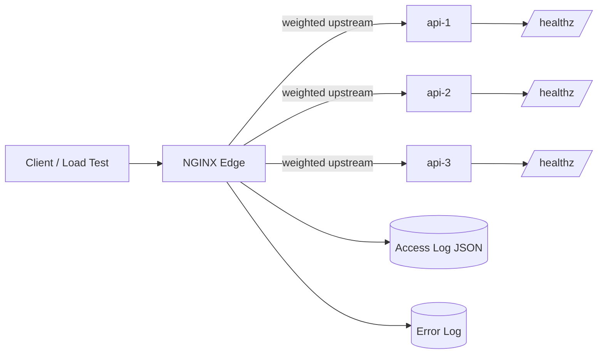
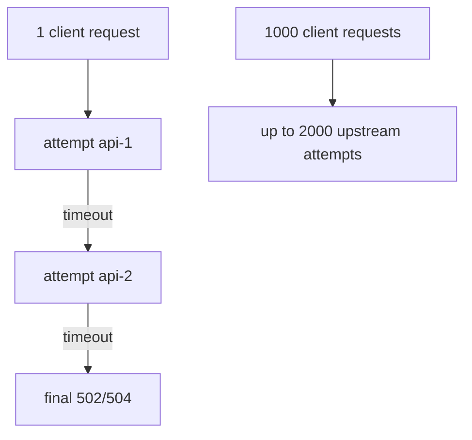
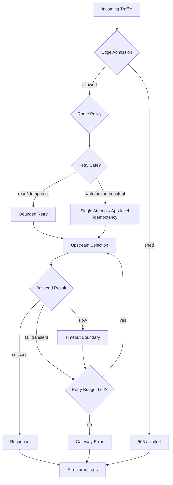

# Part 057 — Load Balancing Production Lab

> Load balancer yang baik bukan yang selalu mengirim traffic secara merata. Load balancer yang baik adalah yang tetap bisa dijelaskan saat backend lambat, mati sebagian, overload, rollback, dan client mulai retry secara agresif.

Part ini menutup Phase 4 dengan lab production-grade.

Kita akan membangun satu edge NGINX yang melakukan load balancing ke beberapa backend instance, lalu menguji failure mode secara sengaja:

- backend mati;
- backend lambat;
- backend overload;
- satu instance baru masuk cluster;
- retry menghasilkan duplicate attempt;
- upstream keepalive salah tuning;
- rate limit/load shedding aktif;
- log harus cukup untuk RCA.

Lab ini bukan “hello world”. Ini adalah template berpikir untuk production traffic tier.

---

## 1. Target akhir lab

Kita ingin punya setup seperti ini:



Core capabilities:

1. NGINX memilih upstream dari group `api_backend`.
2. Upstream punya timeout, keepalive, passive failure, dan retry budget.
3. Request non-idempotent tidak diretry sembarangan.
4. Overload dikontrol sebelum backend collapse.
5. Semua request mencatat upstream address, status, connect time, header time, response time, cache status placeholder, request id, route label, dan retry trace.
6. Reload bisa diuji sebelum diterapkan.
7. Failure injection punya expected result yang jelas.

---

## 2. Lab invariant

Sebelum menulis config, tetapkan invariant.

```txt
Invariant 1: edge harus dapat menjelaskan setiap 5xx.
Invariant 2: retry hanya boleh terjadi jika aman secara idempotency.
Invariant 3: backend lambat tidak boleh membuat semua worker terikat terlalu lama.
Invariant 4: backend mati tidak boleh membuat semua request menunggu timeout penuh.
Invariant 5: overload harus shed lebih awal daripada collapse di app/database.
Invariant 6: perubahan upstream harus bisa di-rollback dengan satu deploy config.
Invariant 7: log harus cukup untuk membedakan client abort, upstream failure, dan edge failure.
```

Tanpa invariant, lab hanya menjadi kumpulan directive.

---

## 3. Struktur direktori

Gunakan struktur eksplisit.

```bash
sudo mkdir -p /etc/nginx/lab/conf.d
sudo mkdir -p /etc/nginx/lab/snippets
sudo mkdir -p /var/log/nginx/lab
sudo mkdir -p /var/cache/nginx/lab
```

Dalam production sungguhan, Anda bisa memakai `/etc/nginx/nginx.conf` normal. Untuk lab, kita gunakan file terpisah agar aman.

```txt
/etc/nginx/lab/
├── nginx.conf
├── conf.d/
│   └── api-lb.conf
└── snippets/
    ├── proxy-headers.conf
    ├── proxy-timeouts.conf
    └── security-baseline.conf
```

---

## 4. Backend dummy yang bisa gagal secara terkontrol

Anda bisa menggunakan app apapun. Untuk lab ini, pakai Python kecil agar failure mudah disimulasikan.

Buat tiga backend di port berbeda.

```bash
mkdir -p /tmp/nginx-lb-lab
cat > /tmp/nginx-lb-lab/backend.py <<'PY'
import os
import time
from http.server import BaseHTTPRequestHandler, HTTPServer

INSTANCE = os.environ.get("INSTANCE", "api-x")
PORT = int(os.environ.get("PORT", "9001"))
DELAY = float(os.environ.get("DELAY", "0"))
FAIL = os.environ.get("FAIL", "0") == "1"

class Handler(BaseHTTPRequestHandler):
    def do_GET(self):
        if self.path.startswith("/healthz"):
            if FAIL:
                self.send_response(500)
                self.end_headers()
                self.wfile.write(f"{INSTANCE} unhealthy\n".encode())
                return
            self.send_response(200)
            self.end_headers()
            self.wfile.write(f"{INSTANCE} ok\n".encode())
            return

        if self.path.startswith("/slow"):
            time.sleep(DELAY if DELAY > 0 else 3)

        if self.path.startswith("/fail") or FAIL:
            self.send_response(500)
            self.end_headers()
            self.wfile.write(f"{INSTANCE} forced failure\n".encode())
            return

        self.send_response(200)
        self.send_header("Content-Type", "application/json")
        self.send_header("X-Backend-Instance", INSTANCE)
        self.end_headers()
        self.wfile.write((
            '{"instance":"%s","path":"%s"}\n' % (INSTANCE, self.path)
        ).encode())

    def do_POST(self):
        length = int(self.headers.get("Content-Length", "0"))
        body = self.rfile.read(length) if length else b""
        if self.path.startswith("/slow"):
            time.sleep(DELAY if DELAY > 0 else 3)
        if self.path.startswith("/fail") or FAIL:
            self.send_response(500)
            self.end_headers()
            self.wfile.write(f"{INSTANCE} forced failure after body={len(body)}\n".encode())
            return
        self.send_response(201)
        self.send_header("Content-Type", "application/json")
        self.send_header("X-Backend-Instance", INSTANCE)
        self.end_headers()
        self.wfile.write((
            '{"instance":"%s","bodyBytes":%d}\n' % (INSTANCE, len(body))
        ).encode())

    def log_message(self, fmt, *args):
        print(f"{INSTANCE} - {self.address_string()} - {fmt % args}")

HTTPServer(("127.0.0.1", PORT), Handler).serve_forever()
PY
```

Jalankan tiga instance:

```bash
INSTANCE=api-1 PORT=9001 python3 /tmp/nginx-lb-lab/backend.py &
INSTANCE=api-2 PORT=9002 python3 /tmp/nginx-lb-lab/backend.py &
INSTANCE=api-3 PORT=9003 python3 /tmp/nginx-lb-lab/backend.py &
```

Smoke test backend langsung:

```bash
curl -s http://127.0.0.1:9001/
curl -s http://127.0.0.1:9002/
curl -s http://127.0.0.1:9003/
```

Expected:

```json
{"instance":"api-1","path":"/"}
{"instance":"api-2","path":"/"}
{"instance":"api-3","path":"/"}
```

---

## 5. Main config lab

Buat `/etc/nginx/lab/nginx.conf`.

```nginx
worker_processes auto;

events {
    worker_connections 4096;
    multi_accept off;
}

http {
    include       /etc/nginx/mime.types;
    default_type  application/octet-stream;

    server_tokens off;

    log_format edge_json escape=json
      '{'
        '"ts":"$time_iso8601",'
        '"request_id":"$request_id",'
        '"remote_addr":"$remote_addr",'
        '"realip_remote_addr":"$realip_remote_addr",'
        '"host":"$host",'
        '"method":"$request_method",'
        '"uri":"$request_uri",'
        '"status":$status,'
        '"bytes_sent":$bytes_sent,'
        '"request_time":$request_time,'
        '"route":"$route_name",'
        '"upstream_addr":"$upstream_addr",'
        '"upstream_status":"$upstream_status",'
        '"upstream_connect_time":"$upstream_connect_time",'
        '"upstream_header_time":"$upstream_header_time",'
        '"upstream_response_time":"$upstream_response_time",'
        '"upstream_cache_status":"$upstream_cache_status",'
        '"http_user_agent":"$http_user_agent"'
      '}';

    access_log /var/log/nginx/lab/access.json edge_json;
    error_log  /var/log/nginx/lab/error.log warn;

    # Request classification.
    map $request_method $is_idempotent_method {
        default 0;
        GET     1;
        HEAD    1;
        OPTIONS 1;
    }

    map $uri $route_name {
        default       "api.default";
        ~^/healthz    "edge.healthz";
        ~^/slow       "api.slow";
        ~^/fail       "api.fail";
        ~^/write      "api.write";
    }

    include /etc/nginx/lab/conf.d/*.conf;
}
```

Catatan desain:

- `escape=json` mengurangi risiko log rusak karena quote/newline.
- `$upstream_*` menyimpan attempt trace.
- `$route_name` membuat dashboard tidak bergantung pada raw URI.
- `$request_id` bisa diteruskan ke upstream.

---

## 6. Proxy header contract

Buat `/etc/nginx/lab/snippets/proxy-headers.conf`.

```nginx
proxy_set_header Host              $host;
proxy_set_header X-Request-ID      $request_id;
proxy_set_header X-Real-IP         $remote_addr;
proxy_set_header X-Forwarded-For   $proxy_add_x_forwarded_for;
proxy_set_header X-Forwarded-Host  $host;
proxy_set_header X-Forwarded-Proto $scheme;

# Required for upstream keepalive reuse.
proxy_http_version 1.1;
proxy_set_header Connection "";
```

Invariant:

```txt
NGINX owns edge identity headers.
App must not infer client identity from arbitrary headers unless edge trust boundary is explicit.
```

---

## 7. Timeout contract

Buat `/etc/nginx/lab/snippets/proxy-timeouts.conf`.

```nginx
proxy_connect_timeout 1s;
proxy_send_timeout    10s;
proxy_read_timeout    10s;
send_timeout          10s;

client_header_timeout 10s;
client_body_timeout   30s;

# Avoid unlimited large upload in this lab.
client_max_body_size 10m;
```

Interpretasi:

- connect timeout pendek karena backend local/private seharusnya cepat menerima koneksi;
- read timeout tidak terlalu besar agar backend lambat tidak mengikat request terlalu lama;
- body timeout lebih longgar untuk upload kecil/normal;
- semua angka harus disesuaikan workload, bukan dicopy buta.

---

## 8. Security baseline ringan

Buat `/etc/nginx/lab/snippets/security-baseline.conf`.

```nginx
add_header X-Content-Type-Options nosniff always;
add_header X-Frame-Options DENY always;
add_header Referrer-Policy no-referrer-when-downgrade always;
```

Ini bukan WAF. Ini hygiene minimal.

---

## 9. Upstream group production-ish

Buat `/etc/nginx/lab/conf.d/api-lb.conf`.

```nginx
upstream api_backend {
    zone api_backend 64k;

    server 127.0.0.1:9001 weight=2 max_fails=2 fail_timeout=10s max_conns=200;
    server 127.0.0.1:9002 weight=1 max_fails=2 fail_timeout=10s max_conns=200;
    server 127.0.0.1:9003 weight=1 max_fails=2 fail_timeout=10s max_conns=200;

    keepalive 64;
}

limit_req_zone $binary_remote_addr zone=per_ip_api:10m rate=20r/s;
limit_conn_zone $binary_remote_addr zone=per_ip_conn:10m;

server {
    listen 8080 default_server;
    server_name _;

    include /etc/nginx/lab/snippets/security-baseline.conf;

    location = /nginx-healthz {
        access_log off;
        return 200 "nginx ok\n";
    }

    location / {
        limit_req zone=per_ip_api burst=40 nodelay;
        limit_conn per_ip_conn 40;

        include /etc/nginx/lab/snippets/proxy-headers.conf;
        include /etc/nginx/lab/snippets/proxy-timeouts.conf;

        proxy_pass http://api_backend;

        # Retry only failure classes that are safe for idempotent routes.
        # For this lab, keep the global default conservative.
        proxy_next_upstream error timeout http_502 http_503 http_504;
        proxy_next_upstream_tries 2;
        proxy_next_upstream_timeout 3s;

        proxy_intercept_errors on;
        error_page 502 503 504 = @gateway_error;
    }

    location @gateway_error {
        internal;
        default_type application/json;
        add_header X-Request-ID $request_id always;
        return 502 '{"error":"bad_gateway","requestId":"$request_id"}\n';
    }
}
```

### 9.1 Kenapa `zone` dipasang?

`zone api_backend 64k` membuat state upstream dibagi antar worker.

Tanpa shared upstream zone, worker bisa punya pandangan berbeda soal state tertentu. Untuk lab kecil mungkin tidak terasa. Untuk production, state sharing membantu consistency observability dan limiting tertentu.

### 9.2 Kenapa `keepalive` dipasang?

Tanpa upstream keepalive, NGINX dapat membuat koneksi baru ke backend untuk setiap request. Pada traffic besar, ini membakar:

- TCP handshake;
- ephemeral port;
- CPU;
- accept queue backend;
- latency tail.

`keepalive 64` bukan berarti global max connection 64. Itu idle keepalive cache per worker untuk upstream group. Capacity tetap harus dihitung dari worker count, backend count, dan workload.

### 9.3 Kenapa retry dibatasi?

`proxy_next_upstream_tries 2` artinya maksimal dua attempt. Tanpa batas, retry bisa memperbesar beban saat backend sedang sakit.



Retry adalah amplifier. Gunakan seperti pisau bedah.

---

## 10. Validate dan run NGINX lab

Test config:

```bash
sudo nginx -t -c /etc/nginx/lab/nginx.conf
```

Run dengan config lab:

```bash
sudo nginx -c /etc/nginx/lab/nginx.conf
```

Reload:

```bash
sudo nginx -t -c /etc/nginx/lab/nginx.conf && sudo nginx -s reload
```

Stop:

```bash
sudo nginx -s quit
```

Smoke test edge:

```bash
curl -i http://127.0.0.1:8080/nginx-healthz
curl -i http://127.0.0.1:8080/
```

Expected response header backend:

```txt
X-Backend-Instance: api-1/api-2/api-3
```

---

## 11. Test distribusi traffic

Jalankan beberapa request:

```bash
for i in $(seq 1 20); do
  curl -s -D - http://127.0.0.1:8080/ -o /dev/null | grep -i x-backend-instance
 done
```

Dengan weight `2:1:1`, api-1 kira-kira mendapat porsi lebih besar. Jangan menuntut presisi pada sample kecil.

Gunakan log untuk melihat upstream address:

```bash
tail -n 20 /var/log/nginx/lab/access.json | jq -r '.upstream_addr'
```

Expected:

```txt
127.0.0.1:9001
127.0.0.1:9002
127.0.0.1:9003
...
```

---

## 12. Failure injection 1: backend mati total

Matikan salah satu backend.

```bash
pkill -f 'PORT=9002'
```

Kirim traffic:

```bash
for i in $(seq 1 20); do curl -s -o /dev/null -w '%{http_code}\n' http://127.0.0.1:8080/; done
```

Lihat log:

```bash
tail -n 20 /var/log/nginx/lab/access.json | jq '{status, upstream_addr, upstream_status, upstream_connect_time, upstream_response_time}'
```

Expected:

- sebagian request mungkin mencoba `127.0.0.1:9002` lalu retry ke instance lain;
- `$upstream_addr` bisa berisi beberapa address dipisah koma;
- `$upstream_status` bisa menunjukkan attempt gagal lalu status akhir sukses/gagal;
- setelah passive failure threshold tercapai, NGINX menghindari server itu selama `fail_timeout`.

RCA pattern:

```txt
status=200
upstream_addr="127.0.0.1:9002, 127.0.0.1:9001"
upstream_status="502, 200"
```

Makna:

```txt
Client sukses, tetapi upstream attempt pertama gagal.
Sistem sedang degraded walaupun status akhir client terlihat sehat.
```

---

## 13. Failure injection 2: backend lambat

Jalankan ulang api-2 sebagai slow backend:

```bash
INSTANCE=api-2 PORT=9002 DELAY=5 python3 /tmp/nginx-lb-lab/backend.py &
```

Test slow endpoint:

```bash
curl -s -w 'total=%{time_total}\n' http://127.0.0.1:8080/slow
```

Jika `proxy_read_timeout 10s`, request 5 detik masih bisa sukses. Sekarang naikkan delay:

```bash
pkill -f 'PORT=9002'
INSTANCE=api-2 PORT=9002 DELAY=15 python3 /tmp/nginx-lb-lab/backend.py &
```

Kirim request:

```bash
curl -i http://127.0.0.1:8080/slow
```

Expected:

- attempt ke api-2 timeout;
- NGINX mencoba upstream lain jika retry condition cocok dan retry budget masih ada;
- jika semua attempt gagal, client menerima gateway error JSON;
- log harus menunjukkan upstream response time sekitar timeout boundary.

Poin production:

```txt
Backend lambat lebih berbahaya daripada backend mati.
Backend mati cepat fail.
Backend lambat mengikat connection, worker capacity, memory buffer, dan client patience.
```

---

## 14. Failure injection 3: retry dan non-idempotent request

Kirim POST ke endpoint gagal:

```bash
curl -i -X POST http://127.0.0.1:8080/fail -d '{"amount":100}'
```

Periksa log:

```bash
tail -n 5 /var/log/nginx/lab/access.json | jq '{method, status, upstream_addr, upstream_status}'
```

Expected dengan config konservatif:

- NGINX tidak boleh sembarangan menggandakan write setelah body dikirim;
- jika Anda mengaktifkan retry non-idempotent, Anda harus punya idempotency key di application contract;
- untuk payment/order/write API, retry lebih aman dilakukan oleh client/app layer yang punya semantic idempotency.

Production rule:

```txt
GET boleh diretry dengan budget.
POST hanya boleh diretry jika operation punya idempotency key dan upstream failure point dipahami.
```

---

## 15. Failure injection 4: overload dan load shedding

Gunakan load generator sederhana.

```bash
# install wrk bila tersedia, atau gunakan ab/k6/vegeta sesuai environment
wrk -t4 -c200 -d30s http://127.0.0.1:8080/
```

Sambil itu lihat status code:

```bash
tail -f /var/log/nginx/lab/access.json | jq -r '.status'
```

Jika limit aktif, Anda bisa melihat `503` dari `limit_req`/`limit_conn` saat traffic melebihi boundary.

Ini bukan bug.

Ini lebih baik daripada:

- semua upstream saturate;
- database connection habis;
- latency p99 naik 60 detik;
- retry storm;
- autoscaler salah membaca sinyal.

Load shedding harus didesain sebagai policy:

```txt
Public API normal traffic    -> limit per IP/token.
Internal trusted traffic     -> limit lebih longgar.
Health check                 -> jangan kena rate limit.
Admin operation              -> limit ketat, timeout pendek.
Long polling/SSE             -> connection limit khusus.
```

---

## 16. Failure injection 5: backend baru cold start

Misalnya Anda ingin mengganti api-3 dengan versi baru.

Bad move:

```nginx
server 127.0.0.1:9003 weight=10;
```

Begitu reload, instance cold bisa langsung menerima porsi besar.

Open Source-friendly rollout:

```nginx
# step 1
server 127.0.0.1:9003 weight=1;

# step 2, setelah metrics sehat
server 127.0.0.1:9003 weight=2;

# step 3
server 127.0.0.1:9003 weight=5;
```

NGINX Plus punya primitive slow-start. Tetapi di Open Source, Anda biasanya melakukan ramp lewat generated config + reload + metrics gate.

Invariant rollout:

```txt
Traffic ramp harus mengikuti readiness + warmup + metrics, bukan hanya process started.
```

---

## 17. Observability checklist

Untuk setiap request reverse proxy/load balancing, log minimal harus bisa menjawab:

| Pertanyaan | Field |
|---|---|
| Request mana? | `$request_id` |
| Route mana? | `$route_name`, `$uri` |
| Client siapa? | `$remote_addr`, real IP bila trusted |
| Status akhir client? | `$status` |
| Upstream mana? | `$upstream_addr` |
| Upstream status apa? | `$upstream_status` |
| Connect lambat? | `$upstream_connect_time` |
| App/header lambat? | `$upstream_header_time` |
| Full upstream response lambat? | `$upstream_response_time` |
| Total edge time? | `$request_time` |
| Retry terjadi? | multiple value di `$upstream_addr`/`$upstream_status` |

Contoh query cepat:

```bash
jq 'select(.status >= 500) | {ts, request_id, status, route, upstream_addr, upstream_status, request_time, upstream_response_time}' \
  /var/log/nginx/lab/access.json
```

Deteksi retry:

```bash
jq 'select(.upstream_addr | contains(",")) | {request_id, status, upstream_addr, upstream_status}' \
  /var/log/nginx/lab/access.json
```

Top upstream lambat:

```bash
jq -r '[.upstream_addr, .upstream_response_time] | @tsv' /var/log/nginx/lab/access.json | sort | tail
```

---

## 18. Dashboard minimal

Dashboard production untuk load balancer harus dipisah berdasarkan route/upstream.

### 18.1 Edge-level

- request rate;
- status code distribution;
- p50/p95/p99 `$request_time`;
- 499 rate;
- 4xx/5xx ratio;
- rate limited request count;
- connection count jika tersedia dari metrics exporter/status.

### 18.2 Upstream-level

- attempt rate per `$upstream_addr`;
- upstream status distribution;
- connect time p95/p99;
- header time p95/p99;
- response time p95/p99;
- retry count;
- passive failure event from error log;
- imbalance ratio.

### 18.3 Route-level

- route QPS;
- route error rate;
- route latency;
- route retry rate;
- route 499 rate;
- route load shedding rate.

Why route-level matters:

```txt
/api/search can be slow while /api/payments is healthy.
If you only aggregate all upstream traffic, you hide the incident.
```

---

## 19. Error log patterns to recognize

### 19.1 Connection refused

```txt
connect() failed (111: Connection refused) while connecting to upstream
```

Meaning:

```txt
Backend port closed, process down, listener not ready, or local firewall/network reject.
```

### 19.2 Upstream timed out

```txt
upstream timed out ... while reading response header from upstream
```

Meaning:

```txt
NGINX connected, sent request, but upstream did not produce response header before proxy_read_timeout.
```

### 19.3 No live upstreams

```txt
no live upstreams while connecting to upstream
```

Meaning:

```txt
All upstream candidates are unavailable from NGINX point of view.
Could be real outage, bad passive health threshold, DNS issue, or all max_conns saturated.
```

### 19.4 Client prematurely closed connection

```txt
client prematurely closed connection
```

Meaning:

```txt
Client gave up. The root cause may still be upstream latency.
```

---

## 20. Production config refinements

### 20.1 Separate read and write upstream policies

Bad:

```nginx
location /api/ {
    proxy_next_upstream error timeout http_500 http_502 http_503 http_504;
    proxy_pass http://api_backend;
}
```

Better:

```nginx
location /api/read/ {
    proxy_next_upstream error timeout http_502 http_503 http_504;
    proxy_next_upstream_tries 2;
    proxy_pass http://api_backend;
}

location /api/write/ {
    proxy_next_upstream error timeout;
    proxy_next_upstream_tries 1;
    proxy_pass http://api_backend;
}
```

Even better:

```txt
Write retry belongs to application protocol with idempotency key.
Edge retry is only allowed when failure happened before request was sent and operation is safe.
```

### 20.2 Separate long-lived routes

```nginx
location /events/ {
    proxy_buffering off;
    proxy_read_timeout 1h;
    limit_conn per_ip_conn 5;
    proxy_pass http://api_backend;
}
```

Do not let SSE/WebSocket/long-polling share the same timeout and connection policy as normal JSON API.

### 20.3 Separate health checks from public traffic

```nginx
location = /nginx-healthz {
    access_log off;
    return 200 "ok\n";
}
```

This only checks NGINX process/config path. It does not prove upstream app is healthy.

For full synthetic check, use a separate controlled endpoint:

```nginx
location = /synthetic/api-healthz {
    allow 10.0.0.0/8;
    deny all;
    proxy_pass http://api_backend/healthz;
}
```

---

## 21. Safe reload and rollback workflow

Reload workflow:

```bash
sudo nginx -t -c /etc/nginx/lab/nginx.conf
sudo nginx -T -c /etc/nginx/lab/nginx.conf > /tmp/nginx-rendered.$(date +%s).conf
sudo nginx -s reload
```

Rollback workflow:

```bash
sudo cp /etc/nginx/lab/conf.d/api-lb.conf.previous /etc/nginx/lab/conf.d/api-lb.conf
sudo nginx -t -c /etc/nginx/lab/nginx.conf && sudo nginx -s reload
```

Never reload config you cannot diff.

Production rule:

```txt
Every config deploy must include:
- syntax validation;
- rendered config artifact;
- smoke test;
- rollback artifact;
- post-deploy metrics gate.
```

---

## 22. Failure drill matrix

| Drill | Action | Expected system behavior | Signal |
|---|---|---|---|
| Kill api-2 | stop port 9002 | retry to other backend, then passive avoid | `$upstream_addr` multi-value |
| Slow api-2 | delay > timeout | timeout then retry/fail fast | `$upstream_response_time` near timeout |
| Overload client | high concurrency | shed at edge | 503/limit logs |
| Bad config | syntax error | reload rejected | `nginx -t` failure |
| Remove all upstreams | stop all apps | controlled 502 JSON | error log + 502 rate |
| Backend cold start | add new server | gradual ramp | traffic share changes slowly |
| POST failure | `/fail` POST | no unsafe duplicate write | attempt count checked |

---

## 23. Design review checklist

Sebelum menyebut load balancing setup “production-ready”, jawab ini:

```txt
[ ] Apakah upstream group punya explicit timeout?
[ ] Apakah retry budget dibatasi?
[ ] Apakah write route tidak diretry sembarangan?
[ ] Apakah keepalive dikonfigurasi dan backend support HTTP/1.1 reuse?
[ ] Apakah max_conns dihitung dari backend capacity?
[ ] Apakah passive health threshold tidak terlalu agresif?
[ ] Apakah single-server upstream trap dipahami?
[ ] Apakah logs menyimpan upstream attempt chain?
[ ] Apakah 499, 502, 503, 504 punya playbook berbeda?
[ ] Apakah overload dished di edge sebelum backend/database collapse?
[ ] Apakah rollout backend baru punya warmup/ramp strategy?
[ ] Apakah reload/rollback diuji?
```

---

## 24. Common anti-patterns

### 24.1 “Load balancer akan menyelesaikan overload”

Tidak.

Load balancer mendistribusikan traffic. Jika total arrival rate melebihi total service capacity, sistem tetap collapse kecuali Anda:

- shed load;
- degrade response;
- cache;
- queue secara sadar;
- scale capacity;
- menurunkan client retry.

### 24.2 “Semua 5xx sama”

Tidak.

```txt
500 -> app generated error.
502 -> NGINX gagal mendapat valid response dari upstream.
503 -> upstream unavailable, rate limit, maintenance, atau deliberate shed.
504 -> upstream timeout.
499 -> client disconnect sebelum response selesai.
```

### 24.3 “Retry selalu meningkatkan availability”

Tidak.

Retry dapat meningkatkan success rate saat failure transient kecil. Retry dapat menghancurkan sistem saat overload.

### 24.4 “Weight adalah capacity limit”

Tidak.

Weight adalah proporsi selection. Ia tidak menghentikan backend menerima request berlebih. Untuk boundary gunakan `max_conns`, rate limit, timeout, dan capacity management.

### 24.5 “Health endpoint 200 berarti service sehat”

Tidak selalu.

Health endpoint bisa shallow. Production readiness harus mempertimbangkan dependency penting, warmup state, queue depth, thread pool, connection pool, dan degraded mode.

---

## 25. Mental model akhir Phase 4



Load balancing production bukan tentang satu directive `upstream`.

Ia adalah gabungan:

- selection algorithm;
- backend capacity;
- timeout;
- retry;
- health semantics;
- connection reuse;
- overload control;
- deploy discipline;
- observability;
- incident playbook.

---

## 26. References

- NGINX official docs — Using nginx as HTTP load balancer: `https://nginx.org/en/docs/http/load_balancing.html`
- NGINX official docs — `ngx_http_upstream_module`: `https://nginx.org/en/docs/http/ngx_http_upstream_module.html`
- NGINX official docs — `ngx_http_proxy_module`: `https://nginx.org/en/docs/http/ngx_http_proxy_module.html`
- NGINX official docs — `ngx_http_limit_req_module`: `https://nginx.org/en/docs/http/ngx_http_limit_req_module.html`
- NGINX official docs — Command-line parameters and process control: `https://nginx.org/en/docs/control.html`
