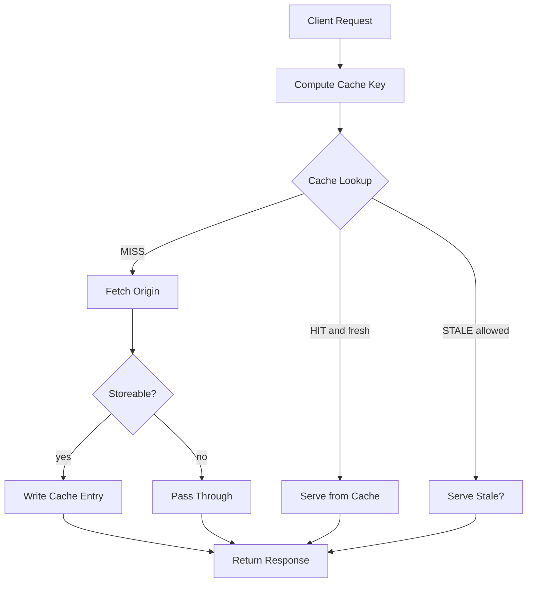
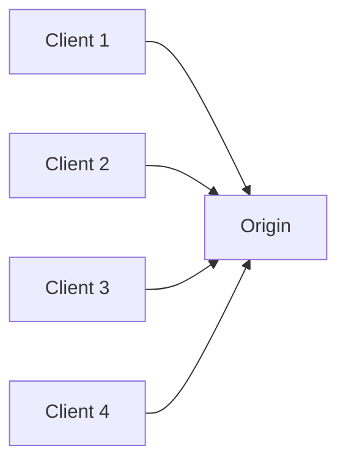
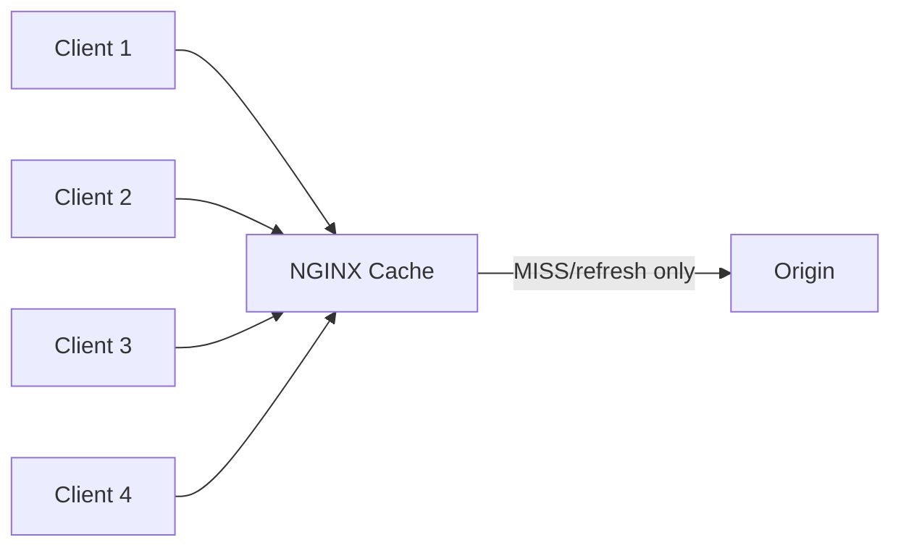
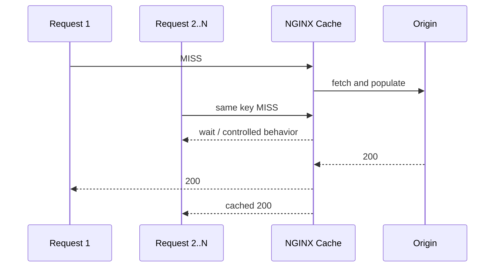
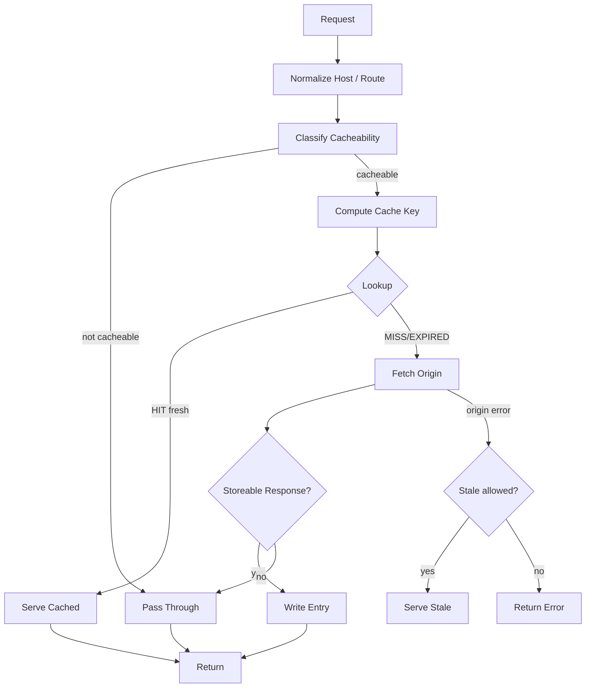

# Part 058 — Proxy Cache Mental Model

> Cache bukan fitur performance. Cache adalah database kecil di edge yang kebetulan bisa mempercepat response. Kalau Anda tidak mendesain key, freshness, invalidation, ownership, dan security boundary, cache akan menjadi sumber data corruption yang sangat cepat.

Phase 5 membahas content cache.

Part ini membangun mental model. Belum masuk terlalu dalam ke setiap directive. Tujuannya agar Anda tidak menganggap `proxy_cache` sebagai “tinggal on”.

NGINX cache dapat:

- mengurangi latency;
- mengurangi load ke origin;
- melindungi origin saat traffic spike;
- menyajikan stale response saat origin gagal;
- menjadi origin shield;
- mempercepat static dan dynamic content.

Tetapi cache juga dapat:

- menyajikan data user A ke user B;
- menyimpan response error terlalu lama;
- membuat deploy terlihat “tidak jalan”;
- memperbesar blast radius bug origin;
- membuka cache poisoning;
- membuat debugging lebih sulit;
- menyembunyikan overload sampai terlambat.

---

## 1. Mental model: cache sebagai database

Sebuah cache entry punya minimal lima hal:

```txt
key        -> identitas data
value      -> response body + selected headers
metadata   -> status, headers, age, freshness, size, timestamps
policy     -> kapan boleh disimpan, kapan boleh dipakai, kapan harus bypass
storage    -> disk path, memory metadata zone, eviction behavior
```

NGINX proxy cache bukan map sederhana `{url -> body}`.

Ia adalah storage engine kecil:



Jika Anda salah mendesain `key`, data bisa tercampur.

Jika Anda salah mendesain freshness, user bisa melihat data basi.

Jika Anda salah mendesain bypass/no-cache, authenticated response bisa tersimpan.

Jika Anda salah mendesain storage, disk bisa penuh atau cache thrashing.

---

## 2. Apa yang sebenarnya di-cache?

NGINX proxy cache menyimpan response dari upstream/proxied server.

Bukan hanya file static. Bisa juga dynamic response seperti:

- product catalog;
- public profile;
- read-only API;
- generated image;
- search suggestion;
- public configuration document;
- SSR HTML page;
- CDN-like asset response.

Tetapi “bisa di-cache” tidak sama dengan “aman di-cache”.

Gunakan tiga pertanyaan:

```txt
1. Apakah response ini sama untuk semua requester?
2. Apakah response ini boleh basi selama N detik?
3. Apakah cache key memuat semua dimensi variasi response?
```

Jika salah satu jawabannya “tidak”, jangan cache sebelum ada desain eksplisit.

---

## 3. Basic proxy cache skeleton

Config minimal:

```nginx
http {
    proxy_cache_path /var/cache/nginx/api
        levels=1:2
        keys_zone=api_cache:100m
        max_size=10g
        inactive=60m
        use_temp_path=off;

    upstream api_origin {
        server 127.0.0.1:9001;
        keepalive 64;
    }

    server {
        listen 8080;

        location /public-api/ {
            proxy_pass http://api_origin;

            proxy_http_version 1.1;
            proxy_set_header Connection "";
            proxy_set_header Host $host;
            proxy_set_header X-Request-ID $request_id;

            proxy_cache api_cache;
            proxy_cache_key "$scheme|$request_method|$host|$uri|$is_args$args";
            proxy_cache_valid 200 302 5m;
            proxy_cache_valid 404 30s;

            add_header X-Cache-Status $upstream_cache_status always;
        }
    }
}
```

Ini belum production-complete. Ini hanya skeleton.

Perhatikan tiga directive utama:

| Directive | Fungsi |
|---|---|
| `proxy_cache_path` | mendefinisikan storage path, metadata zone, size, inactive, layout |
| `proxy_cache` | mengaktifkan cache zone pada context tertentu |
| `proxy_cache_key` | menentukan identitas entry |

---

## 4. Cache key adalah primary key

Anggap `proxy_cache_key` sebagai primary key database.

Bad key:

```nginx
proxy_cache_key $uri;
```

Masalah:

```txt
https://api.example.com/products?id=1
https://api.example.com/products?id=2
```

Keduanya bisa punya `$uri` sama: `/products`.

Better:

```nginx
proxy_cache_key "$scheme|$request_method|$host|$uri|$is_args$args";
```

Tapi ini juga belum selalu cukup.

Jika response berbeda berdasarkan `Accept-Encoding`, NGINX biasanya menangani compression/cache path tertentu, tetapi Anda tetap harus paham `Vary` dan header policy.

Jika response berbeda berdasarkan `Accept-Language`:

```nginx
proxy_cache_key "$scheme|$request_method|$host|$uri|$is_args$args|lang=$http_accept_language";
```

Tetapi hati-hati: memasukkan raw `Accept-Language` bisa meledakkan cardinality.

Better:

```nginx
map $http_accept_language $cache_lang {
    default en;
    ~*^id id;
    ~*^en en;
    ~*^ja ja;
}

proxy_cache_key "$scheme|$request_method|$host|$uri|$is_args$args|lang=$cache_lang";
```

Mental model:

```txt
Cache key harus memuat semua dimensi yang membuat response berbeda,
tetapi tidak boleh memuat dimensi high-cardinality yang tidak perlu.
```

---

## 5. Cache HIT, MISS, BYPASS, EXPIRED, STALE

Tambahkan header observability:

```nginx
add_header X-Cache-Status $upstream_cache_status always;
```

Status umum yang perlu dipahami:

| Status | Makna operasional |
|---|---|
| `MISS` | tidak ada entry usable; request ke origin |
| `HIT` | entry fresh dipakai dari cache |
| `BYPASS` | cache dilewati karena policy `proxy_cache_bypass` |
| `EXPIRED` | entry ada tapi expired; origin dihubungi |
| `STALE` | entry stale dipakai karena policy mengizinkan |
| `UPDATING` | stale dipakai saat update sedang berjalan |
| `REVALIDATED` | entry divalidasi ulang dengan origin |

Jangan deploy cache tanpa visibility ini.

Tanpa `X-Cache-Status` atau log `$upstream_cache_status`, Anda tidak tahu apakah latency turun karena cache, origin sehat, atau request tidak pernah cacheable.

---

## 6. Freshness: kapan cache boleh dipakai?

Ada dua sumber policy utama:

1. header dari origin;
2. directive NGINX.

Origin headers:

```http
Cache-Control: public, max-age=300
ETag: "abc123"
Last-Modified: Tue, 07 Jul 2026 10:00:00 GMT
Expires: Tue, 07 Jul 2026 10:05:00 GMT
```

NGINX directive:

```nginx
proxy_cache_valid 200 302 5m;
proxy_cache_valid 404 30s;
```

Production rule:

```txt
Origin should own business freshness.
NGINX may enforce edge policy, but should not silently override domain correctness.
```

Contoh:

- product image: cache lama aman;
- product price: cache pendek atau revalidation;
- shopping cart: jangan shared cache;
- public article page: cache dengan purge/revalidation strategy;
- personalized dashboard: bypass.

---

## 7. Storeability: kapan response boleh disimpan?

Tidak semua response boleh disimpan.

Common no-store conditions:

- request punya `Authorization`;
- response punya `Set-Cookie`;
- response punya `Cache-Control: private`;
- response status bukan whitelist;
- request method bukan GET/HEAD;
- query mengandung token/session;
- route user-specific;
- response mengandung tenant-specific data tanpa key tenant.

Policy eksplisit:

```nginx
map $http_authorization $has_authorization {
    default 1;
    ""      0;
}

map $http_cookie $has_cookie {
    default 1;
    ""      0;
}

proxy_no_cache     $has_authorization $has_cookie;
proxy_cache_bypass $has_authorization $has_cookie;
```

Bedakan dua directive:

| Directive | Artinya |
|---|---|
| `proxy_cache_bypass` | jangan pakai cache untuk request ini; pergi ke origin |
| `proxy_no_cache` | jangan simpan response origin untuk request ini |

Sering keduanya dipakai bersama untuk authenticated traffic.

---

## 8. Bypass vs no-cache

Misal user menekan force refresh:

```nginx
map $http_cache_control $bypass_cache {
    default 0;
    ~*no-cache 1;
}

proxy_cache_bypass $bypass_cache;
```

Dengan ini:

- request tidak memakai cached entry;
- NGINX fetch origin;
- response baru masih bisa disimpan jika tidak ada `proxy_no_cache`.

Jika ingin request tertentu tidak menyimpan response:

```nginx
proxy_no_cache $bypass_cache;
```

Mental model:

```txt
bypass = do not read cache
no_cache = do not write cache
```

---

## 9. Cache as origin shield

Tanpa cache:



Dengan cache:



Origin shield berarti NGINX mengurangi request yang benar-benar sampai ke origin.

Tapi jika cache key salah atau TTL terlalu pendek, shield tidak efektif.

Jika cache miss rate tinggi, origin tetap terbakar.

Jika cache lock tidak dipakai pada hot key, cold miss bisa membuat thundering herd.

---

## 10. Thundering herd pada cache miss

Skenario:

```txt
1. Entry /homepage expired.
2. 10.000 request datang bersamaan.
3. Semua melihat MISS/EXPIRED.
4. Semua fetch origin.
5. Origin overload.
```

Mitigasi:

```nginx
proxy_cache_lock on;
proxy_cache_lock_timeout 5s;
proxy_cache_lock_age 10s;
```

Mental model:



`proxy_cache_lock` bukan silver bullet. Jika origin fetch lambat atau gagal, waiting clients tetap butuh timeout/error policy.

---

## 11. Stale cache sebagai resilience tool

Cache juga bisa membantu availability.

```nginx
proxy_cache_use_stale error timeout http_500 http_502 http_503 http_504 updating;
proxy_cache_background_update on;
```

Artinya:

- jika origin error/timeout, NGINX boleh menyajikan stale entry;
- saat entry sedang diperbarui, request lain bisa tetap menerima stale;
- background update dapat memperbarui cache tanpa membuat semua client menunggu.

Ini powerful, tapi harus dipakai sadar.

Cocok untuk:

- homepage publik;
- static generated content;
- public catalog;
- docs;
- feed publik.

Berbahaya untuk:

- payment status;
- inventory real-time;
- regulatory decision state;
- user permission;
- account balance;
- personalized dashboard.

Production question:

```txt
Apakah lebih baik menampilkan data lama daripada error?
```

Jika jawabannya “ya”, stale cache mungkin cocok.

Jika jawabannya “tidak”, jangan pakai stale sebagai fallback.

---

## 12. Error caching

Caching `404` selama 30 detik bisa bagus untuk mengurangi origin noise.

```nginx
proxy_cache_valid 404 30s;
```

Caching `500` biasanya buruk kecuali Anda benar-benar tahu alasannya.

Bad:

```nginx
proxy_cache_valid 500 10m;
```

Efek:

```txt
Bug transient 2 detik bisa menjadi outage 10 menit.
```

Lebih aman:

```nginx
proxy_cache_valid 200 302 5m;
proxy_cache_valid 404 30s;
```

Lalu gunakan stale-if-error untuk resilience, bukan menyimpan 500 sebagai canonical content.

---

## 13. Authenticated response dan private data

Shared edge cache paling berbahaya saat traffic authenticated.

Bad:

```nginx
location /api/ {
    proxy_cache api_cache;
    proxy_pass http://api_origin;
}
```

Jika `/api/me` mengembalikan data user dan key hanya `$uri`, user B bisa menerima response user A.

Minimal guard:

```nginx
map $http_authorization $skip_cache_auth {
    default 1;
    ""      0;
}

location /api/ {
    proxy_cache api_cache;
    proxy_cache_bypass $skip_cache_auth;
    proxy_no_cache     $skip_cache_auth;
    proxy_pass http://api_origin;
}
```

Better:

```txt
Default: do not cache authenticated API.
Allowlist only public/read-only endpoints.
```

Best:

```txt
Cache policy lives with API contract.
Route owner must declare storeability and key dimensions.
```

---

## 14. Cache poisoning mental model

Cache poisoning terjadi ketika attacker membuat cache menyimpan response yang salah, lalu victim menerima response itu.

Pola umum:

```txt
Attacker controls request dimension that affects response.
Cache key does not include that dimension.
NGINX stores poisoned response.
Victim requests normal URL.
Victim receives poisoned cached response.
```

Contoh dimensi berbahaya:

- `Host`;
- `X-Forwarded-Host`;
- `X-Original-URL`;
- query param tracking;
- `Accept-Encoding`/content encoding confusion;
- unnormalized path;
- language/device header;
- user-controlled scheme header.

Defense:

```txt
[ ] Canonicalize Host.
[ ] Do not forward untrusted host/scheme headers blindly.
[ ] Use explicit cache key.
[ ] Ignore irrelevant query args or include relevant args consistently.
[ ] Do not cache responses with Set-Cookie.
[ ] Do not cache authenticated response by default.
[ ] Log cache key components during rollout.
[ ] Add cache-status observability.
```

---

## 15. Query string strategy

Not all query args are equal.

Example URL:

```txt
/articles/123?utm_source=x&utm_campaign=y
```

If UTM does not affect response, including raw `$args` creates needless cache fragmentation.

Bad:

```nginx
proxy_cache_key "$scheme|$host|$uri|$is_args$args";
```

For public article pages, better normalize:

```nginx
proxy_cache_key "$scheme|$host|$uri";
```

But for search:

```txt
/search?q=nginx&page=2
```

Query absolutely affects response.

You need route-specific key design:

```nginx
location /articles/ {
    proxy_cache_key "$scheme|$host|$uri";
}

location /search {
    proxy_cache_key "$scheme|$host|$uri|q=$arg_q|page=$arg_page";
}
```

Production rule:

```txt
Never use one global cache key strategy for all routes unless all routes share the same response variation model.
```

---

## 16. Storage model

`proxy_cache_path` controls disk layout and metadata zone.

Example:

```nginx
proxy_cache_path /var/cache/nginx/api
    levels=1:2
    keys_zone=api_cache:100m
    max_size=10g
    inactive=60m
    use_temp_path=off;
```

Interpretation:

| Parameter | Meaning |
|---|---|
| path | where cache files live |
| `levels` | subdirectory hash layout |
| `keys_zone` | shared memory zone for cache keys/metadata |
| `max_size` | max cache storage size |
| `inactive` | remove entries not accessed for duration even if fresh |
| `use_temp_path=off` | write temp files in cache directory, often better for same filesystem rename |

Disk is part of the cache system.

Ask:

```txt
[ ] Is cache directory on correct filesystem?
[ ] What happens when disk fills?
[ ] Is cache warmed after deploy/restart?
[ ] Is cache shared across pods/nodes or local only?
[ ] Is eviction expected or harmful?
[ ] Are large objects separated from small hot objects?
```

---

## 17. Cache zone sizing

`keys_zone=api_cache:100m` is not content storage. It is shared memory metadata.

Common mistake:

```txt
keys_zone=api_cache:10g
```

That is not where response bodies go.

Response bodies live under cache path on disk.

Metadata zone holds keys and metadata.

Rule of thumb must be validated by workload, but the reasoning is:

```txt
More unique cache entries -> more metadata memory.
Large bodies -> more disk.
High churn -> more manager/loader work and eviction pressure.
```

Do not tune cache by total traffic volume only. Tune by:

- object count;
- object size distribution;
- TTL;
- hit ratio;
- churn rate;
- hot key concentration;
- cold scan volume.

---

## 18. Cache observability

Add both header and log.

```nginx
log_format cache_json escape=json
  '{'
    '"ts":"$time_iso8601",'
    '"request_id":"$request_id",'
    '"host":"$host",'
    '"method":"$request_method",'
    '"uri":"$request_uri",'
    '"status":$status,'
    '"request_time":$request_time,'
    '"cache_status":"$upstream_cache_status",'
    '"upstream_addr":"$upstream_addr",'
    '"upstream_status":"$upstream_status",'
    '"upstream_response_time":"$upstream_response_time"'
  '}';
```

Dashboard minimum:

| Metric | Why it matters |
|---|---|
| HIT ratio | cache effectiveness |
| MISS rate | origin load |
| BYPASS rate | policy behavior |
| EXPIRED rate | TTL/revalidation churn |
| STALE served | origin failure shielding |
| cache 5xx | cache layer failure or origin pass-through |
| origin request rate | actual backend reduction |
| disk usage | eviction/full disk risk |
| p95 latency by cache status | cache benefit proof |

Latency breakdown:

```txt
HIT should generally have no upstream_addr.
MISS has upstream_addr and upstream_response_time.
STALE may have no active origin wait, depending policy.
BYPASS behaves like pass-through.
```

---

## 19. Cache rollout strategy

Do not enable cache broadly in one step.

Safe rollout:

```txt
Step 1: Add observability only. No cache.
Step 2: Enable cache for one public, low-risk GET route.
Step 3: Add X-Cache-Status and dashboard.
Step 4: Use short TTL.
Step 5: Compare origin QPS, latency, error rate.
Step 6: Add bypass/no-cache guard.
Step 7: Add stale policy only after correctness review.
Step 8: Expand route by route.
```

Route admission checklist:

```txt
[ ] Route is GET/HEAD only or otherwise explicitly safe.
[ ] Response is public or key includes safe variation.
[ ] Response does not depend on Authorization/Cookie unless deliberately handled.
[ ] Cache key reviewed.
[ ] TTL reviewed by route owner.
[ ] Error caching reviewed.
[ ] Purge/revalidation story exists if freshness matters.
[ ] Cache status visible in logs.
[ ] Rollback is one config deploy.
```

---

## 20. Cache and deployment

Static hashed assets:

```txt
/app.6f2ab3.js -> immutable, long TTL
/index.html   -> short TTL/revalidate
```

API response:

```txt
/api/products?category=books -> maybe 30s-5m
/api/me                       -> no shared cache
/api/prices                   -> depends business semantics
```

SSR page:

```txt
/product/123 -> cache with purge or short TTL
/checkout    -> no shared cache
```

Deployment failure pattern:

```txt
New origin deployed.
Cache still serves old HTML.
HTML references old/new asset mismatch.
User gets broken app.
```

Defense:

- hashed immutable assets;
- short/no-cache HTML;
- deploy assets before HTML;
- never delete old assets immediately;
- smoke test through cache path, not origin only.

---

## 21. Cache invalidation options

Invalidation strategies:

| Strategy | Description | Trade-off |
|---|---|---|
| Short TTL | let entries expire soon | simpler, more origin load |
| Versioned URL | new content gets new URL | excellent for assets, less for API |
| Purge | remove cache entry explicitly | requires access control and tooling |
| Revalidation | origin validates freshness | needs ETag/Last-Modified contract |
| Bypass on deploy | temporary force origin | can overload origin |
| Cache namespace bump | change key prefix/version | easy global invalidation, disk retains old entries until eviction |

Namespace bump example:

```nginx
set $cache_namespace "v20260707";
proxy_cache_key "$cache_namespace|$scheme|$host|$uri|$is_args$args";
```

Powerful but blunt.

It invalidates logically by making old entries unreachable. Disk cleanup happens later by cache manager/eviction.

---

## 22. Cache ownership model

In mature systems, edge team should not guess cacheability.

Define route contract:

```yaml
route: /public-api/products
owner: catalog-team
methods: [GET, HEAD]
cache:
  shared: true
  ttl: 300s
  stale_if_error: 60s
  key:
    - scheme
    - host
    - uri
    - arg.category
    - arg.page
  bypass_when:
    - Authorization present
    - Cookie present
  cache_errors:
    404: 30s
    500: never
```

Then generate NGINX config from contract.

Manual cache policy scattered across files does not scale.

---

## 23. Cache failure modes

### 23.1 High MISS forever

Possible causes:

- cache key includes timestamp/random query;
- `Set-Cookie` prevents storing;
- `Cache-Control: private/no-store` from origin;
- `proxy_no_cache` always true;
- TTL too short;
- cache zone too small;
- inactive too low;
- route not actually using `proxy_cache`;
- method is POST;
- `Vary`/headers create fragmentation.

### 23.2 HIT but wrong content

Possible causes:

- cache key missing query/header/language/tenant;
- Host not canonicalized;
- untrusted forwarded host affects origin response;
- authenticated response cached;
- origin returns user-specific content without `private/no-store`;
- cache namespace reused incorrectly.

### 23.3 Cache improves average latency but p99 bad

Possible causes:

- cold miss thundering herd;
- hot objects expire at same time;
- origin slow on MISS;
- disk IO saturated;
- large object mixed with small hot object;
- cache lock timeout;
- background update behavior misunderstood.

### 23.4 Cache hides origin incident

Possible causes:

- stale serving masks backend failure;
- dashboard only looks at client 2xx;
- origin request rate low but refresh failures rising;
- stale count not monitored.

---

## 24. First production cache policy template

A conservative starting point for public read-only API:

```nginx
proxy_cache_path /var/cache/nginx/public_api
    levels=1:2
    keys_zone=public_api_cache:100m
    max_size=20g
    inactive=30m
    use_temp_path=off;

map $http_authorization $skip_cache_auth {
    default 1;
    "" 0;
}

map $http_cookie $skip_cache_cookie {
    default 1;
    "" 0;
}

server {
    listen 443 ssl http2;
    server_name api.example.com;

    location /public/v1/catalog/ {
        proxy_pass http://catalog_origin;

        proxy_cache public_api_cache;
        proxy_cache_key "$scheme|$request_method|$host|$uri|$is_args$args";

        proxy_cache_methods GET HEAD;
        proxy_cache_valid 200 2m;
        proxy_cache_valid 404 30s;

        proxy_cache_bypass $skip_cache_auth $skip_cache_cookie;
        proxy_no_cache     $skip_cache_auth $skip_cache_cookie;

        proxy_cache_lock on;
        proxy_cache_use_stale error timeout http_500 http_502 http_503 http_504 updating;

        add_header X-Cache-Status $upstream_cache_status always;
    }
}
```

Review before production:

```txt
[ ] Does catalog response vary by user/tenant/currency/language?
[ ] Are all relevant query args included?
[ ] Should UTM args be ignored?
[ ] Is stale acceptable for this domain?
[ ] Is 404 caching safe during new product creation?
[ ] Can origin send Set-Cookie accidentally?
[ ] Is cache path disk sized and monitored?
```

---

## 25. What not to cache first

Do not start with:

- `/api/me`;
- `/checkout`;
- `/payment`;
- `/orders/current`;
- `/admin`;
- permission/authorization decision endpoint;
- regulatory workflow state;
- case assignment state;
- anything with hidden tenant/user dimension;
- anything where stale data can cause irreversible action.

Start with:

- versioned static assets;
- public documentation;
- public article pages;
- public catalog metadata with clear TTL;
- idempotent read-heavy API with route owner approval.

---

## 26. Mental model summary



The cache design loop:

```txt
1. Identify route.
2. Identify data owner.
3. Identify response variation.
4. Build cache key.
5. Decide TTL/freshness.
6. Decide bypass/no-cache.
7. Decide stale behavior.
8. Instrument cache status.
9. Roll out narrowly.
10. Watch correctness and origin load.
```

---

## 27. References

- NGINX/F5 docs — Content Caching: `https://docs.nginx.com/nginx/admin-guide/content-cache/content-caching/`
- NGINX official docs — `ngx_http_proxy_module`: `https://nginx.org/en/docs/http/ngx_http_proxy_module.html`
- NGINX official docs — `proxy_cache_path` and cache directives: `https://nginx.org/en/docs/http/ngx_http_proxy_module.html#proxy_cache_path`
- NGINX official docs — `ngx_http_headers_module`: `https://nginx.org/en/docs/http/ngx_http_headers_module.html`
