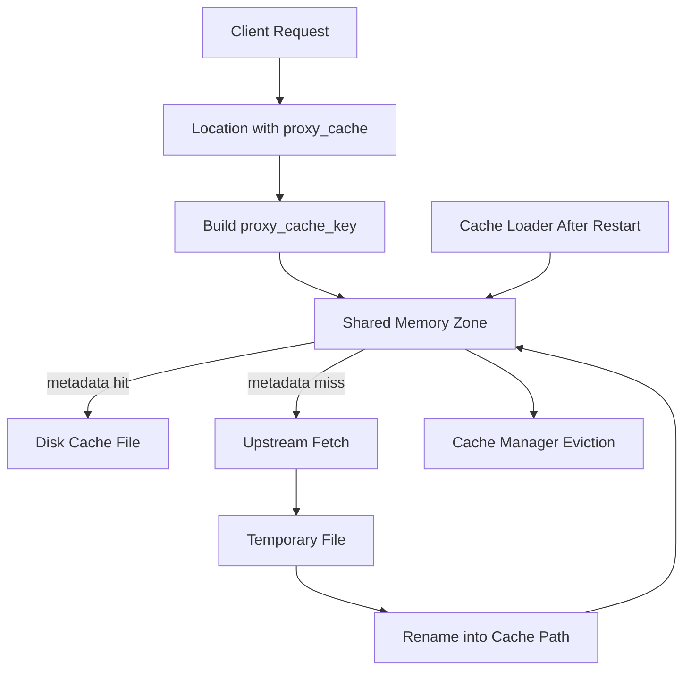
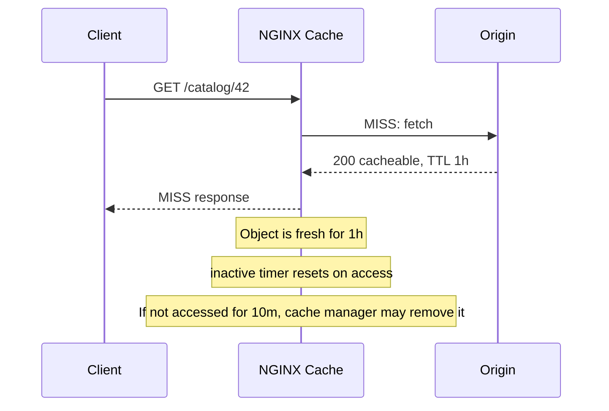

# Part 059 — Cache Zone, Cache Key, Path, and Storage Layout

> Target mental model: NGINX proxy cache is not just a folder of files. It is a small edge data store with a memory index, disk objects, eviction workers, key design, filesystem behavior, and failure modes.

In Part 058, we framed proxy cache as an edge data store. This part goes lower: how that store is shaped.

When you configure proxy cache, you are defining four coupled things:

1. **Which memory zone indexes cached objects.**
2. **Which string becomes the cache identity.**
3. **Where cached objects live on disk.**
4. **How NGINX evicts, loads, and protects storage.**

Most cache bugs are not caused by a missing `proxy_cache`. They are caused by weak identity design, wrong storage assumptions, or treating cache disk as an infinite black box.

A production cache must answer these questions:

- What exact request variants are considered the same object?
- Can two tenants collide into one cache entry?
- Can authenticated and anonymous responses share a key by accident?
- What happens after an NGINX restart?
- What happens when disk fills?
- What happens when cache storage lives on a different filesystem from temp files?
- How do we estimate index memory?
- How do we safely separate cache classes?

This part builds those answers step by step.

---

## 1. The minimal cache configuration is not a production cache

A minimal configuration often looks like this:

```nginx
http {
    proxy_cache_path /var/cache/nginx/api levels=1:2 keys_zone=api_cache:100m max_size=20g inactive=30m use_temp_path=off;

    server {
        listen 80;

        location /api/public/ {
            proxy_pass http://api_backend;
            proxy_cache api_cache;
            proxy_cache_valid 200 5m;
            add_header X-Cache-Status $upstream_cache_status always;
        }
    }
}
```

This is syntactically valid, but it hides several design decisions:

```txt
/var/cache/nginx/api       -> disk store
levels=1:2                 -> directory fan-out
keys_zone=api_cache:100m   -> shared memory index
max_size=20g               -> eviction target
inactive=30m               -> remove cold objects after no access
use_temp_path=off          -> write temp files in the cache directory
proxy_cache api_cache      -> use that zone in a location
proxy_cache_valid 200 5m   -> store 200 responses for 5 minutes if origin allows
```

The dangerous part is this: the config looks small, but the runtime object graph is large.



A cache is correct only when all nodes in this graph are understood.

---

## 2. `proxy_cache_path`: the root of the cache database

`proxy_cache_path` is declared in the `http` context. It creates a named cache zone and defines the disk path.

A realistic baseline:

```nginx
proxy_cache_path /var/cache/nginx/public_api
    levels=1:2
    keys_zone=public_api_cache:200m
    max_size=50g
    min_free=5g
    inactive=1h
    use_temp_path=off
    manager_files=200
    manager_threshold=200ms
    manager_sleep=50ms
    loader_files=200
    loader_threshold=200ms
    loader_sleep=50ms;
```

Read it as a schema definition:

```txt
cache name:        public_api_cache
memory index:      200m shared memory zone
physical store:    /var/cache/nginx/public_api
object layout:     levels=1:2
soft max disk:     50g
free-space guard:  5g
cold-object TTL:   1h inactive
write placement:   temp file inside cache path
maintenance:       manager/loader iteration controls
```

The phrase “soft max disk” matters. The cache manager removes entries after size/free-space constraints are exceeded. It does not make your filesystem impossible to fill. If the origin returns large responses faster than the manager can evict, or if other processes write to the same filesystem, you can still hit disk pressure.

### Production invariant

Do not put cache storage on a filesystem that is also critical for logs, root OS, application data, or container runtime metadata unless you have a deliberate quota and failure model.

Bad:

```txt
/var/cache/nginx on /
/var/log/nginx on /
container overlay on /
```

Better:

```txt
/var/cache/nginx/public_api on dedicated volume
/var/log/nginx on separate log volume or shipped quickly
root filesystem protected from cache growth
```

---

## 3. Cache zone: shared memory index, not disk capacity

`keys_zone=public_api_cache:200m` does **not** mean “200 MB cache”. It means “use a 200 MB shared memory zone for metadata”.

The actual cached response bodies live on disk. The shared memory zone stores active keys and cache metadata used by worker processes.

```txt
keys_zone size -> metadata capacity
max_size       -> disk object capacity target
inactive       -> cold object removal window
```

A common production mistake:

```nginx
proxy_cache_path /var/cache/nginx levels=1:2 keys_zone=cache:10m max_size=500g;
```

This says:

> “I want up to 500 GB of object data, but I only allocated a small index.”

Depending on object count and metadata needs, the cache may behave poorly long before disk reaches `max_size`. Large-object caches and small-object API caches have very different metadata-to-body ratios.

### Object-count thinking

For cache sizing, think in objects, not only bytes.

```txt
Scenario A: 1,000 large video chunks averaging 50 MB
- Disk: about 50 GB
- Object count: low
- Metadata pressure: moderate

Scenario B: 10,000,000 JSON responses averaging 5 KB
- Disk: about 50 GB
- Object count: huge
- Metadata pressure: high
```

Both are 50 GB on disk. They are not equivalent caches.

### Cache zone naming discipline

Use names that encode ownership and cache class:

```nginx
proxy_cache_path /var/cache/nginx/catalog_public
    levels=1:2
    keys_zone=catalog_public_cache:100m
    max_size=20g
    inactive=30m
    use_temp_path=off;

proxy_cache_path /var/cache/nginx/media_public
    levels=1:2
    keys_zone=media_public_cache:500m
    max_size=500g
    inactive=7d
    use_temp_path=off;
```

Avoid generic names:

```nginx
# Weak: no ownership, no semantics.
keys_zone=cache:100m
keys_zone=my_cache:100m
keys_zone=zone1:100m
```

A good cache zone name tells future engineers:

- which service owns it,
- whether the content is public/private,
- what class of object is expected,
- whether the zone can be safely purged or resized.

---

## 4. Cache key: the identity of a cached response

`proxy_cache_key` defines what makes two requests equivalent from the cache's point of view.

Default behavior is close to:

```nginx
proxy_cache_key $scheme$proxy_host$request_uri;
```

or conceptually:

```txt
scheme + upstream host + full request URI
```

That default is acceptable for simple cases, but production systems often need an explicit key.

Example:

```nginx
proxy_cache_key "$scheme|$host|$request_method|$uri|$is_args$args";
```

The delimiter is not cosmetic. It prevents ambiguous concatenation.

Weak:

```nginx
proxy_cache_key "$host$uri$args";
```

Better:

```nginx
proxy_cache_key "scheme=$scheme|host=$host|method=$request_method|uri=$uri|args=$args";
```

The better key is easier to inspect mentally and safer against accidental collision.

### Cache key as a data-modeling problem

A cache key is like a database primary key. It must encode all dimensions that change the response.

For a public product endpoint:

```txt
GET /api/products/42?currency=IDR&lang=id
```

Likely dimensions:

```txt
host
scheme, sometimes
method
normalized path
selected query params: currency, lang
encoding variant, maybe not in key if handled by Vary/NGINX behavior
tenant, if host does not isolate tenant
origin version, sometimes
```

For a dangerous authenticated endpoint:

```txt
GET /api/me
Authorization: Bearer <token>
```

Safe default:

```txt
Do not cache.
```

Risky key:

```nginx
proxy_cache_key "$scheme|$host|$uri|$args";
```

Why risky? Every user requesting `/api/me` can collide into the same cached response if the cache layer stores it.

If you ever cache user-specific data, the key must include a stable, non-spoofable user dimension, and you must prove that upstream privacy headers cannot be bypassed. In most systems, do not do it at NGINX edge unless the architecture explicitly owns that risk.

---

## 5. Method in the key: GET, HEAD, and dangerous expansion

NGINX caches `GET` and `HEAD` by default for proxy cache. `proxy_cache_methods` can add methods, but this should be rare.

A robust key often includes method anyway:

```nginx
proxy_cache_key "$scheme|$host|$request_method|$uri|$is_args$args";
```

This helps when you later change method policy or disable `proxy_cache_convert_head`.

Dangerous expansion:

```nginx
proxy_cache_methods GET HEAD POST;
```

Caching `POST` can be valid for specialized APIs, but it changes the entire correctness model. Request body becomes part of semantic identity, yet the default cache key does not include request body. NGINX is not a semantic API cache that automatically hashes JSON body and authorization context.

Production rule:

```txt
Do not cache POST at the edge unless the endpoint is explicitly designed as cacheable and the key includes every semantic dimension needed for correctness.
```

---

## 6. Host and tenant isolation

If one NGINX instance serves multiple hosts, the cache key must preserve host boundary unless the content is intentionally shared.

Bad multi-tenant key:

```nginx
proxy_cache_key "$uri$is_args$args";
```

This can make these collide:

```txt
https://tenant-a.example.com/logo.png
https://tenant-b.example.com/logo.png
```

Better:

```nginx
proxy_cache_key "$scheme|$host|$request_method|$uri|$is_args$args";
```

If tenant identity is not equivalent to host, include the trusted tenant dimension:

```nginx
proxy_cache_key "tenant=$tenant_id|host=$host|method=$request_method|uri=$uri|args=$args";
```

But be careful: `$tenant_id` must come from a trusted mapping, not directly from a client-controlled header.

Weak:

```nginx
proxy_cache_key "$http_x_tenant_id|$uri|$args";
```

Better:

```nginx
map $host $tenant_id {
    default "";
    tenant-a.example.com tenant_a;
    tenant-b.example.com tenant_b;
}

proxy_cache_key "tenant=$tenant_id|uri=$uri|args=$args";
```

Then block unknown tenants:

```nginx
if ($tenant_id = "") { return 444; }
```

Use `if` sparingly; here it is a simple terminal return, which is one of the safer uses.

---

## 7. Query string normalization: cache cardinality control

`$request_uri` includes the original URI and query string exactly as sent by the client. That can be useful, but it can explode cache cardinality.

These may be semantically identical for the application:

```txt
/products?lang=id&currency=IDR&utm_source=ad
/products?currency=IDR&lang=id&utm_source=email
/products?lang=id&currency=IDR&fbclid=abc
```

If your key includes full `$request_uri`, each variant can become a different cache object.

A better pattern is explicit query projection:

```nginx
map $arg_lang $cache_lang {
    default $arg_lang;
    ""      "en";
}

map $arg_currency $cache_currency {
    default $arg_currency;
    ""      "USD";
}

proxy_cache_key "host=$host|method=$request_method|uri=$uri|lang=$cache_lang|currency=$cache_currency";
```

This design says:

```txt
Only lang and currency are cache-varying dimensions.
Marketing params are ignored.
Unknown extra args do not create new cache objects.
```

But this is safe only if the origin response truly ignores those extra args. If `sort`, `filter`, `page`, or `q` changes the response and you omit it, you will serve the wrong content.

### Query design checklist

For each query parameter, classify it:

| Class | Example | Key treatment |
|---|---|---|
| Response-changing | `page`, `sort`, `filter`, `q`, `lang` | Include or normalize |
| Tracking-only | `utm_source`, `fbclid`, `gclid` | Exclude |
| Security-sensitive | `token`, `signature`, `preview` | Usually bypass/no-cache |
| Unknown | anything not explicitly classified | Conservative: bypass or include full args |

The “top 1%” habit is not memorizing `proxy_cache_key`. It is building a cache key classification table per route.

---

## 8. `levels`: directory fan-out and filesystem pressure

`levels=1:2` controls how NGINX maps cache file names into nested directories.

The cache file name is derived from an MD5 of the cache key. With `levels=1:2`, files are spread across a hierarchy like:

```txt
/var/cache/nginx/public_api/c/29/b7f54b2df7773722d382f4809d65029c
```

Why not put all files in one directory?

Because huge flat directories can be operationally painful:

- slower directory scans,
- heavier metadata operations,
- difficult manual inspection,
- worse behavior on some filesystems/tools.

Common patterns:

```nginx
levels=1:2
levels=1:2:2
```

Do not over-optimize this prematurely. For most proxy caches, `1:2` is a reasonable starting point.

### What `levels` does not do

`levels` does not define TTL.

`levels` does not define memory size.

`levels` does not shard across disks.

`levels` does not isolate tenants.

It is only disk directory layout.

---

## 9. Temporary file placement and `use_temp_path=off`

When NGINX receives a cacheable response from upstream, it writes it first as a temporary file, then moves it into the cache path.

If temp files are on the same filesystem as the cache path, that final operation can be a cheap rename.

If temp files are on a different filesystem, the final operation becomes a copy across filesystems, which is more expensive and can amplify disk I/O.

Recommended cache pattern:

```nginx
proxy_cache_path /var/cache/nginx/public_api
    levels=1:2
    keys_zone=public_api_cache:200m
    max_size=50g
    inactive=1h
    use_temp_path=off;
```

`use_temp_path=off` means temporary files for cache population are written directly inside the cache directory tree instead of using the separate `proxy_temp_path` for the location.

This is usually desirable for cache-heavy workloads.

### When to think twice

`use_temp_path=off` is not a magic default for every environment. Think about:

- disk quotas,
- container ephemeral storage,
- filesystem performance,
- monitoring visibility,
- cleanup behavior,
- whether cache path is backed by slow network storage.

Production invariant:

```txt
Cache temp and final cache path should be on the same filesystem unless you deliberately accept copy cost.
```

---

## 10. `inactive`: cold-object retention, not freshness

`inactive=1h` means:

> Remove cached data if it has not been accessed for one hour, regardless of whether it is still fresh.

This is frequently misunderstood.

Freshness is controlled by headers and `proxy_cache_valid`.

Cold-object removal is controlled by `inactive`.

Example:

```nginx
proxy_cache_path /var/cache/nginx/catalog
    levels=1:2
    keys_zone=catalog_cache:100m
    max_size=20g
    inactive=10m;

location /catalog/ {
    proxy_cache catalog_cache;
    proxy_cache_valid 200 1h;
}
```

An object may be cacheable for one hour, but if nobody accesses it for ten minutes, it can be removed.

Think of two clocks:

```txt
freshness clock: may this object be served without revalidation?
coldness clock: has this object been unused long enough to delete?
```

Mermaid view:



Use a short `inactive` for high-cardinality APIs where stale long-tail objects should disappear.

Use a longer `inactive` for expensive objects that are rarely accessed but still worth retaining.

---

## 11. `max_size` and `min_free`: storage safety rails

`max_size` sets the maximum cache size target.

`min_free` tells the cache manager to keep at least that much free filesystem space.

Example:

```nginx
proxy_cache_path /var/cache/nginx/media
    levels=1:2
    keys_zone=media_cache:500m
    max_size=800g
    min_free=50g
    inactive=30d
    use_temp_path=off;
```

Read this as:

```txt
Evict when cache exceeds 800 GB or when filesystem free space drops below 50 GB.
```

The cache manager removes least recently used data in iterations. That means eviction has a cadence. It is not an instant hard wall.

Operational implication:

- alert before `min_free` is reached,
- alert on cache filesystem fullness,
- alert on temp file growth,
- alert on write errors,
- do not rely only on NGINX eviction to save the host.

### Container warning

In containers, `/var/cache/nginx` may sit on ephemeral writable layer if you do nothing. That can cause:

- cache erased on restart,
- overlay filesystem pressure,
- noisy-neighbor disk I/O,
- container eviction in Kubernetes,
- host disk pressure.

For serious cache workloads, mount a volume intentionally.

---

## 12. Cache manager and cache loader

NGINX uses special cache processes to maintain cache state.

Conceptually:

```txt
cache manager -> trims cache according to max_size, min_free, inactive
cache loader  -> after startup, loads existing disk cache metadata into shared memory
```

After restart, the disk files may still exist, but the in-memory index needs to be populated. The loader does this gradually, not as one giant blocking scan.

This creates an important operational phenomenon:

```txt
Immediately after restart, cache hit ratio may be temporarily lower.
```

Not because all disk files disappeared, but because the memory index is being rebuilt progressively.

### Loader tuning

```nginx
proxy_cache_path /var/cache/nginx/public_api
    levels=1:2
    keys_zone=public_api_cache:200m
    max_size=50g
    inactive=1h
    use_temp_path=off
    loader_files=300
    loader_threshold=200ms
    loader_sleep=50ms;
```

`loader_files`, `loader_threshold`, and `loader_sleep` control how aggressively the loader scans cache files.

Aggressive loader:

```txt
+ faster warm index after restart
- more startup disk I/O
- possible competition with live traffic
```

Conservative loader:

```txt
+ less startup I/O pressure
- longer degraded hit ratio window
```

### Manager tuning

```nginx
proxy_cache_path /var/cache/nginx/public_api
    levels=1:2
    keys_zone=public_api_cache:200m
    max_size=50g
    inactive=1h
    use_temp_path=off
    manager_files=200
    manager_threshold=200ms
    manager_sleep=50ms;
```

Manager knobs control eviction iteration size and pacing.

Do not tune these randomly. Tune them when you observe:

- eviction cannot keep up,
- cache disk oscillates heavily,
- manager causes I/O spikes,
- restart warmup is too slow.

---

## 13. Separate cache classes instead of one giant shared cache

A single cache zone for every route is simple but often wrong.

Bad:

```nginx
proxy_cache_path /var/cache/nginx/all levels=1:2 keys_zone=all_cache:500m max_size=500g inactive=7d;

location /api/    { proxy_cache all_cache; }
location /images/ { proxy_cache all_cache; }
location /pages/  { proxy_cache all_cache; }
```

This creates cross-class eviction pressure:

- large images evict small API objects,
- noisy low-value endpoints evict expensive page fragments,
- one service's cache behavior affects another service,
- debugging hit ratio becomes muddy.

Better:

```nginx
proxy_cache_path /var/cache/nginx/api_public
    levels=1:2
    keys_zone=api_public_cache:200m
    max_size=30g
    inactive=1h
    use_temp_path=off;

proxy_cache_path /var/cache/nginx/page_public
    levels=1:2
    keys_zone=page_public_cache:200m
    max_size=50g
    inactive=6h
    use_temp_path=off;

proxy_cache_path /var/cache/nginx/media_public
    levels=1:2
    keys_zone=media_public_cache:500m
    max_size=500g
    inactive=30d
    use_temp_path=off;
```

Then bind each route class deliberately:

```nginx
location /api/public/ {
    proxy_cache api_public_cache;
    proxy_pass http://api_backend;
}

location /pages/ {
    proxy_cache page_public_cache;
    proxy_pass http://page_backend;
}

location /media/ {
    proxy_cache media_public_cache;
    proxy_pass http://media_backend;
}
```

This is the same principle as separating database tables or queues by workload shape.

---

## 14. Cache key examples by route class

### Static-ish public API

```nginx
map $arg_lang $cache_lang {
    default $arg_lang;
    ""      "en";
}

map $arg_currency $cache_currency {
    default $arg_currency;
    ""      "USD";
}

location /api/public/products/ {
    proxy_cache api_public_cache;
    proxy_cache_key "host=$host|method=$request_method|uri=$uri|lang=$cache_lang|currency=$cache_currency";
    proxy_cache_valid 200 5m;
    proxy_pass http://catalog_api;
    add_header X-Cache-Status $upstream_cache_status always;
}
```

The key intentionally ignores unknown marketing parameters.

### HTML page cache

```nginx
map $http_accept_language $cache_lang_bucket {
    default en;
    ~^id    id;
    ~^en    en;
}

location /docs/ {
    proxy_cache page_public_cache;
    proxy_cache_key "host=$host|uri=$uri|lang=$cache_lang_bucket";
    proxy_cache_valid 200 10m;
    proxy_pass http://docs_frontend;
    add_header X-Cache-Status $upstream_cache_status always;
}
```

The key does not include full `Accept-Language` because that header can have huge cardinality. It maps to explicit buckets.

### Versioned media cache

```nginx
location /assets/ {
    proxy_cache media_public_cache;
    proxy_cache_key "host=$host|uri=$uri";
    proxy_cache_valid 200 301 302 30d;
    proxy_pass http://asset_origin;
    add_header X-Cache-Status $upstream_cache_status always;
}
```

This assumes asset URLs are content-addressed or versioned. If `/assets/app.js` changes in place, this policy is dangerous.

---

## 15. `$upstream_cache_status`: minimal observability contract

Always expose cache status internally, at least during rollout.

```nginx
add_header X-Cache-Status $upstream_cache_status always;
```

Possible values include states such as:

```txt
MISS
BYPASS
EXPIRED
STALE
UPDATING
REVALIDATED
HIT
```

For production logs, add it to `log_format`:

```nginx
log_format edge_json escape=json
    '{'
      '"ts":"$time_iso8601",'
      '"host":"$host",'
      '"method":"$request_method",'
      '"uri":"$uri",'
      '"args":"$args",'
      '"status":$status,'
      '"cache":"$upstream_cache_status",'
      '"upstream_addr":"$upstream_addr",'
      '"upstream_status":"$upstream_status",'
      '"request_time":$request_time,'
      '"upstream_response_time":"$upstream_response_time"'
    '}';
```

You cannot operate cache correctness from average latency alone. You need to see which requests hit, miss, bypass, expire, update, or revalidate.

---

## 16. Filesystem and I/O behavior

A proxy cache creates a storage workload:

```txt
read cached response
write temp response
rename temp to final
delete evicted objects
scan/load metadata after restart
```

This workload stresses:

- disk throughput,
- disk IOPS,
- filesystem metadata operations,
- inode availability,
- cache directory traversal,
- free-space behavior,
- write latency tail.

For high-cardinality API cache, inodes can matter. For large media cache, throughput and eviction bandwidth may dominate.

### Operational checks

At minimum:

```bash
df -h /var/cache/nginx
df -i /var/cache/nginx
du -sh /var/cache/nginx/*
iostat -xz 1
```

For container/Kubernetes environments, also check:

```bash
kubectl describe pod <nginx-pod>
kubectl top pod <nginx-pod>
kubectl describe node <node>
```

Disk pressure at the node level can evict pods even if NGINX itself is configured correctly.

---

## 17. Permission model

NGINX worker processes must be able to read/write the cache path.

Example:

```bash
sudo mkdir -p /var/cache/nginx/public_api
sudo chown -R nginx:nginx /var/cache/nginx/public_api
sudo chmod 0750 /var/cache/nginx/public_api
```

Depending on distro, the NGINX user may be `nginx`, `www-data`, or custom.

Check:

```bash
ps -eo user,group,comm | grep nginx
nginx -T | grep -E '^user '
```

Permission failures usually surface as:

```txt
cache write errors
unexpected MISS rates
error_log entries about permission denied
upstream traffic higher than expected
```

Production invariant:

```txt
Cache directory ownership is part of deployment, not a manual post-install step.
```

Codify it in:

- image build,
- systemd tmpfiles,
- Ansible/Terraform/Packer,
- Kubernetes securityContext/initContainer,
- host provisioning script.

---

## 18. Safe cache deployment skeleton

A more complete skeleton:

```nginx
http {
    log_format edge_json escape=json
        '{'
          '"ts":"$time_iso8601",'
          '"host":"$host",'
          '"method":"$request_method",'
          '"uri":"$uri",'
          '"args":"$args",'
          '"status":$status,'
          '"cache":"$upstream_cache_status",'
          '"upstream_addr":"$upstream_addr",'
          '"upstream_status":"$upstream_status",'
          '"request_time":$request_time,'
          '"upstream_response_time":"$upstream_response_time"'
        '}';

    proxy_cache_path /var/cache/nginx/api_public
        levels=1:2
        keys_zone=api_public_cache:200m
        max_size=30g
        min_free=5g
        inactive=1h
        use_temp_path=off;

    map $arg_lang $cache_lang {
        default $arg_lang;
        ""      "en";
    }

    map $arg_currency $cache_currency {
        default $arg_currency;
        ""      "USD";
    }

    upstream catalog_api {
        zone catalog_api 64k;
        server 10.0.10.21:8080 max_fails=2 fail_timeout=10s;
        server 10.0.10.22:8080 max_fails=2 fail_timeout=10s;
        keepalive 64;
    }

    server {
        listen 443 ssl http2;
        server_name api.example.com;

        access_log /var/log/nginx/api-access.log edge_json;
        error_log  /var/log/nginx/api-error.log warn;

        location /api/public/products/ {
            proxy_http_version 1.1;
            proxy_set_header Connection "";
            proxy_set_header Host $host;
            proxy_set_header X-Real-IP $remote_addr;
            proxy_set_header X-Forwarded-For $proxy_add_x_forwarded_for;
            proxy_set_header X-Forwarded-Proto $scheme;

            proxy_cache api_public_cache;
            proxy_cache_key "host=$host|method=$request_method|uri=$uri|lang=$cache_lang|currency=$cache_currency";
            proxy_cache_valid 200 5m;
            proxy_cache_valid 404 30s;
            proxy_cache_min_uses 1;

            add_header X-Cache-Status $upstream_cache_status always;

            proxy_pass http://catalog_api;
        }
    }
}
```

This still is not complete for all production needs, but it expresses important invariants:

- named cache zone,
- dedicated cache path,
- explicit key,
- query projection,
- bounded cache status visibility,
- upstream keepalive,
- per-route cache policy.

---

## 19. Failure modes

### Failure mode 1: Cache key collision across hosts

Symptom:

```txt
Tenant A sees Tenant B asset/page/API response.
```

Likely cause:

```nginx
proxy_cache_key "$uri$args";
```

Fix:

```nginx
proxy_cache_key "host=$host|uri=$uri|args=$args";
```

Also audit tenant routing.

### Failure mode 2: Cache cardinality explosion

Symptom:

```txt
Low HIT ratio, high disk churn, huge number of tiny files.
```

Likely cause:

```txt
Full $request_uri includes tracking/random query params.
```

Fix:

- project only meaningful query params,
- bypass requests with unknown volatile params,
- normalize language/currency/device buckets,
- log cache key dimensions indirectly.

### Failure mode 3: Disk fills despite `max_size`

Symptom:

```txt
write() failed, no space left on device
host instability
cache manager cannot catch up
```

Likely causes:

- cache shares disk with logs or OS,
- cache manager eviction too slow for write rate,
- `min_free` missing,
- other processes filling filesystem,
- huge temp files outside cache accounting.

Fix:

- dedicated volume,
- `min_free`,
- alert before disk full,
- tune manager only after measuring,
- reduce cacheable object size/cardinality,
- separate large-object cache.

### Failure mode 4: Restart causes origin traffic spike

Symptom:

```txt
After NGINX restart, origin receives elevated traffic.
```

Likely cause:

```txt
Cache loader has not rebuilt memory index yet, or cache directory is ephemeral.
```

Fix:

- persistent cache volume,
- tune loader carefully,
- rolling restarts,
- warmup strategy for critical keys,
- cache lock for hot keys,
- origin autoscaling awareness.

### Failure mode 5: Cache zone too small

Symptom:

```txt
Unexpected misses, cache manager churn, index pressure.
```

Likely cause:

```txt
Too many objects for keys_zone size.
```

Fix:

- increase `keys_zone`,
- reduce key cardinality,
- split cache classes,
- reduce long-tail cacheability,
- increase object size-to-count ratio by route selection.

---

## 20. Design review checklist

Before enabling cache on a route, answer:

```txt
[ ] Is the route public, user-specific, tenant-specific, or auth-sensitive?
[ ] What headers/query params change the response?
[ ] Is host included in the key?
[ ] Is tenant identity included or otherwise isolated?
[ ] Are volatile tracking params excluded safely?
[ ] Are dangerous params bypassed?
[ ] Is method part of the key or method policy locked down?
[ ] Is the cache zone sized for object count, not only bytes?
[ ] Is cache disk isolated from OS/log/container runtime?
[ ] Is min_free configured where supported?
[ ] Is inactive aligned with long-tail value?
[ ] Are large and small objects separated?
[ ] Is $upstream_cache_status logged?
[ ] Is there a rollback plan?
[ ] Is there an origin protection plan for cold cache/restart?
```

---

## 21. The core lesson

Proxy cache storage is a correctness system.

The key is the identity model.

The zone is the memory index.

The path is the physical store.

The manager is the eviction loop.

The loader is the restart recovery loop.

The filesystem is part of the runtime.

A strong NGINX engineer does not ask only:

> “Did we enable cache?”

They ask:

> “What is the object identity, how many objects can exist, how are they stored, how are they evicted, and what failure is safe when the cache lies, fills, restarts, or collides?”

That is the difference between using cache as a checkbox and operating cache as an edge data store.

---

## References

- NGINX `ngx_http_proxy_module`: `proxy_cache`, `proxy_cache_path`, `proxy_cache_key`, `proxy_cache_bypass`, `proxy_no_cache`, `proxy_cache_valid`, `proxy_cache_revalidate`, `proxy_cache_use_stale` — https://nginx.org/en/docs/http/ngx_http_proxy_module.html
- F5/NGINX Admin Guide: NGINX Content Caching — https://docs.nginx.com/nginx/admin-guide/content-cache/content-caching/
- NGINX `ngx_http_headers_module`: `add_header`, `expires` — https://nginx.org/en/docs/http/ngx_http_headers_module.html
