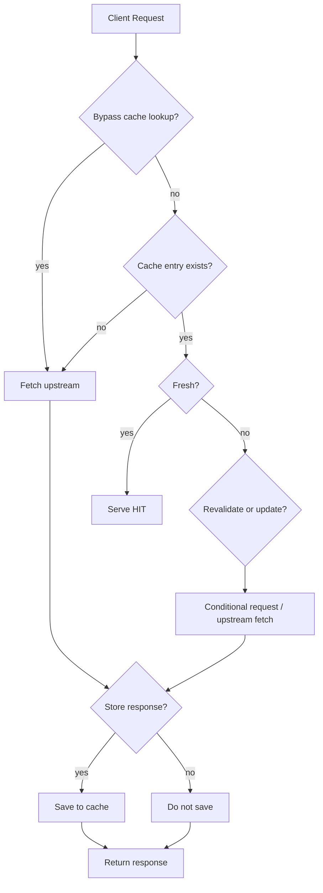
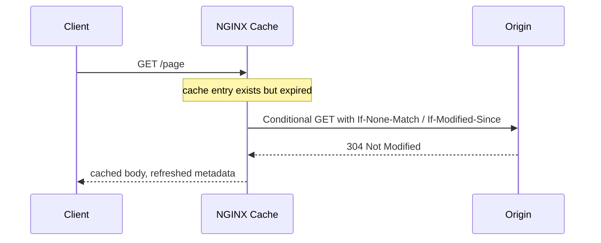

# Part 060 — `cache_bypass`, `no_cache`, and Revalidation

> Target mental model: cache policy has two independent decisions: “may I read from cache?” and “may I write this response to cache?” Confusing those two is one of the fastest ways to build an unsafe edge cache.

Part 059 explained where cached objects live and how identity is formed. Now we focus on cache control flow.

For each request, NGINX must decide:

1. **Lookup decision** — should this request be allowed to use an existing cache entry?
2. **Store decision** — if NGINX goes to upstream, should the upstream response be saved?
3. **Freshness decision** — if a cache entry exists, is it fresh enough to serve?
4. **Revalidation decision** — if expired, can NGINX ask upstream whether the old object is still valid?
5. **Stale decision** — if upstream is slow or broken, can NGINX serve an old object?

These are separate levers.



The important distinction:

```txt
proxy_cache_bypass -> do not read from cache for this request
proxy_no_cache     -> do not save this response to cache
```

They are often used together, but they are not the same directive.

---

## 1. Two gates: read gate and write gate

Think of NGINX cache like a tiny database:

```txt
read gate  -> may this request read a cached row?
write gate -> may this upstream response be inserted/updated?
```

### Read gate: `proxy_cache_bypass`

```nginx
proxy_cache_bypass $http_authorization;
```

Meaning:

```txt
If Authorization header is present, do not take response from cache.
```

But unless you also configure the write gate, NGINX may still store the upstream response if it is otherwise cacheable.

### Write gate: `proxy_no_cache`

```nginx
proxy_no_cache $http_authorization;
```

Meaning:

```txt
If Authorization header is present, do not save response to cache.
```

For auth-sensitive endpoints, you usually want both:

```nginx
proxy_cache_bypass $http_authorization;
proxy_no_cache     $http_authorization;
```

Without this separation, you can make subtle mistakes.

---

## 2. The canonical safety baseline

A safe baseline for public API cache often looks like this:

```nginx
map $http_authorization $has_authorization {
    default 1;
    ""      0;
}

map $cookie_session $has_session_cookie {
    default 1;
    ""      0;
}

map $request_method $cacheable_method {
    default 0;
    GET     1;
    HEAD    1;
}

map "$has_authorization:$has_session_cookie:$cacheable_method" $skip_cache {
    default 1;
    "0:0:1" 0;
}

location /api/public/ {
    proxy_cache api_public_cache;
    proxy_cache_key "host=$host|method=$request_method|uri=$uri|args=$args";

    proxy_cache_bypass $skip_cache;
    proxy_no_cache     $skip_cache;

    proxy_cache_valid 200 5m;
    proxy_cache_valid 404 30s;

    add_header X-Cache-Status $upstream_cache_status always;
    proxy_pass http://api_backend;
}
```

Interpretation:

```txt
Only anonymous GET/HEAD requests may read from cache.
Only anonymous GET/HEAD responses may be stored.
Everything else goes to origin and is not saved.
```

This is intentionally conservative.

---

## 3. `proxy_cache_bypass`: skip lookup, not storage

`proxy_cache_bypass` defines conditions under which NGINX will not take a response from cache.

Example:

```nginx
proxy_cache_bypass $arg_nocache;
```

Request:

```txt
GET /api/public/products/42?nocache=1
```

Behavior:

```txt
NGINX skips cache lookup and fetches from upstream.
```

But the response might still be stored unless another rule prevents it.

That can be correct for forced refresh patterns:

```txt
Admin or deploy process sends ?refresh=1.
NGINX bypasses existing cached value.
Origin returns fresh response.
NGINX stores fresh response.
Future normal clients get refreshed cache.
```

It can also be dangerous:

```txt
Client sends Authorization header.
NGINX bypasses cache lookup.
Origin returns user-specific response.
NGINX stores it.
Anonymous client later gets it.
```

So distinguish these two categories:

| Bypass reason | Should response be stored? |
|---|---|
| Forced refresh of public object | Maybe yes |
| Authorization/session present | Usually no |
| Preview/draft mode | Usually no |
| Debug request | Usually no |
| Cache poisoning suspicion | No |
| Admin purge/fill workflow | Maybe yes, carefully |

---

## 4. `proxy_no_cache`: skip storage, not lookup

`proxy_no_cache` defines conditions under which the upstream response will not be saved to cache.

Example:

```nginx
proxy_no_cache $http_authorization;
```

But if you only set `proxy_no_cache`, NGINX may still read an existing cached public response for an authorized request unless you also bypass lookup.

That might be correct for some routes:

```txt
Authorized users can see the same public content as everyone else,
but their personalized response should never be stored if origin varies.
```

But for `/api/me`, it is wrong. `/api/me` should not use a public cached response at all.

### Safe auth-sensitive pattern

```nginx
proxy_cache_bypass $http_authorization $cookie_session;
proxy_no_cache     $http_authorization $cookie_session;
```

### Public content with optional auth pattern

Sometimes authorization affects only permissions, not representation. Example:

```txt
GET /docs/public/install-nginx
```

Authenticated and anonymous users receive identical body.

Possible policy:

```nginx
# Allow reading public cache even with auth.
# Do not store response from auth request, just in case origin adds personalization.
proxy_no_cache $http_authorization $cookie_session;
```

This is more nuanced, but must be documented per route.

Production invariant:

```txt
Do not decide auth cache behavior globally if route semantics differ.
```

---

## 5. Conditions: non-empty and not `0`

For `proxy_cache_bypass` and `proxy_no_cache`, NGINX treats a condition as true when at least one configured string is not empty and not equal to `0`.

This makes `map` very useful.

```nginx
map $http_authorization $auth_skip_cache {
    default 1;
    ""      0;
}

proxy_cache_bypass $auth_skip_cache;
proxy_no_cache     $auth_skip_cache;
```

Do not produce ambiguous values.

Good:

```txt
0 means false
1 means true
```

Avoid:

```txt
yes/no
true/false
empty/maybe
```

NGINX can handle arbitrary non-empty strings, but future readers benefit from a simple boolean convention.

---

## 6. Route-level cache policy table

Before writing directives, build a policy table.

Example:

| Route | Cache read | Cache write | TTL | Notes |
|---|---:|---:|---:|---|
| `/api/public/products/` | anonymous only | anonymous only | 5m | varies by lang/currency |
| `/api/public/categories/` | anonymous only | anonymous only | 30m | low mutation |
| `/api/search` | maybe | maybe | 30s | key must include query |
| `/api/me` | never | never | none | user-specific |
| `/api/admin/` | never | never | none | privileged |
| `/preview/` | never | never | none | draft content |
| `/assets/` | everyone | anonymous/public only | 30d | versioned URLs |

Then encode that table into config.

For example:

```nginx
location /api/me {
    proxy_cache off;
    proxy_pass http://api_backend;
}

location /api/admin/ {
    proxy_cache off;
    proxy_pass http://api_backend;
}

location /api/public/products/ {
    proxy_cache api_public_cache;
    proxy_cache_bypass $skip_cache;
    proxy_no_cache     $skip_cache;
    proxy_cache_valid 200 5m;
    proxy_pass http://api_backend;
}
```

The table is the design. The config is only the compiled artifact.

---

## 7. Origin headers vs NGINX directives

NGINX cache behavior can be controlled by origin response headers and NGINX directives.

Important origin headers:

```txt
Cache-Control
Expires
Set-Cookie
Vary
ETag
Last-Modified
X-Accel-Expires
```

Important NGINX directives:

```nginx
proxy_cache_valid
proxy_ignore_headers
proxy_hide_header
proxy_cache_revalidate
proxy_cache_use_stale
proxy_no_cache
proxy_cache_bypass
```

Default production posture:

```txt
Let origin own business freshness when possible.
Let NGINX own edge safety gates and operational fallback.
```

That means:

- application decides which objects are cacheable,
- NGINX refuses unsafe requests,
- NGINX adds observability,
- NGINX may define route-level default TTLs,
- NGINX may serve stale for resilience where acceptable.

### `proxy_cache_valid`

Example:

```nginx
proxy_cache_valid 200 302 10m;
proxy_cache_valid 404 30s;
```

This says:

```txt
If response is cacheable and no higher-priority origin header overrides it,
cache 200/302 for 10 minutes and 404 for 30 seconds.
```

Caching 404 can be useful for negative caching, but it can also delay newly created resources from appearing.

Use short TTLs for 404 unless route semantics prove otherwise.

---

## 8. `Set-Cookie` is a cache boundary

A response with `Set-Cookie` is not just a response body. It mutates client state.

If such a response is cached and replayed to another user, you can create serious security and correctness failures.

NGINX's proxy cache rules treat `Set-Cookie` as a signal that a response should not be cached by default.

Do not casually override this behavior.

Dangerous:

```nginx
proxy_ignore_headers Set-Cookie;
```

This does not merely hide a header. It tells NGINX to ignore that header's cache-control effect.

If your goal is to prevent `Set-Cookie` from reaching clients on public cacheable routes, handle it with route-specific upstream discipline or explicit header hiding only when you know the response is public.

Example for a public static-ish route where origin mistakenly adds harmless cookie:

```nginx
location /public-marketing/ {
    proxy_cache page_public_cache;
    proxy_hide_header Set-Cookie;
    proxy_ignore_headers Set-Cookie;
    proxy_cache_valid 200 10m;
    proxy_pass http://marketing_origin;
}
```

This is only acceptable if you own and verify the origin behavior. Otherwise, you may convert personalized pages into public cached pages.

---

## 9. `Vary`: representation dimensions and cache explosion

`Vary` says the response representation changes based on request headers.

Common examples:

```txt
Vary: Accept-Encoding
Vary: Accept-Language
Vary: User-Agent
```

Some `Vary` dimensions are controlled and low-cardinality. Others are cache killers.

`Accept-Encoding` is normal. gzip/brotli/plain variants are bounded.

`Accept-Language` can be high-cardinality unless bucketed.

`User-Agent` can be extremely high-cardinality.

Production strategy:

- avoid full `User-Agent` vary at edge,
- map device categories instead,
- map languages to supported locale buckets,
- keep key dimensions explicit,
- make origin and NGINX agree.

Example language bucket:

```nginx
map $http_accept_language $lang_bucket {
    default en;
    ~^id    id;
    ~^en    en;
    ~^ja    ja;
}

proxy_cache_key "host=$host|uri=$uri|lang=$lang_bucket";
```

This is safer than:

```nginx
proxy_cache_key "$host|$uri|$http_accept_language";
```

---

## 10. Revalidation: expired does not always mean refetch full body

When a cached object expires, NGINX can revalidate it with conditional requests if enabled:

```nginx
proxy_cache_revalidate on;
```

Then NGINX can use validators such as:

```txt
If-Modified-Since
If-None-Match
```

based on cached `Last-Modified` and `ETag` metadata.

If origin responds:

```txt
304 Not Modified
```

NGINX can refresh metadata and keep serving the cached body, avoiding a full body transfer.



Revalidation is useful when:

- bodies are large,
- origin can cheaply validate,
- ETag/Last-Modified are reliable,
- content changes unpredictably,
- you want lower origin bandwidth without long blind TTLs.

It is less useful when:

- origin does not emit validators,
- origin validator computation is expensive,
- TTL is very short and traffic is huge,
- stale serving is preferred over synchronous revalidation.

---

## 11. Freshness hierarchy

Think of freshness as layered:

```txt
1. Origin explicit headers: X-Accel-Expires, Cache-Control, Expires
2. NGINX route policy: proxy_cache_valid
3. Revalidation behavior: proxy_cache_revalidate
4. Stale behavior: proxy_cache_use_stale / stale directives
```

`X-Accel-Expires` is especially powerful because it is NGINX-specific and can set cache time directly.

Example origin response:

```http
HTTP/1.1 200 OK
Content-Type: application/json
X-Accel-Expires: 300
ETag: "product-42-v19"
```

This lets the application decide:

```txt
This response may be cached by NGINX for 300 seconds.
```

Use this when app-level business freshness differs by object.

Example:

```txt
Product with stable inventory: 300s
Product in flash sale: 5s
Product draft/preview: 0
```

---

## 12. Bypass vs purge vs refresh

These are different operations.

### Bypass

```txt
Do not read from cache for this request.
```

May or may not store the response.

### No-cache

```txt
Do not save this response.
```

May or may not read an existing cached response unless paired with bypass.

### Purge

```txt
Remove a cache entry.
```

Cache purge support depends on edition/module capabilities and operational design. Do not assume wildcard purge is available everywhere.

### Refresh

```txt
Fetch from origin and replace cache entry.
```

Can be implemented by bypassing lookup while allowing storage, but only for public safe objects.

Example forced public refresh:

```nginx
map $arg_refresh $refresh_cache {
    default 0;
    1       1;
}

location /api/public/products/ {
    proxy_cache api_public_cache;
    proxy_cache_bypass $refresh_cache;

    # Do not set proxy_no_cache for refresh.
    # We want refreshed public response to be stored.

    proxy_cache_valid 200 5m;
    proxy_pass http://catalog_api;
}
```

Protect this pattern. Otherwise any client can force origin traffic.

Better:

```nginx
geo $internal_refresh_allowed {
    default 0;
    10.0.0.0/8 1;
}

map "$arg_refresh:$internal_refresh_allowed" $refresh_cache {
    default 0;
    "1:1"   1;
}
```

---

## 13. Stale controls are resilience policy

Revalidation decides whether an expired object is still valid.

Stale controls decide whether an expired object may be served despite problems.

Example:

```nginx
proxy_cache_use_stale error timeout http_500 http_502 http_503 http_504 updating;
```

This says:

```txt
If the origin fails or the object is being updated, NGINX may serve stale cached content.
```

This is powerful. It can protect users from origin failures. It can also serve old data when freshness matters.

Good candidates:

- documentation pages,
- marketing pages,
- public catalog read models,
- image/media metadata,
- feature flag-independent public content.

Bad candidates:

- account balance,
- enforcement/legal status,
- payment state,
- fraud/risk decisions,
- admin console data,
- anything that must reflect immediate revocation.

Production invariant:

```txt
Serve-stale is a business correctness decision, not only an availability setting.
```

---

## 14. Cache lock: preventing thundering herd on MISS/EXPIRED

If many clients request the same uncached object at the same time, NGINX can send many duplicate requests to origin.

`proxy_cache_lock` changes that behavior:

```nginx
proxy_cache_lock on;
proxy_cache_lock_timeout 5s;
proxy_cache_lock_age 10s;
```

Conceptually:

```txt
Only one request populates a cache key.
Other requests wait for that object or eventually pass through.
```

This is most useful for hot keys:

```txt
homepage
popular product page
manifest file
large media metadata
expensive report read model
```

It is less helpful for high-cardinality long-tail keys where collisions are rare.

### Failure trade-off

If origin is slow and many clients wait behind a lock, client latency can rise. Tune lock timeout to match UX and origin protection goals.

```nginx
proxy_cache_lock on;
proxy_cache_lock_timeout 2s;
proxy_cache_lock_age 5s;
```

This says:

```txt
Wait briefly for a cache fill, but do not let users queue forever.
```

---

## 15. Background update

`proxy_cache_background_update on;` allows NGINX to start a background subrequest to update an expired cache item while returning stale cached content to the client.

Typical pattern:

```nginx
proxy_cache_use_stale updating error timeout http_500 http_502 http_503 http_504;
proxy_cache_background_update on;
```

This creates a smoother user experience for public content:

```txt
First request after expiry gets stale content immediately.
NGINX refreshes in background.
Later requests get fresh content.
```

Use this when stale-for-a-short-time is acceptable.

Do not use it blindly for strongly consistent APIs.

---

## 16. Authorization and session boundary patterns

### Pattern A: strict public-only cache

```nginx
map $http_authorization $has_auth {
    default 1;
    ""      0;
}

map $cookie_session $has_session {
    default 1;
    ""      0;
}

map "$has_auth:$has_session" $unsafe_cache_context {
    default 1;
    "0:0"  0;
}

location /api/public/ {
    proxy_cache api_public_cache;
    proxy_cache_bypass $unsafe_cache_context;
    proxy_no_cache     $unsafe_cache_context;
    proxy_pass http://api_backend;
}
```

This is the safest starting point.

### Pattern B: public cache readable by authenticated users

```nginx
location /docs/public/ {
    proxy_cache docs_public_cache;

    # Authenticated users may read public cached response.
    # But do not store a response generated under auth context.
    proxy_no_cache $http_authorization $cookie_session;

    proxy_cache_valid 200 10m;
    proxy_pass http://docs_backend;
}
```

This requires proof that representation is public.

### Pattern C: no edge cache for user-specific route

```nginx
location /api/me {
    proxy_cache off;
    proxy_pass http://api_backend;
}
```

Do not be clever here.

---

## 17. Preview, draft, and admin modes

Preview mode often leaks through innocent-looking query params or cookies:

```txt
?preview=true
?draft=1
Cookie: preview_session=...
```

Policy:

```nginx
map $arg_preview $preview_arg {
    default 1;
    ""      0;
    "0"     0;
}

map $cookie_preview_session $preview_cookie {
    default 1;
    ""      0;
}

map "$preview_arg:$preview_cookie" $preview_mode {
    default 1;
    "0:0"  0;
}

location /pages/ {
    proxy_cache page_public_cache;
    proxy_cache_bypass $preview_mode;
    proxy_no_cache     $preview_mode;
    proxy_pass http://page_backend;
}
```

If preview and public content share URI paths, this protection is mandatory.

Better architecture:

```txt
preview.example.com -> never cached
www.example.com     -> public cache allowed
```

Separate hostnames are easier to reason about than many hidden mode flags.

---

## 18. Debugging cache behavior

Add headers during rollout:

```nginx
add_header X-Cache-Status $upstream_cache_status always;
add_header X-Cache-Key-Debug "$host|$request_method|$uri|$args" always;
```

Do not expose full cache key debug publicly if it contains sensitive dimensions. For internal/staging only.

Better production-safe logs:

```nginx
log_format cache_json escape=json
    '{'
      '"ts":"$time_iso8601",'
      '"host":"$host",'
      '"method":"$request_method",'
      '"uri":"$uri",'
      '"status":$status,'
      '"cache":"$upstream_cache_status",'
      '"skip_cache":"$skip_cache",'
      '"upstream_status":"$upstream_status",'
      '"request_time":$request_time,'
      '"upstream_response_time":"$upstream_response_time"'
    '}';
```

### Debug flow

For a suspicious cache hit:

```txt
1. Confirm route and location matched.
2. Confirm proxy_cache zone used.
3. Inspect $upstream_cache_status.
4. Reconstruct cache key dimensions.
5. Check auth/session/preview bypass flags.
6. Check origin response headers: Cache-Control, Set-Cookie, Vary, ETag.
7. Check proxy_no_cache conditions.
8. Check TTL and revalidation behavior.
9. Check whether stale was used.
10. Check whether another location inherited unexpected cache config.
```

---

## 19. Common failure modes

### Failure mode 1: using `proxy_cache_bypass` without `proxy_no_cache`

Config:

```nginx
proxy_cache_bypass $http_authorization;
```

Problem:

```txt
Authorized requests bypass lookup but may still store user-specific response.
```

Fix:

```nginx
proxy_cache_bypass $http_authorization;
proxy_no_cache     $http_authorization;
```

### Failure mode 2: using `proxy_no_cache` without `proxy_cache_bypass`

Config:

```nginx
proxy_no_cache $http_authorization;
```

Problem:

```txt
Authorized request may still read an existing cached public response.
This may or may not be correct depending on route.
```

Fix for user-specific routes:

```nginx
proxy_cache_bypass $http_authorization;
proxy_no_cache     $http_authorization;
```

### Failure mode 3: public refresh endpoint creates origin DoS

Config:

```nginx
proxy_cache_bypass $arg_refresh;
```

Problem:

```txt
Anyone can add ?refresh=1 and force origin traffic.
```

Fix:

```nginx
geo $refresh_allowed {
    default 0;
    10.0.0.0/8 1;
}

map "$arg_refresh:$refresh_allowed" $refresh_cache {
    default 0;
    "1:1" 1;
}

proxy_cache_bypass $refresh_cache;
```

### Failure mode 4: stale content violates business invariant

Config:

```nginx
proxy_cache_use_stale error timeout http_500 http_502 http_503 http_504;
```

Problem:

```txt
Edge serves old data for route where old data is legally/financially unsafe.
```

Fix:

- disable stale for that route,
- separate cache zones/routes,
- get product/legal decision for stale tolerance,
- use explicit route policy table.

### Failure mode 5: origin emits inconsistent cache headers

Symptom:

```txt
Some responses cache, some do not, seemingly randomly.
```

Likely causes:

- `Set-Cookie` sometimes present,
- `Cache-Control: private` sometimes present,
- missing validators,
- different upstream instances emit different headers,
- CDN/app/framework middleware changes headers.

Fix:

- log response cache status,
- inspect origin headers per upstream instance,
- standardize application cache contract,
- add automated tests for headers.

---

## 20. A production cache policy example

```nginx
http {
    proxy_cache_path /var/cache/nginx/catalog_public
        levels=1:2
        keys_zone=catalog_public_cache:200m
        max_size=30g
        min_free=5g
        inactive=1h
        use_temp_path=off;

    map $http_authorization $has_auth {
        default 1;
        ""      0;
    }

    map $cookie_session $has_session {
        default 1;
        ""      0;
    }

    map $arg_preview $has_preview {
        default 1;
        ""      0;
        "0"     0;
    }

    map $request_method $cacheable_method {
        default 0;
        GET     1;
        HEAD    1;
    }

    map "$has_auth:$has_session:$has_preview:$cacheable_method" $skip_public_cache {
        default   1;
        "0:0:0:1" 0;
    }

    map $arg_lang $cache_lang {
        default $arg_lang;
        ""      en;
    }

    map $arg_currency $cache_currency {
        default $arg_currency;
        ""      USD;
    }

    upstream catalog_backend {
        zone catalog_backend 64k;
        server 10.0.10.21:8080 max_fails=2 fail_timeout=10s;
        server 10.0.10.22:8080 max_fails=2 fail_timeout=10s;
        keepalive 64;
    }

    server {
        listen 443 ssl http2;
        server_name api.example.com;

        location /api/public/products/ {
            proxy_http_version 1.1;
            proxy_set_header Connection "";
            proxy_set_header Host $host;
            proxy_set_header X-Real-IP $remote_addr;
            proxy_set_header X-Forwarded-For $proxy_add_x_forwarded_for;
            proxy_set_header X-Forwarded-Proto $scheme;

            proxy_cache catalog_public_cache;
            proxy_cache_key "host=$host|method=$request_method|uri=$uri|lang=$cache_lang|currency=$cache_currency";

            proxy_cache_bypass $skip_public_cache;
            proxy_no_cache     $skip_public_cache;

            proxy_cache_valid 200 5m;
            proxy_cache_valid 404 30s;
            proxy_cache_revalidate on;
            proxy_cache_lock on;
            proxy_cache_lock_timeout 2s;
            proxy_cache_use_stale error timeout http_500 http_502 http_503 http_504 updating;
            proxy_cache_background_update on;

            add_header X-Cache-Status $upstream_cache_status always;

            proxy_pass http://catalog_backend;
        }

        location /api/me {
            proxy_cache off;
            proxy_pass http://catalog_backend;
        }
    }
}
```

This config encodes a clear contract:

```txt
- public product reads may cache only for anonymous GET/HEAD
- preview/auth/session requests bypass and do not store
- key varies by host, method, path, language, and currency
- expired entries can revalidate
- stale may be served on origin failure for this route
- user-specific route is explicitly uncached
```

---

## 21. Tests you should run before rollout

### Anonymous request caches

```bash
curl -si 'https://api.example.com/api/public/products/42?lang=id&currency=IDR' | grep -i x-cache-status
curl -si 'https://api.example.com/api/public/products/42?lang=id&currency=IDR' | grep -i x-cache-status
```

Expected:

```txt
first: MISS
second: HIT
```

### Authorization bypasses and does not store

```bash
curl -si -H 'Authorization: Bearer test' \
  'https://api.example.com/api/public/products/42?lang=id&currency=IDR' \
  | grep -i x-cache-status
```

Expected:

```txt
BYPASS or no HIT
```

Then repeat anonymous request and confirm it did not receive an auth-personalized response.

### Preview does not store

```bash
curl -si 'https://api.example.com/api/public/products/42?preview=1' | grep -i x-cache-status
curl -si 'https://api.example.com/api/public/products/42' | grep -i x-cache-status
```

Expected:

```txt
Preview request does not poison public cache.
```

### 404 negative caching

```bash
curl -si 'https://api.example.com/api/public/products/not-found' | grep -i x-cache-status
curl -si 'https://api.example.com/api/public/products/not-found' | grep -i x-cache-status
```

Expected:

```txt
MISS then HIT if 404 caching is enabled.
TTL must be short.
```

### Revalidation

Use an origin that emits `ETag` or `Last-Modified`, wait for TTL expiry, then check for `REVALIDATED` behavior and origin `304` responses.

---

## 22. Review checklist

Before merging cache policy:

```txt
[ ] Are read and write gates separate in the design?
[ ] Are auth/session/preview/debug requests handled explicitly?
[ ] Are public refresh controls protected from arbitrary clients?
[ ] Does every cached route have a TTL policy?
[ ] Are 404/301/302 TTLs intentionally chosen?
[ ] Does origin emit stable Cache-Control/ETag/Last-Modified headers?
[ ] Are Set-Cookie responses prevented from unsafe caching?
[ ] Is Vary behavior understood and bounded?
[ ] Is revalidation enabled only where validators are reliable?
[ ] Is serve-stale approved for the route's business correctness?
[ ] Is cache lock useful for this route's hot-key profile?
[ ] Is $upstream_cache_status logged?
[ ] Are there tests proving auth content cannot enter public cache?
```

---

## 23. The core lesson

Do not think of NGINX cache as a binary switch.

Think in five questions:

```txt
Can this request read from cache?
Can this upstream response be written to cache?
How long is the object fresh?
Can an expired object be revalidated cheaply?
Can stale data be served during upstream failure?
```

`proxy_cache_bypass` answers the first question.

`proxy_no_cache` answers the second.

`proxy_cache_valid`, origin headers, and `X-Accel-Expires` answer the third.

`proxy_cache_revalidate` answers the fourth.

`proxy_cache_use_stale` and background update answer the fifth.

Top-tier NGINX work is not about enabling all of them. It is about composing only the ones that preserve the business invariant of each route.

---

## References

- NGINX `ngx_http_proxy_module`: `proxy_cache_bypass`, `proxy_no_cache`, `proxy_cache_valid`, `proxy_cache_revalidate`, `proxy_cache_use_stale`, `proxy_cache_lock`, `proxy_cache_background_update` — https://nginx.org/en/docs/http/ngx_http_proxy_module.html
- F5/NGINX Admin Guide: NGINX Content Caching — https://docs.nginx.com/nginx/admin-guide/content-cache/content-caching/
- NGINX `ngx_http_headers_module`: `add_header`, `expires`, cache-related response headers — https://nginx.org/en/docs/http/ngx_http_headers_module.html
