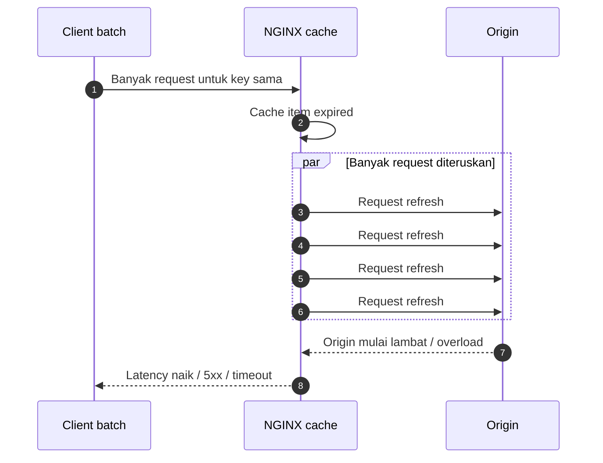
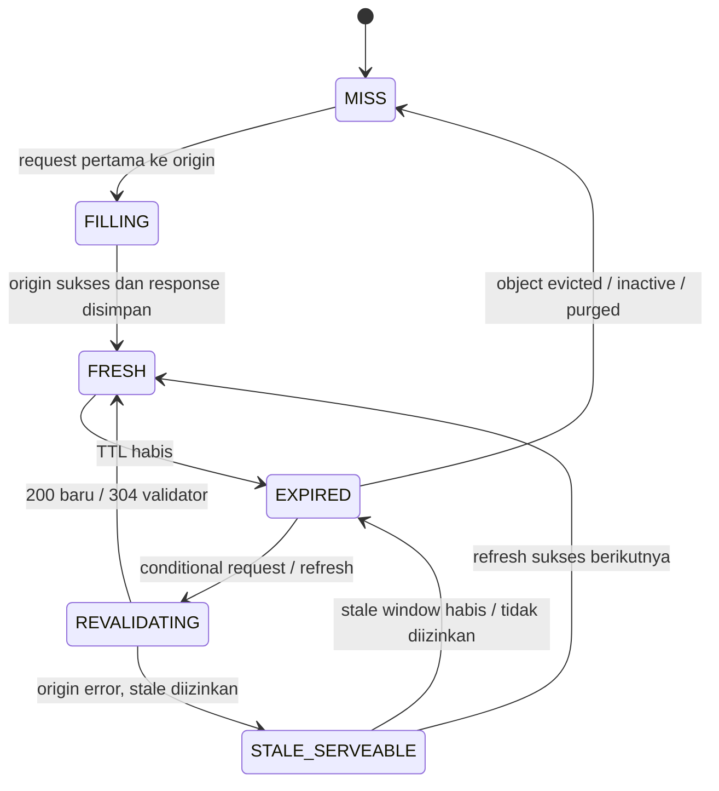
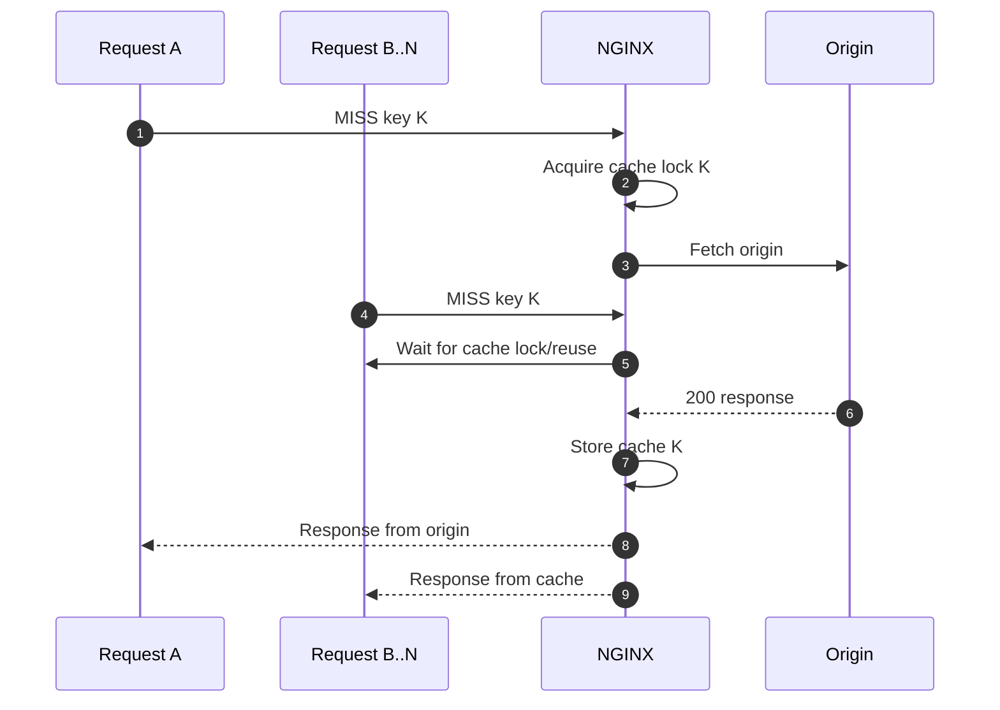
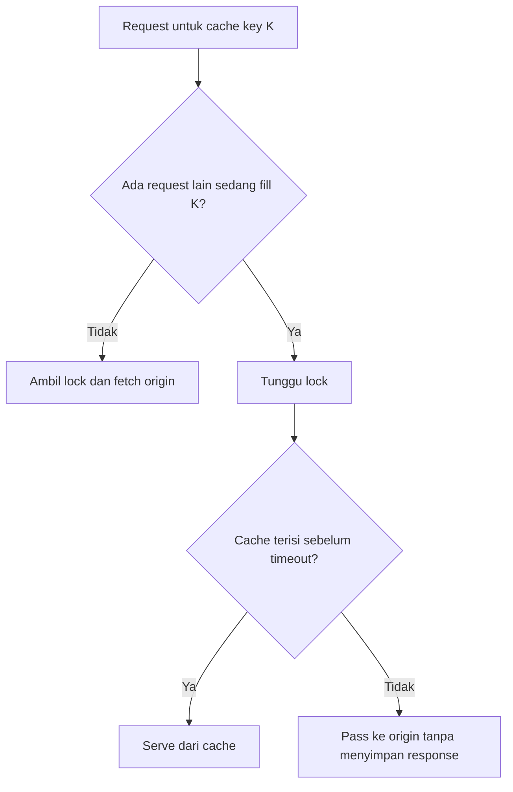
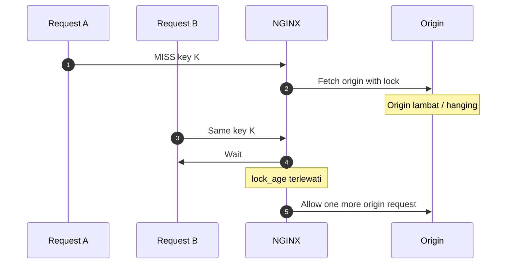
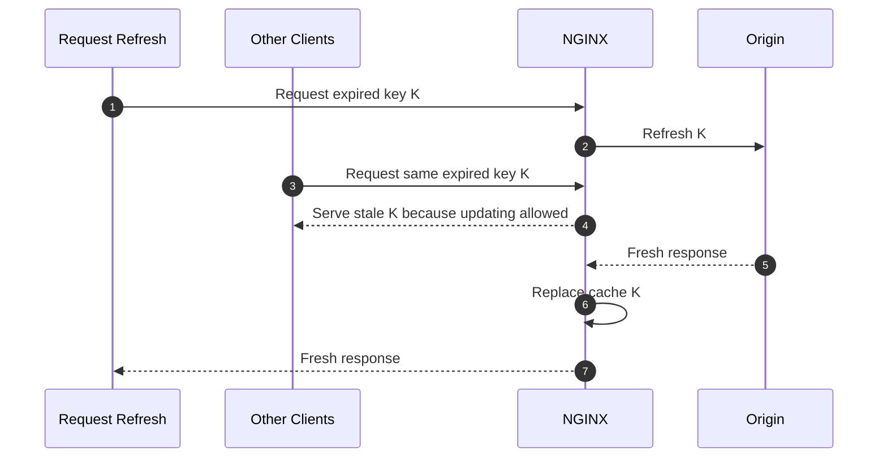
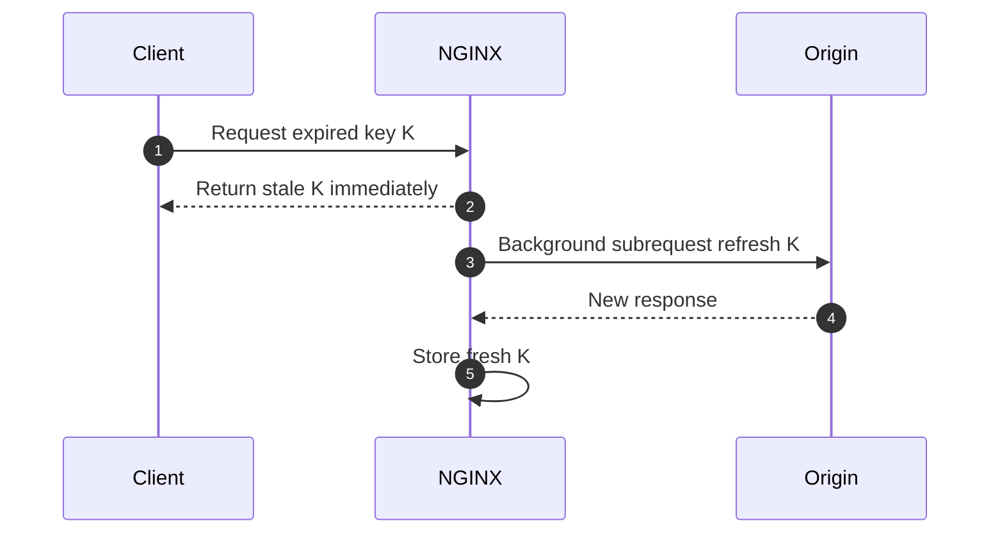
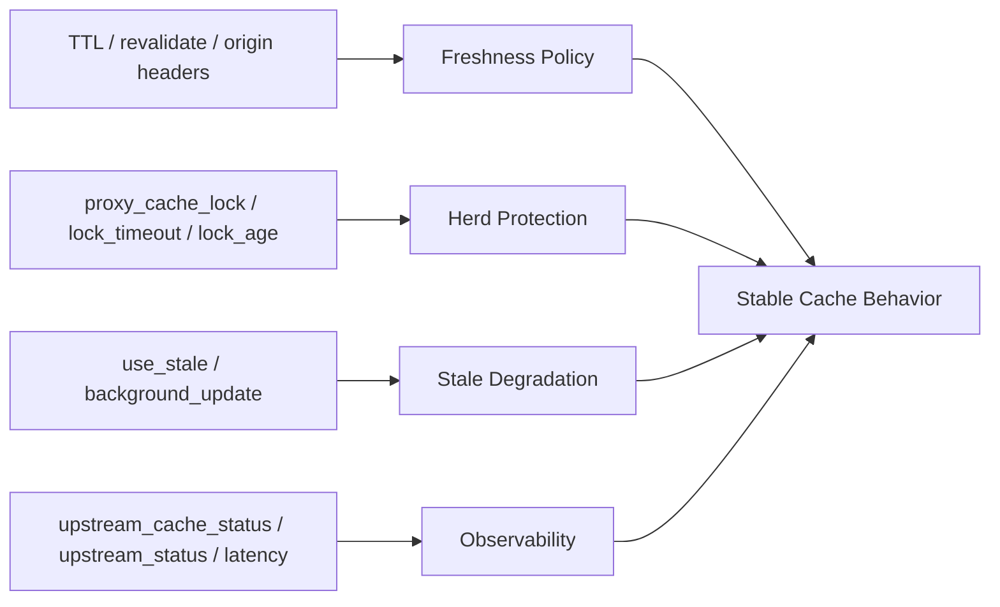

# Part 061 — Stale Cache, Cache Lock, Background Update, and Thundering Herd

> Cache yang bagus bukan hanya membuat response lebih cepat. Cache yang bagus mencegah origin runtuh ketika traffic naik, origin lambat, item populer expired bersamaan, atau deployment backend menghasilkan error sementara.

Di part sebelumnya kita sudah membahas `proxy_cache_path`, `keys_zone`, cache key, storage layout, `proxy_cache_bypass`, `proxy_no_cache`, dan revalidation. Sekarang kita masuk ke bagian yang lebih operasional: **apa yang terjadi ketika cache miss, expired, atau origin gagal**.

Part ini menjawab pertanyaan production-level berikut:

- Ketika cache item expired dan ribuan request datang bersamaan, siapa yang boleh memukul origin?
- Apakah lebih baik mengembalikan data lama atau menunggu origin?
- Bagaimana mencegah thundering herd tanpa membuat user menerima response terlalu stale?
- Bagaimana `proxy_cache_lock`, `proxy_cache_use_stale`, `proxy_cache_background_update`, dan `proxy_cache_revalidate` bekerja bersama?
- Apa failure mode dari stale cache yang salah desain?

Kita tidak akan memperlakukan cache sebagai fitur “tambahkan directive lalu selesai”. Kita akan memperlakukannya sebagai **state machine kecil**.

---

## 1. Masalah sebenarnya: synchronized cache expiry

Misalkan endpoint ini sangat populer:

```txt
GET /api/catalog/homepage
```

Kita cache selama 60 detik.

```nginx
proxy_cache_valid 200 60s;
```

Pada detik ke-60, item expired. Lalu 10.000 client datang hampir bersamaan.

Tanpa kontrol tambahan, banyak request bisa melihat cache sebagai expired/miss dan mencoba memperbarui item dari origin. Ini disebut **thundering herd** atau **cache stampede**.

Masalahnya bukan hanya jumlah request. Masalahnya adalah efek berantai:



Cache yang seharusnya melindungi origin justru menjadi amplifier.

Top 1% engineer tidak hanya bertanya:

> “Apakah endpoint ini cacheable?”

Mereka bertanya:

> “Apa yang terjadi ketika item paling populer expired saat traffic puncak dan origin sedang lambat?”

---

## 2. Cache item state machine

Untuk berpikir jernih, bayangkan setiap cache key punya state:



Directive NGINX yang akan kita bahas memengaruhi transition ini:

| Directive | Peran |
|---|---|
| `proxy_cache_lock` | Mengontrol siapa yang boleh mengisi cache item baru atau expired agar tidak semua request memukul origin. |
| `proxy_cache_lock_timeout` | Batas waktu request lain menunggu lock. |
| `proxy_cache_lock_age` | Batas waktu sebelum satu request tambahan boleh lewat jika filler pertama terlalu lama. |
| `proxy_cache_use_stale` | Menentukan kapan stale response boleh dipakai. |
| `proxy_cache_background_update` | Mengembalikan stale ke client sambil refresh dilakukan di background subrequest. |
| `proxy_cache_revalidate` | Menggunakan conditional request (`If-Modified-Since`, `If-None-Match`) untuk expired object. |
| `proxy_cache_valid` | Menentukan fresh lifetime per status code. |
| Origin `Cache-Control` | Bisa memberi policy seperti `stale-while-revalidate` dan `stale-if-error`. |

---

## 3. Baseline cache tanpa herd protection

Contoh baseline sederhana:

```nginx
proxy_cache_path /var/cache/nginx/api
    levels=1:2
    keys_zone=api_cache:100m
    max_size=20g
    inactive=30m
    use_temp_path=off;

upstream api_origin {
    server 10.10.1.10:8080;
    server 10.10.1.11:8080;
    keepalive 64;
}

server {
    listen 443 ssl http2;
    server_name api.example.com;

    location /catalog/ {
        proxy_pass http://api_origin;
        proxy_http_version 1.1;
        proxy_set_header Connection "";
        proxy_set_header Host $host;
        proxy_set_header X-Request-Id $request_id;

        proxy_cache api_cache;
        proxy_cache_key "$scheme|$host|$request_method|$uri|$is_args$args";
        proxy_cache_valid 200 1m;
        proxy_cache_valid 404 10s;

        add_header X-Cache-Status $upstream_cache_status always;
    }
}
```

Ini bekerja, tetapi belum cukup aman untuk endpoint populer. Ketika key expired, banyak request bisa berebut refresh.

---

## 4. `proxy_cache_lock`: hanya satu request yang mengisi key yang sama

`proxy_cache_lock on` membuat NGINX hanya mengizinkan satu request pada satu waktu untuk mengisi cache element tertentu. Request lain untuk cache key yang sama menunggu sampai response muncul di cache atau lock dilepas.

```nginx
location /catalog/ {
    proxy_pass http://api_origin;

    proxy_cache api_cache;
    proxy_cache_key "$scheme|$host|$request_method|$uri|$is_args$args";
    proxy_cache_valid 200 1m;

    proxy_cache_lock on;
    proxy_cache_lock_timeout 3s;
    proxy_cache_lock_age 10s;

    add_header X-Cache-Status $upstream_cache_status always;
}
```

Mental model-nya:



### Invariant

Gunakan `proxy_cache_lock` untuk item yang:

- populer,
- expensive di origin,
- memiliki TTL cukup pendek,
- sering expired saat traffic masih tinggi,
- tidak boleh menghasilkan ratusan refresh serentak.

### Trade-off

`proxy_cache_lock` menukar **origin protection** dengan **waiting latency** pada request yang datang saat miss/expired.

Jika origin cepat, bagus. Jika origin lambat, request yang menunggu lock bisa mengalami tail latency tinggi. Karena itu `proxy_cache_lock_timeout` penting.

---

## 5. `proxy_cache_lock_timeout`: jangan biarkan request menunggu tanpa batas

`proxy_cache_lock_timeout` menentukan berapa lama request menunggu lock. Jika timeout habis, request diteruskan ke origin, tetapi response-nya tidak akan disimpan ke cache.

```nginx
proxy_cache_lock on;
proxy_cache_lock_timeout 2s;
```

State-nya:



### Dampak yang perlu dimengerti

Jika timeout terlalu pendek:

- banyak request tetap menembus ke origin;
- herd tidak benar-benar hilang;
- cache lock hanya mengurangi sedikit tekanan.

Jika timeout terlalu panjang:

- user menunggu terlalu lama;
- request queue di NGINX meningkat;
- tail latency memburuk;
- client mungkin disconnect duluan sehingga muncul `499`.

### Rule of thumb

Gunakan lock timeout berdasarkan **expected origin latency untuk key tersebut**, bukan angka global sembarangan.

Contoh:

```nginx
# endpoint cepat dan populer
proxy_cache_lock_timeout 1s;

# endpoint mahal tapi masih bisa menunggu sedikit
proxy_cache_lock_timeout 3s;

# endpoint streaming atau interactive: biasanya jangan cache-lock seperti ini
```

---

## 6. `proxy_cache_lock_age`: safety valve ketika filler pertama terlalu lama

`proxy_cache_lock_age` menentukan kapan satu request tambahan boleh diteruskan ke origin walaupun request pertama masih mengisi cache.

```nginx
proxy_cache_lock on;
proxy_cache_lock_age 10s;
```

Tujuannya adalah mencegah situasi ketika request pertama menggantung terlalu lama dan semua request lain terus menunggu lock.



### Invariant

`proxy_cache_lock_age` bukan pengganti timeout origin. Tetap set:

```nginx
proxy_connect_timeout 1s;
proxy_read_timeout 5s;
proxy_send_timeout 5s;
```

Tanpa timeout yang masuk akal, lock age hanya menambah request tambahan ke origin yang mungkin sudah bermasalah.

---

## 7. `proxy_cache_use_stale`: stale sebagai resilience primitive

Secara default, stale response tidak otomatis dipakai. Dengan `proxy_cache_use_stale`, kita bisa menentukan kondisi ketika stale response boleh dikembalikan.

Contoh:

```nginx
proxy_cache_use_stale error timeout invalid_header http_500 http_502 http_503 http_504 updating;
```

Artinya, jika cache item sudah stale tetapi origin error/timeout/5xx, NGINX boleh mengembalikan stale response.

### Ini bukan sekadar performance

Stale cache adalah **degraded mode**.

Ketika origin rusak, user lebih baik menerima data katalog 2 menit lama daripada halaman 502. Tetapi untuk saldo rekening, status pembayaran, enforcement decision, atau data legal/regulatory, stale response bisa berbahaya.

Jadi pertanyaannya bukan:

> “Apakah stale cepat?”

Pertanyaannya:

> “Apakah stale response masih benar secara bisnis dan defensible?”

---

## 8. Stale policy harus route-specific

Jangan membuat policy global seperti ini tanpa klasifikasi:

```nginx
# Terlalu kasar untuk production yang serius
proxy_cache_use_stale error timeout http_500 http_502 http_503 http_504 updating;
```

Lebih baik pisahkan route:

```nginx
# Public catalog: stale acceptable
location /catalog/ {
    proxy_cache api_cache;
    proxy_cache_valid 200 2m;
    proxy_cache_use_stale error timeout http_500 http_502 http_503 http_504 updating;
    proxy_cache_lock on;
    proxy_pass http://catalog_origin;
}

# User account: stale not acceptable
location /account/ {
    proxy_cache off;
    proxy_pass http://account_origin;
}

# Semi-static policy documents: stale acceptable on error, longer TTL
location /public/policies/ {
    proxy_cache doc_cache;
    proxy_cache_valid 200 30m;
    proxy_cache_use_stale error timeout http_500 http_502 http_503 http_504;
    proxy_pass http://doc_origin;
}
```

---

## 9. `updating`: stale while refresh sedang berlangsung

Parameter `updating` pada `proxy_cache_use_stale` mengizinkan stale response dipakai ketika cache item sedang diperbarui.

```nginx
proxy_cache_use_stale updating;
```

Mental model:



Ini sangat berguna untuk item populer. Tanpa `updating`, request lain mungkin menunggu lock atau meneruskan ke origin tergantung konfigurasi.

### Risiko

User bisa menerima data stale selama refresh berlangsung. Itu baik untuk homepage, buruk untuk data transaksi.

---

## 10. `proxy_cache_background_update`: refresh di belakang layar

`proxy_cache_background_update on` mengizinkan NGINX memulai subrequest background untuk memperbarui expired cache item, sambil stale response dikembalikan ke client.

```nginx
proxy_cache_background_update on;
proxy_cache_use_stale updating;
```

Penting: background update membutuhkan stale usage diizinkan, karena request utama akan menerima stale sementara update berjalan.



### Kapan cocok

Cocok untuk:

- homepage fragment;
- public catalog;
- public search suggestion;
- CDN-like static dynamic pages;
- expensive read endpoint dengan tolerance stale rendah-menengah.

Kurang cocok untuk:

- endpoint yang harus strongly current;
- endpoint personalized;
- endpoint yang response-nya tergantung authorization;
- endpoint yang tidak punya validator/TTL jelas;
- endpoint dengan side effect walaupun method `GET`.

---

## 11. Kombinasi recommended: lock + stale + background update

Untuk route publik dan populer:

```nginx
location /catalog/ {
    proxy_pass http://catalog_origin;
    proxy_http_version 1.1;
    proxy_set_header Connection "";
    proxy_set_header Host $host;
    proxy_set_header X-Request-Id $request_id;

    proxy_cache catalog_cache;
    proxy_cache_key "$scheme|$host|$uri|$is_args$args";
    proxy_cache_valid 200 2m;
    proxy_cache_valid 404 15s;

    # Herd protection
    proxy_cache_lock on;
    proxy_cache_lock_timeout 2s;
    proxy_cache_lock_age 10s;

    # Resilience
    proxy_cache_use_stale error timeout invalid_header http_500 http_502 http_503 http_504 updating;
    proxy_cache_background_update on;
    proxy_cache_revalidate on;

    # Origin failure boundary
    proxy_connect_timeout 1s;
    proxy_send_timeout 3s;
    proxy_read_timeout 5s;

    add_header X-Cache-Status $upstream_cache_status always;
}
```

### Apa yang dilakukan konfigurasi ini?

- Cache fresh dipakai langsung.
- Jika miss, satu request mengisi cache, request lain menunggu sebentar.
- Jika expired, stale bisa dikembalikan saat update.
- Jika origin error, stale bisa melindungi client.
- Jika origin punya `ETag`/`Last-Modified`, revalidation bisa menghemat transfer.
- Jika origin lambat, timeout membatasi damage.

---

## 12. Jangan memakai stale untuk menyembunyikan origin yang rusak permanen

Stale response bisa membuat sistem terlihat sehat padahal origin gagal total.

Contoh dashboard yang menipu:

```txt
Client 2xx rate: 99.9%
Origin 5xx rate: 80%
Cache status: STALE high
```

Dari perspektif user, sistem terlihat “masih jalan”. Dari perspektif data freshness, sistem sedang rusak.

### Invariant observability

Jika stale diaktifkan, wajib ukur:

- stale response rate;
- stale age jika bisa diturunkan;
- origin error rate;
- origin refresh latency;
- cache lock wait effect;
- cache HIT/MISS/EXPIRED/STALE/UPDATING distribution;
- route label.

Minimal log:

```nginx
log_format cache_json escape=json
'{'
  '"time":"$time_iso8601",'
  '"request_id":"$request_id",'
  '"host":"$host",'
  '"uri":"$uri",'
  '"status":$status,'
  '"cache_status":"$upstream_cache_status",'
  '"upstream_status":"$upstream_status",'
  '"upstream_addr":"$upstream_addr",'
  '"request_time":$request_time,'
  '"upstream_response_time":"$upstream_response_time"'
'}';

access_log /var/log/nginx/cache_access.json cache_json;
```

---

## 13. `$upstream_cache_status`: membaca perilaku cache

`$upstream_cache_status` bisa berisi nilai seperti:

| Status | Arti operasional |
|---|---|
| `MISS` | Tidak ada object usable; request ke origin. |
| `BYPASS` | Cache lookup dilewati oleh `proxy_cache_bypass`. |
| `EXPIRED` | Object ada tetapi expired; origin dipakai untuk refresh. |
| `STALE` | Stale object dikembalikan karena policy mengizinkan. |
| `UPDATING` | Stale dikembalikan saat update sedang berlangsung. |
| `REVALIDATED` | Object expired direvalidasi dengan origin. |
| `HIT` | Fresh object dipakai dari cache. |

Jangan hanya melihat HIT ratio. Untuk production, breakdown lebih penting:

```txt
HIT 70%, MISS 5%, EXPIRED 10%, STALE 10%, UPDATING 5%
```

Ini berbeda dari:

```txt
HIT 70%, MISS 25%, STALE 5%
```

Keduanya punya HIT ratio serupa, tetapi failure model berbeda.

---

## 14. Revalidation: expired tidak selalu berarti download ulang

Dengan:

```nginx
proxy_cache_revalidate on;
```

NGINX dapat menggunakan conditional requests untuk expired cache items, memakai header seperti:

```http
If-Modified-Since: ...
If-None-Match: ...
```

Jika origin menjawab:

```http
304 Not Modified
```

NGINX bisa memperpanjang cache object tanpa mengambil body penuh lagi.

### Kapan berguna

- object besar;
- origin bisa menghasilkan `ETag` atau `Last-Modified` benar;
- content jarang berubah tapi TTL pendek;
- network origin mahal;
- cache object sering direfresh.

### Kapan tidak berguna

- origin tidak memberi validator;
- validator tidak stabil;
- origin menghasilkan `ETag` berbeda untuk body sama;
- response personalized tapi cache key tidak memisah user;
- endpoint selalu berubah.

---

## 15. Origin header vs NGINX directive: siapa menang?

Untuk caching duration, origin header bisa punya prioritas lebih tinggi daripada directive tertentu. Ini bagus jika origin adalah pemilik domain data. Tetapi di platform besar, origin kadang tidak konsisten.

Contoh origin buruk:

```http
Cache-Control: public, max-age=3600
Set-Cookie: session=abc
```

Atau:

```http
Cache-Control: no-store
```

padahal endpoint public catalog seharusnya cacheable.

NGINX punya `proxy_ignore_headers`, tetapi ini berbahaya jika dipakai sembarangan.

```nginx
# Jangan global tanpa review domain data
proxy_ignore_headers Cache-Control Expires Set-Cookie;
```

### Rule

Gunakan `proxy_ignore_headers` hanya jika:

- route benar-benar public;
- origin contract sudah terdokumentasi;
- cache key sudah aman;
- tidak ada user-specific data;
- ada automated test untuk header leak;
- owner route menyetujui edge override.

---

## 16. Cache lock bukan queue universal

Kesalahan umum: mengira `proxy_cache_lock` adalah request queue yang melindungi semua overload. Bukan.

`proxy_cache_lock` hanya berlaku untuk cache key yang sama. Jika ada 100.000 key berbeda yang miss bersamaan, lock tidak membantu banyak.

Contoh buruk:

```txt
/api/product/1
/api/product/2
/api/product/3
...
/api/product/100000
```

Masing-masing key berbeda. Masing-masing bisa memukul origin.

Untuk masalah ini, butuh kombinasi:

- rate limit;
- connection limit;
- upstream capacity control;
- cache warming;
- TTL jitter di origin/control plane;
- precomputed aggregate pages;
- query normalization;
- admission control.

---

## 17. TTL jitter: menghindari expiry bersamaan

NGINX directive standar tidak memberi random TTL per item secara langsung untuk `proxy_cache_valid`. Tetapi secara arsitektur, kamu bisa menghindari expiry sinkron dengan:

- origin mengirim `Cache-Control: max-age` yang memiliki jitter;
- cache warming bertahap;
- memisahkan cache key populer ke TTL berbeda;
- menggunakan background refresh sebelum traffic puncak;
- tidak deploy semua key populer dengan TTL sama di waktu yang sama.

Contoh origin-side idea:

```txt
base_ttl = 300 seconds
jitter = random(-30, +30)
Cache-Control: public, max-age=base_ttl + jitter
```

Tujuannya bukan random demi random. Tujuannya menyebarkan refresh pressure.

---

## 18. Negative caching: 404/410 juga bisa menciptakan herd

Endpoint yang sering dicari tetapi tidak ada bisa membebani origin.

Contoh:

```txt
GET /products/non-existent-slug
```

Jika tidak cache 404, bot atau user typo bisa memukul origin terus.

```nginx
proxy_cache_valid 404 30s;
proxy_cache_valid 410 10m;
```

Tetapi hati-hati:

- 404 pada data baru dibuat bisa berubah menjadi 200 cepat;
- 404 authorization-masked tidak boleh dicache public;
- tenant-specific 404 harus memasukkan tenant ke cache key;
- route admin/user tidak boleh negative-cache tanpa analisis.

---

## 19. `stale-if-error` dan `stale-while-revalidate` dari origin

Selain directive NGINX, origin bisa mengirim extension `Cache-Control`:

```http
Cache-Control: public, max-age=60, stale-while-revalidate=30, stale-if-error=300
```

Maknanya:

- fresh selama 60 detik;
- boleh stale saat revalidate selama 30 detik;
- boleh stale saat error selama 300 detik.

Namun jangan mengandalkan header ini tanpa verifikasi versi dan konfigurasi. Dalam sistem regulated/high-risk, edge policy lebih baik explicit dan route-specific.

---

## 20. Stale age problem

NGINX tidak otomatis memberi kamu header “umur stale business data” yang sempurna untuk semua kasus. Kamu perlu desain observability.

Beberapa opsi:

1. Origin menambahkan `Last-Modified` atau `ETag` yang meaningful.
2. Origin menambahkan header domain-specific:

```http
X-Origin-Generated-At: 2026-07-07T10:15:30Z
```

3. NGINX meneruskan header tersebut ke log:

```nginx
log_format cache_json escape=json
'{'
  '"time":"$time_iso8601",'
  '"cache_status":"$upstream_cache_status",'
  '"origin_generated_at":"$upstream_http_x_origin_generated_at"'
'}';
```

4. Dashboard menghitung stale age dari `now - origin_generated_at`.

Tanpa ini, stale response bisa diam-diam makin tua.

---

## 21. Failure mode: stale forever by accident

Skenario:

- TTL pendek;
- `proxy_cache_use_stale error timeout http_500 http_502 http_503 http_504 updating` aktif;
- origin selalu error;
- alert hanya melihat client 5xx;
- stale response terus dikembalikan.

Hasilnya: user melihat data lama, sistem terlihat “hijau”, origin sebenarnya merah.

### Defense

- Alert pada `STALE` rate, bukan hanya 5xx.
- Alert pada origin 5xx/timeout dari `$upstream_status`.
- Tambahkan synthetic request dengan cache bypass untuk origin health.
- Gunakan max stale policy dari origin jika sesuai.
- Tambahkan dashboard freshness.
- Pada data sensitif, jangan enable stale error.

---

## 22. Failure mode: cache lock amplifies tail latency

Skenario:

- Origin latency normal 100ms;
- tiba-tiba origin menjadi 4s;
- `proxy_cache_lock_timeout 5s`;
- banyak request menunggu lock;
- client timeout di depan NGINX 3s.

Hasil:

- client disconnect;
- NGINX mencatat 499;
- origin tetap bekerja;
- request waiting tidak membantu.

### Defense

- `proxy_cache_lock_timeout` harus lebih kecil dari client-facing timeout budget.
- Origin timeout harus bounded.
- Aktifkan stale `updating` untuk route yang aman.
- Monitor 499 spike bersamaan dengan cache expired/miss.

---

## 23. Failure mode: background update overload

`proxy_cache_background_update` terdengar aman, tetapi jika banyak key expired bersamaan, background subrequest tetap bisa membebani origin.

Background bukan berarti gratis.

Defense:

- cache lock tetap dipakai;
- TTL jitter;
- route-level rate limiting untuk refresh path jika memungkinkan;
- cache warming key populer;
- upstream capacity limit;
- alert pada `UPDATING` surge;
- batasi endpoint yang memakai background update.

---

## 24. Pattern: public catalog cache with graceful degradation

```nginx
proxy_cache_path /var/cache/nginx/catalog
    levels=1:2
    keys_zone=catalog_cache:200m
    max_size=50g
    inactive=1h
    use_temp_path=off;

map $http_authorization $has_auth {
    default 1;
    ""      0;
}

server {
    listen 443 ssl http2;
    server_name www.example.com;

    location /api/catalog/ {
        proxy_pass http://catalog_origin;
        proxy_http_version 1.1;
        proxy_set_header Connection "";
        proxy_set_header Host $host;
        proxy_set_header X-Request-Id $request_id;

        proxy_cache catalog_cache;
        proxy_cache_key "$scheme|$host|$uri|$is_args$args";

        # Never cache authenticated variant in this public route.
        proxy_cache_bypass $has_auth;
        proxy_no_cache     $has_auth $upstream_http_set_cookie;

        proxy_cache_valid 200 2m;
        proxy_cache_valid 301 10m;
        proxy_cache_valid 404 30s;

        proxy_cache_lock on;
        proxy_cache_lock_timeout 2s;
        proxy_cache_lock_age 10s;

        proxy_cache_revalidate on;
        proxy_cache_use_stale error timeout invalid_header http_500 http_502 http_503 http_504 updating;
        proxy_cache_background_update on;

        proxy_connect_timeout 1s;
        proxy_send_timeout 3s;
        proxy_read_timeout 5s;

        add_header X-Cache-Status $upstream_cache_status always;
    }
}
```

### Mengapa config ini lebih defensible?

- Authenticated request tidak memakai public cache path.
- `Set-Cookie` dari upstream mencegah storage.
- Lock mengurangi herd untuk key sama.
- Stale melindungi user dari origin transient failure.
- Background update menjaga latency rendah pada expired item.
- Timeout membatasi origin dependency.
- `X-Cache-Status` memudahkan debugging.

---

## 25. Pattern: strict freshness API

Untuk endpoint strict:

```nginx
location /api/payment-status/ {
    proxy_pass http://payment_origin;
    proxy_cache off;

    proxy_connect_timeout 1s;
    proxy_send_timeout 3s;
    proxy_read_timeout 5s;

    add_header Cache-Control "no-store" always;
}
```

Jangan memaksakan cache hanya karena endpoint read-only. Read-only bukan berarti stale-safe.

---

## 26. Pattern: short stale only on gateway error

Kadang route boleh stale hanya ketika origin error, bukan saat normal update.

```nginx
location /api/reference-data/ {
    proxy_pass http://reference_origin;
    proxy_cache reference_cache;
    proxy_cache_valid 200 5m;

    proxy_cache_lock on;
    proxy_cache_lock_timeout 1s;

    # No updating; stale only for clear failure.
    proxy_cache_use_stale error timeout http_502 http_503 http_504;

    proxy_connect_timeout 1s;
    proxy_read_timeout 3s;
}
```

Ini cocok ketika kamu ingin refresh normal tetap mencoba fresh, tetapi saat origin gagal lebih baik mengembalikan stale.

---

## 27. Pattern: stale while revalidate for UI shell

```nginx
location = /app-shell.json {
    proxy_pass http://frontend_origin;
    proxy_cache frontend_cache;
    proxy_cache_key "$scheme|$host|$uri";

    proxy_cache_valid 200 30s;
    proxy_cache_use_stale updating error timeout http_500 http_502 http_503 http_504;
    proxy_cache_background_update on;
    proxy_cache_lock on;

    add_header X-Cache-Status $upstream_cache_status always;
}
```

UI shell biasanya toleran terhadap stale beberapa detik. Tetapi jangan gunakan pattern ini untuk user entitlement, permission, atau sensitive counters.

---

## 28. Cache warming: jangan biarkan user pertama membayar semua miss

Cache lock mengurangi herd, tetapi request pertama tetap membayar origin latency. Untuk key yang sangat populer, gunakan cache warming.

Contoh sederhana setelah deploy:

```bash
#!/usr/bin/env bash
set -euo pipefail

BASE="https://www.example.com"

urls=(
  "/api/catalog/homepage"
  "/api/catalog/featured"
  "/app-shell.json"
  "/public/policies/current"
)

for path in "${urls[@]}"; do
  curl -fsS -H 'User-Agent: cache-warmer/1.0' "$BASE$path" >/dev/null
  echo "warmed $path"
done
```

Production cache warming harus:

- memakai allowlist URL;
- tidak mengirim user cookies;
- tidak mengikuti arbitrary redirect;
- rate-limited;
- punya observability;
- jalan setelah origin ready;
- bisa diulang aman.

---

## 29. Purge vs stale

Stale dan purge punya tujuan berbeda:

| Mechanism | Tujuan |
|---|---|
| Stale | Menjaga availability saat object expired atau origin error. |
| Purge | Menghapus/membatalkan object karena sudah salah atau harus invalidated. |

Jika data salah sudah tercache, `stale` dapat memperpanjang dampak buruk. Untuk data yang memerlukan invalidasi eksplisit, desain purge/invalidation harus jelas.

Catatan boundary: directive `proxy_cache_purge` di dokumentasi resmi ditandai sebagai bagian commercial subscription. Di NGINX Open Source, biasanya invalidation dilakukan dengan strategi lain: TTL pendek, cache key versioning, deploy path versioning, file deletion operationally, atau third-party module dengan risk review.

---

## 30. Cache key versioning sebagai invalidation strategy

Untuk public assets/API yang bisa versioned, cara paling aman sering bukan purge, tetapi key versioning.

```nginx
map $http_x_catalog_version $catalog_version {
    default "v1";
    "2026-07-07" "v20260707";
}

proxy_cache_key "$scheme|$host|$catalog_version|$uri|$is_args$args";
```

Atau lebih umum, origin route:

```txt
/api/v3/catalog/homepage
```

Ketika versi berubah, key berubah. Cache lama akan hilang lewat `inactive`/LRU tanpa harus wildcard purge.

---

## 31. Testing stale behavior

Jangan percaya config cache tanpa failure test.

### Test 1 — HIT/MISS baseline

```bash
curl -i https://www.example.com/api/catalog/homepage | grep -i 'x-cache-status'
curl -i https://www.example.com/api/catalog/homepage | grep -i 'x-cache-status'
```

Expected:

```txt
MISS
HIT
```

### Test 2 — expired refresh

Set TTL pendek di staging:

```nginx
proxy_cache_valid 200 5s;
```

Lalu:

```bash
curl -i https://staging.example.com/api/catalog/homepage
sleep 6
curl -i https://staging.example.com/api/catalog/homepage
```

Expected bisa `EXPIRED`, `REVALIDATED`, `STALE`, atau `UPDATING` tergantung validator dan config.

### Test 3 — origin down, stale allowed

1. Warm cache.
2. Stop origin.
3. Request lagi.

Expected:

```txt
HTTP/1.1 200 OK
X-Cache-Status: STALE
```

Jika response adalah 502, stale policy tidak aktif/eligible.

### Test 4 — origin down, strict route

Untuk route strict:

```txt
/payment-status
```

Expected:

```txt
502/504 atau controlled error, bukan stale 200
```

Ini penting. Tidak semua availability improvement benar secara domain.

---

## 32. Debugging checklist

### Symptom: MISS terus, tidak pernah HIT

Cek:

- `proxy_cache` aktif di location benar?
- cache key berubah terus karena query/cookie/header?
- origin mengirim `Set-Cookie`?
- origin mengirim `Cache-Control: private/no-store/no-cache`?
- `proxy_no_cache` selalu true?
- status code tidak masuk `proxy_cache_valid`?
- method bukan GET/HEAD?
- `Vary: *`?

### Symptom: STALE terlalu sering

Cek:

- origin error/timeout?
- TTL terlalu pendek?
- background update gagal?
- validator tidak bekerja?
- cache item terlalu populer dan selalu updating?
- upstream capacity kurang?

### Symptom: origin tetap overload saat cache expired

Cek:

- `proxy_cache_lock on` aktif?
- cache key terlalu high-cardinality?
- lock timeout terlalu pendek?
- banyak key expired bersamaan?
- warming tidak ada?
- bypass header/cookie membuat request tidak cacheable?

### Symptom: user melihat data lama terlalu lama

Cek:

- stale policy terlalu luas?
- origin down tapi alert tidak menangkap?
- TTL terlalu panjang?
- purge/invalidation tidak ada?
- route seharusnya tidak stale-safe?

---

## 33. Decision matrix

| Route type | Cache lock | Stale on updating | Stale on error | Background update | Revalidate |
|---|---:|---:|---:|---:|---:|
| Static generated JSON public | Yes | Yes | Yes | Yes | Optional |
| Product catalog public | Yes | Yes | Yes | Yes | Yes if validators exist |
| Reference data public | Yes | Maybe | Yes | Maybe | Yes |
| User dashboard | Usually no | No | No | No | No |
| Authenticated profile | No | No | No | No | No |
| Payment/ledger/status | No | No | No | No | No |
| Search results | Maybe | Maybe | Maybe | Maybe | Rarely useful |
| 404 for public slug | Yes | No | Maybe | No | No |

---

## 34. Production checklist

Sebelum mengaktifkan stale/cache lock/background update di production, pastikan:

- [ ] Route diklasifikasi: public, tenant, user-specific, strict, mutable, regulatory.
- [ ] Cache key sudah memasukkan semua dimension yang memengaruhi response.
- [ ] Authenticated request tidak masuk public cache.
- [ ] `Set-Cookie` tidak tersimpan tanpa sengaja.
- [ ] TTL sesuai domain freshness.
- [ ] `proxy_cache_lock_timeout` lebih kecil dari client timeout budget.
- [ ] Origin timeout bounded.
- [ ] Stale policy tidak global sembarangan.
- [ ] `$upstream_cache_status` masuk log.
- [ ] Dashboard membedakan HIT/MISS/EXPIRED/STALE/UPDATING/REVALIDATED.
- [ ] Alert stale surge dan origin error surge.
- [ ] Failure drill sudah membuktikan origin-down behavior.
- [ ] Ada rollback config.

---

## 35. Mental model final

Cache resilience di NGINX adalah kombinasi empat kontrol:



Tanpa freshness policy, cache bisa salah.

Tanpa herd protection, cache bisa menghancurkan origin.

Tanpa stale degradation, cache tidak membantu saat origin rusak.

Tanpa observability, cache bisa menyembunyikan kerusakan.

---

## 36. Kesimpulan

`proxy_cache_lock`, `proxy_cache_use_stale`, `proxy_cache_background_update`, dan `proxy_cache_revalidate` adalah primitive penting untuk membangun cache yang bukan hanya cepat, tapi juga stabil.

Tetapi setiap primitive punya konsekuensi:

- lock mengurangi origin herd tetapi bisa menambah waiting latency;
- stale meningkatkan availability tetapi bisa mengorbankan freshness;
- background update menurunkan latency tetapi tetap bisa membebani origin;
- revalidation menghemat transfer tetapi bergantung pada validator origin yang benar.

Production-grade NGINX caching bukan tentang mengaktifkan semua directive. Production-grade caching adalah memilih policy per route berdasarkan domain correctness, origin capacity, freshness tolerance, dan failure model.

---

## Official references

- NGINX `ngx_http_proxy_module`: `proxy_cache_lock`, `proxy_cache_lock_timeout`, `proxy_cache_lock_age`, `proxy_cache_background_update`, `proxy_cache_use_stale`, `proxy_cache_revalidate`, `proxy_cache_valid`, `proxy_cache_key`, `proxy_no_cache`, `proxy_cache_bypass` — https://nginx.org/en/docs/http/ngx_http_proxy_module.html
- F5 NGINX Content Caching Admin Guide — https://docs.nginx.com/nginx/admin-guide/content-cache/content-caching/
