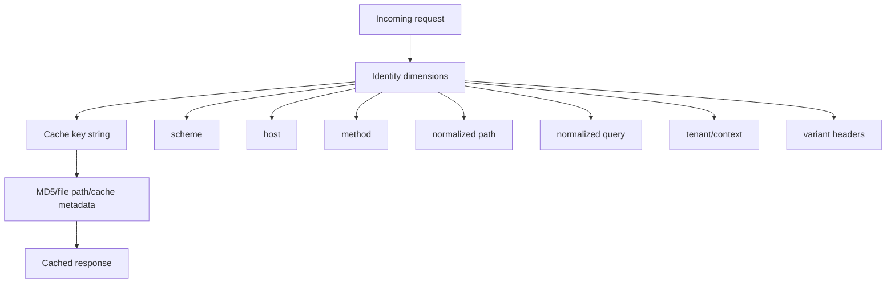
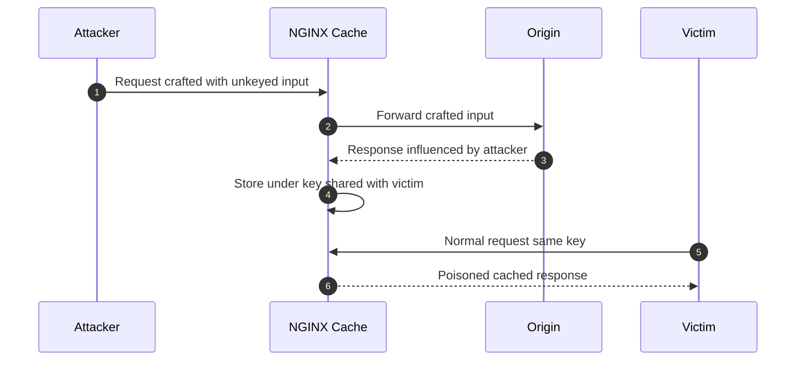
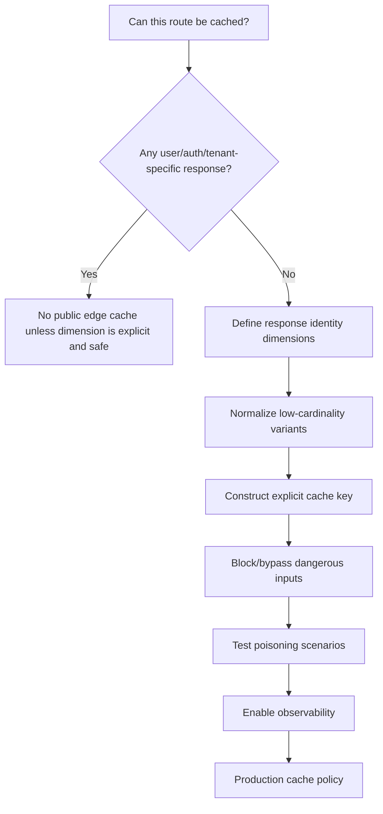

# Part 062 — Cache Key Design and Cache Poisoning Defense

> Cache key adalah primary key dari database edge kamu. Jika primary key salah, response yang benar bisa diberikan ke user yang salah, tenant yang salah, bahasa yang salah, device variant yang salah, atau authorization context yang salah.

Part ini membahas cache key design dan cache poisoning defense. Ini bukan topik performance semata. Ini adalah topik **correctness, security, privacy, dan regulatory defensibility**.

Kita akan membahas:

- apa itu cache key secara operasional;
- default `proxy_cache_key` dan kapan tidak cukup;
- query string normalization;
- host/scheme/method/URI dimension;
- `Vary`, `Accept-Encoding`, language, device, tenant, authorization;
- cache poisoning dari Host/header/query ambiguity;
- personalized response leakage;
- negative caching risk;
- poisoning test plan;
- pattern production yang defensible.

---

## 1. Mental model: cache key sebagai identity function

Sebuah cache key menjawab pertanyaan:

> “Apakah request A dan request B boleh menerima response yang sama?”

Jika ya, mereka boleh share cache entry.

Jika tidak, cache key harus berbeda.



NGINX menyimpan cache file berdasarkan hasil hash dari cache key. Jadi kesalahan key tidak terlihat dari nama file manusiawi. Kesalahan key terlihat sebagai response leakage atau poisoning.

---

## 2. Default `proxy_cache_key`

Dokumentasi NGINX menyebut default `proxy_cache_key` sebagai:

```nginx
proxy_cache_key $scheme$proxy_host$request_uri;
```

Dokumentasi juga menyebut nilainya dekat dengan:

```nginx
proxy_cache_key $scheme$proxy_host$uri$is_args$args;
```

Default ini bisa cukup untuk proxy sederhana. Tetapi untuk platform production, default sering terlalu implisit.

Masalahnya:

- `$proxy_host` adalah host upstream, bukan selalu host publik client;
- `$request_uri` memakai URI original termasuk query string mentah;
- query order berbeda bisa menjadi key berbeda;
- header variant tidak otomatis masuk kecuali `Vary` diproses sesuai kasus;
- tenant/user/authorization context tidak otomatis aman;
- host poisoning bisa terjadi jika host handling tidak disiplin.

Top-level rule:

> Jangan desain cache key berdasarkan “apa yang mudah diketik”. Desain cache key berdasarkan semua input yang memengaruhi response body, status, dan security semantics.

---

## 3. Cache key correctness equation

Untuk setiap route yang dicache, tulis equation ini:

```txt
response = f(method, scheme, host, path, query, headers, cookies, auth, tenant, origin state)
```

Cache key harus memasukkan semua dimension request yang membuat `response` berbeda secara observably relevant.

Jika response berbeda karena `Accept-Language`, cache key harus membedakan language atau origin harus menggunakan `Vary: Accept-Language` dengan benar.

Jika response berbeda karena tenant, tenant harus ada di key atau host/path sudah memisahkan tenant.

Jika response berbeda karena cookie user, route biasanya tidak boleh public-cache sama sekali.

---

## 4. Cache key terlalu sempit: leak

Contoh buruk:

```nginx
proxy_cache_key "$uri";
```

Dua request:

```http
GET /dashboard HTTP/1.1
Host: tenant-a.example.com
Cookie: session=user-a
```

```http
GET /dashboard HTTP/1.1
Host: tenant-b.example.com
Cookie: session=user-b
```

Jika key hanya `$uri`, keduanya memakai key:

```txt
/dashboard
```

Ini catastrophic. Tenant B bisa menerima response Tenant A.

---

## 5. Cache key terlalu luas: low hit ratio dan storage waste

Contoh terlalu luas:

```nginx
proxy_cache_key "$scheme|$host|$request_method|$request_uri|$http_user_agent|$http_cookie|$request_id";
```

Masalah:

- `$request_id` unik per request → hampir tidak pernah HIT;
- full cookie sering unik → cache fragmentation;
- user-agent raw high-cardinality → storage meledak;
- query tracking parameter membuat variant tak terbatas.

Cache key design adalah trade-off:

```txt
correctness first, hit ratio second
```

Tetapi setelah correctness aman, kita harus mengurangi cardinality yang tidak relevan.

---

## 6. Recommended explicit baseline

Untuk public route sederhana:

```nginx
proxy_cache_key "$scheme|$host|$request_method|$uri|$is_args$args";
```

Lebih eksplisit daripada default, dan mudah dibaca di review.

Tetapi ini masih belum menyelesaikan query normalization, language/device variant, atau tenant model.

---

## 7. `$uri` vs `$request_uri`

`$request_uri` adalah original request URI termasuk query string. `$uri` adalah normalized current URI yang bisa berubah karena internal processing.

Perbedaan ini penting.

| Variable | Isi | Cocok untuk cache key? |
|---|---|---|
| `$request_uri` | Original URI termasuk query string mentah | Berguna jika ingin raw request jadi key, tetapi raw query order/tracking parameter bisa fragmentasi. |
| `$uri` | Normalized/current URI tanpa query | Berguna untuk canonical path, tetapi hati-hati internal rewrite. |
| `$args` | Query string mentah tanpa `?` | Perlu normalisasi jika query order/noise penting. |
| `$is_args` | `?` jika args ada, empty jika tidak | Membantu membuat key string stabil. |

Contoh:

```txt
/products?id=10&ref=ad
/products?ref=ad&id=10
```

Secara bisnis mungkin sama. Secara raw `$args`, berbeda.

---

## 8. Query string: sumber fragmentasi dan poisoning

Query string sering mengandung tiga jenis parameter:

| Jenis | Contoh | Cache key treatment |
|---|---|---|
| Identity parameter | `id=123`, `page=2`, `q=nginx` | Masuk key. |
| Variant parameter | `lang=en`, `currency=USD` | Masuk key atau jadi route/header variant. |
| Noise/tracking parameter | `utm_source`, `fbclid`, `gclid` | Jangan masuk key jika tidak memengaruhi response. |

Jika semua query mentah masuk key, hit ratio turun.

Jika query penting dibuang, response salah.

---

## 9. Query allowlist lebih aman daripada denylist

Denylist:

```txt
remove utm_source, utm_medium, fbclid, gclid, ...
```

Masalah: parameter noise baru akan lolos.

Allowlist:

```txt
only id, page, sort, q, lang, currency
```

Lebih defensible untuk route yang known.

NGINX native config tidak punya query parser lengkap yang nyaman untuk sorting arbitrary args. Tetapi kita bisa memakai variable `$arg_name` untuk parameter yang diizinkan.

Contoh untuk catalog list:

```nginx
map $arg_page $cache_page {
    default $arg_page;
    ""      "1";
}

map $arg_sort $cache_sort {
    default "popular";
    "price_asc"  "price_asc";
    "price_desc" "price_desc";
    "newest"     "newest";
}

map $arg_lang $cache_lang {
    default "en";
    "id" "id";
    "en" "en";
}

location /api/catalog/search {
    proxy_cache catalog_cache;
    proxy_cache_key "$scheme|$host|GET|$uri|page=$cache_page|sort=$cache_sort|lang=$cache_lang|q=$arg_q";
    proxy_pass http://catalog_origin;
}
```

### Trade-off

Ini hanya cocok jika route parameter known dan terbatas. Untuk query kompleks, lebih baik canonicalization dilakukan di app/control plane atau gunakan njs/Lua/OpenResty setelah risk review.

---

## 10. Query parameter order

Raw query ini berbeda sebagai string:

```txt
?a=1&b=2
?b=2&a=1
```

Jika origin menganggap sama, raw query sebagai cache key menghasilkan double storage dan lower hit ratio.

Jika origin menganggap order meaningful, sorting query bisa salah.

### Invariant

Sebelum normalisasi query, jawab:

- Apakah parameter order bermakna untuk origin?
- Apakah duplicate parameter diperbolehkan?
- Jika `tag=a&tag=b`, apakah sama dengan `tag=b&tag=a`?
- Jika parameter kosong, apakah beda dari tidak ada parameter?
- Apakah encoding/case berpengaruh?

Tanpa jawaban ini, query normalization bisa menjadi bug.

---

## 11. Host dimension dan host poisoning

Host harus diperlakukan sebagai trust boundary.

Contoh key:

```nginx
proxy_cache_key "$scheme|$host|$uri|$is_args$args";
```

Jika `$host` menerima host arbitrary yang tidak divalidasi, attacker bisa membuat cache object untuk host yang tidak kamu ekspektasikan atau memengaruhi redirect/link yang dicache.

### Default server sinkhole

Gunakan default server untuk membuang unknown host:

```nginx
server {
    listen 443 ssl default_server;
    server_name _;
    return 444;
}

server {
    listen 443 ssl http2;
    server_name www.example.com api.example.com;

    # cache only here
}
```

### Host whitelist via `server_name`

Jangan route cache public dari wildcard host tanpa registry/allowlist.

Buruk:

```nginx
server_name _;
proxy_cache_key "$host|$uri";
```

Lebih aman:

```nginx
server_name www.example.com;
```

Atau multi-tenant dengan registry:

```nginx
map $host $tenant_id {
    default "";
    tenant-a.example.com "tenant_a";
    tenant-b.example.com "tenant_b";
}

server {
    if ($tenant_id = "") { return 444; }

    proxy_cache_key "$scheme|tenant=$tenant_id|$uri|$is_args$args";
}
```

Catatan: penggunaan `if` perlu hati-hati di NGINX. Untuk return sederhana di server/location, pattern ini umum; jangan gunakan `if` untuk imperative routing kompleks.

---

## 12. Scheme dimension: HTTP vs HTTPS

Jika HTTP dan HTTPS sama-sama melayani content tetapi memiliki redirect/security semantics berbeda, scheme perlu dipikirkan.

Untuk cache reverse proxy di HTTPS-only server, `$scheme` mungkin cukup.

Tetapi jika NGINX berada di belakang load balancer TLS terminator, `$scheme` bisa menjadi `http` di NGINX walaupun client original HTTPS.

Dalam topology seperti ini:

```txt
Client HTTPS -> External LB TLS termination -> NGINX HTTP -> Origin
```

Cache key `$scheme` tidak merepresentasikan client scheme. Kamu mungkin perlu trusted forwarded proto:

```nginx
map $http_x_forwarded_proto $client_scheme {
    default $scheme;
    https https;
    http  http;
}

proxy_cache_key "$client_scheme|$host|$uri|$is_args$args";
```

Namun hanya lakukan ini jika `X-Forwarded-Proto` berasal dari trusted upstream. Jangan menerima klaim client langsung dari internet.

---

## 13. Method dimension: GET, HEAD, POST

Default cache methods adalah GET dan HEAD. GET/HEAD biasanya selalu disertakan ketika caching method dikonfigurasi.

Jika kamu cache POST, desainnya harus sangat ketat.

```nginx
proxy_cache_methods GET HEAD;
```

Untuk HEAD conversion, NGINX punya `proxy_cache_convert_head` default `on`. Jika kamu disable conversion, cache key harus memasukkan method.

```nginx
proxy_cache_convert_head off;
proxy_cache_key "$scheme|$host|$request_method|$uri|$is_args$args";
```

### Rule

Masukkan `$request_method` dalam explicit cache key kecuali kamu sangat yakin semua method berbagi representation aman.

---

## 14. Authorization dimension: biasanya jangan cache

Request dengan `Authorization` hampir selalu user/context-specific.

Pattern aman:

```nginx
map $http_authorization $has_authorization {
    default 1;
    ""      0;
}

location /api/public/ {
    proxy_cache public_cache;
    proxy_cache_bypass $has_authorization;
    proxy_no_cache     $has_authorization $upstream_http_set_cookie;
    proxy_pass http://public_origin;
}
```

Ini berarti authenticated request bypass read dan tidak disimpan.

### Exception

Ada kasus advanced ketika authorization tidak memengaruhi response body, misalnya API public tetapi auth hanya untuk quota. Tetapi itu harus dinyatakan eksplisit dalam route contract.

Jangan membuat exception implicit.

---

## 15. Cookie dimension: full cookie di key biasanya salah

Memasukkan seluruh cookie ke cache key:

```nginx
proxy_cache_key "$host|$uri|$http_cookie";
```

biasanya buruk karena:

- cookie high-cardinality;
- cookie order bisa berubah;
- analytics/session cookie menghancurkan HIT ratio;
- privacy risk;
- cache key sulit diaudit.

Lebih baik:

- bypass cache jika cookie user/session ada;
- allowlist cookie variant tertentu jika benar-benar memengaruhi public response.

Contoh:

```nginx
map $cookie_currency $currency_variant {
    default "USD";
    "IDR" "IDR";
    "USD" "USD";
    "SGD" "SGD";
}

map $cookie_session $has_session {
    default 1;
    ""      0;
}

location /api/prices/public/ {
    proxy_cache price_cache;
    proxy_cache_key "$scheme|$host|$uri|currency=$currency_variant|$is_args$args";
    proxy_no_cache $has_session $upstream_http_set_cookie;
    proxy_cache_bypass $has_session;
    proxy_pass http://price_origin;
}
```

---

## 16. `Vary`: origin tells caches about variants

`Vary` berarti response bervariasi berdasarkan request header tertentu.

Contoh:

```http
Vary: Accept-Encoding
```

atau:

```http
Vary: Accept-Language
```

NGINX memperhitungkan `Vary` behavior tertentu dalam caching. Tetapi sebagai engineer, jangan hanya berharap semuanya benar otomatis. Kamu tetap harus memahami variant cardinality dan route behavior.

### `Vary: *`

Jika origin mengirim:

```http
Vary: *
```

response tidak boleh dipakai untuk cache reuse. Dokumentasi NGINX menyatakan response dengan `Vary: *` tidak dicache.

### Bahaya `Vary: User-Agent`

`User-Agent` punya cardinality sangat tinggi. Jika origin mengirim `Vary: User-Agent`, cache bisa fragmentasi ekstrem.

Lebih baik normalize device class:

```nginx
map $http_user_agent $device_class {
    default desktop;
    ~*mobile mobile;
    ~*android mobile;
    ~*iphone mobile;
}

proxy_cache_key "$scheme|$host|$uri|device=$device_class|$is_args$args";
```

Tetapi jangan pakai regex UA sebagai security boundary. Ini hanya performance/content variant heuristic.

---

## 17. Accept-Encoding dan compressed variants

Compression sering menyebabkan variant. Jika origin mengirim compressed/uncompressed berdasarkan `Accept-Encoding`, pastikan cache tidak memberi gzip ke client yang tidak bisa menerimanya.

Dalam banyak NGINX deployment, lebih baik NGINX yang mengelola compression di edge:

```nginx
gzip on;
gzip_vary on;
proxy_set_header Accept-Encoding "";
```

Dengan menghapus `Accept-Encoding` ke origin, origin mengirim body uncompressed canonical, lalu NGINX mengompresi untuk client sesuai kemampuan.

Trade-off:

- origin lebih sederhana;
- cache object bisa canonical;
- NGINX CPU compression naik;
- precompressed/static strategy harus dipisahkan.

---

## 18. Language/currency/locale variant

Language dan currency sering terlihat seperti user preference, tetapi bisa menjadi public variant.

Contoh aman:

```nginx
map $arg_lang $lang {
    default "en";
    "id" "id";
    "en" "en";
}

map $arg_currency $currency {
    default "USD";
    "IDR" "IDR";
    "USD" "USD";
}

proxy_cache_key "$scheme|$host|$uri|lang=$lang|currency=$currency";
```

Jangan memasukkan raw `Accept-Language` langsung tanpa normalisasi. Header itu bisa panjang dan high-cardinality.

---

## 19. Tenant isolation

Multi-tenant caching harus menjawab:

- apakah tenant dipisah oleh host?
- apakah tenant dipisah oleh path?
- apakah tenant dipisah oleh header?
- apakah tenant hasil auth?
- apakah tenant route public atau private?

### Host-based tenant

```nginx
map $host $tenant_id {
    default "";
    a.example.com "tenant_a";
    b.example.com "tenant_b";
}

proxy_cache_key "$scheme|tenant=$tenant_id|$uri|$is_args$args";
```

### Path-based tenant

```nginx
location ~ ^/tenants/(?<tenant_slug>[a-z0-9-]+)/public/ {
    proxy_cache tenant_cache;
    proxy_cache_key "$scheme|tenant=$tenant_slug|$uri|$is_args$args";
    proxy_pass http://tenant_origin;
}
```

But: tenant slug dari path harus tervalidasi. Jangan biarkan arbitrary path mencampur namespace internal.

### Header-based tenant

Header-based tenant hanya aman jika header diset oleh trusted gateway, bukan client internet.

```nginx
# Only behind a trusted internal gateway
proxy_cache_key "$scheme|tenant=$http_x_tenant_id|$uri|$is_args$args";
```

Jika client bisa mengirim `X-Tenant-Id`, ini bisa jadi poisoning vector.

---

## 20. Cache poisoning: definisi praktis

Cache poisoning terjadi ketika attacker membuat cache menyimpan response yang kemudian diberikan kepada korban.

Pattern umum:



Root cause: **input memengaruhi response tetapi tidak masuk cache key atau tidak dibypass**.

---

## 21. Poisoning vector: unkeyed Host/X-Forwarded-Host

Origin kadang memakai `Host` atau `X-Forwarded-Host` untuk membangun absolute URL.

Jika attacker bisa mengirim:

```http
X-Forwarded-Host: evil.example
```

Origin mungkin menghasilkan:

```html
<link rel="canonical" href="https://evil.example/page">
```

Jika cache key tidak memasukkan header tersebut dan response dicache, korban menerima poisoned response.

Defense:

```nginx
proxy_set_header Host $host;
proxy_set_header X-Forwarded-Host $host;
proxy_set_header X-Forwarded-Proto $scheme;
```

Lebih baik: jangan forward raw client `X-Forwarded-*` dari internet. Normalize di trust boundary.

---

## 22. Poisoning vector: unkeyed protocol

Jika origin membangun redirect atau asset URL berdasarkan `X-Forwarded-Proto`, attacker bisa mencoba memengaruhi scheme.

Defense:

```nginx
# At internet-facing NGINX
proxy_set_header X-Forwarded-Proto $scheme;
proxy_set_header X-Forwarded-Ssl   $https;
```

Jika NGINX berada di belakang trusted LB, derive dari trusted LB header hanya setelah real trust boundary jelas.

---

## 23. Poisoning vector: unkeyed query parameter

Misalkan origin debug mode dipengaruhi query:

```txt
/page?debug=true
```

Tetapi cache key membuang semua query:

```nginx
proxy_cache_key "$host|$uri";
```

Attacker request:

```txt
/page?debug=true
```

Origin response menampilkan debug banner, dan NGINX menyimpan sebagai key `/page`. Korban request `/page` menerima debug response.

Defense:

- jangan buang query kecuali route contract allowlist jelas;
- reject unknown query untuk cached route;
- canonical redirect ke query normalized;
- use app-level response headers to prevent caching debug variants.

Contoh reject unknown query sulit dilakukan generik di pure NGINX, tetapi untuk route spesifik bisa disederhanakan:

```nginx
if ($arg_debug) { return 400; }
```

Lebih baik validasi/canonicalization dilakukan di origin atau generated config route-specific.

---

## 24. Poisoning vector: unkeyed headers

Origin response bisa dipengaruhi header seperti:

- `X-Original-URL`;
- `X-Rewrite-URL`;
- `X-Forwarded-Host`;
- `X-Forwarded-Proto`;
- `Accept-Language`;
- `User-Agent`;
- `Authorization`;
- custom experiment headers.

Jika header memengaruhi response, header tersebut harus:

1. masuk cache key setelah normalisasi; atau
2. menyebabkan bypass/no-store; atau
3. dihapus/di-normalize sebelum origin; atau
4. dijamin tidak memengaruhi response oleh origin contract.

Contoh normalize experiment header:

```nginx
map $http_x_experiment $experiment_variant {
    default "control";
    "checkout_v2" "checkout_v2";
}

proxy_cache_key "$scheme|$host|$uri|exp=$experiment_variant|$is_args$args";
```

---

## 25. Poisoning vector: response header override

Origin bisa mengirim:

```http
Cache-Control: public, max-age=3600
Set-Cookie: session=abc
```

NGINX default behavior tidak cache response dengan `Set-Cookie`. Tetapi jika kamu memakai:

```nginx
proxy_ignore_headers Set-Cookie Cache-Control;
```

kamu bisa menyimpan response yang seharusnya private.

### Rule keras

`proxy_ignore_headers Set-Cookie` adalah red flag. Hanya gunakan jika response benar-benar public dan kamu juga memastikan cookie tidak diteruskan ke client atau tidak memengaruhi body.

---

## 26. `Set-Cookie` leakage

Bahkan jika body public, `Set-Cookie` pada cached response bisa berbahaya.

Pattern aman:

```nginx
proxy_no_cache $upstream_http_set_cookie;
proxy_hide_header Set-Cookie;
```

Tetapi `proxy_hide_header Set-Cookie` juga harus dievaluasi: apakah client memang tidak butuh cookie? Jangan hapus cookie auth/session di route yang membutuhkan login.

---

## 27. Cache Deception

Web Cache Deception adalah ketika attacker membuat URL yang terlihat seperti static asset agar cache menyimpan response dynamic/private.

Contoh:

```txt
/account/profile/avatar.css
```

Jika routing app mengembalikan profile HTML untuk path ini, tetapi NGINX/CDN menganggap `.css` cacheable, data private bisa tercache.

Defense:

- cache berdasarkan route ownership, bukan hanya extension;
- dynamic/private prefix harus `no-store`;
- static asset path harus physically/semantically terpisah;
- `try_files` untuk static harus tidak jatuh ke private app response;
- reject suspicious suffix pada private route.

Contoh:

```nginx
# Static only from known immutable asset path
location ^~ /assets/ {
    root /srv/www/current/public;
    try_files $uri =404;
    expires 1y;
    add_header Cache-Control "public, immutable" always;
}

# Private app never cached by edge
location /account/ {
    proxy_cache off;
    add_header Cache-Control "no-store" always;
    proxy_pass http://app_origin;
}
```

---

## 28. Negative caching poisoning

Caching 404 bisa melindungi origin, tetapi bisa juga memperpanjang false negative.

Skenario:

1. Product baru akan dibuat: `/products/new-item`.
2. Attacker/request awal memicu 404 sebelum product publish.
3. 404 dicache 10 menit.
4. Product publish.
5. User tetap melihat 404 sampai TTL habis.

Defense:

- TTL pendek untuk 404 pada mutable namespace;
- gunakan 410 lebih lama hanya untuk permanently gone;
- purge/versioning jika publish harus instant;
- jangan negative-cache authorization-masked 404;
- cache key harus memasukkan tenant/locale.

```nginx
proxy_cache_valid 404 15s;
proxy_cache_valid 410 10m;
```

---

## 29. Cache key dan authorization-masked 404

Banyak sistem sengaja mengembalikan 404 untuk resource yang tidak boleh dilihat user:

```txt
GET /cases/123
User unauthorized -> 404
```

Jika response seperti ini dicache public, user authorized berikutnya bisa menerima 404 palsu.

Rule:

> Jangan cache endpoint yang status/result-nya dipengaruhi authorization, meskipun method GET dan status 404.

---

## 30. Cache key dan regulatory workflows

Untuk regulatory/case management systems, cache correctness lebih penting daripada HIT ratio.

Jangan cache di edge untuk:

- case details;
- enforcement state;
- assignments;
- permissions;
- audit timeline;
- legal notices personalized by party;
- SLA/deadline calculation per actor;
- internal dashboard with role-specific filters.

Boleh dipertimbangkan untuk cache:

- public reference tables;
- public forms/templates;
- static help content;
- public legislation copy;
- public taxonomy if versioned;
- read-only generated docs with explicit version.

Cache key untuk reference data harus memasukkan version/jurisdiction/language jika memengaruhi response:

```nginx
proxy_cache_key "$scheme|$host|$uri|jurisdiction=$arg_jurisdiction|version=$arg_version|lang=$arg_lang";
```

---

## 31. Canonicalization before caching

Salah satu cara terbaik mengurangi poisoning dan fragmentation adalah redirect ke canonical URL sebelum cache.

Contoh remove trailing slash inconsistency:

```nginx
location = /api/catalog/search/ {
    return 301 /api/catalog/search$is_args$args;
}
```

Contoh force lowercase path lebih sulit di pure NGINX, biasanya dilakukan di app/control plane.

Contoh reject malformed query:

```nginx
if ($args ~* "(%0d|%0a)") { return 400; }
```

Header/query normalization untuk security harus hati-hati. Jangan membuat regex security theater; fokus pada known bad inputs dan route ownership.

---

## 32. Path normalization and encoded characters

URI encoding bisa menciptakan ambiguity:

```txt
/api/%63atalog
/api/catalog
/api/catalog%2Fextra
```

NGINX dan upstream bisa berbeda dalam decoding/normalization. Jika NGINX cache key dan origin route resolution tidak melihat path dengan cara sama, poisoning atau bypass bisa terjadi.

Defense:

- hindari cache untuk route dengan path decoding kompleks;
- canonicalize di edge atau origin secara konsisten;
- reject encoded slash jika app tidak mendukung;
- test with `%2f`, `%5c`, `%2e%2e`, mixed case encodings;
- jangan membuat cache key dari representation yang berbeda dari origin routing semantics.

---

## 33. Safe cache key construction patterns

### Pattern A — Static immutable assets

```nginx
location ^~ /assets/ {
    root /srv/www/current/public;
    try_files $uri =404;

    # Usually browser cache, not proxy_cache needed.
    expires 1y;
    add_header Cache-Control "public, immutable" always;
}
```

Proxy cache tidak selalu diperlukan untuk local static files. Browser/CDN cache lebih relevan.

### Pattern B — Public API with known query allowlist

```nginx
map $arg_page $catalog_page {
    default $arg_page;
    "" "1";
}

map $arg_sort $catalog_sort {
    default "popular";
    "popular" "popular";
    "newest" "newest";
    "price_asc" "price_asc";
    "price_desc" "price_desc";
}

location = /api/catalog/items {
    proxy_cache catalog_cache;
    proxy_cache_key "$scheme|$host|GET|$uri|page=$catalog_page|sort=$catalog_sort|q=$arg_q";
    proxy_no_cache $http_authorization $upstream_http_set_cookie;
    proxy_cache_bypass $http_authorization;
    proxy_pass http://catalog_origin;
}
```

### Pattern C — Tenant public content

```nginx
map $host $tenant_id {
    default "";
    tenant-a.example.com "tenant-a";
    tenant-b.example.com "tenant-b";
}

server {
    listen 443 ssl http2;
    server_name tenant-a.example.com tenant-b.example.com;

    if ($tenant_id = "") { return 444; }

    location /public/ {
        proxy_cache tenant_public_cache;
        proxy_cache_key "$scheme|tenant=$tenant_id|$uri|$is_args$args";
        proxy_pass http://tenant_public_origin;
    }
}
```

### Pattern D — Versioned reference data

```nginx
location /api/reference/ {
    proxy_cache reference_cache;
    proxy_cache_key "$scheme|$host|$uri|version=$arg_version|jurisdiction=$arg_jurisdiction|lang=$arg_lang";
    proxy_cache_valid 200 10m;
    proxy_cache_use_stale error timeout http_502 http_503 http_504;
    proxy_pass http://reference_origin;
}
```

---

## 34. Explicit no-cache patterns

### Authenticated app

```nginx
location /app/ {
    proxy_cache off;
    add_header Cache-Control "no-store" always;
    proxy_pass http://app_origin;
}
```

### Permissioned API

```nginx
location /api/cases/ {
    proxy_cache off;
    proxy_set_header Authorization $http_authorization;
    add_header Cache-Control "no-store" always;
    proxy_pass http://case_origin;
}
```

### Mixed public/private route — split it

Buruk:

```txt
/api/items returns public if anonymous, personalized if logged in
```

Lebih baik:

```txt
/api/public/items
/api/me/items
```

Edge cache menjadi jauh lebih aman jika route contract eksplisit.

---

## 35. Poisoning test plan

Untuk setiap cached route, jalankan test berikut di staging.

### 1. Host poisoning

```bash
curl -i 'https://www.example.com/api/catalog/homepage' \
  -H 'Host: www.example.com' \
  -H 'X-Forwarded-Host: evil.example'
```

Expected:

- response tidak memuat `evil.example`;
- cache key tidak menyimpan poisoned variant;
- subsequent normal request tidak terdampak.

### 2. Forwarded proto poisoning

```bash
curl -i 'https://www.example.com/api/catalog/homepage' \
  -H 'X-Forwarded-Proto: http'
```

Expected:

- origin tetap melihat trusted proto dari edge;
- response tidak menghasilkan insecure absolute URL jika tidak semestinya.

### 3. Query poisoning

```bash
curl -i 'https://www.example.com/api/catalog/homepage?debug=true'
curl -i 'https://www.example.com/api/catalog/homepage'
```

Expected:

- debug query ditolak/bypass/no-store; atau
- debug tidak memengaruhi response; atau
- debug masuk cache key secara eksplisit.

### 4. Cookie leakage

```bash
curl -i 'https://www.example.com/api/catalog/homepage' \
  -H 'Cookie: session=attacker'

curl -i 'https://www.example.com/api/catalog/homepage'
```

Expected:

- authenticated/cookie request bypass/no-store;
- anonymous request tidak menerima personalized body/header.

### 5. Language variant

```bash
curl -i 'https://www.example.com/api/catalog/homepage' -H 'Accept-Language: id'
curl -i 'https://www.example.com/api/catalog/homepage' -H 'Accept-Language: en'
```

Expected:

- jika response berbeda, variant masuk key atau Vary benar;
- jika response sama, origin tidak menghasilkan accidental variant.

### 6. Encoding/path ambiguity

```bash
curl -i 'https://www.example.com/api/%63atalog/homepage'
curl -i 'https://www.example.com/api/catalog/homepage'
curl -i 'https://www.example.com/api/catalog%2Fhomepage'
```

Expected:

- canonical behavior jelas;
- tidak ada cache sharing salah;
- suspicious path ditolak jika perlu.

---

## 36. Observability for cache key correctness

Tambahkan debug header di staging, bukan selalu production public.

```nginx
add_header X-Cache-Status $upstream_cache_status always;
add_header X-Cache-Key-Debug "$scheme|$host|$request_method|$uri|$is_args$args" always;
```

Di production, jangan expose full key jika mengandung sensitive info. Lebih baik log internal:

```nginx
log_format cache_debug escape=json
'{'
  '"time":"$time_iso8601",'
  '"request_id":"$request_id",'
  '"host":"$host",'
  '"uri":"$uri",'
  '"args":"$args",'
  '"status":$status,'
  '"cache_status":"$upstream_cache_status",'
  '"upstream_status":"$upstream_status",'
  '"authorization_present":"$has_authorization",'
  '"set_cookie":"$upstream_http_set_cookie"'
'}';
```

Catatan: jangan log full Authorization, session cookie, atau PII.

---

## 37. Cache key review template

Untuk setiap cached route, isi tabel ini:

| Pertanyaan | Jawaban |
|---|---|
| Route | `/api/catalog/items` |
| Public/private | Public |
| Method cacheable | GET/HEAD |
| Response dipengaruhi auth? | Tidak; jika auth present, bypass |
| Response dipengaruhi cookie? | Currency cookie only; session bypass |
| Response dipengaruhi query? | `q`, `page`, `sort`, `lang` |
| Query noise dibuang? | `utm_*`, `fbclid`, `gclid` tidak masuk key via allowlist |
| Response dipengaruhi header? | normalized language only |
| Tenant dimension | Host mapped to tenant id |
| Negative cache | 404 15s |
| Stale allowed? | error/updating yes, max business stale 2m |
| Poisoning tests | Host, forwarded proto, query, cookie, language |
| Owner | Catalog team |

Tanpa template seperti ini, cache review cenderung berubah menjadi opini.

---

## 38. Common bad patterns

### Bad: global cache for all API

```nginx
location /api/ {
    proxy_cache api_cache;
    proxy_cache_key "$uri$is_args$args";
    proxy_pass http://api_origin;
}
```

Masalah: `/api/` biasanya berisi campuran public, private, auth, mutable, strict, dan tenant-specific endpoint.

### Bad: cache everything with any status

```nginx
proxy_cache_valid any 10m;
```

Masalah: 500, 403, 401, personalized error, dan transient failure bisa disimpan terlalu lama.

### Bad: ignore all origin cache headers globally

```nginx
proxy_ignore_headers Cache-Control Expires Set-Cookie Vary;
```

Masalah: kamu menonaktifkan kontrak origin dan bisa menyimpan response private.

### Bad: use full user-agent in key

```nginx
proxy_cache_key "$host|$uri|$http_user_agent";
```

Masalah: high cardinality, low hit ratio, storage waste.

### Bad: trust arbitrary forwarded headers

```nginx
proxy_set_header X-Forwarded-Host $http_x_forwarded_host;
```

Masalah: client bisa memengaruhi origin output.

---

## 39. Security checklist

Sebelum route dicache:

- [ ] Unknown host masuk default sinkhole.
- [ ] `Host`/`X-Forwarded-Host` dinormalisasi.
- [ ] `X-Forwarded-Proto` berasal dari trusted boundary.
- [ ] Authenticated request bypass/no-store kecuali exception terdokumentasi.
- [ ] `Set-Cookie` tidak tersimpan accidental.
- [ ] `Vary` dipahami dan tidak high-cardinality tanpa kontrol.
- [ ] Query allowlist atau canonicalization jelas.
- [ ] Tenant dimension masuk key.
- [ ] Language/currency/device variant dinormalisasi.
- [ ] Private route punya `proxy_cache off` dan `Cache-Control: no-store`.
- [ ] Negative caching TTL pendek untuk mutable resource.
- [ ] Poisoning tests masuk CI/staging smoke test.
- [ ] Cache debug tidak mengekspos PII/secrets.

---

## 40. Decision matrix

| Scenario | Recommended treatment |
|---|---|
| Public static asset with hash | Browser/CDN cache, immutable, usually no proxy_cache needed. |
| Public API with few query params | Explicit key with query allowlist. |
| Public API with arbitrary filters | Consider app canonicalization; be careful with raw `$args`. |
| Personalized endpoint | No edge cache. |
| Auth optional endpoint | Split public/private route or bypass on auth/cookie. |
| Tenant public content | Include tenant id from trusted mapping in key. |
| Header-based variant | Normalize header into low-cardinality variable. |
| User-Agent variant | Normalize to device class or avoid. |
| Authorization-masked 404 | Do not cache. |
| Mutable 404 | Short negative TTL or no negative cache. |
| Origin sends confusing headers | Fix origin first; edge override only with route owner approval. |

---

## 41. Final reference config: defensible public API cache

```nginx
proxy_cache_path /var/cache/nginx/public_api
    levels=1:2
    keys_zone=public_api_cache:200m
    max_size=30g
    inactive=30m
    use_temp_path=off;

map $host $tenant_id {
    default "";
    www.example.com "public";
    tenant-a.example.com "tenant-a";
    tenant-b.example.com "tenant-b";
}

map $http_authorization $has_auth {
    default 1;
    ""      0;
}

map $cookie_session $has_session_cookie {
    default 1;
    ""      0;
}

map $arg_page $cache_page {
    default $arg_page;
    ""      "1";
}

map $arg_sort $cache_sort {
    default "popular";
    "popular"    "popular";
    "newest"     "newest";
    "price_asc"  "price_asc";
    "price_desc" "price_desc";
}

map $arg_lang $cache_lang {
    default "en";
    "en" "en";
    "id" "id";
}

server {
    listen 443 ssl http2 default_server;
    server_name _;
    return 444;
}

server {
    listen 443 ssl http2;
    server_name www.example.com tenant-a.example.com tenant-b.example.com;

    if ($tenant_id = "") { return 444; }

    location = /api/catalog/items {
        proxy_pass http://catalog_origin;
        proxy_http_version 1.1;
        proxy_set_header Connection "";

        # Normalize trust-boundary headers.
        proxy_set_header Host $host;
        proxy_set_header X-Forwarded-Host $host;
        proxy_set_header X-Forwarded-Proto $scheme;
        proxy_set_header X-Request-Id $request_id;

        proxy_cache public_api_cache;
        proxy_cache_key "$scheme|tenant=$tenant_id|GET|$uri|page=$cache_page|sort=$cache_sort|lang=$cache_lang|q=$arg_q";

        # Prevent private variants entering public cache.
        proxy_cache_bypass $has_auth $has_session_cookie;
        proxy_no_cache     $has_auth $has_session_cookie $upstream_http_set_cookie;

        proxy_cache_valid 200 2m;
        proxy_cache_valid 404 15s;

        proxy_cache_lock on;
        proxy_cache_lock_timeout 2s;
        proxy_cache_use_stale error timeout http_500 http_502 http_503 http_504 updating;
        proxy_cache_background_update on;
        proxy_cache_revalidate on;

        add_header X-Cache-Status $upstream_cache_status always;
    }
}
```

### Why this is defensible

- Unknown host is rejected before cache.
- Tenant is derived from trusted host mapping, not arbitrary header.
- Authorization/session requests bypass and no-store.
- `Set-Cookie` prevents storing.
- Query dimensions are allowlisted and normalized.
- Headers forwarded to origin are normalized.
- Stale/lock/revalidate are route-specific.
- Cache status is observable.

---

## 42. Mental model final



Cache key design is not string concatenation. It is a correctness proof:

> Every request that shares a key must be allowed to share a response.

If you cannot prove that, do not cache the route.

---

## 43. Kesimpulan

NGINX cache bisa menjadi edge acceleration layer yang sangat kuat. Tetapi kekuatan itu datang dengan risiko: jika cache key terlalu sempit, terjadi leakage; jika terlalu luas, cache tidak efektif; jika untrusted input memengaruhi response tanpa masuk key, cache poisoning menjadi mungkin.

Production-grade cache key design membutuhkan:

- explicit route ownership;
- response identity analysis;
- tenant/auth/cookie/header/query classification;
- low-cardinality normalization;
- strict trust boundary;
- poisoning tests;
- observability.

Jangan mulai dari directive. Mulai dari invariant:

```txt
Request yang berbagi cache key harus aman menerima response yang sama.
```

Jika invariant itu benar, directive NGINX menjadi implementasi. Jika invariant itu salah, directive NGINX hanya mempercepat bug.

---

## Official references

- NGINX `ngx_http_proxy_module`: `proxy_cache_key`, default cache key, `proxy_cache_methods`, `proxy_cache_convert_head`, `proxy_no_cache`, `proxy_cache_bypass`, `proxy_ignore_headers`, `Set-Cookie`, `Vary`, `proxy_cache_valid` — https://nginx.org/en/docs/http/ngx_http_proxy_module.html
- F5 NGINX Content Caching Admin Guide — https://docs.nginx.com/nginx/admin-guide/content-cache/content-caching/
- NGINX request processing and virtual server selection — https://nginx.org/en/docs/http/request_processing.html
