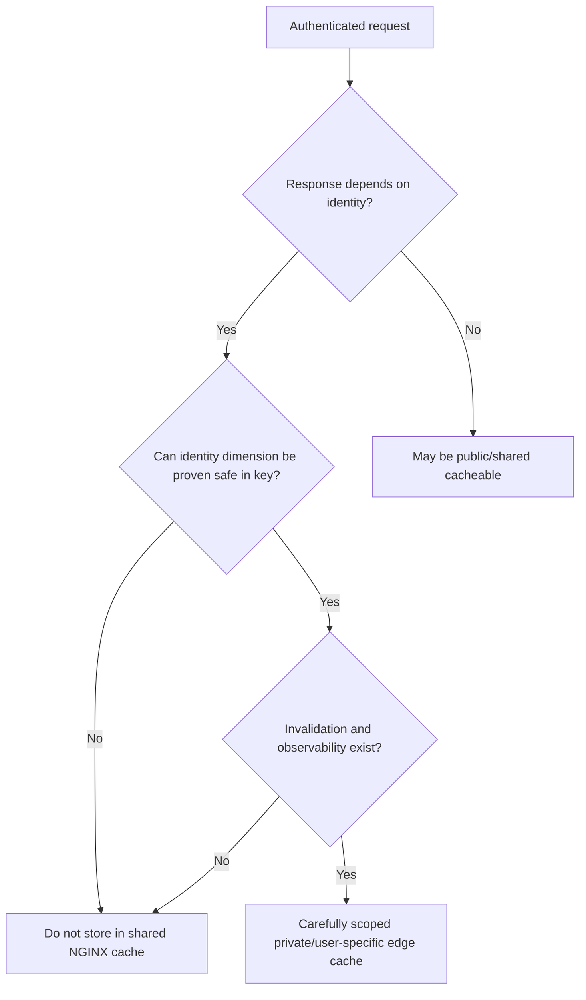
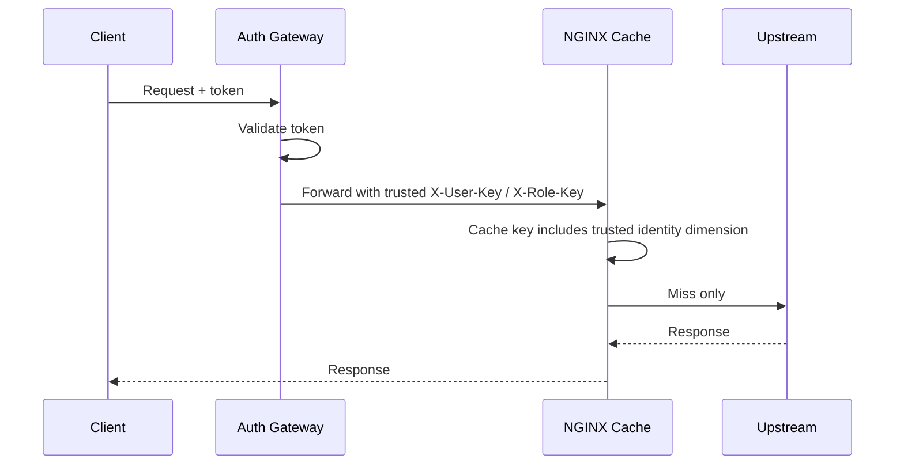
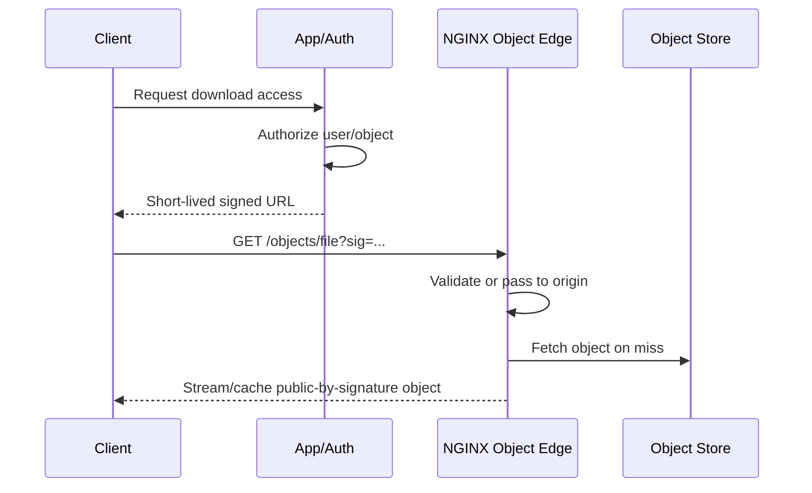
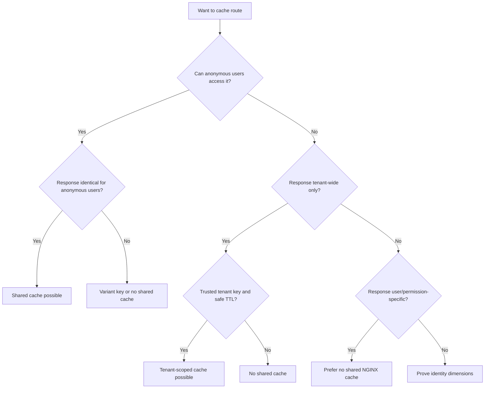

# Part 063 — Private, User-Specific, and Authenticated Cache

> Authenticated cache is not a performance feature first. It is a data isolation problem first. If the isolation proof is weak, do not cache.

Part sebelumnya membahas cache key dan cache poisoning. Sekarang kita masuk ke area yang lebih berbahaya: response yang bergantung pada user, session, cookie, token, tenant, role, consent, geography, entitlement, atau policy authorization.

Kita akan membahas:

- kenapa authenticated route default-nya harus dianggap tidak public-cacheable;
- perbedaan public cache, private browser cache, dan edge cache;
- bagaimana NGINX memperlakukan `Set-Cookie`, `Vary`, dan cache-control;
- pattern `proxy_cache_bypass` dan `proxy_no_cache` untuk cookie/token;
- kapan user-specific edge cache mungkin aman;
- kenapa cache key berisi session id biasanya bukan solusi yang matang;
- authorization-aware cache design;
- tenant isolation dan regulatory defensibility;
- testing untuk mencegah cross-user leakage.

---

## 1. Mental model: authenticated response adalah data dengan owner

Response authenticated hampir selalu punya owner.

Owner bisa berupa:

- user;
- organization;
- tenant;
- workspace;
- account;
- role;
- permission set;
- entitlement;
- locale/region;
- feature flag cohort;
- consent state;
- legal hold state;
- data residency boundary.

Jika response punya owner, maka edge cache harus menjawab pertanyaan ini:

> “Apakah request lain boleh menerima response yang sama tanpa melanggar authorization, privacy, atau product semantics?”

Jika jawabannya tidak pasti, route tersebut tidak boleh disimpan di shared edge cache.



---

## 2. Public cache vs private browser cache vs edge cache

Jangan mencampur tiga hal ini.

| Cache type | Lokasi | Shared? | Cocok untuk |
|---|---:|---:|---|
| Browser private cache | User agent | Tidak, per-device/profile | HTML/user-specific ringan jika header benar |
| CDN/NGINX shared edge cache | Reverse proxy | Ya | Public content, shared API response, versioned asset |
| Application/user cache | App/Redis/db | Terkontrol oleh app | Data yang butuh authorization/invalidation granular |

NGINX proxy cache adalah **shared cache** di edge. Semua request yang menghasilkan cache key sama bisa membaca entry yang sama.

Karena itu, response authenticated tidak boleh dianggap aman hanya karena request datang dari user authenticated. Authentication membuktikan siapa pemanggilnya; cache membuktikan apakah response boleh dibagi.

---

## 3. The dangerous shortcut

Shortcut berbahaya:

```nginx
location /api/ {
    proxy_cache app_cache;
    proxy_cache_valid 200 5m;
    proxy_pass http://api_backend;
}
```

Jika `/api/me`, `/api/orders`, `/api/cases`, `/api/enforcement-items`, atau `/api/billing` masuk ke location ini, response user A dapat tersimpan lalu diberikan ke user B jika cache key tidak membedakan identitas.

Bahkan jika default cache key berisi host dan URI, itu tidak cukup untuk user-specific API karena URI yang sama bisa punya response berbeda untuk user berbeda:

```txt
GET /api/me
Authorization: Bearer token-of-user-a

GET /api/me
Authorization: Bearer token-of-user-b
```

URI sama. Response tidak boleh sama.

---

## 4. Baseline invariant

Untuk shared NGINX cache, gunakan invariant ini:

```txt
A shared cache entry may be served only if every request sharing the key is authorized to see the exact same response body and headers.
```

Perhatikan: **body dan headers**.

Header bisa mengandung data sensitif:

- `Set-Cookie`;
- `X-User-Id`;
- `X-Account-Id`;
- `Link` dengan private URL;
- `Location` redirect ke private resource;
- `Content-Disposition` filename dengan data personal;
- `X-Accel-Redirect` internal path;
- `Cache-Control` yang salah.

---

## 5. What NGINX already protects, and what it does not

NGINX punya beberapa guardrail, tetapi guardrail ini bukan authorization model.

Dokumentasi `ngx_http_proxy_module` menjelaskan beberapa behavior penting:

- response dengan `Set-Cookie` tidak akan di-cache;
- response dengan `Vary: *` tidak akan di-cache;
- response dengan `Vary` lain dapat di-cache dengan memperhitungkan request header terkait;
- `X-Accel-Expires`, `Expires`, dan `Cache-Control` dapat memengaruhi caching;
- `proxy_ignore_headers` bisa menonaktifkan pemrosesan header tertentu, sehingga berbahaya jika dipakai tanpa governance.

Artinya, NGINX membantu mencegah beberapa kebocoran umum, tetapi kamu tetap harus mendesain policy cache per route.

---

## 6. Default safest rule for authenticated traffic

Untuk route authenticated, default production rule:

```nginx
map $http_authorization $has_authorization {
    default 1;
    ""      0;
}

map $http_cookie $has_cookie {
    default 1;
    ""      0;
}

location /api/ {
    proxy_cache app_cache;

    proxy_cache_bypass $has_authorization $has_cookie;
    proxy_no_cache     $has_authorization $has_cookie;

    proxy_pass http://api_backend;
}
```

Maknanya:

- jika request membawa `Authorization`, jangan baca dari cache;
- jika request membawa cookie, jangan baca dari cache;
- response dari request tersebut juga jangan disimpan.

Ini konservatif. Untuk banyak sistem regulated, ini baseline yang benar.

---

## 7. `proxy_cache_bypass` vs `proxy_no_cache`

Keduanya sering tertukar.

| Directive | Fungsi |
|---|---|
| `proxy_cache_bypass` | Jangan ambil response dari cache untuk request ini |
| `proxy_no_cache` | Jangan simpan response dari request ini ke cache |

Untuk authenticated request, biasanya butuh keduanya.

```nginx
proxy_cache_bypass $http_authorization $cookie_session;
proxy_no_cache     $http_authorization $cookie_session;
```

Jika hanya pakai `proxy_cache_bypass`, request authenticated tidak membaca cache, tetapi response-nya masih mungkin disimpan.

Jika hanya pakai `proxy_no_cache`, request authenticated masih mungkin membaca cache lama yang salah.

---

## 8. Cookie classification

Tidak semua cookie sama.

| Cookie type | Contoh | Cache implication |
|---|---|---|
| Session/auth cookie | `session`, `jwt`, `sid` | Bypass dan no-store di edge |
| CSRF cookie | `csrf_token` | Biasanya bypass/no-store karena user-specific |
| Preference cookie | `theme`, `locale` | Bisa jadi variant jika response benar-benar berbeda |
| Analytics cookie | `_ga`, tracking id | Harus diabaikan dari cache key agar cardinality tidak meledak |
| Experiment cookie | `ab_bucket` | Bisa masuk variant allowlist jika digunakan origin |

Kesalahan umum: seluruh `$http_cookie` dimasukkan ke cache key.

```nginx
# Anti-pattern
proxy_cache_key "$scheme$host$request_uri|$http_cookie";
```

Masalahnya:

- cardinality cache meledak;
- tracking cookie membuat hit ratio hancur;
- cookie order/value noise membuat key tidak stabil;
- session id masuk disk/log/cache metadata;
- invalidation hampir mustahil.

Gunakan cookie allowlist, bukan semua cookie.

---

## 9. Pattern: public API cache dengan auth bypass

Route public API yang bisa dipanggil tanpa auth, tetapi kadang request membawa cookie/Authorization karena browser global state.

```nginx
map $http_authorization $skip_cache_auth {
    default 1;
    ""      0;
}

map $cookie_session $skip_cache_session {
    default 1;
    ""      0;
}

location /api/catalog/ {
    proxy_cache public_api_cache;
    proxy_cache_key "$scheme|$host|$request_uri";

    proxy_cache_bypass $skip_cache_auth $skip_cache_session;
    proxy_no_cache     $skip_cache_auth $skip_cache_session;

    proxy_cache_valid 200 5m;
    add_header X-Cache-Status $upstream_cache_status always;

    proxy_pass http://catalog_backend;
}
```

Invariant:

```txt
Public catalog response must not depend on user identity.
```

Jika backend mengubah harga, discount, availability, entitlement, atau stock visibility berdasarkan user, route ini tidak public-cacheable lagi.

---

## 10. Pattern: anonymous cache + authenticated pass-through

Ini pattern yang paling sering aman untuk public website dengan login.

```nginx
map $cookie_session $logged_in {
    default 1;
    ""      0;
}

server {
    location /news/ {
        proxy_cache page_cache;
        proxy_cache_key "$scheme|$host|$request_uri";

        proxy_cache_bypass $logged_in;
        proxy_no_cache     $logged_in;

        proxy_cache_valid 200 10m;
        proxy_pass http://web_backend;
    }
}
```

Anonymous users share cache. Logged-in users bypass.

Ini cocok jika:

- anonymous page benar-benar sama untuk semua user;
- logged-in page mengandung personalization;
- backend tidak mengirim `Set-Cookie` pada anonymous page yang ingin di-cache;
- `Vary` terkendali;
- `X-Cache-Status` dilog.

---

## 11. Pattern: browser-private cache, not NGINX cache

Untuk response user-specific yang boleh disimpan di browser user tapi tidak boleh shared-cache:

```nginx
location /api/me/preferences {
    proxy_no_cache 1;
    proxy_cache_bypass 1;

    add_header Cache-Control "private, max-age=60" always;

    proxy_pass http://api_backend;
}
```

Caveat: biasanya lebih baik origin yang mengeluarkan `Cache-Control`. Edge boleh menambahkan header hanya jika ownership jelas.

`private` berarti response ditujukan untuk private cache, bukan shared cache. NGINX shared cache seharusnya tidak menyimpan route ini.

---

## 12. Pattern: no-store for sensitive response

Untuk data enforcement, case management, billing, medical, financial, legal, security, atau regulated workflow, gunakan posture ketat:

```nginx
location /api/cases/ {
    proxy_cache off;

    add_header Cache-Control "no-store" always;
    add_header Pragma "no-cache" always;

    proxy_pass http://case_backend;
}
```

`no-store` lebih kuat dari sekadar `no-cache`. `no-cache` masih dapat berarti boleh disimpan tetapi harus revalidate sebelum dipakai. Untuk data sensitif, sering kali yang diinginkan adalah tidak disimpan sama sekali di shared/browser intermediary.

---

## 13. Kapan authenticated response boleh di-cache di edge?

Authenticated edge cache bisa dipertimbangkan hanya jika semua kondisi ini benar:

- response read-only;
- response tidak mengandung secret, token, session, CSRF, PII berisiko, atau data yang berubah karena permission granular;
- cache key memasukkan identity dimension yang benar;
- identity dimension bukan raw token rahasia;
- invalidation atau TTL sangat pendek dan acceptable;
- logout/revocation tidak membutuhkan immediate removal;
- route punya owner;
- test cross-user leakage otomatis ada;
- audit log bisa membuktikan cache decision.

Contoh relatif aman:

- avatar public dengan signed user id yang memang public;
- feature metadata yang sama untuk role tertentu;
- entitlement-insensitive static schema;
- dashboard shell HTML tanpa data user;
- public document preview yang authorization-nya sudah dipindahkan ke signed URL.

Contoh tidak aman:

- `/api/me`;
- `/api/orders`;
- `/api/cases`;
- `/api/notifications`;
- `/api/search` dengan permission filtering;
- `/api/reports/download`;
- `/api/admin/users`;
- route yang response-nya berubah berdasarkan row-level authorization.

---

## 14. Why “put user id in cache key” is not enough

Misalnya:

```nginx
proxy_cache_key "$scheme|$host|$uri|user=$upstream_http_x_user_id";
```

Ini tidak bisa bekerja untuk request key karena `$upstream_http_x_user_id` baru ada setelah response dari upstream.

Lalu kamu mungkin berpikir:

```nginx
proxy_cache_key "$scheme|$host|$uri|auth=$http_authorization";
```

Ini lebih berbahaya:

- bearer token masuk ke cache key;
- key bisa masuk debug log/config dump/tooling;
- cardinality tinggi;
- token rotation membuat cache tidak efektif;
- revoked token mungkin masih punya cache entry;
- cache path hash memang tidak readable, tetapi nilai key tetap bisa muncul di observability jika dilog.

Yang dibutuhkan bukan “tambahkan auth ke key”, melainkan desain identity dimension yang aman dan non-secret.

---

## 15. Safer identity dimension: derived, non-secret, low-risk

Jika benar-benar perlu user-specific cache, gunakan identity signal yang:

- tidak rahasia;
- stabil selama TTL;
- tidak terlalu tinggi cardinality untuk route;
- tidak berubah diam-diam karena permission;
- diperoleh dari trusted auth layer, bukan header user-supplied.

Contoh arsitektur:



Namun NGINX harus berada setelah auth layer yang trusted, atau NGINX sendiri harus memvalidasi identity sebelum memakai header itu. Jika client bisa mengirim `X-User-Key` langsung, itu cache poisoning/leakage vulnerability.

---

## 16. Header trust boundary for cache identity

Jangan pernah memakai header identity dari client langsung:

```nginx
# Anti-pattern if header comes from public client
proxy_cache_key "$scheme|$host|$request_uri|user=$http_x_user_id";
```

Jika header identity diperlukan, lakukan minimal:

```nginx
# Strip client-supplied identity header before upstream
proxy_set_header X-User-Id "";

# Better: only accept identity from trusted internal hop/network
```

NGINX Open Source tidak otomatis memahami mana header identity yang valid secara aplikasi. Itu tanggung jawab arsitektur.

---

## 17. Authorization-aware cache is hard because permission is not scalar

Permission jarang hanya `user_id`.

Response bisa bergantung pada:

- role;
- group;
- organization;
- case assignment;
- escalation state;
- legal basis;
- delegated authority;
- object-level ACL;
- time-bound permission;
- feature flag;
- policy version;
- data residency;
- redaction level.

Jika route melakukan row-level filtering, cache key harus mencerminkan seluruh filter authorization tersebut. Ini hampir selalu terlalu kompleks untuk edge cache.

Karena itu rule praktis:

```txt
If authorization affects the rows, fields, redaction, or actions returned by the response, keep caching inside the application domain, not shared NGINX cache.
```

---

## 18. Tenant-specific shared cache

Tenant-specific cache lebih masuk akal daripada user-specific cache jika response sama untuk semua user dalam tenant.

Contoh:

```nginx
map $http_x_trusted_tenant_id $tenant_key {
    default "";
    ~^[a-z0-9-]{1,64}$ $http_x_trusted_tenant_id;
}

location /api/tenant-config/ {
    if ($tenant_key = "") { return 400; }

    proxy_cache tenant_cache;
    proxy_cache_key "$scheme|$host|$uri|tenant=$tenant_key";

    proxy_cache_valid 200 60s;
    proxy_pass http://config_backend;
}
```

Caveat:

- `if` di `location` harus digunakan sangat terbatas; untuk guard `return`, pattern ini umum dan sederhana;
- header tenant harus trusted;
- response harus benar-benar tenant-wide, bukan user-specific;
- tenant deletion/suspension harus mempertimbangkan invalidation/TTL;
- logs harus mengandung tenant key untuk audit.

---

## 19. Role-specific cache

Kadang response sama untuk semua user dengan role sama.

```nginx
proxy_cache_key "$scheme|$host|$uri|tenant=$tenant_key|role=$role_key";
```

Ini hanya aman jika role cukup menjelaskan response.

Tidak aman jika:

- user dalam role sama punya assignment berbeda;
- row-level filter berbeda;
- data redaction bergantung pada case state;
- permission dapat berubah sebelum TTL habis;
- role hierarchy kompleks.

Role-specific edge cache sering terlihat menarik, tetapi sering gagal di domain regulated.

---

## 20. Permission-version dimension

Satu pattern lebih defensible adalah memasukkan permission version.

```txt
cache identity = tenant_id + role_id + permission_policy_version + data_version
```

Jika permission berubah, version berubah, cache key otomatis berganti.

Masalah:

- NGINX perlu menerima version dari trusted auth/control plane;
- cardinality bisa meningkat;
- stale entry lama masih ada sampai inactive/purge;
- audit harus bisa menjelaskan version tersebut.

Ini pattern advanced. Jangan pakai tanpa platform support.

---

## 21. Signed URL as alternative

Untuk file private yang besar, signed URL sering lebih sederhana daripada authenticated shared cache.

Flow:



Keuntungan:

- authorization terjadi sebelum download;
- cache key bisa berbasis object version, bukan user session;
- TTL pendek membatasi exposure;
- object URL bisa immutable;
- large object caching menjadi lebih aman.

Tetap perlu hati-hati: query signature di cache key dapat menyebabkan cardinality tinggi. Biasanya lebih baik cache berdasarkan immutable object id/version setelah signature divalidasi oleh trusted layer, bukan berdasarkan raw signature.

---

## 22. Internal redirect with `X-Accel-Redirect`

Untuk protected file serving, pattern umum:

1. App melakukan authorization.
2. App mengembalikan `X-Accel-Redirect` ke internal NGINX location.
3. NGINX melayani file dari filesystem/object proxy path internal.

Contoh sederhana:

```nginx
location /download/ {
    proxy_pass http://auth_app;
}

location /internal-files/ {
    internal;
    alias /srv/private-files/;
}
```

App response:

```txt
X-Accel-Redirect: /internal-files/report-123.pdf
```

Ini memisahkan authorization dari file transfer.

Tetapi caching tetap harus dianalisis:

- apakah file immutable?
- apakah semua user yang mendapat URL boleh share response?
- apakah `Content-Disposition` user-specific?
- apakah filename mengandung PII?
- apakah object berubah tanpa versioned URL?

---

## 23. Do not ignore `Set-Cookie` casually

NGINX default tidak menyimpan response dengan `Set-Cookie`. Ini guardrail penting.

Jangan lakukan ini tanpa review security:

```nginx
# Dangerous if route can emit user-specific cookie
proxy_ignore_headers Set-Cookie;
```

Jika kamu mengabaikan `Set-Cookie`, response yang membuat session/personalization bisa tersimpan dan diberikan ke user lain.

Lebih aman:

- pastikan route cacheable tidak pernah mengirim `Set-Cookie`;
- strip cookie di upstream route public jika memang valid;
- gunakan host/subdomain terpisah untuk static/public content;
- tambahkan test yang gagal jika cacheable route mengirim `Set-Cookie`.

---

## 24. `Vary` and authenticated variants

`Vary` memberi tahu cache bahwa response tergantung pada request header tertentu.

Contoh:

```txt
Vary: Accept-Language
```

Artinya English dan Indonesian response bisa berbeda.

Namun jangan jadikan `Vary: Authorization` sebagai solusi ringan untuk authenticated cache. Secara teori ia membedakan token, tetapi secara operasional:

- token adalah secret;
- cardinality tinggi;
- revocation sulit;
- log/tooling risk;
- cache hit ratio buruk;
- permission bukan hanya token value.

Untuk route authenticated, `Vary` bukan pengganti authorization-aware cache design.

---

## 25. Negative caching and authorization

Negative caching untuk `404`, `403`, atau `401` bisa berbahaya.

Contoh:

- user A tidak punya akses ke case `123`, mendapat `403`;
- `403` tersimpan dengan key `/api/cases/123`;
- user B yang punya akses mendapat cached `403`.

Sebaliknya:

- object belum ada untuk user A, `404` tersimpan;
- object dibuat beberapa detik kemudian;
- user lain tetap mendapat stale `404`.

Rule:

```nginx
# Untuk route authenticated, jangan cache 401/403/404 secara shared kecuali proof kuat
proxy_cache_valid 200 60s;
# Jangan menambahkan: proxy_cache_valid 403 404 10m; pada route auth-sensitive
```

Negative caching cocok untuk public immutable routes, bukan authorization-sensitive routes.

---

## 26. Cache and logout/revocation

Pertanyaan wajib:

> “Jika user logout, token dicabut, role berubah, atau assignment dicabut, apakah cached response masih boleh dilihat?”

Jika tidak, edge cache harus punya salah satu:

- TTL sangat pendek;
- purge/invalidation path;
- permission version key;
- no shared cache.

Untuk banyak sistem, jawaban defensible adalah no shared edge cache untuk response user-specific.

---

## 27. Auditability

Untuk sistem regulated, cache decision harus bisa diaudit.

Minimal log field:

```nginx
log_format cache_json escape=json
'{'
  '"time":"$time_iso8601",'
  '"request_id":"$request_id",'
  '"host":"$host",'
  '"uri":"$uri",'
  '"status":$status,'
  '"cache":"$upstream_cache_status",'
  '"auth_present":"$has_authorization",'
  '"cookie_present":"$has_cookie",'
  '"tenant":"$tenant_key",'
  '"upstream":"$upstream_addr",'
  '"upstream_status":"$upstream_status",'
  '"request_time":$request_time'
'}';
```

Jangan log raw token, raw cookie, full Authorization header, atau session id.

Audit yang baik menjawab:

- apakah request membaca dari cache?
- route policy mana yang berlaku?
- apakah request authenticated?
- tenant/role dimension apa yang digunakan?
- upstream mana yang menghasilkan cache fill?

---

## 28. Route classification matrix

Sebelum cache, klasifikasikan route.

| Route class | Example | Shared NGINX cache? | Recommended policy |
|---|---|---:|---|
| Immutable static asset | `/assets/app.a1b2.js` | Yes | Long TTL, immutable |
| Public catalog | `/api/products` | Maybe | Cache if no user personalization |
| Anonymous page | `/news/article` | Yes | Bypass if logged in |
| User profile | `/api/me` | No | `no-store` or browser-private only |
| Tenant config | `/api/config` | Maybe | Key by trusted tenant/version |
| Permission-filtered list | `/api/cases` | Usually no | App-level cache only |
| File download after auth | `/download/report` | Maybe | Signed URL or X-Accel pattern |
| Admin API | `/api/admin/*` | No | No shared cache |

---

## 29. Safe default config for mixed public/auth site

```nginx
proxy_cache_path /var/cache/nginx/public levels=1:2 keys_zone=public_cache:100m
                 max_size=10g inactive=30m use_temp_path=off;

map $http_authorization $has_authorization {
    default 1;
    ""      0;
}

map $cookie_session $has_session {
    default 1;
    ""      0;
}

map "$has_authorization$has_session" $skip_shared_cache {
    default 1;
    "00"    0;
}

server {
    location /assets/ {
        root /srv/www/app;
        try_files $uri =404;
        expires 1y;
        add_header Cache-Control "public, immutable" always;
    }

    location /api/public/ {
        proxy_cache public_cache;
        proxy_cache_key "$scheme|$host|$request_uri";
        proxy_cache_bypass $skip_shared_cache;
        proxy_no_cache     $skip_shared_cache;
        proxy_cache_valid 200 60s;
        add_header X-Cache-Status $upstream_cache_status always;
        proxy_pass http://api_backend;
    }

    location /api/ {
        proxy_cache off;
        add_header Cache-Control "no-store" always;
        proxy_pass http://api_backend;
    }
}
```

Ini bukan satu-satunya desain, tetapi posture-nya jelas:

- static public assets cache kuat;
- public API cache hanya anonymous;
- authenticated API tidak shared-cache.

---

## 30. Anti-pattern: cache everything except login

```nginx
location / {
    proxy_cache app_cache;
    proxy_cache_valid 200 10m;
    proxy_pass http://app;
}

location /login {
    proxy_cache off;
    proxy_pass http://app;
}
```

Ini salah karena data user bukan hanya `/login`.

Route sensitif bisa tersebar:

- `/` berubah setelah login;
- `/dashboard`;
- `/api/me`;
- `/notifications`;
- `/search`;
- `/download`;
- `/admin`;
- `/graphql`.

Cache policy harus berbasis route classification, bukan blacklist satu-dua path.

---

## 31. GraphQL and authenticated cache

GraphQL sering memakai satu endpoint:

```txt
POST /graphql
```

Tetapi operasi di dalamnya sangat berbeda:

- public query;
- user query;
- admin query;
- mutation;
- report export;
- search dengan permission filtering.

NGINX sulit membuat cache policy aman hanya dari URI.

Rule praktis:

```txt
Do not use shared NGINX cache for generic authenticated GraphQL endpoint unless operation-level classification is enforced before NGINX cache key/policy.
```

Lebih baik:

- cache di application layer berdasarkan operation/user/permission;
- expose public cacheable GraphQL persisted query lewat route khusus;
- gunakan CDN/edge hanya untuk persisted public query dengan hash immutable.

---

## 32. Search endpoints

Search endpoint sering tampak cacheable karena read-only.

Namun response bisa bergantung pada:

- permission;
- assigned cases;
- redaction;
- tenant;
- locale;
- ranking personalization;
- freshness;
- legal filtering.

Jika search memakai authorization filtering, jangan shared-cache berdasarkan query string saja.

```txt
GET /api/search?q=fraud
```

User compliance investigator dan external reviewer bisa mendapat result set berbeda. URI sama tidak berarti response sama.

---

## 33. Personalized HTML shell

Modern apps sering punya HTML shell yang terlihat sama tapi mengandung bootstrap data:

```html
<script>window.__USER__ = {...}</script>
```

Jika HTML shell di-cache public, user data bisa bocor.

Safer pattern:

- HTML shell public benar-benar tanpa user data;
- user data diambil dari `/api/me` yang `no-store`;
- logged-in request bypass page cache;
- static JS/CSS immutable.

```nginx
location = /index.html {
    proxy_cache page_cache;
    proxy_cache_bypass $has_session;
    proxy_no_cache     $has_session;
    add_header X-Cache-Status $upstream_cache_status always;
    proxy_pass http://web_backend;
}
```

---

## 34. Edge Side Includes and fragmentation caution

Kadang orang ingin cache page umum lalu inject bagian user-specific.

NGINX punya SSI module, tetapi production use untuk authenticated personalization harus sangat hati-hati:

- kompleksitas debugging naik;
- partial response cache policy berbeda;
- auth boundary bisa kabur;
- observability per fragment sulit;
- error pada fragment bisa bocor atau merusak page.

Untuk sistem kompleks, lebih aman memisahkan public shell dan private API.

---

## 35. Cache purge and private data

Jika private response terlanjur tersimpan, purge harus bisa menjawab:

- key mana yang tercemar?
- tenant/user mana terdampak?
- berapa lama entry hidup?
- apakah entry sudah disajikan ke user lain?
- apakah ada log `HIT` setelah contamination?

Tanpa observability, purge bukan remediation lengkap. Kamu hanya menghapus bukti aktif, bukan menjawab impact.

---

## 36. Testing: cross-user leakage test

Minimal test otomatis:

```bash
# User A requests private data
curl -s -H "Authorization: Bearer $TOKEN_A" \
  https://app.example.com/api/me -D /tmp/a.headers -o /tmp/a.body

# User B requests same URI
curl -s -H "Authorization: Bearer $TOKEN_B" \
  https://app.example.com/api/me -D /tmp/b.headers -o /tmp/b.body

# Assert: no HIT for authenticated route
grep -i 'X-Cache-Status: HIT' /tmp/a.headers && exit 1
grep -i 'X-Cache-Status: HIT' /tmp/b.headers && exit 1

# Assert: bodies not swapped
cmp /tmp/a.body /tmp/b.body && echo "same body; verify expected" || true
```

Untuk route yang memang user-specific cacheable, test harus membuktikan:

- user A HIT tidak pernah menyajikan body user B;
- role change invalidates or changes key;
- logout/revocation expectation terpenuhi;
- `Set-Cookie` tidak muncul pada cached response;
- `Cache-Control` sesuai.

---

## 37. Testing: cookie noise test

Untuk public cacheable route:

```bash
curl -s -H 'Cookie: _ga=random1' https://app.example.com/api/public/catalog -D /tmp/1.h -o /tmp/1.b
curl -s -H 'Cookie: _ga=random2' https://app.example.com/api/public/catalog -D /tmp/2.h -o /tmp/2.b
```

Jika analytics cookie menyebabkan MISS terus, cache key terlalu sensitif atau bypass logic terlalu luas.

Namun jika session cookie menyebabkan HIT, policy terlalu longgar.

---

## 38. Testing: `Set-Cookie` guard

Untuk route cacheable:

```bash
curl -s https://app.example.com/api/public/catalog -D - -o /dev/null \
  | grep -i '^Set-Cookie:' && echo 'FAIL: cacheable route sets cookie'
```

Tambahkan test di CI atau synthetic monitoring.

---

## 39. Incident playbook: suspected private cache leakage

Jika curiga terjadi leakage:

1. Disable cache for affected route immediately.
2. Purge or rotate cache zone if scope tidak jelas.
3. Preserve access logs and config version.
4. Identify first cache fill request: `MISS`/`EXPIRED`/`BYPASS` source.
5. Identify subsequent `HIT` requests with same URI/key dimensions.
6. Check headers: `Set-Cookie`, `Cache-Control`, `Vary`, auth/cookie presence.
7. Estimate affected users/tenants.
8. Patch route classification and tests.
9. Add regression test for exact route and equivalent class.
10. Write post-incident invariant failure.

Jangan hanya “hapus cache” lalu selesai. Untuk data sensitif, impact analysis adalah bagian dari correctness.

---

## 40. Production checklist

Sebelum mengaktifkan cache pada route yang mungkin authenticated:

- Route owner jelas.
- Route classification jelas: public, anonymous-only, tenant-wide, user-specific, sensitive.
- Auth/cookie bypass/no-cache rule eksplisit.
- Tidak memakai raw `Authorization` atau raw `$http_cookie` sebagai key.
- `Set-Cookie` tidak diabaikan tanpa review.
- `Vary` diketahui dan cardinality-nya aman.
- Negative caching tidak aktif untuk auth-sensitive status.
- `Cache-Control` sesuai dengan shared/private/no-store semantics.
- Cache status dilog.
- Cross-user leakage test ada.
- Revocation/logout expectation terdokumentasi.
- Invalidation/TTL strategy jelas.

---

## 41. Decision matrix



---

## 42. Mental model final

Private/authenticated caching is a proof problem:

```txt
Who owns this response?
Who else may see it?
What dimensions decide that?
Can those dimensions be represented safely in a cache key?
Can permission changes invalidate or expire it safely?
Can logs prove what happened?
```

Jika kamu tidak bisa menjawab semua pertanyaan itu, jangan cache di shared NGINX cache.

---

## 43. Kesimpulan

Authenticated caching adalah area di mana optimisasi kecil bisa menjadi incident besar. NGINX menyediakan primitive kuat: `proxy_cache`, `proxy_cache_bypass`, `proxy_no_cache`, `proxy_cache_key`, `Vary`, header control, dan observability. Tetapi primitive tersebut tidak menggantikan authorization model.

Default terbaik untuk production:

- cache public immutable assets agresif;
- cache public/anonymous API secara eksplisit;
- bypass dan no-cache untuk Authorization/cookie;
- jangan shared-cache route user-specific;
- gunakan signed URL atau app-level cache untuk private data;
- buat leakage test sebelum rollout.

Invariant terakhir:

```txt
A cache hit must never bypass an authorization decision that would have happened on a cache miss.
```

Jika invariant ini dijaga, NGINX cache dapat mempercepat sistem tanpa mengorbankan privacy dan regulatory defensibility.

---

## Official references

- NGINX `ngx_http_proxy_module`: `proxy_cache`, `proxy_cache_key`, `proxy_cache_bypass`, `proxy_no_cache`, `proxy_ignore_headers`, `Set-Cookie`, `Vary`, `Cache-Control`, `X-Accel-Expires` — https://nginx.org/en/docs/http/ngx_http_proxy_module.html
- F5 NGINX Content Caching Admin Guide — https://docs.nginx.com/nginx/admin-guide/content-cache/content-caching/
- NGINX `ngx_http_headers_module`: `add_header`, `expires`, and response header control — https://nginx.org/en/docs/http/ngx_http_headers_module.html
