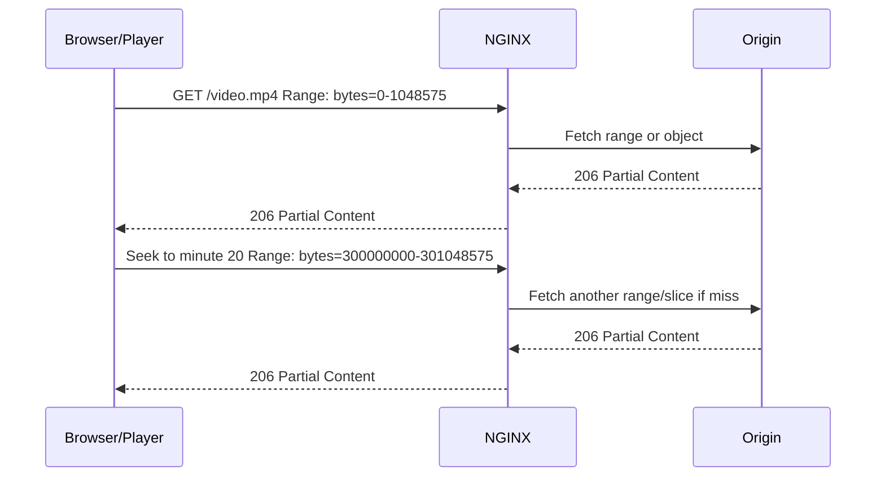
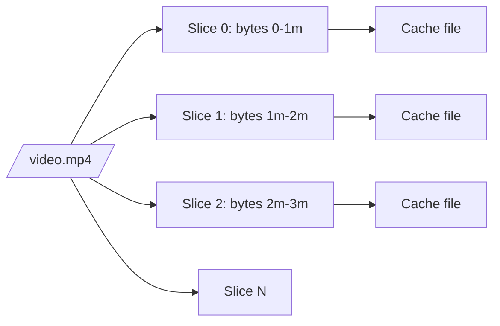
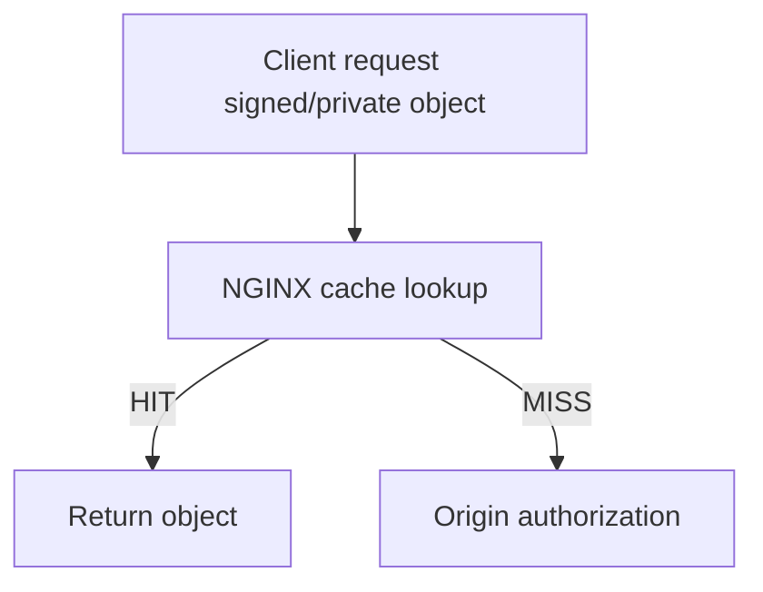
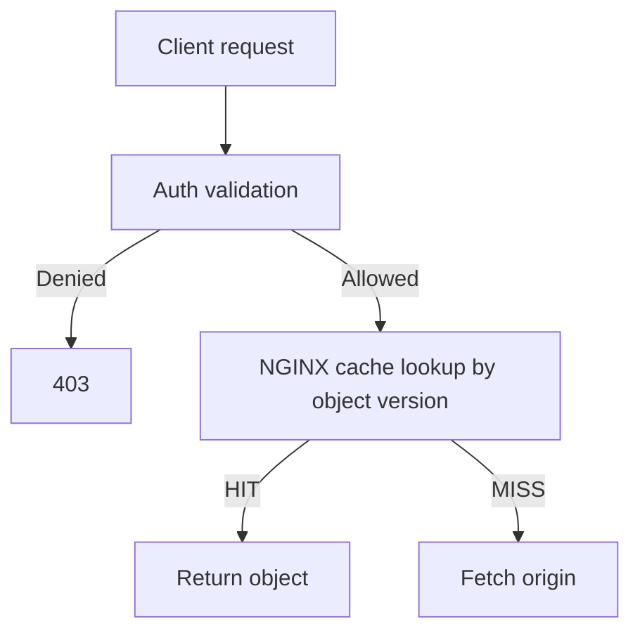
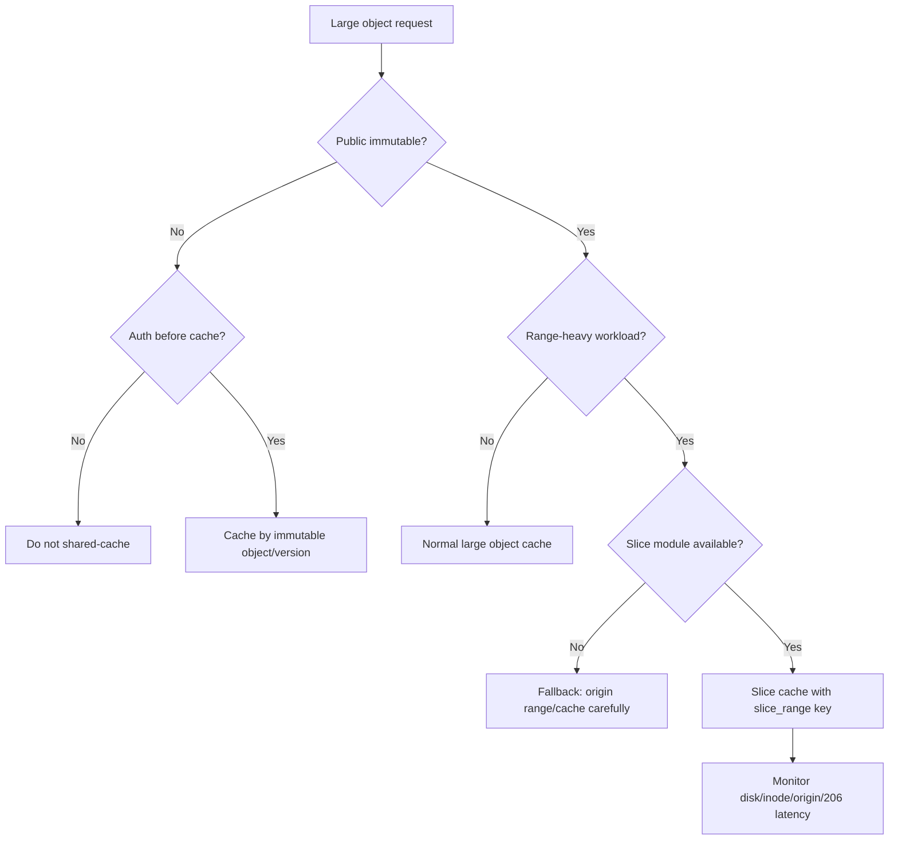

# Part 064 — Range, Slice, Large Object, and Media Delivery

> Large object caching is not just “cache bigger files”. It changes the shape of traffic, disk pressure, origin load, client latency, and failure semantics.

Small API response caching dan static asset caching relatif mudah. File besar berbeda. Video, PDF, archives, reports, backups, ML artifacts, exported evidence bundles, dan media object sering diakses dengan byte-range request, resume download, seek, parallel fetch, atau partial read.

Part ini membahas:

- HTTP byte-range mental model;
- `206 Partial Content`, `Range`, `Content-Range`, `Accept-Ranges`;
- kenapa naive cache untuk file besar bisa buruk;
- NGINX slice module dan batasannya;
- cache key dengan `$slice_range`;
- media seek dan HTML5 video;
- immutable object/versioning;
- range abuse dan overload;
- disk sizing, temp files, and cache eviction;
- production config dan failure drills.

---

## 1. Mental model: file besar bukan satu request

Client sering tidak meminta seluruh file dari byte 0 sampai selesai.

Contoh:

```txt
GET /videos/case-training.mp4
Range: bytes=10485760-11534335
```

Server bisa menjawab:

```txt
HTTP/1.1 206 Partial Content
Content-Range: bytes 10485760-11534335/734003200
Content-Length: 1048576
Accept-Ranges: bytes
```

Untuk video, seek, resume, dan preview, client mungkin meminta range acak.



Jika edge cache memperlakukan file besar seperti object kecil biasa, ia bisa melakukan fetch terlalu besar, menyimpan terlalu besar, atau tidak memberikan latency yang diharapkan.

---

## 2. Range requests: vocabulary

| Term | Meaning |
|---|---|
| `Range` | Request header yang meminta sebagian byte dari resource |
| `206 Partial Content` | Response status untuk partial byte response |
| `Content-Range` | Response header yang menjelaskan byte range dan total size |
| `Accept-Ranges` | Response header yang memberi sinyal range support |
| Multi-range | Request dengan beberapa range dalam satu request |
| Resume download | Client melanjutkan download dari offset tertentu |
| Seek | Media player lompat ke offset berbeda |

Range support adalah contract antara client, edge, dan origin.

---

## 3. Why naive large-object cache is dangerous

Naive config:

```nginx
location /media/ {
    proxy_cache media_cache;
    proxy_cache_valid 200 206 1h;
    proxy_pass http://origin;
}
```

Masalah yang mungkin muncul:

- cache miss untuk partial range dapat memicu origin load besar;
- object sangat besar menghabiskan disk cache;
- eviction object besar dapat mengusir banyak object kecil bernilai tinggi;
- cache fill lama membuat client latency tinggi;
- partial failures sulit diretry setelah header dikirim;
- mutable object dengan URI sama dapat menghasilkan cache campuran;
- range abuse dapat menghasilkan banyak random small reads;
- compression dan range bisa berinteraksi buruk.

Large object cache perlu policy sendiri, bukan digabung dengan API cache.

---

## 4. Separate cache zones for large objects

Jangan campur media/large object dengan API cache.

```nginx
proxy_cache_path /var/cache/nginx/api levels=1:2 keys_zone=api_cache:100m
                 max_size=10g inactive=30m use_temp_path=off;

proxy_cache_path /var/cache/nginx/media levels=1:2 keys_zone=media_cache:500m
                 max_size=500g inactive=7d use_temp_path=off;
```

Alasannya:

- object size berbeda;
- hit pattern berbeda;
- eviction policy perlu berbeda;
- disk pressure berbeda;
- observability berbeda;
- incident blast radius berbeda.

API cache yang kecil dan panas tidak boleh tersingkir oleh satu file video 2 GB.

---

## 5. Immutable object is the safest object

Large object cache paling aman jika URI immutable.

Baik:

```txt
/media/videos/training-2026-07-v3.mp4
/reports/export/case-123/version-456/evidence.zip
/artifacts/model/sha256/abc123...
```

Buruk:

```txt
/media/latest.mp4
/report/current.zip
/download/file?id=123
```

Kenapa immutable penting?

Jika object berubah tetapi URI sama, cache bisa menyajikan:

- old full object;
- old slice;
- new slice;
- mixed partial content;
- wrong `Content-Length`/`Content-Range` assumptions;
- corrupted media playback.

For large objects, prefer:

```txt
URI identity = content identity
```

Bukan hanya business identity.

---

## 6. `ngx_http_slice_module`

NGINX memiliki `ngx_http_slice_module` untuk membagi request menjadi subrequest, masing-masing mengambil range tertentu. Dokumentasi resmi menjelaskan module ini sebagai filter yang memecah request menjadi subrequest dengan range response tertentu dan membantu caching response besar lebih efektif.

Important boundary:

```txt
ngx_http_slice_module is not built by default.
```

Jika build from source, perlu:

```bash
./configure --with-http_slice_module
```

Pada package distro/vendor, ketersediaannya harus diverifikasi:

```bash
nginx -V 2>&1 | grep -- --with-http_slice_module
```

Jangan copy config `slice` ke environment production tanpa memastikan module tersedia.

---

## 7. Slice mental model

Alih-alih menyimpan satu object besar sebagai satu cache entry, NGINX dapat menyimpan potongan byte-range.



Manfaat:

- seek ke offset jauh tidak perlu cache/fetch seluruh file;
- partial reuse lebih baik;
- origin bandwidth lebih terkendali;
- cache fill lebih granular;
- popular segments dapat menjadi hot independently.

Trade-off:

- lebih banyak cache keys;
- lebih banyak files/inodes;
- lebih banyak subrequests;
- range/header correctness lebih kompleks;
- immutable object requirement lebih kuat.

---

## 8. Basic slice cache config

Contoh pattern:

```nginx
proxy_cache_path /var/cache/nginx/media levels=1:2 keys_zone=media_cache:500m
                 max_size=500g inactive=7d use_temp_path=off;

server {
    location /media/ {
        slice 1m;

        proxy_cache media_cache;
        proxy_cache_key "$scheme|$host|$uri|$is_args$args|slice=$slice_range";

        proxy_set_header Range $slice_range;

        proxy_cache_valid 200 206 1d;
        proxy_cache_lock on;

        add_header X-Cache-Status $upstream_cache_status always;

        proxy_pass http://media_origin;
    }
}
```

Hal paling penting:

```nginx
proxy_cache_key ... $slice_range;
proxy_set_header Range $slice_range;
```

Jika `$slice_range` tidak masuk cache key, slice berbeda bisa bertabrakan.

---

## 9. Choosing slice size

Slice size bukan angka dekoratif.

Terlalu kecil:

- terlalu banyak subrequest;
- terlalu banyak cache files;
- metadata overhead tinggi;
- disk seek/inode pressure;
- origin request count naik.

Terlalu besar:

- seek latency naik;
- cache fill berat;
- origin bandwidth waste;
- miss penalty besar;
- cache eviction lebih kasar.

Rule praktis awal:

| Workload | Starting slice size |
|---|---:|
| Short video / preview | `1m` |
| Long video / training media | `1m`–`4m` |
| PDF/report preview | `512k`–`2m` |
| Large archive download | `4m`–`16m` |
| Cold object store origin | Larger slices to reduce request count |

Benchmark dengan real client pattern. Jangan hanya benchmark sequential download.

---

## 10. `$slice_range`

Slice module menyediakan embedded variable `$slice_range`, yang berisi current slice range dalam format cocok untuk request `Range`.

Pattern:

```nginx
slice 1m;
proxy_set_header Range $slice_range;
proxy_cache_key "$uri|$slice_range";
```

Mental model:

```txt
Client asks for some range or whole object.
NGINX internally decomposes into fixed-size slice subrequests.
Each subrequest has its own Range header.
Each slice is cached independently.
```

---

## 11. Cache status with slice

`$upstream_cache_status` bisa menjadi lebih kompleks karena satu client request bisa memicu beberapa internal subrequests.

Kamu mungkin melihat kombinasi:

- first request MISS untuk beberapa slices;
- next request HIT untuk overlapping slices;
- partial HIT/MISS behavior tidak selalu terlihat sempurna dari satu header client response.

Karena itu, observability media cache sering butuh:

- access log di main request;
- upstream logs;
- cache file/disk metrics;
- origin request rate;
- slice hit ratio dari sampling/debug;
- video startup latency dan seek latency.

---

## 12. Known limitation: background update

Dokumentasi slice module mencatat known issue: module ini tidak bekerja seperti yang diharapkan dalam subrequests tertentu, termasuk background cache update; request dapat dibuat tanpa byte range support.

Konsekuensi praktis:

- jangan menggabungkan slice caching dan `proxy_cache_background_update` tanpa test spesifik;
- stale/background update behavior untuk media harus diuji dengan object besar;
- failure setelah header dikirim bisa berakhir sebagai closed connection, bukan clean error page.

Untuk media/large object, simple and explicit sering lebih baik daripada terlalu banyak cache magic.

---

## 13. Range and compression

Range request terhadap compressed content rumit.

Jika client meminta byte range dari compressed representation, byte offset merujuk ke compressed bytes, bukan original file bytes. Untuk media, biasanya file sudah compressed secara container/codec, sehingga HTTP gzip tidak berguna dan bisa merusak range behavior.

Production rule:

```nginx
location /media/ {
    gzip off;
    # brotli off; jika module aktif
    proxy_pass http://media_origin;
}
```

Untuk file seperti `.mp4`, `.zip`, `.gz`, `.br`, `.pdf` tertentu, jangan gzip on-the-fly sembarangan.

---

## 14. Media delivery: startup vs seek latency

Video performance bukan hanya throughput.

Key metrics:

- startup latency: waktu sampai playback mulai;
- rebuffer count;
- seek latency;
- cache hit ratio per segment;
- origin egress;
- 95/99p response time for range requests;
- connection resets after header sent;
- disk read latency.

Jika slice terlalu besar, seek latency bisa buruk. Jika slice terlalu kecil, origin/cache overhead bisa buruk.

---

## 15. Full file download vs video seek

Dua client behavior berbeda.

| Behavior | Pattern | Cache goal |
|---|---|---|
| Full download | Sequential bytes | Throughput and origin offload |
| Video seek | Random ranges | Fast partial access |
| Resume | Starts from offset | Avoid refetch full object |
| Preview | First small bytes | Low startup latency |
| Parallel download | Multiple ranges | Avoid overload and duplication |

Satu config bisa melayani semuanya, tetapi parameter optimalnya berbeda.

---

## 16. Large reports and regulatory exports

Untuk case management/regulatory systems, large objects sering berupa:

- evidence bundle;
- audit export;
- enforcement report;
- legal archive;
- PDF with attachments;
- CSV/Parquet export.

Pertanyaan cache-nya bukan hanya performance:

- siapa boleh download?
- apakah URL signed?
- apakah object immutable?
- apakah export mengandung PII?
- apakah object harus expired by policy?
- apakah cache disk terenkripsi?
- apakah access log cukup untuk audit?
- apakah purge diperlukan ketika case status berubah?

Untuk private exports, sering lebih aman:

1. app authorize;
2. app issue short-lived signed immutable URL;
3. NGINX/object edge cache by object version;
4. strict TTL;
5. audit every download.

---

## 17. Avoid caching raw signed query if possible

Signed URL sering seperti:

```txt
/download/object-123?expires=...&signature=...
```

Jika cache key memakai `$request_uri`, setiap signature berbeda menjadi cache entry berbeda.

```nginx
# May cause low hit ratio and high cardinality
proxy_cache_key "$scheme|$host|$request_uri|$slice_range";
```

Lebih baik jika signature divalidasi sebelum cache layer atau oleh origin/control plane, lalu cache berdasarkan immutable object identity.

Contoh after trusted validation:

```nginx
proxy_cache_key "$scheme|$host|object=$trusted_object_id|version=$trusted_object_version|slice=$slice_range";
```

Namun NGINX Open Source tidak magically validate arbitrary signature. Jangan menghapus signature dari key kecuali authorization sudah benar-benar selesai sebelum cache lookup.

---

## 18. Authorization before cache lookup

Untuk private large object, cache lookup tidak boleh melewati authorization.

Bad flow:



Pada HIT, origin authorization tidak terjadi.

Safer flow:



Jika NGINX cache berada sebelum auth, route private tidak boleh shared-cache kecuali cache key dan signed URL semantics sudah membuktikan authorization.

---

## 19. Range abuse

Range support membuka abuse surface.

Contoh:

- banyak request range kecil acak;
- parallel ranges dari satu client;
- range ke offset sangat jauh untuk cold object;
- multi-range request yang rumit;
- cache-busting query untuk file besar;
- download accelerators membuka banyak connections.

Mitigasi:

```nginx
limit_req_zone $binary_remote_addr zone=media_rate:20m rate=20r/s;
limit_conn_zone $binary_remote_addr zone=media_conn:20m;

location /media/ {
    limit_req zone=media_rate burst=40 nodelay;
    limit_conn media_conn 10;

    proxy_cache media_cache;
    proxy_pass http://media_origin;
}
```

Sesuaikan dengan workload. Jangan pakai angka di atas tanpa load test.

---

## 20. Cache-busting query problem

Untuk media/object:

```txt
/video.mp4?x=1
/video.mp4?x=2
/video.mp4?x=random
```

Jika query tidak meaningful, jangan biarkan query arbitrary masuk cache key.

Gunakan canonicalization:

```nginx
map $arg_v $media_version {
    default "";
    ~^[a-zA-Z0-9._-]{1,64}$ $arg_v;
}

proxy_cache_key "$scheme|$host|$uri|v=$media_version|slice=$slice_range";
```

Tetapi jika query mengandung authorization signature, jangan drop query sebelum auth selesai.

---

## 21. Origin contract for slice caching

Origin harus mendukung range dengan benar.

Checklist origin:

- returns `206` for valid range;
- returns valid `Content-Range`;
- returns stable `ETag`/`Last-Modified` for immutable object;
- handles `If-Range` if used by clients;
- does not gzip media unexpectedly;
- does not return user-specific headers for shared media;
- handles many range requests without overload;
- has object versioning or immutable paths.

Jika origin tidak mendukung range, slice caching tidak akan menyelesaikan masalah.

---

## 22. Cache validity for `200` and `206`

Dengan range/slice, kamu perlu memikirkan status yang di-cache.

```nginx
proxy_cache_valid 200 206 1d;
```

Namun jangan cache error status besar-besaran untuk media private.

```nginx
# Be careful with this on private or frequently changing objects
proxy_cache_valid 404 10m;
```

Untuk public immutable media, short negative cache mungkin berguna. Untuk private/export object, negative caching bisa membuat user yang baru diberi akses tetap melihat stale `403/404`.

---

## 23. `proxy_cache_lock` for large object cache

Jika banyak client meminta slice yang sama saat MISS, origin bisa terkena thundering herd.

```nginx
proxy_cache_lock on;
proxy_cache_lock_timeout 10s;
proxy_cache_lock_age 30s;
```

Dengan slice, lock berlaku per cache key, jadi per slice jika `$slice_range` masuk key.

Manfaat:

- hanya satu request mengisi slice tertentu;
- request lain menunggu atau lewat sesuai timeout;
- origin tidak dihantam duplicate range fetch untuk slice populer.

Trade-off:

- waiting client bisa mengalami latency;
- lock timeout salah bisa membuat duplicate fetch tetap terjadi;
- perlu observability MISS/UPDATING/HIT.

---

## 24. Temp path and disk topology

Large object cache sangat sensitif terhadap disk.

Gunakan:

```nginx
proxy_cache_path /var/cache/nginx/media ... use_temp_path=off;
```

Dengan `use_temp_path=off`, temporary files untuk cache ditempatkan di directory cache yang sama, menghindari copy antar filesystem saat rename ke cache final.

Pertimbangan disk:

- dedicated volume untuk media cache;
- monitoring free space dan inode;
- `max_size` dan `min_free`;
- disk throughput;
- SSD endurance;
- filesystem behavior;
- backup exclusion;
- encryption requirement untuk private objects.

---

## 25. Inode pressure

Slice caching bisa membuat banyak file kecil.

Estimasi kasar:

```txt
number_of_cache_files ~= total_cached_bytes / slice_size
```

Contoh:

```txt
500 GB cache / 1 MB slice ≈ 500,000 cache files
```

Plus metadata/temp/fragmentation.

Monitoring hanya `df -h` tidak cukup. Perlu:

```bash
df -h /var/cache/nginx/media
df -i /var/cache/nginx/media
```

Jika inode habis, disk masih terlihat punya space tetapi cache write gagal.

---

## 26. Large object eviction

`max_size` membatasi cache size, tetapi eviction tidak tahu business value object secara semantik.

Risiko:

- file populer lama bisa tersingkir oleh batch cold downloads;
- API cache tersingkir jika zone dicampur;
- preview slices hot bisa tertahan tapi middle slices cold;
- object besar bisa membuat churn tinggi.

Mitigasi:

- separate cache zone;
- route-specific TTL;
- `inactive` sesuai akses pattern;
- protect critical assets dengan different path/zone;
- prewarm hanya object penting;
- monitor churn.

---

## 27. Prewarming

Prewarming bisa berguna untuk media populer.

```bash
# Warm first few slices / startup path
curl -r 0-1048575 -o /dev/null https://edge.example.com/media/video.mp4
curl -r 1048576-2097151 -o /dev/null https://edge.example.com/media/video.mp4
```

Tetapi prewarm semua object bisa membuang disk dan origin egress.

Prewarm policy:

- only top-N known hot objects;
- only first slices for video startup;
- run after deploy/version publish;
- rate-limit prewarm jobs;
- observe origin impact.

---

## 28. Multi-range requests

HTTP supports requests like:

```txt
Range: bytes=0-99,200-299
```

Multi-range bisa kompleks dan berpotensi abuse.

Banyak sistem memilih untuk tidak mengoptimalkan multi-range dan membiarkan origin/NGINX behavior default. Jika workload media kamu tidak membutuhkan multi-range, pertimbangkan blocking atau normalizing via upstream/application policy.

NGINX config-level handling multi-range secara granular tidak selalu sederhana. Jangan mengklaim support lengkap tanpa test terhadap real players/download clients.

---

## 29. `proxy_force_ranges`

NGINX memiliki directive `proxy_force_ranges` untuk mengaktifkan byte-range support untuk cached dan uncached responses terlepas dari `Accept-Ranges` field dari proxied server.

Gunakan hati-hati.

```nginx
proxy_force_ranges on;
```

Ini bisa membantu jika origin tidak mengirim `Accept-Ranges` tetapi object sebenarnya range-safe. Namun jika origin/object tidak benar-benar mendukung range semantics, kamu bisa membuat client contract yang palsu.

Rule:

```txt
Do not force range support unless object immutability and origin behavior are verified.
```

---

## 30. Large object and upstream retry

Jika response header sudah dikirim ke client, NGINX tidak bisa tiba-tiba mengganti response menjadi clean `502` tanpa merusak protocol semantics. Untuk large streaming/range response, upstream error di tengah transfer sering berakhir dengan connection close.

Implication:

- retry sebelum header dikirim lebih mudah;
- retry setelah body mulai dikirim sangat terbatas;
- client harus mampu resume;
- logs/error logs penting;
- origin stability penting.

Jangan mengandalkan retry sebagai solusi utama untuk unstable media origin.

---

## 31. Observability: log range and cache

Tambahkan field range.

```nginx
log_format media_json escape=json
'{'
  '"time":"$time_iso8601",'
  '"request_id":"$request_id",'
  '"remote_addr":"$remote_addr",'
  '"host":"$host",'
  '"uri":"$uri",'
  '"args":"$args",'
  '"status":$status,'
  '"body_bytes_sent":$body_bytes_sent,'
  '"http_range":"$http_range",'
  '"sent_content_range":"$sent_http_content_range",'
  '"cache":"$upstream_cache_status",'
  '"upstream_status":"$upstream_status",'
  '"upstream_response_time":"$upstream_response_time",'
  '"request_time":$request_time'
'}';
```

Jangan log raw signed URL query jika mengandung secret. Jika perlu, normalize/sanitize.

---

## 32. Metrics for media cache

Track:

- request count by status `200/206/304/416/499/502/504`;
- cache status `HIT/MISS/BYPASS/EXPIRED/STALE/UPDATING`;
- origin egress bytes;
- edge egress bytes;
- average range size;
- distribution of range offsets;
- disk used/free/inodes;
- cache manager activity;
- p95/p99 startup and seek latency;
- upstream error during body transfer;
- client aborts `499`.

`499` can be normal for media seek because clients cancel old ranges after seeking. But spike in `499` with slow response may indicate poor latency.

---

## 33. `416 Range Not Satisfiable`

Status `416` appears when client asks invalid range.

Causes:

- stale client metadata about object size;
- object changed without URI/version change;
- corrupt `Content-Length`/`Content-Range`;
- player bug;
- malicious range request;
- cache has mixed version slices.

If `416` appears frequently, check immutability first.

---

## 34. Mutable object hazard

Worst case:

1. `/video/current.mp4` points to version A.
2. First slices of A cached.
3. Origin replaces file with version B at same URI.
4. Later slices of B cached under same logical key.
5. Client receives mixed A/B bytes.

Mitigation:

- versioned URI;
- content hash path;
- object version in cache key;
- purge all slices on replace;
- avoid replacing large objects in-place.

For slice caching, mutable URI is a correctness smell.

---

## 35. Secure link and expiring access

NGINX has `secure_link` module for checking authenticity of requested links, but it is not built by default when building from source unless enabled. It can be useful for expiring media links.

However, secure link is not a complete authorization system:

- no object-level policy unless encoded externally;
- no role/tenant database lookup;
- link sharing may still grant access until expiry;
- revocation before expiry is hard unless key/version changes;
- logs and secret handling matter.

Use it for simple signed URL expiration, not complex authorization workflows.

---

## 36. Example: public immutable video cache

```nginx
proxy_cache_path /var/cache/nginx/video levels=1:2 keys_zone=video_cache:500m
                 max_size=300g inactive=14d use_temp_path=off;

server {
    location /videos/ {
        gzip off;
        slice 2m;

        proxy_cache video_cache;
        proxy_cache_key "$scheme|$host|$uri|slice=$slice_range";
        proxy_set_header Range $slice_range;

        proxy_cache_valid 200 206 7d;
        proxy_cache_lock on;

        add_header Cache-Control "public, max-age=86400" always;
        add_header X-Cache-Status $upstream_cache_status always;

        proxy_pass http://video_origin;
    }
}
```

Assumptions:

- `/videos/` paths are immutable;
- no auth;
- no user-specific headers;
- origin supports range;
- slice module available;
- disk sized for workload.

---

## 37. Example: private export via auth app + internal file

```nginx
location /exports/download/ {
    proxy_cache off;
    proxy_pass http://auth_app;
}

location /internal-exports/ {
    internal;
    alias /srv/exports/;

    # Usually no shared cache for sensitive exports
    add_header Cache-Control "no-store" always;
}
```

The app decides:

```txt
X-Accel-Redirect: /internal-exports/case-123/export-v456.zip
Content-Disposition: attachment; filename="case-123-export.zip"
```

This avoids NGINX shared cache bypassing app authorization.

If exports are huge and repeated by authorized users, consider signed immutable object URL with explicit expiry and audit, not generic shared cache on `/exports/download/`.

---

## 38. Example: signed immutable object edge

```nginx
location /object-edge/ {
    # Assumption: signature/auth already validated before this location
    # or this endpoint is only reachable from trusted auth gateway.

    slice 4m;
    proxy_cache object_cache;
    proxy_cache_key "$scheme|$host|object=$arg_object|version=$arg_version|slice=$slice_range";
    proxy_set_header Range $slice_range;

    proxy_cache_valid 200 206 1h;
    proxy_cache_lock on;

    proxy_pass http://object_origin;
}
```

Do not use this if public clients can forge `object` and `version` without signature validation.

---

## 39. Failure drill

Test these scenarios before production:

1. First request for first slice is MISS.
2. Second request for same slice is HIT.
3. Seek to far offset causes only relevant slices to fetch.
4. Origin returns `500` during MISS.
5. Origin times out during body.
6. Client cancels request mid-transfer.
7. Disk cache fills near `max_size`.
8. Inode pressure rises.
9. Object replaced at same URI.
10. Invalid range returns expected status.
11. Query cache-busting does not explode keyspace.
12. Authenticated/private object cannot be served from cache without auth.

---

## 40. Benchmark methodology

Benchmark sequential full download is insufficient.

Use workload mix:

- cold first-byte request;
- repeated first slice;
- random seek;
- parallel range requests;
- resume download;
- long-tail object access;
- popular object hot cache;
- cache churn;
- origin latency injection;
- disk pressure.

Measure:

```txt
client perceived latency
origin request count
origin egress bytes
cache disk read/write
CPU/syscall overhead
cache hit ratio per route/object class
p99 request_time for 206 responses
```

---

## 41. Production checklist

Before enabling large-object cache:

- Slice module availability verified with `nginx -V`.
- Large objects have separate cache zone.
- Object paths are immutable or versioned.
- Cache key includes `$slice_range` when using `slice`.
- Origin supports byte ranges correctly.
- Compression is disabled for already-compressed media.
- Signed/private URL auth occurs before cache lookup.
- Query dimensions are normalized.
- `proxy_cache_lock` considered for popular slices.
- Disk size and inode capacity are monitored.
- Range abuse has rate/connection controls.
- `416`, `499`, `502`, `504` are monitored.
- Replacement/purge story exists for mutable objects.
- Failure drills pass.

---

## 42. Mental model final



---

## 43. Kesimpulan

Range, slice, dan large-object caching membuat NGINX sangat berguna untuk media delivery, download acceleration, report exports, dan private edge object systems. Tetapi konfigurasi ini memiliki risiko correctness yang lebih tinggi daripada cache API kecil.

Prinsip production:

- pisahkan cache zone untuk object besar;
- gunakan immutable/versioned URI;
- pastikan origin range contract benar;
- pakai slice hanya jika module tersedia dan workload cocok;
- masukkan `$slice_range` ke cache key;
- jangan gzip media sembarangan;
- jangan biarkan cache lookup melewati authorization;
- monitor disk, inode, origin egress, dan `206` latency.

Invariant terakhir:

```txt
Every cached byte range must belong to the same immutable object identity that the client is authorized to receive.
```

Jika invariant itu benar, NGINX bisa menjadi high-performance object edge. Jika salah, ia bisa menjadi mesin distribusi byte yang salah dengan sangat cepat.

---

## Official references

- NGINX `ngx_http_slice_module`: `slice`, `$slice_range`, known issues, module build boundary — https://nginx.org/en/docs/http/ngx_http_slice_module.html
- NGINX Building from Sources: `--with-http_slice_module` — https://nginx.org/en/docs/configure.html
- NGINX `ngx_http_proxy_module`: `proxy_cache`, `proxy_cache_key`, `proxy_cache_lock`, `proxy_force_ranges`, `proxy_cache_valid`, temp files, cache headers — https://nginx.org/en/docs/http/ngx_http_proxy_module.html
- F5/NGINX Content Caching Admin Guide — https://docs.nginx.com/nginx/admin-guide/content-cache/content-caching/
- NGINX blog: Smart and Efficient Byte-Range Caching with NGINX — https://blog.nginx.org/blog/smart-efficient-byte-range-caching-nginx
