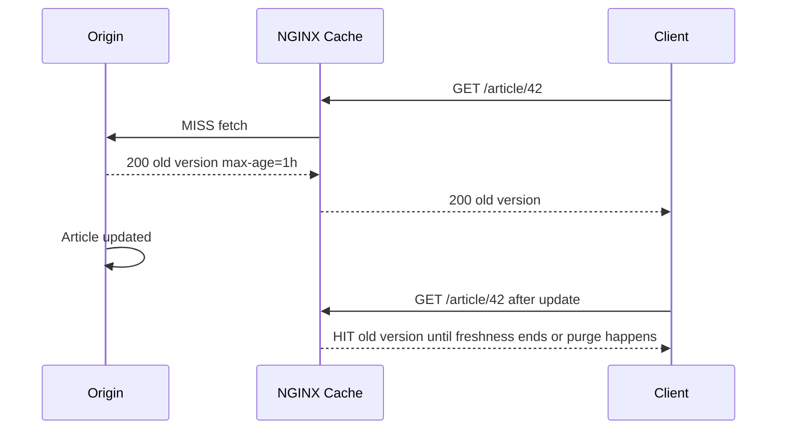
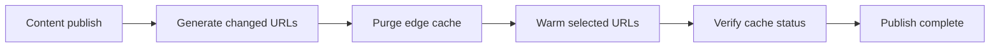
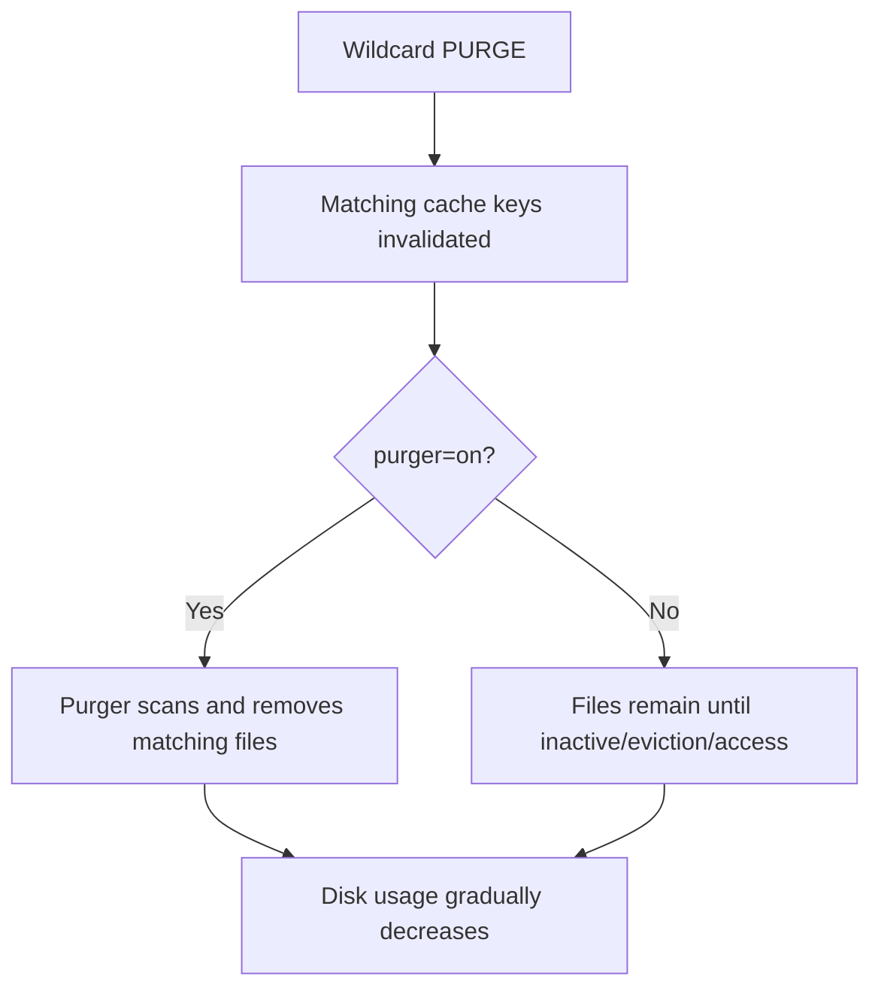
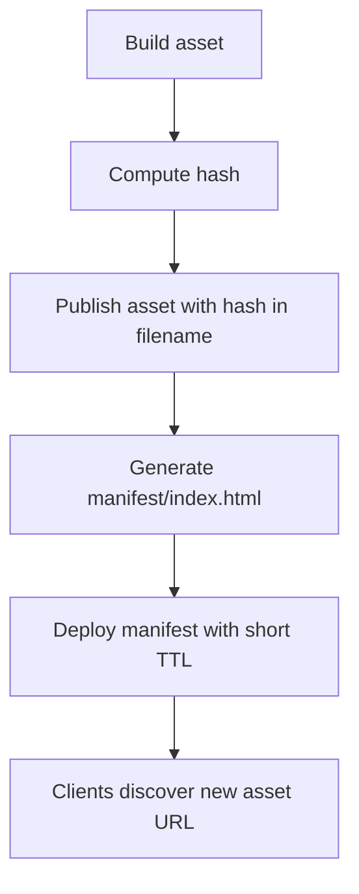
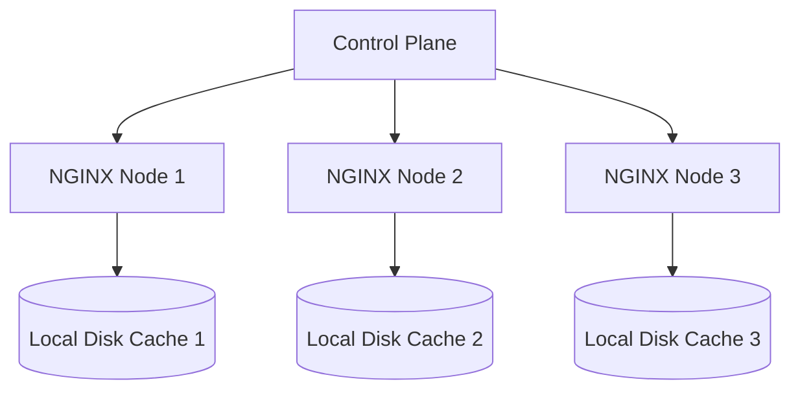
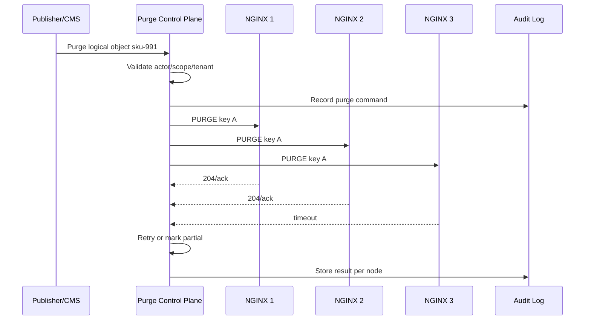
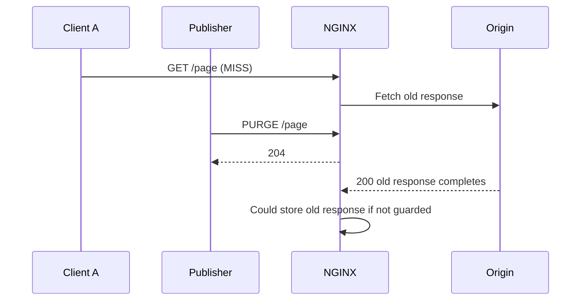
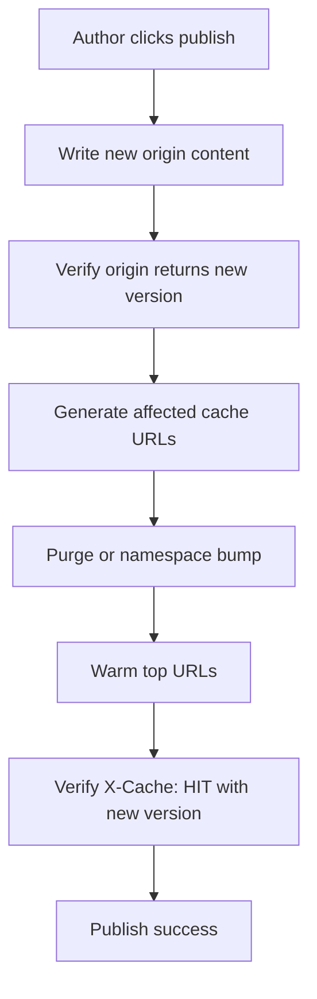
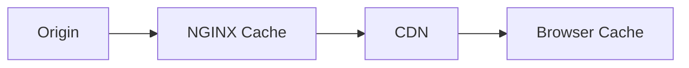
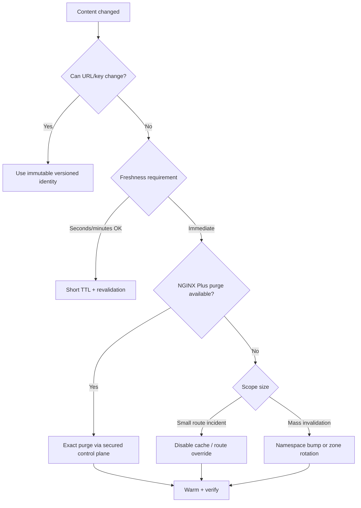

# Part 065 — Cache Purge Patterns: Open Source Workaround vs Plus Capability

> Cache invalidation is not an endpoint. It is a distributed consistency problem with an HTTP interface.

Di part sebelumnya kita sudah membahas cache key, stale behavior, private cache, dan large-object caching. Sekarang kita masuk ke bagian yang biasanya baru terasa penting setelah production incident pertama: **bagaimana menghapus atau mengganti cache yang sudah terlanjur tersimpan**.

Banyak engineer langsung bertanya:

```txt
How do I purge NGINX cache?
```

Pertanyaan itu belum cukup tajam. Pertanyaan production yang benar:

```txt
What consistency model do we want between origin, cache, clients, and every NGINX node?
```

Karena purge bukan hanya “hapus file”. Purge menyentuh:

- cache key identity;
- cache freshness;
- multi-node propagation;
- race antara request lama dan purge;
- stale fallback;
- disk cleanup;
- audit trail;
- security boundary;
- rollback;
- blast radius jika purge terlalu luas;
- correctness untuk user-specific/private content.

Part ini membahas:

- bedanya expiration, revalidation, invalidation, purge, dan versioning;
- kenapa immutable URL sering lebih baik daripada purge;
- batas kemampuan NGINX Open Source vs NGINX Plus;
- `proxy_cache_purge` dan `purger=on` boundary;
- pattern Open Source yang aman;
- anti-pattern menghapus file cache secara manual;
- desain purge endpoint yang tidak bisa disalahgunakan;
- multi-node purge;
- operational playbook untuk content update, emergency revoke, dan privacy leak.

---

## 1. Mental model: cache object punya identity, freshness, dan lifecycle

Satu cached response bukan hanya body. Ia adalah record yang kira-kira punya bentuk mental seperti ini:

```txt
CacheRecord {
  key: "https|api.example.com|GET|/v1/products?page=1|accept-encoding:gzip",
  status: 200,
  response_headers: {...},
  body_file: /var/cache/nginx/proxy/a/bc/..., 
  created_at: t0,
  valid_until: t1,
  last_accessed_at: t2,
  metadata: cache-control, etag, last-modified, vary, ...
}
```

Ketika origin berubah, tidak otomatis berarti cache berubah.



Itu bukan bug. Itu konsekuensi dari kontrak cache.

Jika sistem mengharapkan update origin langsung terlihat ke semua client, maka cache TTL panjang tanpa invalidation adalah desain yang salah.

---

## 2. Lima mekanisme perubahan cache

Production cache biasanya memakai kombinasi lima mekanisme.

| Mekanisme | Apa yang terjadi | Cocok untuk | Risiko |
|---|---|---|---|
| Expiration | Cache dibiarkan valid sampai TTL habis | konten toleran stale | update lambat terlihat |
| Revalidation | Setelah expired, NGINX tanya origin dengan validator | konten yang punya `ETag`/`Last-Modified` | origin tetap kena request saat revalidate |
| Purge | Cache entry dihapus eksplisit | emergency revoke, CMS publish | perlu control plane aman |
| Versioning | URL/cache key berubah saat content berubah | static assets, immutable object | perlu build/deploy discipline |
| Namespace bump | prefix key diganti untuk satu domain/route/tenant | mass invalidation cepat | cache lama tertinggal di disk sampai eviction |

Jangan memperlakukan semua problem sebagai purge problem. Banyak kasus lebih aman diselesaikan dengan versioning.

---

## 3. Prinsip utama: prefer immutable identity over mutable purge

Untuk static assets, report bundle, exported file, media object, dan artifact build, strategi terbaik biasanya bukan purge, tapi **immutable URL**.

Contoh buruk:

```txt
/app.js
/styles.css
/manual.pdf
```

Contoh lebih baik:

```txt
/assets/app.82f14c0.js
/assets/styles.31bd91d.css
/manuals/regulatory-case-guide-v17.pdf
/exports/case-123/report-2026-07-07T090031Z.pdf
```

Konfigurasi:

```nginx
location /assets/ {
    proxy_pass http://asset_origin;
    proxy_cache edge_static;
    proxy_cache_key "$scheme|$host|$request_method|$uri|$is_args$args|ae:$http_accept_encoding";
    proxy_cache_valid 200 301 302 365d;
    add_header Cache-Control "public, max-age=31536000, immutable" always;
}

location = /index.html {
    proxy_pass http://web_origin;
    proxy_cache edge_html;
    proxy_cache_valid 200 30s;
    add_header Cache-Control "no-cache" always;
}
```

Dengan model ini:

- asset lama tetap valid untuk client lama;
- asset baru punya URL baru;
- rollback tinggal mengembalikan HTML manifest;
- tidak perlu purge massal;
- CDN/browser/NGINX punya contract yang sama.

Invariant:

```txt
If content bytes can change, either the URL/key must change or the cache must be invalidated.
```

---

## 4. Kapan purge memang dibutuhkan

Purge masuk akal ketika content identity memang mutable dan harus segera diganti.

Contoh:

- CMS article dipublish ulang di URL yang sama;
- product price yang tidak boleh stale lama;
- legal/regulatory page yang harus segera update;
- file yang salah upload ke URL publik;
- API response public yang TTL panjang tapi data berubah;
- object yang harus direvoke karena privacy/security incident.

Purge juga bisa dipakai untuk cache warmup pipeline:



Tetapi purge harus diperlakukan sebagai **privileged mutation operation**.

---

## 5. Batas Open Source vs NGINX Plus

Tabel operasional:

| Capability | NGINX Open Source baseline | NGINX Plus / commercial boundary |
|---|---|---|
| Normal proxy cache | Ya | Ya |
| TTL/validity control | Ya | Ya |
| Bypass/no-cache | Ya | Ya |
| Revalidation | Ya | Ya |
| Stale on error/updating | Ya | Ya |
| `proxy_cache_purge` | Commercial boundary pada dokumentasi NGINX | Ya |
| Wildcard purge by key | Commercial boundary | Ya |
| Cache purger process `purger=on` | Commercial boundary | Ya |
| Built-in Plus API/cache controls | Tidak | Ya, tergantung versi/product |
| Manual cache namespace bump | Ya | Ya |
| Delete cache directory externally | Bisa, tapi operational workaround | Bisa, tapi tetap kasar |
| Third-party purge module | Mungkin, bukan baseline resmi | Biasanya tidak perlu |

Point penting: jangan menulis handbook internal seolah `proxy_cache_purge` selalu tersedia di NGINX Open Source. Pada dokumentasi resmi module proxy, directive tersebut diberi catatan commercial subscription.

---

## 6. Apa yang dilakukan `proxy_cache_purge`

Secara konsep, `proxy_cache_purge` membuat request tertentu dianggap sebagai purge request. Jika kondisi directive bernilai non-empty dan bukan `0`, NGINX menghapus cache entry yang cocok dengan cache key.

Minimal mental model:

```nginx
proxy_cache_key "$scheme|$host|$uri|$is_args$args";
proxy_cache_purge $purge_allowed;
```

Jika request purge datang untuk URI yang sama dan `$purge_allowed` bernilai `1`, entry dengan key yang sama akan dihapus.

Contoh Plus-style config:

```nginx
proxy_cache_path /var/cache/nginx/api
    levels=1:2
    keys_zone=api_cache:100m
    max_size=20g
    inactive=60m
    use_temp_path=off
    purger=on;

geo $purge_ip_allowed {
    default          0;
    127.0.0.1        1;
    10.0.0.0/8       1;
    192.168.0.0/16   1;
}

map $request_method $purge_method_allowed {
    default 0;
    PURGE   1;
}

map "$purge_ip_allowed:$purge_method_allowed" $purge_allowed {
    default 0;
    "1:1"   1;
}

server {
    listen 443 ssl;
    server_name api.example.com;

    location /v1/catalog/ {
        proxy_pass http://catalog_backend;
        proxy_cache api_cache;
        proxy_cache_key "$scheme|$host|GET|$uri|$is_args$args";
        proxy_cache_purge $purge_allowed;
    }
}
```

Catatan: contoh di atas masih harus dilengkapi TLS, auth control-plane, logging, dan request validation.

---

## 7. Wildcard purge bukan instant disk cleanup

Wildcard purge tampak menggoda:

```bash
curl -X PURGE 'https://api.example.com/v1/catalog/*'
```

Tetapi ada nuance penting:

- matching cache entry dapat dianggap purged;
- file yang cocok wildcard bisa tetap ada di disk;
- file tersebut hilang karena inactivity, ketika diakses lagi, atau ketika cache purger process aktif;
- `purger=on` sendiri berada pada commercial boundary.

Ini penting untuk capacity planning. Setelah wildcard purge besar, disk usage tidak selalu langsung turun.



Jangan menjadikan wildcard purge sebagai mekanisme rutin untuk ribuan/milion keys tanpa memahami disk cleanup dan scan cost.

---

## 8. Security invariant untuk purge endpoint

Purge endpoint harus lebih dekat ke admin API daripada public API.

Invariant:

```txt
No untrusted client may be able to remove, poison, or fan-out purge cache entries.
```

Minimal controls:

- hanya menerima dari private network/control plane;
- mTLS atau signed request;
- method khusus seperti `PURGE` tidak cukup sebagai security;
- allowlist IP bukan satu-satunya security jika ada proxy chain;
- log semua purge request;
- limit rate purge;
- batasi wildcard;
- batasi path prefix;
- gunakan dedicated hostname jika mungkin;
- jangan expose purge endpoint lewat CDN publik;
- pisahkan purge untuk tenant A dan tenant B.

Contoh dedicated control host:

```nginx
server {
    listen 8443 ssl;
    server_name nginx-cache-admin.internal;

    ssl_verify_client on;
    ssl_client_certificate /etc/nginx/pki/cache-admin-ca.pem;

    access_log /var/log/nginx/cache-purge-access.log cache_purge_json;

    location /purge/catalog/ {
        allow 10.20.0.0/16;
        deny all;

        # In Plus: map request path to actual cached location carefully.
        # Keep purge surface small and auditable.
        proxy_pass http://catalog_backend;
        proxy_cache api_cache;
        proxy_cache_key "$scheme|api.example.com|GET|/v1/catalog/$arg_key";
        proxy_cache_purge 1;
    }
}
```

Better pattern: jangan langsung expose raw URL purge. Buat control plane yang menerima logical object identity, memvalidasi ownership, lalu menerjemahkan ke key/path purge.

---

## 9. Jangan membiarkan user memilih raw cache key

Raw cache key adalah internal implementation detail.

Buruk:

```txt
PURGE /purge?cache_key=https|api.example.com|GET|/anything
```

Lebih baik:

```txt
POST /admin/cache/purge
{
  "tenant": "t-123",
  "resource_type": "catalog_item",
  "id": "sku-991",
  "reason": "price_update",
  "request_id": "pub-20260707-001"
}
```

Control plane kemudian menentukan URL mana yang valid:

```txt
/v1/catalog/items/sku-991
/v1/catalog/search?q=sku-991
/v1/catalog/tenants/t-123/items/sku-991
```

Ini membuat purge:

- auditable;
- idempotent;
- tenant-safe;
- rate-limited;
- bisa di-retry;
- bisa diuji tanpa membuka cache internals ke caller.

---

## 10. Open Source strategy 1: versioned URL

Ini adalah strategi paling aman untuk static/public content.

```txt
/logo.png                  # mutable, bad for long cache
/logo.2026-07-07.png       # better
/logo.9c7a71e.png          # best for build artifacts
```

Pipeline:



NGINX config:

```nginx
location ~* ^/assets/.+\.[0-9a-f]{8,}\.(js|css|png|jpg|svg|woff2)$ {
    proxy_pass http://asset_origin;
    proxy_cache static_cache;
    proxy_cache_valid 200 365d;
    add_header Cache-Control "public, max-age=31536000, immutable" always;
}

location = /index.html {
    proxy_pass http://web_origin;
    proxy_cache html_cache;
    proxy_cache_valid 200 30s;
    add_header Cache-Control "no-cache" always;
}
```

Dengan ini, purge tidak dibutuhkan untuk asset normal.

---

## 11. Open Source strategy 2: short TTL + revalidation

Untuk konten mutable yang tidak perlu instant consistency, gunakan TTL pendek dan validator.

Origin response:

```http
Cache-Control: public, max-age=60
ETag: "catalog-v28491"
Last-Modified: Tue, 07 Jul 2026 06:31:00 GMT
```

NGINX:

```nginx
location /v1/catalog/ {
    proxy_pass http://catalog_backend;
    proxy_cache api_cache;
    proxy_cache_valid 200 60s;
    proxy_cache_revalidate on;
    proxy_cache_use_stale error timeout updating http_500 http_502 http_503 http_504;
    proxy_cache_lock on;
}
```

Trade-off:

- update visible dalam sekitar TTL;
- origin masih dilindungi dari herd;
- lebih sederhana daripada purge fan-out;
- tidak cocok untuk emergency revoke.

---

## 12. Open Source strategy 3: cache namespace bump

Namespace bump artinya memasukkan versi global/route/tenant ke cache key.

```nginx
map $host $cache_namespace {
    default "v20260707a";
}

proxy_cache_key "$cache_namespace|$scheme|$host|GET|$uri|$is_args$args";
```

Ketika ingin invalidate semua cache untuk route/host tertentu, ubah namespace:

```nginx
map $host $cache_namespace {
    default "v20260707b";
}
```

Reload NGINX:

```bash
nginx -t && nginx -s reload
```

Efek:

- semua lookup memakai key baru;
- cache lama tidak dipakai lagi;
- disk lama tetap ada sampai `inactive`/eviction;
- warmup ulang diperlukan;
- blast radius sesuai scope namespace.

Pattern ini sangat berguna untuk mass invalidation di NGINX Open Source.

---

## 13. Namespace jangan selalu global

Global namespace bump terlalu kasar.

Buruk:

```nginx
proxy_cache_key "$global_cache_version|$scheme|$host|$uri|$args";
```

Lebih baik:

```nginx
map $uri $route_cache_namespace {
    default                  "default-v17";
    ~^/v1/catalog/           "catalog-v28491";
    ~^/v1/public-pricing/    "pricing-v921";
    ~^/assets/               "assets-v20260707";
}

proxy_cache_key "$route_cache_namespace|$scheme|$host|GET|$uri|$is_args$args";
```

Lebih granular lagi untuk tenant:

```nginx
map $host $tenant_cache_namespace {
    tenant-a.example.com "tenant-a-v31";
    tenant-b.example.com "tenant-b-v09";
    default              "unknown-v0";
}

proxy_cache_key "$tenant_cache_namespace|$scheme|$host|GET|$uri|$is_args$args";
```

Tetapi hati-hati: namespace yang terlalu banyak dapat membuat hit ratio turun dan memory zone membengkak.

---

## 14. Open Source strategy 4: zone rotation

Jika cache salah besar dan harus dihindari segera, Anda bisa membuat cache zone baru dan memindahkan route ke zone baru.

Sebelum:

```nginx
proxy_cache_path /var/cache/nginx/api-v1 keys_zone=api_v1:100m max_size=20g inactive=60m;

location /v1/ {
    proxy_cache api_v1;
}
```

Sesudah:

```nginx
proxy_cache_path /var/cache/nginx/api-v2 keys_zone=api_v2:100m max_size=20g inactive=60m;

location /v1/ {
    proxy_cache api_v2;
}
```

Reload membuat request baru memakai zone/path baru.

Kelebihan:

- cepat secara operational;
- tidak perlu tahu key per object;
- rollback bisa kembali ke zone lama jika aman.

Kekurangan:

- cold cache;
- disk lama masih perlu cleanup;
- memory zone baru;
- tidak cocok untuk purge selektif.

---

## 15. Open Source strategy 5: disable cache sementara

Untuk incident tertentu, lebih aman mematikan cache route sementara.

```nginx
map $uri $cache_disabled_route {
    default        0;
    ~^/v1/prices/  1;
}

proxy_cache_bypass $cache_disabled_route;
proxy_no_cache     $cache_disabled_route;
```

Atau lebih eksplisit:

```nginx
location /v1/prices/ {
    proxy_pass http://pricing_backend;
    proxy_cache off;
    add_header X-Cache-Policy "disabled-during-incident" always;
}
```

Gunakan ini saat correctness lebih penting daripada origin protection.

---

## 16. Open Source strategy 6: delete cache directory externally

Ini adalah last resort.

```bash
systemctl stop nginx
rm -rf /var/cache/nginx/api/*
systemctl start nginx
```

Atau dengan hati-hati saat running:

```bash
find /var/cache/nginx/api -type f -delete
```

Tetapi pahami risiko:

- NGINX bisa sedang membaca/menulis temp/cache file;
- cache metadata shared memory tidak otomatis “tahu” semua external deletion secara ideal;
- cold start origin spike;
- file deletion masif bisa membebani disk;
- jika salah path, data lain ikut terhapus;
- multi-node tetap harus dilakukan di setiap node.

Pattern yang lebih aman:

1. switch route ke zone/path baru;
2. reload;
3. tunggu traffic stabil;
4. hapus path lama bertahap dengan ionice/nice;
5. monitor origin dan disk.

```bash
ionice -c3 nice -n 19 find /var/cache/nginx/api-v1 -type f -delete
```

---

## 17. Jangan mencoba menghitung MD5 file cache secara manual untuk purge selektif

NGINX menyimpan cache file berdasarkan hash dari cache key. Secara teori orang bisa mencoba menghitung path cache file lalu menghapusnya. Dalam praktik production, ini rapuh.

Kenapa?

- cache key sering mengandung normalized URI, host, scheme, method, header, cookie, tenant, `$slice_range`;
- cache header format bisa berubah antar versi;
- wildcard/key matching tidak trivial;
- race dengan writer/reader;
- debugging lebih sulit;
- bisa menghapus object yang salah jika key assumption salah.

Manual file deletion selektif hanya layak sebagai forensics/lab, bukan control plane normal.

---

## 18. Third-party purge modules

Ada third-party modules yang menawarkan purge untuk NGINX Open Source. Ini bisa berguna di beberapa organisasi, tetapi harus diperlakukan sebagai supply-chain dan lifecycle decision.

Checklist sebelum memakai third-party purge module:

- kompatibel dengan versi NGINX yang dipakai;
- mendukung dynamic module atau perlu build custom;
- punya maintenance aktif;
- punya test untuk upgrade NGINX;
- tidak mengubah cache semantics tanpa jelas;
- security review dilakukan;
- rollback package tersedia;
- observability purge tersedia;
- tim platform siap menjaga build pipeline.

Jangan menambahkan third-party module hanya karena ingin endpoint PURGE cepat. Cost sebenarnya muncul saat upgrade security NGINX.

---

## 19. Multi-node purge problem

Dalam production, NGINX jarang satu node.



Purge satu node tidak membersihkan node lain.

Control plane harus menjawab:

- node mana saja yang menyimpan cache?
- purge dikirim ke semua node atau hanya yang aktif?
- bagaimana kalau node sedang down saat purge?
- apakah purge request idempotent?
- berapa lama consistency window?
- apakah ada retry queue?
- apakah node baru yang autoscale membawa cache kosong atau persistent volume lama?

Pattern yang baik:

```txt
PurgeCommand {
  id: uuid,
  scope: route/object/tenant,
  keys: [...],
  created_at,
  expires_at,
  reason,
  actor,
  required_ack_policy: quorum|all|best_effort
}
```

---

## 20. Fan-out purge control plane

Purge control plane minimal:



Jangan menyembunyikan partial failure. Purge partial berarti sebagian client masih bisa melihat content lama.

---

## 21. Race condition: purge vs in-flight fill

Scenario:



Mitigasi:

- origin publish harus selesai sebelum purge;
- purge setelah origin state visible;
- gunakan versioned key untuk critical updates;
- untuk emergency revoke, disable cache route sementara;
- gunakan `proxy_no_cache` guard selama incident;
- warmup setelah purge untuk memastikan cache baru terisi.

Purge bukan transaction across origin and cache.

---

## 22. Publish pipeline yang aman

Untuk CMS/public page:



Key invariant:

```txt
Never purge before the origin can serve the replacement content.
```

Jika purge terlalu cepat, request berikutnya akan mengisi cache dengan versi lama lagi.

---

## 23. Emergency revoke playbook

Kasus: file salah upload berisi data sensitif.

Urutan:

1. remove object from origin or make origin return `404/410`;
2. disable cache for affected route or namespace bump;
3. purge exact key jika Plus tersedia;
4. purge wildcard only if scope benar-benar dipahami;
5. delete old cache path/zone if Open Source and emergency severity tinggi;
6. invalidate CDN/browser layer jika ada;
7. rotate URL/object identifier;
8. inspect access logs siapa yang menerima object;
9. add regression test agar path tidak cacheable lagi;
10. post-incident review cache policy.

Emergency config patch:

```nginx
location = /downloads/leaked-file.pdf {
    proxy_pass http://origin;
    proxy_cache off;
    return 410;
}
```

Untuk privacy leak, jangan hanya mengandalkan purge. Ubah origin behavior dan route policy.

---

## 24. Purge dan browser cache

NGINX purge tidak bisa menghapus browser cache.

Jika Anda pernah mengirim:

```http
Cache-Control: public, max-age=31536000, immutable
```

untuk URL mutable, browser bisa terus memakai copy lama walaupun NGINX sudah purge.

Itulah alasan immutable URL penting. Edge purge hanya membersihkan edge. Ia tidak mengendalikan semua cache downstream.



Purge di NGINX tidak otomatis purge CDN/browser.

---

## 25. Purge dan CDN di depan NGINX

Jika CDN berada di depan NGINX:

```txt
Client -> CDN -> NGINX -> Origin
```

Maka purge order matters.

Biasanya:

1. update origin;
2. purge NGINX/origin shield;
3. purge CDN;
4. warm CDN through NGINX;
5. verify from outside.

Jika CDN dipurge dulu, CDN bisa mengisi ulang dari NGINX yang masih menyimpan versi lama.

---

## 26. Purge dan stale behavior

Jika memakai:

```nginx
proxy_cache_use_stale error timeout updating http_500 http_502 http_503 http_504;
```

pastikan memahami interaksi dengan purge. Purge harus membuat entry tidak tersedia. Tetapi jika purge tidak benar-benar mencapai semua node, stale lama bisa tetap keluar dari node yang belum dipurge.

Untuk emergency correctness:

```nginx
map $uri $disable_stale_for_incident {
    default 0;
    /sensitive/object.pdf 1;
}
```

NGINX tidak mendukung conditional `proxy_cache_use_stale` secara fleksibel untuk semua pola hanya dengan variable di semua parameter, jadi incident patch sering lebih aman dengan route-specific location:

```nginx
location = /sensitive/object.pdf {
    proxy_cache off;
    return 410;
}
```

---

## 27. Purge dan negative cache

Jangan lupa negative cache.

Jika Anda cache `404`:

```nginx
proxy_cache_valid 404 1m;
```

Maka object baru yang tadinya tidak ada bisa tetap terlihat `404` sampai TTL habis atau dipurge.

Untuk publish workflow yang membuat URL baru, negative cache TTL harus pendek atau publish pipeline harus purge negative entry.

Contoh:

```nginx
proxy_cache_valid 200 10m;
proxy_cache_valid 404 10s;
```

Negative cache berguna untuk melindungi origin dari scan, tetapi berbahaya untuk newly-created content.

---

## 28. Purge wildcard harus punya blast-radius control

Jangan biarkan operasi seperti ini bebas:

```txt
PURGE https://api.example.com/*
```

Blast radius terlalu besar.

Lebih baik:

```txt
PURGE /v1/catalog/items/sku-991
PURGE /v1/catalog/categories/electronics
PURGE /assets/release-20260707/*
```

Control plane policy:

```yaml
purgePolicies:
  catalog-item:
    allowedPattern: '^/v1/catalog/items/[a-zA-Z0-9_-]+$'
    wildcardAllowed: false
  static-release:
    allowedPattern: '^/assets/release-[0-9]{8}/.*$'
    wildcardAllowed: true
    maxWildcardPerHour: 3
```

---

## 29. Logging purge requests

Purge harus punya log sendiri.

```nginx
log_format cache_purge_json escape=json
  '{'
    '"ts":"$time_iso8601",'
    '"remote_addr":"$remote_addr",'
    '"realip":"$realip_remote_addr",'
    '"method":"$request_method",'
    '"host":"$host",'
    '"uri":"$request_uri",'
    '"status":$status,'
    '"request_id":"$request_id",'
    '"user_agent":"$http_user_agent",'
    '"ssl_client_s_dn":"$ssl_client_s_dn"'
  '}';
```

Gunakan dedicated access log di purge server/location:

```nginx
access_log /var/log/nginx/cache_purge.log cache_purge_json;
```

Minimal audit fields:

- timestamp;
- actor/service identity;
- source IP after trusted real IP;
- purge scope;
- request id;
- response status;
- node id;
- reason/change id;
- wildcard flag;
- result per node.

---

## 30. Cache warmup setelah purge

Purge membuat cold cache. Untuk traffic besar, purge massal tanpa warmup bisa membuat origin spike.

Warmup plan:

```bash
while read -r url; do
  curl -fsS -H 'Host: api.example.com' "https://edge.internal$url" >/dev/null || echo "warm failed $url"
done < hot-urls.txt
```

Tetapi warmup harus:

- rate-limited;
- memakai representative headers;
- memakai same cache key dimension;
- tidak membawa user credentials untuk shared cache;
- memverifikasi status/version;
- tidak warming URL yang seharusnya private.

Tambahkan header debug internal:

```nginx
add_header X-Cache-Status $upstream_cache_status always;
add_header X-Origin-Version $upstream_http_x_content_version always;
```

Header seperti ini sebaiknya hanya untuk internal/staging atau dikontrol, bukan selalu public.

---

## 31. Purge idempotency

Purge harus idempotent.

Artinya:

```txt
Purge(key) once == Purge(key) many times
```

Control plane tidak boleh gagal hanya karena key sudah tidak ada.

Response semantics yang bisa dipakai:

| Case | Result |
|---|---|
| key existed and removed | success |
| key did not exist | success/no-op |
| unauthorized | fail |
| invalid scope | fail |
| node unavailable | retry/partial |
| wildcard too broad | fail |

Jangan menjadikan “cache entry not found” sebagai fatal error untuk publish pipeline normal.

---

## 32. Purge consistency SLO

Tentukan SLO.

Contoh:

```txt
99% of public content purge operations must be effective across all active edge nodes within 30 seconds.
Emergency revoke must disable serving from cache within 5 seconds through route-level cache disable or 410 override.
```

Tanpa SLO, tim akan berdebat saat incident karena tidak ada target konsistensi.

Metrics:

- purge command latency;
- node ack latency;
- partial failure count;
- wildcard purge count;
- warmup success;
- post-purge stale hit count;
- origin spike after purge;
- disk cleanup lag.

---

## 33. Decision matrix

| Problem | Recommended pattern |
|---|---|
| hashed static asset update | immutable URL, no purge |
| HTML shell update | short TTL + revalidation; optionally purge exact URL |
| CMS article update | exact purge or short TTL depending freshness requirement |
| product price update | short TTL, revalidation, selective purge for hot keys |
| emergency legal correction | origin update + purge + CDN purge + verification |
| privacy leak | origin revoke + cache off/410 + purge/zone rotate + log investigation |
| mass catalog reindex | namespace bump + warmup, not millions of individual purge calls |
| tenant deactivation | tenant namespace disable + route deny + cache cleanup |
| large media replacement | never mutate same URL; publish new object/version |
| Open Source immediate mass purge | namespace bump or zone rotation |

---

## 34. Lab: namespace bump invalidation in Open Source

Create cache namespace file generated by CI:

```nginx
# /etc/nginx/generated/cache-namespaces.conf
map $uri $cache_namespace {
    default "default-v1";
    ~^/v1/catalog/ "catalog-v20260707-001";
}
```

Use it:

```nginx
include /etc/nginx/generated/cache-namespaces.conf;

proxy_cache_path /var/cache/nginx/api levels=1:2 keys_zone=api_cache:100m max_size=10g inactive=60m use_temp_path=off;

server {
    listen 8080;
    server_name api.example.test;

    location /v1/catalog/ {
        proxy_pass http://catalog_backend;
        proxy_cache api_cache;
        proxy_cache_key "$cache_namespace|$scheme|$host|GET|$uri|$is_args$args";
        proxy_cache_valid 200 10m;
        add_header X-Cache-Status $upstream_cache_status always;
        add_header X-Cache-Namespace $cache_namespace always;
    }
}
```

Test:

```bash
curl -i http://127.0.0.1:8080/v1/catalog/items/sku-1 -H 'Host: api.example.test'
# X-Cache-Status: MISS
# X-Cache-Namespace: catalog-v20260707-001

curl -i http://127.0.0.1:8080/v1/catalog/items/sku-1 -H 'Host: api.example.test'
# X-Cache-Status: HIT
```

Change namespace:

```nginx
~^/v1/catalog/ "catalog-v20260707-002";
```

Reload:

```bash
nginx -t && nginx -s reload
```

Request again:

```bash
curl -i http://127.0.0.1:8080/v1/catalog/items/sku-1 -H 'Host: api.example.test'
# X-Cache-Status: MISS
# X-Cache-Namespace: catalog-v20260707-002
```

This is deterministic invalidation without purge endpoint.

---

## 35. Lab: route-level emergency disable

Generated incident map:

```nginx
map $uri $incident_cache_disabled {
    default 0;
    /v1/catalog/items/sku-991 1;
}
```

Apply:

```nginx
location /v1/catalog/ {
    proxy_pass http://catalog_backend;
    proxy_cache api_cache;
    proxy_cache_bypass $incident_cache_disabled;
    proxy_no_cache     $incident_cache_disabled;
    add_header X-Cache-Disabled $incident_cache_disabled always;
}
```

Smoke test:

```bash
curl -i /v1/catalog/items/sku-991
# X-Cache-Disabled: 1
# X-Cache-Status: BYPASS or empty depending path
```

After origin fixed, remove incident rule and reload.

---

## 36. Common failure modes

| Symptom | Likely cause | Check |
|---|---|---|
| Purge returns success but old content still seen | CDN/browser cache, other NGINX node not purged | test directly against each layer |
| Disk not shrinking after wildcard purge | files remain until purger/inactive/access | check `purger=on`, `inactive`, disk scan |
| Purged content reappears old | origin still serves old during refill race | verify origin before purge |
| Purge endpoint abused | public access or weak auth | audit logs, firewall, mTLS |
| Hit ratio collapses after namespace bump | cold cache | warmup, gradual namespace scope |
| New object returns cached 404 | negative cache | short 404 TTL, purge negative entry |
| Tenant A purge affects B | key/scope missing tenant dimension | inspect cache key and control plane policy |
| Wildcard purge too slow | huge keyspace/disk scan | reduce wildcard use, versioned URL |

---

## 37. Review checklist

Before enabling purge:

- [ ] Is purge really needed, or can versioned URL solve it?
- [ ] Is cache key documented?
- [ ] Does purge target exactly the same key used for normal lookup?
- [ ] Is purge endpoint private?
- [ ] Is method/IP allowlist backed by mTLS or equivalent auth?
- [ ] Are wildcard purges restricted?
- [ ] Are purge requests logged separately?
- [ ] Is multi-node fan-out implemented?
- [ ] Is purge idempotent?
- [ ] Is CDN/browser cache considered?
- [ ] Is warmup plan defined?
- [ ] Is emergency revoke playbook tested?
- [ ] Does Open Source deployment avoid relying on Plus-only directives?

---

## 38. Mental model final



---

## 39. Kesimpulan

Purge adalah alat penting, tetapi bukan default design strategy.

Urutan preferensi production:

1. immutable/versioned identity untuk content yang bisa di-version;
2. short TTL + revalidation untuk mutable public content;
3. selective purge dengan secured control plane bila capability tersedia;
4. namespace bump/zone rotation untuk NGINX Open Source mass invalidation;
5. route-level cache disable/410 untuk emergency revoke;
6. manual disk deletion hanya sebagai last resort.

Invariant terakhir:

```txt
A purge system is safe only when its scope, identity, authorization, propagation, and verification are explicit.
```

Jika purge dianggap hanya “hapus cache”, Anda akan membuat distributed consistency bug. Jika purge dianggap sebagai control-plane operation, NGINX cache bisa menjadi edge data layer yang cepat sekaligus bisa dipertanggungjawabkan.

---

## Official references

- NGINX `ngx_http_proxy_module`: `proxy_cache`, `proxy_cache_key`, `proxy_cache_path`, `proxy_cache_purge`, `purger`, `proxy_no_cache`, `proxy_cache_bypass`, `proxy_cache_revalidate`, `proxy_cache_use_stale` — https://nginx.org/en/docs/http/ngx_http_proxy_module.html
- F5/NGINX Content Caching Admin Guide: cache processes, purge configuration, wildcard purge, access restriction, cache purger, byte-range caching — https://docs.nginx.com/nginx/admin-guide/content-cache/content-caching/
- NGINX `ngx_http_map_module`: `map` for request-method and namespace routing — https://nginx.org/en/docs/http/ngx_http_map_module.html
- NGINX `ngx_http_geo_module`: IP/CIDR-based variable generation for purge allowlist — https://nginx.org/en/docs/http/ngx_http_geo_module.html
