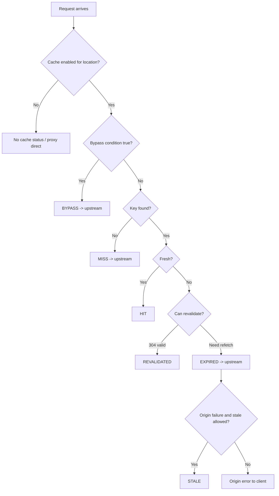
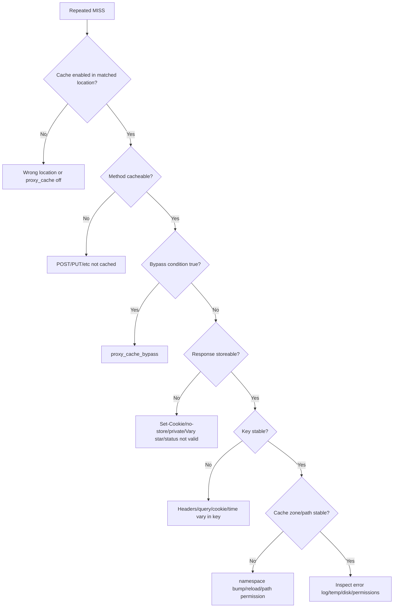
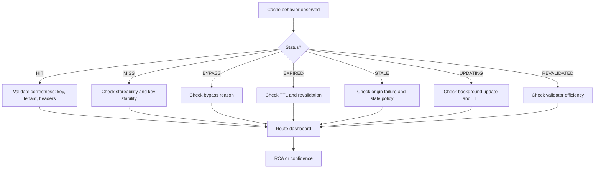

# Part 066 — Cache Observability: HIT/MISS/BYPASS/STALE and Root Cause

> A cache you cannot observe is not an optimization. It is hidden state in the request path.

Caching membuat request lebih cepat ketika benar. Tetapi cache juga bisa menyembunyikan bug: stale data, user-specific leakage, origin spike, partial purge failure, wrong key, missing `Vary`, accidental bypass, dan negative-cache surprise.

Karena itu, production cache harus bisa menjawab pertanyaan berikut dengan cepat:

```txt
Was this response served from cache?
If not, why not?
Which key/policy/route made that decision?
Was origin contacted?
Was stale served?
Was the response eligible to be cached?
Did this behavior change after deploy?
```

Part ini membahas:

- `$upstream_cache_status` mental model;
- arti `HIT`, `MISS`, `BYPASS`, `EXPIRED`, `STALE`, `UPDATING`, `REVALIDATED`;
- log JSON untuk cache RCA;
- safe debug headers;
- `curl` workflow;
- reason tree untuk MISS/BYPASS/STALE;
- metrics dan dashboard;
- alerting;
- incident playbook untuk hit ratio drop, stale leak, cache poisoning, dan origin overload.

---

## 1. Cache observability bukan hanya hit ratio

Hit ratio penting, tapi tidak cukup.

Contoh:

```txt
Cache hit ratio = 95%
```

Apakah itu bagus? Belum tentu.

- Jika 5% MISS berasal dari endpoint mahal, origin bisa tetap overload.
- Jika 95% HIT berisi data stale yang salah, hit ratio tinggi justru buruk.
- Jika HIT tinggi karena private response salah cache, itu security incident.
- Jika BYPASS naik karena semua request membawa `Authorization`, policy mungkin benar atau salah tergantung route.
- Jika `UPDATING` tinggi, cache sedang melindungi origin atau TTL terlalu pendek.

Metric yang benar harus menjawab correctness + performance + safety.

---

## 2. `$upstream_cache_status` sebagai entry point

NGINX menyediakan variable `$upstream_cache_status` dari upstream module. Nilainya dapat berupa:

| Status | Makna operasional |
|---|---|
| `HIT` | Response diambil dari cache yang valid |
| `MISS` | Cache lookup tidak menemukan entry valid, request diteruskan ke upstream |
| `BYPASS` | Cache sengaja dilewati oleh policy `proxy_cache_bypass` |
| `EXPIRED` | Entry ada tetapi expired; NGINX melakukan request ke upstream |
| `STALE` | NGINX mengirim stale cached response karena policy memperbolehkan |
| `UPDATING` | NGINX mengirim stale saat update background/in-progress terjadi |
| `REVALIDATED` | Expired cache divalidasi ulang dan dianggap masih valid |
| empty | Request tidak melewati cache path atau tidak memakai upstream cache |

Jangan menggabungkan semua non-HIT sebagai “miss”. `MISS`, `BYPASS`, `EXPIRED`, dan `STALE` punya root cause berbeda.

---

## 3. Request timeline dengan cache status



Status adalah observability surface untuk decision path ini.

---

## 4. Minimal cache debug header

Untuk lab/internal:

```nginx
add_header X-Cache-Status $upstream_cache_status always;
```

Untuk production public internet, hati-hati. Header debug bisa membocorkan internal behavior. Biasanya aman jika hanya expose coarse status atau hanya untuk internal clients.

Pattern internal-only:

```nginx
map $http_x_debug_cache $debug_cache_allowed {
    default 0;
    "let-me-debug" 1;
}

map $debug_cache_allowed $cache_debug_header {
    default "";
    1       $upstream_cache_status;
}

add_header X-Cache-Status $cache_debug_header always;
```

Tetapi ini masih lemah jika token header tersebar. Lebih baik gunakan internal hostname, VPN, mTLS, atau staging.

---

## 5. Log JSON cache-aware

Observability utama harus berada di logs.

```nginx
log_format cache_json escape=json
  '{'
    '"ts":"$time_iso8601",'
    '"request_id":"$request_id",'
    '"remote_addr":"$remote_addr",'
    '"realip_remote_addr":"$realip_remote_addr",'
    '"host":"$host",'
    '"method":"$request_method",'
    '"uri":"$uri",'
    '"args":"$args",'
    '"status":$status,'
    '"bytes_sent":$bytes_sent,'
    '"body_bytes_sent":$body_bytes_sent,'
    '"request_time":$request_time,'
    '"upstream_addr":"$upstream_addr",'
    '"upstream_status":"$upstream_status",'
    '"upstream_connect_time":"$upstream_connect_time",'
    '"upstream_header_time":"$upstream_header_time",'
    '"upstream_response_time":"$upstream_response_time",'
    '"upstream_cache_status":"$upstream_cache_status",'
    '"cache_namespace":"$cache_namespace",'
    '"route":"$route_label",'
    '"bypass":"$cache_bypass_reason",'
    '"no_cache":"$cache_no_store_reason",'
    '"http_cache_control":"$http_cache_control",'
    '"http_authorization_present":"$auth_present",'
    '"sent_cache_control":"$sent_http_cache_control",'
    '"sent_etag":"$sent_http_etag",'
    '"sent_last_modified":"$sent_http_last_modified",'
    '"sent_vary":"$sent_http_vary",'
    '"sent_set_cookie":"$sent_http_set_cookie"'
  '}';
```

Catatan: jangan selalu log full `Authorization`, cookies, atau sensitive query. Gunakan boolean/presence flag.

---

## 6. Buat reason variable, bukan hanya status

Cache status menjawab “apa”. Reason variable menjawab “mengapa”.

```nginx
map $http_authorization $auth_present {
    default 1;
    ""      0;
}

map $request_method $method_not_cacheable {
    default 1;
    GET     0;
    HEAD    0;
}

map $http_cache_control $client_no_cache {
    default 0;
    ~*no-cache 1;
    ~*no-store 1;
}

map "$auth_present:$client_no_cache:$method_not_cacheable" $cache_bypass_reason {
    default "";
    "1:0:0" "authorization";
    "0:1:0" "client_no_cache";
    "0:0:1" "method";
    "1:1:0" "authorization,client_no_cache";
    "1:0:1" "authorization,method";
    "0:1:1" "client_no_cache,method";
    "1:1:1" "authorization,client_no_cache,method";
}

map $cache_bypass_reason $cache_bypass_flag {
    default 1;
    ""      0;
}
```

Use:

```nginx
proxy_cache_bypass $cache_bypass_flag;
proxy_no_cache     $cache_bypass_flag;
```

Sekarang log bisa menjelaskan kenapa request BYPASS.

---

## 7. Jangan log full cache key sembarangan

Cache key dapat mengandung tenant ID, query, token hash, atau user dimension. Logging full key bisa membantu debugging tetapi juga bisa membocorkan data.

Pattern aman:

```nginx
# For internal debugging only.
add_header X-Cache-Key-Debug "$cache_namespace|$scheme|$host|GET|$uri|$is_args$args" always;
```

Untuk log production, lebih baik log komponen terkontrol:

- route label;
- namespace;
- normalized URI;
- query category, bukan full query;
- auth presence flag;
- tenant id hanya jika tidak sensitif dan memang sudah ada di logs;
- `Vary` dimensions.

Jika butuh forensic key, aktifkan temporary debug log dengan window pendek.

---

## 8. `curl` workflow: HIT/MISS dasar

Test route:

```bash
curl -i https://api.example.com/v1/public/catalog/items/sku-1
```

Expected first request:

```http
HTTP/2 200
X-Cache-Status: MISS
Cache-Control: public, max-age=300
ETag: "sku-1-v7"
```

Second request:

```http
HTTP/2 200
X-Cache-Status: HIT
Cache-Control: public, max-age=300
ETag: "sku-1-v7"
```

Jika request kedua tetap `MISS`, jangan langsung menyalahkan NGINX. Ikuti reason tree.

---

## 9. Reason tree untuk repeated MISS



---

## 10. Storeability checks

Response mungkin tidak disimpan walau request tidak bypass.

Common blockers:

| Blocker | Symptom | Fix |
|---|---|---|
| `Set-Cookie` from origin | repeated MISS | do not cache private response; hide cookie only if truly public |
| `Cache-Control: private` | repeated MISS | fix origin contract or override intentionally |
| `Cache-Control: no-store` | repeated MISS | do not override unless certain |
| `Vary: *` | repeated MISS | fix origin `Vary` |
| status not in `proxy_cache_valid` | MISS every time for 404/500/etc | add explicit valid status only if safe |
| method not GET/HEAD | no cache | do not cache unsafe methods casually |
| `proxy_no_cache` true | MISS/BYPASS-like behavior | log reason variable |
| cache path permission | MISS + error log | fix filesystem ownership/SELinux/AppArmor |

Do not solve repeated MISS by blindly ignoring origin headers. First decide ownership: origin cache policy or edge cache policy.

---

## 11. Debugging BYPASS

`BYPASS` biasanya berarti `proxy_cache_bypass` bernilai true.

Example:

```nginx
proxy_cache_bypass $http_authorization $cookie_nocache $arg_nocache;
```

Any non-empty and non-`0` value triggers bypass.

Debug:

```nginx
add_header X-Debug-Auth-Present $auth_present always;
add_header X-Debug-Bypass-Reason $cache_bypass_reason always;
```

Test:

```bash
curl -i https://api.example.com/v1/public/catalog -H 'Authorization: Bearer abc'
# X-Cache-Status: BYPASS
# X-Debug-Bypass-Reason: authorization
```

Question:

```txt
Should this route bypass because Authorization is present?
```

For public catalog with optional auth, maybe not. For user-specific data, yes.

---

## 12. Debugging EXPIRED

`EXPIRED` berarti entry ada tetapi freshness habis, lalu NGINX menghubungi origin.

Common causes:

- TTL terlalu pendek;
- origin sends short `Cache-Control`;
- `proxy_cache_valid` short;
- traffic pattern jarang sehingga tiap request datang setelah TTL;
- revalidation disabled or origin validator missing.

Inspect:

```bash
curl -I https://api.example.com/v1/public/catalog/items/sku-1
```

Look at:

```http
Cache-Control
Expires
ETag
Last-Modified
Age         # if CDN/other layer adds it
X-Cache-Status
```

Jika `EXPIRED` banyak tapi origin menjawab `304`, enable/verify revalidation path.

---

## 13. Debugging REVALIDATED

`REVALIDATED` adalah healthy signal jika konten expired tapi validator membuktikan bahwa cached entity masih valid.

Expected with:

```nginx
proxy_cache_revalidate on;
```

Origin should support:

```http
ETag: "abc"
Last-Modified: Tue, 07 Jul 2026 01:02:03 GMT
```

NGINX can send conditional request:

```http
If-None-Match: "abc"
If-Modified-Since: Tue, 07 Jul 2026 01:02:03 GMT
```

If origin returns `304`, cached body remains usable.

`REVALIDATED` tinggi bisa berarti bagus: body transfer terhindari. Tetapi jika revalidation rate sangat tinggi, origin tetap mendapat request metadata. Mungkin TTL terlalu pendek.

---

## 14. Debugging STALE

`STALE` berarti NGINX mengirim cached response yang sudah stale karena policy mengizinkan saat origin error/timeout/status tertentu.

Config example:

```nginx
proxy_cache_use_stale error timeout updating http_500 http_502 http_503 http_504;
```

Interpretasi:

- `STALE` kecil saat origin incident: bagus, user terlindungi.
- `STALE` terus-menerus: origin unhealthy atau TTL terlalu pendek.
- `STALE` untuk data yang tidak boleh stale: policy salah.

Debug fields:

```txt
upstream_status
upstream_response_time
upstream_addr
upstream_cache_status
route
```

If `upstream_status=504` and `upstream_cache_status=STALE`, cache menyembunyikan origin timeout.

---

## 15. Debugging UPDATING

`UPDATING` biasanya muncul ketika stale response disajikan sementara cache sedang di-update.

Config:

```nginx
proxy_cache_use_stale updating;
proxy_cache_background_update on;
```

Good sign:

```txt
One request refreshes; many clients get stale instead of stampeding origin.
```

Bad sign:

```txt
Everything is always updating because TTL too short or origin slow.
```

Dashboard should show:

- `UPDATING` rate;
- origin latency during update;
- cache lock wait impact;
- stale age if available through origin/version headers.

---

## 16. Debugging HIT with wrong content

This is serious.

Possible causes:

| Cause | Example |
|---|---|
| cache key missing tenant | tenant A sees tenant B response |
| cache key missing auth dimension | user-specific response shared |
| origin accidentally sends public cache headers | private API cached |
| `Set-Cookie` hidden incorrectly | personalized page treated as public |
| query normalization too aggressive | `/search?q=a` and `/search?q=b` share key |
| missing `Vary` dimension | gzip/br or language/device mismatch |
| host poisoning | untrusted Host enters key/header incorrectly |

Immediate response:

1. disable cache for affected route;
2. remove/deny leaked object at origin if needed;
3. purge/namespace bump/zone rotate;
4. inspect access logs;
5. fix key policy;
6. add regression test.

---

## 17. Cache key shadow testing

Before enabling cache for sensitive route, run shadow logs.

Do not cache yet:

```nginx
location /v1/expensive-but-sensitive/ {
    proxy_pass http://backend;
    proxy_cache off;
    access_log /var/log/nginx/cache_shadow.log cache_json;
}
```

Log proposed dimensions:

```txt
route, tenant, auth_present, uri, args_hash, accept_encoding, vary, set_cookie_present, cache_control
```

Analyze:

- how many unique keys would exist?
- would two users share same key?
- do responses contain `Set-Cookie`?
- does origin send private/no-store?
- are query args normalized safely?
- what hit ratio would be expected?

Only enable cache after evidence.

---

## 18. Route label discipline

Never build dashboards only by URI regex in observability backend. Put route label in NGINX.

```nginx
map $uri $route_label {
    default "unknown";
    ~^/v1/catalog/ "catalog_public";
    ~^/v1/prices/  "pricing_public";
    ~^/assets/     "static_assets";
}
```

Log it.

This enables dashboard by route:

```txt
hit_ratio{route="catalog_public"}
origin_latency_p95{route="catalog_public"}
cache_status_count{route="catalog_public",status="MISS"}
```

Without route labels, cache observability becomes regex archaeology.

---

## 19. Cache hit ratio calculation

Naive:

```txt
HIT / total
```

Better:

```txt
HIT / (HIT + MISS + EXPIRED + REVALIDATED + STALE + UPDATING)
```

But decide whether `BYPASS` belongs in denominator.

For route where auth requests intentionally bypass:

```txt
cache_effectiveness = HIT / cache_eligible_requests
```

Where:

```txt
cache_eligible_requests = total - intentional_bypass - unsafe_method - private_response
```

Otherwise a login spike can make hit ratio look broken even if cache policy is correct.

---

## 20. Essential cache dashboards

Minimum dashboard panels:

1. request rate by route and cache status;
2. hit ratio by route;
3. MISS/BYPASS/EXPIRED/STALE rates;
4. upstream request rate by route;
5. origin p50/p95/p99 latency by cache status;
6. 5xx by route and cache status;
7. bytes served from cache vs upstream;
8. disk usage per cache path;
9. inode usage per cache path;
10. cache manager eviction indicators from disk trend/logs;
11. namespace/version changes;
12. purge command count and failure if using purge.

Useful derived views:

```txt
origin_saved_rps = total_cacheable_rps - upstream_rps_for_cacheable_routes
origin_saved_bytes = cached_body_bytes - upstream_body_bytes
```

---

## 21. Alerting patterns

Alerts should avoid noisy raw hit ratio alerts.

Better alerts:

| Alert | Why |
|---|---|
| hit ratio drops sharply for one high-traffic route | deployment changed key/policy |
| BYPASS jumps after release | new Authorization/Cookie/client header behavior |
| MISS spike + origin latency spike | cache no longer protecting origin |
| STALE spike | origin unhealthy but users protected temporarily |
| STALE for forbidden route | correctness violation |
| cache disk > 85% | eviction pressure imminent |
| inode usage > 85% | many small objects risk |
| 5xx increases on MISS only | origin failure hidden by HIT |
| purge partial failures | multi-node consistency issue |
| HIT with `Set-Cookie` response | private leakage risk |

---

## 22. Debugging location mismatch

Sometimes cache “does not work” because request matches a different location than expected.

Example:

```nginx
location /v1/ {
    proxy_cache api_cache;
}

location ~* \.json$ {
    proxy_cache off;
}
```

A JSON endpoint under `/v1/` may match regex location depending on location rules.

Debug with temporary headers:

```nginx
location /v1/ {
    add_header X-Debug-Location "prefix-v1" always;
    proxy_cache api_cache;
}

location ~* \.json$ {
    add_header X-Debug-Location "regex-json" always;
    proxy_cache off;
}
```

If `X-Debug-Location` is unexpected, revisit Part 009 location matching.

---

## 23. Debugging header inheritance

Cache behavior often breaks because header or proxy directive was overridden at lower context.

Example:

```nginx
server {
    proxy_cache api_cache;
    proxy_cache_valid 200 10m;

    location /v1/a/ {
        proxy_pass http://a;
    }

    location /v1/b/ {
        proxy_pass http://b;
        proxy_cache_valid 404 5s;
    }
}
```

Depending directive inheritance, defining a cache directive at lower level can alter expected inherited behavior. Use:

```bash
nginx -T | less
```

Then inspect the effective config context. NGINX does not show computed inheritance like a compiler AST, so keep config structure simple.

---

## 24. Debugging Vary explosion

Origin sends:

```http
Vary: User-Agent
```

This can explode cache variants because user-agent cardinality is huge.

Symptoms:

- low hit ratio;
- huge number of cache files;
- repeated MISS for same URI;
- disk/inode growth;
- memory zone pressure.

Fix options:

- remove unnecessary `Vary` at origin;
- normalize into low-cardinality header;
- separate mobile/desktop explicitly;
- do not cache route;
- use controlled cache key dimension.

Example controlled device class:

```nginx
map $http_user_agent $device_class {
    default desktop;
    ~*Mobile mobile;
}

proxy_cache_key "$scheme|$host|GET|$uri|$is_args$args|device:$device_class";
```

---

## 25. Debugging Accept-Encoding variants

If NGINX caches compressed and uncompressed variants incorrectly, clients may receive wrong encoding.

Safe patterns:

- include `Vary: Accept-Encoding` when content negotiation occurs;
- let NGINX handle gzip consistently;
- normalize `Accept-Encoding` dimension;
- avoid forwarding arbitrary `Accept-Encoding` to origin if edge owns compression.

Example:

```nginx
gzip on;
gzip_vary on;
proxy_set_header Accept-Encoding "";
```

This says: origin sends uncompressed, NGINX compresses, and adds `Vary` when gzip applies.

---

## 26. Debugging range/slice cache

For slice caching, key must include `$slice_range`.

```nginx
proxy_cache_key "$uri$is_args$args$slice_range";
proxy_set_header Range $slice_range;
proxy_cache_valid 200 206 1h;
```

Symptoms of wrong slice config:

- corrupted media seek;
- repeated MISS for ranges;
- `206` not cached;
- huge origin load for video;
- incorrect HIT semantics on partial content.

Log:

```nginx
'"http_range":"$http_range",'
'"sent_content_range":"$sent_http_content_range",'
'"slice_range":"$slice_range",'
```

---

## 27. Error log signals

Access log tells decision outcome. Error log tells lower-level failure.

Look for:

```txt
cache file ... has too long header
cache file ... is too small
open() ... failed (13: Permission denied)
mkdir() ... failed
writev() ... failed (28: No space left on device)
an upstream response is buffered to a temporary file
upstream timed out
```

Operational rule:

```txt
A cache incident investigation must inspect both access logs and error logs.
```

---

## 28. Filesystem observability

Cache can fail because disk is unhealthy.

Monitor:

```bash
df -h /var/cache/nginx
df -i /var/cache/nginx
du -sh /var/cache/nginx/*
find /var/cache/nginx/api -type f | wc -l
```

But do not run expensive `find`/`du` too often on very large caches.

Better:

- filesystem metrics exporter;
- disk IO latency;
- inode usage;
- cache path size trend;
- temp path size trend;
- NGINX error log count for disk errors.

---

## 29. Cold cache vs broken cache

After deploy/reload/namespace bump, hit ratio can drop. Is that expected?

Cold cache signs:

- MISS spike immediately after known invalidation;
- HIT gradually recovers;
- origin latency stable;
- disk files increasing;
- no BYPASS spike.

Broken cache signs:

- MISS stays high;
- BYPASS increased unexpectedly;
- `Set-Cookie` suddenly appears;
- `Cache-Control: private/no-store` changed;
- cache key namespace changes every request;
- location changed;
- disk errors.

Use deploy markers in dashboards.

---

## 30. Cache key cardinality analysis

High cardinality can kill cache effectiveness.

Inputs that create cardinality:

- full query string;
- tracking params;
- session cookies;
- Authorization token;
- User-Agent;
- Accept-Language;
- tenant;
- device;
- feature flag headers;
- random request id accidentally in key.

Log normalized key dimensions and estimate:

```txt
unique_keys_per_route_per_5m
requests_per_key_p50/p95
hit_ratio_by_key_frequency
```

If most keys are single-use, cache is acting as disk write amplification.

---

## 31. Query normalization debug

Example bad cache key:

```nginx
proxy_cache_key "$scheme|$host|$request_uri";
```

These become different keys:

```txt
/search?q=nginx&utm_source=a
/search?utm_source=a&q=nginx
/search?q=nginx&utm_source=b
```

Better: normalize in app/origin or with controlled `map` if simple. NGINX is not a full query canonicalization engine. For complex canonicalization, use app/control layer.

Debug:

```txt
top query params by route
top args cardinality
utm parameter hit-ratio impact
```

---

## 32. Origin response contract dashboard

Track sent response headers from origin/edge:

- `Cache-Control`;
- `Expires`;
- `ETag`;
- `Last-Modified`;
- `Vary`;
- `Set-Cookie` presence;
- `Content-Type`;
- `Content-Encoding`.

A backend release can silently change cache behavior by adding `Set-Cookie` or `Cache-Control: private`.

Alert example:

```txt
If sent_set_cookie_present increases above 0 for route=public_catalog, page platform team.
```

---

## 33. RCA: hit ratio dropped after deploy

Checklist:

1. Did route/location matching change?
2. Did `proxy_cache_key` change?
3. Did namespace/version bump occur?
4. Did origin add `Set-Cookie`?
5. Did origin change `Cache-Control`?
6. Did `Vary` change?
7. Did clients start sending `Cache-Control: no-cache`?
8. Did Authorization header become universal?
9. Did query param cardinality increase?
10. Did cache path/permissions/disk fail?
11. Did method change from GET to POST?
12. Did `proxy_no_cache`/`proxy_cache_bypass` map change?

Diagnosis output should be a timeline, not a guess.

---

## 34. RCA: origin overloaded despite cache

Possibilities:

- cache hit ratio low;
- hot route has low hit despite global high hit;
- cache lock disabled causing thundering herd;
- TTL expired simultaneously;
- purge/namespace bump caused cold cache;
- range requests bypass cache;
- cache disk full;
- BYPASS due auth/header;
- upstream retries amplify origin load;
- cache status is HIT but another uncached route dominates.

Inspect:

```txt
route x cache_status x upstream_rps
route x request_time p95
route x upstream_response_time p95
cache_status x status code
```

---

## 35. RCA: stale content served too long

Possibilities:

- TTL too long;
- stale-if-error/stale-while-revalidate behavior allowed;
- purge did not reach all nodes;
- CDN/browser cache still has old response;
- origin version not changed;
- namespace bump not deployed everywhere;
- negative cache;
- wildcard purge file remains and is re-accessed through unexpected path.

Debug directly against layers:

```bash
# direct node test
curl -H 'Host: api.example.com' http://10.0.1.11/v1/item/sku-1 -I
curl -H 'Host: api.example.com' http://10.0.1.12/v1/item/sku-1 -I
curl -H 'Host: api.example.com' http://10.0.1.13/v1/item/sku-1 -I

# external CDN path
curl -I https://api.example.com/v1/item/sku-1
```

Compare:

- `X-Cache-Status`;
- content version header;
- ETag;
- Date;
- Age if present;
- Via/CDN headers.

---

## 36. RCA: cache poisoning suspicion

Immediate steps:

1. disable cache for route;
2. snapshot logs for affected URI/key dimensions;
3. compare Host, X-Forwarded-Host, scheme, query, headers;
4. inspect response headers stored/sent;
5. purge/namespace bump;
6. test poisoning vector;
7. fix key and header normalization;
8. add regression test.

Indicators:

- HIT for unexpected Host;
- redirect target from attacker-controlled header;
- cache key missing host/scheme;
- origin uses `X-Forwarded-Host` to generate response;
- `Vary` mismatch;
- public route echoes request header into response.

---

## 37. Synthetic cache tests

CI/staging should test cache behavior.

Example pseudo-test:

```bash
URL="https://staging.example.com/v1/public/catalog/items/sku-1"

first=$(curl -sSI "$URL" | tr -d '\r')
second=$(curl -sSI "$URL" | tr -d '\r')

echo "$first" | grep -q 'X-Cache-Status: MISS'
echo "$second" | grep -q 'X-Cache-Status: HIT'
echo "$second" | grep -q 'Cache-Control: public'
```

Private route negative test:

```bash
URL="https://staging.example.com/v1/me"

curl -sSI "$URL" -H 'Authorization: Bearer test' | grep -Eq 'X-Cache-Status: BYPASS|X-Cache-Status:'
```

Better: assert it never returns `HIT`.

---

## 38. Log sampling caution

Cache debugging often needs full-fidelity logs for a short window.

If access logs are sampled at 1%, rare poisoning or purge failures may disappear.

Pattern:

- normal sampling for high-volume routes;
- unsampled logs for purge/admin operations;
- temporary unsampled debug window during incident;
- per-request ID propagated to origin;
- privacy-safe fields only.

---

## 39. Correlation ID

Add request ID:

```nginx
proxy_set_header X-Request-ID $request_id;
add_header X-Request-ID $request_id always;
```

Then correlate:

```txt
client report -> edge access log -> upstream log -> application trace -> database event
```

For cache HIT, upstream log will not exist. That is expected. Edge log becomes source of truth.

---

## 40. Cache observability maturity model

| Level | Capability |
|---|---|
| 0 | No cache status logged |
| 1 | `$upstream_cache_status` in access log |
| 2 | route labels and upstream timings logged |
| 3 | reason variables for bypass/no-store |
| 4 | dashboards by route/status/latency/origin saved |
| 5 | alerting with deploy markers and purge audit |
| 6 | synthetic cache correctness tests in CI/staging |
| 7 | incident playbooks with layer-by-layer verification |

Target for serious production systems: Level 5 minimum, Level 6–7 for high-risk/high-traffic routes.

---

## 41. Practical dashboard queries

Examples in pseudo-SQL/log analytics:

```sql
-- cache status count by route
select route, upstream_cache_status, count(*)
from nginx_access
where ts > now() - interval '5 minutes'
group by route, upstream_cache_status;
```

```sql
-- hit ratio excluding intentional bypass
select route,
  sum(case when upstream_cache_status = 'HIT' then 1 else 0 end) /
  nullif(sum(case when cache_bypass_reason = '' then 1 else 0 end), 0) as eligible_hit_ratio
from nginx_access
group by route;
```

```sql
-- origin pressure by route
select route,
  count(*) filter (where upstream_addr <> '') as upstream_requests,
  percentile_cont(0.95) within group (order by upstream_response_time) as upstream_p95
from nginx_access
group by route;
```

Adapt to your log stack.

---

## 42. Production config skeleton

```nginx
map $uri $route_label {
    default "unknown";
    ~^/v1/catalog/ "catalog_public";
    ~^/v1/prices/  "pricing_public";
    ~^/assets/     "static_assets";
}

map $http_authorization $auth_present {
    default 1;
    ""      0;
}

map $request_method $unsafe_method {
    default 1;
    GET     0;
    HEAD    0;
}

map "$auth_present:$unsafe_method" $cache_bypass_reason {
    default "";
    "1:0" "authorization";
    "0:1" "method";
    "1:1" "authorization,method";
}

map $cache_bypass_reason $cache_bypass_flag {
    default 1;
    ""      0;
}

log_format cache_json escape=json
  '{'
    '"ts":"$time_iso8601",'
    '"request_id":"$request_id",'
    '"route":"$route_label",'
    '"host":"$host",'
    '"method":"$request_method",'
    '"uri":"$uri",'
    '"status":$status,'
    '"request_time":$request_time,'
    '"upstream_addr":"$upstream_addr",'
    '"upstream_status":"$upstream_status",'
    '"upstream_response_time":"$upstream_response_time",'
    '"upstream_cache_status":"$upstream_cache_status",'
    '"bypass_reason":"$cache_bypass_reason",'
    '"sent_cache_control":"$sent_http_cache_control",'
    '"sent_vary":"$sent_http_vary",'
    '"set_cookie_present":"$sent_http_set_cookie"'
  '}';

server {
    listen 8080;
    server_name api.example.test;
    access_log /var/log/nginx/api-cache.log cache_json;

    location /v1/catalog/ {
        proxy_pass http://catalog_backend;
        proxy_cache api_cache;
        proxy_cache_key "$scheme|$host|GET|$uri|$is_args$args|ae:$http_accept_encoding";
        proxy_cache_valid 200 5m;
        proxy_cache_bypass $cache_bypass_flag;
        proxy_no_cache     $cache_bypass_flag;
        proxy_cache_lock on;
        proxy_cache_use_stale error timeout updating http_500 http_502 http_503 http_504;

        add_header X-Request-ID $request_id always;
        add_header X-Cache-Status $upstream_cache_status always;
    }
}
```

Before production, review whether `Authorization` should bypass this route.

---

## 43. Review checklist

For every cached route:

- [ ] Is `$upstream_cache_status` logged?
- [ ] Is route label logged?
- [ ] Are upstream timings logged?
- [ ] Are bypass/no-cache reasons logged?
- [ ] Is cache key documented?
- [ ] Are sensitive headers/cookies excluded from logs?
- [ ] Are `Cache-Control`, `Vary`, `ETag`, `Set-Cookie` visible in logs or samples?
- [ ] Are HIT/MISS/BYPASS/STALE metrics separated?
- [ ] Is hit ratio computed per route, not globally only?
- [ ] Are intentional bypasses excluded from cache effectiveness?
- [ ] Is disk/inode monitored?
- [ ] Are purge/namespace changes visible as deploy markers?
- [ ] Are private route negative tests present?
- [ ] Is incident workflow documented?

---

## 44. Mental model final



---

## 45. Kesimpulan

NGINX cache observability harus menjelaskan tiga hal:

```txt
Decision: what did cache do?
Reason: why did it do that?
Consequence: what happened to latency, origin load, and correctness?
```

`$upstream_cache_status` adalah pintu masuk, bukan akhir. Production-grade setup perlu route label, reason variables, upstream timings, response header visibility, disk metrics, purge audit, dan synthetic tests.

Invariant terakhir:

```txt
Every cached route must be debuggable from a single request id to cache decision, origin decision, and response contract.
```

Jika invariant itu benar, cache tidak lagi menjadi hidden state. Ia menjadi system component yang bisa dioperasikan, di-debug, dan dipertanggungjawabkan.

---

## Official references

- NGINX `ngx_http_upstream_module`: `$upstream_cache_status`, `$upstream_addr`, `$upstream_status`, `$upstream_connect_time`, `$upstream_header_time`, `$upstream_response_time` — https://nginx.org/en/docs/http/ngx_http_upstream_module.html
- NGINX `ngx_http_proxy_module`: `proxy_cache`, `proxy_cache_key`, `proxy_cache_bypass`, `proxy_no_cache`, `proxy_cache_lock`, `proxy_cache_revalidate`, `proxy_cache_use_stale`, response header cache behavior — https://nginx.org/en/docs/http/ngx_http_proxy_module.html
- F5/NGINX Content Caching Admin Guide — https://docs.nginx.com/nginx/admin-guide/content-cache/content-caching/
- NGINX `ngx_http_log_module`: `log_format`, `access_log`, JSON escaping — https://nginx.org/en/docs/http/ngx_http_log_module.html
- NGINX `ngx_http_map_module`: `map` for route labels and reason variables — https://nginx.org/en/docs/http/ngx_http_map_module.html
