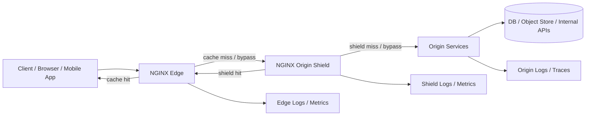
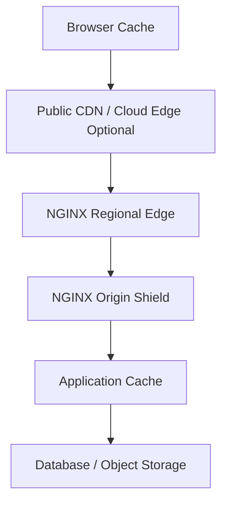
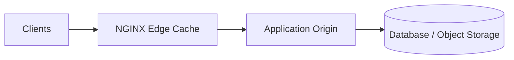
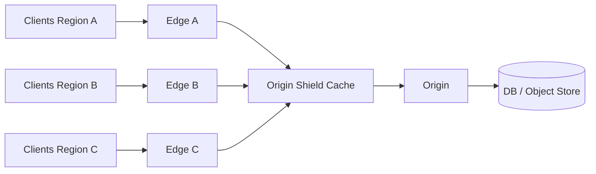
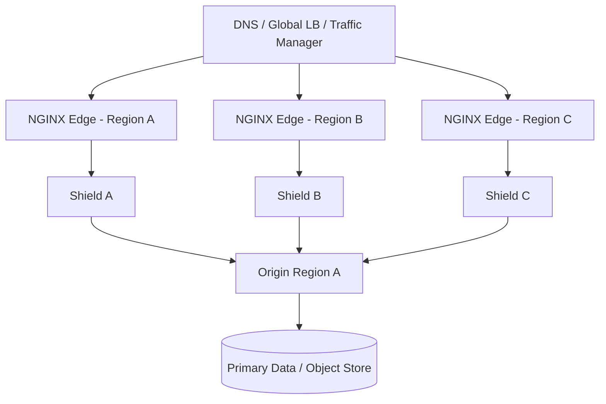
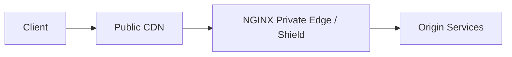
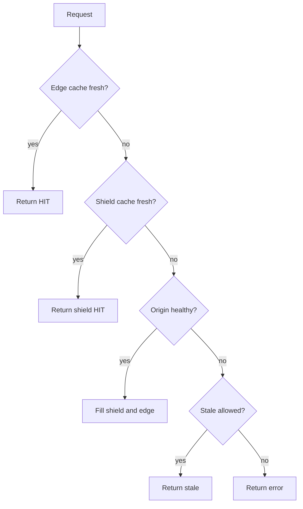

# Part 067 — CDN-Like Architecture with NGINX

A CDN is not just "cache near users".

A CDN-like architecture is a distributed control surface for traffic. It decides:

- which requests are allowed to reach origin;
- which responses are reusable;
- which failures can degrade into stale content;
- which keys define content identity;
- which tenants, users, hosts, and routes are isolated;
- which behavior is safe to operate during incident response.

NGINX can implement many CDN-like behaviors: reverse proxying, content caching, TLS termination, compression, rate limiting, stale serving, request normalization, and origin shielding. But NGINX does not magically become a global CDN just because `proxy_cache` is enabled.

The engineering task is to decide which CDN properties you need and which ones NGINX can safely own.

## 1. The Real Mental Model

Think of a CDN-like NGINX layer as a **programmable edge cache and origin protection tier**.



The edge should answer these questions for every route:

```txt
Can this response be stored?
Can this cached response be reused for this request?
What identity dimensions must be in the cache key?
How stale may the response become during origin failure?
Who owns invalidation?
What must never be cached?
What must be logged to prove correctness?
```

The biggest mistake is treating cache as a performance feature only. In production, cache is also a correctness feature, privacy boundary, overload control, and incident-response primitive.

## 2. What "CDN-Like" Means Here

In this series, CDN-like means NGINX is used to provide some of these properties:

| Property | NGINX can do it? | Notes |
|---|---:|---|
| Reverse proxy to origin | Yes | Core use case. |
| Static and dynamic content cache | Yes | Via proxy cache. |
| Origin shielding | Yes | Add a central cache tier in front of origin. |
| Stale response during origin failure | Yes | Via `proxy_cache_use_stale`. |
| Request normalization | Yes | Host, scheme, path, query, headers. |
| Compression | Yes | gzip core; Brotli depends on module/distribution. |
| Private/global POP network | Partially | NGINX does not provide global routing by itself. |
| Geo routing | Partially | Needs DNS/GSLB/control plane. |
| Cache purge API | Boundary | Purge support differs by edition/module strategy. |
| DDoS protection at internet scale | No, not alone | Needs network-layer protection and provider support. |
| Signed URL / tokenized access | Possible | Usually needs app, `auth_request`, njs, or external auth. |
| Edge compute platform | Limited | njs/OpenResty extend this, but that is not baseline NGINX. |

A private CDN-like architecture is valid when your main objective is **origin protection and predictable delivery** for controlled traffic: internal platforms, B2B APIs, private portals, regulated workloads, media repositories, artifacts, package mirrors, documentation, or multi-region application edges.

It is not a replacement for a hyperscale CDN when you need thousands of global POPs, Anycast at massive scale, bot mitigation, advanced DDoS absorption, or turnkey WAF + cache invalidation + analytics.

## 3. The Layered Cache Model

Most real systems already have multiple caches. NGINX is one layer, not the whole story.



Each layer has a different job.

| Layer | Job | Typical TTL | Risk |
|---|---|---:|---|
| Browser cache | Avoid network roundtrip | Long for hashed assets | Hard to revoke once cached. |
| Public CDN | Global delivery | Route-dependent | Vendor rules and purge semantics. |
| NGINX edge | Regional delivery and policy | Seconds to days | Cache key and tenant leakage. |
| NGINX shield | Origin protection | Seconds to hours | Can hide origin failure. |
| App cache | Domain-aware reuse | Usually short | Business correctness. |
| DB/object store | Source of truth | Not cache | Cost/latency bottleneck. |

A strong architecture defines the **contract between layers**. Without that, cache behavior becomes accidental.

## 4. Reference Topology 1: Single Regional Edge Cache

This is the simplest topology.



Use this when:

- traffic is mostly in one region;
- origin is expensive but not globally distributed;
- you need one operational cache tier;
- your invalidation model is simple;
- low operational complexity matters more than global latency.

Example route ownership:

| Route | Cache policy | Reason |
|---|---|---|
| `/assets/*` | public, immutable, long TTL | Hashed files. |
| `/api/catalog` | public or tenant-scoped, short TTL | Expensive but shareable. |
| `/api/me` | never shared-cache | User-specific. |
| `/downloads/*` | range/slice/object policy | Large object delivery. |
| `/admin/*` | no cache, no stale | Control-plane correctness. |

This topology is enough for many internal platforms.

The invariant is simple:

```txt
The edge is the only cache tier between clients and origin.
All cache behavior must be visible from edge logs.
```

## 5. Reference Topology 2: Edge + Origin Shield

Origin shield adds another NGINX cache tier between edge nodes and origin.



The shield is useful when multiple edge nodes would otherwise stampede the same origin.

Without shield:

```txt
100 edge nodes miss the same key
→ 100 origin requests
→ origin meltdown
```

With shield:

```txt
100 edge nodes miss the same key
→ 100 shield requests
→ shield cache lock allows 1 origin fill
→ 99 wait, stale, or receive cached result
```

The shield is not mainly for user latency. It is for **origin protection**.

### Edge vs Shield Responsibilities

| Concern | Edge | Shield |
|---|---|---|
| TLS client termination | Usually yes | Usually internal TLS/mTLS optional. |
| Public host normalization | Yes | No or limited. |
| CORS | Usually edge | Rarely shield. |
| Client rate limiting | Edge | No. |
| Cache key enforcement | Yes | Yes, but may use different key. |
| Cache lock | Yes for local stampede | Strongly yes for origin stampede. |
| Stale on origin failure | Yes | Strongly yes. |
| Origin auth | Usually shield | Often shield-to-origin. |
| Origin connection pooling | Maybe | Strongly yes. |
| Origin observability | Via shield logs | Primary source. |

A shield tier should be boring. It should not contain complex user-facing business routing if that can be avoided.

## 6. Reference Topology 3: Multi-Region Private Edge



NGINX does not provide global traffic steering by itself. You need DNS, global load balancer, Anycast provider, cloud traffic manager, or platform-level routing.

Do not design this topology by copying cache files between regions. Treat each edge cache as disposable.

Good multi-region cache design:

- each region can warm independently;
- cache keys are deterministic everywhere;
- immutable assets use versioned URLs;
- soft TTL and stale behavior protect origin during regional churn;
- invalidation avoids fragile cross-region file deletion;
- logs include `edge_region`, `shield_region`, `cache_zone`, and `cache_status`.

Bad multi-region cache design:

- rsync cache directories between nodes;
- assume file layout is public API;
- purge by deleting random files from cache path;
- mix tenants in one cache key namespace;
- route user-specific traffic through shared cache without identity keying.

## 7. Reference Topology 4: Public CDN + NGINX Private Shield

Sometimes the best architecture is not NGINX versus CDN. It is CDN plus NGINX.



Use public CDN for:

- global POP reach;
- Anycast and DDoS absorption;
- public static delivery;
- TLS at internet scale;
- bot/WAF/provider controls.

Use NGINX behind it for:

- origin normalization;
- private cache policies;
- route-specific control;
- app-specific observability;
- internal mTLS/origin auth;
- consistent behavior across providers;
- shielding microservice origins from CDN rule complexity.

In this design, NGINX becomes the **origin-facing policy edge**.

The main risk is header trust. If requests pass through a public CDN before NGINX, NGINX must only trust client IP and forwarded headers from known CDN source ranges or from a verified PROXY protocol path.

## 8. Route Classification Before Configuration

Before writing config, classify routes.

```txt
Route: /assets/*
Audience: public
Identity: none
Volatility: immutable by filename
Origin cost: low to medium
Cacheability: long
Stale allowed: yes
Purge required: no, use versioned deploy
```

```txt
Route: /api/catalog
Audience: public or tenant-specific
Identity: maybe tenant / locale / currency
Volatility: medium
Origin cost: high
Cacheability: short
Stale allowed: maybe
Purge required: maybe namespace bump or short TTL
```

```txt
Route: /api/me
Audience: authenticated user
Identity: user token/session
Volatility: high
Origin cost: medium
Cacheability: no shared cache
Stale allowed: no
Purge required: no, because no store
```

A useful route classification table:

| Dimension | Question |
|---|---|
| Audience | Public, tenant, organization, user, admin? |
| Identity | Which request properties change the response? |
| Freshness | How stale may the response be? |
| Privacy | Could another user receive it? |
| Purge | Is versioned URL enough? |
| Origin cost | What happens if every request reaches origin? |
| Failure mode | Serve stale, fail closed, or fail open? |
| Debugging | Which log fields prove the decision? |

This table is more important than the config snippet.

## 9. Cache Key as an Architecture Boundary

A CDN-like architecture succeeds or fails at the cache key.

For public static assets:

```nginx
proxy_cache_key "$scheme:$host:$uri";
```

For locale-aware catalog pages:

```nginx
proxy_cache_key "$scheme:$host:$uri:$arg_locale:$arg_currency";
```

For tenant-scoped public API:

```nginx
proxy_cache_key "$scheme:$host:$tenant_id:$uri:$is_args$args";
```

For authenticated traffic, the better answer is often:

```nginx
proxy_no_cache 1;
proxy_cache_bypass 1;
```

Do not add `Authorization` or session cookie to a shared cache key just because it makes caching technically possible. That creates huge cardinality, difficult invalidation, and privacy risk. User-specific shared caching should require an explicit design review.

## 10. Normalization: Make Equivalent Requests Equivalent

A cache is only effective when semantically equivalent requests produce the same cache key.

Common normalization targets:

| Input | Risk | Policy |
|---|---|---|
| Host case | Key fragmentation | Normalize host ownership. |
| Scheme | HTTP/HTTPS duplicate keys | Redirect HTTP or include scheme deliberately. |
| Query order | Duplicate cache entries | Normalize at app/CDN/control plane if needed. |
| Tracking params | Cache fragmentation | Drop or ignore for cache key. |
| Accept-Encoding | Compression variance | Keep `Vary` correct. |
| Locale headers | Hidden response dimension | Prefer explicit query/path/cookie. |
| Authorization | Private response | Usually bypass/no-store. |
| Cookies | Massive variance | Whitelist relevant cookies only. |

NGINX can help with `map`, redirects, and explicit keys. But complex canonical query sorting is often better handled before NGINX or in the application unless you use scripting extensions.

## 11. Origin Shield Configuration Skeleton

A shield cache should be explicit and conservative.

```nginx
proxy_cache_path /var/cache/nginx/shield
    levels=1:2
    keys_zone=shield_cache:512m
    max_size=200g
    inactive=24h
    use_temp_path=off;

upstream origin_pool {
    zone origin_pool 64k;
    server origin-a.internal:8080 max_fails=2 fail_timeout=10s;
    server origin-b.internal:8080 max_fails=2 fail_timeout=10s;
    keepalive 128;
}

server {
    listen 8080;
    server_name shield.internal;

    access_log /var/log/nginx/shield_cache.log cache_json;

    location / {
        proxy_cache shield_cache;
        proxy_cache_key "$scheme:$host:$uri:$is_args$args";
        proxy_cache_valid 200 301 302 10m;
        proxy_cache_valid 404 30s;

        proxy_cache_lock on;
        proxy_cache_lock_timeout 5s;
        proxy_cache_background_update on;
        proxy_cache_use_stale error timeout updating http_500 http_502 http_503 http_504;

        proxy_http_version 1.1;
        proxy_set_header Connection "";
        proxy_set_header Host $host;
        proxy_set_header X-Forwarded-For $proxy_add_x_forwarded_for;
        proxy_set_header X-Forwarded-Proto $scheme;

        proxy_connect_timeout 1s;
        proxy_send_timeout 10s;
        proxy_read_timeout 10s;

        add_header X-Shield-Cache $upstream_cache_status always;
        proxy_pass http://origin_pool;
    }
}
```

The shield should log cache status and upstream status separately. Otherwise, stale success can hide origin failure.

## 12. Edge Configuration Skeleton

The edge may have more client-facing policy.

```nginx
proxy_cache_path /var/cache/nginx/edge
    levels=1:2
    keys_zone=edge_cache:512m
    max_size=100g
    inactive=12h
    use_temp_path=off;

upstream shield_pool {
    zone shield_pool 64k;
    server shield-a.internal:8080 max_fails=2 fail_timeout=5s;
    server shield-b.internal:8080 max_fails=2 fail_timeout=5s;
    keepalive 128;
}

map $http_authorization $has_auth {
    default 1;
    "" 0;
}

map $request_uri $static_asset {
    default 0;
    ~^/assets/.+\.[a-f0-9]{8,}\.(js|css|png|jpg|jpeg|webp|svg|woff2)$ 1;
}

server {
    listen 443 ssl http2;
    server_name app.example.com;

    access_log /var/log/nginx/edge_cache.log cache_json;

    location /assets/ {
        proxy_cache edge_cache;
        proxy_cache_key "$scheme:$host:$uri";
        proxy_cache_valid 200 30d;
        proxy_cache_use_stale error timeout updating http_500 http_502 http_503 http_504;
        proxy_cache_lock on;

        proxy_ignore_headers Set-Cookie;
        proxy_hide_header Set-Cookie;

        add_header Cache-Control "public, max-age=31536000, immutable" always;
        add_header X-Edge-Cache $upstream_cache_status always;

        proxy_pass http://shield_pool;
    }

    location /api/catalog {
        proxy_cache edge_cache;
        proxy_cache_key "$scheme:$host:$uri:$is_args$args";
        proxy_cache_valid 200 60s;
        proxy_cache_valid 404 10s;
        proxy_cache_bypass $has_auth;
        proxy_no_cache $has_auth;
        proxy_cache_use_stale error timeout updating http_500 http_502 http_503 http_504;
        proxy_cache_lock on;

        add_header Cache-Control "public, max-age=30, stale-while-revalidate=60" always;
        add_header X-Edge-Cache $upstream_cache_status always;

        proxy_pass http://shield_pool;
    }

    location /api/me {
        proxy_cache off;
        add_header Cache-Control "private, no-store" always;
        proxy_pass http://shield_pool;
    }
}
```

This is intentionally not a universal config. It shows a principle: each route gets its own cache contract.

## 13. Why Origin Shield Changes Failure Behavior

Without cache:

```txt
origin fails → all traffic fails
```

With edge cache only:

```txt
origin fails → cache hits survive, misses fail
```

With edge + shield:

```txt
origin fails → edge hits survive
             → edge misses may hit shield
             → shield stale may survive
             → only true cold misses fail
```

This gives you a graceful degradation ladder:



But this also creates risk: stale responses can hide origin failure from clients and product owners. Your logs and alerts must show when stale is being served.

## 14. Stale Policy Is a Product Decision

Stale cache is not universally safe.

| Content | Serve stale during failure? | Reason |
|---|---:|---|
| Static hashed assets | Yes | Immutable. |
| Product catalog | Usually yes | Better stale catalog than outage. |
| Price quote | Maybe | Depends on business/regulatory rules. |
| Account balance | No | Correctness beats availability. |
| Auth/session state | No | Security boundary. |
| Feature flags | Usually no or very short | Wrong rollout state can cascade. |
| Documentation | Yes | Low risk. |
| Legal/compliance notice | Maybe | Needs explicit owner. |

A mature system stores this in route policy, not tribal memory.

## 15. Invalidation Strategy Ladder

Prefer invalidation strategies in this order:

1. **Immutable URL** — best for assets.
2. **Short TTL + revalidation** — good for dynamic public content.
3. **Namespace/version bump** — good for controlled releases.
4. **Route-specific purge** — useful but operationally sensitive.
5. **Zone rotation / emergency bypass** — incident tool, not normal workflow.
6. **Manual file deletion** — avoid unless you fully understand cache file semantics and operational risk.

The highest leverage pattern is immutable URL:

```txt
/assets/app.a8f31c90.js  → cache forever
/assets/app.b21d71aa.js  → new deploy, new URL
```

No purge is needed because old and new content do not share identity.

## 16. Cache Warmup

Warmup means preloading likely keys into cache before real users hit them.

Good warmup:

- uses the same public URL and headers as real clients;
- respects cache key dimensions;
- runs after deployment;
- is rate-limited;
- logs warmup traffic separately;
- stops on abnormal error rates.

Bad warmup:

- curls internal origin directly;
- ignores Host header;
- skips authentication dimensions accidentally;
- warms user-specific content;
- warms too aggressively and causes the incident it wanted to prevent.

Example warmup script shape:

```bash
#!/usr/bin/env bash
set -euo pipefail

HOST="https://app.example.com"

while read -r path; do
  curl -fsS \
    -H 'User-Agent: cache-warmer/1.0' \
    -H 'Accept-Encoding: gzip' \
    "$HOST$path" >/dev/null
  sleep 0.05
done < warmup-paths.txt
```

Warmup is useful for predictable high-traffic assets. It is not a replacement for correct stale/cache lock behavior.

## 17. Cache File Synchronization Is Usually the Wrong Primitive

It is tempting to synchronize `/var/cache/nginx` between machines.

Avoid that as a default architecture.

Why:

- cache file names are implementation details;
- metadata lives in shared memory while NGINX runs;
- concurrent writers can race;
- partially copied files can create operational risk;
- different NGINX versions/configs may encode metadata differently;
- invalidation becomes file-system archaeology.

Better alternatives:

- deterministic cache keys;
- versioned URLs;
- warmup traffic;
- origin shield;
- shared object storage origin;
- public CDN in front;
- controlled purge API where supported.

Treat cache files as disposable local storage.

## 18. Tenant Isolation in CDN-Like NGINX

Multi-tenant edge systems need explicit isolation.

| Isolation surface | Risk | Control |
|---|---|---|
| Host | Tenant A served from tenant B host | strict `server_name`; default sinkhole. |
| Cache key | Cross-tenant response reuse | include tenant identity or separate zones. |
| Logs | Sensitive tenant data in shared logs | redact, partition, access control. |
| Headers | Tenant-controlled headers poison cache | whitelist forwarded headers. |
| Error pages | Tenant branding leak | tenant-specific or generic errors. |
| Rate limit | One tenant starves others | key by tenant. |
| Purge | Tenant purges another tenant | scoped purge control. |

Strong invariant:

```txt
A request from tenant A must never be able to create, read, refresh, or purge a cache object for tenant B.
```

If you cannot prove that invariant from config and tests, do not enable shared cache for tenants.

## 19. Security Boundaries

A CDN-like edge is exposed to adversarial input.

Minimum controls:

- default server that drops unknown hosts;
- strict host allowlist;
- no trust in arbitrary forwarded headers;
- no caching of authenticated or cookie-bearing responses by default;
- block cache of `Set-Cookie` unless explicitly safe;
- route-specific `Cache-Control` ownership;
- do not expose purge endpoints publicly;
- include scheme/host/tenant dimensions where required;
- do not include unbounded arbitrary headers in cache key;
- add observability fields for cache decisions.

Do not let product teams add cache rules by intuition. Require a route policy record.

## 20. Observability Contract

A CDN-like edge without cache observability is unsafe.

Recommended log fields:

```nginx
log_format cache_json escape=json
  '{'
    '"ts":"$time_iso8601",'
    '"host":"$host",'
    '"method":"$request_method",'
    '"uri":"$uri",'
    '"args":"$args",'
    '"status":$status,'
    '"bytes":$body_bytes_sent,'
    '"request_time":$request_time,'
    '"upstream_addr":"$upstream_addr",'
    '"upstream_status":"$upstream_status",'
    '"upstream_response_time":"$upstream_response_time",'
    '"cache_status":"$upstream_cache_status",'
    '"cache_key_hint":"$scheme:$host:$uri",'
    '"request_id":"$request_id"'
  '}';
```

Do not log full sensitive tokens, cookies, or raw Authorization headers.

Dashboards should answer:

- hit ratio by route;
- origin request rate by route;
- stale response rate;
- bypass/no-cache rate;
- 5xx by edge vs upstream;
- top cache keys by miss rate;
- cache disk usage and free space;
- cache manager pressure;
- p95/p99 edge latency vs upstream latency.

## 21. Operational Failure Modes

### Failure Mode: Cache Stampede

Symptoms:

- sudden origin QPS spike;
- many concurrent MISS for same URI;
- upstream latency rises;
- edge latency rises;
- 502/504 appear.

Controls:

- `proxy_cache_lock on`;
- short lock timeout;
- stale `updating`;
- origin shield;
- warmup for known hot keys.

### Failure Mode: Cache Poisoning

Symptoms:

- wrong response served to many users;
- issue disappears when bypassing cache;
- one weird request created the cached object;
- headers/query/host differ from expected route policy.

Controls:

- strict cache key design;
- host normalization;
- no untrusted header variation;
- `Set-Cookie` guardrails;
- route-specific smoke tests;
- emergency bypass.

### Failure Mode: Stale Masks Outage

Symptoms:

- clients look healthy;
- origin is failing;
- cache status shows `STALE`/`UPDATING`;
- data becomes increasingly old.

Controls:

- stale ratio alert;
- stale age budget;
- origin error alert independent of client status;
- route owner decision on stale max age.

### Failure Mode: Cache Disk Full

Symptoms:

- cache writes fail or slow;
- disk wait rises;
- latency spikes;
- cache manager cannot keep up.

Controls:

- `max_size`;
- `min_free` where available;
- separate cache disk;
- `use_temp_path=off` for same-filesystem rename efficiency;
- monitoring for disk and inode usage;
- route TTL review.

## 22. Decision Matrix

| Requirement | Recommended Architecture |
|---|---|
| One region, moderate traffic | Single NGINX edge cache. |
| Many edge nodes, expensive origin | Edge + origin shield. |
| Global public audience | Public CDN + NGINX private shield. |
| Internal artifact/documentation mirror | Private NGINX CDN-like edge. |
| Tenant-specific SaaS portal | Host-based edge with tenant-scoped keys/zones. |
| User-specific dashboard | No shared cache; maybe browser/private cache only. |
| Media delivery | Range/slice/object strategy, test carefully. |
| Regulated freshness | Short TTL, revalidation, no stale unless approved. |

## 23. Architecture Review Checklist

Before approving CDN-like NGINX cache, answer:

```txt
[ ] Which routes are cacheable?
[ ] Which routes are never cacheable?
[ ] What exact cache key is used per route?
[ ] Are Host, scheme, tenant, locale, currency, and auth dimensions correct?
[ ] Are cookies ignored, stripped, or part of policy deliberately?
[ ] What is the TTL per status code?
[ ] Is stale allowed? Under what failures?
[ ] Is stale observable?
[ ] Is purge required? Who can trigger it?
[ ] Can cache be bypassed during incident?
[ ] Are edge and shield logs correlated?
[ ] Can the origin survive full cache miss load?
[ ] What happens when cache disk is full?
[ ] What happens when shield is down?
[ ] What tests prove no cross-tenant leakage?
```

## 24. A Practical Rule

Do not start with `proxy_cache_path`.

Start with this table:

| Route | Audience | Key | TTL | Stale | Bypass | Owner |
|---|---|---|---:|---:|---|---|
| `/assets/*` | public | host+uri | 1y | yes | no | frontend platform |
| `/api/catalog` | public | host+uri+query | 60s | yes | auth | catalog team |
| `/api/me` | user | none | 0 | no | always | identity team |
| `/downloads/*` | authorized | signed URL or no-store | route-specific | maybe | invalid token | storage team |

Configuration is an implementation detail of this contract.

## 25. Key Takeaways

- CDN-like NGINX architecture is about **traffic control**, not just cache speed.
- Origin shield protects origin from distributed cache misses.
- Multi-region edge requires global routing outside NGINX.
- Do not sync cache files as your default distribution mechanism.
- Immutable URLs beat purge for static assets.
- Stale cache is a product decision and must be observable.
- Cache key design is a privacy and correctness boundary.
- Every cacheable route needs an explicit policy record.

## 26. References

- NGINX Admin Guide — Content Caching: `https://docs.nginx.com/nginx/admin-guide/content-cache/content-caching/`
- NGINX `ngx_http_proxy_module`: `https://nginx.org/en/docs/http/ngx_http_proxy_module.html`
- NGINX `ngx_http_upstream_module`: `https://nginx.org/en/docs/http/ngx_http_upstream_module.html`
- NGINX `ngx_http_headers_module`: `https://nginx.org/en/docs/http/ngx_http_headers_module.html`
- NGINX Reverse Proxy Admin Guide: `https://docs.nginx.com/nginx/admin-guide/web-server/reverse-proxy/`
