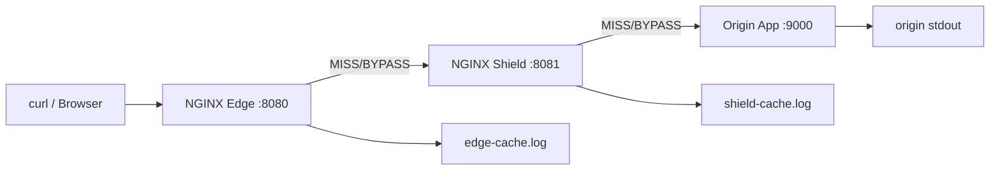

# Part 068 — Content Cache Production Lab

This lab turns the cache theory from Parts 058–067 into an operational system.

You will build a small but production-shaped topology:

```txt
client → edge cache → origin shield cache → origin app
```

The lab is intentionally not a toy "hello cache" example. It includes:

- separate edge and shield cache layers;
- route-specific cache policy;
- static hashed assets;
- cacheable public API;
- private user API that must never be shared-cached;
- cache lock and stale fallback;
- structured cache logs;
- smoke tests;
- failure injection;
- debugging workflow.

The goal is not to memorize config. The goal is to build the operational muscle to answer:

```txt
Why was this request a HIT, MISS, BYPASS, EXPIRED, STALE, or not cached at all?
Can this route safely serve stale?
Can this cache key leak data across users or tenants?
Can origin survive if cache is cold?
Can we prove the behavior from logs?
```

## 1. Target Architecture



The edge owns public behavior:

- route classification;
- public headers;
- client-facing cache status header;
- no-store for private routes;
- short-lived dynamic cache;
- long-lived static cache.

The shield owns origin protection:

- cache lock;
- stale during origin failure;
- connection reuse;
- reduced origin request pressure.

## 2. Lab Requirements

You need:

- Docker;
- Docker Compose;
- `curl`;
- shell environment.

The config uses standard NGINX Open Source primitives:

- `proxy_cache_path`;
- `proxy_cache`;
- `proxy_cache_key`;
- `proxy_cache_valid`;
- `proxy_cache_bypass`;
- `proxy_no_cache`;
- `proxy_cache_lock`;
- `proxy_cache_use_stale`;
- `$upstream_cache_status`;
- `add_header ... always`;
- structured `log_format`.

## 3. Directory Layout

Create this layout:

```txt
nginx-cache-lab/
  docker-compose.yml
  origin/
    app.py
    Dockerfile
  edge/
    nginx.conf
    conf.d/
      edge.conf
  shield/
    nginx.conf
    conf.d/
      shield.conf
  scripts/
    smoke.sh
    fail-origin.sh
    restore-origin.sh
```

This is deliberately split into edge and shield directories to make ownership clear. In production these may be separate fleets, nodes, clusters, or regions.

## 4. Origin App

Create `origin/app.py`:

```python
from http.server import BaseHTTPRequestHandler, HTTPServer
from urllib.parse import urlparse, parse_qs
import json
import os
import time

START = time.time()

class Handler(BaseHTTPRequestHandler):
    def _write(self, status, body, headers=None):
        headers = headers or {}
        self.send_response(status)
        for k, v in headers.items():
            self.send_header(k, v)
        self.end_headers()
        if isinstance(body, str):
            body = body.encode("utf-8")
        self.wfile.write(body)

    def log_message(self, fmt, *args):
        print("origin", self.address_string(), self.command, self.path, fmt % args, flush=True)

    def do_GET(self):
        parsed = urlparse(self.path)
        path = parsed.path
        query = parse_qs(parsed.query)
        now = time.time()

        if path == "/health":
            self._write(200, "ok\n", {"Content-Type": "text/plain"})
            return

        if path.startswith("/assets/"):
            body = f"console.log('asset {path} origin_time={now}');\n"
            self._write(200, body, {
                "Content-Type": "application/javascript",
                "Cache-Control": "public, max-age=31536000, immutable",
            })
            return

        if path == "/api/catalog":
            locale = query.get("locale", ["en"])[0]
            body = {
                "route": "/api/catalog",
                "locale": locale,
                "origin_time": now,
                "uptime": now - START,
            }
            self._write(200, json.dumps(body) + "\n", {
                "Content-Type": "application/json",
                "Cache-Control": "public, max-age=30",
            })
            return

        if path == "/api/slow":
            delay = float(query.get("delay", ["2"])[0])
            time.sleep(delay)
            body = {"route": "/api/slow", "delay": delay, "origin_time": time.time()}
            self._write(200, json.dumps(body) + "\n", {
                "Content-Type": "application/json",
                "Cache-Control": "public, max-age=10",
            })
            return

        if path == "/api/me":
            user = self.headers.get("Authorization", "anonymous")
            body = {
                "route": "/api/me",
                "user_claim": user,
                "origin_time": now,
            }
            self._write(200, json.dumps(body) + "\n", {
                "Content-Type": "application/json",
                "Cache-Control": "private, no-store",
                "Set-Cookie": "session=example; HttpOnly; Path=/",
            })
            return

        if path == "/api/error":
            self._write(500, json.dumps({"error": "simulated", "origin_time": now}) + "\n", {
                "Content-Type": "application/json",
                "Cache-Control": "public, max-age=5",
            })
            return

        self._write(404, json.dumps({"error": "not found", "path": path, "origin_time": now}) + "\n", {
            "Content-Type": "application/json",
            "Cache-Control": "public, max-age=5",
        })

if __name__ == "__main__":
    port = int(os.environ.get("PORT", "9000"))
    HTTPServer(("0.0.0.0", port), Handler).serve_forever()
```

Create `origin/Dockerfile`:

```dockerfile
FROM python:3.12-slim
WORKDIR /app
COPY app.py /app/app.py
EXPOSE 9000
CMD ["python", "/app/app.py"]
```

The origin intentionally returns different cache semantics per route.

## 5. Docker Compose

Create `docker-compose.yml`:

```yaml
services:
  origin:
    build: ./origin
    container_name: nginx-cache-lab-origin
    ports:
      - "9000:9000"

  shield:
    image: nginx:1.27-alpine
    container_name: nginx-cache-lab-shield
    depends_on:
      - origin
    ports:
      - "8081:8081"
    volumes:
      - ./shield/nginx.conf:/etc/nginx/nginx.conf:ro
      - ./shield/conf.d:/etc/nginx/conf.d:ro
      - shield_cache:/var/cache/nginx
      - shield_logs:/var/log/nginx

  edge:
    image: nginx:1.27-alpine
    container_name: nginx-cache-lab-edge
    depends_on:
      - shield
    ports:
      - "8080:8080"
    volumes:
      - ./edge/nginx.conf:/etc/nginx/nginx.conf:ro
      - ./edge/conf.d:/etc/nginx/conf.d:ro
      - edge_cache:/var/cache/nginx
      - edge_logs:/var/log/nginx

volumes:
  edge_cache:
  shield_cache:
  edge_logs:
  shield_logs:
```

Pin exact versions in real production. For a learning lab, `nginx:1.27-alpine` is readable and easy to run, but your organization should define a patching/version strategy.

## 6. Edge NGINX Base Config

Create `edge/nginx.conf`:

```nginx
worker_processes auto;

error_log /var/log/nginx/error.log info;
pid /var/run/nginx.pid;

events {
    worker_connections 1024;
}

http {
    include /etc/nginx/mime.types;
    default_type application/octet-stream;

    log_format cache_json escape=json
      '{'
        '"tier":"edge",'
        '"ts":"$time_iso8601",'
        '"remote_addr":"$remote_addr",'
        '"host":"$host",'
        '"method":"$request_method",'
        '"uri":"$uri",'
        '"args":"$args",'
        '"status":$status,'
        '"bytes":$body_bytes_sent,'
        '"request_time":$request_time,'
        '"upstream_addr":"$upstream_addr",'
        '"upstream_status":"$upstream_status",'
        '"upstream_response_time":"$upstream_response_time",'
        '"cache_status":"$upstream_cache_status",'
        '"request_id":"$request_id"'
      '}';

    access_log /var/log/nginx/access.log cache_json;

    sendfile on;
    keepalive_timeout 30s;

    proxy_cache_path /var/cache/nginx/edge
        levels=1:2
        keys_zone=edge_cache:64m
        max_size=1g
        inactive=30m
        use_temp_path=off;

    map $http_authorization $has_authorization {
        default 1;
        "" 0;
    }

    map $http_cookie $has_cookie {
        default 1;
        "" 0;
    }

    include /etc/nginx/conf.d/*.conf;
}
```

## 7. Edge Server Config

Create `edge/conf.d/edge.conf`:

```nginx
upstream shield_pool {
    zone shield_pool 64k;
    server shield:8081 max_fails=2 fail_timeout=5s;
    keepalive 32;
}

server {
    listen 8080 default_server;
    server_name _;

    add_header X-Lab-Tier edge always;

    location = /health {
        access_log off;
        return 200 "edge ok\n";
    }

    location /assets/ {
        proxy_cache edge_cache;
        proxy_cache_key "$scheme:$host:$uri";
        proxy_cache_valid 200 30d;
        proxy_cache_valid 404 30s;
        proxy_cache_lock on;
        proxy_cache_use_stale error timeout updating http_500 http_502 http_503 http_504;

        proxy_ignore_headers Set-Cookie;
        proxy_hide_header Set-Cookie;

        proxy_http_version 1.1;
        proxy_set_header Connection "";
        proxy_set_header Host $host;
        proxy_set_header X-Forwarded-For $proxy_add_x_forwarded_for;
        proxy_set_header X-Forwarded-Proto $scheme;
        proxy_set_header X-Request-ID $request_id;

        add_header Cache-Control "public, max-age=31536000, immutable" always;
        add_header X-Edge-Cache $upstream_cache_status always;

        proxy_pass http://shield_pool;
    }

    location = /api/catalog {
        proxy_cache edge_cache;
        proxy_cache_key "$scheme:$host:$uri:$is_args$args";
        proxy_cache_valid 200 30s;
        proxy_cache_valid 404 5s;
        proxy_cache_bypass $has_authorization;
        proxy_no_cache $has_authorization;
        proxy_cache_lock on;
        proxy_cache_use_stale error timeout updating http_500 http_502 http_503 http_504;

        proxy_http_version 1.1;
        proxy_set_header Connection "";
        proxy_set_header Host $host;
        proxy_set_header X-Forwarded-For $proxy_add_x_forwarded_for;
        proxy_set_header X-Forwarded-Proto $scheme;
        proxy_set_header X-Request-ID $request_id;

        add_header Cache-Control "public, max-age=30" always;
        add_header X-Edge-Cache $upstream_cache_status always;

        proxy_connect_timeout 1s;
        proxy_send_timeout 5s;
        proxy_read_timeout 5s;

        proxy_pass http://shield_pool;
    }

    location = /api/slow {
        proxy_cache edge_cache;
        proxy_cache_key "$scheme:$host:$uri:$is_args$args";
        proxy_cache_valid 200 10s;
        proxy_cache_lock on;
        proxy_cache_lock_timeout 3s;
        proxy_cache_use_stale error timeout updating http_500 http_502 http_503 http_504;

        proxy_http_version 1.1;
        proxy_set_header Connection "";
        proxy_set_header Host $host;
        proxy_set_header X-Request-ID $request_id;

        add_header X-Edge-Cache $upstream_cache_status always;

        proxy_connect_timeout 1s;
        proxy_send_timeout 5s;
        proxy_read_timeout 5s;

        proxy_pass http://shield_pool;
    }

    location = /api/me {
        proxy_cache off;

        proxy_http_version 1.1;
        proxy_set_header Connection "";
        proxy_set_header Host $host;
        proxy_set_header X-Forwarded-For $proxy_add_x_forwarded_for;
        proxy_set_header X-Forwarded-Proto $scheme;
        proxy_set_header X-Request-ID $request_id;

        add_header Cache-Control "private, no-store" always;
        add_header X-Edge-Cache "NO-STORE" always;

        proxy_pass http://shield_pool;
    }

    location / {
        proxy_cache off;
        add_header Cache-Control "no-store" always;
        add_header X-Edge-Cache "NO-STORE" always;
        proxy_pass http://shield_pool;
    }
}
```

Notice that `/api/me` is not cached even if the origin accidentally returns cacheable headers. The edge route contract wins.

## 8. Shield NGINX Base Config

Create `shield/nginx.conf`:

```nginx
worker_processes auto;

error_log /var/log/nginx/error.log info;
pid /var/run/nginx.pid;

events {
    worker_connections 1024;
}

http {
    include /etc/nginx/mime.types;
    default_type application/octet-stream;

    log_format cache_json escape=json
      '{'
        '"tier":"shield",'
        '"ts":"$time_iso8601",'
        '"remote_addr":"$remote_addr",'
        '"host":"$host",'
        '"method":"$request_method",'
        '"uri":"$uri",'
        '"args":"$args",'
        '"status":$status,'
        '"bytes":$body_bytes_sent,'
        '"request_time":$request_time,'
        '"upstream_addr":"$upstream_addr",'
        '"upstream_status":"$upstream_status",'
        '"upstream_response_time":"$upstream_response_time",'
        '"cache_status":"$upstream_cache_status",'
        '"request_id":"$http_x_request_id"'
      '}';

    access_log /var/log/nginx/access.log cache_json;

    sendfile on;
    keepalive_timeout 30s;

    proxy_cache_path /var/cache/nginx/shield
        levels=1:2
        keys_zone=shield_cache:64m
        max_size=2g
        inactive=1h
        use_temp_path=off;

    include /etc/nginx/conf.d/*.conf;
}
```

## 9. Shield Server Config

Create `shield/conf.d/shield.conf`:

```nginx
upstream origin_pool {
    zone origin_pool 64k;
    server origin:9000 max_fails=2 fail_timeout=5s;
    keepalive 32;
}

server {
    listen 8081 default_server;
    server_name _;

    add_header X-Lab-Tier shield always;

    location = /health {
        access_log off;
        return 200 "shield ok\n";
    }

    location /assets/ {
        proxy_cache shield_cache;
        proxy_cache_key "$scheme:$host:$uri";
        proxy_cache_valid 200 30d;
        proxy_cache_valid 404 30s;
        proxy_cache_lock on;
        proxy_cache_use_stale error timeout updating http_500 http_502 http_503 http_504;

        proxy_ignore_headers Set-Cookie;
        proxy_hide_header Set-Cookie;

        proxy_http_version 1.1;
        proxy_set_header Connection "";
        proxy_set_header Host $host;
        proxy_set_header X-Forwarded-For $proxy_add_x_forwarded_for;
        proxy_set_header X-Forwarded-Proto $scheme;
        proxy_set_header X-Request-ID $http_x_request_id;

        add_header X-Shield-Cache $upstream_cache_status always;

        proxy_pass http://origin_pool;
    }

    location = /api/catalog {
        proxy_cache shield_cache;
        proxy_cache_key "$scheme:$host:$uri:$is_args$args";
        proxy_cache_valid 200 30s;
        proxy_cache_valid 404 5s;
        proxy_cache_lock on;
        proxy_cache_use_stale error timeout updating http_500 http_502 http_503 http_504;

        proxy_http_version 1.1;
        proxy_set_header Connection "";
        proxy_set_header Host $host;
        proxy_set_header X-Forwarded-For $proxy_add_x_forwarded_for;
        proxy_set_header X-Forwarded-Proto $scheme;
        proxy_set_header X-Request-ID $http_x_request_id;

        add_header X-Shield-Cache $upstream_cache_status always;

        proxy_connect_timeout 1s;
        proxy_send_timeout 5s;
        proxy_read_timeout 5s;

        proxy_pass http://origin_pool;
    }

    location = /api/slow {
        proxy_cache shield_cache;
        proxy_cache_key "$scheme:$host:$uri:$is_args$args";
        proxy_cache_valid 200 10s;
        proxy_cache_lock on;
        proxy_cache_lock_timeout 3s;
        proxy_cache_use_stale error timeout updating http_500 http_502 http_503 http_504;

        proxy_http_version 1.1;
        proxy_set_header Connection "";
        proxy_set_header Host $host;
        proxy_set_header X-Request-ID $http_x_request_id;

        add_header X-Shield-Cache $upstream_cache_status always;

        proxy_connect_timeout 1s;
        proxy_send_timeout 5s;
        proxy_read_timeout 5s;

        proxy_pass http://origin_pool;
    }

    location = /api/me {
        proxy_cache off;

        proxy_http_version 1.1;
        proxy_set_header Connection "";
        proxy_set_header Host $host;
        proxy_set_header X-Forwarded-For $proxy_add_x_forwarded_for;
        proxy_set_header X-Forwarded-Proto $scheme;
        proxy_set_header X-Request-ID $http_x_request_id;

        add_header Cache-Control "private, no-store" always;
        add_header X-Shield-Cache "NO-STORE" always;

        proxy_pass http://origin_pool;
    }

    location / {
        proxy_cache off;
        add_header X-Shield-Cache "NO-STORE" always;
        proxy_pass http://origin_pool;
    }
}
```

The shield has route policies too. Do not rely on edge being the only safe layer. Defense in depth matters.

## 10. Start the Lab

From `nginx-cache-lab/`:

```bash
docker compose up --build
```

In another terminal:

```bash
curl -i http://localhost:8080/health
curl -i http://localhost:8081/health
curl -i http://localhost:9000/health
```

Expected:

```txt
edge ok
shield ok
ok
```

## 11. Smoke Test Script

Create `scripts/smoke.sh`:

```bash
#!/usr/bin/env bash
set -euo pipefail

BASE="${BASE:-http://localhost:8080}"

section() {
  printf '\n\n## %s\n' "$1"
}

hit() {
  local path="$1"
  echo "-- $path"
  curl -sS -D - "$BASE$path" -o /tmp/nginx-cache-lab-body \
    | awk 'BEGIN{IGNORECASE=1} /^HTTP|^X-Edge-Cache|^X-Shield-Cache|^Cache-Control|^Set-Cookie/ {print}'
  cat /tmp/nginx-cache-lab-body
}

section "static asset: first request should MISS"
hit "/assets/app.a8f31c90.js"

section "static asset: second request should HIT at edge"
hit "/assets/app.a8f31c90.js"

section "catalog: first request should MISS"
hit "/api/catalog?locale=en"

section "catalog: second request should HIT"
hit "/api/catalog?locale=en"

section "catalog with different query should be different key"
hit "/api/catalog?locale=id"

section "authorized catalog should BYPASS edge cache"
curl -sS -D - "$BASE/api/catalog?locale=en" \
  -H 'Authorization: Bearer abc' \
  -o /tmp/nginx-cache-lab-body \
  | awk 'BEGIN{IGNORECASE=1} /^HTTP|^X-Edge-Cache|^X-Shield-Cache|^Cache-Control|^Set-Cookie/ {print}'
cat /tmp/nginx-cache-lab-body

section "private profile must never be shared-cached"
curl -sS -D - "$BASE/api/me" \
  -H 'Authorization: Bearer user-a' \
  -o /tmp/nginx-cache-lab-body \
  | awk 'BEGIN{IGNORECASE=1} /^HTTP|^X-Edge-Cache|^X-Shield-Cache|^Cache-Control|^Set-Cookie/ {print}'
cat /tmp/nginx-cache-lab-body
```

Make executable and run:

```bash
chmod +x scripts/smoke.sh
./scripts/smoke.sh
```

You should see the static and catalog routes move from `MISS` to `HIT`. `/api/me` should show `X-Edge-Cache: NO-STORE` and `Cache-Control: private, no-store`.

## 12. Expected Request Behavior

| Request | Expected edge behavior | Expected reason |
|---|---|---|
| `GET /assets/app.a8f31c90.js` first | `MISS` | Cold edge cache. |
| same asset second | `HIT` | Immutable static asset. |
| `GET /api/catalog?locale=en` first | `MISS` | Cold dynamic cache. |
| same catalog second | `HIT` | Same key. |
| `GET /api/catalog?locale=id` | `MISS` | Different query dimension. |
| catalog with Authorization | `BYPASS` | Authenticated request bypasses edge cache. |
| `GET /api/me` | `NO-STORE` | Private user route. |

Remember: a `MISS` at edge may still be a `HIT` at shield. That is exactly why the shield exists.

## 13. Inspect Logs

Follow edge logs:

```bash
docker exec -it nginx-cache-lab-edge sh -lc 'tail -f /var/log/nginx/access.log'
```

Follow shield logs:

```bash
docker exec -it nginx-cache-lab-shield sh -lc 'tail -f /var/log/nginx/access.log'
```

Interesting fields:

```json
{
  "tier":"edge",
  "uri":"/api/catalog",
  "args":"locale=en",
  "status":200,
  "upstream_status":"200",
  "upstream_response_time":"0.002",
  "cache_status":"HIT"
}
```

A cache HIT usually has no upstream request from that tier, so upstream fields can be empty or `-` depending on version/config/context. Do not parse them blindly. Build dashboards that tolerate absent upstream fields.

## 14. Failure Drill 1: Origin Down, Cached Content Survives

Warm cache first:

```bash
curl -i http://localhost:8080/api/catalog?locale=en
curl -i http://localhost:8080/api/catalog?locale=en
```

Stop origin:

```bash
docker compose stop origin
```

Request again:

```bash
curl -i http://localhost:8080/api/catalog?locale=en
```

Possible outcomes depend on cache freshness:

| State | Expected |
|---|---|
| Edge fresh | `X-Edge-Cache: HIT` |
| Edge expired, shield stale/fresh | edge may revalidate through shield and still return success |
| Both stale and stale allowed | `STALE` or `UPDATING` behavior may appear |
| Truly cold key | error, usually 502/504 depending failure |

Now request a cold key:

```bash
curl -i http://localhost:8080/api/catalog?locale=fr
```

Expected: this may fail because neither edge nor shield has it cached.

Restore origin:

```bash
docker compose start origin
```

## 15. Failure Drill 2: Cache Stampede

Test many concurrent slow requests.

```bash
seq 1 20 | xargs -n1 -P20 -I{} curl -sS -o /dev/null -w '%{http_code} %{time_total}\n' \
  'http://localhost:8080/api/slow?delay=2'
```

Then inspect origin logs:

```bash
docker logs nginx-cache-lab-origin --tail=100
```

With `proxy_cache_lock on`, you should not see 20 equivalent origin requests for the same key at the same time. The point is not that zero extra requests can ever happen; the point is that NGINX should reduce duplicate fills for the same cache key.

## 16. Failure Drill 3: Authenticated Route Must Not Leak

Run:

```bash
curl -sS http://localhost:8080/api/me -H 'Authorization: Bearer user-a'
curl -sS http://localhost:8080/api/me -H 'Authorization: Bearer user-b'
```

Expected:

```txt
First response mentions user-a.
Second response mentions user-b.
Neither should be served from shared cache.
```

Check headers:

```bash
curl -i http://localhost:8080/api/me -H 'Authorization: Bearer user-a'
```

Expected:

```txt
Cache-Control: private, no-store
X-Edge-Cache: NO-STORE
```

This is a privacy invariant. Treat failure here as a severity-1 design bug.

## 17. Failure Drill 4: Cache Key Query Dimension

Run:

```bash
curl -sS http://localhost:8080/api/catalog?locale=en
curl -sS http://localhost:8080/api/catalog?locale=id
curl -sS http://localhost:8080/api/catalog?locale=en
```

Expected:

- `locale=en` and `locale=id` must be different cached objects;
- repeating `locale=en` should hit the earlier `en` object;
- `locale=id` must not receive `en` content.

This is the simplest proof that query dimension participates in the key.

## 18. Failure Drill 5: Edge Restart Should Not Break Origin

Restart edge only:

```bash
docker compose restart edge
```

Request cached content:

```bash
curl -i http://localhost:8080/assets/app.a8f31c90.js
curl -i http://localhost:8080/api/catalog?locale=en
```

The edge cache volume persists in this lab, so objects may remain available. But in real platforms, cache should still be treated as disposable. Your system must survive cache loss by falling back to shield/origin.

## 19. Production-Grade Improvements

The lab is intentionally small. Production should add:

| Concern | Production improvement |
|---|---|
| TLS | Terminate HTTPS at edge; consider mTLS edge→shield/origin. |
| Host policy | Strict `server_name`; unknown host sinkhole. |
| Real IP | Trust only known upstream proxies/load balancers. |
| Versioning | Pin NGINX version and module set. |
| Observability | Ship JSON logs to central platform. |
| Metrics | Export cache hit ratio, disk usage, upstream latency. |
| Disk | Dedicated cache volume; monitor bytes and inodes. |
| Secrets | Do not embed origin credentials in world-readable config. |
| Config CI | Run `nginx -t` and smoke tests before deploy. |
| Rollback | Atomic config release and known-good fallback. |
| Purge | Prefer immutable URLs; gate any purge API. |
| Security | No cache for auth/cookie routes by default. |

## 20. Common Debugging Patterns

### Pattern: Expected HIT but Got MISS

Check:

```txt
[ ] Is method GET/HEAD?
[ ] Is status code cacheable by policy?
[ ] Did origin send Set-Cookie?
[ ] Did origin send Cache-Control: no-store/private?
[ ] Did proxy_no_cache evaluate true?
[ ] Is cache key different because of query/host/scheme?
[ ] Did object expire or become inactive?
[ ] Is cache zone full or being evicted?
```

### Pattern: Expected BYPASS but Got HIT

Check:

```txt
[ ] Is bypass variable actually non-empty and not "0"?
[ ] Is Authorization header arriving at NGINX?
[ ] Is request served by a different location than expected?
[ ] Is a public route accidentally matching before private route?
[ ] Does default/fallback location enable cache?
```

### Pattern: Origin Still Receives Too Much Traffic

Check:

```txt
[ ] Hit ratio by route.
[ ] Cache key cardinality.
[ ] Query parameter fragmentation.
[ ] `proxy_cache_lock` enabled for hot keys.
[ ] TTL too short.
[ ] `Set-Cookie` or `Vary: *` preventing storage.
[ ] Shield missing or bypassed.
[ ] Edge instances all cold after deploy/restart.
```

### Pattern: Stale Served Too Long

Check:

```txt
[ ] `proxy_cache_use_stale` conditions.
[ ] `proxy_cache_background_update` behavior.
[ ] TTL and inactive values.
[ ] Origin revalidation failing silently.
[ ] Alerts only watching client 5xx, not stale ratio.
```

## 21. Cache Policy as Code

For real teams, keep route cache policy in a reviewable file.

Example:

```yaml
routes:
  - path: /assets/
    audience: public
    cache_key: scheme_host_uri
    ttl_success: 30d
    ttl_404: 30s
    stale_on_failure: true
    auth_bypass: false
    owner: frontend-platform

  - path: /api/catalog
    audience: public
    cache_key: scheme_host_uri_query
    ttl_success: 30s
    ttl_404: 5s
    stale_on_failure: true
    auth_bypass: true
    owner: catalog-team

  - path: /api/me
    audience: user
    cache: none
    stale_on_failure: false
    owner: identity-team
```

Generate NGINX snippets from policy where possible. Human-written config is fine at small scale, but at platform scale you want policy review, automated tests, and deterministic generation.

## 22. Smoke Tests as Release Gates

A release gate should test behavior, not syntax only.

Minimum test cases:

```txt
[ ] NGINX config syntax is valid.
[ ] Static asset first request MISS, second HIT.
[ ] Public API first request MISS, second HIT.
[ ] Authenticated public API request BYPASS.
[ ] Private user route NO-STORE.
[ ] Distinct query creates distinct response.
[ ] Stale behavior works for approved routes.
[ ] Cold key fails safely when origin down.
[ ] Unknown host does not reach tenant origin.
```

Example CI command shape:

```bash
nginx -t -c /etc/nginx/nginx.conf
./scripts/smoke.sh
```

In containerized CI, run NGINX with the candidate config and a fake origin, then assert headers and response bodies.

## 23. Lab Cleanup

Stop and remove containers:

```bash
docker compose down
```

Remove volumes too:

```bash
docker compose down -v
```

Removing volumes clears cache state.

## 24. Production Invariants from This Lab

Carry these invariants forward:

```txt
Cache policy is route-specific.
Private routes are no-store by default.
Authenticated requests bypass shared cache unless explicitly reviewed.
Static hashed assets can be cached aggressively.
Dynamic public API needs short TTL and key discipline.
Edge and shield logs must expose cache status.
Stale is an explicit product decision.
Cache lock is required for hot expensive keys.
Origin shield exists to protect origin, not to make every request faster.
```

## 25. Key Takeaways

- A production cache system needs edge behavior, shield behavior, observability, and tests.
- `proxy_cache_bypass` and `proxy_no_cache` solve different problems: read gate versus write gate.
- `X-Edge-Cache` and `X-Shield-Cache` are useful lab/debug headers, but production exposure should be reviewed.
- Do not cache user-specific responses in a shared cache unless identity dimensions and invalidation are formally designed.
- Failure drills are part of cache design, not an optional reliability exercise.

## 26. What Comes Next

Phase 5 is complete.

The next phase moves from content caching into security and transport:

```txt
Part 069 — TLS Termination Mental Model
Part 070 — Certificates, Chain, SNI, and Name-Based HTTPS
```

From here onward, NGINX becomes not only a cache and proxy but also an identity boundary for encrypted traffic.

## 27. References

- NGINX Admin Guide — Content Caching: `https://docs.nginx.com/nginx/admin-guide/content-cache/content-caching/`
- NGINX `ngx_http_proxy_module`: `https://nginx.org/en/docs/http/ngx_http_proxy_module.html`
- NGINX `ngx_http_headers_module`: `https://nginx.org/en/docs/http/ngx_http_headers_module.html`
- NGINX Runtime Control: `https://docs.nginx.com/nginx/admin-guide/basic-functionality/runtime-control/`
