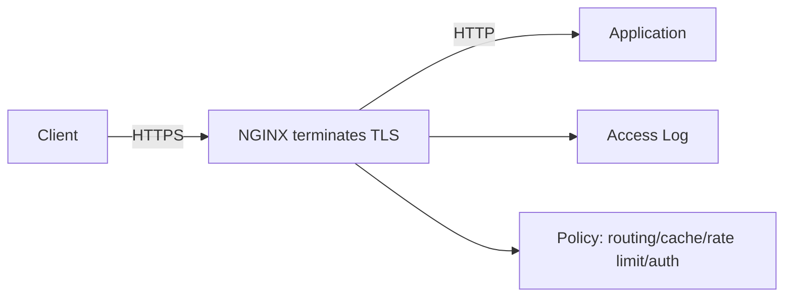
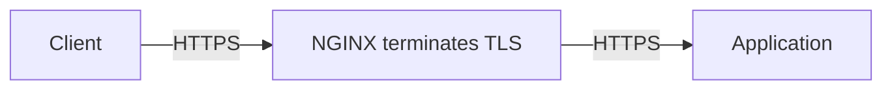
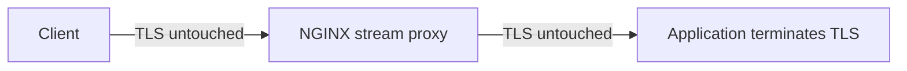
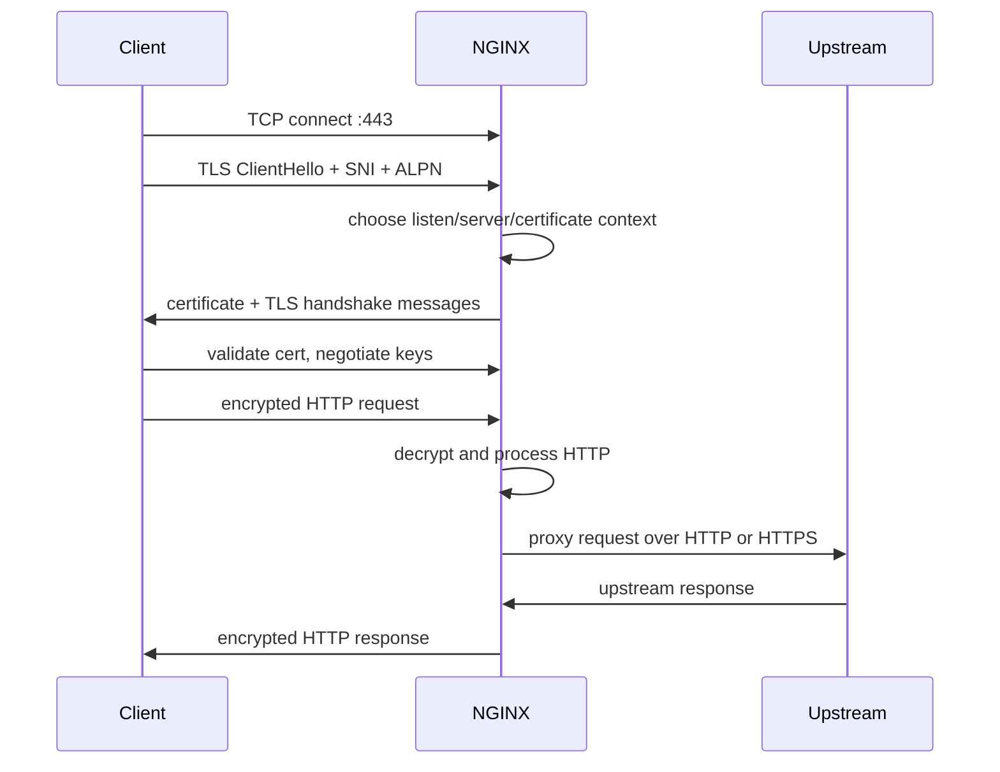
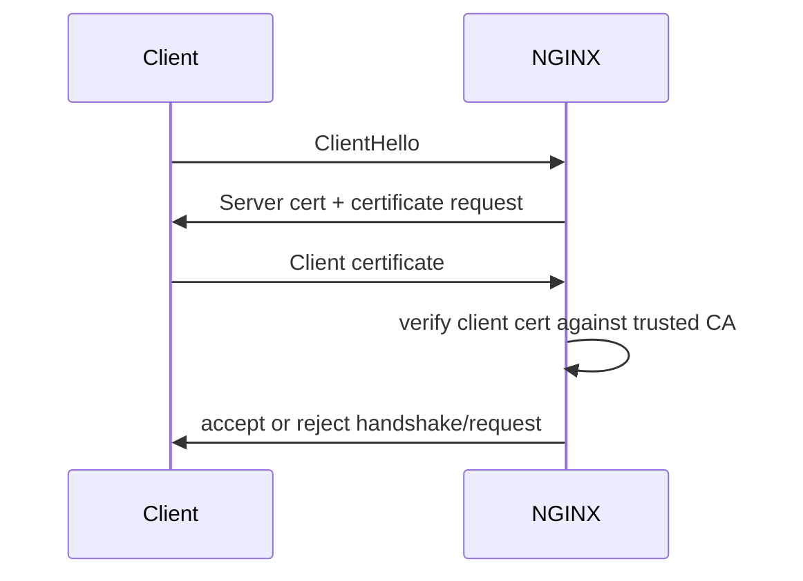

# Part 069 — TLS Termination Mental Model

TLS termination is where encrypted client traffic stops being encrypted for one connection and becomes readable by the terminating component.

When NGINX terminates TLS, NGINX is not merely "enabling HTTPS". It becomes a security boundary.

It decides:

- which certificate represents the service;
- which TLS protocol versions are accepted;
- which hostname is allowed to bind to which certificate;
- whether client identity is verified with mTLS;
- whether the upstream hop is plaintext or re-encrypted;
- which headers tell the app what the original scheme and host were;
- which logs can prove what happened;
- which operational team owns key rotation, expiry, reload, and incident response.

A top-tier engineer does not treat TLS as a config snippet. They treat it as an identity boundary with lifecycle, failure modes, and audit semantics.

## 1. The Simplest Mental Model

With plain HTTP reverse proxying:

```txt
client --HTTP--> NGINX --HTTP--> upstream
```

With TLS termination:

```txt
client --HTTPS/TLS--> NGINX --HTTP or HTTPS--> upstream
```

The first encrypted connection ends at NGINX. After that, traffic may be forwarded to the upstream in one of two common ways:

```txt
client --HTTPS--> NGINX --HTTP--> upstream
client --HTTPS--> NGINX --HTTPS--> upstream
```

This distinction is not cosmetic.

It answers: "Who can read the request body?"

```txt
TLS endpoint can read plaintext.
Network hops before TLS endpoint cannot read plaintext.
Network hops after TLS endpoint may read plaintext unless re-encrypted.
```

Once NGINX terminates TLS, it can inspect and modify HTTP:

- URI;
- headers;
- cookies;
- request body if buffered/read;
- response headers;
- cache policy;
- upstream route;
- auth subrequest decision;
- rate-limit key;
- logs.

That is why TLS termination belongs in architecture design, not in a late deployment checklist.

## 2. TLS Termination Is Not TLS Passthrough

There are three common deployment patterns.

### Pattern A — Termination at NGINX



NGINX can see HTTP and apply Layer 7 policy.

Use this when NGINX must do:

- HTTP routing;
- cache;
- rate limiting by header/cookie/path;
- auth request;
- CORS;
- header normalization;
- WAF-like inspection;
- structured access logs;
- redirects;
- response shaping.

### Pattern B — Termination and Re-Encryption



NGINX can still see HTTP because TLS terminates at NGINX first. But the upstream hop is encrypted again.

Use this when:

- NGINX and app are separated by an untrusted or semi-trusted network;
- policy requires encryption in transit inside the perimeter;
- upstream identity must be verified;
- internal network is shared across teams/tenants;
- compliance language says "end-to-end encryption" but architecture still needs Layer 7 proxy policy.

Be precise with language: this is not end-to-end from browser to app, because NGINX still decrypts. It is usually **hop-by-hop encryption with trusted termination**.

### Pattern C — TLS Passthrough



NGINX does not terminate TLS. It forwards TCP bytes. It may route based on SNI if configured in `stream`, but it cannot see HTTP headers or URI.

Use this when:

- the app must own certificates/private keys;
- NGINX must not inspect plaintext;
- protocol is not HTTP;
- client certificate auth must be handled by the backend;
- organization requires true end-to-end TLS from client to service.

Trade-off:

```txt
TLS passthrough preserves encryption boundary,
but removes HTTP-level NGINX features.
```

This phase focuses mostly on HTTP TLS termination. Layer 4 TLS passthrough returns in Phase 7.

## 3. What Actually Happens Before NGINX Sees HTTP

Before NGINX can route by URI, apply CORS, cache a response, or proxy to upstream, the TLS handshake must succeed.

A simplified HTTPS request lifecycle looks like this:



Important ordering:

```txt
TLS handshake happens before HTTP request processing.
SNI is available during TLS handshake.
Host header is available only after HTTP request is decrypted.
URI is available only after HTTP request is decrypted.
```

This ordering explains many surprising bugs:

- wrong certificate served before HTTP routing can happen;
- default HTTPS server matters more than many teams expect;
- redirect logic cannot fix a failed certificate validation;
- `server_name` selection during TLS depends on SNI, not on the HTTP `Host` header;
- clients without SNI may receive the default certificate for that listen socket.

## 4. TLS Termination Defines the Identity of the Edge

For a browser, the certificate is the server identity.

The user types:

```txt
https://api.example.com/orders
```

The browser validates that the certificate presented by NGINX is valid for:

```txt
api.example.com
```

Only after that does the browser send the encrypted HTTP request.

This means NGINX is effectively saying:

```txt
I am api.example.com.
Trust me to handle this encrypted traffic.
```

That statement has operational consequences:

- the private key is sensitive production identity material;
- the NGINX host/container/secret store is part of the trust boundary;
- cert renewal failures become public outages;
- default certificate mistakes become user-visible security errors;
- wildcard certificates increase blast radius;
- shared edge platforms must isolate certificate ownership carefully.

## 5. TLS Does Not Solve Authorization

TLS answers transport questions:

```txt
Can the client establish an encrypted connection to this endpoint?
Is the server certificate valid for the requested name?
Was the traffic protected from passive network observers on this hop?
```

TLS by itself does not answer application questions:

```txt
Is this user logged in?
Can this user read invoice 123?
Is this API token scoped to this tenant?
Is this request idempotent?
Is this payload valid?
```

Even mTLS only authenticates a client certificate. It does not automatically implement business authorization.

A good boundary model separates:

| Layer | Question | Example NGINX Responsibility |
|---|---|---|
| TLS server auth | Is the server really `api.example.com`? | `ssl_certificate`, `ssl_certificate_key` |
| TLS protocol policy | Which TLS versions are allowed? | `ssl_protocols` |
| Client cert auth | Does client present trusted cert? | `ssl_client_certificate`, `ssl_verify_client` |
| HTTP identity propagation | What scheme/host/client IP should app see? | `X-Forwarded-Proto`, `X-Forwarded-Host`, `X-Real-IP` |
| App auth | Is user allowed? | App or auth service, optionally via `auth_request` |
| Business authorization | Can actor perform action on resource? | App/domain authorization engine |

## 6. The Four TLS Edge Topologies

### 6.1 Public Edge Termination

```txt
Internet → NGINX → private app network
```

NGINX owns public TLS.

Common for:

- VM/bare-metal reverse proxy;
- public API gateway;
- self-managed ingress;
- static site + API edge.

Key risk:

```txt
NGINX compromise exposes decrypted traffic and private keys.
```

### 6.2 CDN Terminates First, NGINX Terminates Again

```txt
Browser --HTTPS--> CDN --HTTPS--> NGINX --HTTP/HTTPS--> app
```

The browser sees CDN certificate. NGINX sees requests from CDN. The NGINX certificate may be public, private, origin-only, or mTLS-protected depending on provider/policy.

Key risks:

- trusting arbitrary `X-Forwarded-For` instead of only CDN IP ranges;
- allowing direct-to-origin bypass;
- forgetting to enforce Host/SNI on origin;
- using HTTP from CDN to origin accidentally;
- duplicate compression/cache policy.

Invariant:

```txt
If CDN is the public edge, NGINX must still verify that traffic came through the intended CDN path.
```

### 6.3 Cloud Load Balancer Terminates, NGINX Receives HTTP

```txt
Client --HTTPS--> Cloud LB --HTTP--> NGINX --HTTP--> app
```

NGINX no longer owns public TLS. It may still perform HTTP routing and policy.

Key risks:

- app thinks original scheme is HTTP unless `X-Forwarded-Proto` is set correctly;
- redirects may point to `http://`;
- secure cookies may be misclassified;
- NGINX logs do not represent TLS version/cipher;
- client certificate auth is impossible at NGINX unless LB forwards verified identity safely.

This topology is not wrong. But the team must not pretend NGINX owns TLS when the LB does.

### 6.4 NGINX Ingress in Kubernetes

```txt
Client → LoadBalancer Service → NGINX Ingress Controller → Service → Pod
```

NGINX is often the TLS termination point for Kubernetes ingress objects.

Key risks:

- certificate secret lifecycle;
- ingress annotation sprawl;
- namespace/tenant boundary;
- direct pod/service bypass;
- inconsistent TLS policy across ingress objects;
- external-dns/cert-manager coordination failure.

The same mental model applies:

```txt
Who terminates TLS?
Who owns certificates?
Who is allowed to define hostnames?
Who can change TLS policy?
What happens on renewal failure?
```

## 7. Minimal TLS Termination Shape

A minimal HTTPS reverse proxy shape:

```nginx
server {
    listen 443 ssl;
    server_name api.example.com;

    ssl_certificate     /etc/nginx/certs/api.example.com/fullchain.pem;
    ssl_certificate_key /etc/nginx/certs/api.example.com/privkey.pem;

    location / {
        proxy_pass http://api_backend;

        proxy_set_header Host              $host;
        proxy_set_header X-Real-IP         $remote_addr;
        proxy_set_header X-Forwarded-For   $proxy_add_x_forwarded_for;
        proxy_set_header X-Forwarded-Host  $host;
        proxy_set_header X-Forwarded-Proto https;
    }
}
```

This is not a complete production TLS config. It is the skeleton.

The skeleton says:

```txt
For SNI/Host api.example.com on port 443,
use this certificate/key,
decrypt the request,
proxy it to api_backend,
and tell the app the original external scheme was HTTPS.
```

## 8. Why `X-Forwarded-Proto` Is Security-Relevant

When NGINX terminates TLS and proxies to upstream over HTTP, the upstream sees a plain HTTP request.

Without correction, many apps infer:

```txt
request.scheme = http
```

This can break:

- absolute URL generation;
- OAuth redirect URI validation;
- secure cookie generation;
- HSTS assumptions;
- CSRF origin/scheme checks;
- API docs links;
- canonical redirects.

So NGINX usually forwards:

```nginx
proxy_set_header X-Forwarded-Proto $scheme;
```

or, in a server that only accepts HTTPS:

```nginx
proxy_set_header X-Forwarded-Proto https;
```

When NGINX is behind another TLS terminator, `$scheme` may be `http`, because the request received by NGINX is HTTP. In that case, you need a trust-aware model:

```nginx
# Example only. Trust must be constrained to the known load balancer/CDN path.
proxy_set_header X-Forwarded-Proto $http_x_forwarded_proto;
```

But never blindly trust arbitrary client-supplied forwarded headers at the public edge.

Production invariant:

```txt
Forwarded protocol is authoritative only if it was set by a trusted hop.
```

## 9. Termination and Re-Encryption to Upstream

To encrypt the upstream hop:

```nginx
upstream api_tls_backend {
    server api-1.internal.example.com:443;
    server api-2.internal.example.com:443;
    keepalive 64;
}

server {
    listen 443 ssl;
    server_name api.example.com;

    ssl_certificate     /etc/nginx/certs/api.example.com/fullchain.pem;
    ssl_certificate_key /etc/nginx/certs/api.example.com/privkey.pem;

    location / {
        proxy_pass https://api_tls_backend;
        proxy_http_version 1.1;
        proxy_set_header Connection "";

        proxy_ssl_server_name on;
        proxy_ssl_name api.internal.example.com;
        proxy_ssl_verify on;
        proxy_ssl_trusted_certificate /etc/nginx/trust/internal-ca.pem;
        proxy_ssl_verify_depth 2;

        proxy_set_header Host api.internal.example.com;
        proxy_set_header X-Forwarded-Proto https;
    }
}
```

Key idea:

```txt
Client-side TLS and upstream-side TLS are separate TLS sessions.
```

You need to reason about both:

| Hop | Directives | Risk if Misconfigured |
|---|---|---|
| Client → NGINX | `ssl_certificate`, `ssl_certificate_key`, `ssl_protocols` | Client warning/outage/weak transport |
| NGINX → upstream | `proxy_pass https://...`, `proxy_ssl_*` | Silent MITM/internal misrouting/plaintext expectations |

Do not assume `proxy_pass https://...` means upstream identity is verified exactly the way you intend. Verify the upstream certificate, trust store, name, and SNI behavior.

## 10. TLS Termination and mTLS

mTLS means the server verifies the client certificate during TLS handshake.



NGINX-side sketch:

```nginx
server {
    listen 443 ssl;
    server_name partner-api.example.com;

    ssl_certificate     /etc/nginx/certs/partner-api/fullchain.pem;
    ssl_certificate_key /etc/nginx/certs/partner-api/privkey.pem;

    ssl_client_certificate /etc/nginx/client-ca/partners.pem;
    ssl_verify_client on;
    ssl_verify_depth 2;

    location / {
        proxy_pass http://partner_api_backend;
        proxy_set_header X-Client-Cert-Verify $ssl_client_verify;
        proxy_set_header X-Client-Cert-DN     $ssl_client_s_dn;
    }
}
```

Be careful with propagating certificate-derived headers.

A malicious client must not be able to set:

```txt
X-Client-Cert-Verify: SUCCESS
```

unless NGINX overwrites or clears it at the trust boundary.

Safer pattern:

```nginx
proxy_set_header X-Client-Cert-Verify $ssl_client_verify;
proxy_set_header X-Client-Cert-DN     $ssl_client_s_dn;
```

And at the public edge, reject or overwrite incoming identity headers.

## 11. TLS Termination Changes Logging

Once NGINX owns TLS, it can log TLS metadata.

A useful TLS-aware log format:

```nginx
log_format tls_json escape=json
  '{'
    '"ts":"$time_iso8601",'
    '"remote_addr":"$remote_addr",'
    '"host":"$host",'
    '"sni":"$ssl_server_name",'
    '"request":"$request",'
    '"status":$status,'
    '"scheme":"$scheme",'
    '"tls_protocol":"$ssl_protocol",'
    '"tls_cipher":"$ssl_cipher",'
    '"client_verify":"$ssl_client_verify",'
    '"upstream_addr":"$upstream_addr",'
    '"upstream_status":"$upstream_status",'
    '"request_time":$request_time'
  '}';
```

This lets you answer:

```txt
Which SNI did the client send?
Which TLS protocol was negotiated?
Which cipher was used?
Was a client certificate verified?
Did the request reach upstream?
Was the Host header different from SNI?
```

That last question matters. SNI and HTTP Host can differ. Treat mismatch as suspicious unless you intentionally support it.

## 12. SNI vs Host Header

SNI is sent during TLS handshake. `Host` is sent inside the HTTP request after TLS is established.

```txt
SNI  = certificate/server selection before HTTP
Host = HTTP virtual host routing after decryption
```

In normal browser traffic:

```txt
SNI  = api.example.com
Host = api.example.com
```

But clients can send:

```txt
SNI  = api.example.com
Host = internal.example.com
```

or:

```txt
SNI  = old.example.com
Host = api.example.com
```

Possible causes:

- manual testing;
- old clients;
- malicious probing;
- CDN/origin misconfiguration;
- proxy tunnel behavior;
- certificate mismatch debugging;
- HTTP/2 connection coalescing edge cases.

For simple public APIs, consider making SNI/Host mismatch visible in logs and, if appropriate, rejecting unexpected hosts at application or NGINX layer.

Example host guard:

```nginx
server {
    listen 443 ssl;
    server_name api.example.com;

    if ($host != "api.example.com") {
        return 421;
    }

    location / {
        proxy_pass http://api_backend;
    }
}
```

Avoid using `if` for complex routing logic. Here it is a simple request termination guard. Many teams instead use explicit server blocks and default reject servers.

## 13. Default HTTPS Server Is a Security Primitive

For HTTP, a wrong default server may return the wrong site.

For HTTPS, a wrong default server may return the wrong certificate before HTTP begins.

Create an explicit default 443 server.

Modern NGINX supports rejecting handshakes directly:

```nginx
server {
    listen 443 ssl default_server;
    ssl_reject_handshake on;
}
```

Fallback if you cannot use that directive in your deployed version:

```nginx
server {
    listen 443 ssl default_server;
    server_name _;

    ssl_certificate     /etc/nginx/certs/default/fullchain.pem;
    ssl_certificate_key /etc/nginx/certs/default/privkey.pem;

    return 444;
}
```

The default certificate should not be a sensitive wildcard cert that gives unnecessary information about your domain inventory.

Production invariant:

```txt
Every public 443 listener has an explicit default behavior.
```

## 14. Where TLS Policy Should Live

TLS policy can be repeated in every server block, but that invites drift.

Better pattern:

```nginx
# snippets/tls-modern.conf
ssl_protocols TLSv1.2 TLSv1.3;
ssl_session_cache shared:SSL:50m;
ssl_session_timeout 1d;
ssl_session_tickets off;
```

Then:

```nginx
server {
    listen 443 ssl;
    server_name api.example.com;

    include snippets/tls-modern.conf;

    ssl_certificate     /etc/nginx/certs/api/fullchain.pem;
    ssl_certificate_key /etc/nginx/certs/api/privkey.pem;

    location / {
        proxy_pass http://api_backend;
    }
}
```

However, be careful: some TLS directives are involved very early in virtual server selection. Do not casually put incompatible `ssl_protocols` values in different name-based virtual servers on the same listener. Treat protocol policy as listener-level policy unless you have tested the exact selection behavior.

## 15. Key Ownership Model

TLS private keys are production secrets.

A sane ownership model answers:

```txt
Who can read private keys?
Who can deploy cert files?
Who can request new certificates?
Who can revoke certificates?
Who can reload NGINX?
Who monitors expiry?
Who rotates emergency keys?
Who audits wildcard/SAN scope?
```

Bad model:

```txt
Anyone with SSH can edit /etc/nginx/certs and reload.
```

Better model:

```txt
Cert issuance: automated ACME or internal CA workflow.
Secret storage: restricted path or secret manager.
Deployment: controlled pipeline.
Reload: test-before-reload.
Monitoring: expiry alerts.
Revocation: documented runbook.
Audit: cert inventory by hostname and owner.
```

Filesystem baseline:

```bash
sudo chown root:root /etc/nginx/certs/api.example.com/privkey.pem
sudo chmod 600 /etc/nginx/certs/api.example.com/privkey.pem
sudo chmod 644 /etc/nginx/certs/api.example.com/fullchain.pem
```

If NGINX workers need to read key material after privilege drop, confirm your packaging/runtime model. Do not rely on folklore; test the actual process user and reload behavior.

## 16. Common TLS Termination Failure Modes

| Failure | Symptom | Likely Cause |
|---|---|---|
| Browser certificate warning | `NET::ERR_CERT_COMMON_NAME_INVALID` | wrong certificate/SNI/default server |
| NGINX fails `-t` | cannot load cert/key | missing file, wrong permission, malformed PEM |
| HTTPS works but app redirects to HTTP | redirect URL generated from upstream scheme | missing/wrong `X-Forwarded-Proto` |
| Secure cookies not set | app thinks request is HTTP | proxy headers not trusted/configured |
| mTLS always fails | `400`/handshake failure | wrong client CA/depth/chain |
| mTLS succeeds for wrong clients | CA too broad | trust store includes more issuers than intended |
| Upstream TLS fails | `502` | upstream cert verification/name/SNI issue |
| Intermittent cert mismatch | multiple default 443 blocks | listen/default_server drift |
| Expired cert outage | browser blocks | renewal/reload/monitoring failure |
| Direct-origin bypass | CDN/WAF policy bypassed | origin reachable without CDN validation |

## 17. Debugging Toolkit

### Check NGINX compiled modules and TLS support

```bash
nginx -V 2>&1 | tr ' ' '\n' | grep -E 'ssl|http_v2|openssl|sni'
```

You are looking for module/build context such as:

```txt
--with-http_ssl_module
OpenSSL version/linkage
TLS SNI support enabled
```

### Validate config

```bash
nginx -t
nginx -T | less
```

### Inspect certificate from the client view

```bash
openssl s_client \
  -connect api.example.com:443 \
  -servername api.example.com \
  -showcerts </dev/null
```

Key fields:

```txt
subject
issuer
validity
SAN
certificate chain
verify return code
```

### Test with explicit Host and SNI

```bash
curl -vk \
  --resolve api.example.com:443:203.0.113.10 \
  https://api.example.com/health
```

This forces the target IP while keeping the URL hostname and SNI as `api.example.com`.

### Simulate SNI/Host mismatch

```bash
curl -vk \
  --resolve api.example.com:443:203.0.113.10 \
  -H 'Host: other.example.com' \
  https://api.example.com/
```

Use this to verify host guard/default behavior.

## 18. A Production-Oriented TLS Server Skeleton

```nginx
# http-level shared TLS policy
ssl_protocols TLSv1.2 TLSv1.3;
ssl_session_cache shared:SSL:50m;
ssl_session_timeout 1d;
ssl_session_tickets off;

log_format tls_json escape=json
  '{'
    '"ts":"$time_iso8601",'
    '"remote_addr":"$remote_addr",'
    '"host":"$host",'
    '"sni":"$ssl_server_name",'
    '"status":$status,'
    '"tls_protocol":"$ssl_protocol",'
    '"tls_cipher":"$ssl_cipher",'
    '"upstream_addr":"$upstream_addr",'
    '"upstream_status":"$upstream_status",'
    '"request_time":$request_time'
  '}';

server {
    listen 443 ssl default_server;
    ssl_reject_handshake on;
}

upstream api_backend {
    server 10.0.10.11:8080;
    server 10.0.10.12:8080;
    keepalive 64;
}

server {
    listen 443 ssl;
    server_name api.example.com;

    access_log /var/log/nginx/api-tls.access.log tls_json;

    ssl_certificate     /etc/nginx/certs/api.example.com/fullchain.pem;
    ssl_certificate_key /etc/nginx/certs/api.example.com/privkey.pem;

    location = /healthz {
        access_log off;
        return 200 "ok\n";
    }

    location / {
        proxy_pass http://api_backend;
        proxy_http_version 1.1;
        proxy_set_header Connection "";

        proxy_set_header Host              $host;
        proxy_set_header X-Real-IP         $remote_addr;
        proxy_set_header X-Forwarded-For   $proxy_add_x_forwarded_for;
        proxy_set_header X-Forwarded-Host  $host;
        proxy_set_header X-Forwarded-Proto https;
    }
}
```

This is still not the final TLS hardening config. Part 071 will tune protocol/cipher/session behavior. Part 072 will add HSTS, OCSP, and security headers.

## 19. Review Checklist

Before approving a TLS termination config, ask:

```txt
[ ] Is the component that terminates TLS explicitly identified?
[ ] Is the upstream hop HTTP, HTTPS, or passthrough by design?
[ ] Is the default 443 server explicit?
[ ] Does every HTTPS server have the correct certificate and key?
[ ] Is certificate chain complete?
[ ] Are private key permissions controlled?
[ ] Is SNI behavior tested?
[ ] Are Host/SNI mismatch cases visible or rejected?
[ ] Is X-Forwarded-Proto set by a trusted hop?
[ ] Does the app trust forwarded headers only from NGINX/LB?
[ ] Are cert expiry alerts in place?
[ ] Is renewal followed by safe reload?
[ ] Is emergency rollback/revocation documented?
[ ] Are TLS details observable in logs?
```

## 20. Key Takeaways

- TLS termination is a trust boundary, not a checkbox.
- NGINX can inspect HTTP only after it terminates TLS.
- SNI is available before HTTP; Host is available after HTTP decrypt.
- Termination, re-encryption, and passthrough are different architectures.
- `X-Forwarded-Proto` is security-relevant when upstream traffic is HTTP.
- Default HTTPS server behavior must be explicit.
- Certificate/key ownership is part of platform security.
- mTLS authenticates certificates, not business authorization.

## 21. What Comes Next

Next we go from mental model to certificate mechanics:

```txt
Part 070 — Certificates, Chain, SNI, and Name-Based HTTPS
```

That part will answer:

```txt
What exactly should be inside ssl_certificate?
How does NGINX select a cert for a hostname?
How do wildcard/SAN certs interact with server_name?
What breaks when chain or default_server is wrong?
```

## 22. References

- NGINX `ngx_http_ssl_module`: `https://nginx.org/en/docs/http/ngx_http_ssl_module.html`
- NGINX Configuring HTTPS Servers: `https://nginx.org/en/docs/http/configuring_https_servers.html`
- NGINX Server Names: `https://nginx.org/en/docs/http/server_names.html`
- NGINX How Request Processing Works: `https://nginx.org/en/docs/http/request_processing.html`
- NGINX `ngx_http_proxy_module`: `https://nginx.org/en/docs/http/ngx_http_proxy_module.html`
