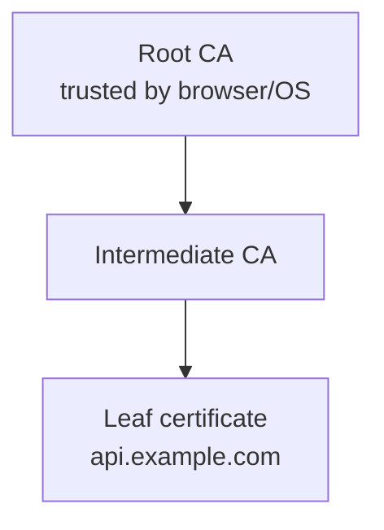
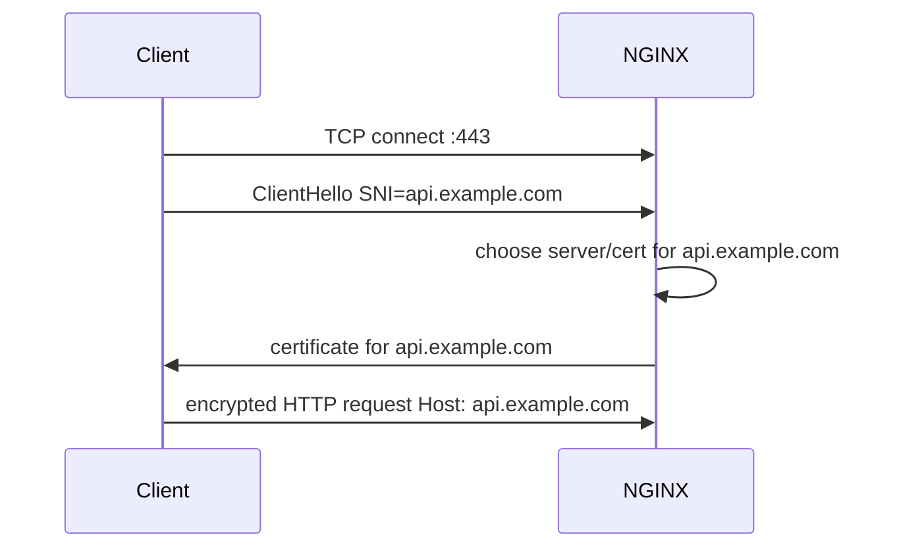

# Part 070 — Certificates, Chain, SNI, and Name-Based HTTPS

Part 069 established the big idea: TLS termination makes NGINX an identity boundary.

This part goes one level lower.

We will build the practical model for:

- what a certificate proves;
- what a certificate chain is;
- what NGINX expects in `ssl_certificate` and `ssl_certificate_key`;
- why SNI is necessary for name-based HTTPS;
- how `server_name`, `listen`, default server, SNI, and Host interact;
- why wildcard and SAN certificates are not the same as SNI;
- how to test and debug real certificate problems.

The goal is to stop treating TLS files as magic files copied from Certbot or a secret manager.

A certificate deployment is correct only when you can prove:

```txt
For hostname H on listener L,
NGINX presents a valid leaf certificate for H,
with the required intermediate chain,
using the intended private key,
under the intended default-server behavior,
and with observable failure modes.
```

## 1. Certificate Basics for NGINX Operators

A public TLS certificate is a signed statement.

Roughly:

```txt
A Certificate Authority says:
"This public key belongs to these DNS names for this validity period."
```

A certificate has fields like:

| Field | Meaning |
|---|---|
| Subject | Historical identity field; not enough for modern hostname validation |
| Subject Alternative Name/SAN | DNS names/IPs the cert is valid for |
| Issuer | CA or intermediate that signed this cert |
| Validity | `notBefore` and `notAfter` dates |
| Public key | Public half of key pair |
| Key usage / EKU | What the cert can be used for |
| Signature | CA signature over certificate data |

For HTTPS hostname validation, SAN is the important field.

Example SAN list:

```txt
DNS:api.example.com
DNS:www.example.com
DNS:*.service.example.com
```

This means the certificate can be accepted for those names, subject to wildcard rules and client validation behavior.

## 2. Leaf, Intermediate, Root

A browser normally does not trust your leaf certificate directly.

It trusts root CAs embedded in the client trust store.

Certificate chain:



NGINX presents the leaf certificate and usually the intermediate certificate(s). The client already has or can validate to the root.

In file terms:

```txt
fullchain.pem = leaf certificate + intermediate certificate(s)
privkey.pem  = private key matching the leaf certificate public key
```

NGINX expects the certificate file to be PEM encoded. If intermediate certificates are included, the primary/leaf certificate should come first, followed by intermediates.

Correct order:

```txt
-----BEGIN CERTIFICATE-----
leaf: api.example.com
-----END CERTIFICATE-----
-----BEGIN CERTIFICATE-----
intermediate CA
-----END CERTIFICATE-----
```

Bad order:

```txt
-----BEGIN CERTIFICATE-----
intermediate CA
-----END CERTIFICATE-----
-----BEGIN CERTIFICATE-----
leaf: api.example.com
-----END CERTIFICATE-----
```

The second may lead to validation problems because the server is not presenting the chain as expected.

## 3. The Two Files NGINX Needs

Minimal HTTPS server:

```nginx
server {
    listen 443 ssl;
    server_name api.example.com;

    ssl_certificate     /etc/nginx/certs/api.example.com/fullchain.pem;
    ssl_certificate_key /etc/nginx/certs/api.example.com/privkey.pem;

    location / {
        proxy_pass http://api_backend;
    }
}
```

The certificate and key must match.

Conceptually:

```txt
certificate contains public key
private key proves control of matching private key
TLS handshake proves server has that private key
```

If they do not match, NGINX will fail to start or reload correctly.

Test match with OpenSSL:

```bash
openssl x509 -noout -modulus -in fullchain.pem | openssl md5
openssl rsa  -noout -modulus -in privkey.pem  | openssl md5
```

For ECDSA keys, modulus is not applicable. A more general check is:

```bash
openssl x509 -in fullchain.pem -noout -pubkey > /tmp/cert.pub
openssl pkey -in privkey.pem -pubout > /tmp/key.pub
diff /tmp/cert.pub /tmp/key.pub
```

No diff means the public key derived from the private key matches the certificate public key.

## 4. Name-Based HTTPS Requires SNI

HTTP virtual hosting uses `Host`.

HTTPS certificate selection must happen before HTTP `Host` is visible.

That is why SNI exists.

SNI lets the client send the intended server name during TLS ClientHello.



Without SNI, NGINX cannot know which certificate to present for multiple hostnames on the same IP:port.

So it presents the default server certificate for that listener.

This is the core name-based HTTPS rule:

```txt
SNI chooses TLS certificate.
Host chooses HTTP virtual host after TLS succeeds.
```

In normal clients, they match. But they are not the same thing.

## 5. `listen`, `default_server`, `server_name`, and Certificate Selection

NGINX first groups servers by listen address/port.

Example:

```nginx
server {
    listen 443 ssl default_server;
    server_name _;
    ssl_reject_handshake on;
}

server {
    listen 443 ssl;
    server_name api.example.com;
    ssl_certificate     /etc/nginx/certs/api/fullchain.pem;
    ssl_certificate_key /etc/nginx/certs/api/privkey.pem;
}

server {
    listen 443 ssl;
    server_name admin.example.com;
    ssl_certificate     /etc/nginx/certs/admin/fullchain.pem;
    ssl_certificate_key /etc/nginx/certs/admin/privkey.pem;
}
```

Behavior:

| Client SNI | Certificate/behavior |
|---|---|
| `api.example.com` | api certificate |
| `admin.example.com` | admin certificate |
| unknown name | default server behavior |
| no SNI | default server behavior |

The default server is a property of the listen address/port, not a magic value of `server_name`.

This means:

```nginx
listen 443 ssl default_server;
```

is what makes a server default for that listener.

This does not:

```nginx
server_name _;
```

The underscore is merely an invalid name convention often used for catch-all readability.

## 6. Why the Default HTTPS Server Matters More Than HTTP

For HTTP:

```txt
wrong default server → wrong response
```

For HTTPS:

```txt
wrong default server → wrong certificate before HTTP exists
```

If the default 443 server uses `www.example.com` certificate, then a no-SNI or unknown-SNI request may receive `www.example.com`.

That can leak domain information and confuse diagnostics.

Safer default:

```nginx
server {
    listen 443 ssl default_server;
    ssl_reject_handshake on;
}
```

If using a version/environment without `ssl_reject_handshake`, use a deliberately boring default certificate and close the request:

```nginx
server {
    listen 443 ssl default_server;
    server_name _;

    ssl_certificate     /etc/nginx/certs/default/fullchain.pem;
    ssl_certificate_key /etc/nginx/certs/default/privkey.pem;

    return 444;
}
```

In a multi-tenant edge platform, the default certificate must not belong to a random tenant.

## 7. SAN Certificate vs Wildcard Certificate vs SNI

These are different concepts.

| Concept | What It Means |
|---|---|
| SAN certificate | One cert lists multiple exact/wildcard names |
| Wildcard certificate | Cert valid for pattern like `*.example.com` |
| SNI | TLS extension telling server which name client wants |
| `server_name` | NGINX config used for virtual server selection |

A SAN certificate can include:

```txt
DNS:example.com
DNS:www.example.com
DNS:api.example.com
```

A wildcard certificate:

```txt
DNS:*.example.com
```

Usually matches:

```txt
www.example.com
api.example.com
```

But not:

```txt
example.com
v1.api.example.com
```

unless those names are also covered by exact SANs or additional wildcard entries.

SNI is not a certificate. SNI is how NGINX knows which certificate to present.

## 8. Several Names, One Certificate

Useful when the same service owns multiple names:

```nginx
server {
    listen 443 ssl;
    server_name example.com www.example.com;

    ssl_certificate     /etc/nginx/certs/example.com/fullchain.pem;
    ssl_certificate_key /etc/nginx/certs/example.com/privkey.pem;

    return 301 https://www.example.com$request_uri;
}
```

The certificate must be valid for both:

```txt
example.com
www.example.com
```

If the cert only covers `www.example.com`, then requests to `https://example.com` fail before redirect can happen.

Important invariant:

```txt
HTTPS redirects require a valid certificate for the source hostname too.
```

You cannot redirect users away from a hostname if the browser refuses the TLS connection first.

## 9. Several Names, Several Certificates

Use separate server blocks when hostnames have separate identity, ownership, or policy.

```nginx
server {
    listen 443 ssl;
    server_name api.example.com;

    ssl_certificate     /etc/nginx/certs/api/fullchain.pem;
    ssl_certificate_key /etc/nginx/certs/api/privkey.pem;

    location / {
        proxy_pass http://api_backend;
    }
}

server {
    listen 443 ssl;
    server_name admin.example.com;

    ssl_certificate     /etc/nginx/certs/admin/fullchain.pem;
    ssl_certificate_key /etc/nginx/certs/admin/privkey.pem;

    location / {
        proxy_pass http://admin_backend;
    }
}
```

This relies on SNI.

For modern clients, this is normal. For old/no-SNI clients, only the default certificate is available.

If you must support clients without SNI for different certificates, you need separate IP addresses or a certificate covering all names.

## 10. RSA and ECDSA Certificates

NGINX can load multiple certificates of different key types for the same virtual server.

Example shape:

```nginx
server {
    listen 443 ssl;
    server_name example.com;

    ssl_certificate     /etc/nginx/certs/example.com/rsa-fullchain.pem;
    ssl_certificate_key /etc/nginx/certs/example.com/rsa-privkey.pem;

    ssl_certificate     /etc/nginx/certs/example.com/ecdsa-fullchain.pem;
    ssl_certificate_key /etc/nginx/certs/example.com/ecdsa-privkey.pem;

    location / {
        proxy_pass http://app;
    }
}
```

The client and TLS library negotiate which certificate/key type works best.

Operationally, this doubles some lifecycle work:

```txt
two certs
two private keys
two renewal paths
two chain validation paths
one hostname identity contract
```

Do not introduce dual-stack RSA/ECDSA unless you also monitor both.

## 11. Variable-Based Certificates

NGINX can use variables in certificate file names in modern versions with suitable OpenSSL support:

```nginx
ssl_certificate     /etc/nginx/certs/$ssl_server_name/fullchain.pem;
ssl_certificate_key /etc/nginx/certs/$ssl_server_name/privkey.pem;
```

This can simplify large multi-tenant deployments, but it changes runtime behavior.

Risks:

- certificate loaded during handshake;
- performance impact if not cached;
- path traversal/tenant registry concerns if names are not constrained;
- missing cert becomes handshake failure;
- secret layout becomes public traffic-dependent;
- operational debugging becomes harder.

If using variable-based certs, pair it with a strict name registry.

Example idea:

```nginx
map $ssl_server_name $cert_dir {
    default "";
    api.example.com   /etc/nginx/certs/api.example.com;
    admin.example.com /etc/nginx/certs/admin.example.com;
}
```

But remember: not every variable is available at every TLS selection phase. Test the exact behavior with your NGINX version. For large dynamic certificate fleets, evaluate whether your platform needs NGINX Plus, njs, external automation, or a different edge architecture.

## 12. Certificate File Layout

A clear production layout:

```txt
/etc/nginx/certs/
  api.example.com/
    fullchain.pem
    privkey.pem
    chain.pem
    cert.pem
    meta.json
  admin.example.com/
    fullchain.pem
    privkey.pem
    chain.pem
    cert.pem
    meta.json
```

`meta.json` is optional but useful for automation:

```json
{
  "hostname": "api.example.com",
  "owner": "platform-api-team",
  "issuer": "letsencrypt-prod",
  "renewal": "certbot-systemd-timer",
  "reload": "nginx-safe-reload",
  "not_after_alert_days": [30, 14, 7, 3, 1]
}
```

Do not mix unrelated tenants in one directory with ad-hoc names.

Bad:

```txt
/etc/nginx/ssl/cert1.pem
/etc/nginx/ssl/new.pem
/etc/nginx/ssl/api-old-final.pem
/etc/nginx/ssl/backup.key
```

That layout guarantees incident confusion.

## 13. Permissions and Secret Hygiene

Certificate file:

```bash
chmod 644 fullchain.pem
```

Private key:

```bash
chmod 600 privkey.pem
chown root:root privkey.pem
```

Do not store private keys in:

- Git repositories;
- Docker images built from shared CI logs;
- world-readable mounted volumes;
- debug bundles;
- unrestricted Kubernetes ConfigMaps;
- application logs;
- generic shared NFS directories.

If using containers, watch out for:

```txt
image layer leakage
secret mount ownership
read-only filesystem compatibility
reload signal path
sidecar renewal race
```

A certificate in a Kubernetes Secret is still a secret. Base64 is encoding, not encryption.

## 14. Chain Validation Tests

From a machine outside the cluster:

```bash
openssl s_client \
  -connect api.example.com:443 \
  -servername api.example.com \
  -showcerts </dev/null
```

Look for:

```txt
Verify return code: 0 (ok)
subject=...
issuer=...
notBefore=...
notAfter=...
```

With `curl`:

```bash
curl -vI https://api.example.com/
```

For forced IP testing:

```bash
curl -vI \
  --resolve api.example.com:443:203.0.113.10 \
  https://api.example.com/
```

This is extremely useful during migration because DNS can remain unchanged while you test the new NGINX endpoint.

## 15. Testing No-SNI and Wrong-SNI Cases

No SNI:

```bash
openssl s_client -connect 203.0.113.10:443 </dev/null
```

Explicit SNI:

```bash
openssl s_client \
  -connect 203.0.113.10:443 \
  -servername api.example.com </dev/null
```

Unknown SNI:

```bash
openssl s_client \
  -connect 203.0.113.10:443 \
  -servername does-not-exist.example.com </dev/null
```

Expected production behavior:

```txt
known SNI -> correct certificate
unknown SNI -> explicit default behavior
no SNI -> explicit default behavior
```

If unknown SNI returns a tenant certificate, fix the default server.

## 16. Host and SNI Mismatch Tests

SNI `api.example.com`, HTTP Host `admin.example.com`:

```bash
curl -vk \
  --resolve api.example.com:443:203.0.113.10 \
  -H 'Host: admin.example.com' \
  https://api.example.com/
```

This can reveal:

- host header confusion;
- origin routing bypass;
- cache poisoning risk;
- wrong canonical redirect;
- tenant boundary issue.

Add log fields:

```nginx
log_format https_debug escape=json
  '{'
    '"ts":"$time_iso8601",'
    '"sni":"$ssl_server_name",'
    '"host":"$host",'
    '"server_name":"$server_name",'
    '"status":$status,'
    '"uri":"$request_uri"'
  '}';
```

Then inspect mismatch traffic.

## 17. Redirects Need Certificates on Both Names

Canonical redirect:

```nginx
server {
    listen 443 ssl;
    server_name example.com;

    ssl_certificate     /etc/nginx/certs/example.com/fullchain.pem;
    ssl_certificate_key /etc/nginx/certs/example.com/privkey.pem;

    return 301 https://www.example.com$request_uri;
}

server {
    listen 443 ssl;
    server_name www.example.com;

    ssl_certificate     /etc/nginx/certs/www.example.com/fullchain.pem;
    ssl_certificate_key /etc/nginx/certs/www.example.com/privkey.pem;

    location / {
        proxy_pass http://web_backend;
    }
}
```

The cert for `example.com` must be valid before the redirect can be sent.

For HTTP to HTTPS redirect:

```nginx
server {
    listen 80;
    server_name example.com www.example.com;
    return 301 https://www.example.com$request_uri;
}
```

No certificate is needed for port 80. But once the user hits `https://example.com`, you still need a valid cert for `example.com` to redirect to `www`.

## 18. Wildcard Certificate Operational Risk

Wildcard certs are convenient:

```txt
*.example.com
```

They also increase blast radius.

If the wildcard private key leaks, every covered subdomain is affected.

Good uses:

- controlled internal platform subdomains;
- ephemeral preview environments under one domain;
- wildcard tenant edge with strict governance;
- private service discovery with internal CA.

Bad uses:

- unrelated product domains;
- cross-team ownership with no audit;
- admin and public services sharing one wildcard key;
- cert copied manually across many hosts;
- no inventory of where the private key exists.

A wildcard certificate is not a substitute for hostname ownership.

## 19. SAN Certificate Operational Risk

SAN certs reduce the number of cert files but couple identities.

Example:

```txt
api.example.com
admin.example.com
billing.example.com
```

One cert renewal failure affects all names.
One private key compromise affects all names.
One ownership change affects all names.

Use SAN certs when the names share:

- owner;
- lifecycle;
- deployment platform;
- security level;
- revocation policy.

Avoid SAN certs for unrelated services merely to reduce file count.

## 20. Certificate Rotation Without Outage

A safe rotation workflow:

```txt
1. Obtain new cert/key in staging path.
2. Validate key matches cert.
3. Validate full chain locally.
4. Atomically update symlink or mounted secret version.
5. Run nginx -t.
6. Reload NGINX.
7. Verify externally with openssl/curl.
8. Monitor error logs and TLS handshake failures.
9. Keep previous cert temporarily if rollback is needed.
```

Example symlink layout:

```txt
/etc/nginx/certs/api.example.com/current -> /etc/nginx/certs/api.example.com/2026-07-07-a/
```

NGINX config points to:

```nginx
ssl_certificate     /etc/nginx/certs/api.example.com/current/fullchain.pem;
ssl_certificate_key /etc/nginx/certs/api.example.com/current/privkey.pem;
```

Rotation changes symlink, then reloads.

Rollback changes symlink back, then reloads.

Never replace a cert file while another process may read a partially written file. Write new files to a new directory, then atomically switch.

## 21. Expiry Monitoring

Expiry should be monitored from at least two perspectives.

### File-level check

```bash
openssl x509 -in /etc/nginx/certs/api.example.com/fullchain.pem -noout -enddate
```

### Network-level check

```bash
echo | openssl s_client \
  -connect api.example.com:443 \
  -servername api.example.com 2>/dev/null \
  | openssl x509 -noout -enddate
```

File-level check answers:

```txt
What is on disk?
```

Network-level check answers:

```txt
What does the client actually receive?
```

You need both because renewal can succeed but reload can fail.

## 22. Common Error Messages and What They Mean

| Symptom/Error | Meaning | Fix |
|---|---|---|
| `PEM_read_bio_X509_AUX failed` | malformed certificate file | inspect PEM format/order |
| `key values mismatch` | private key does not match cert | deploy matching key |
| browser name mismatch | cert SAN does not cover hostname | issue correct cert |
| incomplete chain warning | missing intermediate cert | use fullchain in `ssl_certificate` |
| unknown SNI gets real tenant cert | default server drift | explicit default 443 reject |
| redirect cannot happen | cert invalid on source name | issue cert for source hostname |
| works with curl `-k` only | validation problem hidden by insecure flag | fix trust/name/chain |
| renewal succeeded but old cert served | NGINX not reloaded or wrong path | safe reload + network check |

## 23. Name-Based HTTPS Configuration Pattern

A solid multi-host pattern:

```nginx
# Shared TLS listener policy. Harden further in Part 071.
ssl_protocols TLSv1.2 TLSv1.3;
ssl_session_cache shared:SSL:50m;
ssl_session_timeout 1d;

server {
    listen 443 ssl default_server;
    ssl_reject_handshake on;
}

server {
    listen 443 ssl;
    server_name api.example.com;

    ssl_certificate     /etc/nginx/certs/api.example.com/fullchain.pem;
    ssl_certificate_key /etc/nginx/certs/api.example.com/privkey.pem;

    location / {
        proxy_pass http://api_backend;
        proxy_set_header Host $host;
        proxy_set_header X-Forwarded-Proto https;
    }
}

server {
    listen 443 ssl;
    server_name web.example.com www.example.com;

    ssl_certificate     /etc/nginx/certs/web.example.com/fullchain.pem;
    ssl_certificate_key /etc/nginx/certs/web.example.com/privkey.pem;

    location / {
        root /srv/web/current;
        try_files $uri $uri/ /index.html;
    }
}
```

Invariants:

```txt
Every declared server_name is covered by its certificate SAN.
Every public 443 listener has an explicit default.
Every source hostname used in HTTPS redirect has a valid cert.
Every certificate path has an owner and renewal workflow.
```

## 24. Internal CA and Private PKI

For internal services, certificates may be issued by an internal CA.

Use cases:

- NGINX to upstream TLS verification;
- internal admin UI;
- partner API mTLS;
- Kubernetes service-to-ingress private trust;
- corporate device/client certificate auth.

Key distinction:

```txt
Public browser trust store trusts public CAs.
Internal services trust your internal CA only if configured to do so.
```

For NGINX verifying upstream:

```nginx
proxy_ssl_verify on;
proxy_ssl_trusted_certificate /etc/nginx/trust/internal-ca.pem;
proxy_ssl_name api.internal.example.com;
proxy_ssl_server_name on;
```

For NGINX verifying client certs:

```nginx
ssl_client_certificate /etc/nginx/trust/client-ca-bundle.pem;
ssl_verify_client on;
ssl_verify_depth 2;
```

Do not mix public web server chain files with client CA trust bundles casually. They serve different directions of trust.

## 25. Certificate Chain vs Trusted Certificate

`ssl_certificate` is what NGINX presents to clients.

```nginx
ssl_certificate /etc/nginx/certs/api/fullchain.pem;
```

`ssl_trusted_certificate` is a trust store NGINX uses for verifying OCSP responses or client certificate chains.

```nginx
ssl_trusted_certificate /etc/nginx/trust/ca-bundle.pem;
```

Do not confuse them.

A server certificate chain says:

```txt
Here is my identity and intermediates for clients to validate me.
```

A trusted CA bundle says:

```txt
Here are CAs I trust for validation tasks.
```

## 26. Large Multi-Tenant HTTPS

For many hostnames, you have options.

### Option A — Generated Static Server Blocks

Generate one server block per tenant/hostname.

Pros:

- explicit;
- easy to reason about;
- works with standard SNI;
- good audit trail;
- `nginx -T` shows real config.

Cons:

- large config;
- reload pressure;
- hash tuning may be needed;
- cert lifecycle still external.

### Option B — Shared SAN/Wildcard Cert

One or fewer certs cover many names.

Pros:

- less certificate overhead;
- simple NGINX config;
- good for controlled subdomain platforms.

Cons:

- larger blast radius;
- ownership coupling;
- hard to revoke one tenant independently;
- wildcard constraints.

### Option C — Variable-Based Certificate Loading

Dynamic cert path from SNI.

Pros:

- compact config;
- flexible dynamic platforms.

Cons:

- handshake-time loading;
- version/library constraints;
- performance/caching considerations;
- stronger registry/safety needed;
- operational complexity.

Decision invariant:

```txt
Choose the certificate model based on ownership and blast radius, not only convenience.
```

## 27. CI Checks for Certificate Config

A useful CI job should validate:

```txt
[ ] nginx -t passes.
[ ] Every server_name has a certificate mapping.
[ ] Certificate SAN covers every server_name in that server block.
[ ] Key matches certificate.
[ ] fullchain includes intermediate(s).
[ ] private key permissions are not world-readable.
[ ] default 443 server exists per listener.
[ ] no unrelated domains share cert unexpectedly.
[ ] cert expiry threshold is acceptable.
[ ] generated config has no duplicate/default conflicts.
```

A simple SAN check:

```bash
openssl x509 -in fullchain.pem -noout -text | grep -A1 'Subject Alternative Name'
```

A simple expiry check:

```bash
openssl x509 -checkend $((30 * 24 * 3600)) -noout -in fullchain.pem
```

Exit code indicates whether the cert is valid for at least 30 more days.

## 28. Debugging Playbook

### Case 1 — User sees wrong certificate

Check:

```bash
openssl s_client -connect IP:443 -servername expected.example.com </dev/null
```

Then inspect:

```bash
nginx -T | grep -nE 'listen 443|server_name|ssl_certificate'
```

Likely causes:

- wrong `server_name`;
- missing SNI;
- duplicate listener/default conflict;
- wrong cert path;
- config not reloaded;
- CDN/LB connecting to different origin.

### Case 2 — Certificate valid on disk but old cert served

Check NGINX process config:

```bash
nginx -T | grep -n 'ssl_certificate'
```

Check network:

```bash
echo | openssl s_client -connect api.example.com:443 -servername api.example.com 2>/dev/null \
  | openssl x509 -noout -serial -issuer -subject -enddate
```

Likely causes:

- reload failed;
- wrong symlink;
- multiple NGINX instances;
- load balancer still points to old node;
- certificate updated in secret store but not mounted/reloaded.

### Case 3 — Incomplete chain

Check served chain:

```bash
openssl s_client -connect api.example.com:443 -servername api.example.com -showcerts </dev/null
```

Fix:

```txt
Use fullchain.pem in ssl_certificate, not leaf-only cert.pem.
```

### Case 4 — Redirect source cert missing

Symptom:

```txt
https://example.com fails before redirecting to https://www.example.com
```

Fix:

```txt
Issue certificate covering example.com, then send redirect.
```

## 29. Production Review Checklist

```txt
[ ] Every public hostname has an owner.
[ ] Every public hostname is covered by a SAN/wildcard intentionally.
[ ] Source names for redirects have valid certificates.
[ ] Fullchain order is leaf first, then intermediates.
[ ] Private key matches leaf certificate.
[ ] Private key permissions are restricted.
[ ] Default HTTPS server is explicit for each listen socket.
[ ] Unknown/no-SNI behavior is tested.
[ ] SNI/Host mismatch behavior is understood.
[ ] Certificate rotation uses atomic update + nginx -t + reload.
[ ] Expiry is monitored from disk and network perspective.
[ ] Wildcard/SAN blast radius is documented.
[ ] Internal CA trust bundles are separated from presented chains.
[ ] mTLS client CA bundles include only intended issuers.
```

## 30. Key Takeaways

- `ssl_certificate` should present the leaf certificate followed by intermediate certificates when needed.
- `ssl_certificate_key` must match the leaf certificate public key.
- SNI is how NGINX chooses a certificate before HTTP exists.
- `Host` is not available until after TLS succeeds.
- The default 443 server controls unknown/no-SNI behavior.
- Wildcard/SAN certs solve name coverage, not hostname ownership.
- HTTPS redirects require valid certificates for the source names.
- Cert rotation must be testable, atomic, reload-safe, and externally verified.

## 31. What Comes Next

Now that certificate mechanics are clear, the next part tightens transport policy:

```txt
Part 071 — Modern TLS Configuration: Protocols, Ciphers, Session Reuse
```

That part will cover:

```txt
TLS versions
cipher strategy
session cache and tickets
performance versus security trade-offs
version-specific defaults
safe rollout and testing
```

## 32. References

- NGINX Configuring HTTPS Servers: `https://nginx.org/en/docs/http/configuring_https_servers.html`
- NGINX `ngx_http_ssl_module`: `https://nginx.org/en/docs/http/ngx_http_ssl_module.html`
- NGINX Server Names: `https://nginx.org/en/docs/http/server_names.html`
- NGINX How Request Processing Works: `https://nginx.org/en/docs/http/request_processing.html`
- NGINX `ngx_http_proxy_module`: `https://nginx.org/en/docs/http/ngx_http_proxy_module.html`
