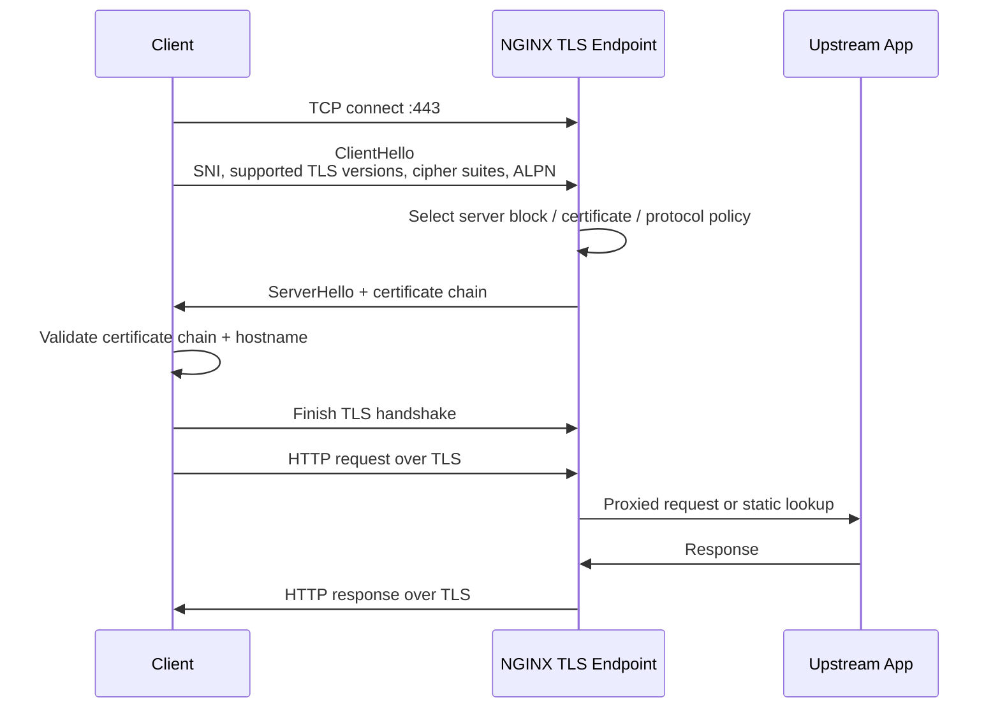
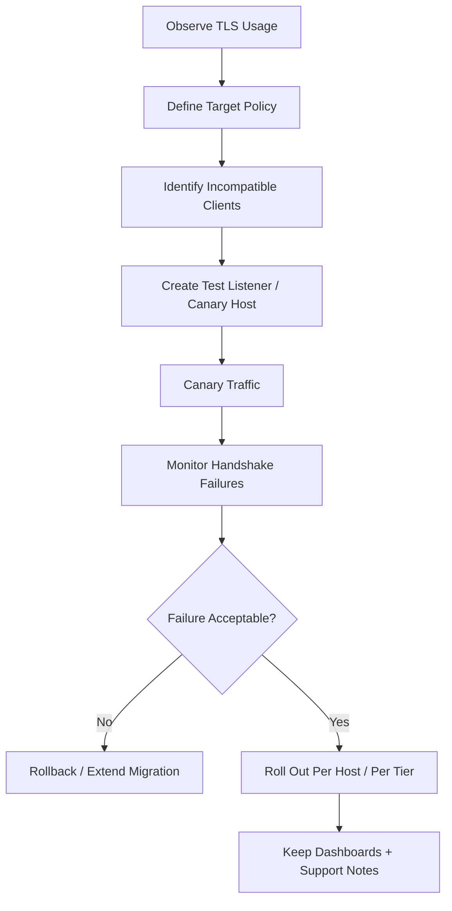

# Part 071 — Modern TLS Configuration

Part 069 explained TLS termination as a trust boundary.

Part 070 explained certificates, chains, SNI, and name-based HTTPS.

This part answers the next production question:

```txt
Once NGINX has the right certificate, how should the TLS endpoint behave?
```

A modern TLS configuration is not just a list of ciphers copied from a blog post.

It is a compatibility contract between:

- clients you support;
- security posture you require;
- OpenSSL version available to NGINX;
- NGINX build/version;
- TLS protocol version;
- certificate algorithm;
- session reuse behavior;
- operational rollback requirements.

The goal is not to chase a badge.

The goal is to make the edge endpoint:

```txt
secure enough,
compatible enough,
observable enough,
and safe to change under production traffic.
```

## 1. The TLS Endpoint as a State Machine

A client does not start with HTTP.

For HTTPS, the client first negotiates TLS.

Only after that can HTTP/1.1, HTTP/2, or HTTP/3 semantics matter.



A TLS failure can happen before NGINX has an HTTP request.

That matters because many debugging instincts are HTTP-centric.

If a client fails during TLS negotiation, you may not see:

- URI;
- method;
- request body;
- application route;
- upstream status.

You mostly have:

- IP address;
- SNI if available;
- TLS version/cipher if negotiated;
- error log details;
- packet-level or client-side error.

## 2. What “Modern” Means in Practice

A modern NGINX TLS configuration usually means:

```txt
TLS 1.2 and TLS 1.3 enabled,
legacy SSL/TLS versions disabled,
weak cipher suites excluded,
forward secrecy supported,
session reuse configured deliberately,
certificate chain correct,
and HTTP/2/ALPN behavior understood.
```

For public browser-facing systems, the most common baseline is **intermediate compatibility**:

```txt
Support modern clients.
Reject obsolete clients.
Avoid breaking normal browsers, mobile clients, CLI clients, and service integrations.
```

A stricter **modern-only** baseline may use TLS 1.3 only, but that is a product decision, not a default production truth.

Ask this before choosing TLS 1.3 only:

```txt
Can we prove all required clients support TLS 1.3?
Can we break old Android clients, embedded clients, proxies, corporate TLS interceptors, or legacy JVMs?
Can support and incident response handle those failures?
```

Most production systems should start with:

```nginx
ssl_protocols TLSv1.2 TLSv1.3;
```

Then tighten based on measured client compatibility.

## 3. NGINX Defaults Are Not Eternal Policy

NGINX documentation states that `ssl_protocols` and `ssl_ciphers` can be used to limit connections to strong protocol versions and cipher suites. Modern NGINX defaults include `TLSv1.2 TLSv1.3` for `ssl_protocols` and `HIGH:!aNULL:!MD5` for `ssl_ciphers`, but the documentation also warns that defaults have changed several times.

That means two things:

```txt
Do not assume an old fleet has current defaults.
Do not blindly override current defaults with stale internet snippets.
```

A defensive engineering team records its TLS policy explicitly.

Not because every directive must be customized, but because every endpoint should have a reviewable contract.

Example policy statement:

```txt
Public browser-facing HTTPS endpoints support TLS 1.2 and TLS 1.3.
TLS 1.0 and TLS 1.1 are not supported.
TLS 1.2 ciphers must provide forward secrecy and AEAD where possible.
TLS 1.3 ciphers are controlled by OpenSSL and are not configured through ssl_ciphers.
Session tickets are disabled unless ticket key rotation is implemented.
0-RTT early data is disabled by default.
```

## 4. Minimal Strong HTTPS Server

A reasonable production baseline looks like this:

```nginx
server {
    listen 443 ssl http2;
    server_name app.example.com;

    ssl_certificate     /etc/nginx/certs/app.example.com/fullchain.pem;
    ssl_certificate_key /etc/nginx/certs/app.example.com/privkey.pem;

    ssl_protocols TLSv1.2 TLSv1.3;

    # TLS 1.2 only. TLS 1.3 ciphers are configured differently by OpenSSL.
    ssl_ciphers 'ECDHE-ECDSA-AES128-GCM-SHA256:ECDHE-RSA-AES128-GCM-SHA256:ECDHE-ECDSA-AES256-GCM-SHA384:ECDHE-RSA-AES256-GCM-SHA384:ECDHE-ECDSA-CHACHA20-POLY1305:ECDHE-RSA-CHACHA20-POLY1305';

    ssl_prefer_server_ciphers off;

    ssl_session_cache shared:TLS:50m;
    ssl_session_timeout 1d;
    ssl_session_tickets off;

    location / {
        proxy_pass http://app_upstream;
    }
}
```

This is not the only correct configuration.

It is a baseline with explicit reasoning.

Important boundaries:

- `ssl_ciphers` affects TLS 1.2 and below, not TLS 1.3 in the same way.
- `ssl_prefer_server_ciphers` is mainly relevant when the server can choose among TLS 1.2 cipher suites.
- `ssl_session_tickets off` avoids long-lived ticket key exposure when you do not have ticket key rotation.
- `http2` changes application-layer protocol negotiation, not TLS security by itself.

## 5. Protocol Versions

The directive:

```nginx
ssl_protocols TLSv1.2 TLSv1.3;
```

means the endpoint accepts TLS 1.2 and TLS 1.3.

It rejects old protocols such as:

- SSLv2;
- SSLv3;
- TLS 1.0;
- TLS 1.1.

The practical reason is not only cryptographic purity.

Old protocols create operational drag:

```txt
old protocol support
→ old ciphers remain necessary
→ old clients remain invisible in compatibility planning
→ security exception becomes permanent
→ incident response has weaker assumptions
```

For internal systems, do not assume the answer is automatically stricter.

Many internal systems are worse than public systems because they are full of:

- old JVMs;
- embedded agents;
- monitoring probes;
- corporate middleboxes;
- backup appliances;
- vendor integrations.

The right process is:

```txt
1. Log current TLS usage.
2. Identify clients using obsolete versions.
3. Contact owners.
4. Provide deadline.
5. Canary reject old protocols.
6. Enforce.
```

## 6. Cipher Suites: TLS 1.2 vs TLS 1.3

TLS cipher configuration is often misunderstood because TLS 1.2 and TLS 1.3 behave differently.

### TLS 1.2

TLS 1.2 cipher suites encode several decisions:

```txt
key exchange + authentication + bulk encryption + integrity
```

Example:

```txt
ECDHE-RSA-AES128-GCM-SHA256
```

This roughly means:

```txt
ECDHE      -> ephemeral elliptic curve Diffie-Hellman key exchange
RSA        -> RSA certificate authentication
AES128-GCM -> AEAD encryption mode
SHA256     -> handshake hash / PRF component
```

Prefer cipher suites with:

- forward secrecy;
- AEAD encryption;
- no static RSA key exchange;
- no CBC if avoidable;
- no RC4/3DES/EXPORT/NULL/anonymous suites.

### TLS 1.3

TLS 1.3 simplified cipher suite semantics.

Key exchange and authentication are separated from cipher suite names.

A TLS 1.3 suite such as:

```txt
TLS_AES_128_GCM_SHA256
```

does not encode certificate authentication the way TLS 1.2 cipher suites did.

Operational implication:

```txt
Do not assume ssl_ciphers fully controls TLS 1.3 behavior.
```

TLS 1.3 behavior depends on the OpenSSL library and related settings available to your NGINX build.

## 7. Certificate Algorithm and Cipher Compatibility

Your certificate type affects which clients and cipher suites can authenticate the server.

Common certificate key types:

- RSA;
- ECDSA;
- sometimes EdDSA depending on ecosystem support.

For broad compatibility, many public sites serve both RSA and ECDSA certificates.

NGINX supports multiple certificate/key pairs in one server block:

```nginx
server {
    listen 443 ssl http2;
    server_name app.example.com;

    ssl_certificate     /etc/nginx/certs/app.example.com/ecdsa-fullchain.pem;
    ssl_certificate_key /etc/nginx/certs/app.example.com/ecdsa-privkey.pem;

    ssl_certificate     /etc/nginx/certs/app.example.com/rsa-fullchain.pem;
    ssl_certificate_key /etc/nginx/certs/app.example.com/rsa-privkey.pem;

    ssl_protocols TLSv1.2 TLSv1.3;
}
```

This lets capable clients use ECDSA while RSA remains available for compatibility.

But do not add multiple certificates blindly.

Check:

```txt
Does certificate automation renew both?
Does monitoring check both?
Does reload fail if one key is missing?
Does the server present the expected certificate per client capability?
```

## 8. `ssl_prefer_server_ciphers`

The directive:

```nginx
ssl_prefer_server_ciphers off;
```

lets the client preference matter when multiple secure cipher suites are available.

Historically, many hardening guides used:

```nginx
ssl_prefer_server_ciphers on;
```

That was useful when servers needed to force clients away from weak choices.

In a modern configuration where all allowed suites are acceptable, `off` is often reasonable because clients may choose the best-performing secure option for their hardware.

The invariant is:

```txt
Do not depend on preference ordering to save you from weak ciphers.
Remove weak ciphers from the allowed set.
```

## 9. Elliptic Curves

Depending on NGINX/OpenSSL versions, you may see configurations like:

```nginx
ssl_ecdh_curve X25519:prime256v1:secp384r1;
```

This controls supported curves for ECDHE.

Be careful with curve tuning.

Over-tuning can create compatibility failures that are hard to diagnose from application logs.

Practical guidance:

```txt
Prefer sane generated baselines.
Avoid curve lists copied from old posts.
Test with real clients.
Log TLS version and cipher before and after changes.
```

## 10. Session Reuse Mental Model

A full TLS handshake costs more than a resumed handshake.

Session reuse helps reduce:

- CPU cost;
- handshake latency;
- backend-less edge overhead;
- connection establishment cost for clients that reconnect often.

NGINX has two main mechanisms:

```txt
session ID cache
session tickets
```

### Session ID Cache

```nginx
ssl_session_cache shared:TLS:50m;
ssl_session_timeout 1d;
```

The shared cache lets worker processes reuse session data.

Sizing rule of thumb:

```txt
If you terminate lots of TLS connections, configure a shared session cache explicitly.
If you run multiple NGINX instances behind another load balancer, reuse is per instance unless ticket keys are shared/rotated deliberately.
```

### Session Tickets

Session tickets move session state to the client, encrypted with a server-side ticket key.

They scale nicely.

But they introduce key-management risk.

If a ticket key leaks, previously issued tickets can be abused depending on the protocol/version and lifetime.

The safest default without rotation machinery is:

```nginx
ssl_session_tickets off;
```

If you enable tickets, you need:

```txt
explicit ticket key files,
rotation procedure,
overlap window,
secret storage,
fleet-wide distribution,
rollback behavior,
and incident response if keys leak.
```

## 11. Ticket Key Rotation Pattern

For large fleets where session tickets are needed, use a controlled rotation model.

Conceptually:

```txt
current key    -> used to encrypt new tickets
previous key   -> accepted for resumption
old key        -> removed after overlap window
```

NGINX supports specifying ticket key files:

```nginx
ssl_session_tickets on;
ssl_session_ticket_key /etc/nginx/tls-tickets/current.key;
ssl_session_ticket_key /etc/nginx/tls-tickets/previous.key;
```

Operational invariant:

```txt
All instances behind the same traffic distribution layer must agree on ticket keys if session resumption is expected across instances.
```

Otherwise, resumed handshakes fail and clients perform full handshakes.

That is usually safe but may increase CPU and latency.

## 12. 0-RTT Early Data

TLS 1.3 supports early data, also called 0-RTT.

It can reduce latency for resumed connections.

But it has replay risk.

That means a request sent as early data may be replayed by an attacker under some conditions.

For most application endpoints:

```nginx
ssl_early_data off;
```

If you enable it, restrict it to safe idempotent operations and pass explicit context upstream.

Example defensive pattern:

```nginx
ssl_early_data on;

proxy_set_header Early-Data $ssl_early_data;

map $ssl_early_data $reject_early_data {
    1 1;
    default 0;
}

location /api/write/ {
    if ($reject_early_data) {
        return 425;
    }

    proxy_pass http://app_upstream;
}
```

The better baseline is simple:

```txt
Do not enable 0-RTT unless you have a formal replay-safety design.
```

## 13. TLS and HTTP/2

The directive:

```nginx
listen 443 ssl http2;
```

enables HTTP/2 negotiation over TLS for that listener.

HTTP/2 is selected through ALPN during TLS handshake.

Important distinction:

```txt
TLS version/cipher controls transport security.
ALPN selects application protocol over that secure channel.
```

You can have:

```txt
TLS 1.3 + HTTP/2
TLS 1.3 + HTTP/1.1
TLS 1.2 + HTTP/2
TLS 1.2 + HTTP/1.1
```

Do not debug HTTP/2 as if it is a separate port unless you deliberately configured it that way.

## 14. TLS Buffer Size

NGINX has `ssl_buffer_size`.

Large buffers can improve throughput for large responses.

Smaller buffers can reduce time to first byte for small responses.

Example:

```nginx
ssl_buffer_size 4k;
```

Do not set this globally because a benchmark said so.

Think by response profile:

```txt
small HTML/API responses     -> smaller buffer may improve perceived latency
large file downloads         -> default/larger buffer may be fine
high concurrency edge        -> memory impact matters
```

The performance question is always:

```txt
What response sizes dominate this listener?
```

## 15. Logging TLS Version and Cipher

You cannot safely change TLS policy if you cannot see current TLS usage.

Add TLS fields to access logs:

```nginx
log_format edge_json escape=json
  '{'
    '"ts":"$time_iso8601",'
    '"remote_addr":"$remote_addr",'
    '"host":"$host",'
    '"request":"$request",'
    '"status":$status,'
    '"body_bytes_sent":$body_bytes_sent,'
    '"request_time":$request_time,'
    '"tls_protocol":"$ssl_protocol",'
    '"tls_cipher":"$ssl_cipher",'
    '"ssl_server_name":"$ssl_server_name",'
    '"http2":"$http2",'
    '"upstream_addr":"$upstream_addr",'
    '"upstream_status":"$upstream_status",'
    '"upstream_response_time":"$upstream_response_time"'
  '}';

access_log /var/log/nginx/access.json edge_json;
```

Then answer questions like:

```txt
How many requests still use TLS 1.2?
Do any clients use obsolete protocols?
Which hosts see RSA vs ECDSA ciphers?
Did a deploy change cipher distribution?
Do errors correlate with SNI or TLS version?
```

## 16. Compatibility Discovery

Before tightening TLS policy, observe.

Example shell analysis:

```bash
jq -r '.tls_protocol' /var/log/nginx/access.json \
  | sort \
  | uniq -c \
  | sort -nr

jq -r '[.host, .tls_protocol, .tls_cipher] | @tsv' /var/log/nginx/access.json \
  | sort \
  | uniq -c \
  | sort -nr \
  | head -50
```

For a public site, also classify by user agent if you log it.

For API clients, classify by:

- partner;
- API key;
- mTLS subject;
- source IP;
- route;
- service account.

The real migration blocker is rarely “TLS 1.0 exists”.

It is usually:

```txt
Nobody knows who owns the client using TLS 1.0.
```

## 17. Safe Rollout Strategy

Do not deploy TLS hardening as a surprise global change.

Use a rollout pipeline.



A safe migration has:

```txt
compatibility evidence,
owner notification,
rollback config,
error log monitoring,
access log TLS fields,
synthetic tests,
and incident playbook.
```

## 18. Testing with `openssl s_client`

Test certificate, SNI, protocol, and ALPN.

```bash
openssl s_client \
  -connect app.example.com:443 \
  -servername app.example.com \
  -showcerts \
  -alpn h2,http/1.1
```

Test TLS 1.2:

```bash
openssl s_client \
  -connect app.example.com:443 \
  -servername app.example.com \
  -tls1_2
```

Test TLS 1.3:

```bash
openssl s_client \
  -connect app.example.com:443 \
  -servername app.example.com \
  -tls1_3
```

A failed TLS 1.0 test should fail:

```bash
openssl s_client \
  -connect app.example.com:443 \
  -servername app.example.com \
  -tls1
```

Expected result:

```txt
Handshake fails because TLS 1.0 is not supported.
```

## 19. Testing with `curl`

```bash
curl -Iv --tlsv1.2 --tls-max 1.2 https://app.example.com/

curl -Iv --tlsv1.3 --tls-max 1.3 https://app.example.com/

curl -Iv --http2 https://app.example.com/

curl -Iv --http1.1 https://app.example.com/
```

Look for:

```txt
SSL connection using TLSv1.3 / TLSv1.2
ALPN: server accepted h2
certificate subject/SAN
issuer
HTTP status
redirect behavior
```

## 20. Bad Configuration: Badge-Driven TLS

Bad:

```nginx
ssl_protocols TLSv1.3;
ssl_ciphers HIGH:!aNULL:!MD5;
ssl_session_tickets on;
```

Why bad?

- TLS 1.3 only may break clients without evidence.
- `ssl_ciphers` does not define TLS 1.3 cipher policy as many engineers expect.
- Tickets are enabled without key rotation.
- No logging fields are present.
- No compatibility plan is visible.

A better version:

```nginx
ssl_protocols TLSv1.2 TLSv1.3;
ssl_ciphers 'ECDHE-ECDSA-AES128-GCM-SHA256:ECDHE-RSA-AES128-GCM-SHA256:ECDHE-ECDSA-AES256-GCM-SHA384:ECDHE-RSA-AES256-GCM-SHA384:ECDHE-ECDSA-CHACHA20-POLY1305:ECDHE-RSA-CHACHA20-POLY1305';
ssl_prefer_server_ciphers off;
ssl_session_cache shared:TLS:50m;
ssl_session_timeout 1d;
ssl_session_tickets off;
```

Plus an explicit migration document:

```txt
We will move selected admin-only endpoints to TLS 1.3-only after 30 days of client telemetry.
Public API endpoints remain TLS 1.2+ until partner compatibility is proven.
```

## 21. NGINX Includes for TLS Policy

Do not paste TLS policy into every `server` block.

Create a shared snippet.

```nginx
# /etc/nginx/snippets/tls-policy-intermediate.conf
ssl_protocols TLSv1.2 TLSv1.3;
ssl_ciphers 'ECDHE-ECDSA-AES128-GCM-SHA256:ECDHE-RSA-AES128-GCM-SHA256:ECDHE-ECDSA-AES256-GCM-SHA384:ECDHE-RSA-AES256-GCM-SHA384:ECDHE-ECDSA-CHACHA20-POLY1305:ECDHE-RSA-CHACHA20-POLY1305';
ssl_prefer_server_ciphers off;

ssl_session_cache shared:TLS:50m;
ssl_session_timeout 1d;
ssl_session_tickets off;
```

Use it:

```nginx
server {
    listen 443 ssl http2;
    server_name app.example.com;

    ssl_certificate     /etc/nginx/certs/app.example.com/fullchain.pem;
    ssl_certificate_key /etc/nginx/certs/app.example.com/privkey.pem;

    include snippets/tls-policy-intermediate.conf;

    location / {
        proxy_pass http://app_upstream;
    }
}
```

Benefits:

- one policy file;
- easier review;
- easier rollback;
- consistent behavior;
- safer audit.

## 22. Different Policies for Different Host Classes

Not all hosts need the same compatibility.

Example:

```txt
public-web     -> TLS 1.2 + TLS 1.3
public-api     -> TLS 1.2 + TLS 1.3 until partners prove TLS 1.3
admin          -> TLS 1.3 only + mTLS/VPN/IP allowlist
internal       -> TLS 1.2 + TLS 1.3 unless legacy agents exist
machine-only   -> stronger policy possible if client fleet controlled
```

Represent this explicitly:

```nginx
include snippets/tls-policy-public.conf;
# or
include snippets/tls-policy-admin-strict.conf;
```

Avoid hidden policy drift.

## 23. Error Patterns

### `ERR_SSL_VERSION_OR_CIPHER_MISMATCH`

Likely causes:

- client supports no enabled protocol;
- cipher overlap missing;
- SNI/default server mismatch;
- old TLS middlebox;
- certificate/key mismatch may surface differently.

### `no shared cipher`

Likely causes:

- TLS 1.2 cipher set too narrow;
- client only supports obsolete ciphers;
- certificate algorithm mismatch;
- OpenSSL build lacks required algorithms.

### `sslv3 alert handshake failure`

Despite the name, this can appear for modern TLS too.

Do not assume SSLv3 was used.

Read surrounding error log and reproduce with `openssl s_client`.

## 24. TLS Change Review Checklist

Before merging a TLS config change, answer:

```txt
[ ] Which host class is affected?
[ ] Which protocols are enabled before and after?
[ ] Which ciphers are enabled before and after?
[ ] Are session tickets disabled or rotated?
[ ] Is 0-RTT disabled unless explicitly justified?
[ ] Are TLS version/cipher/SNI logged?
[ ] Are TLS 1.2 and TLS 1.3 smoke tests present?
[ ] Is a rollback config available?
[ ] Are expected incompatible clients known?
[ ] Are certificate files still valid after reload test?
[ ] Did `nginx -t` pass?
[ ] Was staging tested with real client libraries?
```

## 25. Practical Baseline Config

A complete baseline snippet:

```nginx
# /etc/nginx/snippets/tls-modern-baseline.conf

ssl_protocols TLSv1.2 TLSv1.3;

# TLS 1.2 ciphers. Keep this generated/reviewed, not hand-invented.
ssl_ciphers 'ECDHE-ECDSA-AES128-GCM-SHA256:ECDHE-RSA-AES128-GCM-SHA256:ECDHE-ECDSA-AES256-GCM-SHA384:ECDHE-RSA-AES256-GCM-SHA384:ECDHE-ECDSA-CHACHA20-POLY1305:ECDHE-RSA-CHACHA20-POLY1305';
ssl_prefer_server_ciphers off;

# Session reuse.
ssl_session_cache shared:TLS:50m;
ssl_session_timeout 1d;

# Safer default unless ticket key rotation exists.
ssl_session_tickets off;

# Optional tuning. Validate against your OpenSSL version/client support.
# ssl_ecdh_curve X25519:prime256v1:secp384r1;

# Disable TLS 1.3 early data by default.
ssl_early_data off;
```

Use with:

```nginx
server {
    listen 443 ssl http2;
    server_name app.example.com;

    ssl_certificate     /etc/nginx/certs/app.example.com/fullchain.pem;
    ssl_certificate_key /etc/nginx/certs/app.example.com/privkey.pem;

    include snippets/tls-modern-baseline.conf;

    location / {
        proxy_pass http://app_upstream;
    }
}
```

## 26. What Senior Engineers Watch For

Senior engineers do not ask only:

```txt
Is TLS enabled?
```

They ask:

```txt
Can we explain the protocol policy?
Can we prove compatibility?
Can we observe usage?
Can we roll back?
Can we rotate keys?
Can we handle certificate renewal failure?
Can we avoid replay risk?
Can we separate public, admin, and machine endpoint policies?
```

That is the difference between TLS config and TLS operations.

## 27. References

- NGINX `ngx_http_ssl_module`: https://nginx.org/en/docs/http/ngx_http_ssl_module.html
- NGINX HTTPS server configuration guide: https://nginx.org/en/docs/http/configuring_https_servers.html
- Mozilla SSL Configuration Generator: https://ssl-config.mozilla.org/
- Mozilla SSL Config Generator source/project note: https://github.com/mozilla/ssl-config-generator

## 28. Key Takeaways

- Modern TLS is a compatibility and operations contract, not only a cipher list.
- For most public production systems, TLS 1.2 + TLS 1.3 is the pragmatic baseline.
- TLS 1.3-only is valid only when client compatibility is proven.
- `ssl_ciphers` mainly governs TLS 1.2-style cipher configuration.
- Session tickets should be disabled unless ticket key rotation exists.
- 0-RTT early data should stay disabled unless replay risk is formally handled.
- Log `$ssl_protocol`, `$ssl_cipher`, and `$ssl_server_name` before changing TLS policy.
- Treat TLS hardening as a staged rollout with telemetry and rollback.
