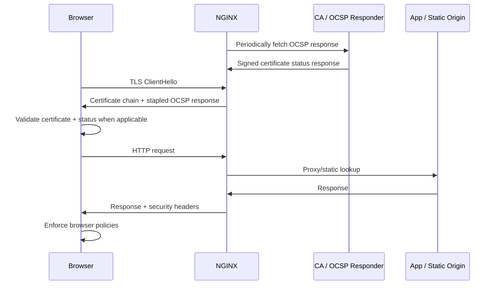

# Part 072 — OCSP Stapling, HSTS, and Security Headers

Part 071 focused on TLS protocol behavior: versions, ciphers, session reuse, tickets, and rollout safety.

This part moves one layer above and around TLS.

We will cover:

- OCSP stapling;
- HSTS;
- response security headers;
- NGINX `add_header` behavior;
- header inheritance traps;
- CSP ownership;
- rollout and rollback.

These controls are often treated as “add a snippet and forget”.

That is dangerous.

A security header is a browser policy contract.

Once deployed, it can change how clients behave even after your current response is gone.

HSTS is the clearest example: a bad HSTS rollout can brick subdomains for users until the policy expires.

## 1. The Mental Model

TLS proves and encrypts the connection.

Security headers tell browsers how to treat the site after they receive a response.

OCSP stapling helps the server provide certificate-status information during the TLS handshake.



The controls belong to different phases:

```txt
TLS handshake phase:
  certificate chain
  protocol/cipher negotiation
  OCSP stapling

HTTP response phase:
  HSTS
  CSP
  X-Content-Type-Options
  Referrer-Policy
  frame policy
  Permissions-Policy
```

Do not debug all of them as HTTP headers.

OCSP stapling happens before HTTP exists.

## 2. OCSP Stapling: What It Does

OCSP means Online Certificate Status Protocol.

It lets a client check whether a certificate has been revoked.

Without stapling, a client may need to contact the CA's OCSP responder directly.

With stapling, NGINX obtains a signed OCSP response and sends it to the client during TLS handshake.

This can improve privacy and latency because clients do not need to contact the CA separately.

But OCSP stapling is not magic.

It requires:

```txt
valid certificate chain,
issuer certificate known to NGINX,
resolver configured,
OCSP responder reachable,
time validity of OCSP response,
and observable failure behavior.
```

## 3. Basic OCSP Stapling Config

```nginx
server {
    listen 443 ssl http2;
    server_name app.example.com;

    ssl_certificate     /etc/nginx/certs/app.example.com/fullchain.pem;
    ssl_certificate_key /etc/nginx/certs/app.example.com/privkey.pem;

    ssl_stapling on;
    ssl_stapling_verify on;
    ssl_trusted_certificate /etc/nginx/certs/app.example.com/chain.pem;

    resolver 1.1.1.1 8.8.8.8 valid=300s;
    resolver_timeout 5s;

    location / {
        proxy_pass http://app_upstream;
    }
}
```

Important:

```txt
ssl_certificate should contain the leaf and intermediate chain for clients.
ssl_trusted_certificate should let NGINX verify the OCSP response chain.
resolver is needed so NGINX can resolve the OCSP responder hostname.
```

NGINX documentation states that for OCSP stapling to work, the issuer certificate should be known; if the `ssl_certificate` file does not contain intermediate certificates, the issuer certificate should be present in `ssl_trusted_certificate`.

## 4. OCSP Stapling Failure Modes

### Missing issuer chain

Symptoms:

```txt
OCSP stapling warning in error log
No OCSP response stapled in openssl output
External TLS scanners complain about stapling
```

Typical cause:

```txt
ssl_certificate only contains leaf certificate.
ssl_trusted_certificate not configured or wrong.
```

### Resolver missing

Symptoms:

```txt
NGINX cannot resolve OCSP responder.
Stapling does not work.
```

Cause:

```txt
resolver directive missing or unusable in runtime environment.
```

Container-specific trap:

```txt
The resolver visible at build time is irrelevant.
The resolver used by the running container/pod/VM must work from NGINX runtime network namespace.
```

### OCSP responder unreachable

Cause examples:

- outbound egress blocked;
- DNS blocked;
- CA OCSP responder unavailable;
- corporate proxy required;
- firewall only allows application egress, not CA egress.

Operational implication:

```txt
If your production environment blocks outbound traffic by default, OCSP stapling must be part of network policy design.
```

### Clock skew

OCSP responses have validity windows.

If server time is wrong, validation can fail.

This is another reason NTP/chrony is not optional for TLS infrastructure.

## 5. Testing OCSP Stapling

Use `openssl s_client`:

```bash
openssl s_client \
  -connect app.example.com:443 \
  -servername app.example.com \
  -status < /dev/null
```

Look for an OCSP response section.

You want to see something like:

```txt
OCSP Response Status: successful
Cert Status: good
```

If you see:

```txt
OCSP response: no response sent
```

then stapling is not active or not working.

Also check NGINX error logs around reload/startup and initial requests.

## 6. Should You Always Enable OCSP Stapling?

For public certificate-based HTTPS, it is usually beneficial if your CA supports it and your environment can fetch OCSP responses reliably.

But treat it as an operational dependency.

Questions:

```txt
Can NGINX resolve and reach the OCSP responder?
Do we monitor stapling failures?
Does certificate renewal update trusted chain paths?
Does reload fail safely if files are missing?
Do all hosts share a sane resolver config?
```

If the answer is no, fix operations first.

## 7. HSTS: What It Does

HSTS means HTTP Strict Transport Security.

It tells browsers:

```txt
For this host, use HTTPS for future requests.
Do not use HTTP.
```

Header:

```http
Strict-Transport-Security: max-age=31536000; includeSubDomains; preload
```

This is powerful.

It is also sticky.

Once a browser stores HSTS for a host, future HTTP attempts are upgraded to HTTPS until `max-age` expires.

That means HSTS is not just a response header.

It is client-side state.

## 8. HSTS Rollout Ladder

Do not start with one year + includeSubDomains + preload.

Use a ladder.

```txt
Phase 1: max-age=300
Phase 2: max-age=3600
Phase 3: max-age=86400
Phase 4: max-age=2592000
Phase 5: max-age=31536000
Phase 6: includeSubDomains only after every subdomain is HTTPS-ready
Phase 7: preload only after organizational approval
```

Example safe initial rollout:

```nginx
add_header Strict-Transport-Security "max-age=300" always;
```

Later:

```nginx
add_header Strict-Transport-Security "max-age=31536000" always;
```

Only when ready:

```nginx
add_header Strict-Transport-Security "max-age=31536000; includeSubDomains" always;
```

Preload is a separate commitment.

```nginx
add_header Strict-Transport-Security "max-age=31536000; includeSubDomains; preload" always;
```

Do not preload a domain casually.

## 9. HSTS Subdomain Risk

`includeSubDomains` applies to all subdomains.

That includes:

- old apps;
- forgotten admin panels;
- vendor-hosted subdomains;
- internal exposed names;
- legacy redirects;
- parked domains;
- static buckets;
- marketing microsites;
- staging names under the same parent.

Before enabling `includeSubDomains`, inventory all subdomains.

Minimum checklist:

```txt
[ ] Every subdomain supports HTTPS.
[ ] Every subdomain has valid certificate automation.
[ ] HTTP redirects to HTTPS consistently.
[ ] No business-critical HTTP-only service exists.
[ ] Vendor-hosted subdomains are compliant.
[ ] Emergency rollback is understood.
```

## 10. Do Not Send HSTS on Plain HTTP

HSTS is only honored over secure transport.

But more importantly, sending it from HTTP creates misleading configuration.

Preferred pattern:

```nginx
server {
    listen 80;
    server_name app.example.com;

    return 301 https://$host$request_uri;
}

server {
    listen 443 ssl http2;
    server_name app.example.com;

    add_header Strict-Transport-Security "max-age=31536000" always;

    location / {
        proxy_pass http://app_upstream;
    }
}
```

The HTTPS server owns HSTS.

The HTTP server only redirects.

## 11. Security Headers as Browser Policy

Common response security headers:

```txt
Strict-Transport-Security
Content-Security-Policy
X-Content-Type-Options
Referrer-Policy
X-Frame-Options
Permissions-Policy
Cross-Origin-Opener-Policy
Cross-Origin-Resource-Policy
Cross-Origin-Embedder-Policy
```

Not every header belongs globally.

Some are safe generic edge defaults.

Some require application awareness.

## 12. Good Global Defaults

Generally safe for most HTTPS web apps:

```nginx
add_header X-Content-Type-Options "nosniff" always;
add_header Referrer-Policy "strict-origin-when-cross-origin" always;
```

Often safe depending on product behavior:

```nginx
add_header X-Frame-Options "DENY" always;
```

But if the app must be embedded in trusted frames, use CSP `frame-ancestors` instead.

Do not blindly set `DENY` on apps that are intentionally embedded.

## 13. `add_header` Is Not Always Inherited the Way You Think

NGINX `add_header` has two important traps.

First, headers are added only for certain response status codes unless `always` is used.

Second, if a lower context defines any `add_header`, it can shadow inherited headers from the upper context depending on inheritance behavior.

Bad:

```nginx
server {
    add_header X-Content-Type-Options "nosniff" always;
    add_header Referrer-Policy "strict-origin-when-cross-origin" always;

    location /api/ {
        add_header Cache-Control "no-store" always;
        proxy_pass http://api_upstream;
    }
}
```

Depending on NGINX version and inheritance settings, the `location` may not inherit the security headers as expected.

Better:

```nginx
# /etc/nginx/snippets/security-headers-baseline.conf
add_header X-Content-Type-Options "nosniff" always;
add_header Referrer-Policy "strict-origin-when-cross-origin" always;

# /etc/nginx/snippets/no-store.conf
add_header X-Content-Type-Options "nosniff" always;
add_header Referrer-Policy "strict-origin-when-cross-origin" always;
add_header Cache-Control "no-store" always;
```

Then include the right snippet explicitly:

```nginx
server {
    include snippets/security-headers-baseline.conf;

    location /api/ {
        include snippets/no-store.conf;
        proxy_pass http://api_upstream;
    }
}
```

The invariant:

```txt
A location that defines headers must define the complete intended header set.
```

## 14. CSP Ownership

Content Security Policy is powerful.

It can reduce the blast radius of XSS by constraining which scripts, styles, images, frames, and network targets a browser may use.

But CSP is application-specific.

NGINX can inject CSP.

That does not mean NGINX should own CSP for every app.

Bad global CSP:

```nginx
add_header Content-Security-Policy "default-src 'self'" always;
```

This may break:

- external scripts;
- CDN assets;
- analytics;
- payment widgets;
- OAuth flows;
- inline styles/scripts;
- WebSocket endpoints;
- images/fonts from other origins.

Better ownership model:

```txt
Static site with known assets:
  NGINX can own CSP.

Single app with clear asset graph:
  NGINX can enforce app-approved CSP.

Many tenant apps behind one edge:
  Application/platform should own CSP per route/host.

APIs returning JSON only:
  CSP may be less relevant than content type, CORS, auth, and cache controls.
```

## 15. CSP Report-Only Rollout

Use report-only before enforcement.

```nginx
add_header Content-Security-Policy-Report-Only "default-src 'self'; report-uri /csp-report" always;
```

Then collect violations.

After tuning:

```nginx
add_header Content-Security-Policy "default-src 'self'; base-uri 'self'; object-src 'none'; frame-ancestors 'none'" always;
```

A practical static-site CSP baseline:

```nginx
add_header Content-Security-Policy "default-src 'self'; base-uri 'self'; object-src 'none'; frame-ancestors 'none'; img-src 'self' data:; script-src 'self'; style-src 'self'; font-src 'self'" always;
```

But do not paste this into a dynamic app without testing.

## 16. X-Frame-Options vs CSP `frame-ancestors`

`X-Frame-Options` is older and simpler:

```nginx
add_header X-Frame-Options "DENY" always;
```

Values commonly seen:

```txt
DENY
SAMEORIGIN
```

For more precise control, use CSP:

```nginx
add_header Content-Security-Policy "frame-ancestors 'self' https://admin.example.com" always;
```

Do not create conflicting policy.

Bad:

```nginx
add_header X-Frame-Options "DENY" always;
add_header Content-Security-Policy "frame-ancestors https://partner.example.com" always;
```

The intent is unclear.

Use one policy model deliberately.

## 17. `X-Content-Type-Options: nosniff`

This is a high-value low-risk header.

```nginx
add_header X-Content-Type-Options "nosniff" always;
```

It tells browsers not to guess a different MIME type from the declared `Content-Type`.

But it also means your MIME configuration must be correct.

If you serve JavaScript as `text/plain`, `nosniff` can cause the browser to reject it.

That is good.

It exposes a server correctness bug.

## 18. Referrer Policy

A reasonable default:

```nginx
add_header Referrer-Policy "strict-origin-when-cross-origin" always;
```

This limits cross-origin leakage while preserving useful same-origin referrer behavior.

Stricter options exist:

```txt
no-referrer
same-origin
strict-origin
strict-origin-when-cross-origin
```

Choose based on analytics/product needs.

## 19. Permissions Policy

`Permissions-Policy` controls access to browser features.

Example conservative baseline:

```nginx
add_header Permissions-Policy "geolocation=(), microphone=(), camera=()" always;
```

Do not globally block a feature used by some app behind the same edge.

For multi-app edge, make it route/host-specific.

## 20. COOP, COEP, and CORP

Headers:

```txt
Cross-Origin-Opener-Policy
Cross-Origin-Embedder-Policy
Cross-Origin-Resource-Policy
```

These are powerful isolation headers.

They are required for some advanced browser capabilities such as cross-origin isolation.

They can also break third-party integrations and embedded resources.

Use only when application owners understand the browser model.

Example for an app that is designed for isolation:

```nginx
add_header Cross-Origin-Opener-Policy "same-origin" always;
add_header Cross-Origin-Embedder-Policy "require-corp" always;
add_header Cross-Origin-Resource-Policy "same-origin" always;
```

Do not make this a global default for a heterogeneous edge.

## 21. X-XSS-Protection

Old snippets often include:

```nginx
add_header X-XSS-Protection "1; mode=block" always;
```

Avoid cargo-culting it.

Modern browser security guidance generally favors CSP and correct output encoding over this legacy header.

Some teams explicitly disable it:

```nginx
add_header X-XSS-Protection "0" always;
```

The important point:

```txt
Do not mistake X-XSS-Protection for real XSS defense.
```

Real defense is:

- output encoding;
- safe templating;
- input handling;
- CSP as defense-in-depth;
- dependency hygiene;
- no unsafe inline script patterns.

## 22. Static Site Security Header Snippet

For a static site with known assets:

```nginx
# /etc/nginx/snippets/security-headers-static.conf

add_header Strict-Transport-Security "max-age=31536000" always;
add_header X-Content-Type-Options "nosniff" always;
add_header Referrer-Policy "strict-origin-when-cross-origin" always;
add_header X-Frame-Options "DENY" always;
add_header Permissions-Policy "geolocation=(), microphone=(), camera=()" always;
add_header Content-Security-Policy "default-src 'self'; base-uri 'self'; object-src 'none'; frame-ancestors 'none'; img-src 'self' data:; script-src 'self'; style-src 'self'; font-src 'self'" always;
```

Use:

```nginx
server {
    listen 443 ssl http2;
    server_name docs.example.com;

    include snippets/tls-modern-baseline.conf;
    include snippets/security-headers-static.conf;

    root /srv/www/docs/current;

    location / {
        try_files $uri $uri/ /index.html;
    }
}
```

## 23. API Security Header Snippet

For JSON API endpoints, prioritize no-store, nosniff, HSTS, and route-specific CORS.

```nginx
# /etc/nginx/snippets/security-headers-api.conf

add_header Strict-Transport-Security "max-age=31536000" always;
add_header X-Content-Type-Options "nosniff" always;
add_header Referrer-Policy "no-referrer" always;
add_header Cache-Control "no-store" always;
```

Use:

```nginx
server {
    listen 443 ssl http2;
    server_name api.example.com;

    include snippets/tls-modern-baseline.conf;
    include snippets/security-headers-api.conf;

    location / {
        proxy_pass http://api_upstream;
    }
}
```

Do not blindly add CSP to JSON APIs unless they may be rendered as documents or you have a specific reason.

## 24. Multi-Tenant Header Policy

For multi-tenant platforms, headers must be tenant/route-aware.

Bad:

```nginx
server {
    server_name *.tenant.example.com;
    add_header Content-Security-Policy "default-src 'self'" always;
}
```

This assumes all tenants have identical asset graphs.

Better:

```nginx
map $host $tenant_header_profile {
    default baseline;
    tenant-a.example.com static_strict;
    tenant-b.example.com embed_allowed;
}
```

But NGINX cannot dynamically include snippets based on variables.

So for serious multi-tenant header policy, generate concrete config:

```txt
tenant registry
→ desired header profile
→ generated server/location block
→ nginx -t
→ canary
→ reload
```

## 25. Header Testing

Use `curl`:

```bash
curl -I https://app.example.com/
```

Check redirects too:

```bash
curl -I http://app.example.com/
curl -IL http://app.example.com/
```

Check error responses:

```bash
curl -I https://app.example.com/not-found
curl -I https://app.example.com/trigger-500
```

Because without `always`, headers may be missing on non-2xx responses.

Automated smoke test:

```bash
#!/usr/bin/env bash
set -euo pipefail

url="https://app.example.com/"
headers="$(curl -ksSI "$url")"

echo "$headers" | grep -i '^strict-transport-security:'
echo "$headers" | grep -i '^x-content-type-options: nosniff'
echo "$headers" | grep -i '^referrer-policy:'
```

For CSP rollout, test with real browser telemetry, not only `curl`.

## 26. Header Regression Test in CI

Example with simple shell:

```bash
check_header() {
  local url="$1"
  local header="$2"

  curl -ksSI "$url" | tr -d '\r' | grep -i "^$header:" > /dev/null
}

check_header "https://app.example.com/" "Strict-Transport-Security"
check_header "https://app.example.com/" "X-Content-Type-Options"
check_header "https://app.example.com/404-test" "X-Content-Type-Options"
```

Better: use an integration test that checks exact policy by route.

```txt
/                  -> static web header profile
/api/private       -> api no-store profile
/embed             -> frame-allowed profile
/assets/app.js     -> static asset profile
```

## 27. Incident: HSTS Broke a Subdomain

Scenario:

```txt
example.com enabled HSTS includeSubDomains.
legacy.example.com only supports HTTP.
Browsers now force HTTPS.
Legacy app is unreachable for users who saw HSTS.
```

Immediate options:

```txt
1. Add HTTPS support to legacy.example.com.
2. Put NGINX in front with a valid certificate and proxy to legacy HTTP internally.
3. Reduce HSTS max-age for future users, but existing users keep policy until expiry.
4. If preloaded, removal requires preload-list process and browser update cycle.
```

Lesson:

```txt
HSTS includeSubDomains is an organization-wide commitment.
```

## 28. Incident: Security Headers Missing on 500

Scenario:

```nginx
add_header X-Content-Type-Options "nosniff";
```

The header appears on `200` but not on `500`.

Fix:

```nginx
add_header X-Content-Type-Options "nosniff" always;
```

Then test:

```bash
curl -I https://app.example.com/known-500
```

Lesson:

```txt
Security headers should usually use always unless there is a deliberate exception.
```

## 29. Incident: CSP Broke Login

Scenario:

```txt
NGINX added global CSP default-src 'self'.
OAuth login uses external identity provider scripts/frames/redirect assets.
Browser blocks required resources.
Login fails.
```

Fix options:

```txt
1. Roll back CSP enforcement.
2. Deploy CSP-Report-Only.
3. Collect violations.
4. Build route-specific CSP.
5. Re-enable enforcement only after app owner approval.
```

Lesson:

```txt
CSP is application policy, not a universal proxy decoration.
```

## 30. Production Header Design Matrix

| Endpoint Type | HSTS | nosniff | Referrer-Policy | CSP | Frame Policy | Cache Header |
|---|---|---|---|---|---|---|
| Public static site | Yes | Yes | strict-origin-when-cross-origin | Yes, app-specific | Usually DENY/frame-ancestors none | Immutable assets + no-cache HTML |
| Public API | Yes | Yes | no-referrer | Usually optional | Usually not relevant | Usually no-store for private data |
| Admin UI | Yes | Yes | no-referrer | Strong CSP recommended | DENY/frame-ancestors none | no-store |
| Embedded app | Yes | Yes | product-specific | App-specific | Must allow expected parent | route-specific |
| Multi-tenant app | Yes per host | Yes | tenant/platform-specific | Tenant/app-specific | tenant/app-specific | tenant/app-specific |

## 31. Full HTTPS Security Snippet Example

```nginx
# /etc/nginx/snippets/https-security-common.conf

# HSTS: start lower in new systems, then increase after validation.
add_header Strict-Transport-Security "max-age=31536000" always;

# Browser hardening.
add_header X-Content-Type-Options "nosniff" always;
add_header Referrer-Policy "strict-origin-when-cross-origin" always;
add_header Permissions-Policy "geolocation=(), microphone=(), camera=()" always;

# Frame policy. Replace with CSP frame-ancestors if embedding is required.
add_header X-Frame-Options "DENY" always;
```

Use with HTTPS server only:

```nginx
server {
    listen 80;
    server_name app.example.com;
    return 301 https://$host$request_uri;
}

server {
    listen 443 ssl http2;
    server_name app.example.com;

    ssl_certificate     /etc/nginx/certs/app.example.com/fullchain.pem;
    ssl_certificate_key /etc/nginx/certs/app.example.com/privkey.pem;

    include snippets/tls-modern-baseline.conf;
    include snippets/ocsp-stapling.conf;
    include snippets/https-security-common.conf;

    location / {
        proxy_pass http://app_upstream;
    }
}
```

OCSP snippet:

```nginx
# /etc/nginx/snippets/ocsp-stapling.conf
ssl_stapling on;
ssl_stapling_verify on;
ssl_trusted_certificate /etc/nginx/certs/trusted-chain.pem;
resolver 1.1.1.1 8.8.8.8 valid=300s;
resolver_timeout 5s;
```

## 32. Review Checklist

Before merging header/security changes:

```txt
[ ] HSTS max-age chosen deliberately.
[ ] includeSubDomains approved only after inventory.
[ ] preload approved only after organization-level review.
[ ] HSTS added only on HTTPS server.
[ ] add_header uses always where security header should apply to errors.
[ ] Locations that define add_header include complete intended header set.
[ ] CSP is app-approved or report-only.
[ ] Frame policy does not break required embedding.
[ ] API routes have cache/privacy headers.
[ ] Static assets have correct cache headers.
[ ] Headers tested on 200, 301/302, 404, and 500.
[ ] OCSP stapling tested with openssl -status.
[ ] Resolver works from NGINX runtime environment.
[ ] Certificate renewal updates chain/trusted files.
```

## 33. What Senior Engineers Watch For

Security snippets are easy.

Security operations are hard.

A senior review asks:

```txt
Can this header break clients?
Can this policy persist after rollback?
Who owns CSP correctness?
Do subdomains comply before HSTS includeSubDomains?
Are security headers present on error responses?
Does OCSP stapling actually staple?
Are we testing this in CI and production smoke checks?
```

## 34. References

- NGINX `ngx_http_ssl_module`: https://nginx.org/en/docs/http/ngx_http_ssl_module.html
- NGINX `ngx_http_headers_module`: https://nginx.org/en/docs/http/ngx_http_headers_module.html
- NGINX HTTPS server configuration guide: https://nginx.org/en/docs/http/configuring_https_servers.html
- OWASP Secure Headers Project: https://owasp.org/www-project-secure-headers/
- OWASP HTTP Headers Cheat Sheet: https://cheatsheetseries.owasp.org/cheatsheets/HTTP_Headers_Cheat_Sheet.html
- OWASP Content Security Policy Cheat Sheet: https://cheatsheetseries.owasp.org/cheatsheets/Content_Security_Policy_Cheat_Sheet.html

## 35. Key Takeaways

- OCSP stapling is a TLS-handshake feature, not an HTTP header.
- OCSP stapling needs issuer chain, resolver, egress, and monitoring.
- HSTS creates browser-side state; roll it out gradually.
- `includeSubDomains` and `preload` are organization-level commitments.
- Use `add_header ... always` for security headers that must appear on errors.
- Treat CSP as application policy unless the edge owns a narrow static site.
- Avoid global headers that break embedding, browser isolation, or tenant-specific behavior.
- Test headers on success, redirect, client error, and server error responses.
