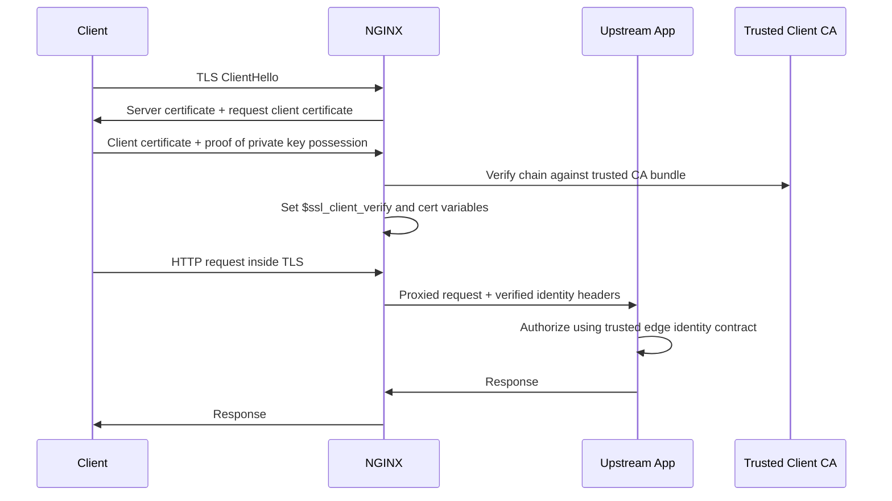

# Part 073 — Mutual TLS: Client Certificate Auth and Upstream Identity

Part 069 introduced TLS termination as a trust boundary.
Part 070 explained certificates, chains, SNI, and name-based HTTPS.
Part 071 tuned TLS behavior.
Part 072 added browser-facing security controls.

This part is about **mutual TLS**, usually shortened to **mTLS**.

Normal HTTPS proves the server identity to the client.
mTLS adds the reverse direction: the client also presents a certificate, and the server verifies it.

In production, mTLS is not just “stronger TLS”.

It is an identity system.

That means you must design:

- who issues client certificates;
- which CA roots are trusted;
- how certificate identity maps to application identity;
- how identity is forwarded to upstreams;
- how certificates are rotated and revoked;
- how failures are logged and debugged;
- where spoofed identity headers are stripped.

If those pieces are vague, mTLS can create a false sense of security.

## 1. Mental Model

With server-only TLS:

```txt
client verifies server certificate
server usually does not cryptographically verify client identity at TLS layer
```

With mTLS:

```txt
client verifies server certificate
server verifies client certificate
both sides have cryptographic identities
```



The invariant:

```txt
A client certificate is only meaningful if NGINX verifies it against a controlled trust store
and the upstream trusts identity only from NGINX, not from the public client.
```

## 2. When mTLS Is a Good Fit

mTLS is useful when the caller population is controlled.

Good fits:

- machine-to-machine APIs;
- partner integrations;
- internal admin APIs;
- private platform control planes;
- service-to-service traffic at an edge boundary;
- privileged automation clients;
- B2B API access where certificates can be issued and rotated.

Poor fits:

- ordinary public browser traffic;
- users who cannot manage client certificates;
- mobile apps where private key protection is weak or inconsistent;
- workloads that need delegated user consent rather than device/client identity;
- systems without certificate lifecycle ownership.

mTLS answers:

```txt
Does this peer hold a private key corresponding to a certificate issued by a CA I trust?
```

It does **not** automatically answer:

```txt
Is this user allowed to perform this business action?
Is this certificate still mapped to an active account?
Was this certificate stolen?
Should this request be authorized for this tenant?
```

Those are authorization decisions.

## 3. NGINX Directives for Client Certificate Verification

The core HTTP SSL directives are:

```nginx
ssl_client_certificate /etc/nginx/mtls/client-ca-bundle.pem;
ssl_trusted_certificate /etc/nginx/mtls/client-ca-bundle.pem;
ssl_verify_client on;
ssl_verify_depth 2;
```

Key directive meanings:

| Directive | Purpose |
|---|---|
| `ssl_verify_client` | Enables or disables verification of client certificates. |
| `ssl_client_certificate` | CA certificates used to verify client certs and sent to clients as acceptable CA list. |
| `ssl_trusted_certificate` | Trusted CA certificates used for verification but not sent to clients. |
| `ssl_verify_depth` | Maximum verification depth for client certificate chain. |
| `ssl_crl` | Certificate revocation list file. |

The subtle distinction:

```txt
ssl_client_certificate:
  used for verification
  sent to clients as acceptable CA list

ssl_trusted_certificate:
  used for verification
  not sent to clients
```

For large CA bundles, prefer using `ssl_trusted_certificate` for trust and a minimal `ssl_client_certificate` where client UX matters.

## 4. `ssl_verify_client` Modes

`ssl_verify_client` supports several modes:

```nginx
ssl_verify_client off;
ssl_verify_client on;
ssl_verify_client optional;
ssl_verify_client optional_no_ca;
```

Production interpretation:

| Mode | Meaning | Typical Use |
|---|---|---|
| `off` | Do not request/verify client certificate. | Public HTTPS. |
| `on` | Require valid client certificate. | Strict mTLS endpoint. |
| `optional` | Request certificate and verify it if provided. | Mixed endpoint with route-level enforcement. |
| `optional_no_ca` | Request certificate but do not fail if not signed by trusted CA. | Rare; forward cert to external verifier. |

The dangerous one is `optional_no_ca`.

It means the client can present a certificate that NGINX does not trust, and NGINX still allows the handshake.

Only use it when:

- an external verifier validates the raw certificate;
- the upstream explicitly rejects unverified certs;
- logs clearly record verification status;
- no route treats mere certificate presence as trusted identity.

## 5. mTLS Happens Before HTTP Routing

This is the most important operational point.

TLS handshake happens before NGINX receives a full HTTP request.

That means:

```txt
server block selection by SNI happens before HTTP Host/location routing
client certificate verification happens during TLS handshake
location matching happens after TLS is already established
```

So this is the wrong mental model:

```txt
/api/admin location requires mTLS
/public location does not require mTLS
```

NGINX cannot decide to request a client certificate only after it has already matched `/api/admin`.

Better patterns:

### Pattern A — Separate Hostname

```txt
public.example.com       normal HTTPS
admin-mtls.example.com   strict mTLS
```

This is the cleanest model.

```nginx
server {
    listen 443 ssl;
    server_name public.example.com;

    ssl_certificate     /etc/letsencrypt/live/public/fullchain.pem;
    ssl_certificate_key /etc/letsencrypt/live/public/privkey.pem;

    location / {
        proxy_pass http://public_app;
    }
}

server {
    listen 443 ssl;
    server_name admin-mtls.example.com;

    ssl_certificate     /etc/letsencrypt/live/admin/fullchain.pem;
    ssl_certificate_key /etc/letsencrypt/live/admin/privkey.pem;

    ssl_client_certificate /etc/nginx/mtls/client-ca.pem;
    ssl_verify_client on;
    ssl_verify_depth 2;

    location / {
        proxy_pass http://admin_app;
    }
}
```

Advantages:

- simple handshake behavior;
- clear browser/client experience;
- easier logs and alerts;
- safer review;
- no mixed trust semantics.

### Pattern B — Optional Client Cert + Per-Route Enforcement

Use this when separate hostname is impossible.

```nginx
map $ssl_client_verify $mtls_ok {
    default 0;
    SUCCESS 1;
}

server {
    listen 443 ssl;
    server_name api.example.com;

    ssl_certificate     /etc/letsencrypt/live/api/fullchain.pem;
    ssl_certificate_key /etc/letsencrypt/live/api/privkey.pem;

    ssl_client_certificate /etc/nginx/mtls/client-ca.pem;
    ssl_verify_client optional;
    ssl_verify_depth 2;

    location /public/ {
        proxy_pass http://public_api;
    }

    location /admin/ {
        if ($mtls_ok = 0) { return 403; }

        proxy_set_header X-Client-Cert-Verify $ssl_client_verify;
        proxy_set_header X-Client-Cert-DN     $ssl_client_s_dn;
        proxy_set_header X-Client-Cert-FP     $ssl_client_fingerprint;
        proxy_pass http://admin_api;
    }
}
```

Caveat:

```txt
The server may request a client certificate for the whole hostname,
even for public routes.
```

Some clients handle that poorly.

For public websites, separate hostname is usually cleaner.

## 6. Certificate Identity Is Not Application Identity

A certificate has fields:

- subject DN;
- issuer DN;
- serial number;
- SAN entries;
- validity period;
- public key;
- fingerprint.

Your app has identities:

- user ID;
- service ID;
- partner ID;
- tenant ID;
- role;
- permission set.

Never assume the subject string itself is a safe authorization key.

Bad pattern:

```txt
if subject contains "admin", allow admin access
```

Better pattern:

```txt
fingerprint or SAN URI -> lookup in identity registry -> service account -> policy decision
```

Example identity registry:

| Certificate Field | Registry Mapping |
|---|---|
| SHA-256 fingerprint | service account ID |
| SAN URI | SPIFFE/service identity |
| serial + issuer | partner certificate record |
| subject DN | display/debug only unless strictly normalized |

A defensible mTLS system has an explicit mapping table.

## 7. Forwarding Verified Identity to Upstream

The upstream app cannot see the client certificate directly if NGINX terminates TLS.

NGINX must forward selected identity attributes.

First, strip incoming spoofed identity headers.

```nginx
proxy_set_header X-Client-Cert-Verify "";
proxy_set_header X-Client-Cert-DN     "";
proxy_set_header X-Client-Cert-FP     "";
```

Then set trusted edge-owned headers.

```nginx
proxy_set_header X-Client-Cert-Verify $ssl_client_verify;
proxy_set_header X-Client-Cert-DN     $ssl_client_s_dn;
proxy_set_header X-Client-Cert-Issuer $ssl_client_i_dn;
proxy_set_header X-Client-Cert-Serial $ssl_client_serial;
proxy_set_header X-Client-Cert-FP     $ssl_client_fingerprint;
```

A stronger pattern is to forward a normalized identity generated by NGINX config or an auth service.

```nginx
map $ssl_client_fingerprint $client_service_id {
    default "";
    "ABCD1234..." "partner-a-ingest";
    "FACE9999..." "partner-b-reconcile";
}

location /partner-api/ {
    if ($client_service_id = "") { return 403; }

    proxy_set_header X-Authenticated-Client $client_service_id;
    proxy_set_header X-Auth-Method           "mtls";
    proxy_pass http://partner_api;
}
```

This keeps the upstream from parsing X.509 strings.

## 8. Logging mTLS

Add certificate verification fields to access logs.

```nginx
log_format mtls_json escape=json
  '{'
  '"ts":"$time_iso8601",'
  '"remote_addr":"$remote_addr",'
  '"host":"$host",'
  '"request":"$request",'
  '"status":$status,'
  '"ssl_protocol":"$ssl_protocol",'
  '"ssl_cipher":"$ssl_cipher",'
  '"client_verify":"$ssl_client_verify",'
  '"client_subject":"$ssl_client_s_dn",'
  '"client_issuer":"$ssl_client_i_dn",'
  '"client_serial":"$ssl_client_serial",'
  '"client_fp":"$ssl_client_fingerprint",'
  '"upstream_addr":"$upstream_addr",'
  '"upstream_status":"$upstream_status"'
  '}';
```

Useful debugging values:

| Variable | Meaning |
|---|---|
| `$ssl_client_verify` | `SUCCESS`, `FAILED:...`, or `NONE`. |
| `$ssl_client_s_dn` | Subject DN of client certificate. |
| `$ssl_client_i_dn` | Issuer DN. |
| `$ssl_client_serial` | Certificate serial. |
| `$ssl_client_fingerprint` | Client certificate fingerprint. |
| `$ssl_client_escaped_cert` | PEM cert escaped for safe forwarding if needed. |

Do not log full raw certificates by default.

They are noisy and may contain sensitive organizational information.

## 9. Upstream mTLS

There are two different mTLS directions:

```txt
client -> NGINX:
  client certificate verification at public/private edge

NGINX -> upstream:
  NGINX presents a client certificate to upstream
  NGINX verifies upstream certificate
```

For upstream HTTPS verification:

```nginx
location /api/ {
    proxy_pass https://backend_tls;

    proxy_ssl_server_name on;
    proxy_ssl_name backend.internal.example.com;

    proxy_ssl_verify on;
    proxy_ssl_trusted_certificate /etc/nginx/upstream-ca/internal-ca.pem;
    proxy_ssl_verify_depth 2;
}
```

For NGINX presenting a certificate to upstream:

```nginx
location /api/ {
    proxy_pass https://backend_tls;

    proxy_ssl_certificate     /etc/nginx/upstream-client/nginx-client.pem;
    proxy_ssl_certificate_key /etc/nginx/upstream-client/nginx-client.key;

    proxy_ssl_server_name on;
    proxy_ssl_name backend.internal.example.com;
    proxy_ssl_verify on;
    proxy_ssl_trusted_certificate /etc/nginx/upstream-ca/internal-ca.pem;
}
```

The invariant:

```txt
If upstream is HTTPS, NGINX should verify upstream identity unless there is a deliberate exception.
```

`proxy_pass https://...` without upstream verification can silently encrypt to the wrong peer.

## 10. mTLS Behind Another Load Balancer

If a cloud load balancer, CDN, or service mesh terminates TLS before NGINX, then NGINX does not perform the client certificate verification itself.


In that model, identity arrives as headers or metadata from the previous hop.

Safe rules:

1. Only trust those headers from a known trusted source IP/network.
2. Strip any client-supplied identity headers at the public boundary.
3. Use private network or authenticated connection between LB and NGINX.
4. Log both source hop and asserted client identity.
5. Treat identity header format as a contract with tests.

Unsafe pattern:

```nginx
proxy_set_header X-Authenticated-Client $http_x_authenticated_client;
```

That forwards a client-supplied spoofable value.

Better pattern:

```nginx
# At the trusted boundary only, after real_ip/trusted proxy setup.
map $remote_addr $trusted_mtls_forwarder {
    default 0;
    10.0.0.10 1;
    10.0.0.11 1;
}

location /internal/ {
    if ($trusted_mtls_forwarder = 0) { return 403; }

    proxy_set_header X-Authenticated-Client $http_x_lb_client_identity;
    proxy_pass http://app;
}
```

## 11. Revocation and Rotation

mTLS systems fail operationally when revocation and rotation are an afterthought.

You need a lifecycle:

```txt
issue -> distribute -> activate -> observe -> rotate -> revoke -> expire -> remove trust
```

NGINX can use CRL files via `ssl_crl`.

```nginx
ssl_crl /etc/nginx/mtls/client-ca.crl.pem;
```

But a CRL file is static from NGINX's perspective.

You need automation to:

- fetch or generate new CRL;
- write it atomically;
- run `nginx -t`;
- reload NGINX;
- alert on failed reload;
- test a revoked certificate.

For many internal systems, short-lived client certificates plus automated issuance are easier to operate than long-lived certificates plus emergency CRL handling.

## 12. Certificate Authority Design

Do not put every client certificate under one broad CA unless you intend every client to be trusted everywhere.

Better options:

```txt
CA per environment:
  dev-client-ca
  staging-client-ca
  prod-client-ca

CA per trust domain:
  partner-client-ca
  internal-automation-ca
  admin-human-ca

CA per platform boundary:
  ingress-client-ca
  service-mesh-client-ca
```

The trust store should encode real trust boundaries.

If all clients share one CA and any certificate from that CA is accepted, then your effective policy is:

```txt
any valid certificate from this CA can pass the edge
```

If that is too broad, narrow the trust store or add a registry lookup by fingerprint/SAN.

## 13. Route-Level Policy Matrix

Create a table before writing config.

| Route | mTLS Required | Identity Source | Upstream Header | Retry Allowed | Notes |
|---|---:|---|---|---:|---|
| `/public/` | No | none | none | yes | public API |
| `/partner/ingest/` | Yes | cert fingerprint registry | `X-Authenticated-Client` | no for POST | partner writes |
| `/admin/` | Yes | cert SAN + group mapping | `X-Admin-Client` | no | privileged |
| `/healthz` | No or internal only | network | none | yes | health check |

Then encode exactly that.

Do not let the config become the only source of truth.

## 14. Full Example: Partner API with mTLS

```nginx
map $ssl_client_fingerprint $partner_id {
    default "";
    "AA:BB:CC:DD:EE:01" "partner-alpha";
    "AA:BB:CC:DD:EE:02" "partner-beta";
}

log_format partner_mtls escape=json
  '{'
  '"ts":"$time_iso8601",'
  '"status":$status,'
  '"host":"$host",'
  '"uri":"$uri",'
  '"partner_id":"$partner_id",'
  '"client_verify":"$ssl_client_verify",'
  '"client_fp":"$ssl_client_fingerprint",'
  '"upstream_status":"$upstream_status",'
  '"upstream_rt":"$upstream_response_time"'
  '}';

upstream partner_api {
    zone partner_api 64k;
    server 10.20.1.11:8080 max_fails=2 fail_timeout=10s;
    server 10.20.1.12:8080 max_fails=2 fail_timeout=10s;
    keepalive 64;
}

server {
    listen 443 ssl;
    server_name partner-mtls.example.com;

    ssl_certificate     /etc/letsencrypt/live/partner/fullchain.pem;
    ssl_certificate_key /etc/letsencrypt/live/partner/privkey.pem;

    ssl_client_certificate /etc/nginx/mtls/partner-client-ca.pem;
    ssl_verify_client on;
    ssl_verify_depth 2;
    ssl_crl /etc/nginx/mtls/partner-client-ca.crl.pem;

    access_log /var/log/nginx/partner_mtls.log partner_mtls;

    location /v1/ingest/ {
        if ($partner_id = "") { return 403; }

        proxy_http_version 1.1;
        proxy_set_header Connection "";

        proxy_set_header Host $host;
        proxy_set_header X-Forwarded-For $proxy_add_x_forwarded_for;
        proxy_set_header X-Forwarded-Proto https;

        proxy_set_header X-Authenticated-Client $partner_id;
        proxy_set_header X-Auth-Method mtls;
        proxy_set_header X-Client-Cert-FP $ssl_client_fingerprint;

        proxy_connect_timeout 2s;
        proxy_send_timeout 10s;
        proxy_read_timeout 30s;

        proxy_next_upstream error timeout;
        proxy_next_upstream_tries 1;

        proxy_pass http://partner_api;
    }
}
```

Why `proxy_next_upstream_tries 1`?

Because ingest endpoints are often non-idempotent.

A hidden retry may duplicate writes.

## 15. Testing mTLS

Generate a bad test matrix.

| Case | Expected |
|---|---|
| No client cert | TLS handshake or HTTP access denied. |
| Cert signed by wrong CA | denied. |
| Expired client cert | denied. |
| Revoked client cert | denied after CRL reload. |
| Valid cert but unknown fingerprint | 403. |
| Valid known cert | 200 or upstream response. |
| Spoofed identity header without cert | denied or ignored. |
| Public route on separate public host | works without cert. |

Example `curl`:

```bash
curl -v https://partner-mtls.example.com/v1/ingest/

curl -v \
  --cert partner-alpha.crt \
  --key partner-alpha.key \
  --cacert server-ca.pem \
  https://partner-mtls.example.com/v1/ingest/
```

For local debugging with self-signed CA:

```bash
openssl verify -CAfile client-ca.pem partner-alpha.crt
openssl x509 -in partner-alpha.crt -noout -subject -issuer -serial -fingerprint -sha256
```

## 16. Failure Modes

### 16.1 Client Says “certificate required” or handshake fails

Likely causes:

- client did not present certificate;
- wrong certificate/key pair;
- client certificate expired;
- chain incomplete;
- CA not in `ssl_client_certificate`/`ssl_trusted_certificate`;
- verify depth too small;
- CRL revoked certificate;
- SNI reached wrong server block.

### 16.2 Valid Client Cert but App Sees No Identity

Check:

- `$ssl_client_verify` in access log;
- location config sets headers;
- app is reading expected header names;
- reverse proxy chain did not strip headers;
- request actually hit mTLS server block.

### 16.3 Public Clients Get Certificate Prompt

Likely cause:

```txt
ssl_verify_client optional/on was enabled on a shared hostname
```

Fix:

- separate public and mTLS hostnames;
- or accept that optional cert prompt is part of the UX;
- or move mTLS to a different port/edge path with explicit client control.

### 16.4 Partner Rotated Cert and Traffic Broke

Likely causes:

- new intermediate not trusted;
- fingerprint registry not updated;
- certificate subject changed;
- CA bundle deployed but NGINX not reloaded;
- deploy hook failed silently.

Use overlapping validity windows.

## 17. Production Checklist

Before enabling mTLS:

- [ ] client CA ownership is clear;
- [ ] CA bundle is environment-specific;
- [ ] certificate identity mapping is explicit;
- [ ] subject DN is not used as an unreviewed authorization string;
- [ ] public and mTLS hostnames are separated where possible;
- [ ] spoofable identity headers are stripped;
- [ ] upstream trusts identity only from NGINX/private network;
- [ ] logs include verification status and fingerprint;
- [ ] test certs cover valid, invalid, expired, revoked, unknown identity;
- [ ] rotation process is tested;
- [ ] revocation or short-lived certificate strategy exists;
- [ ] reload failure alerts exist.

## 18. Key Takeaways

mTLS in NGINX is powerful because it moves peer authentication to the transport edge.

But the hard part is not the directive.

The hard part is the identity lifecycle.

A strong production design separates:

```txt
certificate verification:
  Is the presented certificate cryptographically valid under a trusted CA?

identity mapping:
  Which service/partner/account does this certificate represent?

authorization:
  What is that identity allowed to do?

forwarding contract:
  How does upstream receive the verified identity without trusting spoofed client input?
```

When those are explicit, mTLS becomes a defensible control.

When they are implicit, mTLS becomes another fragile edge configuration.

## References

- NGINX `ngx_http_ssl_module`: https://nginx.org/en/docs/http/ngx_http_ssl_module.html
- NGINX configuring HTTPS servers: https://nginx.org/en/docs/http/configuring_https_servers.html
- NGINX `ngx_http_proxy_module` upstream TLS directives: https://nginx.org/en/docs/http/ngx_http_proxy_module.html
