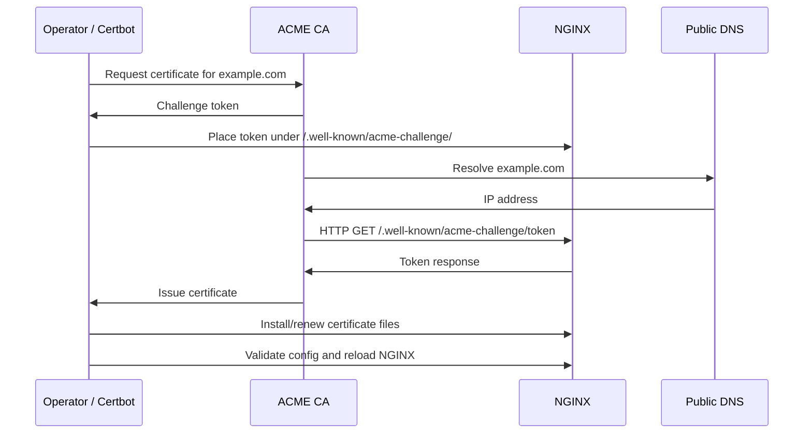
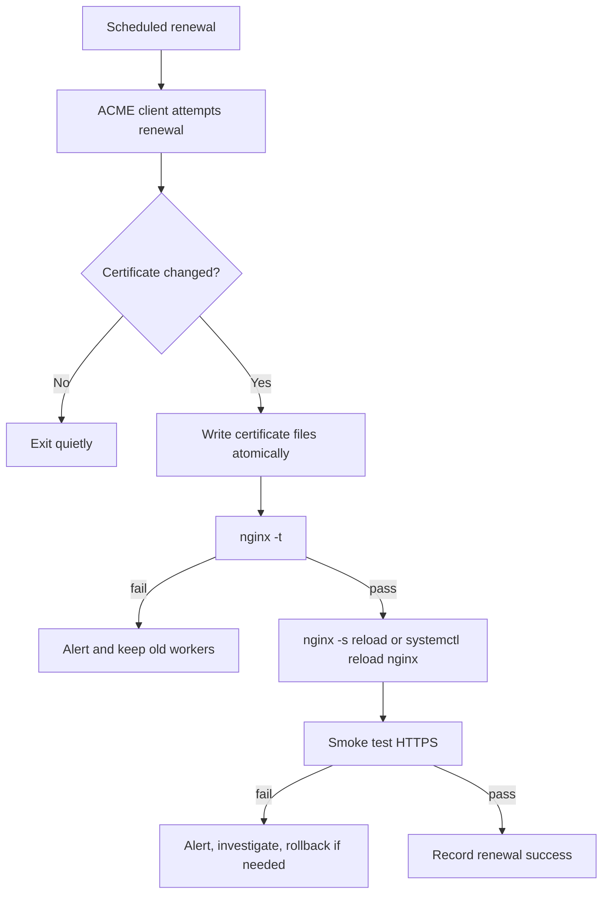

# Part 074 — ACME/Certbot Automation: Renewal, Reload, and Failure Mode

A certificate is not a file you install once.

It is a renewable credential with an expiry time.

Production HTTPS requires an operating model:

```txt
issue -> deploy -> validate -> reload -> monitor -> renew -> rotate -> recover
```

This part focuses on ACME automation with NGINX, especially Certbot-style workflows.

The goal is not to memorize one command.

The goal is to make certificate renewal boring.

## 1. Mental Model

ACME automates certificate issuance by proving control over a domain.

A typical HTTP-01 flow looks like this:



The production invariant:

```txt
Renewal must not depend on a human being remembering an expiry date.
```

## 2. Challenge Types

The common ACME challenge types are:

| Challenge | Proof | Good For | Operational Risk |
|---|---|---|---|
| HTTP-01 | Serve token over HTTP on port 80. | Normal public websites. | Port 80 routing, redirects, CDN/proxy interference. |
| DNS-01 | Publish TXT record under `_acme-challenge`. | Wildcards, private origins, no public port 80. | DNS API credentials and propagation delay. |
| TLS-ALPN-01 | Serve special TLS validation cert on port 443. | Some advanced clients/automation. | Port 443 ownership and client support. |

For NGINX-backed web apps, HTTP-01 and DNS-01 are the most common.

HTTP-01 is operationally simple when:

- the domain resolves to the NGINX edge;
- port 80 is reachable from the public internet;
- redirects do not block the challenge path;
- `.well-known/acme-challenge` is explicitly served.

DNS-01 is useful when:

- issuing wildcard certificates;
- origin is private behind CDN;
- port 80 cannot be exposed;
- central certificate automation owns DNS safely.

## 3. NGINX Config for HTTP-01

Do not make ACME validation depend on app routing.

Create an explicit challenge location.

```nginx
server {
    listen 80;
    server_name example.com www.example.com;

    location ^~ /.well-known/acme-challenge/ {
        root /var/www/acme;
        default_type text/plain;
        try_files $uri =404;
    }

    location / {
        return 301 https://$host$request_uri;
    }
}
```

With this layout, a token file at:

```txt
/var/www/acme/.well-known/acme-challenge/<token>
```

is served at:

```txt
http://example.com/.well-known/acme-challenge/<token>
```

Important details:

- ACME path must be reachable without authentication;
- do not proxy the challenge to the app unless the app owns issuance;
- do not redirect the challenge path to HTTPS unless you have tested it with your CA/client;
- do not allow arbitrary files outside the challenge directory;
- keep the location before generic redirects or rewrites.

## 4. Certificate File Layout

Certbot commonly writes certificates under a lineage directory like:

```txt
/etc/letsencrypt/live/example.com/fullchain.pem
/etc/letsencrypt/live/example.com/privkey.pem
```

NGINX should usually point to stable symlink paths, not versioned archive files.

```nginx
server {
    listen 443 ssl;
    server_name example.com;

    ssl_certificate     /etc/letsencrypt/live/example.com/fullchain.pem;
    ssl_certificate_key /etc/letsencrypt/live/example.com/privkey.pem;

    location / {
        proxy_pass http://app;
    }
}
```

Why `fullchain.pem`?

Because NGINX must send the leaf certificate and required intermediate certificates to clients.

A common outage is configuring only the leaf certificate.

Symptoms:

- works in some browsers;
- fails in older clients;
- fails in Java clients with strict trust stores;
- SSL checker reports incomplete chain.

## 5. Safe Renewal Pipeline

A good renewal pipeline has gates.



The key invariant:

```txt
Never reload NGINX blindly after changing certificate files.
```

Always test configuration first.

```bash
nginx -t && systemctl reload nginx
```

or inside a deploy hook:

```bash
#!/usr/bin/env bash
set -euo pipefail

nginx -t
systemctl reload nginx
curl -fsS https://example.com/healthz >/dev/null
```

## 6. Certbot Renewal Hooks

Certbot supports hooks around renewal.

Use cases:

| Hook | Use |
|---|---|
| pre-hook | Stop or prepare a service before renewal attempt. |
| post-hook | Run after renewal attempt. |
| deploy-hook | Run only after successful renewal for a lineage. |

For NGINX reloads, deploy hooks are usually safer than post hooks because they run only when a certificate was actually renewed.

Example:

```bash
certbot renew --deploy-hook /usr/local/sbin/reload-nginx-after-cert-renewal.sh
```

`/usr/local/sbin/reload-nginx-after-cert-renewal.sh`:

```bash
#!/usr/bin/env bash
set -euo pipefail

/usr/sbin/nginx -t
/bin/systemctl reload nginx
```

Make the hook idempotent.

It may run multiple times across lineages depending on setup.

## 7. Avoiding the “Port 80 Redirect Broke Renewal” Incident

A common config:

```nginx
server {
    listen 80;
    server_name example.com;
    return 301 https://$host$request_uri;
}
```

This may work for normal traffic, but it gives the ACME challenge no explicit local serving path.

Safer:

```nginx
server {
    listen 80;
    server_name example.com;

    location ^~ /.well-known/acme-challenge/ {
        root /var/www/acme;
        default_type text/plain;
        try_files $uri =404;
    }

    location / {
        return 301 https://$host$request_uri;
    }
}
```

Smoke test before relying on Certbot:

```bash
mkdir -p /var/www/acme/.well-known/acme-challenge
printf 'ok' > /var/www/acme/.well-known/acme-challenge/test-token
curl -i http://example.com/.well-known/acme-challenge/test-token
```

Expected:

```txt
HTTP/1.1 200 OK
...
ok
```

## 8. Wildcard Certificates and DNS-01

HTTP-01 cannot issue wildcard certificates.

For:

```txt
*.example.com
```

use DNS-01.

DNS-01 requires creating a TXT record:

```txt
_acme-challenge.example.com TXT <token>
```

Production concerns:

- DNS API token scope;
- propagation delay;
- stale TXT records;
- multi-provider DNS differences;
- audit trail for automated DNS writes;
- separation between certificate automation and general DNS administration.

Do not give a certificate bot full DNS admin rights if it only needs `_acme-challenge` updates.

Prefer narrowly scoped DNS credentials when provider supports it.

## 9. Certificate Rotation Without Downtime

NGINX reads certificate files when loading configuration or during reload.

A safe rotation process:

```txt
1. Obtain renewed certificate.
2. Ensure live symlinks point to new files.
3. Run nginx -t.
4. Reload NGINX.
5. New TLS handshakes use new certificate.
6. Existing connections continue until closed.
7. Monitor certificate presented externally.
```

Check certificate dates externally:

```bash
echo | openssl s_client -connect example.com:443 -servername example.com 2>/dev/null \
  | openssl x509 -noout -subject -issuer -dates
```

Check chain:

```bash
echo | openssl s_client -connect example.com:443 -servername example.com -showcerts
```

## 10. Multi-Certificate and Multi-Hostname Operations

One NGINX node may serve many certificates.

Do not let config sprawl become unreviewable.

Prefer a registry:

```yaml
certificates:
  - name: example.com
    server_names:
      - example.com
      - www.example.com
    acme_method: http-01
    challenge_root: /var/www/acme
    reload_target: nginx

  - name: wildcard-example.com
    server_names:
      - "*.example.com"
    acme_method: dns-01
    dns_provider: route53
```

Then generate config snippets.

Generated config is often safer than manually edited duplicated server blocks, as long as:

- templates are reviewed;
- generated output is tested with `nginx -T`;
- diffs are visible in CI;
- rollback is clear.

## 11. Containerized NGINX

In containers, certificate automation can be arranged several ways.

### Pattern A — Certbot on Host, NGINX Container Mounts Certs

```txt
host certbot writes /etc/letsencrypt
nginx container mounts cert directory read-only
host reloads/restarts nginx container after renewal
```

Pros:

- simple host-level ACME;
- easy access to port 80;
- certificates persist outside container.

Cons:

- reload command must target container;
- file permissions need care;
- orchestration must detect changed certs.

Example hook:

```bash
#!/usr/bin/env bash
set -euo pipefail

docker exec edge-nginx nginx -t
docker exec edge-nginx nginx -s reload
```

### Pattern B — Sidecar ACME Client

```txt
acme sidecar obtains certs
shared volume contains certificate files
nginx reloads when files change
```

Pros:

- fits container platforms;
- avoids certbot in NGINX image.

Cons:

- reload signalling across containers;
- volume consistency;
- challenge routing.

### Pattern C — Platform-Owned Certificates

```txt
cloud load balancer / ingress controller / certificate manager owns ACME
NGINX may receive HTTP or re-encrypted HTTPS
```

Pros:

- less certificate code in app team stack;
- central monitoring and rotation.

Cons:

- NGINX may no longer control TLS policy;
- mTLS and client identity may move upstream;
- edge trust boundary changes.

## 12. Kubernetes Consideration

In Kubernetes, cert-manager is often used instead of raw Certbot.

The same invariants still apply:

```txt
challenge routing must work
certificate Secret must update
NGINX/Ingress must reload or dynamically consume the new Secret
external smoke test must verify the presented certificate
expiry alert must exist
```

Do not confuse:

```txt
certificate object exists in cluster
```

with:

```txt
the public endpoint is presenting the correct, non-expired certificate
```

Always verify from outside the cluster path.

## 13. Monitoring Certificate Expiry

You need at least three signals:

1. expiry days remaining from the public endpoint;
2. renewal job success/failure;
3. NGINX reload success/failure.

Useful alert thresholds:

| Days Until Expiry | Severity |
|---:|---|
| < 30 | warning |
| < 14 | high |
| < 7 | critical |
| < 3 | emergency |

Why alert before 7 days?

Because renewal failure may depend on DNS, firewall, CA rate limits, broken redirects, or ownership changes.

You want time to fix the system, not just the certificate.

## 14. Rate Limits and Staging

ACME CAs may impose rate limits.

Operational rule:

```txt
Use staging environment for test automation.
Use production CA only when the flow is validated.
```

For repeated testing:

- use staging ACME directory;
- use throwaway domains;
- avoid deleting and recreating lineages repeatedly;
- keep logs of issuance attempts;
- avoid automated loops that request certificates continuously.

A bad deploy hook can create a retry storm against the CA.

## 15. File Permissions

Private keys must be readable by NGINX master process but not broadly readable.

Typical goals:

```txt
privkey.pem:
  readable by root / nginx service account as required
  not world-readable

fullchain.pem:
  less sensitive, but still managed by root-owned deployment
```

Common mistakes:

- mounting `/etc/letsencrypt` read-write into unnecessary containers;
- copying private keys into app images;
- logging private key paths and contents;
- using broad backup access without key controls;
- losing keys during ephemeral container replacement.

## 16. ACME Challenge Security

The challenge directory is public.

Keep it narrow.

```nginx
location ^~ /.well-known/acme-challenge/ {
    root /var/www/acme;
    default_type text/plain;
    try_files $uri =404;
}
```

Do not enable directory listing.

Do not map it to application upload directories.

Do not let tenants write arbitrary files there unless certificate issuance is tenant-scoped and controlled.

Do not put secrets under `.well-known`.

## 17. Failure Modes

### 17.1 Renewal Fails: HTTP-01 Unauthorized

Check:

- DNS resolves to this NGINX edge;
- port 80 is open;
- CDN/WAF is not blocking challenge path;
- challenge location is before redirects;
- token file exists under expected root;
- IPv6 path works if AAAA record exists;
- wrong server block is not catching the request.

Commands:

```bash
curl -i http://example.com/.well-known/acme-challenge/test-token
curl -i -H 'Host: example.com' http://<edge-ip>/.well-known/acme-challenge/test-token
```

### 17.2 Renewal Succeeds but Site Still Presents Old Cert

Check:

- NGINX was reloaded after renewal;
- config points to live symlink, not archived old cert;
- SNI uses correct server block;
- CDN/load balancer terminates TLS before NGINX;
- multiple NGINX replicas all received updated certs;
- external probe is hitting the same region/node.

### 17.3 Reload Fails After Renewal

Good news: if reload fails, old NGINX workers should keep serving with old config.

Bad news: the new certificate may not be active.

Check:

```bash
nginx -t
journalctl -u nginx --since '30 min ago'
```

Common causes:

- private key unreadable;
- certificate/key mismatch;
- wrong file path;
- broken include generated by hook;
- missing intermediate;
- SELinux/AppArmor denial;
- container mount not updated.

### 17.4 Wildcard Renewal Fails

Check:

- DNS API token still valid;
- `_acme-challenge` TXT record created;
- propagation delay;
- multiple TXT records handled correctly;
- CNAME delegation for ACME challenge still valid;
- DNS provider rate limit.

## 18. Rollback Strategy

Certificate rollback is tricky because the previous cert may be closer to expiry.

A safe rollback plan:

```txt
1. Keep previous certificate files until new certificate is confirmed.
2. Keep previous NGINX config revision.
3. Validate previous cert is still valid.
4. Repoint symlink or restore previous lineage only if needed.
5. Run nginx -t.
6. Reload.
7. Verify externally with SNI.
```

But prefer fixing the new deployment when possible.

Common rollback reason:

```txt
wrong certificate SAN set
wrong chain
wrong key permissions
```

## 19. Production Runbook

Daily automation:

```txt
systemd timer / cron / platform scheduler runs renewal
renewal attempts only when due
successful renewal triggers deploy hook
hook validates and reloads NGINX
external monitor checks cert expiry and issuer/SAN
```

Weekly check:

```bash
certbot certificates
systemctl list-timers | grep certbot
nginx -T | grep -E 'ssl_certificate|server_name'
```

Emergency check:

```bash
echo | openssl s_client -connect example.com:443 -servername example.com 2>/dev/null \
  | openssl x509 -noout -subject -issuer -dates -ext subjectAltName
```

## 20. Reference NGINX Snippet

```nginx
# /etc/nginx/snippets/acme-http-01.conf
location ^~ /.well-known/acme-challenge/ {
    root /var/www/acme;
    default_type text/plain;
    try_files $uri =404;
}
```

```nginx
server {
    listen 80;
    server_name example.com www.example.com;

    include snippets/acme-http-01.conf;

    location / {
        return 301 https://$host$request_uri;
    }
}

server {
    listen 443 ssl http2;
    server_name example.com www.example.com;

    ssl_certificate     /etc/letsencrypt/live/example.com/fullchain.pem;
    ssl_certificate_key /etc/letsencrypt/live/example.com/privkey.pem;

    include snippets/security-headers.conf;

    location / {
        proxy_pass http://app;
    }
}
```

Deploy hook:

```bash
#!/usr/bin/env bash
set -euo pipefail

/usr/sbin/nginx -t
/bin/systemctl reload nginx

# Optional: verify one or more externally reachable endpoints.
/usr/bin/curl -fsS https://example.com/healthz >/dev/null
```

## 21. Key Takeaways

Certificate automation is an availability system.

The certificate itself is only one artifact.

The production system includes:

- DNS correctness;
- challenge routing;
- certificate file layout;
- private key permissions;
- NGINX config correctness;
- safe reload;
- external verification;
- expiry monitoring;
- incident recovery.

The strongest invariant:

```txt
A renewed certificate is not deployed until NGINX has successfully reloaded
and an external probe confirms the public endpoint presents the expected certificate.
```

If you keep that invariant, certificate rotation becomes routine instead of an outage pattern.

## References

- NGINX configuring HTTPS servers: https://nginx.org/en/docs/http/configuring_https_servers.html
- NGINX command-line parameters: https://nginx.org/en/docs/switches.html
- Certbot user guide: https://eff-certbot.readthedocs.io/en/stable/using.html
- Let's Encrypt challenge types: https://letsencrypt.org/docs/challenge-types/
- Let's Encrypt best practice: keep port 80 open: https://letsencrypt.org/docs/allow-port-80/
