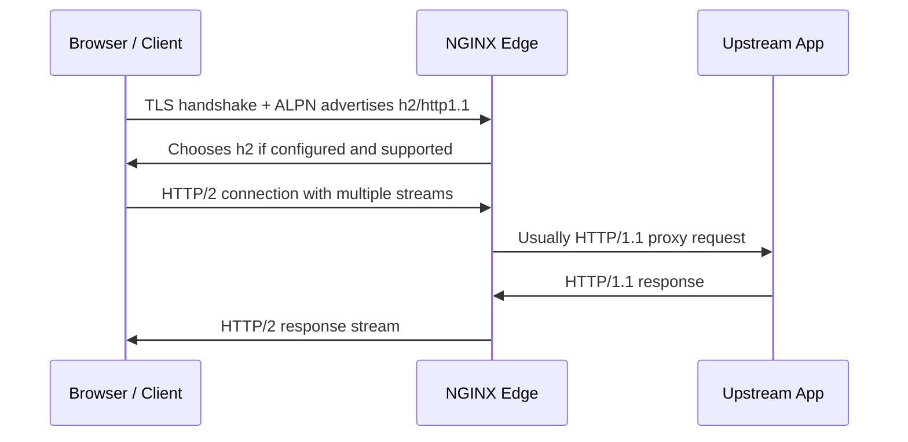

# Part 075 — HTTP/2 Configuration: Performance, Multiplexing, and Risk Boundaries

HTTP/2 is not a faster spelling of HTTP/1.1.

It changes the shape of the client connection.

With HTTP/1.1, browsers historically opened several TCP connections to the same origin to get parallelism.

With HTTP/2, many request/response streams can share one connection.

That sounds like pure performance upside.

In production, it is a trade:

```txt
fewer client connections
+ multiplexed streams
+ compressed headers
+ better asset delivery behavior
- more work per connection
- harder per-request isolation
- different overload surface
- protocol-specific security history
```

The goal of this part is not to convince you to always enable HTTP/2.

The goal is to know exactly what changes when you do.

## 1. Mental Model

In NGINX, HTTP/2 support is primarily about the **client-facing side** of the connection.



Important invariant:

```txt
HTTP/2 at the client edge does not automatically mean HTTP/2 to the upstream.
```

For ordinary `proxy_pass`, NGINX commonly speaks HTTP/1.0 or HTTP/1.1 to the upstream depending on your proxy configuration.

For gRPC, the upstream side is different because `grpc_pass` uses the gRPC module and requires the HTTP/2 module.

So do not draw this diagram by accident:

```txt
client HTTP/2 -> NGINX -> upstream HTTP/2
```

Draw the actual contract:

```txt
client negotiated protocol -> NGINX normalization/proxy layer -> upstream protocol
```

## 2. What HTTP/2 Changes

HTTP/2 changes these parts of the system:

| Dimension | HTTP/1.1 Shape | HTTP/2 Shape | Production Consequence |
|---|---|---|---|
| Connection model | Many client connections. | Fewer connections, many streams. | FD count may drop, but per-connection memory/work may rise. |
| Parallelism | Multiple sockets or pipelining. | Multiplexed streams. | One slow TCP connection can affect many streams. |
| Headers | Plain text per request. | HPACK-compressed header blocks. | Header decompression limits matter. |
| TLS negotiation | Normal HTTPS. | Needs ALPN for browser HTTPS use. | TLS library capability matters. |
| Observability | One request per connection is easier to reason about. | Many requests share connection. | Log per request, but debug per connection when needed. |
| Upstream behavior | Direct mapping is intuitive. | NGINX translates protocol boundary. | Upstream may still see HTTP/1.1. |

The production mindset:

```txt
HTTP/2 optimizes client-edge transport.
It does not remove the need for correct caching, compression, timeout, rate-limit, and upstream capacity design.
```

## 3. Build and Module Boundary

Before configuring HTTP/2, check whether the module exists.

```bash
nginx -V 2>&1 | tr ' ' '\n' | grep http_v2
```

Expected if built from source with HTTP/2 support:

```txt
--with-http_v2_module
```

If the module is missing, `http2 on;` will fail config validation.

That is good.

Production deployment should fail closed.

```bash
nginx -t
```

Never promote an HTTP/2 change without `nginx -t` in CI and on the target image.

A container image built from a different package source can silently differ from your VM package.

## 4. Minimal HTTPS + HTTP/2 Server

Modern NGINX configuration uses the `http2` directive.

```nginx
server {
    listen 443 ssl;
    http2 on;

    server_name app.example.com;

    ssl_certificate     /etc/nginx/tls/app.example.com/fullchain.pem;
    ssl_certificate_key /etc/nginx/tls/app.example.com/privkey.pem;

    location / {
        proxy_pass http://app_upstream;
        proxy_http_version 1.1;
        proxy_set_header Connection "";
        proxy_set_header Host $host;
        proxy_set_header X-Real-IP $remote_addr;
        proxy_set_header X-Forwarded-For $proxy_add_x_forwarded_for;
        proxy_set_header X-Forwarded-Proto $scheme;
    }
}
```

The critical pieces are:

| Config | Why It Exists |
|---|---|
| `listen 443 ssl;` | HTTPS listener. |
| `http2 on;` | Enables HTTP/2 protocol negotiation. |
| valid certificate chain | Required for real browser negotiation. |
| ALPN-capable TLS library | Allows client/server to agree on `h2`. |
| upstream proxy settings | Keeps upstream contract explicit. |

Do not bury `http2 on;` inside a random include where nobody sees which host has it.

For production, prefer this layout:

```nginx
# snippets/tls-modern.conf
ssl_protocols TLSv1.2 TLSv1.3;
ssl_session_cache shared:SSL:50m;
ssl_session_timeout 1d;

# servers/app.example.com.conf
server {
    listen 443 ssl;
    http2 on;
    server_name app.example.com;

    include snippets/tls-modern.conf;
    include snippets/security-headers.conf;

    # route config here
}
```

The protocol enablement should be visible at the `server` level.

## 5. ALPN and Protocol Negotiation

For browser HTTPS, HTTP/2 is negotiated during TLS using ALPN.

The client says roughly:

```txt
I support: h2, http/1.1
```

The server answers:

```txt
Use: h2
```

When debugging, verify the negotiated protocol.

```bash
openssl s_client -connect app.example.com:443 -servername app.example.com -alpn h2 </dev/null 2>/dev/null | grep -i alpn
```

Expected:

```txt
ALPN protocol: h2
```

With curl:

```bash
curl -I --http2 https://app.example.com/
```

Expected output contains:

```txt
HTTP/2 200
```

Or inspect the negotiated protocol in logs using `$http2`.

```nginx
log_format edge_json escape=json
  '{'
    '"time":"$time_iso8601",'
    '"host":"$host",'
    '"request":"$request",'
    '"status":$status,'
    '"http2":"$http2",'
    '"request_time":$request_time,'
    '"upstream_addr":"$upstream_addr",'
    '"upstream_status":"$upstream_status",'
    '"upstream_response_time":"$upstream_response_time"'
  '}';
```

Interpretation:

| `$http2` | Meaning |
|---|---|
| `h2` | HTTP/2 over TLS. |
| `h2c` | HTTP/2 over cleartext TCP. |
| empty | Not HTTP/2. Usually HTTP/1.x. |

## 6. HTTP/2 Is Not a Replacement for Compression Strategy

HTTP/2 compresses headers using HPACK.

It does not compress response bodies.

You still need a body compression policy:

```nginx
gzip on;
gzip_vary on;
gzip_types text/plain text/css application/json application/javascript application/xml image/svg+xml;
```

For already-compressed media, avoid wasting CPU.

```nginx
location ~* \.(?:jpg|jpeg|png|webp|gif|mp4|zip|gz|br)$ {
    gzip off;
    try_files $uri =404;
}
```

HTTP/2 improves transport behavior.

It does not fix poor asset caching, huge HTML, unbounded JSON, or missing CDN strategy.

## 7. Stream Concurrency Is Capacity Control

HTTP/2 allows multiple streams on a single connection.

NGINX exposes `http2_max_concurrent_streams`.

Example:

```nginx
http {
    http2_max_concurrent_streams 128;
}
```

Think of this as a per-connection concurrency guard.

Too low:

```txt
client-side parallelism suffers
page load may regress
browser waits unnecessarily
```

Too high:

```txt
one connection can carry many active requests
per-connection memory grows
upstream fan-out can spike
abusive clients get more leverage per socket
```

A good review question:

```txt
If one client opens one HTTP/2 connection, how many concurrent upstream requests can it cause?
```

The answer is not only `http2_max_concurrent_streams`.

It also depends on:

- rate limit key;
- connection limit key;
- route cost;
- cache hit ratio;
- upstream keepalive;
- upstream worker/thread pool;
- backend DB fan-out;
- request body buffering.

## 8. Header Size and Memory Boundaries

HTTP/2 uses compressed headers.

Compressed on the wire does not mean cheap after decompression.

A small compressed header block can expand into a larger header list.

Modern NGINX versions route header-size control through core directives such as `large_client_header_buffers` rather than older obsolete HTTP/2-specific directives.

Example:

```nginx
http {
    large_client_header_buffers 4 16k;
}
```

Do not blindly raise header limits because one client has a large cookie.

Large cookies usually indicate an application/session design problem.

Review headers by class:

| Header Class | Risk |
|---|---|
| `Cookie` | Often bloats every request and harms cacheability. |
| `Authorization` | Should normally prevent shared cache. |
| `X-Forwarded-*` | Trust boundary risk if accepted from clients. |
| tracing baggage | Can become unbounded in microservice chains. |
| custom metadata | Often lacks size discipline. |

Production invariant:

```txt
Header limit increases require ownership of why headers became large.
```

## 9. Server Push Is Not the Main Strategy

Older HTTP/2 guidance often emphasized server push.

Treat that guidance as legacy unless you have a measured reason.

In current NGINX documentation, push-related directives are obsolete in modern versions, and early hints can be considered instead.

A safer default:

```txt
Use cacheable hashed assets + preload hints + good HTML delivery.
Do not rely on HTTP/2 push as the primary optimization strategy.
```

Example response hint from upstream or edge:

```nginx
add_header Link '</assets/app.8fd3.css>; rel=preload; as=style' always;
```

But even preload can hurt when abused.

Every hint is a resource scheduling decision.

## 10. HTTP/2 and Reverse Proxy Timeout Design

HTTP/2 multiplexing can hide the intuition that one connection carries many streams.

Timeouts still apply at several layers:

```txt
client connection timeout
client header/body timeout
proxy connect timeout
proxy send timeout
proxy read timeout
upstream app timeout
load balancer/CDN timeout
```

Example baseline:

```nginx
server {
    listen 443 ssl;
    http2 on;

    client_header_timeout 10s;
    client_body_timeout 30s;
    keepalive_timeout 65s;

    location /api/ {
        proxy_connect_timeout 2s;
        proxy_send_timeout 30s;
        proxy_read_timeout 30s;
        proxy_pass http://api_upstream;
    }
}
```

Do not set long `proxy_read_timeout` globally just because one SSE/gRPC-like route needs it.

Route-specific timeout ownership still matters.

## 11. HTTP/2 and Rate Limiting

A common mistake:

```txt
We limit connections, so we limit load.
```

With HTTP/2, one connection can contain many streams.

Connection limiting alone becomes less expressive.

Use request-rate and route-specific controls.

```nginx
limit_req_zone $binary_remote_addr zone=per_ip_rps:20m rate=20r/s;

server {
    listen 443 ssl;
    http2 on;

    location /api/ {
        limit_req zone=per_ip_rps burst=40 nodelay;
        proxy_pass http://api_upstream;
    }
}
```

For authenticated APIs, prefer a stronger key than raw IP when safe:

```nginx
map $http_authorization $rate_key {
    default $binary_remote_addr;
    ~^Bearer\s+(.+)$ $binary_remote_addr; # do not log/store token directly
}
```

Do not use raw authorization tokens as rate-limit keys unless you understand memory, privacy, and log exposure consequences.

## 12. HTTP/2 and gRPC Boundary

gRPC over NGINX depends on HTTP/2.

But do not confuse these two designs:

```txt
Browser/client HTTP/2 -> proxy_pass HTTP/1.1 upstream
```

versus:

```txt
gRPC client HTTP/2 -> grpc_pass -> gRPC upstream HTTP/2
```

A gRPC server block usually looks different:

```nginx
server {
    listen 443 ssl;
    http2 on;
    server_name grpc.example.com;

    ssl_certificate     /etc/nginx/tls/grpc/fullchain.pem;
    ssl_certificate_key /etc/nginx/tls/grpc/privkey.pem;

    location /com.example.UserService/ {
        grpc_pass grpc://user_grpc_upstream;
        grpc_connect_timeout 2s;
        grpc_send_timeout 30s;
        grpc_read_timeout 30s;
    }
}
```

Keep gRPC policy separate from browser/API policy when possible.

The operational profile is different:

| Route Type | Typical Behavior |
|---|---|
| Browser page | many assets, cacheable static, short API calls |
| JSON API | request/response, auth, rate limit, timeout |
| gRPC unary | RPC-like, status metadata, HTTP/2 required |
| gRPC streaming | long-lived, route-specific timeout and observability |

## 13. Security Risk Boundary

HTTP/2 has had protocol-specific vulnerability classes in the broader ecosystem.

The lesson is not “never enable HTTP/2”.

The lesson is:

```txt
Protocol enablement is part of the attack surface.
```

Production controls:

- keep NGINX patched;
- do not run abandoned builds;
- validate module presence/version with `nginx -V`;
- use request rate limiting, not only connection limiting;
- cap header sizes;
- cap concurrent streams;
- monitor 4xx/5xx changes after rollout;
- have a fast rollback path to HTTP/1.1.

Rollback should be simple:

```nginx
server {
    listen 443 ssl;
    # http2 off; # explicit if inherited globally
    http2 off;
}
```

Then:

```bash
nginx -t && nginx -s reload
```

## 14. Rollout Strategy

Do not enable HTTP/2 everywhere without observability.

Use this rollout ladder:

```txt
1. Verify build: nginx -V includes http_v2_module.
2. Enable on one low-risk host.
3. Add $http2 to access logs.
4. Run curl/browser tests.
5. Compare latency, 4xx, 5xx, memory, CPU, connection count.
6. Enable on static-heavy host.
7. Enable on API host with rate limits.
8. Keep rollback tested.
```

Canary by hostname is cleaner than canary by client percentage.

```txt
h2-canary.example.com -> HTTP/2 enabled
app.example.com       -> current behavior
```

Once verified, move the production host.

## 15. Test Plan

### 15.1 Config validation

```bash
nginx -t
nginx -T | grep -n "http2"
```

### 15.2 Protocol negotiation

```bash
curl -I --http2 https://app.example.com/
```

Expected:

```txt
HTTP/2 200
```

### 15.3 HTTP/1.1 fallback

```bash
curl -I --http1.1 https://app.example.com/
```

Expected:

```txt
HTTP/1.1 200
```

### 15.4 ALPN

```bash
openssl s_client -connect app.example.com:443 -servername app.example.com -alpn h2 </dev/null 2>/dev/null | grep -i alpn
```

Expected:

```txt
ALPN protocol: h2
```

### 15.5 Log verification

```bash
jq 'select(.http2 == "h2") | {host, status, request_time}' /var/log/nginx/access.json
```

### 15.6 Load shape

Compare before/after:

| Signal | Expected Shift |
|---|---|
| client TCP connections | often down |
| requests per connection | up |
| CPU | may rise or fall depending on TLS/header/workload |
| memory per active connection | may rise |
| p95/p99 latency | must be measured per route |
| upstream request rate | should not unexpectedly rise |
| 499 | may reveal client/proxy behavior changes |
| 502/504 | should not increase |

## 16. Anti-Patterns

### 16.1 Enabling HTTP/2 Without Logs

Bad:

```nginx
http2 on;
```

with no `$http2` in logs.

You cannot debug adoption or failure.

### 16.2 Assuming Upstream HTTP/2

Bad mental model:

```txt
client uses HTTP/2, therefore upstream uses HTTP/2
```

Correct:

```txt
NGINX terminates client protocol and creates a separate upstream request contract.
```

### 16.3 Using Connection Limits as Primary Abuse Control

HTTP/2 reduces connection count.

A connection limit can become too weak.

Use request limits and route cost controls.

### 16.4 Copying Old Server Push Recipes

Do not add server push just because an old blog recommends it.

Measure.

Prefer cacheable assets and preload hints.

### 16.5 Global Long Timeouts

Bad:

```nginx
proxy_read_timeout 1h;
```

at `http` level.

Better:

```nginx
location /events/ {
    proxy_read_timeout 1h;
    proxy_buffering off;
    proxy_pass http://sse_upstream;
}
```

## 17. Production Checklist

Before enabling HTTP/2 on a host:

- [ ] `nginx -V` confirms `--with-http_v2_module`.
- [ ] TLS library supports ALPN.
- [ ] `http2 on;` is visible in server config.
- [ ] `nginx -t` passes in CI and target runtime.
- [ ] `$http2` is logged.
- [ ] HTTP/1.1 fallback is tested.
- [ ] `http2_max_concurrent_streams` is reviewed.
- [ ] header limits are reviewed.
- [ ] rate limits are request-based where needed.
- [ ] gRPC routes are separated from normal API routes where possible.
- [ ] rollback to HTTP/1.1 is documented.
- [ ] dashboards compare before/after.

## 18. Minimal Reference Config

```nginx
http {
    log_format edge_json escape=json
      '{'
        '"time":"$time_iso8601",'
        '"remote_addr":"$remote_addr",'
        '"host":"$host",'
        '"request":"$request",'
        '"status":$status,'
        '"http2":"$http2",'
        '"request_time":$request_time,'
        '"upstream_addr":"$upstream_addr",'
        '"upstream_status":"$upstream_status",'
        '"upstream_response_time":"$upstream_response_time"'
      '}';

    access_log /var/log/nginx/access.json edge_json;

    large_client_header_buffers 4 16k;
    keepalive_timeout 65s;
    http2_max_concurrent_streams 128;

    limit_req_zone $binary_remote_addr zone=per_ip_rps:20m rate=20r/s;

    upstream app_upstream {
        zone app_upstream 64k;
        server 10.0.10.11:8080 max_fails=2 fail_timeout=10s;
        server 10.0.10.12:8080 max_fails=2 fail_timeout=10s;
        keepalive 64;
    }

    server {
        listen 443 ssl;
        http2 on;
        server_name app.example.com;

        ssl_certificate     /etc/nginx/tls/app.example.com/fullchain.pem;
        ssl_certificate_key /etc/nginx/tls/app.example.com/privkey.pem;
        ssl_protocols TLSv1.2 TLSv1.3;

        location /api/ {
            limit_req zone=per_ip_rps burst=40 nodelay;

            proxy_connect_timeout 2s;
            proxy_send_timeout 30s;
            proxy_read_timeout 30s;

            proxy_http_version 1.1;
            proxy_set_header Connection "";
            proxy_set_header Host $host;
            proxy_set_header X-Real-IP $remote_addr;
            proxy_set_header X-Forwarded-For $proxy_add_x_forwarded_for;
            proxy_set_header X-Forwarded-Proto $scheme;

            proxy_pass http://app_upstream;
        }
    }
}
```

## 19. Incident Playbook

### Symptom: clients still use HTTP/1.1

Check:

```bash
nginx -V 2>&1 | grep http_v2
openssl s_client -connect host:443 -servername host -alpn h2 </dev/null 2>/dev/null | grep -i alpn
curl -Iv --http2 https://host/
```

Likely causes:

- module missing;
- `http2 on;` not in selected server;
- wrong default TLS server;
- certificate/SNI mismatch;
- TLS library lacks ALPN;
- client does not support HTTP/2.

### Symptom: CPU increases after rollout

Check:

- TLS handshakes;
- request rate;
- header size;
- compression CPU;
- cache hit ratio;
- upstream retries;
- bot traffic.

Do not blame HTTP/2 until request mix and TLS/compression changes are accounted for.

### Symptom: backend overloads despite fewer connections

Hypothesis:

```txt
HTTP/2 reduced client sockets but increased effective concurrent streams per socket.
```

Check:

- `http2_max_concurrent_streams`;
- per-route request rate;
- upstream request concurrency;
- `limit_req` key;
- retry amplification;
- cache bypass rate.

### Symptom: large clients get 400/431

Check:

- cookie size;
- tracing baggage;
- auth header size;
- `large_client_header_buffers`;
- upstream header limits too.

Do not fix by raising every limit globally.

## 20. Key Takeaways

HTTP/2 is a transport optimization and a protocol boundary.

Enable it deliberately.

Observe it explicitly.

Limit it with stream, header, timeout, and rate controls.

Do not assume it changes upstream protocol.

Do not confuse fewer connections with less load.

The professional version of “enable HTTP/2” is:

```txt
enable h2 -> verify ALPN -> log protocol -> cap streams -> test fallback -> monitor route-level impact -> keep rollback ready
```

## References

- NGINX `ngx_http_v2_module`: https://nginx.org/en/docs/http/ngx_http_v2_module.html
- NGINX HTTPS configuration: https://nginx.org/en/docs/http/configuring_https_servers.html
- NGINX proxy module: https://nginx.org/en/docs/http/ngx_http_proxy_module.html
- NGINX gRPC module: https://nginx.org/en/docs/http/ngx_http_grpc_module.html
- RFC 9113 — HTTP/2: https://www.rfc-editor.org/rfc/rfc9113
