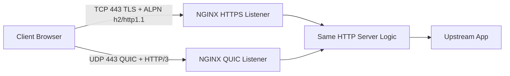
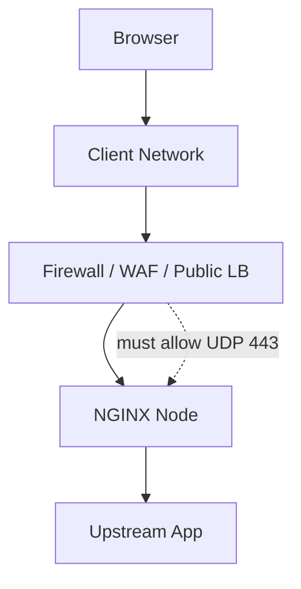
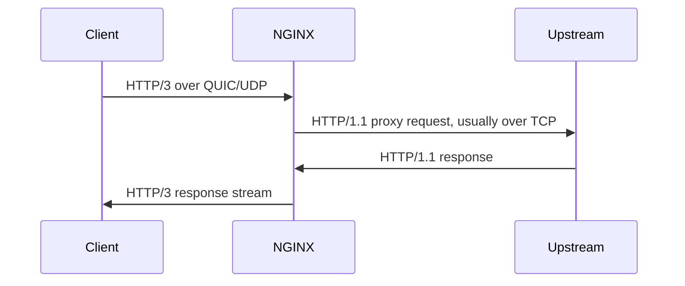

# Part 076 — HTTP/3 and QUIC: Experimental Edge, Build Requirements, and Rollout Strategy

HTTP/3 is not “HTTP/2 but newer”.

It moves HTTP semantics onto QUIC, and QUIC runs over UDP.

That changes the operational surface.

```txt
HTTP/1.1 -> TCP + TLS optional/usually HTTPS
HTTP/2   -> TCP + TLS + ALPN for browser HTTPS
HTTP/3   -> QUIC over UDP + TLS 1.3 inside QUIC
```

The production question is not:

```txt
Can NGINX enable HTTP/3?
```

The better question is:

```txt
Can our edge, firewall, load balancer, observability, incident process, and rollback model safely operate UDP-based HTTP at this point?
```

This part treats HTTP/3 as an edge rollout problem, not a checkbox.

## 1. Mental Model

HTTP/3 usually coexists with HTTPS over TCP on the same public port number, but through different transports.



The two public listeners are conceptually separate:

```nginx
listen 443 ssl;              # TCP HTTPS: HTTP/1.1 or HTTP/2
listen 443 quic reuseport;   # UDP QUIC: HTTP/3
```

A browser normally discovers HTTP/3 availability through `Alt-Svc`.

```txt
First request over HTTPS/TCP -> server advertises h3 -> later request may use QUIC/UDP
```

So HTTP/3 rollout is not only server-side.

It also depends on client behavior, DNS, UDP reachability, firewall rules, and middleboxes.

## 2. Status Boundary

Treat NGINX HTTP/3 support as an explicit capability boundary.

At the time of this series:

- the `ngx_http_v3_module` provides HTTP/3 support;
- the module is marked experimental in official documentation;
- it is not built by default when building from source;
- it requires appropriate TLS/QUIC library support;
- Linux binary packages include QUIC/HTTP/3 support in modern releases, but your actual runtime must still be verified.

Production invariant:

```txt
Do not design a critical availability promise on a module you have not verified in the exact runtime image.
```

Check build/runtime:

```bash
nginx -V 2>&1 | tr ' ' '\n' | grep -E 'http_v3|openssl|boringssl|quictls|libressl'
```

You need to know:

- was NGINX built with `--with-http_v3_module`?
- which TLS library was linked?
- does runtime use the expected library?
- are you on a version with fixes required by your platform?
- does your container/package actually match your assumptions?

## 3. HTTP/3 Is UDP

Most HTTP operations teams are deeply TCP-oriented.

HTTP/3 makes UDP a first-class production path.

That affects:

| Area | HTTP/1.1 / HTTP/2 | HTTP/3 / QUIC |
|---|---|---|
| Transport | TCP | UDP |
| TLS | TLS over TCP | TLS 1.3 integrated into QUIC |
| Port exposure | TCP 443 | UDP 443 too |
| Load balancer | TCP/TLS aware | UDP support required |
| Firewall | allow TCP 443 | allow UDP 443 |
| Observability | TCP connection oriented | QUIC connection and UDP packet oriented |
| Middleboxes | mature path | sometimes blocked or degraded |
| Fallback | HTTP/1.1/2 | fallback to TCP HTTPS if QUIC fails |

A common rollout failure:

```txt
NGINX is configured correctly, but UDP 443 is blocked upstream of NGINX.
```

Another common failure:

```txt
UDP reaches only one node, while TCP reaches all nodes.
```

Before changing NGINX, draw the packet path.



## 4. Minimal HTTP/3 Configuration

A minimal server looks like this:

```nginx
server {
    listen 443 ssl;
    listen 443 quic reuseport;

    server_name app.example.com;

    ssl_certificate     /etc/nginx/tls/app.example.com/fullchain.pem;
    ssl_certificate_key /etc/nginx/tls/app.example.com/privkey.pem;
    ssl_protocols TLSv1.3;

    add_header Alt-Svc 'h3=":443"; ma=3600' always;

    location / {
        proxy_pass http://app_upstream;
        proxy_http_version 1.1;
        proxy_set_header Connection "";
        proxy_set_header Host $host;
        proxy_set_header X-Forwarded-Proto $scheme;
        proxy_set_header X-Forwarded-For $proxy_add_x_forwarded_for;
    }
}
```

For real production, do not force only TLS 1.3 on the TCP listener unless that is your intentional compatibility policy.

A more practical layout is often:

```nginx
server {
    listen 443 ssl;
    listen 443 quic reuseport;

    http2 on;
    http3 on;

    server_name app.example.com;

    ssl_certificate     /etc/nginx/tls/app.example.com/fullchain.pem;
    ssl_certificate_key /etc/nginx/tls/app.example.com/privkey.pem;
    ssl_protocols TLSv1.2 TLSv1.3;

    add_header Alt-Svc 'h3=":443"; ma=3600' always;
    add_header QUIC-Status $http3 always;

    location / {
        proxy_pass http://app_upstream;
    }
}
```

Notes:

- TCP HTTPS still handles HTTP/1.1 and HTTP/2.
- UDP QUIC handles HTTP/3.
- QUIC itself requires TLS 1.3.
- `Alt-Svc` controls discovery/advertisement.
- `$http3` helps logging/debugging.

## 5. Alt-Svc Is the Rollout Lever

`Alt-Svc` tells clients that HTTP/3 is available.

Example:

```nginx
add_header Alt-Svc 'h3=":443"; ma=3600' always;
```

Interpretation:

```txt
h3=":443"  -> HTTP/3 available on UDP 443
ma=3600     -> client may remember this for 1 hour
```

Do not start with a huge `ma`.

Bad first rollout:

```nginx
add_header Alt-Svc 'h3=":443"; ma=2592000' always;
```

If you break QUIC, clients may keep trying for a long time.

Safer first rollout:

```nginx
add_header Alt-Svc 'h3=":443"; ma=300' always;
```

Then increase:

```txt
5 minutes -> 1 hour -> 1 day -> longer
```

Rollback can be done by removing or shortening `Alt-Svc`, but client caches may retain prior advertisements until expiry.

That is why `ma` is a production control, not a random number.

## 6. QUIC Listener and `reuseport`

Official guidance recommends `reuseport` with the QUIC listener for multiple workers.

```nginx
listen 443 quic reuseport;
```

Reasoning:

```txt
UDP packet distribution across workers must be operationally sane.
```

With TCP, the kernel manages connection-oriented accept behavior.

With UDP, packet routing and connection state are different.

When you enable QUIC, test with the actual worker count and deployment model.

```bash
nginx -T | grep -n "worker_processes\|listen .*quic"
ss -lunp | grep ':443'
```

## 7. Host Key and Reload Behavior

QUIC has tokens for address validation and stateless reset behavior.

NGINX provides `quic_host_key`.

Without a stable key file, a random key may be generated on reload, and tokens from the old key are not accepted.

Production config:

```nginx
quic_host_key /etc/nginx/quic/host.key;
```

Generate and protect it:

```bash
install -o root -g root -m 0700 -d /etc/nginx/quic
openssl rand 80 > /etc/nginx/quic/host.key
chmod 0600 /etc/nginx/quic/host.key
```

Operational invariant:

```txt
A normal reload should not unnecessarily invalidate QUIC token state.
```

Store this key like an operational secret.

Coordinate rotation deliberately.

## 8. Address Validation and `quic_retry`

`quic_retry on;` enables address validation behavior.

```nginx
quic_retry on;
```

Why care?

UDP is spoofable in ways TCP is not.

Address validation helps reduce certain spoofing/amplification risks.

Trade-off:

```txt
more validation round trips
+ better spoofing resistance
- possible latency impact
- client/network compatibility needs testing
```

Use a controlled rollout.

Do not enable every QUIC feature at once.

## 9. 0-RTT Early Data Risk

HTTP/3/QUIC can support early data under specific library/version conditions.

Early data is attractive because it can reduce handshake latency.

But early data can be replayed.

For dynamic applications, the default safe posture is:

```txt
Do not enable early data for unsafe methods or state-changing routes.
```

If enabled, protect it with explicit policy.

```nginx
ssl_early_data on;

map $request_method $early_data_unsafe_method {
    default 1;
    GET     0;
    HEAD    0;
    OPTIONS 0;
}

server {
    listen 443 ssl;
    listen 443 quic reuseport;

    location / {
        if ($ssl_early_data) {
            return 425;
        }

        proxy_set_header Early-Data $ssl_early_data;
        proxy_pass http://app_upstream;
    }
}
```

A stricter approach:

```txt
disable early data entirely until you have a replay-safe route model.
```

For most internal platforms, that is the right answer.

## 10. HTTP/3 and Upstream Protocol

HTTP/3 at the client edge does not mean HTTP/3 upstream.



The upstream app often does not know whether the client used HTTP/1.1, HTTP/2, or HTTP/3.

If the app needs that signal, forward a controlled header:

```nginx
map $http3 $client_transport {
    default "http1_or_http2";
    "h3"    "http3";
}

proxy_set_header X-Client-Transport $client_transport;
```

Do not let clients supply this header directly.

```nginx
proxy_set_header X-Client-Transport $client_transport;
```

This overwrites the inbound value.

## 11. Observability

Add `$http3` to logs.

```nginx
log_format quic_json escape=json
  '{'
    '"time":"$time_iso8601",'
    '"remote_addr":"$remote_addr",'
    '"host":"$host",'
    '"request":"$request",'
    '"status":$status,'
    '"http3":"$http3",'
    '"request_time":$request_time,'
    '"upstream_addr":"$upstream_addr",'
    '"upstream_status":"$upstream_status",'
    '"upstream_response_time":"$upstream_response_time"'
  '}';
```

Dashboard dimensions:

| Signal | Why It Matters |
|---|---|
| `% requests with http3=h3` | Adoption and fallback behavior. |
| HTTP/3 p95/p99 latency | Validate performance benefit or regression. |
| 4xx/5xx by protocol | Detect protocol-specific failure. |
| 499 by protocol | Client/network abort behavior. |
| UDP packet drops | Network path health. |
| CPU per request | QUIC/TLS overhead. |
| memory per active connection | Resource pressure. |
| fallback to HTTP/2/1.1 | Detect blocked UDP or client incompatibility. |

If you cannot answer “what percentage of requests use HTTP/3?”, you have not rolled it out operationally.

You have only changed config.

## 12. Testing

### 12.1 Config validation

```bash
nginx -t
nginx -T | grep -nE 'quic|http3|Alt-Svc|quic_host_key'
```

### 12.2 Build verification

```bash
nginx -V 2>&1 | tr ' ' '\n' | grep -E 'http_v3|openssl|boringssl|quictls|libressl'
```

### 12.3 UDP listener

```bash
ss -lunp | grep ':443'
```

Expected:

```txt
udp ... :443 ... nginx
```

### 12.4 HTTP/3-capable curl

Your curl must be built with HTTP/3 support.

```bash
curl -V | grep -i http3
curl -I --http3 https://app.example.com/
```

### 12.5 Alt-Svc over TCP

```bash
curl -I --http2 https://app.example.com/ | grep -i alt-svc
```

Expected:

```txt
Alt-Svc: h3=":443"; ma=...
```

### 12.6 Browser verification

Browser devtools can show protocol.

Look for:

```txt
h3
```

or use server logs with `$http3`.

### 12.7 UDP path test

From an external network, verify UDP 443 reaches your node.

The exact tool depends on environment, but the principle is:

```txt
Test from outside every firewall/load balancer hop.
```

Testing from the NGINX node itself proves almost nothing about internet reachability.

## 13. Rollout Ladder

A safe HTTP/3 rollout is slower than an HTTP/2 rollout.

```txt
1. Confirm NGINX version, module, TLS library, and package source.
2. Enable on a non-critical hostname.
3. Open UDP 443 only for that path.
4. Add $http3 logs.
5. Advertise Alt-Svc with ma=300.
6. Compare h3 vs h2 latency and errors.
7. Test reload behavior with quic_host_key.
8. Increase ma to 3600.
9. Enable on static-heavy domain.
10. Enable on API domain only after error/fallback behavior is proven.
```

Canary pattern:

```txt
h3-canary.example.com -> HTTP/3 enabled
www.example.com       -> HTTP/2/HTTP/1.1 only
```

Do not canary first on your login domain.

Do not canary first on your payment/transaction domain.

## 14. Rollback Strategy

HTTP/3 rollback has two parts.

### 14.1 Stop advertising

```nginx
# remove or shorten this
# add_header Alt-Svc 'h3=":443"; ma=3600' always;

add_header Alt-Svc 'h3=":443"; ma=0' always;
```

### 14.2 Stop listening on QUIC

```nginx
server {
    listen 443 ssl;
    # listen 443 quic reuseport; # disabled
}
```

Then:

```bash
nginx -t && nginx -s reload
```

Remember:

```txt
Clients may cache previous Alt-Svc until ma expires.
```

This is why first rollout should use a short `ma`.

## 15. Common Failure Modes

### 15.1 NGINX reload succeeds but no HTTP/3 traffic

Likely causes:

- UDP 443 blocked;
- load balancer does not forward UDP;
- client did not receive `Alt-Svc`;
- browser does not support or has disabled HTTP/3;
- test client lacks HTTP/3 support;
- certificate issue;
- wrong server block selected;
- module not actually loaded/built.

### 15.2 HTTP/3 works locally but not from internet

Likely cause:

```txt
testing bypassed the real firewall/load-balancer path
```

Test externally.

### 15.3 Increased 499

Possible causes:

- mobile network changes;
- UDP path instability;
- client fallback behavior;
- aggressive timeouts;
- QUIC connection migration interaction;
- browser-specific behavior.

Compare by protocol using `$http3`.

### 15.4 CPU increase

Possible causes:

- TLS/QUIC overhead;
- packet processing overhead;
- no GSO support;
- more requests due to faster client behavior;
- compression still active;
- cache hit ratio changed.

### 15.5 Reload disrupts QUIC tokens

Check whether `quic_host_key` is stable.

If not, add it.

## 16. Configuration Patterns

### 16.1 Static-heavy host

```nginx
server {
    listen 443 ssl;
    listen 443 quic reuseport;

    http2 on;
    http3 on;

    server_name assets.example.com;

    ssl_certificate     /etc/nginx/tls/assets/fullchain.pem;
    ssl_certificate_key /etc/nginx/tls/assets/privkey.pem;
    ssl_protocols TLSv1.2 TLSv1.3;

    quic_host_key /etc/nginx/quic/host.key;
    quic_retry on;

    add_header Alt-Svc 'h3=":443"; ma=3600' always;
    add_header QUIC-Status $http3 always;

    root /srv/assets/current/public;

    location /assets/ {
        try_files $uri =404;
        expires 1y;
        add_header Cache-Control "public, max-age=31536000, immutable" always;
    }

    location / {
        try_files $uri =404;
    }
}
```

This is a good early production target because:

- most requests are safe/idempotent;
- cache behavior is predictable;
- rollback impact is lower;
- upstream dependency may be absent.

### 16.2 API host with cautious advertisement

```nginx
server {
    listen 443 ssl;
    listen 443 quic reuseport;

    http2 on;
    http3 on;

    server_name api.example.com;

    ssl_certificate     /etc/nginx/tls/api/fullchain.pem;
    ssl_certificate_key /etc/nginx/tls/api/privkey.pem;
    ssl_protocols TLSv1.2 TLSv1.3;

    quic_host_key /etc/nginx/quic/host.key;

    # short advertisement for early rollout
    add_header Alt-Svc 'h3=":443"; ma=300' always;

    location / {
        proxy_connect_timeout 2s;
        proxy_send_timeout 30s;
        proxy_read_timeout 30s;

        proxy_pass http://api_upstream;
    }
}
```

API rollout should be tied to real error-budget monitoring.

## 17. What Not to Do

### 17.1 Do Not Enable HTTP/3 Everywhere First

HTTP/3 changes network assumptions.

Start with a domain whose failure mode is tolerable.

### 17.2 Do Not Use Long Alt-Svc on Day One

Bad:

```nginx
add_header Alt-Svc 'h3=":443"; ma=2592000' always;
```

Better:

```nginx
add_header Alt-Svc 'h3=":443"; ma=300' always;
```

### 17.3 Do Not Enable 0-RTT Without Replay Model

If your route can mutate state, early data needs explicit protection.

Default to off.

### 17.4 Do Not Assume Your Load Balancer Supports UDP Correctly

Verify actual support.

Many architectures were built around TCP 443 only.

### 17.5 Do Not Hide HTTP/3 From Logs

Without `$http3`, debugging becomes guesswork.

## 18. Decision Matrix

| Question | If Yes | If No |
|---|---|---|
| Is `ngx_http_v3_module` present in runtime? | continue | stop |
| Can public path pass UDP 443? | continue | fix network first |
| Do you have `$http3` logs? | continue | add logs first |
| Is rollback tested? | continue | test rollback first |
| Is `Alt-Svc ma` short for first rollout? | continue | reduce it |
| Is workload mostly safe/static? | good first candidate | use a canary domain |
| Is 0-RTT replay-safe? | maybe enable carefully | keep disabled |
| Is module status acceptable for your risk level? | proceed deliberately | stay on HTTP/2 |

## 19. Production Checklist

- [ ] NGINX version supports HTTP/3/QUIC.
- [ ] Runtime has `--with-http_v3_module` or package-confirmed equivalent.
- [ ] TLS library is known and compatible.
- [ ] UDP 443 is allowed end-to-end.
- [ ] TCP 443 remains enabled for fallback.
- [ ] `listen 443 quic reuseport;` is configured only on intended hosts.
- [ ] `Alt-Svc` starts with short `ma`.
- [ ] `$http3` is logged.
- [ ] `quic_host_key` is stable and protected.
- [ ] `quic_retry` decision is documented.
- [ ] 0-RTT is disabled unless replay-safe design exists.
- [ ] HTTP/3 and HTTP/2 latency/error dashboards exist.
- [ ] rollback removes advertisement and QUIC listener.
- [ ] client and external-network tests pass.

## 20. Key Takeaways

HTTP/3 is a transport and network-path change, not just an HTTP feature.

It introduces UDP into the edge contract.

It requires explicit module/runtime verification.

It depends on client discovery through `Alt-Svc`.

It needs observability through `$http3`.

It should be rolled out with short advertisement lifetime and clean fallback to TCP HTTPS.

The professional version of “enable HTTP/3” is:

```txt
verify module -> open UDP path -> add QUIC listener -> advertise briefly -> log $http3 -> compare behavior -> increase scope -> keep rollback ready
```

## References

- NGINX `ngx_http_v3_module`: https://nginx.org/en/docs/http/ngx_http_v3_module.html
- NGINX QUIC/HTTP/3 guide: https://nginx.org/en/docs/quic.html
- NGINX SSL module: https://nginx.org/en/docs/http/ngx_http_ssl_module.html
- RFC 9114 — HTTP/3: https://www.rfc-editor.org/rfc/rfc9114
- RFC 9000 — QUIC: https://www.rfc-editor.org/rfc/rfc9000
