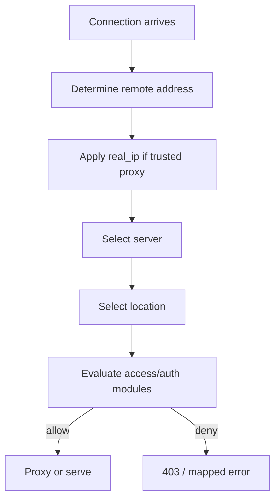

# Part 078 — Access Control with `allow/deny`, `geo`, `map`, and CIDR Policy

Network-based access control looks simple.

```nginx
allow 10.0.0.0/8;
deny all;
```

But production access control is not a list of IPs.

It is a policy system with identity, trust boundaries, generated data, fallback behavior, and audit requirements.

A wrong CIDR rule can expose an admin endpoint.

A wrong real IP configuration can make every attacker look trusted.

A missing default can turn “deny by default” into “allow by accident”.

This part covers:

- `allow` / `deny` ordering.
- `satisfy all` vs `satisfy any`.
- `geo` for CIDR classification.
- `map` for policy composition.
- Real IP trust boundary.
- CIDR registry design.
- Admin/metrics/internal route protection.
- Generated policy files.
- Testing and incident playbooks.

The core principle:

```txt
Address-based access control is only as trustworthy as the source address NGINX uses.
```

## 1. Mental Model

NGINX access control happens inside request processing.



Two questions matter:

```txt
1. What client address does NGINX believe?
2. Which policy applies to the selected route?
```

If either answer is wrong, the rule is wrong.

## 2. `allow` and `deny` Basics

The access module evaluates rules in order.

Example:

```nginx
location /admin/ {
    allow 10.0.0.0/8;
    allow 192.168.0.0/16;
    deny all;

    proxy_pass http://admin_app;
}
```

Interpretation:

```txt
allow private 10/8
allow private 192.168/16
deny everyone else
```

The first matching rule wins.

So this is different:

```nginx
location /admin/ {
    deny all;
    allow 10.0.0.0/8;

    proxy_pass http://admin_app;
}
```

The `allow` is unreachable because `deny all` matches first.

Production invariant:

```txt
Put specific allows before final deny.
```

## 3. Deny by Default

For sensitive locations, never rely on absence of a rule.

Good:

```nginx
location /metrics {
    allow 10.20.0.0/16;
    deny all;

    proxy_pass http://app_metrics;
}
```

Bad:

```nginx
location /metrics {
    allow 10.20.0.0/16;

    proxy_pass http://app_metrics;
}
```

The bad config does not deny everyone else.

It only says one range is allowed; without a deny, other requests may still pass depending on module behavior and surrounding config.

Use a final rule.

```nginx
deny all;
```

## 4. Exact Locations for Sensitive Endpoints

Do not protect a broad path when exact matching is required.

Metrics endpoint:

```nginx
location = /metrics {
    allow 10.20.0.0/16;
    deny all;

    proxy_pass http://app_metrics;
}
```

Why exact?

Because these are different:

```txt
/metrics
/metrics/
/metrics/debug
/metrics-old
```

If only `/metrics` should exist, say so.

Add explicit deny or 404 for variants if needed:

```nginx
location ^~ /metrics/ {
    return 404;
}
```

## 5. Real IP Trust Boundary

If NGINX is behind a load balancer or CDN, `$remote_addr` may be the proxy address, not the real client.

```txt
Client -> CDN/LB -> NGINX
```

NGINX sees:

```txt
remote_addr = CDN/LB IP
X-Forwarded-For = client IP, proxy chain
```

To use client IP, configure Real IP carefully.

```nginx
set_real_ip_from 10.0.0.0/8;
real_ip_header X-Forwarded-For;
real_ip_recursive on;
```

But this must only trust known proxy ranges.

Bad:

```nginx
set_real_ip_from 0.0.0.0/0;
real_ip_header X-Forwarded-For;
```

That lets any client claim any IP.

```bash
curl -H 'X-Forwarded-For: 10.0.0.1' https://admin.example.com/admin/
```

If NGINX trusts everyone, attacker becomes “internal”.

Production invariant:

```txt
Never trust Real IP headers from the public internet.
Trust only known proxy CIDRs.
```

## 6. `$remote_addr` vs `$realip_remote_addr`

After Real IP processing:

```txt
$remote_addr        -> replaced client address
$realip_remote_addr -> original address before replacement
```

Log both when debugging trust boundaries.

```nginx
log_format edge escape=json
  '{'
  '"time":"$time_iso8601",'
  '"remote_addr":"$remote_addr",'
  '"realip_remote_addr":"$realip_remote_addr",'
  '"xff":"$http_x_forwarded_for",'
  '"host":"$host",'
  '"uri":"$request_uri",'
  '"status":$status'
  '}';
```

This helps answer:

```txt
Did NGINX use actual client IP or proxy IP?
Was X-Forwarded-For trusted correctly?
Which proxy inserted which value?
```

## 7. Access Control Before or After Real IP?

Access rules use the address as NGINX understands it at access phase.

If Real IP is configured at `http` or `server` level before route evaluation, `allow/deny` can use the corrected client address.

Example:

```nginx
http {
    set_real_ip_from 10.0.0.0/8;
    real_ip_header X-Forwarded-For;
    real_ip_recursive on;

    server {
        location /admin/ {
            allow 203.0.113.0/24;
            deny all;
            proxy_pass http://admin_app;
        }
    }
}
```

But if Real IP trust is wrong, the access rule is wrong.

Review Real IP and access rules together.

## 8. `satisfy all` vs `satisfy any`

NGINX can combine access controls with Basic Auth, auth subrequest, JWT modules, and address rules through `satisfy`.

Strict admin pattern:

```nginx
location /admin/ {
    satisfy all;

    allow 10.0.0.0/8;
    deny all;

    auth_request /_auth_admin;

    proxy_pass http://admin_app;
}
```

Meaning:

```txt
Must be from allowed network AND pass auth_request.
```

Bypass pattern:

```nginx
location /admin/ {
    satisfy any;

    allow 10.0.0.0/8;
    deny all;

    auth_request /_auth_admin;

    proxy_pass http://admin_app;
}
```

Meaning:

```txt
Allowed network OR auth_request success is enough.
```

This can be valid.

But treat it as a bypass policy.

Production invariant:

```txt
`satisfy any` must have an owner and a test case proving it is intentional.
```

## 9. `geo`: CIDR Classification

`geo` creates a variable based on client IP address.

Example:

```nginx
geo $is_corp_network {
    default 0;
    10.0.0.0/8 1;
    192.168.0.0/16 1;
    203.0.113.0/24 1;
}
```

Then use it later:

```nginx
location /admin/ {
    if ($is_corp_network = 0) {
        return 403;
    }

    proxy_pass http://admin_app;
}
```

But avoid using `if` as your policy composition language when the rule grows.

Better: use `map` to turn classification into policy decisions.

## 10. `geo` with Explicit Address Variable

By default, `geo` uses the client address.

You can provide an address variable.

```nginx
geo $remote_addr $network_class {
    default public;
    10.0.0.0/8 corp;
    192.168.0.0/16 corp;
}
```

This is useful when you intentionally classify a different address.

But most cases should use the Real IP-corrected client address.

Document which address is being classified.

## 11. `map`: Policy Composition

`map` creates variables based on other variables.

Example:

```nginx
map $network_class $allow_admin_by_network {
    default 0;
    corp    1;
}
```

You can combine inputs by concatenating them.

```nginx
map "$network_class:$request_method" $allow_sensitive_route {
    default 0;
    "corp:GET" 1;
    "corp:POST" 1;
}
```

This is often cleaner than nested `if`.

## 12. `geo` + `map` Pattern

```nginx
geo $network_zone {
    default public;
    10.0.0.0/8 corp;
    172.16.0.0/12 corp;
    192.168.0.0/16 corp;
    203.0.113.0/24 vendor_a;
}

map "$network_zone:$uri" $access_profile {
    default deny;
    ~^corp:/admin/ allow;
    ~^corp:/metrics$ allow;
    ~^vendor_a:/vendor-api/ allow;
}

server {
    location /admin/ {
        if ($access_profile = deny) { return 403; }
        proxy_pass http://admin_app;
    }
}
```

This works, but there is a catch:

```txt
Regex in map keys can become hidden routing logic.
```

Keep it readable.

For high-risk policies, prefer explicit locations with explicit allow/deny.

## 13. Avoid Policy Hidden in Many Places

Bad production shape:

```txt
some allow/deny in location
some geo in http
some map in included file
some auth_request in server
some if in location
some cloud WAF rule outside repo
```

No one can reason about the final policy.

Better:

```txt
realip.conf         -> source address trust
network-zones.conf  -> CIDR classification
route-policy.conf   -> route profile mapping
servers/*.conf      -> apply profiles explicitly
```

Example layout:

```txt
/etc/nginx/
  nginx.conf
  conf.d/
    00-realip.conf
    10-network-zones.conf
    20-policy-maps.conf
    30-upstreams.conf
    40-servers.conf
```

## 14. Generated CIDR Policy

Manual CIDR files become stale.

For production, generate them from a registry.

Source of truth examples:

- Terraform outputs;
- cloud IP ranges;
- VPN subnet registry;
- office network inventory;
- partner/vendor allowlist database;
- Kubernetes node/pod CIDR registry;
- security team managed YAML.

Example source file:

```yaml
zones:
  corp:
    - 10.0.0.0/8
    - 172.16.0.0/12
    - 192.168.0.0/16
  vendor_a:
    - 203.0.113.0/24
  monitoring:
    - 198.51.100.10/32
```

Generated NGINX:

```nginx
geo $network_zone {
    default public;

    10.0.0.0/8 corp;
    172.16.0.0/12 corp;
    192.168.0.0/16 corp;

    203.0.113.0/24 vendor_a;

    198.51.100.10/32 monitoring;
}
```

CI checks:

```bash
nginx -t -c /tmp/generated-nginx.conf
```

Policy checks:

```txt
[ ] no invalid CIDR
[ ] no 0.0.0.0/0 in privileged zones
[ ] no ::/0 in privileged zones
[ ] no duplicate contradictory entries
[ ] all partner ranges have owner and expiry
[ ] all generated files include commit hash/build timestamp
```

## 15. Expiring Vendor Access

Vendor allowlists should expire.

Do not leave vendor CIDRs permanently trusted.

Source registry:

```yaml
zones:
  vendor_a:
    owner: platform-security
    expires: 2026-08-01
    ranges:
      - 203.0.113.0/24
```

CI should fail if expired.

```txt
Vendor CIDR expired -> config generation fails -> no silent long-term trust.
```

## 16. Protecting `/metrics`

Metrics endpoints often leak internal state.

Use exact location and allowlist.

```nginx
location = /metrics {
    allow 10.50.0.0/16;  # monitoring
    deny all;

    proxy_pass http://app_metrics;
}
```

Add Basic Auth or mTLS for defense in depth if metrics are sensitive:

```nginx
location = /metrics {
    satisfy all;

    allow 10.50.0.0/16;
    deny all;

    auth_basic "metrics";
    auth_basic_user_file /etc/nginx/secrets/metrics.htpasswd;

    proxy_pass http://app_metrics;
}
```

Do not expose `/metrics` because “Prometheus needs it”.

Prometheus can be routed through a private network or service discovery path.

## 17. Protecting `/nginx_status`

If using `stub_status`, protect it strictly.

```nginx
location = /nginx_status {
    stub_status;
    allow 127.0.0.1;
    allow 10.50.0.0/16;
    deny all;
    access_log off;
}
```

Never expose status endpoints publicly.

Even low-detail status can help attackers measure traffic and availability.

## 18. Admin Endpoint Pattern

```nginx
location ^~ /admin/ {
    satisfy all;

    allow 10.0.0.0/8;
    deny all;

    auth_request /_auth_admin;

    proxy_set_header X-Admin-Access-Policy "corp-network-and-admin-auth";
    proxy_pass http://admin_app;
}
```

Why both network and auth?

Because either control can fail.

Network allowlist reduces exposure.

Auth verifies user identity and role.

Together they create stronger policy.

## 19. Partner API Pattern

Partner APIs often require CIDR allowlist plus token auth.

```nginx
geo $partner_zone {
    default none;
    203.0.113.0/24 partner_a;
    198.51.100.0/24 partner_b;
}

map "$partner_zone:$uri" $partner_allowed_route {
    default 0;
    ~^partner_a:/partner/a/ 1;
    ~^partner_b:/partner/b/ 1;
}

server {
    location /partner/ {
        if ($partner_allowed_route = 0) { return 403; }

        auth_request /_auth_partner;
        proxy_set_header X-Partner-Zone $partner_zone;
        proxy_pass http://partner_api;
    }
}
```

Caveat:

CIDR allowlist is weak if partner traffic exits through shared NAT, changing cloud egress ranges, or third-party proxies.

Use it as one factor, not the entire trust model.

## 20. Country-Based Blocking

NGINX `geo` is CIDR-based.

It is not the same as accurate country geolocation unless you maintain IP-country data or use a GeoIP module/database.

Do not name variables misleadingly.

Bad:

```nginx
geo $country_allowed {
    default 0;
    203.0.113.0/24 1;
}
```

Better:

```nginx
geo $network_zone {
    default public;
    203.0.113.0/24 partner_a;
}
```

If you need geographic policy, define:

- data source;
- update cadence;
- false positive handling;
- legal/compliance owner;
- appeal/support path;
- logging requirements.

## 21. IPv6 Is Not Optional

If the service is reachable over IPv6, write IPv6 rules.

Bad:

```nginx
allow 10.0.0.0/8;
deny all;
```

This denies IPv6 because `deny all` includes all, but if you forgot deny or rely on classification, IPv6 may fall into default unexpectedly.

Better:

```nginx
geo $network_zone {
    default public;
    10.0.0.0/8 corp;
    fd00::/8 corp;
    2001:db8:1234::/48 corp;
}
```

Always test IPv4 and IPv6 paths.

```bash
curl -4 -i https://admin.example.com/admin/
curl -6 -i https://admin.example.com/admin/
```

## 22. Unix Socket Access

NGINX access rules are about client network address at HTTP request layer.

If upstream listens on Unix socket, that secures NGINX-to-upstream connection path, not public client access.

Example:

```nginx
location /admin/ {
    allow 10.0.0.0/8;
    deny all;

    proxy_pass http://unix:/run/admin.sock:;
}
```

This is useful defense in depth.

But the client access policy still needs correct `allow/deny` or auth.

## 23. Access Control and Default Server

Your default server matters.

Bad:

```nginx
server {
    listen 443 ssl default_server;
    server_name _;

    location / {
        proxy_pass http://main_app;
    }
}
```

Unknown hosts now reach your app.

Better:

```nginx
server {
    listen 443 ssl default_server;
    server_name _;

    ssl_certificate     /etc/nginx/certs/default/fullchain.pem;
    ssl_certificate_key /etc/nginx/certs/default/privkey.pem;

    return 444;
}
```

Or return a generic 404/421 depending on your operational needs.

The access policy must include host-level behavior.

## 24. Access Control and Location Matching

A protected location can be bypassed by a more specific unprotected location.

Example:

```nginx
location /admin/ {
    allow 10.0.0.0/8;
    deny all;
    proxy_pass http://admin_app;
}

location /admin/public/ {
    proxy_pass http://admin_app;
}
```

Is that intended?

Maybe.

But if not, it is a bypass.

Review access control together with location matching:

- exact locations;
- prefix locations;
- `^~` prefix locations;
- regex locations;
- named locations;
- internal redirects;
- `try_files` fallback.

A security review that ignores location matching is incomplete.

## 25. Internal Redirects and Access Control

`error_page`, `try_files`, and named locations can perform internal redirects.

Example:

```nginx
location /admin/ {
    allow 10.0.0.0/8;
    deny all;
    try_files $uri @admin_app;
}

location @admin_app {
    proxy_pass http://admin_app;
}
```

The named location should not be externally callable, but it may still receive internal flow.

Policy question:

```txt
Does the access check happen before every path into the sensitive handler?
```

Safer pattern:

```nginx
location /admin/ {
    allow 10.0.0.0/8;
    deny all;

    proxy_pass http://admin_app;
}
```

Or ensure all internal flows pass through the protected location first.

## 26. `deny all` with Custom Error

Default 403 may be okay.

For APIs, return structured error:

```nginx
location /internal-api/ {
    allow 10.0.0.0/8;
    deny all;

    error_page 403 = @json_forbidden;

    proxy_pass http://internal_api;
}

location @json_forbidden {
    default_type application/json;
    return 403 '{"error":"forbidden"}\n';
}
```

Do not reveal whether the denied route exists unless necessary.

For high-risk admin endpoints, returning 404 may be preferable:

```nginx
error_page 403 =404 /404.html;
```

But do not rely on obscurity as the only control.

## 27. Audit Logging for Denied Requests

Log enough to investigate.

```nginx
log_format access_policy escape=json
  '{'
  '"time":"$time_iso8601",'
  '"request_id":"$request_id",'
  '"remote_addr":"$remote_addr",'
  '"realip_remote_addr":"$realip_remote_addr",'
  '"xff":"$http_x_forwarded_for",'
  '"network_zone":"$network_zone",'
  '"host":"$host",'
  '"method":"$request_method",'
  '"uri":"$request_uri",'
  '"status":$status'
  '}';
```

When access denied spikes, you need to know:

- did the real client IP change?
- did proxy/CDN ranges change?
- did a partner change egress IP?
- did config generation remove a CIDR?
- did IPv6 traffic start using a different path?
- did an attacker scan sensitive routes?

## 28. Avoid `if` Explosion

Small `if return` is common.

But a large policy tree in `if` becomes fragile.

Bad:

```nginx
if ($network_zone = corp) { set $a 1; }
if ($request_method = POST) { set $b 1; }
if ($http_x_partner = foo) { set $c 1; }
if ($a$b$c = 111) { set $allowed 1; }
if ($allowed != 1) { return 403; }
```

Better:

```nginx
map "$network_zone:$request_method:$http_x_partner" $allow_partner_write {
    default 0;
    "partner_a:POST:foo" 1;
}
```

Then:

```nginx
location /partner/write/ {
    if ($allow_partner_write = 0) { return 403; }
    proxy_pass http://partner_write_api;
}
```

Best for complex policy:

```txt
Delegate to auth service or policy engine.
```

NGINX config is not Rego, Cedar, Zanzibar, or a database-backed authorization engine.

## 29. Policy Profiles

Use profiles for clarity.

Example:

```nginx
geo $network_zone {
    default public;
    10.0.0.0/8 corp;
    10.50.0.0/16 monitoring;
    203.0.113.0/24 vendor_a;
}

map $network_zone $profile_admin_network {
    default 0;
    corp 1;
}

map $network_zone $profile_metrics_network {
    default 0;
    monitoring 1;
    corp 1;
}
```

Apply explicitly:

```nginx
location /admin/ {
    if ($profile_admin_network = 0) { return 403; }
    proxy_pass http://admin_app;
}

location = /metrics {
    if ($profile_metrics_network = 0) { return 403; }
    proxy_pass http://metrics_app;
}
```

This names the policy.

It also makes logs clearer.

## 30. A Safer Alternative to `if`: Internal Policy Locations

For some cases, use separate servers/locations instead of dynamic policy.

Example:

```nginx
server {
    listen 443 ssl;
    server_name admin.example.com;

    allow 10.0.0.0/8;
    deny all;

    location / {
        auth_request /_auth_admin;
        proxy_pass http://admin_app;
    }
}
```

This is easier to reason about than many maps.

High-risk routes deserve simple topology.

## 31. Kubernetes and Ingress Considerations

If NGINX runs as an Ingress Controller, access control may be expressed through annotations, ConfigMaps, snippets, or generated config.

Be careful:

```txt
Different Ingress resources can merge into the same server.
Annotations may apply at ingress/path/server scope depending on controller behavior.
Snippet permissions may allow teams to bypass platform policy.
Real IP depends on Service type, externalTrafficPolicy, cloud LB headers, and controller config.
```

Platform invariant:

```txt
Tenant teams should not be able to add arbitrary NGINX snippets that bypass global access controls.
```

For Kubernetes, also use:

- NetworkPolicy;
- cloud security groups;
- private load balancers;
- service accounts/RBAC;
- admission control;
- gateway policy resources where available.

Do not put the entire cluster access model in NGINX annotations.

## 32. Cloud Load Balancer and CDN Ranges

If you trust CDN/LB headers, their IP ranges must be current.

Options:

- generate `set_real_ip_from` from provider IP ranges;
- pin to private load balancer subnets;
- use PROXY protocol from a trusted LB;
- restrict NGINX security group to only CDN/LB source ranges;
- monitor rejected direct traffic.

Bad:

```txt
Public NGINX accepts traffic from anywhere and trusts X-Forwarded-For.
```

Good:

```txt
Firewall allows only CDN/LB.
NGINX trusts only CDN/LB CIDRs.
Logs both remote and realip addresses.
```

## 33. PROXY Protocol Boundary

If using PROXY protocol, access control depends on whether NGINX receives and trusts it.

Example listener:

```nginx
server {
    listen 443 ssl proxy_protocol;
    real_ip_header proxy_protocol;

    location /admin/ {
        allow 10.0.0.0/8;
        deny all;
        proxy_pass http://admin_app;
    }
}
```

Only enable this on listeners that are reachable from a trusted proxy sending valid PROXY protocol.

Do not expose a PROXY-protocol listener to arbitrary clients.

## 34. Full Example: Layered Access Policy

```nginx
# 00-realip.conf
set_real_ip_from 10.10.0.0/16;       # internal load balancer subnet
set_real_ip_from 10.20.0.0/16;       # ingress proxy subnet
real_ip_header X-Forwarded-For;
real_ip_recursive on;

# 10-network-zones.conf
geo $network_zone {
    default public;

    10.0.0.0/8 corp;
    172.16.0.0/12 corp;
    192.168.0.0/16 corp;

    10.50.0.0/16 monitoring;

    203.0.113.0/24 partner_a;
    198.51.100.0/24 partner_b;
}

# 20-policy-maps.conf
map $network_zone $allow_admin_network {
    default 0;
    corp 1;
}

map $network_zone $allow_metrics_network {
    default 0;
    monitoring 1;
    corp 1;
}

map "$network_zone:$uri" $allow_partner_route {
    default 0;
    ~^partner_a:/partner/a/ 1;
    ~^partner_b:/partner/b/ 1;
}

# server.conf
server {
    listen 443 ssl;
    server_name api.example.com;

    ssl_certificate     /etc/nginx/certs/fullchain.pem;
    ssl_certificate_key /etc/nginx/certs/privkey.pem;

    access_log /var/log/nginx/api-access.log access_policy;

    location = /healthz {
        access_log off;
        return 200 "ok\n";
    }

    location = /metrics {
        if ($allow_metrics_network = 0) { return 403; }
        proxy_pass http://metrics_app;
    }

    location ^~ /admin/ {
        if ($allow_admin_network = 0) { return 403; }
        auth_request /_auth_admin;
        proxy_pass http://admin_app;
    }

    location ^~ /partner/ {
        if ($allow_partner_route = 0) { return 403; }
        auth_request /_auth_partner;
        proxy_set_header X-Network-Zone $network_zone;
        proxy_pass http://partner_api;
    }

    location / {
        proxy_pass http://public_api;
    }
}
```

This example is intentionally explicit.

You can see which routes are public and which are restricted.

## 35. Smoke Testing Access Rules

Build a test matrix.

```txt
route           source zone   auth       expected
/healthz        public        none       200
/metrics        public        none       403
/metrics        monitoring    none       200
/admin/         public        valid      403
/admin/         corp          none       401
/admin/         corp          valid      200
/partner/a/     partner_a     valid      200
/partner/a/     partner_b     valid      403
```

Local tests with forced headers are not enough unless Real IP trust is controlled.

Use integration environments where traffic passes through the real LB/CDN path.

Example tests from trusted and untrusted networks:

```bash
curl -i https://api.example.com/metrics
curl -i https://api.example.com/admin/
curl -i https://api.example.com/partner/a/status
```

Spoof test:

```bash
curl -i \
  -H 'X-Forwarded-For: 10.0.0.1' \
  https://api.example.com/admin/
```

Expected from public internet:

```txt
Still denied, unless request came through a trusted proxy path that legitimately sets Real IP.
```

## 36. CI Checks

Run syntax tests:

```bash
nginx -t -c /etc/nginx/nginx.conf
```

Dump config:

```bash
nginx -T > /tmp/rendered-nginx.conf
```

Static policy checks:

```bash
# no trust-all realip
! grep -R "set_real_ip_from 0.0.0.0/0" /etc/nginx
! grep -R "set_real_ip_from ::/0" /etc/nginx

# sensitive locations have deny/auth
nginx -T | grep -n "location .*metrics\|location .*admin"
```

Better: write a config linter that understands your project conventions.

For example:

```txt
Rule: location matching /admin must include auth_request and admin network profile.
Rule: location = /metrics must include metrics profile.
Rule: no server_name _ default_server may proxy to app.
Rule: any `satisfy any` requires owner comment.
Rule: vendor CIDRs require expiry metadata.
```

## 37. Runtime Verification

Use logs to verify real traffic.

Queries:

```txt
status=403 grouped by uri, network_zone
status=200 for admin grouped by network_zone
admin access where network_zone != corp
metrics access where network_zone not in [monitoring, corp]
requests with xff present but realip_remote_addr empty/unexpected
```

Alert examples:

```txt
Any 200 on /admin/ from network_zone=public -> page immediately.
Any 200 on /metrics from network_zone=public -> page immediately.
Spike in 403 from partner zone -> investigate egress range change or attack.
Spike in direct traffic not from trusted LB -> security group/CDN bypass issue.
```

## 38. Common Incidents

### Incident: Admin Publicly Accessible

Possible causes:

- unprotected more-specific location;
- `deny all` missing;
- Real IP trusts public client headers;
- `satisfy any` allows auth-only path when network was expected;
- default server proxies unknown host;
- Ingress snippet overrides policy;
- IPv6 path not covered;
- upstream directly exposed.

Immediate action:

```txt
Block at outermost layer first: CDN/WAF/LB/security group.
Then patch NGINX.
Then audit logs.
```

### Incident: Partner Blocked Unexpectedly

Possible causes:

- partner changed egress IP;
- generated CIDR registry stale;
- IPv6 used unexpectedly;
- Real IP not applied after LB change;
- CDN inserted new proxy hop;
- `real_ip_recursive` behavior mismatched proxy chain;
- map route mismatch.

First debug fields:

```txt
remote_addr
realip_remote_addr
X-Forwarded-For
network_zone
host
uri
status
```

### Incident: Metrics Scrape Failing

Possible causes:

- monitoring source IP changed;
- scrape path changed from `/metrics` to `/metrics/`;
- TLS SNI/Host mismatch;
- default server catch-all;
- NetworkPolicy/firewall blocked before NGINX;
- mTLS/Basic Auth credential expired.

## 39. Access Policy Review Questions

Ask these in review:

```txt
What address does the policy use?
Can the caller spoof that address?
Which proxy ranges are trusted?
Who owns those ranges?
How are they updated?
Does the policy include IPv6?
What is denied by default?
Which exact routes are unprotected?
Can a more-specific location bypass the protected location?
Can internal redirects bypass the check?
Does `satisfy any` create an unintended bypass?
Can upstream be reached directly?
Are denied and allowed requests logged with enough context?
Is there a smoke test for spoofed X-Forwarded-For?
```

## 40. Key Takeaways

NGINX address-based access control is useful, but it is not magic.

The hard parts are not the directives.

The hard parts are:

```txt
trusting the correct client address;
expressing policy in one understandable place;
keeping CIDRs current;
covering IPv6;
avoiding location/internal redirect bypass;
combining network policy with auth safely;
verifying behavior continuously.
```

Use `allow/deny` for simple route-level access.

Use `geo` for CIDR classification.

Use `map` for controlled composition.

Use `auth_request`, mTLS, or application authorization when IP address is not enough.

Most importantly:

```txt
Network access control is a guardrail, not a complete identity model.
```
