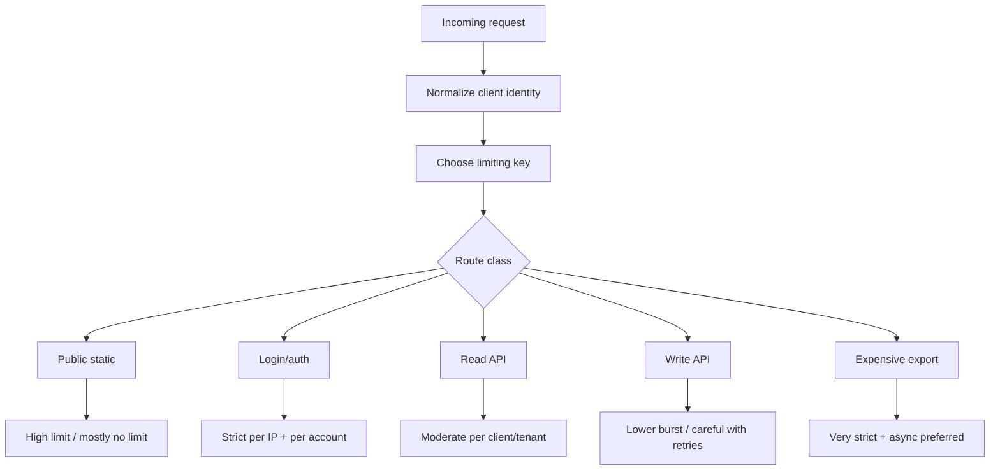
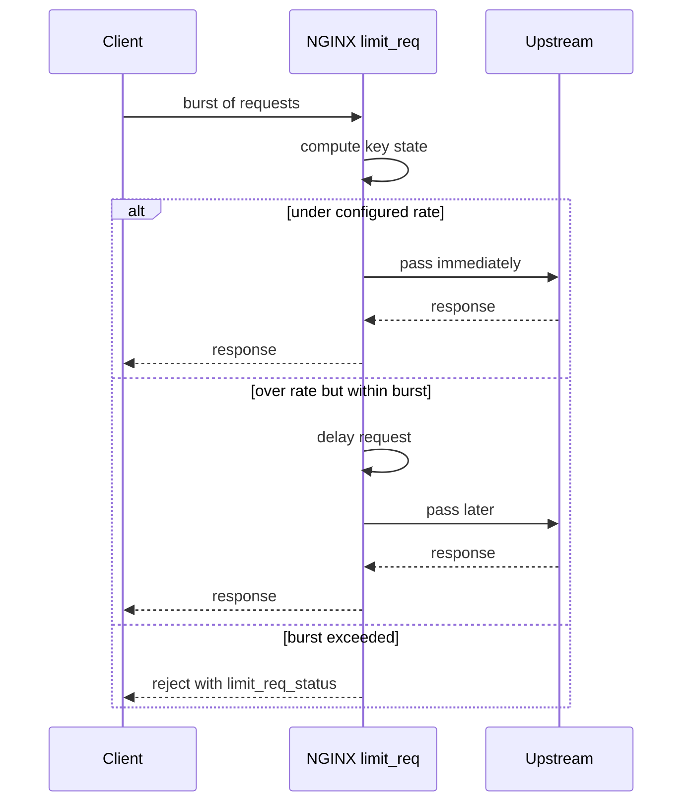
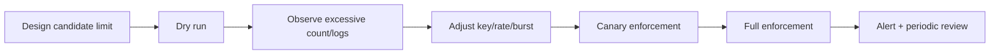
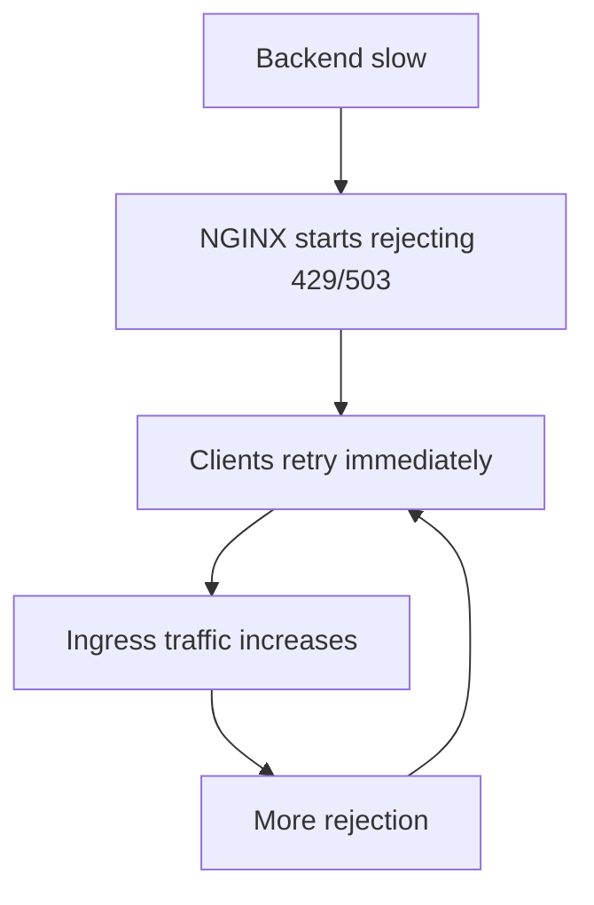
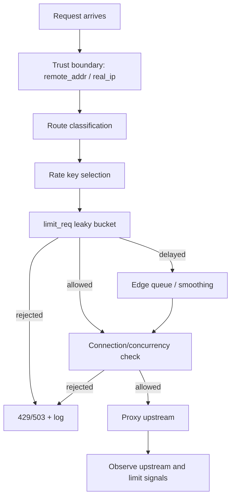

# Part 079 — Rate Limiting and Connection Limiting: Token Bucket at the Edge

Rate limiting di NGINX sering dipakai terlalu dangkal: copy `limit_req_zone $binary_remote_addr zone=one:10m rate=10r/s;`, lalu berharap abuse selesai. Di production, itu berbahaya. Limit yang salah bisa melindungi backend dari bot, tetapi juga bisa menjatuhkan user valid, membuat retry storm, merusak login flow, memblokir NAT korporat, atau menyembunyikan bottleneck aplikasi.

Mental model yang benar: **rate limiting adalah admission control di edge**. Ia bukan authentication, bukan quota accounting penuh, bukan fraud engine, dan bukan pengganti capacity planning. Ia adalah cara NGINX berkata: “untuk key tertentu, request hanya boleh masuk ke pipeline dengan laju tertentu; sisanya ditunda atau ditolak.”

Connection limiting berbeda. Ia bukan mengukur request per detik, tetapi jumlah koneksi/request concurrent untuk key tertentu. Pada HTTP/1.1, koneksi bisa merepresentasikan satu atau beberapa request sequential. Pada HTTP/2 dan HTTP/3, dokumentasi NGINX menyatakan setiap concurrent request dihitung sebagai koneksi terpisah oleh `limit_conn`, sehingga efeknya lebih dekat ke **concurrency limit per stream/request** daripada sekadar TCP socket limit.

> Fakta dasar: `ngx_http_limit_req_module` membatasi request processing rate per key menggunakan metode “leaky bucket”. `ngx_http_limit_conn_module` membatasi jumlah koneksi per key. Keduanya menyimpan state di shared memory zone.

---

## 1. Problem yang sebenarnya diselesaikan

Ada empat problem yang sering dicampur:

1. **Abuse control**  
   Contoh: brute force login, scraping, credential stuffing, endpoint mahal ditembak banyak request.

2. **Overload protection**  
   Contoh: backend Java lambat, queue mulai naik, NGINX perlu membatasi request masuk agar sistem tidak latency-collapse.

3. **Fairness**  
   Contoh: satu tenant atau satu client NAT menghabiskan kapasitas sehingga tenant lain terdampak.

4. **Cost control**  
   Contoh: endpoint report/export mahal perlu dibatasi agar CPU, DB, object storage, atau third-party API tidak terbakar.

NGINX bisa membantu keempatnya, tetapi policy-nya harus berbeda. Jangan memakai satu global limit untuk semua route. Endpoint `/health`, `/assets`, `/login`, `/api/search`, `/api/export`, dan `/webhook/payment` punya semantics berbeda.



---

## 2. `limit_req`: rate, burst, delay, rejection

Core primitive:

```nginx
http {
    limit_req_zone $binary_remote_addr zone=per_ip_api:20m rate=10r/s;

    server {
        location /api/ {
            limit_req zone=per_ip_api burst=20;
            proxy_pass http://app_backend;
        }
    }
}
```

Interpretasinya:

- `$binary_remote_addr` adalah key.
- `zone=per_ip_api:20m` adalah shared memory zone untuk state key.
- `rate=10r/s` adalah laju rata-rata yang diizinkan.
- `burst=20` memberi toleransi lonjakan sementara.
- Tanpa `nodelay`, request berlebih dalam burst dapat ditunda agar keluar sesuai rate.
- Request yang melewati burst ditolak dengan status default `503`, kecuali diubah dengan `limit_req_status`.

### Leaky bucket bukan sekadar “10 request per detik”

Banyak engineer membaca `10r/s` sebagai “boleh tepat 10 request setiap detik kalender”. Bukan begitu cara yang berguna untuk memahami limit ini. Model yang lebih baik:

- NGINX menjaga state per key.
- Request idealnya diproses dengan spacing sesuai rate.
- Burst adalah ruang toleransi antrian kecil.
- Jika antrian virtual terlalu panjang, request ditolak.



---

## 3. `burst`, `nodelay`, dan `delay`: tiga behavior yang sering tertukar

### 3.1 No burst: paling ketat, sering terlalu agresif

```nginx
limit_req_zone $binary_remote_addr zone=strict:10m rate=1r/s;

location /login {
    limit_req zone=strict;
    proxy_pass http://auth_service;
}
```

Dengan `burst=0`, request berlebih ditolak cepat. Ini cocok untuk endpoint sangat sensitif, tetapi mudah merusak user experience bila browser atau mobile app mengirim beberapa request paralel.

### 3.2 Burst dengan delay: smoothing

```nginx
limit_req zone=per_ip_api burst=20;
```

Ini mengizinkan lonjakan sampai 20 request, tetapi request berlebih dapat ditunda agar mengikuti rate. Cocok ketika:

- upstream lebih sensitif terhadap spike daripada latency tambahan;
- client manusia masih bisa menerima sedikit delay;
- endpoint idempotent/read-heavy;
- tujuan utama adalah smoothing, bukan reject.

Risikonya: delay di edge tetap memakai resource koneksi dan worker state. Jika traffic sangat besar, menunda terlalu banyak request bisa berubah menjadi queue build-up.

### 3.3 Burst dengan `nodelay`: absorb burst tanpa smoothing

```nginx
limit_req zone=per_ip_api burst=20 nodelay;
```

Ini mengizinkan burst langsung sampai kapasitas burst. Setelah itu request ditolak sampai state turun. Cocok untuk UX yang butuh burst natural, misalnya initial page load yang memanggil beberapa API, tetapi tetap ingin membatasi abuse berkelanjutan.

Risikonya: upstream tetap menerima burst. Jadi `nodelay` bukan overload smoother; ia lebih cocok sebagai **abuse throttle** daripada **backend protection**.

### 3.4 `delay=N`: hybrid

```nginx
limit_req zone=per_ip_api burst=50 delay=10;
```

Dengan `delay=N`, sebagian request berlebih sampai threshold tertentu bisa lewat tanpa delay, lalu sisanya ditunda. Ini berguna ketika kita ingin memberi toleransi burst kecil, tetapi tetap smoothing untuk burst besar.

---

## 4. Memilih key: keputusan paling penting

Rate limiting bukan terutama tentang angka. Ia tentang **key**.

| Key | Kelebihan | Risiko |
|---|---|---|
| `$binary_remote_addr` | murah, sederhana, cocok untuk public edge | NAT/shared IP bisa false positive; butuh Real IP benar |
| `$server_name:$binary_remote_addr` | memisahkan tenant/host | masih IP-centric |
| `$http_authorization` | bisa user-token centric | raw token sebagai key berisiko memory cardinality/logging; jangan log token |
| `$cookie_session` | dekat dengan user session | spoofable bila belum diverifikasi; cardinality tinggi |
| `$arg_api_key` | cocok untuk API key public | raw secret exposure risk; validasi di app tetap wajib |
| `$tenant_id` dari `map` | fairness per tenant | harus trusted, tidak boleh dari header bebas |
| `$request_uri` + IP | route-specific protection | cardinality bisa meledak jika query tidak dinormalisasi |

### Invariant pemilihan key

Key rate limit harus:

1. **stabil** untuk actor yang sama;
2. **tidak mudah dipalsukan** sebelum trust boundary;
3. **tidak terlalu granular** sampai memory zone penuh oleh cardinality liar;
4. **tidak terlalu kasar** sampai banyak user valid saling memblokir;
5. **tidak mengandung secret mentah** yang masuk log atau dump.

Jika NGINX ada di belakang CDN/load balancer, `$remote_addr` mungkin alamat CDN, bukan client. Maka Part 032 tentang Real IP menjadi prasyarat. Limit berbasis IP tanpa Real IP trust boundary yang benar biasanya useless atau berbahaya.

---

## 5. Route-specific rate policy

Global rate limit jarang benar. Buat policy berdasarkan route class.

```nginx
http {
    limit_req_zone $binary_remote_addr zone=ip_login:20m rate=5r/m;
    limit_req_zone $binary_remote_addr zone=ip_api_read:50m rate=20r/s;
    limit_req_zone $binary_remote_addr zone=ip_api_write:50m rate=5r/s;
    limit_req_zone $binary_remote_addr zone=ip_export:20m rate=2r/m;

    server {
        location = /login {
            limit_req zone=ip_login burst=5 nodelay;
            limit_req_status 429;
            proxy_pass http://auth_backend;
        }

        location /api/read/ {
            limit_req zone=ip_api_read burst=40 nodelay;
            limit_req_status 429;
            proxy_pass http://read_backend;
        }

        location /api/write/ {
            limit_req zone=ip_api_write burst=10;
            limit_req_status 429;
            proxy_pass http://write_backend;
        }

        location /api/export/ {
            limit_req zone=ip_export burst=1 nodelay;
            limit_req_status 429;
            proxy_pass http://export_backend;
        }
    }
}
```

Kenapa `429`? Secara default, NGINX rate limit rejection memakai `503`. Untuk API, `429 Too Many Requests` biasanya lebih semantically correct. Namun jangan ubah tanpa memikirkan client behavior. Beberapa client melakukan aggressive retry pada 429 maupun 503 jika tidak diberi `Retry-After` atau backoff guidance.

---

## 6. Multi-dimensional limiting

NGINX mengizinkan beberapa `limit_req` pada level yang sama. Ini memungkinkan kombinasi, misalnya per-IP dan per-server.

```nginx
http {
    limit_req_zone $binary_remote_addr zone=per_ip:20m rate=10r/s;
    limit_req_zone $server_name zone=per_vhost:10m rate=1000r/s;

    server {
        location /api/ {
            limit_req zone=per_ip burst=20 nodelay;
            limit_req zone=per_vhost burst=200;
            limit_req_status 429;
            proxy_pass http://api_backend;
        }
    }
}
```

Interpretasi:

- satu client tidak boleh melebihi limit per-IP;
- satu virtual host tidak boleh melebihi aggregate ingress rate;
- jika salah satu limit menolak, request gagal.

Ini berguna untuk multi-tenant edge. Tetapi jangan terlalu banyak dimension tanpa observability. Jika request ditolak, Anda harus tahu limit mana yang memicu rejection.

---

## 7. `limit_req_dry_run`: rollout tanpa langsung memblokir

Jangan langsung enable limit baru di production traffic besar. Gunakan dry run.

```nginx
http {
    limit_req_zone $binary_remote_addr zone=api_candidate:50m rate=10r/s;

    server {
        location /api/ {
            limit_req_dry_run on;
            limit_req zone=api_candidate burst=20 nodelay;
            proxy_pass http://api_backend;
        }
    }
}
```

Dry run tidak membatasi request, tetapi tetap menghitung request yang seharusnya excessive dalam shared memory zone. Ini ideal untuk menjawab:

- berapa user valid yang akan terdampak;
- endpoint mana yang paling sering melewati limit;
- apakah NAT/corporate IP akan false positive;
- apakah burst terlalu kecil;
- apakah key terlalu kasar.

Production rollout yang sehat:



---

## 8. Observability untuk rate limiting

Tanpa log, rate limit akan menjadi black box. Minimal, tambahkan route label dan variable relevan.

```nginx
log_format edge_json escape=json
  '{'
    '"ts":"$time_iso8601",'
    '"remote_addr":"$remote_addr",'
    '"realip":"$realip_remote_addr",'
    '"host":"$host",'
    '"method":"$request_method",'
    '"uri":"$uri",'
    '"status":$status,'
    '"request_time":$request_time,'
    '"route_class":"$route_class",'
    '"limit_key":"$limit_key_label",'
    '"upstream_status":"$upstream_status",'
    '"upstream_response_time":"$upstream_response_time"'
  '}';

map $uri $route_class {
    default "unknown";
    ~^/login$ "login";
    ~^/api/read/ "api_read";
    ~^/api/write/ "api_write";
    ~^/api/export/ "export";
}

map $route_class $limit_key_label {
    default "ip";
}
```

NGINX tidak memberi variable built-in yang langsung mengatakan “limit zone X menolak request Y” dalam access log biasa. Karena itu:

- set status berbeda per kategori bila perlu;
- gunakan `limit_req_log_level`;
- gunakan separate location/policy yang jelas;
- pakai dry run untuk tuning;
- korelasikan spike 429/503 dengan route, host, client, dan upstream pressure.

Contoh log level:

```nginx
limit_req_log_level warn;
limit_conn_log_level warn;
```

---

## 9. `limit_conn`: concurrency guard

Rate membatasi laju. Connection limiting membatasi concurrency.

```nginx
http {
    limit_conn_zone $binary_remote_addr zone=conn_per_ip:20m;
    limit_conn_zone $server_name zone=conn_per_host:10m;

    server {
        location /download/ {
            limit_conn conn_per_ip 4;
            limit_conn conn_per_host 1000;
            limit_conn_status 429;
            proxy_pass http://download_backend;
        }
    }
}
```

Gunakan `limit_conn` untuk:

- download besar;
- streaming-like endpoint;
- long polling;
- expensive report generation;
- route yang bisa menahan worker/upstream connection lama;
- mencegah satu actor memakan concurrency pool.

Jangan gunakan `limit_conn` secara membabi buta untuk semua API modern. Pada HTTP/2/HTTP/3, tiap concurrent request dihitung sebagai koneksi oleh module ini. Jika browser membuka banyak stream valid, limit terlalu rendah bisa memotong traffic normal.

---

## 10. Rate limit vs connection limit: kapan pakai yang mana?

| Problem | Primitive utama | Catatan |
|---|---|---|
| Banyak request kecil cepat | `limit_req` | login brute force, API scrape |
| Sedikit request lama menahan resource | `limit_conn` | download, export, streaming |
| Backend latency naik karena queue | `limit_req` + timeout | reject lebih baik daripada infinite queue |
| Satu client membuka banyak stream HTTP/2 | `limit_conn` hati-hati | hitung concurrent request, bukan hanya socket |
| Tenant mahal menghabiskan aggregate capacity | `limit_req` per tenant + per host | key harus trusted |
| API write risk duplicate/retry | `limit_req` tanpa delay berlebihan | pastikan client backoff |

---

## 11. NAT, mobile network, dan corporate proxy trap

Limit per IP tampak sederhana, tapi IP bukan user identity. Banyak user bisa keluar dari IP yang sama:

- kantor besar;
- ISP mobile carrier-grade NAT;
- kampus;
- hotel;
- payment provider callback;
- enterprise proxy.

Jika Anda menetapkan limit `/login` `5r/m` per IP, satu kantor bisa saling memblokir. Solusi yang lebih defensible:

- kombinasikan per-IP dengan per-account/email hash di application layer;
- gunakan stricter limit hanya setelah failed login;
- whitelist trusted partner callback IP dengan governance;
- bedakan anonymous endpoint vs authenticated endpoint;
- jangan menganggap IP = actor.

NGINX bisa menjadi edge throttle awal, tetapi user-aware quota sering tetap harus di aplikasi atau dedicated API gateway/quota service.

---

## 12. Designing limit numbers from capacity

Jangan mulai dari angka random. Mulai dari capacity dan SLO.

Misal:

- backend `/api/search` stabil di 800 RPS total;
- target edge admission 600 RPS agar ada headroom;
- 95% traffic berasal dari authenticated users;
- anonymous search dibatasi lebih ketat;
- satu IP corporate bisa membawa 200 user.

Maka policy bisa:

```nginx
limit_req_zone $binary_remote_addr zone=anon_search_ip:50m rate=2r/s;
limit_req_zone $server_name zone=search_host:10m rate=600r/s;

location /api/search {
    limit_req zone=anon_search_ip burst=10 nodelay;
    limit_req zone=search_host burst=300;
    limit_req_status 429;
    proxy_pass http://search_backend;
}
```

Tetapi untuk authenticated traffic, per-IP saja mungkin tidak cukup. Better pattern:

- app/gateway memverifikasi identity;
- edge menerima trusted identity header hanya dari internal auth layer;
- limit per tenant/user di layer yang bisa mempercayai identity;
- NGINX tetap melakukan outer per-IP abuse guard.

---

## 13. Retry amplification: musuh tersembunyi

Rate limiting bisa memperburuk overload jika client melakukan retry agresif.



Mitigasi:

- gunakan `429` untuk client yang mengerti rate limit;
- tambahkan `Retry-After` pada route tertentu;
- dokumentasikan client backoff;
- jangan gunakan retry otomatis tanpa jitter;
- jangan rate-limit webhook provider tanpa memahami retry policy provider;
- untuk mobile/client lama, uji behavior saat menerima 429/503.

Contoh `Retry-After` sederhana:

```nginx
location /api/export/ {
    limit_req zone=ip_export burst=1 nodelay;
    limit_req_status 429;
    add_header Retry-After "60" always;
    proxy_pass http://export_backend;
}
```

Jangan tambahkan `Retry-After` global jika semua route punya recovery semantics berbeda.

---

## 14. Partner webhook dan callback: jangan disamakan dengan user traffic

Webhook payment, logistics, identity provider, atau notification provider sering punya pola burst unik. Rate limit yang salah bisa menyebabkan:

- event delivery tertunda;
- provider retry storm;
- duplicate event;
- state machine bisnis kacau;
- reconciliation mahal.

Pattern lebih aman:

```nginx
geo $trusted_partner_ip {
    default 0;
    203.0.113.0/24 1;
    198.51.100.10 1;
}

map $trusted_partner_ip $webhook_limit_zone_enabled {
    1 "trusted_partner";
    0 "public";
}
```

Namun jangan berhenti di IP allowlist. Webhook tetap harus diverifikasi dengan signature di aplikasi. NGINX hanya admission guard, bukan source-of-truth authorization.

---

## 15. Memory zone sizing dan cardinality

`limit_req_zone` dan `limit_conn_zone` menyimpan state di shared memory. Key cardinality liar bisa membuat zone penuh.

Bad idea:

```nginx
limit_req_zone $request_uri zone=by_uri:10m rate=1r/s;
```

Kenapa buruk?

- Query unik membuat key unik.
- Attacker bisa membuat jutaan URI berbeda.
- Zone cepat penuh.
- Limit menjadi tidak efektif.

Lebih aman:

```nginx
map $uri $route_class {
    default "other";
    ~^/api/search$ "search";
    ~^/api/export$ "export";
}

limit_req_zone "$binary_remote_addr:$route_class" zone=ip_route:50m rate=10r/s;
```

Gunakan low-cardinality route label, bukan raw URI/query, kecuali Anda benar-benar memahami cardinality dan memory budget.

---

## 16. Layering dengan upstream `max_conns`

Rate limit menjaga ingress. Upstream `max_conns` menjaga active connection ke backend tertentu.

```nginx
upstream app_backend {
    zone app_backend 64k;
    server 10.0.1.10:8080 max_conns=200;
    server 10.0.1.11:8080 max_conns=200;
    keepalive 64;
}

server {
    location /api/ {
        limit_req zone=per_ip_api burst=20 nodelay;
        proxy_http_version 1.1;
        proxy_set_header Connection "";
        proxy_pass http://app_backend;
    }
}
```

`max_conns` bukan pengganti `limit_req`. Ia mengontrol concurrency ke upstream server, bukan ingress fairness per actor. Jika semua upstream mencapai limit, request bisa queue/fail bergantung konfigurasi dan runtime state.

---

## 17. Safe baseline config

Berikut baseline yang lebih realistis untuk API edge:

```nginx
http {
    # Real IP must be configured correctly before IP-based limiting.
    # set_real_ip_from 10.0.0.0/8;
    # real_ip_header X-Forwarded-For;
    # real_ip_recursive on;

    map $uri $route_class {
        default "other";
        ~^/login$ "login";
        ~^/api/read/ "api_read";
        ~^/api/write/ "api_write";
        ~^/api/export/ "export";
    }

    limit_req_zone "$binary_remote_addr:login" zone=ip_login:20m rate=5r/m;
    limit_req_zone "$binary_remote_addr:read" zone=ip_read:50m rate=20r/s;
    limit_req_zone "$binary_remote_addr:write" zone=ip_write:50m rate=5r/s;
    limit_req_zone "$binary_remote_addr:export" zone=ip_export:20m rate=2r/m;

    limit_conn_zone $binary_remote_addr zone=conn_ip:20m;

    server {
        listen 443 ssl http2;
        server_name api.example.com;

        limit_req_status 429;
        limit_conn_status 429;
        limit_req_log_level warn;
        limit_conn_log_level warn;

        location = /login {
            limit_req zone=ip_login burst=5 nodelay;
            proxy_pass http://auth_backend;
        }

        location /api/read/ {
            limit_req zone=ip_read burst=40 nodelay;
            proxy_pass http://read_backend;
        }

        location /api/write/ {
            limit_req zone=ip_write burst=10;
            proxy_pass http://write_backend;
        }

        location /api/export/ {
            limit_req zone=ip_export burst=1 nodelay;
            limit_conn conn_ip 2;
            add_header Retry-After "60" always;
            proxy_pass http://export_backend;
        }
    }
}
```

---

## 18. Failure modes

### 18.1 False positive karena Real IP salah

Symptom:

- semua request terlihat dari satu IP load balancer;
- rate limit menolak traffic normal;
- access log menunjukkan `$remote_addr` sama untuk semua client.

Fix:

- perbaiki `set_real_ip_from` hanya untuk trusted proxy;
- jangan percaya `X-Forwarded-For` dari internet;
- log `$remote_addr`, `$realip_remote_addr`, dan forwarded chain saat rollout.

### 18.2 NAT besar terkena limit

Symptom:

- user dari kantor/operator tertentu banyak kena 429;
- traffic lain normal.

Fix:

- naikkan burst untuk route tertentu;
- gunakan app-level account/user limiting;
- kombinasikan per-IP dengan per-route aggregate;
- jangan terlalu ketat untuk endpoint normal.

### 18.3 Retry storm setelah 429

Symptom:

- 429 naik;
- ingress RPS ikut naik, bukan turun;
- client retry tanpa backoff.

Fix:

- `Retry-After` untuk route tertentu;
- dokumentasi client SDK;
- circuit breaker/backoff di caller;
- temporarily raise limit atau shed lebih awal dengan message jelas.

### 18.4 Zone cardinality explosion

Symptom:

- error log menunjukkan shared memory zone pressure;
- limit tidak efektif;
- high-cardinality key dari URI/query/header liar.

Fix:

- ubah key ke low-cardinality normalized route label;
- tambah zone size hanya setelah key benar;
- block suspicious query explosion di WAF/app layer.

---

## 19. Testing plan

### Smoke test dengan curl loop

```bash
for i in $(seq 1 30); do
  curl -s -o /dev/null -w "%{http_code}\n" https://api.example.com/api/export/
done
```

Expected:

- beberapa request awal lewat sesuai `burst`;
- request berikutnya 429;
- access/error log mencatat limiting;
- upstream tidak menerima seluruh burst liar.

### Concurrency test

```bash
seq 1 20 | xargs -n1 -P20 -I{} curl -s -o /dev/null -w "%{http_code}\n" https://api.example.com/download/big-file
```

Expected:

- concurrency di atas `limit_conn` ditolak;
- backend active connection tidak melonjak tanpa batas.

### Dry-run rollout metric

Langkah:

1. enable `limit_req_dry_run on`;
2. kirim production traffic normal;
3. observe excessive events selama minimal satu traffic cycle;
4. identifikasi NAT/corporate false positive;
5. adjust rate/burst/key;
6. enable enforcement di canary host atau subset tenant.

---

## 20. Review checklist

Sebelum approve rate/connection limiting config, tanyakan:

- Apakah Real IP sudah benar?
- Apakah key bisa dipalsukan client?
- Apakah key cardinality terkendali?
- Apakah route policy berbeda untuk login/read/write/export/webhook?
- Apakah status rejection sudah sesuai, misalnya 429 untuk API?
- Apakah `Retry-After` perlu dan aman?
- Apakah ada dry-run phase?
- Apakah NAT/corporate/mobile false positive diuji?
- Apakah HTTP/2/HTTP/3 concurrency effect dipahami untuk `limit_conn`?
- Apakah alert membedakan overload asli vs abusive actor?
- Apakah client retry behavior diketahui?
- Apakah policy ini didokumentasikan sebagai edge admission control, bukan business quota source of truth?

---

## 21. Mental model final



Rate limiting yang bagus bukan config yang paling ketat. Rate limiting yang bagus adalah config yang mempertahankan system stability, mengurangi abuse, menjaga fairness, dan tetap tidak menghukum traffic valid secara diam-diam.

---

## References

- NGINX official documentation — `ngx_http_limit_req_module`: https://nginx.org/en/docs/http/ngx_http_limit_req_module.html
- NGINX official documentation — `ngx_http_limit_conn_module`: https://nginx.org/en/docs/http/ngx_http_limit_conn_module.html
- NGINX official documentation — `ngx_http_realip_module`: https://nginx.org/en/docs/http/ngx_http_realip_module.html
- NGINX official documentation — `ngx_http_upstream_module`: https://nginx.org/en/docs/http/ngx_http_upstream_module.html
