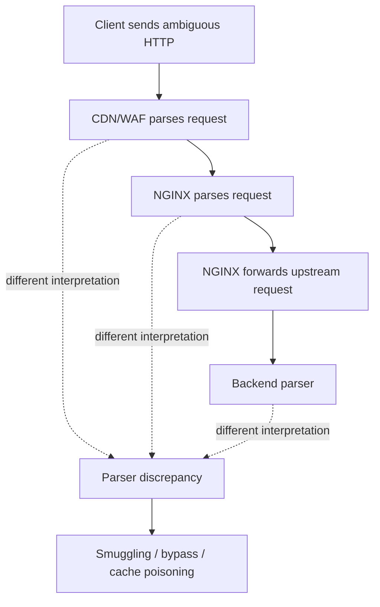
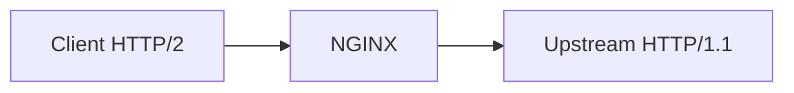
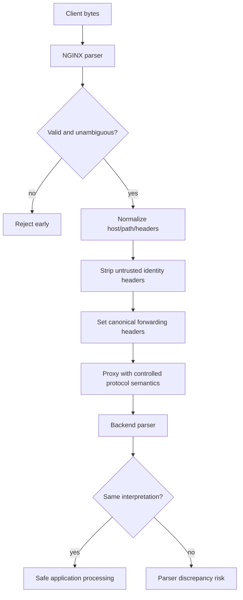

# Part 080 — Header Normalization, Request Smuggling Defense, and Proxy Ambiguity

Request smuggling bukan sekadar “ada header aneh”. Ini adalah class vulnerability yang muncul ketika beberapa komponen dalam request path **tidak sepakat** tentang batas request, nama header, ukuran header, method, path, atau framing body. Di arsitektur modern, request sering melewati CDN, load balancer, WAF, NGINX, service mesh, API gateway, dan backend framework. Setiap hop punya parser dan aturan normalisasi sendiri.

Mental model yang benar: **reverse proxy adalah parser boundary**. Begitu NGINX menerima request, ia tidak hanya meneruskan byte. Ia membaca request line, header, body framing, memilih virtual server/location, menerapkan policy, lalu membuat request baru ke upstream. Jika apa yang dianggap valid oleh NGINX berbeda dari apa yang dianggap valid oleh upstream, attacker bisa mencari celah di antara keduanya.

OWASP mendeskripsikan HTTP Request Smuggling sebagai vulnerability akibat inkonsistensi cara frontend dan backend mem-parse request. PortSwigger juga menekankan bahwa chain frontend reverse proxy + backend adalah lokasi umum problem ini, terutama ketika request dikirim berurutan melalui koneksi upstream yang dipakai ulang.

---

## 1. The invariant: one request must mean one request

Untuk edge yang aman, invariant-nya sederhana tetapi keras:

> Satu request yang diterima NGINX harus diterjemahkan menjadi satu request yang jelas ke upstream, dengan boundary, header identity, scheme, host, method, path, dan body length yang tidak ambigu.

Jika invariant ini gagal, dampaknya bisa luas:

- bypass authentication;
- bypass WAF/rate limit;
- cache poisoning;
- stealing response user lain;
- request desync;
- hidden request masuk ke backend;
- audit log tidak merekam request yang benar;
- upstream membaca body sebagai request berikutnya.



---

## 2. Why NGINX is not automatically enough

NGINX is robust, but security is not a property of one component only. Request smuggling happens at the **composition boundary**:

- CDN accepts something NGINX rejects.
- NGINX accepts something backend interprets differently.
- WAF normalizes path differently from NGINX.
- NGINX forwards HTTP/1.1 to a backend with different `Content-Length` behavior.
- Backend framework treats duplicate headers differently.
- Service mesh rewrites `Host` or `X-Forwarded-*` differently.

Therefore, hardening must be end-to-end:

1. reject invalid input early;
2. normalize once at the edge;
3. strip untrusted forwarding headers;
4. set canonical headers explicitly;
5. avoid ambiguous upstream protocol behavior;
6. align buffer/header limits across layers;
7. test with malicious and malformed requests.

---

## 3. Request line and header size limits

Large headers are not only a performance issue. They are parser pressure. NGINX core module exposes relevant controls:

```nginx
http {
    client_header_buffer_size 1k;
    large_client_header_buffers 4 8k;
    client_header_timeout 10s;
}
```

Important behavior:

- `client_header_buffer_size` handles normal request headers.
- If request line or header field does not fit, NGINX allocates larger buffers from `large_client_header_buffers`.
- If request line exceeds one large buffer, NGINX returns `414 Request-URI Too Large`.
- If a single header field exceeds one large buffer, NGINX returns `400 Bad Request`.
- Buffers are allocated on demand.

Do not simply raise these values because some client has a huge cookie. Huge cookies may indicate broken application state, tracking bloat, or an attack vector. If you raise edge limits, ensure upstream servers also have compatible but not dangerously larger limits. A mismatch where NGINX allows more than upstream can trigger weird failures; a mismatch where upstream allows ambiguous content NGINX transforms may create security gaps.

---

## 4. Invalid header names and underscores

Two directives matter:

```nginx
http {
    ignore_invalid_headers on;
    underscores_in_headers off;
}
```

Default stance is defensive:

- `underscores_in_headers off` means request header fields containing underscores are marked invalid.
- With `ignore_invalid_headers on`, invalid headers are ignored.

This matters because header naming differences can create bypasses. Example:

- Edge policy checks `X-Auth-User`.
- Backend framework also accepts `X_Auth_User` or maps both to the same environment variable.
- Attacker sends underscore variant to bypass edge checks but influence backend.

Unless you have a strong compatibility reason, keep underscores disabled at the public edge. If an upstream/vendor requires underscores, isolate it in a dedicated server/location with explicit documentation, tests, and no security-sensitive interpretation based on those headers.

Bad broad compatibility toggle:

```nginx
# Dangerous as a global public-edge default.
underscores_in_headers on;
ignore_invalid_headers off;
```

Safer pattern:

```nginx
# Public edge default.
ignore_invalid_headers on;
underscores_in_headers off;

server {
    server_name public-api.example.com;
    # no underscore headers accepted
}

server {
    server_name legacy-vendor.example.com;
    # Exception only when required and isolated.
    underscores_in_headers on;
    # Document why, who owns it, and when it expires.
}
```

---

## 5. Virtual server selection timing trap

Some directives are involved before the final virtual server is selected. NGINX documentation notes that directives such as `client_header_buffer_size`, `merge_slashes`, `ignore_invalid_headers`, `large_client_header_buffers`, and `underscores_in_headers` can depend on default server/SNI/request line/Host processing timing.

Operational consequence:

> Put parser/security baseline directives in the default server and/or `http` context, not only in a later named virtual host.

If your default 443 server is permissive but your named `api.example.com` server is strict, an attacker may hit behavior during early parsing that uses default-server settings before Host-based selection completes.

Safer baseline:

```nginx
http {
    ignore_invalid_headers on;
    underscores_in_headers off;
    client_header_buffer_size 1k;
    large_client_header_buffers 4 8k;
    merge_slashes on;

    server {
        listen 443 ssl default_server;
        server_name _;
        return 444;
    }

    server {
        listen 443 ssl;
        server_name api.example.com;
        # app config here
    }
}
```

---

## 6. Duplicate and conflicting headers

HTTP allows repeated header fields in many cases, but not all duplicated headers are semantically safe. Security-sensitive headers should not be trusted from the client:

- `X-Forwarded-For`
- `X-Forwarded-Proto`
- `X-Forwarded-Host`
- `X-Real-IP`
- `Forwarded`
- `X-Auth-User`
- `X-User-Id`
- `X-Request-Id` if used as security/audit source
- `X-Original-URI`
- `X-Rewrite-URL`

At the edge, strip or overwrite.

```nginx
location /api/ {
    proxy_set_header Host $host;
    proxy_set_header X-Real-IP $remote_addr;
    proxy_set_header X-Forwarded-For $proxy_add_x_forwarded_for;
    proxy_set_header X-Forwarded-Proto $scheme;

    # Do not forward client-supplied identity headers.
    proxy_set_header X-Auth-User "";
    proxy_set_header X-User-Id "";
    proxy_set_header X-Original-URI "";
    proxy_set_header X-Rewrite-URL "";

    proxy_pass http://app_backend;
}
```

Important nuance: `proxy_set_header Header "";` prevents the field from being passed to the proxied server. This is useful for removing untrusted inbound headers.

---

## 7. `Host`, `$host`, `$http_host`, and upstream authority

Host normalization is central to request smuggling, cache poisoning, routing bugs, and password reset link poisoning.

Do not blindly forward raw `$http_host` to upstream unless your contract requires exact original Host including port and casing.

Common safer pattern:

```nginx
server {
    listen 443 ssl;
    server_name api.example.com;

    if ($host != "api.example.com") {
        return 444;
    }

    location / {
        proxy_set_header Host api.example.com;
        proxy_set_header X-Forwarded-Host api.example.com;
        proxy_set_header X-Forwarded-Proto https;
        proxy_pass http://app_backend;
    }
}
```

But avoid `if` unless you understand rewrite-phase semantics. A cleaner approach is default server sinkhole + exact `server_name` routing. For multi-tenant dynamic host systems, use an explicit host registry via `map`, not arbitrary host forwarding.

```nginx
map $host $known_host {
    default 0;
    api.example.com 1;
    admin.example.com 1;
}

server {
    listen 443 ssl;
    server_name api.example.com admin.example.com;

    if ($known_host = 0) { return 444; }

    location / {
        proxy_set_header Host $host;
        proxy_pass http://app_backend;
    }
}
```

If upstream uses Host to generate absolute URLs, tenant identity, cache key, callback URLs, or auth audience, Host must be treated as security-relevant data.

---

## 8. Request body framing: Content-Length vs Transfer-Encoding

Classic HTTP request smuggling often depends on disagreement about body length:

- frontend uses `Content-Length`;
- backend uses `Transfer-Encoding: chunked`;
- or vice versa;
- extra bytes become the start of a hidden next request.

NGINX parses client requests and creates upstream requests. But risk remains when:

- NGINX forwards to an HTTP/1.1 upstream;
- keepalive upstream connections are reused;
- backend parser differs;
- nonstandard clients send malformed framing;
- intermediate hops normalize differently.

Defensive guidance:

- keep NGINX updated;
- reject invalid requests at the edge;
- avoid permissive parser toggles;
- avoid forwarding raw hop-by-hop headers;
- ensure upstream servers/frameworks are patched;
- align proxy/backend HTTP versions and parsing limits;
- test CL/TE ambiguity with security tools in staging.

Do not add client-supplied `Transfer-Encoding` or `Connection` headers to upstream manually. Let NGINX construct the upstream request unless you have a very specific protocol reason.

---

## 9. Hop-by-hop headers

Hop-by-hop headers apply to one transport connection, not end-to-end request semantics. They include headers such as:

- `Connection`
- `Keep-Alive`
- `Transfer-Encoding`
- `TE`
- `Trailer`
- `Upgrade`

For normal HTTP reverse proxying, be explicit and conservative.

```nginx
location /api/ {
    proxy_http_version 1.1;
    proxy_set_header Connection "";
    proxy_pass http://app_backend;
}
```

For WebSocket, the exception is deliberate:

```nginx
map $http_upgrade $connection_upgrade {
    default upgrade;
    '' close;
}

location /ws/ {
    proxy_http_version 1.1;
    proxy_set_header Upgrade $http_upgrade;
    proxy_set_header Connection $connection_upgrade;
    proxy_pass http://websocket_backend;
}
```

Do not copy the WebSocket header pattern into normal API locations. It changes connection semantics and can increase ambiguity.

---

## 10. Path normalization and `merge_slashes`

Path discrepancies can bypass routing/security rules:

- `/admin`
- `//admin`
- `/./admin`
- `/foo/../admin`
- encoded slash variants
- mixed normalization by WAF/proxy/app

NGINX has `merge_slashes on` by default. It compresses multiple adjacent slashes in URI. This helps prefix/regex location matching be more predictable. Turning it off can be required for specific legacy apps or base64-like paths, but it should be treated as a security-sensitive exception.

Dangerous pattern:

```nginx
# Allows // ambiguity in routing if app/proxy disagree.
merge_slashes off;
```

Safer stance:

```nginx
merge_slashes on;

location /admin/ {
    # security policy here
}
```

But slash merging does not solve all normalization. Your upstream framework may still interpret encoded path segments differently. When edge and app both make authorization decisions based on path, you need tests that compare normalized path as seen by each layer.

---

## 11. `absolute_redirect`, redirects, and host poisoning

If NGINX or upstream emits absolute redirects using untrusted Host, attacker may poison links.

Review:

```nginx
server_name_in_redirect off;
port_in_redirect off;
absolute_redirect on;
```

For canonical redirects, prefer explicit host:

```nginx
server {
    listen 80;
    server_name example.com www.example.com;

    return 301 https://example.com$request_uri;
}
```

Avoid:

```nginx
return 301 https://$http_host$request_uri;
```

Raw `$http_host` is client-controlled. `$host` is normalized by NGINX but still must be used within a known-host server selection model.

---

## 12. Cache poisoning tie-in

Header ambiguity and Host ambiguity can poison cache.

Example bad cache key:

```nginx
proxy_cache_key "$scheme$request_uri";
```

This omits host. Multi-host edge can leak or poison content across hosts.

Better:

```nginx
proxy_cache_key "$scheme:$host:$request_method:$uri:$is_args$args";
```

But even this is not enough if upstream varies response based on headers not included in key:

- `Accept-Encoding`
- `Authorization`
- `Cookie`
- `X-Forwarded-Host`
- `X-Original-URL`
- language/device headers

As learned in Part 062, cache key must represent all response-changing dimensions, or those dimensions must be rejected/normalized.

---

## 13. WAF and auth bypass via parser discrepancy

A classic failure:

1. WAF checks one representation of path/header/body.
2. NGINX routes another representation.
3. Backend authorizes a third representation.

This can happen with:

- duplicated headers;
- mixed casing;
- underscores vs hyphens;
- encoded characters;
- multipart boundary parsing;
- JSON parser differences;
- `Content-Type` confusion;
- path normalization differences.

NGINX should not be the only layer deciding app authorization for complex business routes. Use NGINX for coarse edge controls, and keep authoritative authorization in the application/domain layer.

---

## 14. Public edge hardening baseline

A conservative baseline for public HTTP reverse proxy:

```nginx
http {
    # Parser hardening baseline.
    ignore_invalid_headers on;
    underscores_in_headers off;
    merge_slashes on;
    client_header_buffer_size 1k;
    large_client_header_buffers 4 8k;
    client_header_timeout 10s;
    client_body_timeout 30s;
    client_max_body_size 10m;
    server_tokens off;

    log_format security_json escape=json
      '{'
        '"ts":"$time_iso8601",'
        '"remote_addr":"$remote_addr",'
        '"host":"$host",'
        '"request":"$request",'
        '"method":"$request_method",'
        '"uri":"$uri",'
        '"args":"$args",'
        '"status":$status,'
        '"request_length":$request_length,'
        '"body_bytes_sent":$body_bytes_sent,'
        '"http2":"$http2",'
        '"upstream_addr":"$upstream_addr",'
        '"upstream_status":"$upstream_status"'
      '}';

    server {
        listen 80 default_server;
        server_name _;
        return 444;
    }

    server {
        listen 443 ssl default_server;
        server_name _;
        return 444;
    }

    server {
        listen 443 ssl http2;
        server_name api.example.com;

        access_log /var/log/nginx/api-security.log security_json;

        location / {
            proxy_http_version 1.1;
            proxy_set_header Connection "";

            # Canonical upstream authority and client context.
            proxy_set_header Host api.example.com;
            proxy_set_header X-Forwarded-Host api.example.com;
            proxy_set_header X-Forwarded-Proto https;
            proxy_set_header X-Forwarded-For $proxy_add_x_forwarded_for;
            proxy_set_header X-Real-IP $remote_addr;

            # Strip untrusted identity/routing override headers.
            proxy_set_header X-Auth-User "";
            proxy_set_header X-User-Id "";
            proxy_set_header X-Original-URI "";
            proxy_set_header X-Rewrite-URL "";
            proxy_set_header X-Forwarded-Server "";

            proxy_pass http://app_backend;
        }
    }
}
```

This is not universal. It is a starting point. Legacy apps, WebSocket, gRPC, CDN integration, and multi-tenant hosts require deliberate exceptions.

---

## 15. Smuggling-aware upstream keepalive

Upstream keepalive improves performance, but request smuggling risk is about desynchronization on reused connections. That does not mean “disable keepalive everywhere”. It means:

- keep parsers patched;
- avoid ambiguous request forwarding;
- do not forward hop-by-hop headers blindly;
- test CL/TE mismatch;
- monitor 400/408/499/502 anomalies;
- isolate high-risk legacy upstreams.

For a legacy backend with suspicious HTTP parsing behavior, you may choose to disable upstream keepalive temporarily while investigating:

```nginx
location /legacy/ {
    proxy_http_version 1.0;
    proxy_set_header Connection close;
    proxy_pass http://legacy_backend;
}
```

This is a mitigation, not a root fix. The correct fix is parser alignment and patching.

---

## 16. HTTP/2 front, HTTP/1.1 back

Many deployments expose HTTP/2 to clients but proxy HTTP/1.1 to upstream. This creates translation boundaries:



Risk areas:

- HTTP/2 pseudo-headers to HTTP/1.1 authority/path;
- duplicated pseudo/header representation;
- header normalization and lowercase behavior;
- large decompressed header lists;
- backend assumptions about connection reuse.

Defensive stance:

- keep NGINX current;
- set strict header buffer limits;
- avoid exotic proxy header forwarding;
- use gRPC module for gRPC, not generic proxy hacks;
- test HTTP/2-specific desync cases in staging.

---

## 17. Testing request smuggling defenses

Do not test this casually against production. Use controlled staging.

### 17.1 What to test

- conflicting `Content-Length` headers;
- `Content-Length` + `Transfer-Encoding` ambiguity;
- malformed chunked body;
- duplicate `Host`;
- invalid header names;
- underscore vs hyphen headers;
- huge header field;
- huge request line;
- encoded path bypass attempts;
- `//admin` vs `/admin`;
- client-supplied `X-Forwarded-*` spoofing;
- raw `X-Original-URI`/`X-Rewrite-URL` influence;
- HTTP/2 to HTTP/1.1 translation cases.

### 17.2 Expected safe behavior

- malformed request rejected at edge;
- no hidden request reaches upstream;
- upstream access log agrees with NGINX request count;
- security-sensitive headers are stripped/overwritten;
- cache key does not include untrusted ambiguous dimensions;
- 400/414/431-like behavior is consistent with policy;
- no response queue desynchronization.

### 17.3 Log correlation pattern

During tests, log at both NGINX and upstream:

- request id;
- connection id;
- method;
- normalized URI;
- raw-ish request target if available;
- host;
- content length;
- transfer encoding if available;
- upstream status;
- request time.

If NGINX logs one request but upstream logs two, stop and investigate.

---

## 18. Incident playbook

### Symptom: suspected request smuggling or desync

Indicators:

- users receive other users' responses;
- cache contains impossible content;
- WAF says blocked but backend logs show processed request;
- upstream logs request not visible in NGINX logs;
- spike in 400/408/499/502 around malformed traffic;
- strange `Host` or forwarded header values in app logs.

Immediate actions:

1. disable upstream keepalive for suspected legacy route if desync likely;
2. isolate route or return maintenance response if data exposure risk exists;
3. bypass/disable cache for affected route;
4. capture sanitized packet/log evidence;
5. compare NGINX access log vs upstream log request counts;
6. block suspicious header/path patterns temporarily;
7. patch NGINX/upstream/WAF if known CVE or parser bug applies;
8. rotate affected cache keys or purge contaminated cache;
9. perform data exposure assessment.

Do not only add a regex block and declare solved. Parser discrepancy is systemic.

---

## 19. Review checklist

Before approving reverse proxy config exposed to public traffic:

- Is there a strict default server for unknown hosts?
- Are invalid headers ignored?
- Are underscores disabled unless explicitly required?
- Are parser directives set at `http`/default-server level, not only named vhost?
- Are large header/request-line limits intentional and aligned with upstream?
- Are client-supplied identity headers stripped or overwritten?
- Is `Host` forwarding canonical and safe?
- Are `X-Forwarded-*` headers trusted only from known proxies?
- Are hop-by-hop headers not blindly forwarded?
- Are WebSocket upgrade headers isolated to WebSocket locations?
- Is path normalization behavior understood between NGINX and app?
- Is cache key protected from Host/header poisoning?
- Are HTTP/2/HTTP/1.1 translation risks tested?
- Does staging include request smuggling tests?
- Is there an incident playbook for parser discrepancy?

---

## 20. Mental model final



The top-1% habit here is not memorizing one “secure NGINX snippet”. It is treating NGINX as a parser and normalization boundary. Every directive that changes header validity, path normalization, host forwarding, buffer limit, or upstream protocol behavior changes the contract between layers.

Security lives in that contract.

---

## References

- NGINX official documentation — `ngx_http_core_module`: https://nginx.org/en/docs/http/ngx_http_core_module.html
- NGINX official documentation — Server names and virtual server selection: https://nginx.org/en/docs/http/server_names.html
- NGINX official documentation — `ngx_http_proxy_module`: https://nginx.org/en/docs/http/ngx_http_proxy_module.html
- OWASP Web Security Testing Guide — Testing for HTTP Request Smuggling: https://owasp.org/www-project-web-security-testing-guide/latest/4-Web_Application_Security_Testing/07-Input_Validation_Testing/16-Testing_for_HTTP_Request_Smuggling
- PortSwigger Web Security Academy — HTTP Request Smuggling: https://portswigger.net/web-security/request-smuggling
