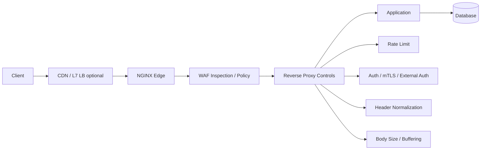
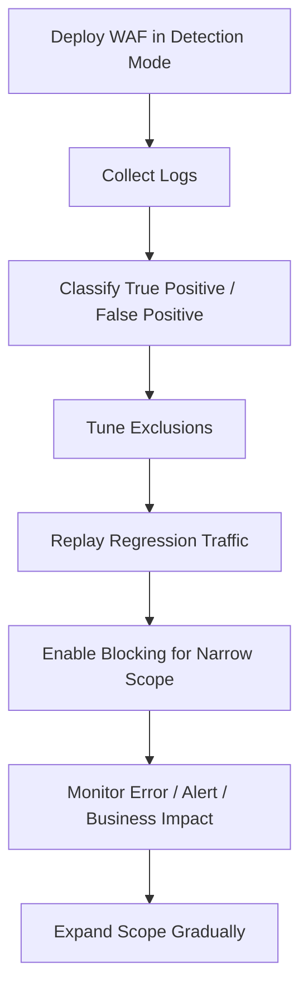
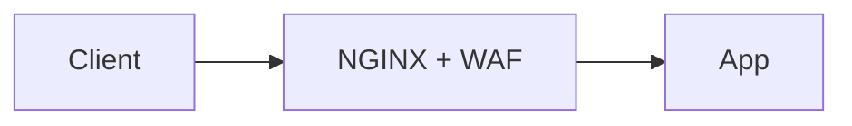
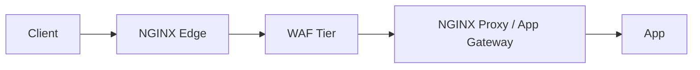
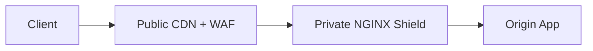
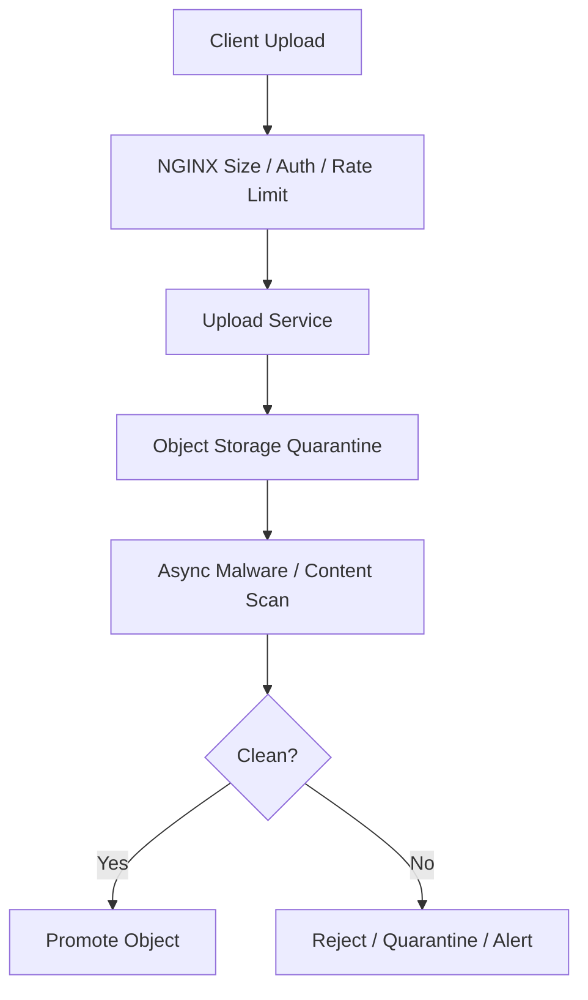
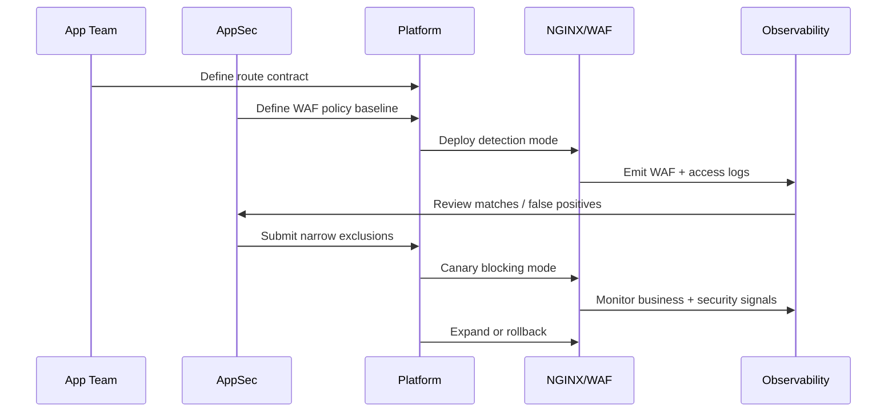
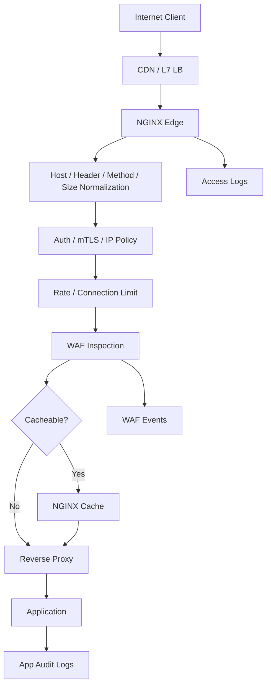

# Part 081 — WAF Options: ModSecurity, F5 WAF, Plus, and Realistic Boundaries

WAF sering dijual seolah-olah bisa “menyelesaikan security”. Itu framing yang berbahaya.

Di production, WAF adalah **edge inspection and enforcement layer**. Ia membantu mendeteksi dan/atau memblokir pola request berbahaya, tetapi ia tidak menggantikan:

- authentication;
- authorization;
- server-side validation;
- schema validation;
- secure coding;
- rate limiting;
- mTLS;
- request size limit;
- header normalization;
- logging dan incident response;
- dependency patching;
- threat modelling di aplikasi.

Mental model yang benar:



WAF adalah salah satu lapisan. Bukan pusat gravitasi security.

---

## 1. Masalah yang ingin diselesaikan WAF

WAF bekerja di jalur HTTP request/response. Ia mencoba mengenali pola seperti:

- SQL injection;
- XSS;
- local/remote file inclusion;
- command injection;
- path traversal;
- malicious scanners;
- protocol abuse;
- malformed request;
- suspicious headers;
- suspicious body payload;
- known exploit signatures;
- rule-based API abuse;
- policy violation terhadap endpoint tertentu.

Tetapi ada batas penting:

> WAF hanya melihat apa yang sampai ke edge, bisa diparse olehnya, dan tercakup oleh policy/rule engine-nya.

Kalau traffic di-pass-through sebagai TLS tanpa terminasi, NGINX/WAF tidak bisa membaca HTTP payload. Kalau serangan terjadi setelah request terlihat valid secara HTTP, WAF bisa tidak tahu konteks bisnisnya. Kalau authorization rule salah di aplikasi, WAF tidak otomatis tahu bahwa user A tidak boleh membaca case B.

---

## 2. Empat jenis kontrol yang sering tercampur

Sebelum memilih WAF, pisahkan empat kategori ini.

| Kontrol | Contoh | Tujuan |
|---|---|---|
| Native NGINX security controls | `limit_req`, `limit_conn`, `allow/deny`, `auth_request`, mTLS, `client_max_body_size` | Membatasi traffic, identity, access, dan resource usage |
| Protocol normalization | validasi Host, header allowlist, request body limit, timeout | Mengurangi ambiguity antara client/proxy/backend |
| WAF rule engine | ModSecurity CRS, F5 WAF policy | Inspect payload dan pola serangan aplikasi |
| App-level security | authz, validation, output encoding, CSRF protection, domain rules | Correctness dan security yang butuh konteks bisnis |

Kesalahan umum: memakai WAF untuk menutup desain aplikasi yang tidak punya authorization boundary.

Itu bukan defense-in-depth. Itu utang keamanan yang disembunyikan di edge.

---

## 3. Native NGINX controls sebelum WAF

Sebelum bicara WAF, pastikan baseline NGINX sudah benar.

### 3.1 Request size boundary

```nginx
client_max_body_size 10m;
client_body_timeout 10s;
client_header_timeout 10s;
large_client_header_buffers 4 8k;
```

Tanpa limit body/header, WAF bisa dipaksa memproses input besar atau aneh. Itu mengubah WAF menjadi amplifier CPU/memory cost.

### 3.2 Rate limiting

```nginx
limit_req_zone $binary_remote_addr zone=per_ip_api:20m rate=10r/s;

location /api/ {
    limit_req zone=per_ip_api burst=30 nodelay;
    proxy_pass http://api_backend;
}
```

WAF tidak boleh menjadi satu-satunya perlindungan dari flood. Rate limit dan connection limit tetap dibutuhkan.

### 3.3 Trust boundary header

```nginx
proxy_set_header Host              $host;
proxy_set_header X-Real-IP         $remote_addr;
proxy_set_header X-Forwarded-For   $proxy_add_x_forwarded_for;
proxy_set_header X-Forwarded-Proto $scheme;
```

Kalau NGINX berada di belakang trusted proxy/CDN, gunakan `real_ip` hanya untuk sumber yang dipercaya.

```nginx
set_real_ip_from 203.0.113.0/24;
real_ip_header X-Forwarded-For;
real_ip_recursive on;
```

Jangan mengambil `X-Forwarded-For` dari internet mentah lalu menggunakannya sebagai identitas client.

### 3.4 Basic auth / external auth / mTLS

WAF bukan authentication. Untuk admin/internal endpoint, gunakan kontrol eksplisit.

```nginx
location /internal/ {
    auth_basic "Restricted";
    auth_basic_user_file /etc/nginx/htpasswd/internal;
    proxy_pass http://internal_backend;
}
```

Atau external authorization:

```nginx
location /api/ {
    auth_request /_auth;
    proxy_pass http://api_backend;
}

location = /_auth {
    internal;
    proxy_pass http://auth_service/check;
    proxy_pass_request_body off;
    proxy_set_header Content-Length "";
    proxy_set_header X-Original-URI $request_uri;
}
```

WAF boleh menambah lapisan inspeksi, tetapi tidak boleh menggantikan keputusan identity dan entitlement.

---

## 4. ModSecurity dalam konteks NGINX

ModSecurity adalah WAF engine populer yang sering dipasangkan dengan OWASP Core Rule Set. Untuk NGINX, ada connector `ModSecurity-nginx` yang menghubungkan NGINX dengan `libmodsecurity`.

Namun, status dukungan harus dibaca hati-hati.

### 4.1 ModSecurity NGINX connector

ModSecurity-nginx connector adalah module NGINX yang menjadi communication layer antara NGINX dan `libmodsecurity`.

Implikasinya:

- harus cocok dengan versi/build NGINX;
- perlu dependency `libmodsecurity`;
- perlu lifecycle build/test/security patch sendiri;
- perlu rule set management;
- perlu tuning false positive;
- perlu observability khusus;
- perlu regression test terhadap endpoint aplikasi.

Pattern ini bisa dipakai, tetapi bukan “install satu package lalu selesai”.

### 4.2 NGINX ModSecurity WAF official package boundary

NGINX documentation untuk **NGINX ModSecurity WAF** menyatakan package `nginx-plus-module-modsecurity` tidak lagi tersedia di repository NGINX Plus, dan produk tersebut sudah End-of-Sale pada 1 April 2022 serta End-of-Life pada 31 Maret 2024.

Artinya:

- jangan mendesain platform baru dengan asumsi NGINX Plus masih menyediakan ModSecurity WAF package resmi yang supported;
- jika memakai ModSecurity OSS connector, perlakukan sebagai open-source integration yang harus Anda own secara operasional;
- jika butuh enterprise WAF supported dari F5, lihat F5 WAF for NGINX, bukan NGINX ModSecurity WAF lama.

### 4.3 ModSecurity cocok untuk apa?

Cocok ketika:

- tim punya AppSec maturity;
- ada waktu tuning CRS;
- ada CI test untuk false positive;
- rule update bisa di-rollout bertahap;
- ada log review dan incident workflow;
- ada owner yang memahami WAF rule language;
- traffic HTTP normal, bukan dominan gRPC/binary/custom protocol.

Tidak cocok ketika:

- tim berharap zero-maintenance;
- tidak ada observability;
- rule change langsung blocking di production;
- aplikasi punya banyak request body besar dan format custom;
- workload latency-sensitive dan belum dibenchmark;
- tidak ada proses exception/allowlist yang auditable.

---

## 5. OWASP CRS mental model

OWASP Core Rule Set biasanya memakai pendekatan rule-based detection.

Jangan langsung berpikir “block semua”. Pikirkan lifecycle:



Mode ideal untuk awal:

1. detection/log only;
2. per-route tuning;
3. block high-confidence rule group;
4. monitor false positives;
5. expand coverage;
6. keep rollback path.

WAF yang langsung blocking global tanpa tuning sering merusak production.

---

## 6. F5 WAF for NGINX

F5 WAF for NGINX adalah produk WAF yang didokumentasikan F5 untuk melindungi aplikasi dan API di jalur NGINX.

Dalam konteks arsitektur, perlakukan ia sebagai enterprise WAF option dengan lifecycle sendiri:

- installation dan licensing;
- policy format;
- signature update;
- policy compilation/validation;
- logging/telemetry;
- fail-open/fail-close behavior;
- Kubernetes integration;
- CI/CD policy delivery;
- support boundary.

Untuk NGINX Ingress Controller integration, dokumentasi F5 menyebut penggunaan F5 WAF for NGINX dengan NGINX Ingress Controller membutuhkan NGINX Plus. Jadi jangan menyamakan NGINX OSS Ingress dengan full enterprise WAF capability.

---

## 7. Apa yang bisa dilakukan WAF, dan apa yang tidak

### Bisa membantu

- block known payload patterns;
- detect scanners;
- enforce body/header constraints;
- add virtual patch sebelum aplikasi diperbaiki;
- protect legacy application yang sulit diubah;
- produce security event telemetry;
- slow down commodity exploit attempts;
- enforce basic API schema/policy jika product mendukung.

### Tidak bisa dijamin

- memahami authorization domain;
- memperbaiki broken access control;
- mengamankan direct backend bypass;
- melindungi traffic yang tidak dilihatnya;
- mendeteksi business logic abuse secara umum;
- menggantikan secure coding;
- menjamin zero false positive;
- menjamin zero bypass;
- menggantikan patch aplikasi.

WAF adalah kontrol risiko, bukan bukti bahwa aplikasi aman.

---

## 8. Deployment pattern

### 8.1 Inline WAF di edge NGINX



Sederhana. Latency rendah. Cocok untuk small-to-medium deployment.

Risiko:

- WAF failure bisa memengaruhi availability;
- policy reload berdampak langsung;
- CPU/memory edge bercampur dengan inspection cost;
- rollback harus sangat rapi.

### 8.2 Dedicated WAF tier



Lebih jelas secara ownership dan scaling.

Risiko:

- latency bertambah;
- header trust chain lebih kompleks;
- observability harus menghubungkan beberapa hop;
- deployment lebih mahal.

### 8.3 Public CDN WAF + private NGINX shield



Sering sangat masuk akal untuk internet-facing app.

Tetapi private NGINX tetap harus melakukan:

- source allowlist dari CDN;
- Host normalization;
- forwarded header trust;
- auth/rate limit untuk sensitive route;
- origin bypass protection;
- logging actual client IP dari trusted CDN header.

Kalau origin bisa diakses langsung dari internet, CDN WAF mudah dibypass.

---

## 9. Fail-open vs fail-close

Pertanyaan utama:

> Ketika WAF engine tidak tersedia, apakah traffic harus tetap lewat atau diblokir?

Tidak ada jawaban universal.

| Route | Preferensi umum | Alasan |
|---|---|---|
| Public marketing page | fail-open | Availability lebih penting, risiko relatif rendah |
| Login | tergantung | Availability penting, abuse risk tinggi |
| Payment callback | hati-hati | False positive bisa memutus revenue |
| Admin panel | fail-close | Security lebih penting |
| Internal regulatory case action | fail-close/strict | Auditability dan defensibility penting |
| Health check | bypass WAF | Jangan membuat health bergantung pada WAF policy |

Untuk sistem enforcement/regulatory, route yang mengubah state hukum/administratif biasanya butuh fail-close atau minimal degraded-safe path dengan audit.

---

## 10. Detection mode bukan formalitas

Detection mode harus menghasilkan data yang bisa dipakai.

Log minimal:

```nginx
log_format waf_edge escape=json
  '{'
    '"ts":"$time_iso8601",'
    '"request_id":"$request_id",'
    '"remote_addr":"$remote_addr",'
    '"host":"$host",'
    '"method":"$request_method",'
    '"uri":"$uri",'
    '"status":$status,'
    '"upstream_status":"$upstream_status",'
    '"request_time":$request_time,'
    '"upstream_response_time":"$upstream_response_time",'
    '"bytes_sent":$bytes_sent,'
    '"user_agent":"$http_user_agent"'
  '}';
```

WAF-specific logs tergantung engine/product. Tetapi NGINX access log tetap harus bisa menjawab:

- route mana yang terdampak;
- client mana;
- request id apa;
- status yang dikembalikan;
- apakah upstream dipanggil;
- apakah latency bertambah;
- apakah error berasal dari edge atau app.

---

## 11. False positive adalah production incident

False positive bukan sekadar noise security. Ia adalah availability bug.

Contoh:

- user tidak bisa submit form karena ada kata yang dianggap SQLi;
- API JSON legitimate dianggap XSS;
- file upload legal diblokir;
- webhook vendor gagal karena header/body dianggap abnormal;
- encoded ID internal dianggap path traversal;
- gRPC/JSON transcoding menghasilkan payload yang tidak cocok rule.

Response workflow:

1. ambil request id;
2. lihat WAF event;
3. cocokkan dengan access log;
4. identifikasi rule id/policy;
5. klasifikasikan true/false positive;
6. buat exclusion sempit;
7. replay sample;
8. rollout;
9. catat decision.

Exclusion yang buruk:

```text
Disable SQLi rules globally.
```

Exclusion yang lebih baik:

```text
Disable specific rule id only for POST /api/search field $.query after validation confirms application parameterization.
```

---

## 12. Rule tuning berdasarkan route risk

Jangan membuat satu policy global untuk semua endpoint.

| Route | Policy style |
|---|---|
| `/` static | strict header/path, minimal body |
| `/api/public/search` | tolerate search syntax, protect injection, rate limit |
| `/api/admin/*` | strict auth, mTLS/IP allowlist, WAF strict, low rate |
| `/api/upload` | body-size aware, file-type aware, separate malware scanning pipeline |
| `/webhook/vendor-x` | vendor-specific allowlist, signature validation, WAF tuned |
| `/healthz` | bypass WAF heavy inspection, internal-only if possible |

Aplikasi modern jarang punya satu shape request. WAF policy harus mengikuti contract endpoint.

---

## 13. Request body inspection cost

Payload inspection tidak gratis.

Pertimbangkan:

- max body inspected;
- upload endpoint;
- streaming request;
- compressed request body;
- multipart parsing;
- JSON nesting;
- large array;
- binary payload;
- temp disk usage;
- CPU spike saat rule regex berat;
- latency tail p95/p99.

Untuk file upload besar, pattern sehat:



Jangan berharap WAF inline menjadi scanner universal untuk semua file besar.

---

## 14. WAF dan caching

WAF + cache bisa berbahaya jika urutan dan key salah.

Dua pola:

### WAF sebelum cache

```text
client -> WAF -> cache -> origin
```

Kelebihan:

- malicious request bisa ditolak sebelum cache lookup;
- cache tidak menyimpan response yang dihasilkan dari payload aneh.

Kekurangan:

- semua request, termasuk cache hit, tetap membayar cost WAF.

### Cache sebelum WAF

```text
client -> cache -> WAF -> origin
```

Kelebihan:

- cache hit murah.

Risiko:

- cache poisoning/key confusion lebih berbahaya;
- request jahat bisa memanipulasi cache key/path/header sebelum inspeksi;
- policy lebih sulit dibuktikan.

Untuk high-risk API, default lebih aman adalah inspeksi/normalisasi sebelum cache write. Untuk immutable static assets dengan deploy pipeline trusted, WAF bisa minimal.

---

## 15. WAF dan mTLS

mTLS memberi identity pada TLS handshake. WAF melakukan HTTP/payload inspection.

Mereka berbeda.

Pattern untuk admin/regulatory API:

```nginx
server {
    listen 443 ssl;
    server_name admin.example.internal;

    ssl_certificate     /etc/nginx/certs/admin.fullchain.pem;
    ssl_certificate_key /etc/nginx/certs/admin.key.pem;

    ssl_client_certificate /etc/nginx/ca/client-ca.pem;
    ssl_verify_client on;

    client_max_body_size 2m;

    location / {
        limit_req zone=admin_mtls burst=10 nodelay;
        proxy_set_header X-Client-Cert-Subject $ssl_client_s_dn;
        proxy_set_header X-Client-Cert-Verify  $ssl_client_verify;
        proxy_pass http://admin_backend;
    }
}
```

WAF dapat ditambahkan, tetapi mTLS tetap menjadi identity gate.

---

## 16. WAF dan API schema validation

WAF rule engine dapat membantu, tetapi API schema validation lebih tepat berada di:

- gateway yang memang mendukung OpenAPI policy;
- application middleware;
- dedicated API security platform;
- generated contract validators.

NGINX Open Source tidak otomatis melakukan OpenAPI schema enforcement hanya karena menjadi reverse proxy.

Jika butuh schema enforcement, jangan menyembunyikan kebutuhan itu dengan kata “WAF”. Tulis kebutuhan eksplisit:

```text
Reject request to POST /cases unless body conforms to CaseCreateCommand v3 schema.
```

Itu bukan sekadar rule SQLi/XSS.

---

## 17. Security event taxonomy

Untuk operasional, bedakan event:

| Event | Meaning | Action |
|---|---|---|
| Scanner noise | commodity probe | rate limit / low priority trend |
| Known exploit attempt | signature match high confidence | block + alert if target vulnerable |
| Authenticated suspicious request | user valid, payload suspicious | investigate account/session |
| False positive | legitimate request blocked | tune policy |
| Policy drift | WAF rule changed without expected review | rollback/review |
| Bypass suspicion | attack reached app despite WAF | compare logs, patch app, improve policy |

Jangan mengirim semua WAF events sebagai high-priority pager. Alert fatigue akan membunuh respons.

---

## 18. Production rollout pattern



Checklist rollout:

- [ ] WAF in detection mode first.
- [ ] Access logs include request id.
- [ ] WAF logs include rule id/policy id.
- [ ] High-value routes identified.
- [ ] Health checks excluded or simplified.
- [ ] Upload routes have specific policy.
- [ ] Webhook routes have specific policy.
- [ ] False positive process exists.
- [ ] Rollback command tested.
- [ ] Business metrics monitored.
- [ ] Security alerts classified.

---

## 19. Decision matrix

| Situation | Better first move |
|---|---|
| Public app with no rate limit | Add native rate/connection limits first |
| Origin can be accessed directly | Fix network/origin bypass before WAF tuning |
| App lacks authorization | Fix app authz; WAF cannot infer domain ownership |
| Legacy app with known injection risk | WAF can provide virtual patch while app is fixed |
| High-volume static assets | Cache + immutable assets; WAF minimal |
| Admin endpoint | mTLS/IP allowlist/auth first, WAF second |
| API with strict schema | Validate schema in app/gateway, use WAF as extra layer |
| Need enterprise support | Evaluate F5 WAF for NGINX / supported product path |
| Need OSS flexibility | Evaluate ModSecurity connector + CRS, own lifecycle fully |

---

## 20. Anti-patterns

### 20.1 Global blocking from day one

```text
Deploy WAF globally in blocking mode without replaying production traffic.
```

Likely outcome: false positives and emergency disable.

### 20.2 WAF as authz

```text
Block /admin with WAF rule instead of authentication and authorization.
```

Wrong boundary. Use auth/mTLS/IP allowlist.

### 20.3 Disable rule class globally

```text
Disable all SQLi rules because /search had false positives.
```

Too broad. Tune by route/parameter.

### 20.4 Ignore request body limits

```text
Allow unlimited request body because WAF will inspect it.
```

This can turn WAF into a resource exhaustion target.

### 20.5 No direct-origin protection

```text
client -> CDN WAF -> NGINX origin
also: client -> NGINX origin directly
```

The second path bypasses the WAF.

---

## 21. Reference architecture



Important ordering principle:

1. normalize identity and request shape;
2. enforce cheap controls early;
3. inspect payload where needed;
4. proxy/cache only when safe;
5. log enough to reconstruct.

---

## 22. Minimal native NGINX hardening before WAF

```nginx
# http context
limit_req_zone $binary_remote_addr zone=api_per_ip:20m rate=10r/s;
limit_conn_zone $binary_remote_addr zone=conn_per_ip:20m;

map $request_method $is_unsafe_method {
    default 1;
    GET     0;
    HEAD    0;
    OPTIONS 0;
}

log_format edge_json escape=json
  '{'
    '"ts":"$time_iso8601",'
    '"request_id":"$request_id",'
    '"remote_addr":"$remote_addr",'
    '"host":"$host",'
    '"method":"$request_method",'
    '"uri":"$uri",'
    '"status":$status,'
    '"request_time":$request_time,'
    '"upstream_addr":"$upstream_addr",'
    '"upstream_status":"$upstream_status",'
    '"upstream_response_time":"$upstream_response_time"'
  '}';

server {
    listen 443 ssl http2;
    server_name api.example.com;

    client_max_body_size 2m;
    client_body_timeout 10s;
    client_header_timeout 10s;

    access_log /var/log/nginx/api-access.log edge_json;

    location /api/ {
        limit_conn conn_per_ip 20;
        limit_req zone=api_per_ip burst=30 nodelay;

        proxy_set_header Host $host;
        proxy_set_header X-Request-ID $request_id;
        proxy_set_header X-Real-IP $remote_addr;
        proxy_set_header X-Forwarded-For $proxy_add_x_forwarded_for;
        proxy_set_header X-Forwarded-Proto $scheme;

        proxy_pass http://api_backend;
    }
}
```

Ini belum WAF. Ini baseline yang membuat WAF tidak bekerja sendirian.

---

## 23. Review questions untuk engineer senior

Gunakan pertanyaan ini saat design review:

1. Apa route yang WAF protect?
2. Apakah route itu public, authenticated, admin, webhook, upload, atau internal?
3. Apakah origin bisa dibypass?
4. Apakah WAF berjalan detection-only atau blocking?
5. Siapa owner false positive?
6. Bagaimana exception dibuat dan diaudit?
7. Apakah rule update otomatis bisa merusak production?
8. Apakah policy diuji dengan traffic replay?
9. Apa fail-open/fail-close behavior?
10. Apakah latency p95/p99 berubah?
11. Apakah request body besar dibatasi?
12. Apakah health check terkena WAF?
13. Apakah WAF melihat real client IP yang benar?
14. Apakah logs bisa menghubungkan WAF event dengan app audit event?
15. Apakah rollback sudah diuji?

---

## 24. Field guide conclusion

WAF yang sehat bukan konfigurasi ajaib. Ia adalah sistem operasional.

Formula production-grade:

```text
native NGINX controls
+ correct trust boundary
+ route-specific WAF policy
+ detection-first rollout
+ narrow false-positive tuning
+ clear fail-open/fail-close policy
+ observable security events
+ tested rollback
```

Jika Anda tidak punya proses tuning dan observability, WAF akan menjadi dua kemungkinan buruk:

1. terlalu longgar sehingga hanya memberi rasa aman palsu;
2. terlalu agresif sehingga menjadi sumber outage.

Seorang engineer top-tier tidak bertanya “pakai WAF atau tidak?” saja.

Ia bertanya:

> Kontrol apa yang kita butuhkan, di boundary mana, dengan failure mode apa, dan siapa yang bertanggung jawab saat policy salah?

---

## References

- NGINX Docs — F5 WAF for NGINX: https://docs.nginx.com/waf/
- NGINX Docs — NGINX ModSecurity WAF EOL note: https://docs.nginx.com/nginx/admin-guide/dynamic-modules/nginx-waf/
- NGINX Blog — Compiling and Installing ModSecurity for NGINX Open Source: https://blog.nginx.org/blog/compiling-and-installing-modsecurity-for-open-source-nginx
- OWASP ModSecurity-nginx connector: https://github.com/owasp-modsecurity/ModSecurity-nginx
- NGINX Docs — Security Controls: https://docs.nginx.com/nginx/admin-guide/security-controls/
- NGINX Docs — `limit_req`: https://nginx.org/en/docs/http/ngx_http_limit_req_module.html
- NGINX Docs — `auth_request`: https://nginx.org/en/docs/http/ngx_http_auth_request_module.html
- NGINX Docs — SSL module: https://nginx.org/en/docs/http/ngx_http_ssl_module.html
