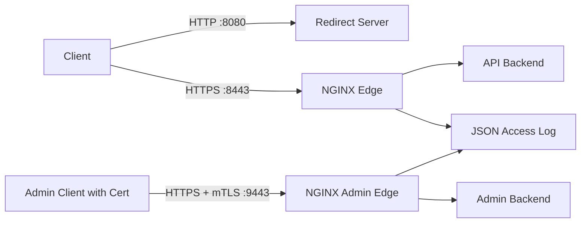
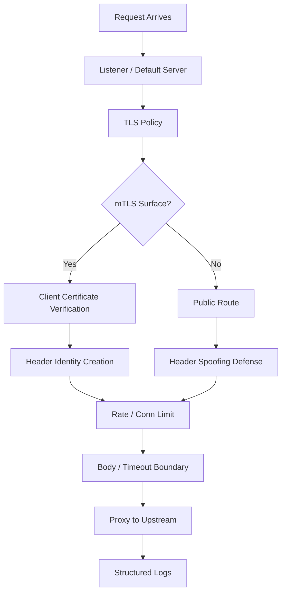

# Part 082 — Hardened TLS Reverse Proxy with mTLS and Rate Limit

Part ini adalah lab untuk menggabungkan beberapa primitive Phase 6:

- TLS termination;
- HTTP → HTTPS redirect;
- default server sinkhole;
- mTLS untuk admin/API sensitif;
- upstream reverse proxy;
- rate limiting;
- connection limiting;
- request size boundary;
- security headers;
- structured logs;
- smoke test;
- failure drills;
- rollback discipline.

Targetnya bukan “config paling sempurna sedunia”. Targetnya adalah **baseline hardening yang dapat dijelaskan, diuji, dan dikembangkan**.

---

## 1. Architecture



Kita pisahkan dua host/port logical:

| Surface | Port lab | Security mode |
|---|---:|---|
| Public API | `8443` | TLS, rate limit, security headers |
| Admin API | `9443` | TLS + required client certificate, stricter rate limit |
| HTTP redirect | `8080` | Redirect only |

Di production, pemisahan ini bisa berupa:

- different hostnames: `api.example.com` dan `admin.example.com`;
- different listeners;
- different ingress/gateway;
- different network zone;
- different Kubernetes Ingress/Gateway route;
- dedicated admin VPN/private network.

---

## 2. Directory layout

```text
nginx-security-lab/
├── certs/
│   ├── ca/
│   │   ├── client-ca.crt
│   │   └── client-ca.key
│   ├── clients/
│   │   ├── admin-client.crt
│   │   └── admin-client.key
│   └── server/
│       ├── server.crt
│       └── server.key
├── nginx/
│   ├── nginx.conf
│   └── conf.d/
│       ├── 00-log-format.conf
│       ├── 10-upstreams.conf
│       ├── 20-security-zones.conf
│       ├── 30-public-api.conf
│       └── 40-admin-api-mtls.conf
├── app/
│   └── server.js
└── docker-compose.yml
```

Invariant layout:

- cert material dipisah dari config;
- upstream dipisah dari server blocks;
- shared zones dipisah dari route config;
- public dan admin surface dipisah;
- setiap server block punya tujuan tunggal.

---

## 3. Generate certificates for lab

> Lab ini memakai self-signed certificate. Untuk production, gunakan CA resmi atau private PKI yang dikelola dengan rotation, expiry monitoring, dan revocation process.

```bash
mkdir -p certs/ca certs/server certs/clients
```

### 3.1 Client CA

```bash
openssl genrsa -out certs/ca/client-ca.key 4096

openssl req -x509 -new -nodes \
  -key certs/ca/client-ca.key \
  -sha256 -days 3650 \
  -subj "/CN=Example Client CA" \
  -out certs/ca/client-ca.crt
```

### 3.2 Server certificate

Buat server key:

```bash
openssl genrsa -out certs/server/server.key 2048
```

Buat CSR config dengan SAN:

```bash
cat > certs/server/server.cnf <<'CONF'
[req]
default_bits = 2048
prompt = no
default_md = sha256
req_extensions = req_ext
distinguished_name = dn

[dn]
CN = api.local.test

[req_ext]
subjectAltName = @alt_names

[alt_names]
DNS.1 = api.local.test
DNS.2 = admin.local.test
DNS.3 = localhost
IP.1 = 127.0.0.1
CONF
```

Generate CSR:

```bash
openssl req -new \
  -key certs/server/server.key \
  -out certs/server/server.csr \
  -config certs/server/server.cnf
```

Self-sign untuk lab:

```bash
openssl x509 -req \
  -in certs/server/server.csr \
  -signkey certs/server/server.key \
  -out certs/server/server.crt \
  -days 365 \
  -sha256 \
  -extensions req_ext \
  -extfile certs/server/server.cnf
```

### 3.3 Admin client certificate

```bash
openssl genrsa -out certs/clients/admin-client.key 2048

openssl req -new \
  -key certs/clients/admin-client.key \
  -subj "/CN=admin-user/O=Platform Engineering" \
  -out certs/clients/admin-client.csr

openssl x509 -req \
  -in certs/clients/admin-client.csr \
  -CA certs/ca/client-ca.crt \
  -CAkey certs/ca/client-ca.key \
  -CAcreateserial \
  -out certs/clients/admin-client.crt \
  -days 365 \
  -sha256
```

Client cert ini akan dipercaya oleh NGINX karena ditandatangani oleh `client-ca.crt`.

---

## 4. Minimal backend app

`app/server.js`:

```js
const http = require('http');

const server = http.createServer((req, res) => {
  const body = {
    path: req.url,
    method: req.method,
    host: req.headers.host,
    requestId: req.headers['x-request-id'],
    realIp: req.headers['x-real-ip'],
    forwardedFor: req.headers['x-forwarded-for'],
    forwardedProto: req.headers['x-forwarded-proto'],
    clientCertVerify: req.headers['x-client-cert-verify'],
    clientCertSubject: req.headers['x-client-cert-subject'],
    now: new Date().toISOString()
  };

  if (req.url === '/healthz') {
    res.writeHead(200, { 'content-type': 'application/json' });
    res.end(JSON.stringify({ ok: true }));
    return;
  }

  res.writeHead(200, { 'content-type': 'application/json' });
  res.end(JSON.stringify(body, null, 2));
});

server.listen(process.env.PORT || 3000, () => {
  console.log(`app listening on ${process.env.PORT || 3000}`);
});
```

---

## 5. Docker Compose

`docker-compose.yml`:

```yaml
services:
  nginx:
    image: nginx:1.27-alpine
    ports:
      - "8080:8080"
      - "8443:8443"
      - "9443:9443"
    volumes:
      - ./nginx/nginx.conf:/etc/nginx/nginx.conf:ro
      - ./nginx/conf.d:/etc/nginx/conf.d:ro
      - ./certs:/etc/nginx/certs:ro
    depends_on:
      - public-api
      - admin-api

  public-api:
    image: node:22-alpine
    working_dir: /app
    command: ["node", "server.js"]
    environment:
      PORT: 3000
    volumes:
      - ./app:/app:ro

  admin-api:
    image: node:22-alpine
    working_dir: /app
    command: ["node", "server.js"]
    environment:
      PORT: 3001
    volumes:
      - ./app:/app:ro
```

Catatan:

- versi image di lab boleh disesuaikan;
- production harus pin digest/image provenance;
- jangan mount private key writable;
- secret management production tidak memakai folder lokal biasa.

---

## 6. Main NGINX config

`nginx/nginx.conf`:

```nginx
user nginx;
worker_processes auto;

error_log /var/log/nginx/error.log warn;
pid /var/run/nginx.pid;

events {
    worker_connections 4096;
}

http {
    include /etc/nginx/mime.types;
    default_type application/octet-stream;

    server_tokens off;

    sendfile on;
    tcp_nopush on;
    keepalive_timeout 30s;

    client_header_timeout 10s;
    client_body_timeout 10s;
    send_timeout 30s;

    include /etc/nginx/conf.d/*.conf;
}
```

Production notes:

- `server_tokens off` mengurangi fingerprinting, tetapi bukan security boundary;
- timeout pendek melindungi edge dari slow clients;
- nilai final harus disesuaikan workload.

---

## 7. Structured log format

`nginx/conf.d/00-log-format.conf`:

```nginx
log_format edge_json escape=json
  '{'
    '"ts":"$time_iso8601",'
    '"request_id":"$request_id",'
    '"remote_addr":"$remote_addr",'
    '"host":"$host",'
    '"server_name":"$server_name",'
    '"method":"$request_method",'
    '"uri":"$uri",'
    '"status":$status,'
    '"bytes_sent":$bytes_sent,'
    '"request_time":$request_time,'
    '"upstream_addr":"$upstream_addr",'
    '"upstream_status":"$upstream_status",'
    '"upstream_response_time":"$upstream_response_time",'
    '"ssl_protocol":"$ssl_protocol",'
    '"ssl_cipher":"$ssl_cipher",'
    '"ssl_client_verify":"$ssl_client_verify",'
    '"ssl_client_s_dn":"$ssl_client_s_dn",'
    '"user_agent":"$http_user_agent"'
  '}';

access_log /var/log/nginx/access.log edge_json;
```

Log ini intentionally verbose untuk lab.

Di production, pastikan:

- tidak membocorkan subject certificate berisi PII tanpa governance;
- log retention sesuai compliance;
- request ID diteruskan ke aplikasi;
- security events dapat dikorelasikan dengan audit log aplikasi.

---

## 8. Upstreams

`nginx/conf.d/10-upstreams.conf`:

```nginx
upstream public_api_backend {
    zone public_api_backend 64k;
    server public-api:3000 max_fails=2 fail_timeout=10s;
    keepalive 32;
}

upstream admin_api_backend {
    zone admin_api_backend 64k;
    server admin-api:3001 max_fails=2 fail_timeout=10s;
    keepalive 16;
}
```

Kenapa `zone`?

- shared state antar worker;
- berguna untuk upstream state seperti fail counters dan max connections;
- membiasakan layout yang compatible dengan observability/advanced features.

---

## 9. Shared security zones

`nginx/conf.d/20-security-zones.conf`:

```nginx
limit_req_zone $binary_remote_addr zone=public_api_rate:20m rate=20r/s;
limit_req_zone $binary_remote_addr zone=admin_api_rate:10m rate=3r/s;

limit_conn_zone $binary_remote_addr zone=per_ip_conn:20m;

map $http_upgrade $connection_upgrade {
    default upgrade;
    ''      close;
}
```

Kenapa `$binary_remote_addr`?

- lebih compact dari string IP;
- cocok untuk key per client IP;
- tetap bermasalah jika semua traffic datang dari NAT/CDN tanpa Real IP config.

Jika di belakang CDN/LB, jangan lupa `real_ip`.

Contoh:

```nginx
# Only if these are truly trusted proxy ranges.
set_real_ip_from 203.0.113.0/24;
real_ip_header X-Forwarded-For;
real_ip_recursive on;
```

Jangan memakai ini dengan range internet luas.

---

## 10. Public API server

`nginx/conf.d/30-public-api.conf`:

```nginx
server {
    listen 8080 default_server;
    server_name _;

    return 308 https://$host:8443$request_uri;
}

server {
    listen 8443 ssl http2 default_server;
    server_name _;

    ssl_certificate     /etc/nginx/certs/server/server.crt;
    ssl_certificate_key /etc/nginx/certs/server/server.key;

    ssl_protocols TLSv1.2 TLSv1.3;
    ssl_session_cache shared:SSL:10m;
    ssl_session_timeout 10m;

    # Lab only. Production ciphers require compatibility testing.
    ssl_prefer_server_ciphers off;

    client_max_body_size 2m;

    add_header Strict-Transport-Security "max-age=300" always;
    add_header X-Content-Type-Options "nosniff" always;
    add_header Referrer-Policy "no-referrer" always;
    add_header X-Frame-Options "DENY" always;

    location = /healthz {
        access_log off;
        return 200 '{"ok":true,"edge":"nginx"}\n';
        add_header Content-Type application/json;
    }

    location /api/ {
        limit_conn per_ip_conn 50;
        limit_req zone=public_api_rate burst=40 nodelay;

        proxy_http_version 1.1;
        proxy_set_header Connection "";

        proxy_set_header Host $host;
        proxy_set_header X-Request-ID $request_id;
        proxy_set_header X-Real-IP $remote_addr;
        proxy_set_header X-Forwarded-For $proxy_add_x_forwarded_for;
        proxy_set_header X-Forwarded-Proto $scheme;

        # Do not allow clients to spoof mTLS identity headers.
        proxy_set_header X-Client-Cert-Verify "";
        proxy_set_header X-Client-Cert-Subject "";

        proxy_connect_timeout 3s;
        proxy_send_timeout 30s;
        proxy_read_timeout 30s;

        proxy_pass http://public_api_backend;
    }

    location / {
        return 404;
    }
}
```

### Important choices

#### 308 redirect

`308` preserves method and body better than `301/302` for non-GET flows. For basic public websites, `301` may be acceptable. For API edge, be explicit.

#### Short HSTS in lab

```nginx
add_header Strict-Transport-Security "max-age=300" always;
```

Lab uses short max-age. Production HSTS should be rolled out gradually. Do not start with `includeSubDomains; preload` unless you are certain all subdomains are HTTPS-ready.

#### Clear client cert headers on public API

```nginx
proxy_set_header X-Client-Cert-Verify "";
proxy_set_header X-Client-Cert-Subject "";
```

Do not let clients forge privileged identity headers.

---

## 11. Admin API with required mTLS

`nginx/conf.d/40-admin-api-mtls.conf`:

```nginx
server {
    listen 9443 ssl http2;
    server_name admin.local.test localhost;

    ssl_certificate     /etc/nginx/certs/server/server.crt;
    ssl_certificate_key /etc/nginx/certs/server/server.key;

    ssl_protocols TLSv1.2 TLSv1.3;
    ssl_session_cache shared:ADMINSSL:5m;
    ssl_session_timeout 10m;

    ssl_client_certificate /etc/nginx/certs/ca/client-ca.crt;
    ssl_verify_client on;
    ssl_verify_depth 2;

    client_max_body_size 1m;

    add_header Strict-Transport-Security "max-age=300" always;
    add_header X-Content-Type-Options "nosniff" always;
    add_header Referrer-Policy "no-referrer" always;
    add_header X-Frame-Options "DENY" always;

    error_page 495 496 = @mtls_error;

    location @mtls_error {
        internal;
        default_type application/json;
        return 403 '{"error":"client_certificate_required_or_invalid"}\n';
    }

    location = /healthz {
        access_log off;
        return 200 '{"ok":true,"edge":"admin-nginx"}\n';
        add_header Content-Type application/json;
    }

    location /admin/ {
        limit_conn per_ip_conn 10;
        limit_req zone=admin_api_rate burst=6 nodelay;

        proxy_http_version 1.1;
        proxy_set_header Connection "";

        proxy_set_header Host $host;
        proxy_set_header X-Request-ID $request_id;
        proxy_set_header X-Real-IP $remote_addr;
        proxy_set_header X-Forwarded-For $proxy_add_x_forwarded_for;
        proxy_set_header X-Forwarded-Proto $scheme;

        # Identity established by NGINX mTLS verification.
        proxy_set_header X-Client-Cert-Verify  $ssl_client_verify;
        proxy_set_header X-Client-Cert-Subject $ssl_client_s_dn;
        proxy_set_header X-Client-Cert-Issuer  $ssl_client_i_dn;
        proxy_set_header X-Client-Cert-Serial  $ssl_client_serial;

        proxy_connect_timeout 3s;
        proxy_send_timeout 20s;
        proxy_read_timeout 20s;

        proxy_pass http://admin_api_backend;
    }

    location / {
        return 404;
    }
}
```

### Why separate admin server?

mTLS happens during TLS handshake. That is earlier than normal HTTP location processing.

A separate admin listener/server block makes the policy clear:

```text
Everything on 9443 requires a trusted client certificate.
```

You can use `ssl_verify_client optional` and enforce by location, but that is easier to misread and easier to weaken accidentally.

For high-value admin/control-plane traffic, separate surface is usually cleaner.

---

## 12. Start the lab

```bash
docker compose up -d
```

Validate config inside container:

```bash
docker compose exec nginx nginx -t
```

View effective config:

```bash
docker compose exec nginx nginx -T
```

Reload safely:

```bash
docker compose exec nginx nginx -s reload
```

---

## 13. Smoke tests

Because we use self-signed server cert, pass `--insecure` for lab curl. In production, never hide certificate validation problems with `-k`.

### 13.1 HTTP redirects to HTTPS

```bash
curl -i http://localhost:8080/api/test
```

Expected:

```text
HTTP/1.1 308 Permanent Redirect
Location: https://localhost:8443/api/test
```

### 13.2 Public API works without client certificate

```bash
curl -k -i https://localhost:8443/api/test
```

Expected:

```text
HTTP/2 200
content-type: application/json
```

The JSON should show forwarded headers but no client cert identity.

### 13.3 Public unknown path returns 404

```bash
curl -k -i https://localhost:8443/unknown
```

Expected:

```text
HTTP/2 404
```

### 13.4 Admin API fails without client certificate

```bash
curl -k -i https://localhost:9443/admin/test
```

Expected:

```text
HTTP/2 403
{"error":"client_certificate_required_or_invalid"}
```

Depending on TLS/client behavior, NGINX may fail earlier in handshake or map to special client certificate error handling. The invariant is: **no valid client certificate, no admin access**.

### 13.5 Admin API works with client certificate

```bash
curl -k -i \
  --cert certs/clients/admin-client.crt \
  --key certs/clients/admin-client.key \
  https://localhost:9443/admin/test
```

Expected:

```text
HTTP/2 200
```

Response body should include:

```json
{
  "clientCertVerify": "SUCCESS",
  "clientCertSubject": "CN=admin-user,O=Platform Engineering"
}
```

The exact DN formatting can vary by OpenSSL/NGINX version.

---

## 14. Rate limit drill

Run repeated requests:

```bash
for i in $(seq 1 100); do
  curl -k -s -o /dev/null -w "%{http_code}\n" https://localhost:9443/admin/test \
    --cert certs/clients/admin-client.crt \
    --key certs/clients/admin-client.key &
done
wait
```

Expected:

- some `200`;
- some `503` by default for rate-limited requests unless `limit_req_status` is configured.

If you prefer explicit status:

```nginx
limit_req_status 429;
```

Then rejected requests should return `429`.

Production recommendation:

```nginx
limit_req_status 429;
limit_conn_status 429;
```

This makes dashboards and clients easier to reason about.

---

## 15. Request body boundary drill

```bash
python3 - <<'PY' > /tmp/3mb.txt
print('x' * 3 * 1024 * 1024)
PY

curl -k -i \
  -X POST \
  --data-binary @/tmp/3mb.txt \
  https://localhost:8443/api/upload
```

Expected:

```text
HTTP/2 413
```

Why this matters:

- protects app from accidental large body;
- protects NGINX temp storage;
- reduces WAF/body inspection risk;
- makes API contract explicit.

Route-specific upload endpoints can raise the limit deliberately.

---

## 16. Header spoofing drill

Try to forge mTLS identity on public API:

```bash
curl -k -s https://localhost:8443/api/test \
  -H 'X-Client-Cert-Verify: SUCCESS' \
  -H 'X-Client-Cert-Subject: CN=attacker' | jq .
```

Expected:

```json
{
  "clientCertVerify": "",
  "clientCertSubject": ""
}
```

The public API server block clears these headers before proxying.

This is a critical invariant:

> Identity headers must be created by trusted infrastructure, not accepted from clients.

---

## 17. Observe logs

```bash
docker compose logs nginx
```

Or read access log:

```bash
docker compose exec nginx tail -f /var/log/nginx/access.log
```

Look for fields:

```json
{
  "request_id": "...",
  "remote_addr": "...",
  "host": "localhost",
  "method": "GET",
  "uri": "/admin/test",
  "status": 200,
  "upstream_status": "200",
  "ssl_protocol": "TLSv1.3",
  "ssl_client_verify": "SUCCESS"
}
```

Good logs tell you:

- did NGINX handle the request?
- did it reach upstream?
- was mTLS successful?
- which route/host handled it?
- how long did NGINX and upstream take?
- which request id can be followed in app logs?

---

## 18. Failure drills

### 18.1 Backend down

```bash
docker compose stop public-api
curl -k -i https://localhost:8443/api/test
```

Expected:

- likely `502 Bad Gateway`;
- access log `upstream_status` may show failure;
- error log should show connect failure.

Restore:

```bash
docker compose start public-api
```

### 18.2 Bad NGINX config

Introduce syntax error:

```bash
echo 'bad_directive;' >> nginx/conf.d/99-bad.conf
```

Test:

```bash
docker compose exec nginx nginx -t
```

Expected: failure.

Reload should not be attempted. Remove bad file:

```bash
rm nginx/conf.d/99-bad.conf
docker compose exec nginx nginx -t
docker compose exec nginx nginx -s reload
```

Invariant:

> Never reload untested config.

### 18.3 Expired/invalid client cert

For lab, generate another client cert signed by a different CA or use no cert. Expected result: admin API blocked.

This tests whether your admin path truly depends on trusted CA, not merely presence of any certificate.

---

## 19. Production hardening checklist

### TLS

- [ ] TLS versions explicitly configured.
- [ ] Certificates include correct SANs.
- [ ] Full chain served correctly.
- [ ] Private keys protected.
- [ ] Renewal automated.
- [ ] Expiry alerting exists.
- [ ] HSTS rolled out gradually.
- [ ] HTTP/2 enabled only where tested.
- [ ] HTTP/3 not enabled unless rollout path exists.

### mTLS

- [ ] Client CA separated from server certificate chain.
- [ ] `ssl_verify_client on` for dedicated mTLS surface.
- [ ] Certificate DN/SAN mapping reviewed.
- [ ] Revocation/rotation process exists.
- [ ] Identity headers cleared before being set.
- [ ] Backend trusts only NGINX path.
- [ ] Direct backend bypass impossible.

### Rate/connection limit

- [ ] Key uses trusted client identity/IP.
- [ ] NAT/CDN impact considered.
- [ ] Status code explicit, preferably `429`.
- [ ] Dry-run or canary rollout performed for risky routes.
- [ ] Admin routes stricter than public routes.
- [ ] Webhook/vendor routes tuned separately.

### Reverse proxy

- [ ] `Host`, `X-Forwarded-*`, and request ID intentionally set.
- [ ] Spoofable identity headers cleared.
- [ ] Timeout budget aligned with upstream/application.
- [ ] Request body size matches route contract.
- [ ] Retry policy respects idempotency.
- [ ] Upstream keepalive configured deliberately.

### Observability

- [ ] JSON logs include request id.
- [ ] Logs include upstream status/time.
- [ ] Logs include TLS/mTLS fields where appropriate.
- [ ] Error logs collected centrally.
- [ ] Rate limit rejections visible.
- [ ] mTLS failures visible.
- [ ] Dashboards separate 4xx/5xx by source.

---

## 20. What not to copy blindly

Do not copy this lab blindly into production because:

- self-signed certs are lab-only;
- local key storage is lab-only;
- HSTS value is intentionally short;
- ciphers need client compatibility testing;
- Real IP is not configured because lab has no CDN/LB;
- no OCSP stapling is configured;
- no upstream TLS is configured;
- no WAF is included;
- no secret manager is used;
- no container image pinning by digest;
- no Kubernetes-specific readiness/liveness config.

But the **structure** is production-relevant:

```text
separate surfaces
+ explicit TLS policy
+ mTLS for privileged routes
+ spoof-proof identity headers
+ rate/connection limiting
+ request size boundaries
+ structured logs
+ tested reload/rollback
```

---

## 21. Extension: upstream TLS

If backend also speaks HTTPS, use upstream TLS verification.

Example:

```nginx
location /api/ {
    proxy_pass https://api_backend_tls;

    proxy_ssl_server_name on;
    proxy_ssl_name api.internal.example.com;
    proxy_ssl_trusted_certificate /etc/nginx/certs/upstream-ca.pem;
    proxy_ssl_verify on;
    proxy_ssl_verify_depth 2;
}
```

This changes the trust model:

```text
client TLS -> NGINX
NGINX TLS -> upstream
```

Now NGINX is not only terminating client TLS; it is also authenticating the upstream service.

---

## 22. Extension: route-specific mTLS with optional verification

Sometimes a single hostname contains both public and mTLS routes. Then you may see:

```nginx
ssl_verify_client optional;
```

Then enforce in location:

```nginx
location /admin/ {
    if ($ssl_client_verify != SUCCESS) {
        return 403;
    }

    proxy_pass http://admin_api_backend;
}
```

This works, but has higher misconfiguration risk because the TLS layer allows clients without cert through the handshake.

For high-value surfaces, prefer dedicated mTLS server/listener when possible.

---

## 23. Extension: no `if` alternative with `map`

Instead of `if`, define a map:

```nginx
map $ssl_client_verify $mtls_allowed {
    default 0;
    SUCCESS 1;
}
```

Then:

```nginx
location /admin/ {
    error_page 418 = @forbidden;
    recursive_error_pages on;

    if ($mtls_allowed = 0) {
        return 418;
    }

    proxy_pass http://admin_api_backend;
}

location @forbidden {
    internal;
    return 403;
}
```

This is still more complex than separate server block. Complexity is a security smell unless justified.

---

## 24. Production review questions

Before approving a hardened NGINX edge, ask:

1. Which routes are public?
2. Which routes require human/admin identity?
3. Which routes require machine identity?
4. Is mTLS enforced at handshake or route level?
5. Can backend be reached without NGINX?
6. Are identity headers impossible to spoof?
7. Is Real IP configured only for trusted proxies?
8. What happens when certificate expires?
9. What happens when client CA rotates?
10. Are rate limits based on correct identity?
11. Are blocked requests observable?
12. Are 502/504 distinguishable from 429/403?
13. Is reload tested before deploy?
14. Can last-good config be restored quickly?
15. Are security headers applied on error responses too?

---

## 25. Final mental model

Security hardening di NGINX bukan satu directive.

Ia adalah susunan boundary:



The invariant:

> NGINX should make the trust boundary explicit, cheap abuse expensive, privileged paths cryptographically gated, and failures diagnosable.

When this is true, NGINX stops being a pile of snippets and becomes a defensible edge control plane.

---

## References

- NGINX Docs — SSL module: https://nginx.org/en/docs/http/ngx_http_ssl_module.html
- NGINX Docs — Configuring HTTPS servers: https://nginx.org/en/docs/http/configuring_https_servers.html
- NGINX Docs — Rate limiting: https://nginx.org/en/docs/http/ngx_http_limit_req_module.html
- NGINX Docs — Connection limiting: https://nginx.org/en/docs/http/ngx_http_limit_conn_module.html
- NGINX Docs — Reverse proxy: https://docs.nginx.com/nginx/admin-guide/web-server/reverse-proxy/
- NGINX Docs — Proxy module: https://nginx.org/en/docs/http/ngx_http_proxy_module.html
- NGINX Docs — Controlling NGINX: https://nginx.org/en/docs/control.html
