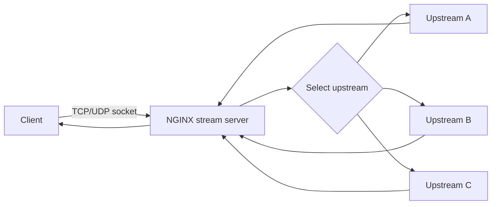
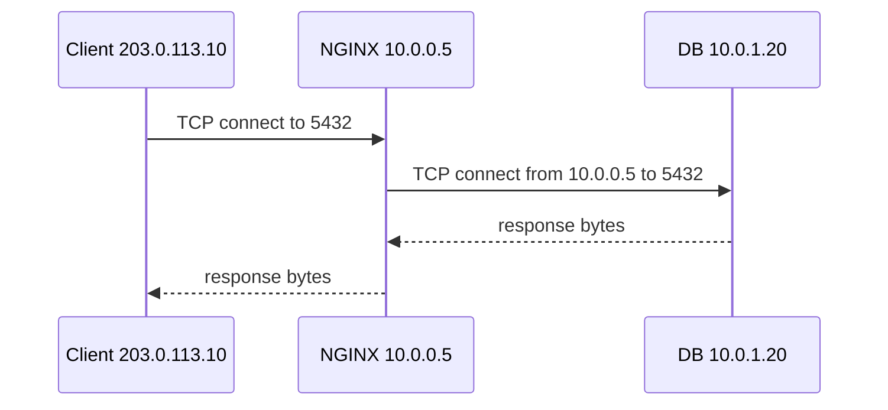
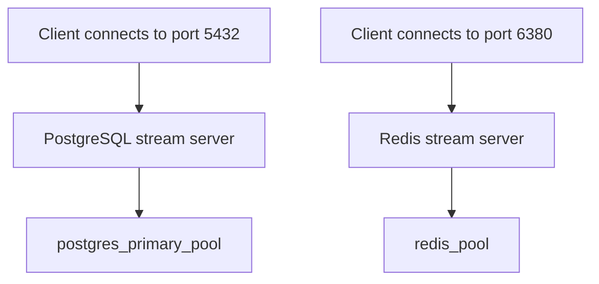
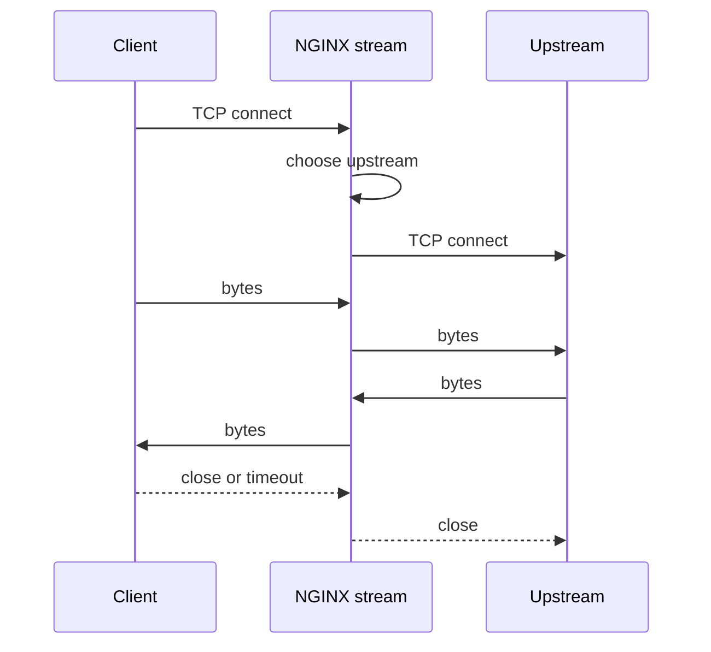
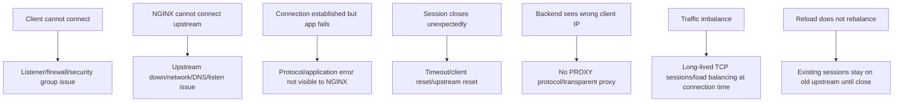

# Part 083 — Stream Module Mental Model

> Di fase HTTP, NGINX bisa berpikir dalam request, header, URI, method, status code, cache, CORS, auth, dan content.  
> Di fase stream, NGINX berpikir dalam **connection**, **bytes**, **session**, **upstream**, **timeout**, dan **socket lifecycle**.

Ini pergeseran mental model yang besar.

Banyak engineer salah memakai stream module karena membawa intuisi HTTP ke Layer 4. Mereka ingin routing berdasarkan path, membaca JWT, menambah header, mengubah body, atau melihat response code. Itu bukan domain `stream`. Pada `stream`, NGINX tidak memproses HTTP message. NGINX hanya menerima koneksi TCP atau datagram UDP, memilih upstream, lalu mem-proxy aliran data.

Dokumentasi resmi NGINX menyebut `ngx_stream_core_module` tersedia sejak 1.9.0 dan **tidak dibangun secara default** ketika build from source; module ini harus diaktifkan dengan `--with-stream`. `ngx_stream_proxy_module` memungkinkan proxy data stream melalui TCP, UDP, dan UNIX-domain socket. Artinya, saat menggunakan binary distro/container, selalu verifikasi apakah module stream tersedia sebelum mendesain arsitektur di atasnya.

```bash
nginx -V 2>&1 | tr ' ' '\n' | grep -- '--with-stream'
```

Kalau output kosong, jangan lanjut mendesain stream proxy dulu. Binary NGINX tersebut mungkin tidak membawa stream module.

---

## 1. Apa sebenarnya `stream`?

`stream` adalah subsystem NGINX untuk proxy/load balancing Layer 4.

Bentuk paling minimal:

```nginx
stream {
    upstream postgres_backends {
        server 10.10.1.11:5432;
        server 10.10.1.12:5432;
    }

    server {
        listen 5432;
        proxy_pass postgres_backends;
    }
}
```

Di sini tidak ada:

- `location`
- `server_name` HTTP virtual host
- `proxy_set_header`
- `$uri`
- `$request_method`
- `$status` HTTP
- `Cache-Control`
- CORS
- HTTP auth
- response body transformation

Yang ada adalah:

- listener socket
- upstream group
- TCP/UDP session
- connection timeout
- upstream timeout
- SSL/TLS termination atau passthrough, bila dikonfigurasi
- PROXY protocol, bila dibutuhkan
- stream variables
- stream access control
- stream log

Mental model sederhananya:



NGINX tidak bertanya: “request ini `/api/users` atau `/assets/app.js`?”  
NGINX bertanya: “connection/datagram ini masuk listener mana, harus diarahkan ke upstream mana, dan berapa lama boleh hidup?”

---

## 2. HTTP proxy vs stream proxy

| Aspek | HTTP subsystem | Stream subsystem |
|---|---|---|
| Layer | L7/application | L4/transport-ish |
| Unit kerja | HTTP request/response | TCP session atau UDP datagram/session approximation |
| Routing umum | host, URI, method, header, cookie | listener port, SNI, client IP, PROXY protocol, variables tertentu |
| Bisa baca path? | Ya | Tidak |
| Bisa set HTTP header? | Ya | Tidak |
| Bisa cache response? | Ya | Tidak |
| Bisa rate-limit HTTP request? | Ya | Bukan dengan `limit_req`; harus pakai stream primitives/OS/network controls |
| Cocok untuk | API, web app, static, gRPC HTTP/2 | PostgreSQL, MySQL, Redis, LDAP, DNS, syslog, TLS passthrough, custom TCP |

Kalimat praktisnya:

> Kalau keputusan routing membutuhkan HTTP semantics, gunakan `http`.  
> Kalau keputusan routing cukup berdasarkan connection-level semantics, gunakan `stream`.

---

## 3. Di mana `stream` diletakkan?

`stream` adalah top-level context, sejajar dengan `events` dan `http`.

```nginx
worker_processes auto;

events {
    worker_connections 4096;
}

http {
    # HTTP reverse proxy, cache, static, API gateway, TLS termination HTTP
}

stream {
    # TCP/UDP proxy/load balancing
}
```

Ini penting karena directive HTTP tidak otomatis tersedia di stream context.

Contoh salah:

```nginx
stream {
    server {
        listen 5432;

        # Salah: ini directive HTTP, bukan stream.
        location / {
            proxy_pass postgres_backends;
        }
    }
}
```

Contoh benar:

```nginx
stream {
    upstream postgres_backends {
        server 10.10.1.11:5432;
        server 10.10.1.12:5432;
    }

    server {
        listen 5432;
        proxy_pass postgres_backends;
    }
}
```

---

## 4. Kapan `stream` dipakai?

Gunakan `stream` ketika NGINX harus menjadi proxy/load balancer untuk protocol yang bukan HTTP atau ketika NGINX tidak boleh decrypt/memahami HTTP.

Contoh umum:

| Use case | Protocol | Kenapa stream? |
|---|---:|---|
| PostgreSQL edge/internal LB | TCP 5432 | Protocol bukan HTTP |
| MySQL LB | TCP 3306 | Protocol bukan HTTP |
| Redis proxy | TCP 6379 | Protocol bukan HTTP |
| LDAP/LDAPS proxy | TCP 389/636 | Protocol bukan HTTP |
| DNS proxy/load balancing | UDP/TCP 53 | DNS bisa UDP dan TCP |
| Syslog fan-in/proxy | UDP/TCP 514 | Non-HTTP telemetry |
| TLS passthrough | TCP 443 | NGINX tidak terminate TLS, hanya route berdasarkan SNI bila perlu |
| MQTT | TCP 1883/8883 | Non-HTTP long-lived connection |
| Custom binary protocol | TCP | Tidak ada HTTP semantics |

Jangan pakai stream hanya karena “lebih cepat”. Untuk HTTP traffic, subsystem HTTP memberi observability, header control, cache, security policy, retry semantics, dan tooling yang jauh lebih tepat.

---

## 5. Stream tidak otomatis berarti “transparent proxy”

Salah satu kesalahpahaman besar: karena stream berada di Layer 4, engineer mengira upstream otomatis melihat IP client asli.

Tidak selalu.

Secara default, backend melihat koneksi dari IP NGINX, bukan IP client asli.



Dari sisi DB, peer address adalah `10.0.0.5`.

Kalau backend harus tahu IP asli, opsi yang tersedia bergantung pada protocol/backend:

1. **PROXY protocol** bila backend mendukungnya.
2. Transparent proxying dengan OS/network routing khusus, jauh lebih kompleks.
3. Logging IP asli di NGINX saja, bukan di backend.
4. Protocol-level identity dari aplikasi, misalnya database user/client certificate, bukan source IP.

Jangan mengandalkan source IP backend untuk audit user kalau NGINX berada di tengah dan tidak ada mekanisme preservasi identitas.

---

## 6. Listener adalah routing boundary pertama

Dalam `stream`, listener address/port sangat penting.

```nginx
stream {
    server {
        listen 5432;
        proxy_pass postgres_primary_pool;
    }

    server {
        listen 6380;
        proxy_pass redis_pool;
    }
}
```

Satu listener biasanya merepresentasikan satu service contract.



Pada HTTP, satu port 443 bisa melayani banyak host/path. Pada stream, satu port sering lebih dekat dengan satu protocol/service. Bisa ada SNI-based routing untuk TLS passthrough, tetapi itu tetap terbatas pada informasi TLS ClientHello, bukan HTTP request.

---

## 7. Stream server lifecycle

Untuk TCP, lifecycle sederhananya:



NGINX tidak tahu “request selesai” kecuali protocol-level close/timeout terjadi. Ini berbeda dari HTTP keepalive, di mana satu TCP connection dapat membawa banyak HTTP request/response dan NGINX memahami boundaries-nya.

Implikasi production:

- Long-lived TCP connection bisa menahan slot upstream lama.
- Load balancing biasanya terjadi saat connection dibuat, bukan setiap query/database command.
- Jika client mempertahankan connection berjam-jam, rebalancing tidak otomatis meratakan existing sessions.
- Timeout dan keepalive policy harus mengikuti protocol.

---

## 8. TCP stream vs UDP stream

TCP dan UDP diproxy oleh subsystem stream, tapi mental modelnya berbeda.

| Aspek | TCP | UDP |
|---|---|---|
| Koneksi | Stateful connection | Datagram, connectionless |
| Load balancing unit | Connection | Datagram/session approximation |
| Backpressure | Ada via TCP flow control | Tidak seperti TCP |
| Failure visibility | Connect/read/write timeout | Lebih ambigu |
| Cocok untuk | DB, Redis, LDAP, MQTT, TLS passthrough | DNS, syslog, RADIUS |
| Risiko | Long-lived connection skew | Stateless loss, retry client-side |

TCP proxying biasanya lebih mudah dipahami karena ada connection lifecycle. UDP proxying lebih tricky karena tidak ada connection natural; NGINX harus membuat session-like association untuk meneruskan response upstream ke client.

Part 085 nanti akan fokus khusus UDP.

---

## 9. Upstream group di stream

`stream` punya upstream module sendiri: `ngx_stream_upstream_module`.

Contoh:

```nginx
stream {
    upstream mysql_pool {
        least_conn;

        server 10.0.10.11:3306 max_fails=2 fail_timeout=10s;
        server 10.0.10.12:3306 max_fails=2 fail_timeout=10s;
    }

    server {
        listen 3306;
        proxy_pass mysql_pool;
    }
}
```

Konsepnya mirip HTTP upstream, tetapi semantics-nya mengikuti session/connection, bukan HTTP request.

Load balancing method umum:

- default round-robin
- `least_conn`
- `hash ... consistent`
- `random` pada versi/module yang mendukung
- Plus/commercial features tertentu seperti active health checks pada boundary berbeda

Jangan menganggap semua fitur HTTP upstream identik dengan stream upstream. Nama directive bisa mirip, tapi context dan behavior tidak selalu sama.

---

## 10. Passive failure di stream

Pada TCP, failure yang bisa dideteksi NGINX biasanya berupa:

- gagal connect ke upstream
- upstream menutup koneksi terlalu cepat
- timeout saat connect/read/write
- network reset

Contoh:

```nginx
stream {
    upstream redis_pool {
        server 10.0.20.11:6379 max_fails=2 fail_timeout=10s;
        server 10.0.20.12:6379 max_fails=2 fail_timeout=10s;
    }

    server {
        listen 6379;
        proxy_connect_timeout 1s;
        proxy_timeout 30s;
        proxy_pass redis_pool;
    }
}
```

Namun NGINX tidak tahu apakah Redis command tertentu gagal secara semantic, apakah SQL query lambat karena lock, atau apakah LDAP bind ditolak. Itu application-level failure.

Invariant:

> Stream passive health melihat transport-level failure, bukan business correctness.

---

## 11. Timeout adalah safety boundary utama

Directive penting:

```nginx
proxy_connect_timeout 1s;
proxy_timeout 30s;
```

Makna praktis:

- `proxy_connect_timeout`: berapa lama NGINX menunggu koneksi ke upstream terbentuk.
- `proxy_timeout`: timeout antara dua operasi read/write berturut-turut pada client atau upstream.

Jangan copy timeout dari HTTP API ke database stream proxy. Database connection bisa idle lama karena pooling. Redis pub/sub bisa long-lived. MQTT bisa persistent. LDAP bind/search mungkin pendek. DNS UDP harus sangat pendek.

Timeout harus mengikuti protocol contract.

Contoh matrix awal:

| Service | Connect timeout | Session timeout | Catatan |
|---|---:|---:|---|
| PostgreSQL OLTP | 1s | 1h atau sesuai pool | Pastikan pool app punya idle timeout selaras |
| MySQL OLTP | 1s | 1h atau sesuai pool | Hindari NGINX menutup koneksi lebih cepat dari pool expectation |
| Redis cache | 500ms-1s | 30s-5m | Tergantung command/pool model |
| LDAP bind/search | 1s | 30s-2m | Biasanya tidak perlu long-lived sangat lama |
| MQTT | 1s-3s | panjang | Perlu heartbeat/keepalive protocol-aware |
| DNS UDP | pendek | pendek | Bahas di Part 085 |

Angka di atas bukan template final. Itu starting point untuk reasoning.

---

## 12. TLS di stream: terminate, passthrough, atau inspect SNI

Stream bisa dipakai untuk beberapa pola TLS:

### 12.1 TLS passthrough

NGINX tidak decrypt traffic.

```nginx
stream {
    upstream tls_backend {
        server 10.0.30.10:443;
    }

    server {
        listen 443;
        proxy_pass tls_backend;
    }
}
```

Client melakukan TLS handshake langsung dengan backend. NGINX hanya meneruskan bytes.

Kelebihan:

- end-to-end TLS sampai backend
- backend memegang certificate/private key
- NGINX tidak melihat plaintext

Kekurangan:

- tidak bisa HTTP routing berdasarkan path/header
- tidak bisa inject header
- observability terbatas
- policy L7 tidak bisa dilakukan di NGINX

### 12.2 TLS termination di stream

NGINX terminate TLS, tetapi tidak masuk HTTP subsystem.

```nginx
stream {
    server {
        listen 636 ssl;
        ssl_certificate     /etc/nginx/certs/ldap.example.com.fullchain.pem;
        ssl_certificate_key /etc/nginx/certs/ldap.example.com.key;

        proxy_pass ldap_plain_backend;
    }
}
```

Cocok untuk protocol TLS non-HTTP seperti LDAPS atau custom TLS protocol.

### 12.3 SNI-based routing

Dengan preread, NGINX dapat membaca TLS ClientHello untuk mengambil SNI tanpa terminate TLS.

```nginx
stream {
    map $ssl_preread_server_name $backend {
        db1.example.com db1_pool;
        db2.example.com db2_pool;
        default        default_tls_pool;
    }

    upstream db1_pool { server 10.0.40.11:443; }
    upstream db2_pool { server 10.0.40.12:443; }
    upstream default_tls_pool { server 10.0.40.99:443; }

    server {
        listen 443;
        ssl_preread on;
        proxy_pass $backend;
    }
}
```

Ini bukan membaca HTTP Host header. Ini hanya membaca TLS ClientHello SNI.

---

## 13. Stream observability harus dirancang sejak awal

HTTP log default tidak membantu stream.

Gunakan `log_format` stream:

```nginx
stream {
    log_format stream_json escape=json
      '{'
        '"ts":"$time_iso8601",'
        '"remote_addr":"$remote_addr",'
        '"protocol":"$protocol",'
        '"status":"$status",'
        '"bytes_sent":$bytes_sent,'
        '"bytes_received":$bytes_received,'
        '"session_time":$session_time,'
        '"upstream_addr":"$upstream_addr",'
        '"upstream_bytes_sent":"$upstream_bytes_sent",'
        '"upstream_bytes_received":"$upstream_bytes_received",'
        '"upstream_connect_time":"$upstream_connect_time",'
        '"upstream_session_time":"$upstream_session_time"'
      '}';

    access_log /var/log/nginx/stream-access.log stream_json;
}
```

Yang perlu dibaca:

| Field | Makna operasional |
|---|---|
| `$remote_addr` | IP peer yang connect ke NGINX; bisa LB upstream, bukan end-user |
| `$protocol` | TCP atau UDP |
| `$status` | Status stream session, bukan HTTP status |
| `$session_time` | Durasi session client-NGINX |
| `$upstream_addr` | Upstream yang dipilih |
| `$upstream_connect_time` | Waktu connect ke upstream |
| `$upstream_session_time` | Durasi session upstream |
| `$bytes_sent`/`received` | Volume traffic |

Untuk stream, RCA sering dimulai dari:

1. Apakah client bisa connect ke NGINX?
2. Apakah NGINX bisa connect ke upstream?
3. Apakah session ditutup client, upstream, atau timeout?
4. Apakah distribusi upstream seimbang?
5. Apakah ada long-lived session skew?
6. Apakah backend melihat IP yang benar?
7. Apakah protocol membutuhkan L7 awareness yang NGINX stream tidak punya?

---

## 14. Stream access control

Stream punya access control sendiri.

Contoh allowlist sederhana:

```nginx
stream {
    server {
        listen 5432;

        allow 10.0.0.0/8;
        allow 192.168.0.0/16;
        deny all;

        proxy_pass postgres_pool;
    }
}
```

Namun ingat Real IP boundary. Jika NGINX berada di belakang load balancer, `$remote_addr` mungkin IP load balancer. Untuk menerima IP asli di stream, gunakan PROXY protocol bila upstream LB mengirimkannya.

```nginx
stream {
    server {
        listen 5432 proxy_protocol;
        proxy_pass postgres_pool;
    }
}
```

PROXY protocol akan dibahas lebih detail di Part 087.

---

## 15. Stream bukan pengganti protocol-aware proxy

NGINX stream adalah generic TCP/UDP proxy. Ia tidak otomatis memahami protocol seperti PostgreSQL, MySQL, Redis, Kafka, MQTT, DNS, atau FTP.

Konsekuensi:

- Tidak bisa route SQL read/write berdasarkan query.
- Tidak bisa paham Redis cluster redirection.
- Tidak bisa inspect Kafka topic.
- Tidak bisa split MySQL read/write secara semantic.
- Tidak bisa tahu LDAP bind berhasil/gagal sebagai health signal.
- Tidak cocok untuk protocol yang membuka dynamic secondary connection kecuali dipahami network path-nya.

Kalau butuh protocol semantics, pertimbangkan:

- proxy khusus protocol tersebut
- service mesh/L4 LB dengan metadata memadai
- database-native proxy
- driver/client-level load balancing
- application-level routing

NGINX stream kuat untuk generic L4 forwarding, TLS passthrough, dan simple L4 load balancing. Jangan memaksanya menjadi protocol-aware broker.

---

## 16. Failure model stream



Top production failure modes:

| Failure | Common root cause | Mitigation |
|---|---|---|
| All clients fail connect | wrong listener, firewall, module missing | `nginx -T`, `ss -ltnp`, security group test |
| Only some upstreams fail | passive failure, backend down, DNS stale | log `$upstream_addr`, test direct upstream |
| Backend overloaded | connection skew, no max_conns, long sessions | `least_conn`, pool sizing, backend limits |
| Client IP lost | NGINX source IP seen by backend | PROXY protocol or app identity |
| TLS SNI route wrong | client did not send SNI, map default bad | log `$ssl_preread_server_name` |
| Reload does not move traffic | old TCP sessions continue | design drain/connection expiry at app/protocol level |
| Auth not enforced | assumed HTTP auth works in stream | enforce with network/mTLS/protocol auth |

---

## 17. Minimal production skeleton

```nginx
# /etc/nginx/nginx.conf
worker_processes auto;

error_log /var/log/nginx/error.log warn;
pid /run/nginx.pid;

events {
    worker_connections 8192;
}

http {
    # Existing HTTP config omitted.
}

stream {
    log_format stream_json escape=json
      '{'
        '"ts":"$time_iso8601",'
        '"remote_addr":"$remote_addr",'
        '"protocol":"$protocol",'
        '"status":"$status",'
        '"bytes_sent":$bytes_sent,'
        '"bytes_received":$bytes_received,'
        '"session_time":$session_time,'
        '"upstream_addr":"$upstream_addr",'
        '"upstream_connect_time":"$upstream_connect_time",'
        '"upstream_session_time":"$upstream_session_time"'
      '}';

    access_log /var/log/nginx/stream-access.log stream_json;

    include /etc/nginx/stream.d/*.conf;
}
```

Example service config:

```nginx
# /etc/nginx/stream.d/redis.conf
upstream redis_cache_pool {
    least_conn;
    zone redis_cache_pool 64k;

    server 10.20.0.11:6379 max_fails=2 fail_timeout=10s;
    server 10.20.0.12:6379 max_fails=2 fail_timeout=10s;
}

server {
    listen 6379;

    proxy_connect_timeout 1s;
    proxy_timeout 5m;

    proxy_pass redis_cache_pool;
}
```

Review checklist:

- Is stream module present?
- Is this traffic truly non-HTTP or intentionally opaque TLS?
- Does the backend require original client IP?
- Does backend support PROXY protocol if needed?
- Are timeouts appropriate for the protocol?
- Are logs sufficient for RCA?
- Are failure and reconnect behaviors understood by clients?
- Are existing sessions expected to survive reload?
- Is access controlled at network/mTLS/protocol level?

---

## 18. Smoke testing stream config

Validate config:

```bash
nginx -t
nginx -T | sed -n '/^stream {/,/^}/p'
```

Check listener:

```bash
ss -ltnp | grep ':5432'
```

TCP connect test:

```bash
nc -vz nginx.example.internal 5432
```

TLS passthrough SNI test:

```bash
openssl s_client \
  -connect nginx.example.com:443 \
  -servername db1.example.com \
  -brief
```

PostgreSQL-level test:

```bash
psql "host=nginx.example.internal port=5432 user=app dbname=appdb sslmode=require" -c 'select 1'
```

Redis-level test:

```bash
redis-cli -h nginx.example.internal -p 6379 PING
```

Remember: `nc` only proves TCP connect. It does not prove protocol correctness.

---

## 19. Design heuristics

Use this as a decision table:

| Requirement | Recommended subsystem |
|---|---|
| Route by URI/path | `http` |
| Add/strip HTTP headers | `http` |
| Cache response | `http` |
| Terminate HTTPS and apply API policy | `http` |
| Pass raw TLS to backend | `stream` |
| Proxy PostgreSQL/MySQL/Redis | `stream` or protocol-specific proxy |
| Load balance DNS UDP | `stream` |
| Preserve client IP to backend | `stream` + PROXY protocol if backend supports it |
| Route TLS by SNI without decrypting | `stream` + `ssl_preread` |
| Need database read/write splitting | Usually not generic NGINX stream |
| Need per-query SQL observability | Protocol-aware/database layer, not NGINX stream |

---

## 20. Mental model summary

NGINX stream is best understood as a programmable socket-level traffic gate.

It is excellent when:

- protocol is not HTTP
- routing is listener/SNI/IP based
- L4 load balancing is enough
- TLS passthrough is required
- generic TCP/UDP proxying solves the problem

It is dangerous when:

- you need HTTP semantics but choose stream for simplicity
- you assume source IP is preserved
- you assume NGINX understands database/application correctness
- you ignore long-lived connection skew
- you copy HTTP timeout/retry/security assumptions into stream

Core invariant:

> In `stream`, NGINX does not manage requests. It manages sessions and bytes.

That one sentence prevents most bad designs.

---

## References

- NGINX stream core module: https://nginx.org/en/docs/stream/ngx_stream_core_module.html
- NGINX stream proxy module: https://nginx.org/en/docs/stream/ngx_stream_proxy_module.html
- NGINX stream upstream module: https://nginx.org/en/docs/stream/ngx_stream_upstream_module.html
- F5 NGINX TCP/UDP Load Balancing: https://docs.nginx.com/nginx/admin-guide/load-balancer/tcp-udp-load-balancer/
- NGINX PROXY Protocol guide: https://docs.nginx.com/nginx/admin-guide/load-balancer/using-proxy-protocol/
