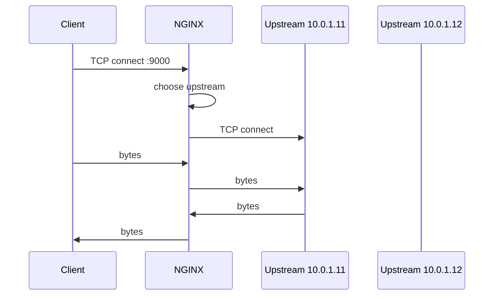
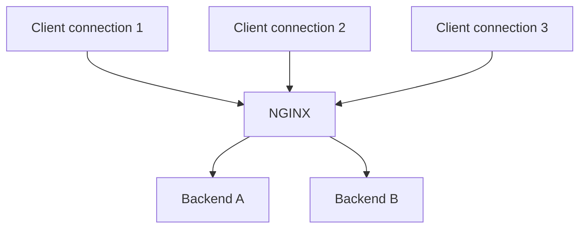
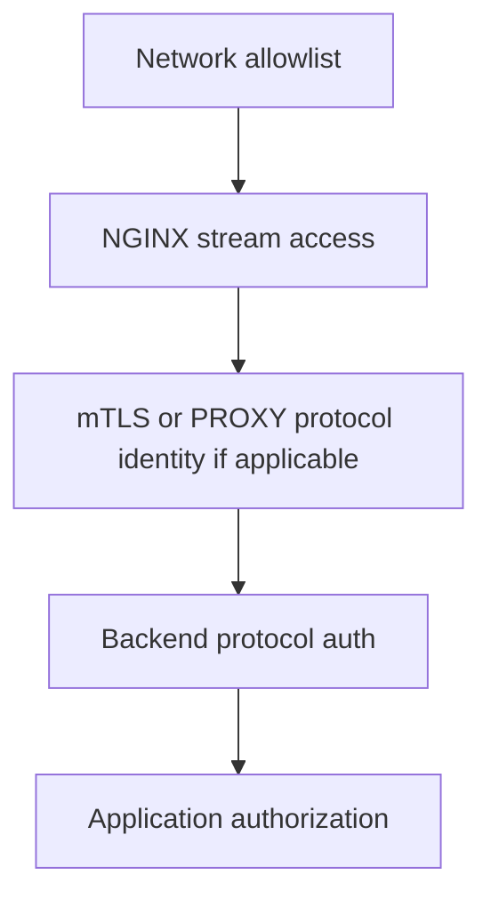
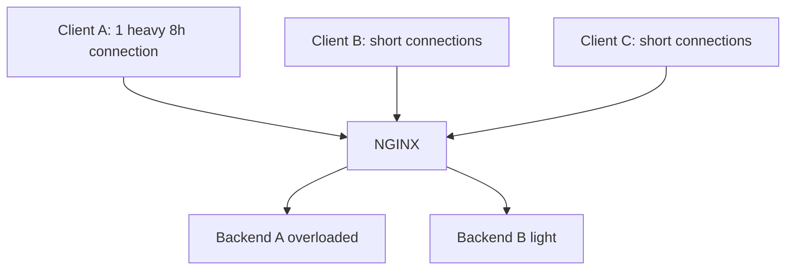

# Part 084 — TCP Load Balancing

> TCP load balancing di NGINX adalah load balancing **koneksi**, bukan load balancing query, command, transaction, atau business operation.

Kalimat itu harus menjadi invariant utama.

Saat NGINX menerima koneksi TCP pada stream listener, NGINX memilih upstream lalu menghubungkan client socket ke upstream socket. Setelah itu, NGINX meneruskan bytes dua arah sampai koneksi ditutup atau timeout. Untuk database dan protocol long-lived, keputusan upstream terjadi di awal koneksi. Kalau satu koneksi membawa ribuan query selama satu jam, semua query itu tetap berjalan melalui upstream yang sama.

Ini sangat berbeda dari HTTP request load balancing, di mana setiap request bisa dipilihkan upstream baru.

---

## 1. Minimal TCP load balancer

```nginx
stream {
    upstream app_tcp_pool {
        server 10.0.1.11:9000;
        server 10.0.1.12:9000;
    }

    server {
        listen 9000;
        proxy_pass app_tcp_pool;
    }
}
```

Alur:



Tidak ada HTTP request. Tidak ada status code. Tidak ada header.

---

## 2. Kapan NGINX cocok untuk TCP load balancing?

NGINX stream cocok jika requirement-nya sederhana dan transport-level:

- expose internal TCP service melalui stable VIP/port
- distribute new TCP connections ke beberapa backend
- terminate TLS untuk protocol non-HTTP
- passthrough TLS ke backend
- route TLS berdasarkan SNI tanpa decrypt
- apply simple allow/deny network policy
- log connection/session metrics
- preserve source identity via PROXY protocol jika backend mendukung

NGINX stream kurang cocok jika requirement-nya protocol-aware:

- SQL read/write splitting berdasarkan query
- Redis Cluster redirection awareness
- Kafka topic/partition routing
- PostgreSQL transaction pooling
- database failover dengan semantic awareness
- per-command authorization
- protocol-specific health/readiness check pada Open Source baseline

Untuk kasus tersebut, gunakan proxy/load balancer yang memang memahami protocol atau pindahkan logic ke client/application/control plane.

---

## 3. Connection-level balancing

TCP load balancing biasanya memilih upstream ketika koneksi dibuat.



Kalau client memakai connection pool:

- 10 aplikasi × 20 pooled connections = 200 balanced units.
- 1 aplikasi × 1 persistent connection = 1 balanced unit.
- 1000 queries lewat 1 connection tetap 1 upstream.

Ini penting untuk database.

Jika aplikasi menggunakan pool kecil dan koneksi panjang, distribusi traffic bisa skew walaupun load balancing config terlihat benar.

---

## 4. Load balancing algorithms untuk TCP

### 4.1 Default round-robin

```nginx
upstream tcp_pool {
    server 10.0.1.11:9000;
    server 10.0.1.12:9000;
}
```

Cocok ketika:

- connection durasi mirip
- backend homogen
- traffic tidak sticky
- client pool cukup banyak

Risiko:

- long-lived heavy connection bisa membuat imbalance.
- round-robin menghitung assignment, bukan actual work.

### 4.2 `least_conn`

```nginx
upstream tcp_pool {
    least_conn;
    server 10.0.1.11:9000;
    server 10.0.1.12:9000;
}
```

Cocok ketika:

- connection durasi bervariasi
- long-lived connection banyak
- active connection count lebih representatif daripada urutan assignment

Batasan:

- active connection count bukan workload sebenarnya.
- satu koneksi bisa idle, satu koneksi bisa sangat berat.

### 4.3 `hash`

```nginx
upstream tcp_pool {
    hash $remote_addr consistent;
    server 10.0.1.11:9000;
    server 10.0.1.12:9000;
}
```

Cocok ketika:

- butuh affinity sederhana
- cache/protocol state ada di backend
- client harus cenderung kembali ke backend sama

Risiko:

- NAT bisa membuat banyak client terlihat sebagai satu IP.
- hotspot bisa muncul.
- backend membership change tetap menyebabkan remapping sebagian key.

---

## 5. Production baseline config

```nginx
stream {
    log_format tcp_json escape=json
      '{'
        '"ts":"$time_iso8601",'
        '"remote_addr":"$remote_addr",'
        '"protocol":"$protocol",'
        '"status":"$status",'
        '"bytes_sent":$bytes_sent,'
        '"bytes_received":$bytes_received,'
        '"session_time":$session_time,'
        '"upstream_addr":"$upstream_addr",'
        '"upstream_connect_time":"$upstream_connect_time",'
        '"upstream_session_time":"$upstream_session_time"'
      '}';

    access_log /var/log/nginx/tcp-access.log tcp_json;

    upstream app_tcp_pool {
        least_conn;
        zone app_tcp_pool 64k;

        server 10.0.1.11:9000 max_fails=2 fail_timeout=10s;
        server 10.0.1.12:9000 max_fails=2 fail_timeout=10s;
    }

    server {
        listen 9000;

        proxy_connect_timeout 1s;
        proxy_timeout 5m;

        proxy_pass app_tcp_pool;
    }
}
```

Why this is better than minimal:

- structured logs exist before incident
- `least_conn` handles uneven session duration better than round-robin for many TCP workloads
- shared `zone` allows runtime state sharing across workers where applicable
- passive failure parameters are explicit
- connect/session timeouts are explicit
- config can be smoke-tested and reviewed

---

## 6. PostgreSQL example

### 6.1 Simple PostgreSQL TCP proxy

```nginx
stream {
    upstream postgres_pool {
        least_conn;
        zone postgres_pool 64k;

        server 10.10.10.11:5432 max_fails=2 fail_timeout=10s;
        server 10.10.10.12:5432 max_fails=2 fail_timeout=10s;
    }

    server {
        listen 5432;

        proxy_connect_timeout 1s;
        proxy_timeout 1h;

        proxy_pass postgres_pool;
    }
}
```

This config load-balances PostgreSQL TCP connections. It does **not** understand:

- primary vs replica role
- transaction state
- read vs write SQL
- failover promotion state
- replication lag
- prepared statement lifecycle

If both upstreams are not equivalent for writes, this config is dangerous.

### 6.2 Safer split listener model

Expose separate ports/contracts:

```nginx
stream {
    upstream postgres_primary {
        server 10.10.10.11:5432 max_fails=2 fail_timeout=10s;
    }

    upstream postgres_replicas {
        least_conn;
        server 10.10.10.21:5432 max_fails=2 fail_timeout=10s;
        server 10.10.10.22:5432 max_fails=2 fail_timeout=10s;
    }

    server {
        listen 5432;
        proxy_connect_timeout 1s;
        proxy_timeout 1h;
        proxy_pass postgres_primary;
    }

    server {
        listen 5433;
        proxy_connect_timeout 1s;
        proxy_timeout 1h;
        proxy_pass postgres_replicas;
    }
}
```

Contract:

- `:5432` = write/primary endpoint
- `:5433` = read/replica endpoint

This makes the split explicit. NGINX does not pretend to parse SQL.

### 6.3 PostgreSQL smoke test

```bash
psql "host=nginx.internal port=5432 user=app dbname=appdb sslmode=require" -c 'select 1;'
psql "host=nginx.internal port=5433 user=app dbname=appdb sslmode=require" -c 'select pg_is_in_recovery();'
```

If `pg_is_in_recovery()` returns `false` on the read endpoint unexpectedly, your upstream registry is wrong.

---

## 7. MySQL example

```nginx
stream {
    upstream mysql_pool {
        least_conn;
        zone mysql_pool 64k;

        server 10.20.10.11:3306 max_fails=2 fail_timeout=10s;
        server 10.20.10.12:3306 max_fails=2 fail_timeout=10s;
    }

    server {
        listen 3306;

        proxy_connect_timeout 1s;
        proxy_timeout 1h;

        proxy_pass mysql_pool;
    }
}
```

Same warning: NGINX is not doing MySQL read/write splitting. If backend roles differ, expose different listeners or use a protocol-aware proxy.

Smoke test:

```bash
mysql -h nginx.internal -P 3306 -u app -p -e 'select 1;'
```

Operational checks:

- Does app pool reconnect on backend failure?
- Does app retry transaction safely?
- Does backend enforce TLS/user identity?
- Does NGINX timeout outlive expected pool idle time?
- Does DB max connection budget account for NGINX fan-in?

---

## 8. Redis example

Redis can be easy or dangerous depending on deployment mode.

### 8.1 Simple standalone Redis pool

```nginx
stream {
    upstream redis_pool {
        least_conn;
        zone redis_pool 64k;

        server 10.30.10.11:6379 max_fails=2 fail_timeout=10s;
        server 10.30.10.12:6379 max_fails=2 fail_timeout=10s;
    }

    server {
        listen 6379;

        proxy_connect_timeout 500ms;
        proxy_timeout 5m;

        proxy_pass redis_pool;
    }
}
```

This only makes sense if both Redis servers are equivalent for the client operation. If they are independent caches with acceptable inconsistency, maybe. If they are primary/replica or cluster nodes with key ownership, generic TCP balancing can break correctness.

### 8.2 Redis Cluster warning

Redis Cluster clients expect MOVED/ASK redirection and key-slot ownership. Generic TCP load balancing in front of cluster nodes often creates confusion unless the client/proxy model is carefully designed.

If correctness depends on Redis Cluster semantics, prefer:

- Redis Cluster-aware client
- Redis-specific proxy
- single stable endpoint per role
- managed cache endpoint that preserves cluster semantics

---

## 9. LDAP/LDAPS example

LDAP is a common fit for TCP stream proxying.

### 9.1 Plain LDAP

```nginx
stream {
    upstream ldap_pool {
        least_conn;
        server 10.40.10.11:389 max_fails=2 fail_timeout=10s;
        server 10.40.10.12:389 max_fails=2 fail_timeout=10s;
    }

    server {
        listen 389;
        proxy_connect_timeout 1s;
        proxy_timeout 2m;
        proxy_pass ldap_pool;
    }
}
```

### 9.2 LDAPS termination at NGINX

```nginx
stream {
    upstream ldap_plain_pool {
        least_conn;
        server 10.40.10.11:389 max_fails=2 fail_timeout=10s;
        server 10.40.10.12:389 max_fails=2 fail_timeout=10s;
    }

    server {
        listen 636 ssl;

        ssl_certificate     /etc/nginx/certs/ldap.fullchain.pem;
        ssl_certificate_key /etc/nginx/certs/ldap.key;

        proxy_connect_timeout 1s;
        proxy_timeout 2m;

        proxy_pass ldap_plain_pool;
    }
}
```

If compliance requires encryption all the way to LDAP servers, re-encrypt upstream or passthrough TLS instead.

---

## 10. MQTT/custom long-lived TCP example

Long-lived protocols need different timeout thinking.

```nginx
stream {
    upstream mqtt_pool {
        least_conn;
        zone mqtt_pool 64k;

        server 10.50.10.11:1883 max_fails=2 fail_timeout=10s;
        server 10.50.10.12:1883 max_fails=2 fail_timeout=10s;
    }

    server {
        listen 1883;

        proxy_connect_timeout 2s;
        proxy_timeout 2h;

        proxy_pass mqtt_pool;
    }
}
```

For long-lived protocols, think about:

- heartbeat/keepalive frequency
- client reconnect storm after deploy
- session affinity needs
- backend drain strategy
- connection count limits
- NAT idle timeout
- LB idle timeout in front of NGINX
- graceful reload behavior

---

## 11. Preserving client identity with PROXY protocol

If backend supports PROXY protocol, NGINX can pass client address metadata.

```nginx
stream {
    upstream app_tcp_pool {
        server 10.60.10.11:9000;
        server 10.60.10.12:9000;
    }

    server {
        listen 9000;

        proxy_protocol on;
        proxy_pass app_tcp_pool;
    }
}
```

This sends a PROXY protocol header from NGINX to upstream. Backend must explicitly support and expect it. If backend does not support it, the first bytes it receives will look like garbage and protocol negotiation may fail.

If NGINX itself receives PROXY protocol from a load balancer:

```nginx
stream {
    server {
        listen 9000 proxy_protocol;
        proxy_pass app_tcp_pool;
    }
}
```

Two directions are different:

| Direction | Directive |
|---|---|
| LB/client sends PROXY protocol to NGINX | `listen ... proxy_protocol` |
| NGINX sends PROXY protocol to backend | `proxy_protocol on` |

Do not confuse them.

---

## 12. Access control for TCP services

```nginx
stream {
    server {
        listen 5432;

        allow 10.0.0.0/8;
        allow 172.16.0.0/12;
        deny all;

        proxy_pass postgres_primary;
    }
}
```

This is connection-level access control. It is not database authorization.

Layer your controls:



Do not use NGINX source IP allowlist as the only database security control. It should be an outer ring, not the identity system.

---

## 13. Passive health and retry behavior

Example:

```nginx
upstream tcp_pool {
    server 10.0.1.11:9000 max_fails=2 fail_timeout=10s;
    server 10.0.1.12:9000 max_fails=2 fail_timeout=10s;
}
```

For TCP, passive failure usually means connection-level failure. It does not mean the application operation failed correctly or incorrectly.

If NGINX fails to connect to backend A, it may try backend B depending on available upstreams and state. But once a TCP connection is established and application bytes are flowing, generic retry is not the same as safe replay.

For database protocols, replaying after partial write can duplicate operations or break transaction semantics. NGINX stream does not understand where a transaction begins/ends.

Design principle:

> Retry before application bytes are exchanged is usually transport retry. Retry after bytes are exchanged may be semantic replay. NGINX stream cannot prove semantic safety.

---

## 14. Capacity modelling for TCP load balancing

For TCP services, capacity is often bounded by:

- backend max connections
- backend memory per connection
- application pool size
- TLS handshake CPU, if terminating TLS
- file descriptors on NGINX and backend
- ephemeral ports from NGINX to upstream
- NAT/load balancer connection tracking
- long-lived idle sessions

Approximate connection budget:

```txt
max_client_connections_to_service
<= min(
  nginx_worker_connections_effective,
  nginx_fd_limit,
  backend_total_connection_capacity,
  upstream_network_nat_capacity,
  app_protocol_limits
)
```

For NGINX:

```nginx
worker_processes auto;

events {
    worker_connections 16384;
}
```

But `worker_connections` is not the whole story. One proxied TCP session generally consumes a client-side connection and an upstream-side connection. So 10,000 client sessions can imply roughly 20,000 NGINX-side sockets, plus files/logs/overhead.

Check OS limits:

```bash
ulimit -n
systemctl show nginx -p LimitNOFILE
ss -s
```

---

## 15. Long-lived connection skew

Problem:



Even with `least_conn`, active connection count may not reflect workload. A single connection can be hot.

Mitigations:

- protocol-level pooling tuning in clients
- `least_conn` instead of round-robin
- backend-level admission control
- app-level load distribution
- connection lifetime limits at protocol/client layer
- shard/partition model aware of workload
- scale out with awareness of connection stickiness

NGINX cannot split one TCP connection across multiple upstreams.

---

## 16. Draining TCP backends

Removing a backend from NGINX config and reloading does not instantly move existing TCP sessions. Existing sessions continue until closed, unless process shutdown/timeout/connection close intervenes.

Safer drain workflow:

1. Remove backend from service discovery or mark it unavailable for new connections.
2. Reload NGINX after config validation.
3. Observe existing sessions on that backend decline.
4. Wait for protocol-specific max session age or maintenance window.
5. Restart/patch backend.

Use logs and backend metrics to confirm:

```bash
awk -F'"' '/10.0.1.11:9000/ {print}' /var/log/nginx/tcp-access.log | tail
```

In NGINX Plus/commercial contexts, `drain` and dynamic upstream APIs may provide cleaner controls depending on version/license. In Open Source baseline, config reload and external orchestration are the usual primitives.

---

## 17. TLS termination for TCP service

Example custom TLS service:

```nginx
stream {
    upstream custom_plain_pool {
        server 10.70.10.11:9000;
        server 10.70.10.12:9000;
    }

    server {
        listen 9443 ssl;

        ssl_certificate     /etc/nginx/certs/tcp.example.com.fullchain.pem;
        ssl_certificate_key /etc/nginx/certs/tcp.example.com.key;

        proxy_connect_timeout 1s;
        proxy_timeout 10m;

        proxy_pass custom_plain_pool;
    }
}
```

This terminates TLS at NGINX and sends plaintext TCP to upstream.

Use this only when:

- the trust boundary allows plaintext on backend network, or
- backend network is separately encrypted/isolated, or
- compliance accepts this termination model.

If not, use upstream TLS or TLS passthrough.

---

## 18. TLS passthrough TCP load balancing

```nginx
stream {
    upstream tls_service_pool {
        least_conn;
        server 10.80.10.11:443;
        server 10.80.10.12:443;
    }

    server {
        listen 443;
        proxy_connect_timeout 1s;
        proxy_timeout 10m;
        proxy_pass tls_service_pool;
    }
}
```

Here backend owns certificate and TLS policy. NGINX cannot see inside.

Use when:

- end-to-end TLS must terminate at backend
- backend needs client certificate directly
- L7 policy at NGINX is not required

Trade-off:

- no HTTP header/path routing
- no WAF at NGINX
- limited observability
- backend certificate operations become distributed

---

## 19. SNI-based TCP routing without TLS termination

```nginx
stream {
    map $ssl_preread_server_name $tls_upstream {
        pg.example.com       pg_tls_pool;
        redis.example.com    redis_tls_pool;
        default              default_tls_pool;
    }

    upstream pg_tls_pool {
        server 10.90.10.11:443;
    }

    upstream redis_tls_pool {
        server 10.90.10.12:443;
    }

    upstream default_tls_pool {
        server 10.90.10.99:443;
    }

    server {
        listen 443;
        ssl_preread on;
        proxy_pass $tls_upstream;
    }
}
```

This requires clients to send SNI. Some clients may not. Always define safe default behavior.

Good default options:

- route to explicit reject service
- route to low-risk default backend
- close connection where supported by policy
- log missing SNI aggressively

Do not route missing SNI to a sensitive production service by accident.

---

## 20. Observability for TCP load balancing

Recommended log fields:

```nginx
log_format tcp_json escape=json
  '{'
    '"ts":"$time_iso8601",'
    '"remote_addr":"$remote_addr",'
    '"protocol":"$protocol",'
    '"status":"$status",'
    '"bytes_sent":$bytes_sent,'
    '"bytes_received":$bytes_received,'
    '"session_time":$session_time,'
    '"upstream_addr":"$upstream_addr",'
    '"upstream_connect_time":"$upstream_connect_time",'
    '"upstream_session_time":"$upstream_session_time",'
    '"ssl_preread_server_name":"$ssl_preread_server_name"'
  '}';
```

Dashboards:

| Metric/log dimension | Question answered |
|---|---|
| sessions per upstream | Is distribution balanced? |
| connect time | Is backend/network slow to accept? |
| session time p50/p95/p99 | Are sessions unexpectedly short/long? |
| bytes per session | Which upstream handles heavy flows? |
| connection failures | Is passive health triggering? |
| missing SNI count | Are clients compatible with SNI routing? |
| source IP distribution | Is NAT causing hotspot? |

Alerts:

- spike in failed stream status
- connect time p95 high
- upstream distribution skew beyond threshold
- session count near backend max connection budget
- sudden drop in session duration
- missing SNI spike on SNI-routed listener

---

## 21. Testing TCP load balancing

### 21.1 Config validation

```bash
nginx -t
nginx -T | sed -n '/^stream {/,/^}/p'
```

### 21.2 Listener test

```bash
ss -ltnp | grep ':9000'
nc -vz nginx.internal 9000
```

### 21.3 Distribution test

Open multiple connections:

```bash
for i in $(seq 1 20); do
  (echo test | nc nginx.internal 9000 >/dev/null 2>&1 &)
done
```

Then inspect stream logs for `$upstream_addr` distribution.

### 21.4 Backend failure test

Stop one backend:

```bash
systemctl stop app-tcp-service
```

Expected:

- new connections eventually avoid failed backend after passive failure threshold
- errors appear in stream logs
- client behavior is understood
- alerts fire if threshold exceeded

### 21.5 Long-lived connection test

```bash
nc nginx.internal 9000
# keep connection open while reloading NGINX
nginx -t && nginx -s reload
```

Observe whether connection survives reload and how backend sessions behave.

---

## 22. Common production incidents

### Incident 1 — “Load balancing works, but one DB is overloaded”

Likely causes:

- round-robin with uneven long-lived sessions
- client pool creates few connections
- one tenant/client generates huge traffic on one connection
- NAT/source hashing hotspot

Actions:

- inspect `$upstream_addr` distribution
- compare session count vs query load on DB
- try `least_conn` if not already
- tune client pool sizes
- move semantic load balancing to DB-aware layer if needed

### Incident 2 — “Backend logs lost real client IP”

Likely causes:

- no PROXY protocol
- backend only sees NGINX IP
- NGINX behind another LB without `listen proxy_protocol`

Actions:

- decide whether backend supports PROXY protocol
- configure inbound and outbound PROXY protocol correctly
- otherwise treat NGINX logs as source of network-level client identity

### Incident 3 — “Reload did not drain old backend”

Likely causes:

- existing TCP sessions persisted
- backend still serving old connections
- no protocol/session max lifetime

Actions:

- remove backend for new connections
- wait for session drain
- add client/backend connection lifetime policy
- consider controlled maintenance window

### Incident 4 — “TCP connect succeeds but app fails”

Likely causes:

- protocol-level auth error
- TLS mismatch
- backend role mismatch
- PROXY protocol sent to backend that does not support it
- app expects client IP/protocol metadata not present

Actions:

- test with protocol client, not only `nc`
- compare direct backend test vs through NGINX
- inspect first bytes if PROXY protocol suspected
- verify TLS mode terminate/passthrough/re-encrypt

### Incident 5 — “SNI routing sends traffic to default backend”

Likely causes:

- client does not send SNI
- SNI name mismatch
- map missing entry
- wrong default route

Actions:

- log `$ssl_preread_server_name`
- test with `openssl s_client -servername ...`
- add explicit reject/default policy
- fix client config

---

## 23. TCP load balancing decision matrix

| Scenario | NGINX stream fit | Notes |
|---|---|---|
| Simple TCP app with homogeneous replicas | Strong | Use `least_conn`, logs, passive failure |
| PostgreSQL single primary endpoint | Good | Use one upstream/endpoint; failover externalized |
| PostgreSQL read replicas | Conditional | Separate read listener; no SQL parsing |
| MySQL read/write split | Weak by itself | Use protocol-aware proxy or app-level routing |
| Redis standalone equivalent caches | Conditional | Fine only if nodes are equivalent for use case |
| Redis Cluster | Risky | Prefer cluster-aware client/proxy |
| LDAP/LDAPS | Good | Watch TLS and auth boundary |
| MQTT long-lived sessions | Conditional | Need connection lifecycle/drain planning |
| Kafka | Usually weak | Kafka clients need broker metadata awareness |
| Custom binary protocol | Good if homogeneous | Need protocol-level smoke test |
| TLS passthrough SNI routing | Good | Limited to SNI; no L7 policy |

---

## 24. Production checklist

Before shipping TCP load balancing:

- [ ] Confirm `--with-stream` or stream module availability.
- [ ] Confirm protocol is suitable for generic TCP proxying.
- [ ] Confirm all upstreams behind one listener are semantically equivalent.
- [ ] Define timeout policy per protocol.
- [ ] Define passive failure parameters.
- [ ] Decide whether `least_conn`, round-robin, or hash is appropriate.
- [ ] Validate backend max connection budget.
- [ ] Account for NGINX file descriptor/socket usage.
- [ ] Decide how client identity is preserved/logged.
- [ ] Add stream JSON logs before production.
- [ ] Add connect/session/distribution dashboard.
- [ ] Test direct backend and through-NGINX behavior.
- [ ] Test backend failure.
- [ ] Test reload with active long-lived connection.
- [ ] Document drain workflow.
- [ ] Document what NGINX does **not** understand about the protocol.

---

## 25. Mental model summary

TCP load balancing with NGINX is powerful because it is simple:

```txt
accept TCP connection
choose upstream
connect upstream
pipe bytes both ways
close on EOF/error/timeout
```

That simplicity is also the boundary.

NGINX stream can balance connections. It cannot automatically balance database queries, transactions, Redis key slots, Kafka partitions, LDAP auth semantics, or custom protocol operations.

Core invariant:

> Use NGINX stream when connection-level routing is sufficient. Use protocol-aware machinery when correctness depends on protocol semantics.

---

## References

- NGINX stream proxy module: https://nginx.org/en/docs/stream/ngx_stream_proxy_module.html
- NGINX stream upstream module: https://nginx.org/en/docs/stream/ngx_stream_upstream_module.html
- NGINX stream core module: https://nginx.org/en/docs/stream/ngx_stream_core_module.html
- F5 NGINX TCP/UDP Load Balancing: https://docs.nginx.com/nginx/admin-guide/load-balancer/tcp-udp-load-balancer/
- NGINX PROXY Protocol guide: https://docs.nginx.com/nginx/admin-guide/load-balancer/using-proxy-protocol/
