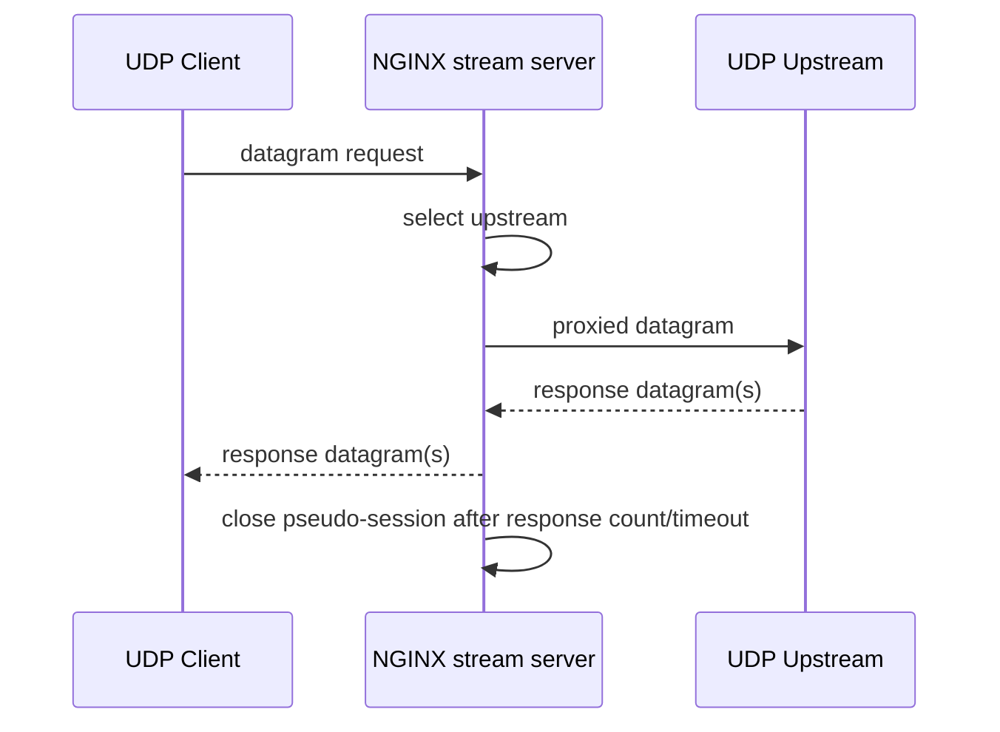

# Part 085 — UDP Load Balancing

UDP load balancing terlihat mirip TCP load balancing di konfigurasi NGINX karena sama-sama berada di block `stream {}`. Namun secara mental model, UDP sangat berbeda. TCP punya connection lifecycle. UDP tidak. TCP punya handshake, connection state, dan close signal. UDP hanya punya datagram.

Karena itu, kesalahan paling umum saat memakai NGINX untuk UDP adalah membawa asumsi TCP ke UDP:

- mengira ada connection yang benar-benar persisten,
- mengira upstream failure terlihat jelas,
- mengira retry aman,
- mengira request/response count selalu satu banding satu,
- mengira client identity selalu mudah dipertahankan,
- mengira load balancer bisa memahami transaksi aplikasi.

NGINX bisa proxy dan load balance UDP di layer 4. Tetapi NGINX tidak otomatis memahami semantik DNS, syslog, RADIUS, NTP, game protocol, telemetry protocol, atau custom UDP protocol Anda. Yang tersedia adalah routing datagram/session approximation, timeout, upstream selection, logging, dan beberapa knob untuk mengontrol berapa banyak datagram request/response yang dianggap bagian dari satu session.

Referensi resmi yang menjadi dasar part ini:

- NGINX/F5: TCP and UDP Load Balancing — `https://docs.nginx.com/nginx/admin-guide/load-balancer/tcp-udp-load-balancer/`
- NGINX stream proxy module — `https://nginx.org/en/docs/stream/ngx_stream_proxy_module.html`
- NGINX stream core module — `https://nginx.org/en/docs/stream/ngx_stream_core_module.html`
- NGINX stream upstream module — `https://nginx.org/en/docs/stream/ngx_stream_upstream_module.html`

---

## 1. Core mental model

Dalam HTTP, unit utama adalah request. Dalam TCP stream proxy, unit utama adalah connection/session. Dalam UDP, unit fisiknya adalah datagram. Namun NGINX tetap memakai abstraksi stream session untuk mengelola traffic UDP.

Artinya:

1. Client mengirim UDP datagram ke NGINX.
2. NGINX memilih upstream berdasarkan konfigurasi.
3. NGINX meneruskan datagram ke upstream.
4. NGINX menunggu satu atau lebih response datagram, tergantung `proxy_responses`.
5. Session dianggap selesai ketika response count tercapai atau timeout terjadi.



Perbedaan pentingnya: UDP tidak memberi tahu NGINX apakah remote peer masih hidup, apakah datagram sampai, apakah response hilang, atau apakah upstream memproses request tapi response drop di network.

### Invariant production

Untuk UDP, konfigurasi NGINX harus menjawab lima pertanyaan sebelum dianggap production-grade:

1. **Berapa datagram dari client yang membentuk satu logical session?**
2. **Berapa response dari upstream yang diharapkan?**
3. **Berapa lama session boleh hidup tanpa response?**
4. **Apakah protocol aman dilewatkan melalui NAT/proxy tanpa real client IP?**
5. **Bagaimana mendeteksi drop, blackhole, duplicate, atau misrouting?**

Tanpa jawaban ini, config UDP terlihat jalan saat happy path, tetapi gagal diam-diam saat traffic nyata.

---

## 2. Minimal UDP proxy

Contoh paling kecil:

```nginx
stream {
    upstream dns_backend {
        server 10.10.1.11:53;
        server 10.10.1.12:53;
    }

    server {
        listen 53 udp;
        proxy_pass dns_backend;
        proxy_timeout 5s;
    }
}
```

Config ini menerima UDP pada port 53 dan meneruskannya ke upstream group.

Tetapi minimal config belum cukup untuk production karena belum jelas:

- response count,
- timeout budget,
- upstream failure behavior,
- logging,
- source IP preservation,
- traffic-specific tuning.

---

## 3. `listen ... udp`

UDP listener di stream context memakai parameter `udp`.

```nginx
server {
    listen 53 udp reuseport;
    proxy_pass dns_backend;
}
```

`reuseport` sering dipakai untuk UDP agar kernel dapat mendistribusikan incoming datagram ke worker process secara lebih baik. Namun ini bukan magic performance switch. Ia harus diuji terhadap kernel, traffic shape, jumlah worker, dan packet distribution.

### Practical guidance

Gunakan `reuseport` untuk UDP listener yang menerima volume tinggi, terutama DNS/syslog/telemetry, tetapi validasi:

- packet distribution antar worker,
- CPU utilization,
- packet drop kernel,
- UDP receive buffer pressure,
- observability per worker bila tersedia.

---

## 4. UDP bukan TCP: apa yang hilang?

TCP memberikan banyak sinyal operasional:

| Sinyal | TCP | UDP |
|---|---:|---:|
| handshake success | ada | tidak ada |
| connection established | ada | tidak ada |
| remote close | ada | tidak ada |
| retransmission oleh transport | ada | tidak ada |
| ordered delivery | ada | tidak ada |
| backpressure transport | ada | tidak ada |
| connection duration | jelas | pseudo-session |

UDP load balancing berarti NGINX harus memakai timeout dan response count sebagai proxy untuk lifecycle.

Itulah mengapa `proxy_timeout`, `proxy_requests`, dan `proxy_responses` penting.

---

## 5. `proxy_timeout`: batas pseudo-session

`proxy_timeout` menentukan timeout antara dua operasi baca/tulis berturut-turut pada proxied connection/session.

Untuk UDP, timeout ini sering menjadi batas praktis untuk menunggu response.

```nginx
server {
    listen 123 udp;
    proxy_pass ntp_backend;
    proxy_timeout 2s;
}
```

Timeout terlalu pendek menyebabkan response lambat dianggap hilang. Timeout terlalu panjang membuat NGINX menyimpan pseudo-session terlalu lama dan meningkatkan memory/state pressure.

### Rule of thumb

| Protocol | Karakter | Timeout awal yang masuk akal |
|---|---|---:|
| DNS internal | latency rendah, request/response cepat | 1s-3s |
| NTP | request/response cepat | 1s-3s |
| RADIUS | bisa melibatkan backend auth | 3s-10s |
| syslog UDP | biasanya one-way | pendek, sering `proxy_responses 0` |
| custom telemetry | tergantung protocol | ukur dari p99/p999 |

Angka di atas bukan hukum. Production harus memakai distribusi latency nyata.

---

## 6. `proxy_responses`: berapa response yang ditunggu?

UDP protocol berbeda-beda:

- DNS query biasanya mengharapkan satu response.
- NTP request biasanya mengharapkan satu response.
- Syslog UDP biasanya tidak mengharapkan response.
- Beberapa custom protocol dapat menghasilkan beberapa response.

`proxy_responses` mengontrol jumlah response datagram dari upstream yang diharapkan.

Contoh DNS/NTP-like:

```nginx
server {
    listen 53 udp reuseport;
    proxy_pass dns_backend;
    proxy_timeout 2s;
    proxy_responses 1;
}
```

Contoh one-way syslog:

```nginx
server {
    listen 514 udp reuseport;
    proxy_pass syslog_backend;
    proxy_timeout 1s;
    proxy_responses 0;
}
```

### Mental model

`proxy_responses 1` berarti: setelah NGINX menerima satu response dari upstream untuk session ini, session dapat selesai.

`proxy_responses 0` berarti: NGINX tidak menunggu response dari upstream. Ini cocok untuk one-way UDP logging/telemetry, tetapi buruk untuk protocol request/response.

### Failure mode

Jika Anda memakai `proxy_responses 0` untuk DNS, client tidak akan menerima jawaban karena NGINX tidak menunggu/meneruskan response seperti yang Anda harapkan.

Jika Anda memakai `proxy_responses 1` untuk syslog one-way dengan upstream yang tidak pernah membalas, NGINX dapat mempertahankan pseudo-session sampai timeout, meningkatkan resource usage.

---

## 7. `proxy_requests`: berapa datagram client per session?

`proxy_requests` membatasi jumlah datagram client yang boleh diproxy dalam satu session UDP.

Untuk protocol request/response sederhana, sering kali satu request datagram cukup:

```nginx
server {
    listen 123 udp reuseport;
    proxy_pass ntp_backend;
    proxy_requests 1;
    proxy_responses 1;
    proxy_timeout 2s;
}
```

Untuk protocol yang mengirim beberapa datagram dalam satu logical exchange, Anda perlu memahami protocol-nya sebelum mengubah nilai ini.

### Production invariant

Jangan set `proxy_requests` berdasarkan tebakan. Set berdasarkan protocol contract:

- DNS query: biasanya 1 request, 1 response.
- NTP: biasanya 1 request, 1 response.
- Syslog UDP: biasanya 1 request, 0 response.
- RADIUS: request/response, tapi retransmission dapat terjadi di client side.
- Custom UDP: harus dilihat dari protocol spec atau packet capture.

---

## 8. DNS load balancing pattern

DNS adalah contoh UDP load balancing paling umum.

```nginx
stream {
    log_format udp_json escape=json
      '{'
        '"ts":"$time_iso8601",'
        '"protocol":"$protocol",'
        '"remote_addr":"$remote_addr",'
        '"remote_port":"$remote_port",'
        '"server_addr":"$server_addr",'
        '"server_port":"$server_port",'
        '"upstream_addr":"$upstream_addr",'
        '"status":"$status",'
        '"session_time":$session_time,'
        '"bytes_sent":$bytes_sent,'
        '"bytes_received":$bytes_received'
      '}';

    access_log /var/log/nginx/udp-access.log udp_json;
    error_log  /var/log/nginx/udp-error.log warn;

    upstream dns_backend {
        zone dns_backend 64k;
        server 10.10.1.11:53 max_fails=2 fail_timeout=10s;
        server 10.10.1.12:53 max_fails=2 fail_timeout=10s;
    }

    server {
        listen 53 udp reuseport;
        proxy_pass dns_backend;
        proxy_timeout 2s;
        proxy_requests 1;
        proxy_responses 1;
    }
}
```

### DNS-specific notes

1. DNS clients often retry at application layer.
2. UDP response can be truncated and client may retry over TCP.
3. If DNSSEC or large responses are common, ensure TCP DNS path also exists.
4. Load balancing DNS over UDP only is incomplete if clients rely on TCP fallback.

Production DNS often needs both:

```nginx
server {
    listen 53 udp reuseport;
    proxy_pass dns_backend;
    proxy_timeout 2s;
    proxy_requests 1;
    proxy_responses 1;
}

server {
    listen 53;
    proxy_pass dns_backend;
    proxy_timeout 5s;
}
```

Same port, different protocol: UDP and TCP.

---

## 9. Syslog UDP pattern

Syslog UDP is often one-way. The client sends logs and does not wait for response.

```nginx
stream {
    upstream syslog_backend {
        zone syslog_backend 64k;
        server 10.20.1.10:514 max_fails=3 fail_timeout=10s;
        server 10.20.1.11:514 max_fails=3 fail_timeout=10s;
    }

    server {
        listen 514 udp reuseport;
        proxy_pass syslog_backend;
        proxy_timeout 1s;
        proxy_responses 0;
    }
}
```

### Important consequence

UDP syslog has weak delivery guarantee even before NGINX is added. NGINX cannot make it reliable. It can distribute traffic, but it cannot recover packet loss without application-level acknowledgement and retry.

For compliance/security logs, prefer TCP/TLS syslog, Kafka/agent-based shipping, or protocol with acknowledgement.

---

## 10. RADIUS pattern

RADIUS commonly uses UDP and is sensitive to source IP identity. Many RADIUS deployments use source IP as part of trust/secret selection.

```nginx
stream {
    upstream radius_backend {
        zone radius_backend 64k;
        server 10.30.1.10:1812 max_fails=2 fail_timeout=10s;
        server 10.30.1.11:1812 max_fails=2 fail_timeout=10s;
    }

    server {
        listen 1812 udp reuseport;
        proxy_pass radius_backend;
        proxy_timeout 5s;
        proxy_requests 1;
        proxy_responses 1;
    }
}
```

### RADIUS identity trap

The upstream may see NGINX's IP, not the original client IP. If upstream RADIUS uses client IP for shared secret selection or policy, this can break auth.

Possible approaches:

1. Configure upstream to trust NGINX as the RADIUS client.
2. Use network design preserving source IP where possible.
3. Use a protocol-aware RADIUS proxy when original client identity must be preserved semantically.
4. Avoid pretending NGINX can inject client identity into arbitrary UDP protocol payload safely.

NGINX stream proxy is not a RADIUS-aware proxy. It does not rewrite RADIUS attributes as a dedicated RADIUS proxy would.

---

## 11. NTP pattern

NTP request/response is usually simple, but precision-sensitive.

```nginx
stream {
    upstream ntp_backend {
        zone ntp_backend 64k;
        server 10.40.1.10:123;
        server 10.40.1.11:123;
    }

    server {
        listen 123 udp reuseport;
        proxy_pass ntp_backend;
        proxy_timeout 2s;
        proxy_requests 1;
        proxy_responses 1;
    }
}
```

### NTP caution

If clients care deeply about time accuracy, inserting a proxy can affect perceived latency and jitter. For high-precision time infrastructure, validate against actual NTP behavior and consider whether direct anycast/service routing is more appropriate.

---

## 12. Upstream selection for UDP

Stream upstream supports familiar concepts such as upstream group, weights, fail counters, and load balancing methods.

Basic weighted upstream:

```nginx
upstream udp_backend {
    zone udp_backend 64k;
    server 10.0.1.10:9999 weight=2 max_fails=2 fail_timeout=10s;
    server 10.0.1.11:9999 weight=1 max_fails=2 fail_timeout=10s;
}
```

### Weighted UDP caveat

Weight affects upstream selection. It does not enforce capacity. If one backend is slower and clients retransmit, traffic shape may become uneven in ways that a simple weight ratio does not explain.

For UDP, validate with packet-level and application-level metrics.

---

## 13. Passive failure detection in UDP

Passive failure is harder in UDP because there is no connection failure the way TCP has connection refused/reset in the same sense.

NGINX can infer failure from timeout or network errors, but many UDP failures are silent:

- upstream receives but drops,
- upstream processes but response lost,
- upstream response blocked by firewall,
- client retransmits to NGINX,
- packet fragmented and dropped,
- application rejects payload silently.

### Practical implication

For UDP, active health checks are often more valuable than passive failure detection. In NGINX Open Source, active upstream health checking is not generally available as a built-in feature for upstream groups in the same way NGINX Plus provides. Common alternatives:

- external health checker generating config and reloading NGINX,
- Kubernetes Service readiness if running in Kubernetes,
- DNS/service discovery that only returns healthy endpoints,
- protocol-specific load balancer/proxy,
- NGINX Plus where active checks are required and justified.

---

## 14. Source IP and identity

In UDP proxying, upstream usually sees NGINX as the source IP unless transparent proxying or specific network design is used.

This matters for:

- DNS ACLs,
- RADIUS shared secrets,
- syslog source attribution,
- abuse detection,
- tenant attribution,
- per-client rate limiting at upstream.

### Logging client identity at NGINX

Even if upstream sees NGINX, NGINX can log client identity:

```nginx
log_format udp_json escape=json
  '{'
    '"ts":"$time_iso8601",'
    '"remote_addr":"$remote_addr",'
    '"remote_port":"$remote_port",'
    '"upstream_addr":"$upstream_addr",'
    '"protocol":"$protocol",'
    '"status":"$status",'
    '"session_time":$session_time,'
    '"bytes_sent":$bytes_sent,'
    '"bytes_received":$bytes_received'
  '}';
```

This helps observability, but does not automatically transfer identity to upstream protocol semantics.

---

## 15. PROXY protocol and UDP

PROXY protocol is useful when the upstream supports it and expects client metadata before payload. However, not every UDP protocol or server supports PROXY protocol.

For arbitrary UDP services, do not enable PROXY protocol unless upstream explicitly supports it.

Bad assumption:

```txt
"We need real client IP, so enable PROXY protocol."
```

Correct reasoning:

```txt
"Does this upstream UDP service understand PROXY protocol framing for this protocol and port? If not, enabling it corrupts the payload."
```

---

## 16. UDP buffering and kernel pressure

High-volume UDP is often limited by kernel buffers before application code becomes visible.

Watch for:

- receive buffer drops,
- NIC drops,
- conntrack table pressure if NAT/firewall involved,
- CPU softirq pressure,
- uneven worker distribution,
- packet fragmentation,
- MTU issues.

NGINX logs may not show every dropped packet if packets are dropped before NGINX receives them.

### Operational checklist

At minimum, observe:

```bash
ss -u -n -a
netstat -su
sar -n UDP,ETCP 1
ip -s link show
cat /proc/net/snmp | grep -E 'Udp|Ip'
```

Also inspect firewall/NAT/conntrack if traffic crosses those layers.

---

## 17. Rate limiting UDP

NGINX stream has different module capabilities from HTTP. HTTP `limit_req` is not available inside `stream {}`. Do not copy HTTP rate limiting snippets into stream context.

For UDP abuse control, options include:

- network firewall rate limiting,
- cloud load balancer/WAF/DDoS controls,
- application/protocol-aware limiter,
- eBPF/XDP layer,
- NGINX Plus or external telemetry/control-plane pattern depending on requirement,
- kernel tuning and packet filtering.

The edge design should state where UDP abuse control actually happens. If the answer is “NGINX stream config”, verify module support, not hope.

---

## 18. Observability for UDP stream

A useful UDP stream log should capture session-level facts:

```nginx
stream {
    log_format udp_json escape=json
      '{'
        '"ts":"$time_iso8601",'
        '"protocol":"$protocol",'
        '"remote_addr":"$remote_addr",'
        '"remote_port":"$remote_port",'
        '"server_addr":"$server_addr",'
        '"server_port":"$server_port",'
        '"upstream_addr":"$upstream_addr",'
        '"status":"$status",'
        '"session_time":$session_time,'
        '"bytes_sent":$bytes_sent,'
        '"bytes_received":$bytes_received'
      '}';

    access_log /var/log/nginx/stream-udp-access.log udp_json;
}
```

### Metrics to derive

| Signal | Meaning |
|---|---|
| session count by protocol/listener | traffic volume |
| bytes in/out | payload volume |
| session time p50/p95/p99 | response behavior |
| status distribution | timeout/error patterns |
| upstream distribution | load balancing behavior |
| no-response sessions | upstream or protocol mismatch |
| client top talkers | abuse/misconfiguration |

### What logs cannot prove

A session log cannot prove application success unless protocol response can be interpreted. For DNS, RADIUS, or custom UDP, pair NGINX logs with application-level metrics.

---

## 19. Failure matrix

| Symptom | Likely causes | First checks |
|---|---|---|
| client timeout | `proxy_responses` wrong, upstream no response, firewall blocks return path, timeout too short | tcpdump both sides, NGINX status/log, upstream app log |
| upstream sees NGINX IP only | normal proxy behavior | identity requirement, PROXY support, network design |
| uneven backend distribution | weight, `reuseport`, client retransmission, backend latency | upstream log, packet count, NGINX access log |
| high memory/session state | timeout too long, waiting for responses that never come | `proxy_responses`, `proxy_timeout`, traffic protocol |
| syslog drops | UDP unreliability, kernel buffer, backend overload | `netstat -su`, NIC drops, syslog backend queue |
| DNS intermittent failures | UDP-only path, large response truncation, TCP fallback missing | test TCP/UDP DNS, EDNS/MTU, upstream metrics |
| RADIUS auth broken | source IP/secret mismatch | upstream RADIUS client config, packet capture |

---

## 20. Packet capture discipline

For UDP, packet capture is not optional in serious debugging.

Capture at client side:

```bash
tcpdump -ni any udp port 53
```

Capture at NGINX ingress:

```bash
tcpdump -ni eth0 udp port 53
```

Capture at NGINX egress/upstream side:

```bash
tcpdump -ni eth1 host 10.10.1.11 and udp port 53
```

You want to answer:

1. Did NGINX receive the client datagram?
2. Did NGINX forward it to upstream?
3. Did upstream respond?
4. Did NGINX receive upstream response?
5. Did NGINX send response to client?
6. Did client receive it?

Only after this chain is known should you blame application logic.

---

## 21. Production template: DNS with UDP and TCP fallback

```nginx
# /etc/nginx/nginx.conf
worker_processes auto;

events {
    worker_connections 8192;
}

stream {
    log_format stream_json escape=json
      '{'
        '"ts":"$time_iso8601",'
        '"protocol":"$protocol",'
        '"remote_addr":"$remote_addr",'
        '"remote_port":"$remote_port",'
        '"server_addr":"$server_addr",'
        '"server_port":"$server_port",'
        '"upstream_addr":"$upstream_addr",'
        '"status":"$status",'
        '"session_time":$session_time,'
        '"bytes_sent":$bytes_sent,'
        '"bytes_received":$bytes_received'
      '}';

    access_log /var/log/nginx/stream-access.log stream_json;
    error_log  /var/log/nginx/stream-error.log warn;

    upstream dns_backend {
        zone dns_backend 64k;
        server 10.10.1.11:53 max_fails=2 fail_timeout=10s;
        server 10.10.1.12:53 max_fails=2 fail_timeout=10s;
    }

    server {
        listen 53 udp reuseport;
        proxy_pass dns_backend;
        proxy_timeout 2s;
        proxy_requests 1;
        proxy_responses 1;
    }

    server {
        listen 53;
        proxy_pass dns_backend;
        proxy_timeout 5s;
    }
}
```

Smoke test:

```bash
# UDP DNS
 dig @127.0.0.1 example.com A +time=2 +tries=1

# TCP DNS fallback
 dig @127.0.0.1 example.com A +tcp +time=5 +tries=1

# Config validation
 nginx -t
```

---

## 22. Production template: one-way syslog UDP

```nginx
stream {
    log_format syslog_udp_json escape=json
      '{'
        '"ts":"$time_iso8601",'
        '"protocol":"$protocol",'
        '"remote_addr":"$remote_addr",'
        '"upstream_addr":"$upstream_addr",'
        '"status":"$status",'
        '"session_time":$session_time,'
        '"bytes_sent":$bytes_sent,'
        '"bytes_received":$bytes_received'
      '}';

    access_log /var/log/nginx/syslog-udp-access.log syslog_udp_json;

    upstream syslog_backend {
        zone syslog_backend 64k;
        server 10.20.1.10:514 max_fails=3 fail_timeout=10s;
        server 10.20.1.11:514 max_fails=3 fail_timeout=10s;
    }

    server {
        listen 514 udp reuseport;
        proxy_pass syslog_backend;
        proxy_timeout 1s;
        proxy_responses 0;
    }
}
```

Smoke test:

```bash
logger -n 127.0.0.1 -P 514 -d "nginx udp syslog smoke test"
```

But remember: a successful send does not prove durable log ingestion. Verify at syslog backend.

---

## 23. Safe rollout checklist

Before enabling UDP load balancing in production:

- [ ] Protocol request/response contract is documented.
- [ ] `proxy_requests` and `proxy_responses` match protocol behavior.
- [ ] `proxy_timeout` is based on measured latency, not guesswork.
- [ ] TCP fallback exists if protocol requires it.
- [ ] Upstream identity expectations are documented.
- [ ] Packet capture test proves both ingress and egress flow.
- [ ] Logs include protocol, remote address, upstream address, bytes, status, session time.
- [ ] Kernel UDP drops are observable.
- [ ] Firewall/NAT/conntrack path is understood.
- [ ] Upstream health strategy is defined.
- [ ] Abuse/DDoS controls are placed somewhere real.
- [ ] Rollback is tested.

---

## 24. What top engineers internalize

UDP load balancing is not “TCP load balancing but faster”. It is proxying unreliable datagrams through a system that must invent enough lifecycle state to route responses. The dangerous parts are not syntax. The dangerous parts are invisible assumptions:

- Does this protocol expect response?
- How many?
- Does source IP matter?
- Is application retry safe?
- Can packet loss be tolerated?
- Does upstream health failure produce any signal?
- Can the business tolerate silent drop?

A strong NGINX engineer treats UDP as a protocol-specific architecture decision, not a generic load balancer checkbox.

---

## 25. Summary

UDP load balancing with NGINX is powerful for DNS, syslog, RADIUS, NTP, and custom UDP services, but it must be designed around UDP's lack of connection semantics. The critical directives are not only `listen ... udp` and `proxy_pass`, but also `proxy_timeout`, `proxy_requests`, and `proxy_responses`.

The production invariant is simple:

```txt
For every UDP listener, document the protocol lifecycle, response expectation, timeout budget, identity model, health strategy, and loss tolerance.
```

If that invariant is missing, the config may pass `nginx -t`, but the system is not production-ready.
