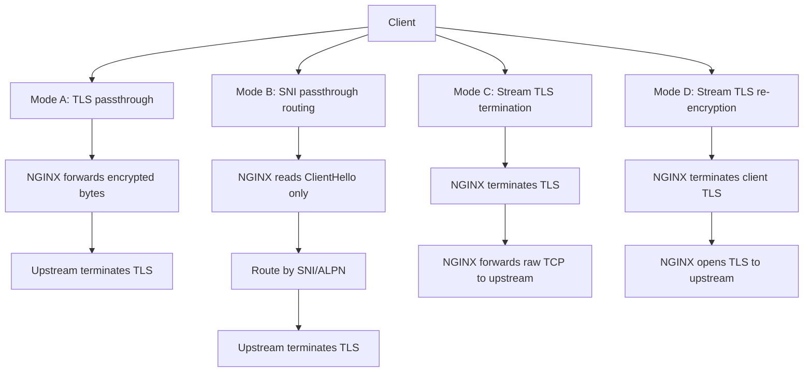

# Part 086 — Stream SSL Termination and Passthrough

Saat NGINX berada di HTTP context, TLS termination biasanya berarti: client berbicara HTTPS ke NGINX, NGINX membuka TLS, membaca HTTP request, lalu meneruskan request ke upstream HTTP/HTTPS.

Di `stream {}`, mental model-nya berbeda. NGINX berada di Layer 4. Ia bisa:

1. **TLS passthrough** — meneruskan encrypted TCP bytes tanpa membuka TLS.
2. **SNI-based passthrough routing** — membaca ClientHello dengan `ssl_preread` tanpa terminasi TLS, lalu memilih upstream berdasarkan SNI/ALPN.
3. **Stream TLS termination** — membuka TLS di stream layer, tetapi tetap tidak membaca HTTP semantics.
4. **Stream TLS re-encryption** — terminate TLS dari client, lalu membuat TLS connection baru ke upstream.

Kesalahan paling umum: mengira stream TLS termination sama dengan HTTPS reverse proxy. Tidak sama. Setelah TLS dibuka di stream context, NGINX tetap bekerja sebagai byte-stream proxy, bukan HTTP router. Tidak ada `location`, tidak ada `proxy_set_header`, tidak ada `$uri`, tidak ada HTTP cache, tidak ada HTTP header policy.

Referensi resmi yang menjadi dasar part ini:

- NGINX stream SSL module — `https://nginx.org/en/docs/stream/ngx_stream_ssl_module.html`
- NGINX stream SSL preread module — `https://nginx.org/en/docs/stream/ngx_stream_ssl_preread_module.html`
- NGINX stream proxy module — `https://nginx.org/en/docs/stream/ngx_stream_proxy_module.html`
- NGINX stream core module — `https://nginx.org/en/docs/stream/ngx_stream_core_module.html`

---

## 1. Four deployment modes



Each mode answers a different architectural question.

| Mode | NGINX can see HTTP? | NGINX owns cert? | Upstream owns cert? | Can route by SNI? | Can add HTTP headers? |
|---|---:|---:|---:|---:|---:|
| TLS passthrough | no | no | yes | no, unless preread | no |
| SNI passthrough | no | no | yes | yes | no |
| Stream TLS termination | no | yes | optional | yes, if needed before termination routing | no |
| Stream TLS re-encryption | no | yes | yes | yes | no |
| HTTP TLS termination | yes | yes | optional | yes | yes |

If you need HTTP routing, HTTP headers, auth_request, rate limiting by URI, cache, CORS, or WAF-like HTTP controls, you probably need `http {}` context, not stream TLS termination.

---

## 2. Why stream TLS exists

Stream TLS is useful when the proxied protocol is not HTTP:

- PostgreSQL over TLS,
- MySQL over TLS,
- Redis TLS,
- MQTT TLS,
- LDAPS,
- SMTP submission with TLS wrapper,
- custom TLS-wrapped TCP protocols,
- generic TLS multiplexing based on SNI.

It is also useful when you need to route encrypted traffic without decrypting it.

---

## 3. Mode A: plain TLS passthrough

Plain passthrough does not require NGINX to understand TLS. It is just TCP proxying encrypted bytes.

```nginx
stream {
    upstream app_tls_backend {
        server 10.10.1.10:443;
        server 10.10.1.11:443;
    }

    server {
        listen 443;
        proxy_pass app_tls_backend;
        proxy_timeout 1h;
    }
}
```

Client TLS handshake happens with the upstream, not with NGINX.

### What NGINX can do

- Accept TCP connection.
- Select upstream.
- Proxy bytes.
- Apply TCP-level timeout.
- Log stream variables.
- Optionally pass PROXY protocol if upstream supports it.

### What NGINX cannot do

- Inspect HTTP path.
- Add `X-Forwarded-For` HTTP header.
- Apply HTTP cache.
- Validate HTTP method.
- Enforce CORS.
- Apply HTTP auth_request.
- Serve ACME HTTP-01 challenge on that same stream listener.

---

## 4. Mode B: SNI-based TLS passthrough with `ssl_preread`

`ssl_preread` allows NGINX to inspect the TLS ClientHello without terminating TLS. This exposes values such as SNI and ALPN protocol.

Officially, `ngx_stream_ssl_preread_module` allows extracting information from ClientHello without terminating SSL/TLS, and it is not built by default when building from source; it requires `--with-stream_ssl_preread_module`.

Example:

```nginx
stream {
    map $ssl_preread_server_name $tls_upstream {
        app-a.example.com app_a_tls;
        app-b.example.com app_b_tls;
        default           default_tls;
    }

    upstream app_a_tls {
        server 10.10.1.10:443;
    }

    upstream app_b_tls {
        server 10.10.2.10:443;
    }

    upstream default_tls {
        server 10.10.9.10:443;
    }

    server {
        listen 443;
        proxy_pass $tls_upstream;
        ssl_preread on;
        proxy_timeout 1h;
    }
}
```

### What happens

1. Client connects to NGINX TCP 443.
2. Client sends TLS ClientHello.
3. NGINX reads SNI from ClientHello.
4. NGINX selects upstream based on `$ssl_preread_server_name`.
5. NGINX forwards encrypted stream to selected upstream.
6. Upstream completes TLS handshake with client.

NGINX does not decrypt traffic.

---

## 5. SNI passthrough request flow

```mermaid
sequenceDiagram
    participant C as Client
    participant N as NGINX stream ssl_preread
    participant A as Upstream A
    participant B as Upstream B

    C->>N: TCP connect :443
    C->>N: TLS ClientHello SNI=app-a.example.com
    N->>N: read SNI without TLS termination
    N->>A: proxy encrypted bytes
    C<->>A: TLS handshake continues end-to-end
    C<->>A: encrypted application traffic
```

The TLS certificate shown to client belongs to upstream A, not NGINX.

---

## 6. SNI passthrough boundary

SNI passthrough is powerful, but limited:

| Need | SNI passthrough suitable? | Reason |
|---|---:|---|
| route by hostname | yes | SNI available in ClientHello |
| route by URI path | no | URI is inside encrypted HTTP |
| inject headers | no | HTTP encrypted and not parsed |
| central TLS cert management | no | upstream owns cert |
| mTLS at upstream | yes | TLS remains end-to-end |
| centralized WAF | no | NGINX cannot inspect HTTP |
| same port HTTPS + SSH multiplexing | possible with preread protocol patterns | must be designed carefully |

If someone asks for `/api` to route to one upstream and `/admin` to another, SNI passthrough cannot do it. Use HTTP termination.

---

## 7. ALPN-based stream routing

`ssl_preread` can expose ALPN protocols via `$ssl_preread_alpn_protocols`.

This can be useful when routing different TLS-wrapped protocols or distinguishing HTTP/2-capable traffic.

Example sketch:

```nginx
stream {
    map $ssl_preread_alpn_protocols $alpn_upstream {
        ~\bh2\b        h2_backend;
        ~\bhttp/1.1\b  http11_backend;
        default        default_backend;
    }

    upstream h2_backend {
        server 10.0.1.10:443;
    }

    upstream http11_backend {
        server 10.0.1.11:443;
    }

    upstream default_backend {
        server 10.0.1.12:443;
    }

    server {
        listen 443;
        ssl_preread on;
        proxy_pass $alpn_upstream;
    }
}
```

### Caution

ALPN is client-advertised. Treat it as routing input, not authorization proof.

---

## 8. Mode C: stream TLS termination

With stream SSL termination, NGINX owns the certificate and terminates TLS. But unlike HTTP TLS termination, NGINX still does not parse HTTP.

```nginx
stream {
    upstream raw_backend {
        server 10.20.1.10:9000;
    }

    server {
        listen 9443 ssl;

        ssl_certificate     /etc/nginx/certs/service/fullchain.pem;
        ssl_certificate_key /etc/nginx/certs/service/privkey.pem;

        proxy_pass raw_backend;
        proxy_timeout 1h;
    }
}
```

Client connects with TLS to NGINX. NGINX decrypts. Then NGINX forwards raw TCP bytes to upstream.

This is useful for protocols where NGINX should own external TLS, but upstream speaks plaintext TCP.

Examples:

- custom binary protocol over TLS externally,
- legacy TCP service behind TLS wrapper,
- internal MQTT/plain TCP backend exposed as TLS externally,
- controlled network where NGINX is the TLS boundary.

---

## 9. Stream termination is not HTTP termination

This config terminates TLS but does not allow HTTP directives:

```nginx
stream {
    server {
        listen 443 ssl;
        ssl_certificate     /etc/nginx/certs/fullchain.pem;
        ssl_certificate_key /etc/nginx/certs/privkey.pem;
        proxy_pass 10.0.0.10:8080;
    }
}
```

If upstream is HTTP, bytes after TLS decryption are HTTP bytes, but stream context does not parse them. You cannot do:

```nginx
# Invalid in stream context
location /api { }
proxy_set_header X-Forwarded-For $proxy_add_x_forwarded_for;
add_header Strict-Transport-Security "max-age=31536000";
```

Use `http {}` for that.

---

## 10. Mode D: stream TLS re-encryption

NGINX can terminate client TLS and initiate TLS to upstream.

```nginx
stream {
    upstream secure_backend {
        server 10.30.1.10:9443;
    }

    server {
        listen 9443 ssl;

        ssl_certificate     /etc/nginx/certs/client-facing/fullchain.pem;
        ssl_certificate_key /etc/nginx/certs/client-facing/privkey.pem;

        proxy_pass secure_backend;
        proxy_ssl on;
        proxy_ssl_server_name on;
        proxy_ssl_name backend.internal.example.com;
        proxy_ssl_trusted_certificate /etc/nginx/certs/internal-ca.pem;
        proxy_ssl_verify on;
        proxy_ssl_verify_depth 2;
    }
}
```

This creates two TLS sessions:


### Why use re-encryption?

- External cert differs from internal cert.
- Internal network requires encryption.
- Upstream requires TLS client identity from NGINX.
- Compliance requires encryption over every hop.
- You need central external TLS policy without plaintext backend hop.

---

## 11. Upstream TLS verification matters

If NGINX connects to upstream over TLS but does not verify upstream certificate, encryption exists but identity does not.

Bad pattern:

```nginx
proxy_ssl on;
# no proxy_ssl_verify
```

Better pattern:

```nginx
proxy_ssl on;
proxy_ssl_server_name on;
proxy_ssl_name backend.internal.example.com;
proxy_ssl_trusted_certificate /etc/nginx/certs/internal-ca.pem;
proxy_ssl_verify on;
proxy_ssl_verify_depth 2;
```

Production invariant:

```txt
If upstream TLS is used for trust, NGINX must verify upstream identity.
```

Without verification, a network attacker or misrouted endpoint can terminate TLS with any certificate and still receive traffic.

---

## 12. Client certificate authentication in stream

Stream SSL module supports client certificate verification patterns similar in spirit to HTTP SSL, but again without HTTP routing semantics.

Example:

```nginx
stream {
    upstream mtls_backend {
        server 10.40.1.10:9000;
    }

    server {
        listen 9443 ssl;

        ssl_certificate     /etc/nginx/certs/server/fullchain.pem;
        ssl_certificate_key /etc/nginx/certs/server/privkey.pem;

        ssl_client_certificate /etc/nginx/certs/client-ca.pem;
        ssl_verify_client on;
        ssl_verify_depth 2;

        proxy_pass mtls_backend;
    }
}
```

This is useful for TCP protocols where client identity is certificate-based at the edge.

### Boundary

NGINX stream can verify the certificate, but unless the upstream protocol receives identity metadata somehow, upstream may not know which client certificate was used.

Options:

- NGINX enforces all access and upstream only receives allowed clients.
- PROXY protocol TLV or protocol-specific metadata if supported.
- terminate TLS at upstream instead using passthrough if upstream must inspect client certificate.
- use HTTP context if identity forwarding via headers is required for HTTP.

---

## 13. Choosing termination vs passthrough

Use this decision table.

| Requirement | Recommended mode |
|---|---|
| central certificate management at NGINX | stream termination or HTTP termination |
| route by hostname without decrypting | SNI passthrough |
| route by path/header/cookie | HTTP termination, not stream |
| upstream must see client certificate directly | passthrough |
| NGINX must verify client certificate | stream termination or HTTP termination |
| protocol is non-HTTP but needs TLS at edge | stream termination |
| protocol is HTTP and needs headers/cache/auth | HTTP termination |
| compliance requires encrypted backend hop | re-encryption or passthrough |
| centralized WAF/security inspection | HTTP termination / WAF path |

---

## 14. Security boundary comparison

### Passthrough

Benefits:

- end-to-end TLS from client to upstream,
- upstream controls cert and mTLS,
- NGINX sees minimal sensitive data,
- lower HTTP-layer responsibility at NGINX.

Costs:

- no HTTP inspection,
- no centralized TLS policy,
- no header injection,
- no central HTTP auth/cache/WAF,
- cert lifecycle distributed to upstream owners.

### Termination

Benefits:

- central TLS policy,
- central certificate lifecycle,
- possible client cert enforcement at NGINX,
- upstream can be simpler,
- logs can include TLS handshake/session details.

Costs:

- NGINX becomes trust boundary,
- plaintext may exist between NGINX and upstream unless re-encrypted,
- client certificate identity may not reach upstream naturally,
- wrong context choice can remove HTTP controls.

---

## 15. SNI routing footguns

### Footgun 1 — no SNI

Some clients may not send SNI. Then `$ssl_preread_server_name` is empty.

Always define default behavior:

```nginx
map $ssl_preread_server_name $tls_upstream {
    app-a.example.com app_a_tls;
    app-b.example.com app_b_tls;
    default           reject_or_default_tls;
}
```

If the default upstream serves a valid certificate for another tenant, you can leak service existence or route traffic incorrectly.

### Footgun 2 — SNI is not HTTP Host

SNI is sent during TLS handshake. HTTP Host is inside encrypted HTTP request after handshake. They can differ. In passthrough, NGINX cannot compare them.

### Footgun 3 — wildcard/default cert behavior is upstream-owned

In passthrough, NGINX does not choose the certificate. The selected upstream does.

### Footgun 4 — encrypted ClientHello/ECH

As encrypted ClientHello adoption evolves, SNI visibility may become less reliable in some environments. Treat SNI-based passthrough as dependent on client-visible SNI. If your routing architecture requires plaintext SNI forever, document that assumption.

---

## 16. Observability for stream TLS

In stream context, logs should expose the routing decision and TLS preread fields where available.

```nginx
stream {
    log_format stream_tls_json escape=json
      '{'
        '"ts":"$time_iso8601",'
        '"remote_addr":"$remote_addr",'
        '"remote_port":"$remote_port",'
        '"server_addr":"$server_addr",'
        '"server_port":"$server_port",'
        '"protocol":"$protocol",'
        '"sni":"$ssl_preread_server_name",'
        '"alpn":"$ssl_preread_alpn_protocols",'
        '"upstream_addr":"$upstream_addr",'
        '"status":"$status",'
        '"session_time":$session_time,'
        '"bytes_sent":$bytes_sent,'
        '"bytes_received":$bytes_received'
      '}';

    access_log /var/log/nginx/stream-tls-access.log stream_tls_json;
}
```

For termination mode, additional SSL variables may be available depending on modules/version/build. Validate with `nginx -T` and official variable docs.

### Useful questions logs should answer

1. Which SNI was requested?
2. Which upstream was selected?
3. Did default route catch unexpected traffic?
4. How long did the session last?
5. How many bytes flowed in each direction?
6. Which clients are sending no SNI?
7. Are there spikes in handshake/session failure?

---

## 17. Health checks and TLS passthrough

In passthrough mode, health checking is tricky because the backend owns TLS and application protocol. Passive failure may detect connect errors, but not semantic failures.

Examples:

- TLS handshake succeeds but app is broken.
- Certificate expired but clients fail while TCP connect succeeds.
- Upstream accepts TCP but stalls after handshake.
- SNI route points to wrong cluster with valid TCP listener.

NGINX Open Source often needs external health strategy for advanced checks:

- synthetic TLS handshake check per SNI,
- protocol-specific health check,
- generated upstream config from service discovery,
- Kubernetes readiness,
- NGINX Plus active checks if justified.

---

## 18. Testing TLS passthrough

Use `openssl s_client` with SNI:

```bash
openssl s_client \
  -connect 127.0.0.1:443 \
  -servername app-a.example.com \
  -alpn h2,http/1.1 \
  -showcerts
```

Validate:

- certificate belongs to upstream app A,
- SNI app B routes to app B,
- unknown SNI goes to safe default,
- no-SNI behavior is intentional,
- ALPN advertised/selected behavior is acceptable.

For passthrough, the certificate returned is not from NGINX unless the selected upstream is NGINX.

---

## 19. Testing stream TLS termination

For termination mode:

```bash
openssl s_client \
  -connect 127.0.0.1:9443 \
  -servername service.example.com \
  -showcerts
```

Validate:

- certificate is NGINX-managed certificate,
- certificate chain is correct,
- unsupported protocol versions/ciphers are rejected according to policy,
- upstream receives decrypted TCP traffic,
- client certificate requirement works if mTLS is enabled.

For client certificate:

```bash
openssl s_client \
  -connect 127.0.0.1:9443 \
  -servername service.example.com \
  -cert client.pem \
  -key client.key \
  -CAfile ca.pem
```

---

## 20. Production pattern: safe SNI passthrough router

```nginx
worker_processes auto;

events {
    worker_connections 8192;
}

stream {
    log_format sni_router_json escape=json
      '{'
        '"ts":"$time_iso8601",'
        '"remote_addr":"$remote_addr",'
        '"sni":"$ssl_preread_server_name",'
        '"alpn":"$ssl_preread_alpn_protocols",'
        '"upstream_addr":"$upstream_addr",'
        '"status":"$status",'
        '"session_time":$session_time,'
        '"bytes_sent":$bytes_sent,'
        '"bytes_received":$bytes_received'
      '}';

    access_log /var/log/nginx/sni-router-access.log sni_router_json;
    error_log  /var/log/nginx/sni-router-error.log warn;

    map $ssl_preread_server_name $tls_upstream {
        app-a.example.com app_a_tls;
        app-b.example.com app_b_tls;
        default           blackhole_tls;
    }

    upstream app_a_tls {
        zone app_a_tls 64k;
        server 10.10.1.10:443 max_fails=2 fail_timeout=10s;
        server 10.10.1.11:443 max_fails=2 fail_timeout=10s;
    }

    upstream app_b_tls {
        zone app_b_tls 64k;
        server 10.10.2.10:443 max_fails=2 fail_timeout=10s;
    }

    upstream blackhole_tls {
        zone blackhole_tls 64k;
        server 127.0.0.1:9444;
    }

    server {
        listen 443 reuseport;
        ssl_preread on;
        proxy_pass $tls_upstream;
        proxy_connect_timeout 3s;
        proxy_timeout 1h;
    }

    server {
        listen 127.0.0.1:9444;
        return 444;
    }
}
```

### Notes

- Unknown SNI does not accidentally reach a tenant backend.
- Logs capture SNI and upstream.
- This does not do HTTP inspection.
- Upstream owns certificates.

---

## 21. Production pattern: stream TLS termination with upstream TLS verification

```nginx
stream {
    log_format stream_terminated_tls_json escape=json
      '{'
        '"ts":"$time_iso8601",'
        '"remote_addr":"$remote_addr",'
        '"upstream_addr":"$upstream_addr",'
        '"status":"$status",'
        '"session_time":$session_time,'
        '"bytes_sent":$bytes_sent,'
        '"bytes_received":$bytes_received'
      '}';

    access_log /var/log/nginx/stream-terminated-tls-access.log stream_terminated_tls_json;

    upstream internal_tls_backend {
        zone internal_tls_backend 64k;
        server 10.30.1.10:9443 max_fails=2 fail_timeout=10s;
        server 10.30.1.11:9443 max_fails=2 fail_timeout=10s;
    }

    server {
        listen 9443 ssl reuseport;

        ssl_certificate     /etc/nginx/certs/external/fullchain.pem;
        ssl_certificate_key /etc/nginx/certs/external/privkey.pem;
        ssl_protocols TLSv1.2 TLSv1.3;
        ssl_session_cache shared:STREAMSSL:10m;
        ssl_session_timeout 10m;

        proxy_pass internal_tls_backend;
        proxy_connect_timeout 3s;
        proxy_timeout 1h;

        proxy_ssl on;
        proxy_ssl_server_name on;
        proxy_ssl_name backend.internal.example.com;
        proxy_ssl_trusted_certificate /etc/nginx/certs/internal-ca.pem;
        proxy_ssl_verify on;
        proxy_ssl_verify_depth 2;
    }
}
```

This pattern is useful when NGINX owns external TLS but internal hop must also remain encrypted.

---

## 22. Failure matrix

| Symptom | Likely causes | First checks |
|---|---|---|
| client sees wrong certificate | wrong SNI route, upstream default cert, no SNI client, wrong upstream selected | `openssl s_client -servername`, access log SNI/upstream |
| path-based route not working | using stream passthrough but expecting HTTP routing | switch to HTTP termination |
| mTLS identity missing in app | stream termination consumes client cert and app does not receive identity | choose passthrough or explicit identity propagation protocol |
| upstream TLS fails | missing `proxy_ssl_server_name`, wrong `proxy_ssl_name`, CA mismatch | NGINX error log, `openssl s_client` to upstream |
| unknown host reaches tenant | unsafe default upstream | default blackhole/reject route |
| traffic works without cert unexpectedly | `ssl_verify_client optional` or wrong listener | `nginx -T`, test with/without cert |
| reload fails | module not built, bad cert/key path, invalid directive context | `nginx -t`, build options, package modules |
| no SNI logged | client does not send SNI, not TLS, preread off | packet capture, `ssl_preread on` |

---

## 23. Module/build checklist

Before using stream TLS features, verify modules:

```bash
nginx -V 2>&1 | tr ' ' '\n' | grep stream
```

Look for relevant build flags depending on mode:

```txt
--with-stream
--with-stream_ssl_module
--with-stream_ssl_preread_module
```

Package builds may include modules differently. Do not assume a directive exists because an online snippet uses it. Always validate with:

```bash
nginx -t
nginx -T
```

---

## 24. Security checklist

- [ ] Chosen mode is explicit: passthrough, SNI passthrough, termination, or re-encryption.
- [ ] If HTTP controls are required, design uses `http {}` not `stream {}`.
- [ ] Unknown/no-SNI traffic has safe default behavior.
- [ ] Upstream TLS verification is enabled when upstream identity matters.
- [ ] Certificate ownership is documented.
- [ ] mTLS enforcement point is documented.
- [ ] Client certificate identity propagation is solved or intentionally unnecessary.
- [ ] Logs include SNI, upstream, status, session time, bytes.
- [ ] Test covers known SNI, unknown SNI, no SNI, expired upstream cert, and wrong CA.
- [ ] Rollback from stream routing to previous listener is tested.

---

## 25. What top engineers internalize

The hardest part of stream TLS is not writing `listen 443 ssl` or `ssl_preread on`. The hard part is choosing the correct trust boundary.

A strong engineer asks:

- Who owns the client-facing certificate?
- Who needs to see client certificate identity?
- Is HTTP visibility required?
- Is backend encryption required?
- Can routing depend only on SNI/ALPN?
- What happens to no-SNI clients?
- Can the default route leak another tenant?
- Does upstream TLS identity get verified?

If those answers are unclear, the NGINX config is just syntax over an ambiguous security model.

---

## 26. Summary

NGINX stream TLS gives four powerful patterns:

1. raw TLS passthrough,
2. SNI/ALPN-based passthrough routing with `ssl_preread`,
3. stream-layer TLS termination,
4. stream-layer TLS re-encryption.

The most important distinction:

```txt
stream TLS termination is not HTTP reverse proxying.
```

Use stream when you need Layer 4 behavior. Use HTTP context when you need HTTP semantics. Use passthrough when upstream must own TLS and client identity. Use termination/re-encryption when NGINX must own the edge trust boundary.
