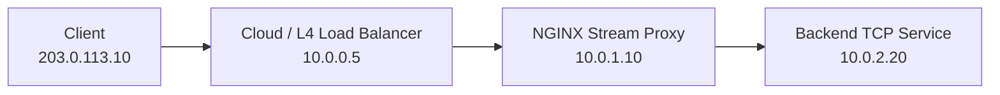
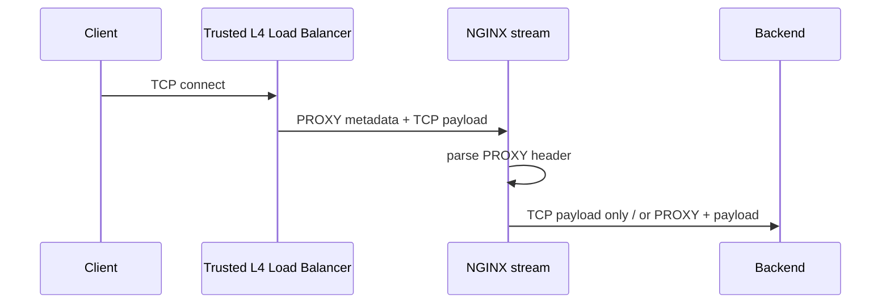
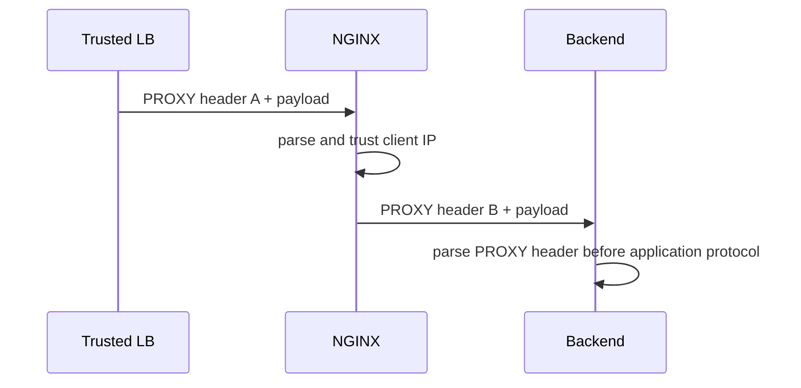
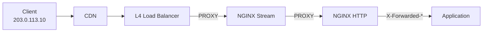

# Part 087 — PROXY Protocol: Real Client IP across L4/L7 Boundaries

NGINX di Layer 4 punya masalah mendasar: begitu traffic melewati proxy TCP/UDP, backend biasanya hanya melihat IP proxy, bukan IP client asli.

Di HTTP, kita terbiasa memakai header seperti `X-Forwarded-For` atau `Forwarded`. Tetapi di TCP murni, tidak ada header HTTP. PostgreSQL, MySQL, Redis, SMTP, MQTT, custom binary protocol, dan TLS passthrough tidak punya tempat standar untuk membawa IP asli client.

Di sinilah **PROXY protocol** masuk.

Mental model paling penting:

> PROXY protocol adalah metadata koneksi yang dikirim sebelum byte protokol aplikasi, supaya hop berikutnya tahu siapa client asli sebelum membaca payload aplikasi.

Ia bukan HTTP header. Ia bukan TLS extension. Ia bukan authentication. Ia adalah framing awal pada koneksi.

Kalau salah dipakai, akibatnya langsung fatal:

- backend membaca byte `PROXY ...` sebagai payload aplikasi lalu gagal handshake;
- attacker bisa spoof IP kalau listener menerima PROXY protocol dari internet langsung;
- logs, rate limit, audit, dan ACL memakai identitas palsu;
- TLS passthrough rusak karena backend tidak siap menerima PROXY header sebelum TLS ClientHello;
- satu port dipakai campur antara client biasa dan client PROXY protocol, lalu sebagian traffic gagal random.

Part ini membangun mental model production untuk memakai PROXY protocol secara aman.

---

## 1. Problem sebenarnya: identity hilang di boundary transport

Lihat arsitektur sederhana:



Tanpa mekanisme tambahan, backend melihat peer address sebagai:

```txt
10.0.1.10
```

Bukan:

```txt
203.0.113.10
```

Itu normal. TCP peer backend memang NGINX, bukan client asli.

Masalah muncul ketika backend butuh client IP untuk:

- audit log;
- allowlist/denylist;
- fraud/risk scoring;
- rate limiting;
- tenant routing;
- geo/policy enforcement;
- incident forensics;
- debugging koneksi dari client tertentu.

Solusi yang buruk adalah “percaya saja header dari client”. Di Layer 4 tidak ada HTTP header. Di Layer 7 pun header client bisa dipalsukan. Solusi yang benar harus membawa identitas dari **trusted hop**, bukan dari arbitrary client.

---

## 2. Apa itu PROXY protocol?

PROXY protocol adalah format metadata koneksi yang dikirim di awal stream.

Secara konseptual:

```txt
[PROXY metadata][application protocol bytes...]
```

Untuk PROXY protocol v1, bentuknya ASCII, misalnya:

```txt
PROXY TCP4 203.0.113.10 10.0.1.10 52344 443\r\n
```

Setelah baris itu, barulah protokol aplikasi dimulai.

Untuk TLS passthrough:

```txt
PROXY TCP4 ...\r\n
[TLS ClientHello...]
```

Untuk PostgreSQL/MySQL/custom TCP:

```txt
PROXY TCP4 ...\r\n
[database/custom protocol handshake...]
```

Implikasinya keras:

> Receiver harus tahu bahwa byte pertama yang akan diterima adalah PROXY header. Kalau tidak, protokol aplikasinya akan menganggap header itu sebagai payload invalid.

---

## 3. Tiga role yang tidak boleh dicampur

Di production, PROXY protocol selalu punya tiga keputusan terpisah.

| Keputusan | Pertanyaan |
|---|---|
| Receive | Apakah NGINX menerima PROXY header dari hop sebelumnya? |
| Trust | Apakah hop sebelumnya berhak menyatakan client IP asli? |
| Send | Apakah NGINX mengirim PROXY header ke backend berikutnya? |

Kesalahan umum adalah menganggap `listen ... proxy_protocol` otomatis “meneruskan IP asli ke backend”. Tidak. Itu hanya membuat NGINX **menerima** PROXY protocol pada listener.

Untuk mengirim ke upstream, perlu directive lain.

---

## 4. Minimal topology: L4 LB mengirim PROXY ke NGINX



Ada dua mode:

1. NGINX hanya memakai PROXY metadata untuk log/policy, lalu mengirim payload biasa ke backend.
2. NGINX juga mengirim PROXY metadata baru ke backend.

Mode kedua hanya aman kalau backend memang PROXY-aware.

---

## 5. Menerima PROXY protocol di `stream`

Contoh listener stream yang menerima PROXY protocol:

```nginx
stream {
    log_format stream_main
        'time=$time_iso8601 '
        'remote=$remote_addr:$remote_port '
        'proxy_addr=$proxy_protocol_addr:$proxy_protocol_port '
        'realip_original=$realip_remote_addr:$realip_remote_port '
        'server=$server_addr:$server_port '
        'upstream=$upstream_addr '
        'status=$status '
        'bytes_sent=$bytes_sent '
        'bytes_received=$bytes_received '
        'session_time=$session_time';

    access_log /var/log/nginx/stream-access.log stream_main;

    server {
        listen 5432 proxy_protocol;

        proxy_pass postgres_backend;
    }

    upstream postgres_backend {
        server 10.0.2.20:5432;
        server 10.0.2.21:5432;
    }
}
```

Directive penting:

```nginx
listen 5432 proxy_protocol;
```

Artinya:

> Semua koneksi yang masuk ke port ini harus diawali PROXY protocol header.

Kalau client biasa connect langsung tanpa PROXY header, koneksi akan gagal. Ini bukan bug. Ini guardrail.

---

## 6. Jangan campur traffic PROXY dan non-PROXY di listener yang sama

Anti-pattern:

```nginx
server {
    listen 5432 proxy_protocol;
    proxy_pass postgres_backend;
}
```

Lalu port `5432` dipakai oleh:

- cloud load balancer yang mengirim PROXY protocol;
- developer laptop langsung tanpa PROXY protocol;
- monitoring tool lama tanpa PROXY protocol;
- test script manual.

Hasilnya sebagian koneksi gagal, sebagian sukses. Tim biasanya salah diagnosis sebagai “NGINX unstable”.

Pattern yang lebih aman:

```nginx
stream {
    # Port internal yang hanya menerima traffic dari trusted LB
    server {
        listen 15432 proxy_protocol;
        proxy_pass postgres_backend;
    }

    # Port debug/internal non-PROXY, hanya untuk jaringan admin bila benar-benar perlu
    server {
        listen 127.0.0.1:25432;
        proxy_pass postgres_backend;
    }
}
```

Invariant:

> Satu listener harus punya satu framing contract.

---

## 7. Trust boundary: PROXY protocol bukan authentication

PROXY protocol mengatakan:

```txt
client asli adalah 203.0.113.10
```

Tetapi NGINX harus menjawab:

```txt
siapa yang mengatakan itu?
```

Kalau listener PROXY protocol terbuka langsung ke internet, attacker bisa mengirim:

```txt
PROXY TCP4 10.0.0.1 198.51.100.20 12345 443\r\n
```

Lalu semua policy yang percaya IP itu menjadi rusak.

Production invariant:

> Hanya trusted upstream hop yang boleh mengirim PROXY protocol.

Gunakan network boundary:

- security group/firewall hanya mengizinkan cloud load balancer;
- private subnet;
- NACL/firewall host;
- listener terpisah untuk PROXY traffic;
- `set_real_ip_from` ketika memakai realip module;
- log original peer dan claimed client IP.

---

## 8. Mengaktifkan stream real IP

`ngx_stream_realip_module` dapat mengubah client address dan port menjadi address/port yang dikirim di PROXY protocol header.

Contoh:

```nginx
stream {
    log_format stream_realip
        'remote=$remote_addr:$remote_port '
        'proxy=$proxy_protocol_addr:$proxy_protocol_port '
        'original=$realip_remote_addr:$realip_remote_port '
        'upstream=$upstream_addr '
        'status=$status '
        'session_time=$session_time';

    access_log /var/log/nginx/stream-access.log stream_realip;

    server {
        listen 443 proxy_protocol;

        set_real_ip_from 10.0.0.0/8;
        set_real_ip_from 192.168.0.0/16;

        proxy_pass tls_backend;
    }

    upstream tls_backend {
        server 10.0.2.10:443;
    }
}
```

Setelah realip aktif:

- `$remote_addr` menjadi client IP dari PROXY protocol jika peer dipercaya;
- `$realip_remote_addr` menyimpan address peer asli sebelum rewrite;
- `$proxy_protocol_addr` tetap merepresentasikan address yang diklaim dalam PROXY header.

Gunakan log yang menyimpan semuanya. Saat incident, Anda butuh tahu:

```txt
peer asli siapa?
PROXY header mengklaim siapa?
NGINX akhirnya memakai siapa sebagai remote_addr?
```

---

## 9. Module availability harus dicek

Beberapa module stream tidak selalu built by default ketika NGINX dibangun dari source. Di host production, selalu cek:

```bash
nginx -V 2>&1 | tr ' ' '\n' | grep stream
```

Yang relevan untuk part ini:

```txt
--with-stream
--with-stream_realip_module
```

Kalau memakai package vendor/distribusi, module bisa sudah built-in atau tersedia sebagai dynamic module. Jangan mendesain konfigurasi berdasarkan asumsi.

CI/CD sebaiknya punya check:

```bash
nginx -V 2>&1 | grep -q -- '--with-stream'
nginx -V 2>&1 | grep -q -- '--with-stream_realip_module'
```

Atau setidaknya smoke test konfigurasi:

```bash
nginx -t -c /etc/nginx/nginx.conf
```

---

## 10. Meneruskan PROXY protocol ke backend

Menerima PROXY protocol dari hop sebelumnya tidak otomatis meneruskan PROXY protocol ke backend.

Untuk mengirim PROXY protocol ke upstream stream, gunakan:

```nginx
proxy_protocol on;
```

Contoh:

```nginx
stream {
    upstream app_tls {
        server 10.0.2.10:443;
        server 10.0.2.11:443;
    }

    server {
        listen 443 proxy_protocol;

        set_real_ip_from 10.0.0.0/8;

        proxy_pass app_tls;
        proxy_protocol on;
    }
}
```

Flow byte-nya:



Backend harus mendukung PROXY protocol. Kalau tidak, koneksi rusak.

---

## 11. TLS passthrough + PROXY protocol

TLS passthrough sering dipakai supaya backend tetap memegang certificate dan melakukan TLS termination sendiri.

Tanpa PROXY protocol:

```txt
Client -> NGINX TCP proxy -> Backend TLS
                          Backend sees NGINX IP
```

Dengan PROXY protocol:

```txt
Client -> NGINX TCP proxy -> PROXY header -> Backend TLS
```

Tetapi backend TLS harus PROXY-aware. Ia harus membaca PROXY header dahulu, lalu baru memproses TLS ClientHello.

```txt
[PROXY header][TLS ClientHello]
```

Banyak TLS server standar tidak otomatis mendukung ini. Biasanya butuh:

- load balancer/proxy frontend yang paham PROXY protocol;
- database/service yang punya native PROXY support;
- sidecar wrapper;
- ingress/controller khusus;
- custom listener.

Anti-pattern:

```nginx
stream {
    server {
        listen 443;
        proxy_pass legacy_tls_backend;
        proxy_protocol on; # backend tidak support
    }
}
```

Gejala:

- TLS handshake failed;
- backend log “bad record type”;
- client melihat connection reset;
- NGINX log terlihat “normal” karena ia hanya mengirim byte.

---

## 12. HTTP boundary: kapan pakai PROXY, kapan pakai forwarded headers?

Untuk HTTP, pilihan umum:

| Hop | Mekanisme identitas |
|---|---|
| L4 load balancer → NGINX HTTP | PROXY protocol |
| NGINX HTTP → app HTTP | `X-Forwarded-For`, `X-Real-IP`, `Forwarded` |
| NGINX stream → backend TCP | PROXY protocol |
| NGINX stream passthrough TLS → backend TLS | PROXY protocol only if backend supports it |

Contoh HTTP listener yang menerima PROXY protocol:

```nginx
http {
    log_format main
        'remote=$remote_addr '
        'proxy=$proxy_protocol_addr '
        'xff="$http_x_forwarded_for" '
        'request="$request" '
        'status=$status';

    server {
        listen 443 ssl proxy_protocol;

        real_ip_header proxy_protocol;
        set_real_ip_from 10.0.0.0/8;

        ssl_certificate     /etc/nginx/certs/app.fullchain.pem;
        ssl_certificate_key /etc/nginx/certs/app.key;

        location / {
            proxy_set_header Host              $host;
            proxy_set_header X-Real-IP         $remote_addr;
            proxy_set_header X-Forwarded-For   $proxy_add_x_forwarded_for;
            proxy_set_header X-Forwarded-Proto https;

            proxy_pass http://app_backend;
        }
    }
}
```

Di sini:

- PROXY protocol membawa client IP dari L4 LB ke NGINX;
- NGINX melakukan TLS termination dan HTTP parsing;
- NGINX meneruskan identity ke app lewat HTTP headers yang ia kontrol.

Jangan membiarkan client external menentukan `X-Forwarded-For` final tanpa sanitasi trust boundary.

---

## 13. Cross-layer identity chain

Dalam sistem nyata, chain bisa seperti ini:



Pertanyaan desain:

1. Hop mana yang pertama kali dipercaya?
2. Hop mana yang boleh mengubah `$remote_addr`?
3. Hop mana yang boleh append `X-Forwarded-For`?
4. Apakah backend menerima PROXY protocol atau HTTP headers?
5. Apakah logs menyimpan original peer, claimed IP, dan effective IP?
6. Apakah direct-to-backend bypass ditutup?

Tanpa jawaban ini, Anda belum punya identity architecture. Anda hanya punya config.

---

## 14. Design invariant untuk real client IP

Gunakan invariant berikut.

### Invariant 1 — Identity metadata hanya diterima dari trusted hop

Tidak boleh:

```txt
public internet -> listen proxy_protocol
```

kecuali ada firewall kuat yang memastikan hanya LB bisa connect.

### Invariant 2 — Listener framing harus tunggal

Satu listener tidak boleh menerima campuran PROXY dan non-PROXY traffic.

### Invariant 3 — Receiver harus mengerti protocol

Kalau NGINX mengirim `proxy_protocol on`, backend harus mendukung PROXY protocol.

### Invariant 4 — Logging harus dual-view

Log minimal:

```txt
effective_remote_addr
original_peer_addr
proxy_protocol_addr
upstream_addr
```

### Invariant 5 — Jangan translate identity tanpa trust reset

Ketika pindah dari L4 ke L7, jangan copy semua header client mentah. NGINX harus membentuk header baru dari state yang dipercaya.

---

## 15. Pattern: L4 TCP proxy dengan real IP logging saja

Use case:

- NGINX berada di belakang cloud load balancer;
- cloud LB mengirim PROXY protocol;
- backend tidak mendukung PROXY protocol;
- Anda hanya butuh log real client IP di NGINX.

```nginx
stream {
    log_format tcp_log
        'time=$time_iso8601 '
        'client=$remote_addr:$remote_port '
        'claimed=$proxy_protocol_addr:$proxy_protocol_port '
        'lb_peer=$realip_remote_addr:$realip_remote_port '
        'upstream=$upstream_addr '
        'status=$status '
        'bytes_in=$bytes_received '
        'bytes_out=$bytes_sent '
        'duration=$session_time';

    access_log /var/log/nginx/tcp.log tcp_log;

    upstream redis_backend {
        server 10.0.2.10:6379;
    }

    server {
        listen 6379 proxy_protocol;

        set_real_ip_from 10.0.0.0/8;

        proxy_connect_timeout 2s;
        proxy_timeout 30s;

        proxy_pass redis_backend;
    }
}
```

Backend tetap melihat NGINX sebagai peer. Tetapi NGINX log punya client asli.

---

## 16. Pattern: L4 proxy yang meneruskan PROXY ke backend

Use case:

- backend support PROXY protocol;
- backend butuh IP asli untuk policy/log;
- NGINX menerima traffic dari trusted LB.

```nginx
stream {
    upstream postgres_backend {
        server 10.0.2.20:5432 max_fails=2 fail_timeout=10s;
        server 10.0.2.21:5432 max_fails=2 fail_timeout=10s;
    }

    server {
        listen 5432 proxy_protocol;

        set_real_ip_from 10.0.0.0/8;

        proxy_connect_timeout 3s;
        proxy_timeout 1h;

        proxy_pass postgres_backend;
        proxy_protocol on;
    }
}
```

Operational check:

```bash
# Backend harus dikonfigurasi untuk expect PROXY protocol.
# Kalau tidak, database handshake akan gagal.
```

---

## 17. Pattern: HTTP app menerima sanitized headers dari NGINX

Use case:

- external LB mengirim PROXY ke NGINX;
- NGINX melakukan TLS termination;
- app menerima HTTP headers.

```nginx
http {
    server {
        listen 443 ssl proxy_protocol;

        set_real_ip_from 10.0.0.0/8;
        real_ip_header proxy_protocol;

        ssl_certificate     /etc/nginx/certs/api.fullchain.pem;
        ssl_certificate_key /etc/nginx/certs/api.key;

        location / {
            proxy_set_header Host              $host;
            proxy_set_header X-Real-IP         $remote_addr;
            proxy_set_header X-Forwarded-For   $proxy_add_x_forwarded_for;
            proxy_set_header X-Forwarded-Proto https;

            # Remove client-controlled ambiguity where possible.
            proxy_set_header Forwarded "";

            proxy_pass http://api_backend;
        }
    }
}
```

Lebih strict untuk internal platform:

```nginx
proxy_set_header X-Forwarded-For $remote_addr;
```

Ini menghindari chain yang sudah tercemar dari client. Trade-off: Anda kehilangan chain upstream sebelum NGINX, kecuali disimpan di header lain yang dikontrol oleh trusted edge/CDN.

---

## 18. Pattern: expose two ports untuk migration

Saat migrasi legacy service ke PROXY protocol, jangan flipping port yang sama tanpa staged rollout.

```nginx
stream {
    upstream smtp_backend {
        server 10.0.2.50:25;
    }

    # Legacy clients, no PROXY.
    server {
        listen 25;
        proxy_pass smtp_backend;
    }

    # New trusted LB path, with PROXY.
    server {
        listen 1025 proxy_protocol;
        set_real_ip_from 10.0.0.0/8;
        proxy_pass smtp_backend;
        proxy_protocol on;
    }
}
```

Setelah backend dan semua LB path siap, baru konsolidasi.

---

## 19. PROXY protocol dan rate limiting

Di HTTP, kalau `$remote_addr` sudah direwrite oleh realip, rate limit berbasis `$binary_remote_addr` bisa memakai IP asli.

```nginx
http {
    limit_req_zone $binary_remote_addr zone=per_ip:20m rate=10r/s;

    server {
        listen 443 ssl proxy_protocol;

        real_ip_header proxy_protocol;
        set_real_ip_from 10.0.0.0/8;

        location /api/ {
            limit_req zone=per_ip burst=20 nodelay;
            proxy_pass http://api_backend;
        }
    }
}
```

Tanpa `real_ip_header proxy_protocol`, semua request dari satu LB bisa terlihat sebagai satu IP. Akibatnya:

- rate limit salah menghukum semua user;
- allowlist/denylist tidak efektif;
- audit tidak granular.

---

## 20. Security failure modes

### Failure 1 — Public listener menerima spoofed PROXY header

```nginx
server {
    listen 443 proxy_protocol;
}
```

Jika port ini reachable dari internet langsung, attacker bisa mengklaim IP apa pun.

Mitigasi:

- firewall hanya LB;
- private listener;
- `set_real_ip_from`;
- log peer asli;
- network test dari luar.

### Failure 2 — Backend tidak support PROXY protocol

```nginx
proxy_protocol on;
```

Backend menerima:

```txt
PROXY TCP4 ...
```

sebagai byte pertama aplikasi. Koneksi gagal.

Mitigasi:

- enable PROXY support di backend;
- sidecar/wrapper;
- jangan send PROXY ke backend;
- test dengan `tcpdump`/backend logs.

### Failure 3 — PROXY chain hilang di tengah

LB mengirim PROXY ke NGINX, tetapi NGINX tidak meneruskan ke backend dan tidak translate ke HTTP headers.

Akibat:

- NGINX log benar;
- backend log salah;
- app policy salah.

Mitigasi:

- definisikan identity propagation contract per hop;
- test dari client IP berbeda;
- compare NGINX log vs app log.

### Failure 4 — Semua traffic dianggap satu client

Real IP tidak aktif, sehingga `$remote_addr` adalah LB IP.

Akibat:

- rate limit false positive;
- tenant policy salah;
- geo policy salah.

Mitigasi:

- `real_ip_header proxy_protocol`;
- `set_real_ip_from`;
- stream/http log audit.

### Failure 5 — Observability kehilangan original peer

Jika Anda hanya log `$remote_addr` setelah rewrite, Anda tidak tahu siapa peer sebenarnya.

Mitigasi:

```nginx
log_format safe
    'remote=$remote_addr '
    'realip_original=$realip_remote_addr '
    'proxy=$proxy_protocol_addr';
```

---

## 21. Testing dengan manual PROXY header

Untuk TCP service sederhana, Anda bisa mengirim PROXY header manual.

```bash
printf 'PROXY TCP4 203.0.113.10 10.0.1.10 53000 5432\r\n' | nc nginx.example.internal 5432
```

Untuk HTTP endpoint di listener yang expect PROXY:

```bash
printf 'PROXY TCP4 203.0.113.10 10.0.1.10 53000 80\r\nGET /health HTTP/1.1\r\nHost: example.com\r\n\r\n' \
  | nc nginx.example.internal 80
```

Expected:

- NGINX access log menunjukkan `$proxy_protocol_addr=203.0.113.10`;
- `$remote_addr` menjadi `203.0.113.10` jika realip aktif dan peer dipercaya;
- `$realip_remote_addr` menunjukkan peer sebenarnya.

Untuk TLS, lebih rumit karena PROXY header harus datang sebelum TLS ClientHello. Jika tool mendukung HAProxy/PROXY protocol flag, gunakan itu. Jika tidak, gunakan load balancer asli atau test harness.

---

## 22. Observability log format untuk stream

Template production:

```nginx
stream {
    log_format stream_json escape=json
        '{'
          '"ts":"$time_iso8601",'
          '"remote_addr":"$remote_addr",'
          '"remote_port":"$remote_port",'
          '"realip_remote_addr":"$realip_remote_addr",'
          '"realip_remote_port":"$realip_remote_port",'
          '"proxy_protocol_addr":"$proxy_protocol_addr",'
          '"proxy_protocol_port":"$proxy_protocol_port",'
          '"server_addr":"$server_addr",'
          '"server_port":"$server_port",'
          '"upstream_addr":"$upstream_addr",'
          '"protocol":"$protocol",'
          '"status":"$status",'
          '"bytes_sent":$bytes_sent,'
          '"bytes_received":$bytes_received,'
          '"session_time":$session_time'
        '}';

    access_log /var/log/nginx/stream-access.json stream_json;
}
```

Field yang wajib untuk RCA:

| Field | Mengapa penting |
|---|---|
| `$remote_addr` | Effective client after realip handling |
| `$realip_remote_addr` | Original peer before rewrite |
| `$proxy_protocol_addr` | Claimed client in PROXY header |
| `$upstream_addr` | Backend target |
| `$status` | Stream session outcome |
| `$session_time` | Duration |
| `$bytes_sent` / `$bytes_received` | Directional traffic clue |

---

## 23. Decision matrix

| Situation | Recommended mechanism |
|---|---|
| HTTP app behind NGINX HTTP | `X-Forwarded-*` generated by trusted NGINX |
| NGINX HTTP behind L4 LB | PROXY protocol into NGINX + `real_ip_header proxy_protocol` |
| TCP backend needs client IP | PROXY protocol to backend if backend supports it |
| TLS passthrough backend needs client IP | PROXY protocol only if TLS backend expects PROXY before ClientHello |
| Backend does not support PROXY | Log real IP at NGINX, or use app-level identity instead |
| Mixed PROXY and non-PROXY clients | Separate listeners/ports |
| Public listener | Do not accept PROXY protocol unless network boundary blocks untrusted clients |

---

## 24. Production checklist

Before enabling PROXY protocol:

- [ ] Identify producer of PROXY protocol.
- [ ] Verify producer is trusted and network-restricted.
- [ ] Decide whether NGINX only consumes or also forwards PROXY.
- [ ] Verify receiver/backend supports PROXY protocol if forwarding.
- [ ] Use separate listener for PROXY and non-PROXY traffic.
- [ ] Enable realip only for trusted CIDR.
- [ ] Log effective, original, and PROXY-provided address.
- [ ] Add smoke test for direct invalid connection.
- [ ] Add smoke test for valid PROXY connection.
- [ ] Confirm app/backend logs real client identity.
- [ ] Confirm rate limit/ACL uses intended address.
- [ ] Prepare rollback port/listener.

---

## 25. Incident playbook

### Symptom: all users rate-limited together

Likely cause:

- `$remote_addr` is LB IP;
- realip not active;
- PROXY protocol not enabled from LB;
- `set_real_ip_from` missing.

Check:

```bash
grep '"remote_addr"' /var/log/nginx/*.json | head
```

Fix:

- enable PROXY protocol on LB;
- set `listen ... proxy_protocol`;
- set `real_ip_header proxy_protocol`;
- set trusted CIDR.

### Symptom: backend TLS handshake fails after enabling proxy_protocol

Likely cause:

- backend does not expect PROXY header before TLS ClientHello.

Fix:

- disable `proxy_protocol on`;
- enable PROXY support on backend listener;
- introduce PROXY-aware sidecar;
- switch to NGINX TLS termination and HTTP headers.

### Symptom: random client failures after migration

Likely cause:

- same listener receives both PROXY and non-PROXY traffic.

Fix:

- separate listeners;
- migrate traffic source-by-source;
- enforce network path.

### Symptom: logs show spoofed private IPs as clients

Likely cause:

- public access to PROXY listener;
- untrusted peer allowed.

Fix:

- close public route;
- restrict with firewall/security group;
- audit `set_real_ip_from`;
- log `$realip_remote_addr`.

---

## 26. Mental model summary

PROXY protocol solves one narrow problem:

> How does a transport proxy tell the next hop the original client address before application bytes begin?

It does not solve:

- authentication;
- authorization;
- header sanitization;
- app-level identity;
- TLS certificate identity;
- tenant identity;
- abuse detection by itself.

Use it as an identity transport between trusted infrastructure hops.

The production invariant is simple:

```txt
Only trusted infrastructure may assert transport identity.
Every hop must explicitly decide whether to consume, trust, translate, or forward that identity.
```

If you hold that invariant, PROXY protocol is clean and powerful.

If you do not, it becomes an IP spoofing footgun.

---

## References

- NGINX stream realip module: https://nginx.org/en/docs/stream/ngx_stream_realip_module.html
- NGINX HTTP realip module: https://nginx.org/en/docs/http/ngx_http_realip_module.html
- NGINX stream core module: https://nginx.org/en/docs/stream/ngx_stream_core_module.html
- NGINX stream proxy module: https://nginx.org/en/docs/stream/ngx_stream_proxy_module.html
- NGINX TCP/UDP load balancing admin guide: https://docs.nginx.com/nginx/admin-guide/load-balancer/tcp-udp-load-balancer/
