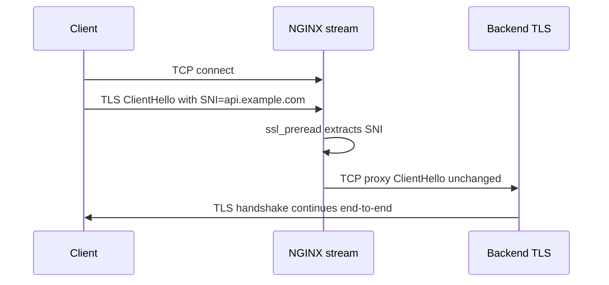
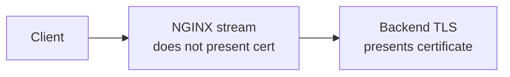
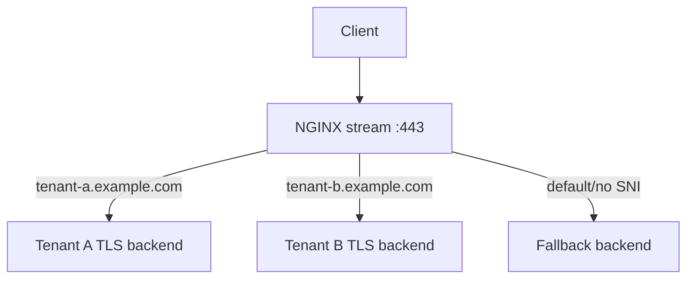

# Part 088 — SNI Routing at Layer 4 without HTTP Termination

Di HTTP reverse proxy biasa, NGINX membaca request:

```txt
GET /api/orders HTTP/1.1
Host: api.example.com
```

Lalu NGINX bisa route berdasarkan:

- host;
- path;
- header;
- cookie;
- method;
- auth;
- query;
- body metadata.

Tetapi di Layer 4 TLS passthrough, NGINX tidak mendekripsi HTTP. Ia hanya melihat koneksi TCP dan byte TLS terenkripsi.

Pertanyaannya:

> Bagaimana NGINX bisa memilih backend berdasarkan domain kalau NGINX tidak melakukan TLS termination?

Jawabannya: **SNI preread**.

NGINX stream `ssl_preread` dapat membaca metadata dari TLS ClientHello tanpa men-terminate TLS. Metadata itu mencakup SNI dan ALPN. Dengan itu, NGINX bisa melakukan Layer 4 routing seperti:

```txt
api.example.com      -> backend API TLS
admin.example.com    -> backend Admin TLS
payments.example.com -> backend Payments TLS
```

Tanpa melihat HTTP request.

Namun ini juga berarti batasnya jelas:

- NGINX tidak melihat path `/api`;
- NGINX tidak melihat HTTP header;
- NGINX tidak bisa inject security headers;
- NGINX tidak bisa melakukan HTTP rate limiting per path;
- NGINX tidak bisa melakukan WAF HTTP inspection;
- certificate tetap dimiliki backend;
- jika client tidak mengirim SNI, routing harus fallback.

---

## 1. TLS ClientHello sebagai routing hint

Sebelum TLS session terenkripsi penuh, client mengirim ClientHello. Di dalamnya bisa ada extension:

- SNI: server name yang diminta;
- ALPN: protokol aplikasi yang dinegosiasikan, misalnya `h2` atau `http/1.1`;
- supported TLS versions/ciphers.

Stream `ssl_preread` membaca sebagian informasi ini tanpa menyelesaikan handshake.



NGINX tidak menjadi TLS endpoint. Backend tetap yang menyajikan certificate.

---

## 2. Tiga model TLS edge

Sebelum memakai SNI routing, bedakan tiga model ini.

| Model | NGINX decrypt? | NGINX sees HTTP? | Cert owned by | Use case |
|---|---:|---:|---|---|
| TLS termination | Yes | Yes | NGINX | API gateway, security headers, WAF, path routing |
| TLS passthrough | No | No | Backend | Backend owns TLS; L4 routing only |
| Stream TLS termination | Yes, at stream | No HTTP parsing | NGINX | Generic TLS TCP service |

SNI routing part ini adalah **TLS passthrough with metadata-based routing**.

---

## 3. Minimal SNI routing config

```nginx
stream {
    map $ssl_preread_server_name $tls_backend {
        api.example.com      api_tls;
        admin.example.com    admin_tls;
        payments.example.com payments_tls;
        default              default_tls;
    }

    upstream api_tls {
        server 10.0.1.10:443;
        server 10.0.1.11:443;
    }

    upstream admin_tls {
        server 10.0.2.10:443;
    }

    upstream payments_tls {
        server 10.0.3.10:443;
    }

    upstream default_tls {
        server 10.0.9.10:443;
    }

    server {
        listen 443;

        proxy_connect_timeout 3s;
        proxy_timeout 1h;

        ssl_preread on;
        proxy_pass $tls_backend;
    }
}
```

Flow:

```txt
Client SNI = api.example.com
        ↓
$ssl_preread_server_name = api.example.com
        ↓
map selects api_tls
        ↓
proxy_pass api_tls
```

Backend API receives the original TLS ClientHello and completes TLS handshake.

---

## 4. Module availability

`ngx_stream_ssl_preread_module` is not guaranteed to be present in every build.

Check:

```bash
nginx -V 2>&1 | tr ' ' '\n' | grep stream
```

Look for:

```txt
--with-stream
--with-stream_ssl_preread_module
```

If you also terminate TLS in stream, look for:

```txt
--with-stream_ssl_module
```

Production checklist:

- [ ] `nginx -t` validates config.
- [ ] `nginx -V` proves module availability.
- [ ] container image/package is pinned.
- [ ] CI checks module flags or runs real config test.
- [ ] fallback route exists for no-SNI clients.

---

## 5. SNI is not Host

This is the first critical distinction.

SNI lives in TLS ClientHello.

HTTP Host lives inside encrypted HTTP request after TLS handshake.

In TLS passthrough, NGINX can see:

```txt
SNI = api.example.com
ALPN = h2,http/1.1
```

NGINX cannot see:

```txt
Host: api.example.com
GET /v1/orders
Authorization: Bearer ...
Cookie: ...
```

Therefore, these are impossible at pure SNI-routing Layer 4:

```txt
/api      -> api backend
/admin    -> admin backend
/header X -> canary backend
/user A   -> shard A
```

For that, you need TLS termination and HTTP proxying.

---

## 6. Decision: SNI routing vs HTTP reverse proxy

| Need | Use SNI routing? | Use HTTP reverse proxy? |
|---|---:|---:|
| Backend owns certificate | Yes | Maybe no |
| Route by domain only | Yes | Yes |
| Route by path/header/cookie | No | Yes |
| Add security headers | No | Yes |
| HTTP WAF | No | Yes |
| mTLS at backend | Yes | Maybe |
| Central certificate automation at edge | No | Yes |
| App logs client HTTP metadata at NGINX | No | Yes |
| TLS end-to-end from client to backend | Yes | No, unless re-encrypt |

SNI routing is powerful when your routing key is available before decryption.

It is the wrong tool when your policy needs HTTP semantics.

---

## 7. SNI fallback design

Not all clients send SNI.

Reasons:

- old clients;
- raw TLS libraries with missing server name;
- IP-based connections;
- misconfigured health checks;
- some non-HTTPS TLS protocols;
- future privacy mechanisms where visible SNI may be unavailable.

Never omit `default`.

Bad:

```nginx
map $ssl_preread_server_name $tls_backend {
    api.example.com api_tls;
}
```

If no SNI, `$tls_backend` may be empty or invalid depending on config shape.

Better:

```nginx
map $ssl_preread_server_name $tls_backend {
    api.example.com   api_tls;
    admin.example.com admin_tls;
    default           fallback_tls;
}

upstream fallback_tls {
    server 10.0.9.10:443;
}
```

Fallback backend can:

- serve a default certificate;
- return a clear error;
- close connection intentionally;
- serve legacy default site;
- expose a health-check endpoint on a separate path if it terminates TLS.

---

## 8. Certificate ownership

In SNI passthrough:



The backend must have certificate for the requested SNI.

If NGINX routes `api.example.com` to wrong backend, client may see:

```txt
certificate subject mismatch
```

or:

```txt
TLS handshake failure
```

NGINX may only log stream status and upstream address. It cannot see HTTP status because no HTTP exists at NGINX layer.

Operational implication:

- certificate expiry monitoring must include backend certs;
- backend teams own TLS correctness;
- SNI routing table and certificate inventory must match;
- wrong map entry becomes TLS/cert incident, not HTTP routing incident.

---

## 9. SNI routing with PROXY protocol

If backend needs client IP, you may combine SNI routing with PROXY protocol.

```nginx
stream {
    map $ssl_preread_server_name $tls_backend {
        api.example.com api_tls;
        default         default_tls;
    }

    upstream api_tls {
        server 10.0.1.10:443;
    }

    upstream default_tls {
        server 10.0.9.10:443;
    }

    server {
        listen 443 proxy_protocol;

        set_real_ip_from 10.0.0.0/8;

        ssl_preread on;
        proxy_pass $tls_backend;

        proxy_protocol on;
    }
}
```

But the backend receives:

```txt
[PROXY header][TLS ClientHello]
```

Backend must expect PROXY protocol before TLS.

If backend does not support it, do not enable `proxy_protocol on`.

Safer alternative:

- log real client IP at NGINX stream;
- do not forward real IP to backend;
- use application identity inside TLS;
- terminate TLS at NGINX if backend absolutely needs HTTP headers.

---

## 10. ALPN-based routing

`ssl_preread` can expose ALPN protocols advertised by client. This can be used to separate protocols.

Example concept:

```nginx
stream {
    map $ssl_preread_alpn_protocols $alpn_backend {
        ~\bh2\b        h2_backend;
        ~\bhttp/1.1\b  http11_backend;
        default        default_tls;
    }

    upstream h2_backend {
        server 10.0.1.20:443;
    }

    upstream http11_backend {
        server 10.0.1.30:443;
    }

    upstream default_tls {
        server 10.0.9.10:443;
    }

    server {
        listen 443;
        ssl_preread on;
        proxy_pass $alpn_backend;
    }
}
```

Use this carefully.

ALPN is client-advertised, not final negotiated result at NGINX, because NGINX is not completing handshake. The backend still negotiates final protocol.

Better uses:

- route known TLS protocol families;
- split legacy vs modern endpoints;
- debug protocol migration.

Avoid using ALPN as a strong security boundary.

---

## 11. Protocol multiplexing: TLS vs SSH on same port

`ssl_preread` can also expose whether a TLS protocol version was detected. A common trick is to route TLS and non-TLS protocols differently.

Concept:

```nginx
stream {
    map $ssl_preread_protocol $protocol_backend {
        ""        ssh_backend;
        default   https_backend;
    }

    upstream ssh_backend {
        server 10.0.4.10:22;
    }

    upstream https_backend {
        server 10.0.1.10:443;
    }

    server {
        listen 443;

        ssl_preread on;
        proxy_pass $protocol_backend;
    }
}
```

This is clever, but be careful:

- It can confuse security tooling.
- It complicates incident response.
- It may violate network policy expectations.
- It can make port ownership unclear.
- It increases blast radius of one listener.

Use only when there is a strong operational reason.

---

## 12. `preread_buffer_size` and `preread_timeout`

NGINX needs to read enough initial bytes to extract TLS metadata.

Relevant stream core directives:

```nginx
preread_buffer_size 16k;
preread_timeout 5s;
```

Default values may be sufficient for typical TLS ClientHello, but production should understand the knobs.

Failure modes:

| Symptom | Possible cause |
|---|---|
| SNI variable empty | Client did not send SNI |
| SNI variable empty for some clients | ClientHello not parsed / protocol is not TLS |
| Connection closes before route | preread timeout too short |
| Large ClientHello edge case | preread buffer too small |
| Wrong backend | map default or regex too broad |

Avoid blindly increasing buffer sizes. More buffer memory per connection can matter under high concurrency.

---

## 13. Map design for SNI

Good map:

```nginx
map $ssl_preread_server_name $tls_backend {
    hostnames;

    api.example.com        api_tls;
    admin.example.com      admin_tls;
    payments.example.com   payments_tls;
    *.internal.example.com internal_tls;

    default                fallback_tls;
}
```

Principles:

- Use exact names for critical services.
- Keep wildcard scope narrow.
- Always include default.
- Generate this map from service registry if many tenants.
- Keep route owner metadata outside NGINX config if possible.
- Add test cases for every hostname.
- Do not use broad regex as a shortcut.

Dangerous:

```nginx
map $ssl_preread_server_name $tls_backend {
    ~example.com shared_tls;
    default      fallback_tls;
}
```

This matches more than intended unless carefully anchored. Prefer exact or `hostnames`.

---

## 14. Multi-tenant SNI routing

For multi-tenant TLS passthrough:



Operational challenges:

- route table generation;
- certificate ownership per tenant;
- tenant deactivation;
- stale DNS pointing to edge;
- fallback behavior;
- onboarding smoke tests;
- no-SNI handling;
- PROXY protocol support differences;
- per-tenant logs.

A tenant route should have metadata:

```yaml
hostname: tenant-a.example.com
backend: tenant_a_tls
owner: team-tenant-a
certificate_owner: tenant-a
proxy_protocol_to_backend: false
created_at: 2026-07-07
deactivation_policy: fallback_410
```

Generated NGINX map:

```nginx
map $ssl_preread_server_name $tls_backend {
    tenant-a.example.com tenant_a_tls;
    tenant-b.example.com tenant_b_tls;
    default              tenant_fallback_tls;
}
```

---

## 15. Dynamic DNS and variable `proxy_pass`

When `proxy_pass` uses a variable in stream, name resolution and runtime behavior must be deliberate.

Prefer mapping to upstream group names:

```nginx
map $ssl_preread_server_name $tls_backend {
    api.example.com api_tls;
    default         fallback_tls;
}

upstream api_tls {
    server 10.0.1.10:443;
}
```

Be careful with direct hostnames in variables:

```nginx
map $ssl_preread_server_name $tls_backend {
    api.example.com api.service.consul:443;
}
```

This may require a resolver and introduces DNS runtime failure modes.

Production principle:

> SNI routing table should be boring and testable. Keep service discovery complexity outside the hot path unless you intentionally operate it.

---

## 16. Health checks

In TLS passthrough stream routing, NGINX Open Source does not inspect HTTP health endpoints. Passive failure detection is connection-level.

If you need active health checks:

- use NGINX Plus stream health checks;
- use external load balancer health checks;
- use Kubernetes readiness/service endpoints;
- generate upstream membership from service discovery;
- monitor backend TLS health separately.

Do not assume that “backend accepts TCP” means the HTTPS app is healthy.

Possible checks:

```bash
openssl s_client -connect 10.0.1.10:443 -servername api.example.com </dev/null
curl --resolve api.example.com:443:10.0.1.10 https://api.example.com/health
```

Run these outside NGINX as active probes if using Open Source.

---

## 17. Observability for SNI routing

Stream log format:

```nginx
stream {
    log_format sni_json escape=json
        '{'
          '"ts":"$time_iso8601",'
          '"remote_addr":"$remote_addr",'
          '"remote_port":"$remote_port",'
          '"server_addr":"$server_addr",'
          '"server_port":"$server_port",'
          '"sni":"$ssl_preread_server_name",'
          '"alpn":"$ssl_preread_alpn_protocols",'
          '"tls_protocol":"$ssl_preread_protocol",'
          '"selected_backend":"$tls_backend",'
          '"upstream_addr":"$upstream_addr",'
          '"status":"$status",'
          '"bytes_sent":$bytes_sent,'
          '"bytes_received":$bytes_received,'
          '"session_time":$session_time'
        '}';

    access_log /var/log/nginx/stream-sni.json sni_json;
}
```

Useful questions:

- How many connections have empty SNI?
- Which hostnames route to fallback?
- Which backend has high session failures?
- Are clients using expected ALPN?
- Did a deploy change backend selection?
- Are unknown hostnames probing the edge?

Dashboard dimensions:

```txt
sni
selected_backend
upstream_addr
status
session_time
bytes_sent
bytes_received
tls_protocol
alpn
```

---

## 18. Testing SNI routing

### Test SNI path with OpenSSL

```bash
openssl s_client \
  -connect edge.example.com:443 \
  -servername api.example.com \
  -alpn h2 \
  </dev/null
```

Expected:

- backend API certificate is presented;
- NGINX log shows `sni=api.example.com`;
- selected backend is `api_tls`.

### Test fallback path

```bash
openssl s_client \
  -connect edge.example.com:443 \
  </dev/null
```

Expected:

- fallback backend is selected;
- behavior is deliberate, not accidental.

### Test wrong SNI

```bash
openssl s_client \
  -connect edge.example.com:443 \
  -servername does-not-exist.example.com \
  </dev/null
```

Expected:

- fallback backend selected;
- log includes unknown SNI;
- alert may fire if rate is abnormal.

### Test HTTP after routing

```bash
curl -v \
  --resolve api.example.com:443:203.0.113.20 \
  https://api.example.com/health
```

This tests the full client-visible flow.

---

## 19. Failure mode matrix

| Failure | Root cause | NGINX sees | Client sees | Fix |
|---|---|---|---|---|
| Empty SNI | Client did not send SNI | `$ssl_preread_server_name=""` | fallback cert/error | fallback policy |
| Cert mismatch | Wrong backend selected | stream success maybe | TLS cert warning | fix map/backend |
| Connection reset | Backend rejects TLS/PROXY | upstream failure | reset/handshake fail | protocol contract |
| Unknown host spike | Scan/misconfigured DNS | fallback route | default response | alert + DNS audit |
| High latency | backend slow | long session_time | slow handshake/app | backend investigation |
| All traffic fallback | map broken or ssl_preread off | empty/incorrect selected backend | many failures | rollback config |
| Some clients fail | no SNI legacy clients | fallback only for some | cert mismatch | support legacy hostname/IP route |

---

## 20. SNI routing and HTTP/2/gRPC

SNI routing can carry HTTP/2 or gRPC traffic because it is not parsing HTTP. It just forwards TLS bytes.

But NGINX stream cannot:

- inspect gRPC method;
- apply gRPC status mapping;
- route by gRPC service;
- add gRPC headers;
- enforce HTTP/2 stream limits;
- log gRPC status.

If you need gRPC-aware controls, use HTTP-level `grpc_pass` with TLS termination.

SNI passthrough is appropriate when backend owns the whole TLS+HTTP/2/gRPC stack.

---

## 21. SNI routing and mTLS

SNI passthrough works well when each backend owns mTLS policy.

Flow:

```txt
Client -> NGINX stream SNI route -> Backend mTLS handshake
```

NGINX does not validate client certificate because it does not terminate TLS.

Implications:

- backend owns client CA trust;
- backend owns cert revocation policy;
- NGINX cannot log client certificate subject;
- NGINX cannot enforce route-level client cert policy;
- NGINX can only route by ClientHello metadata.

If central mTLS policy is required, terminate TLS at NGINX HTTP/stream.

---

## 22. Privacy and future compatibility

SNI routing depends on visible ClientHello metadata.

If a client does not expose SNI, NGINX cannot route by it.

Treat SNI as a routing hint, not a permanent guarantee of globally visible hostname metadata.

Production stance:

- always have fallback route;
- monitor empty-SNI rate;
- keep domain routing architecture adaptable;
- avoid building authorization solely on visible SNI;
- prefer HTTP termination when policy needs strong app-layer context.

---

## 23. Safe production skeleton

```nginx
stream {
    log_format sni_json escape=json
        '{'
          '"ts":"$time_iso8601",'
          '"remote_addr":"$remote_addr",'
          '"sni":"$ssl_preread_server_name",'
          '"alpn":"$ssl_preread_alpn_protocols",'
          '"protocol":"$ssl_preread_protocol",'
          '"backend":"$tls_backend",'
          '"upstream":"$upstream_addr",'
          '"status":"$status",'
          '"bytes_sent":$bytes_sent,'
          '"bytes_received":$bytes_received,'
          '"session_time":$session_time'
        '}';

    access_log /var/log/nginx/stream-sni.json sni_json;

    map $ssl_preread_server_name $tls_backend {
        hostnames;

        api.example.com      api_tls;
        admin.example.com    admin_tls;
        payments.example.com payments_tls;

        default              fallback_tls;
    }

    upstream api_tls {
        zone api_tls 64k;
        server 10.0.1.10:443 max_fails=2 fail_timeout=10s;
        server 10.0.1.11:443 max_fails=2 fail_timeout=10s;
    }

    upstream admin_tls {
        zone admin_tls 64k;
        server 10.0.2.10:443 max_fails=2 fail_timeout=10s;
    }

    upstream payments_tls {
        zone payments_tls 64k;
        server 10.0.3.10:443 max_fails=2 fail_timeout=10s;
    }

    upstream fallback_tls {
        zone fallback_tls 64k;
        server 10.0.9.10:443;
    }

    server {
        listen 443 reuseport;

        preread_buffer_size 16k;
        preread_timeout 5s;

        proxy_connect_timeout 3s;
        proxy_timeout 1h;

        ssl_preread on;
        proxy_pass $tls_backend;
    }
}
```

Notes:

- `hostnames` allows hostname-style map entries.
- `default` is mandatory for safe behavior.
- `zone` helps share upstream state across workers for supported state.
- Logs include selected backend.
- No HTTP assumptions appear in stream config.

---

## 24. Rollout plan

1. Build new stream config on separate port, for example `8443`.
2. Run `nginx -t`.
3. Test SNI routes with `openssl s_client`.
4. Test real application flow with `curl --resolve`.
5. Add structured stream logs.
6. Add unknown-SNI dashboard.
7. Add fallback backend.
8. Canary small traffic through external LB.
9. Monitor TLS handshake failures and fallback rate.
10. Move production `443` only after route table proves stable.
11. Keep HTTP reverse proxy rollback path if possible.

---

## 25. CI tests for generated SNI maps

For every route entry:

```yaml
routes:
  - sni: api.example.com
    backend: api_tls
  - sni: admin.example.com
    backend: admin_tls
```

Generate tests:

```bash
nginx -t -c ./generated/nginx.conf

openssl s_client \
  -connect localhost:8443 \
  -servername api.example.com \
  </dev/null
```

Also static checks:

- every map target has upstream;
- every upstream has at least one server;
- every hostname is lowercase/canonical;
- default exists;
- no duplicate hostname;
- wildcard routes are reviewed;
- deactivated tenant routes are removed;
- fallback certificate behavior is known.

---

## 26. What SNI routing is good at

SNI routing is excellent for:

- domain-based TLS passthrough;
- backend-owned certificate model;
- mTLS owned by backend;
- non-HTTP TLS protocols;
- migration where edge cannot terminate TLS;
- multi-tenant Layer 4 routing;
- preserving end-to-end TLS from client to backend.

It is not a replacement for:

- API gateway;
- HTTP reverse proxy;
- WAF;
- path routing;
- header-based canary;
- central auth;
- response header hardening;
- app-aware observability.

---

## 27. Mental model summary

SNI routing works because part of TLS metadata is visible before encryption completes.

NGINX stream with `ssl_preread` can use that metadata to choose a TCP upstream while leaving TLS end-to-end between client and backend.

The invariant:

```txt
SNI routing is domain-level transport routing.
It is not HTTP routing.
It is not authorization.
It is not TLS termination.
```

Use it when your routing decision can be made from ClientHello metadata alone.

Use HTTP reverse proxy when your routing or policy depends on decrypted HTTP semantics.

---

## References

- NGINX stream SSL preread module: https://nginx.org/en/docs/stream/ngx_stream_ssl_preread_module.html
- NGINX stream SSL module: https://nginx.org/en/docs/stream/ngx_stream_ssl_module.html
- NGINX stream core module: https://nginx.org/en/docs/stream/ngx_stream_core_module.html
- NGINX stream proxy module: https://nginx.org/en/docs/stream/ngx_stream_proxy_module.html
- NGINX configuring HTTPS servers and SNI: https://nginx.org/en/docs/http/configuring_https_servers.html
