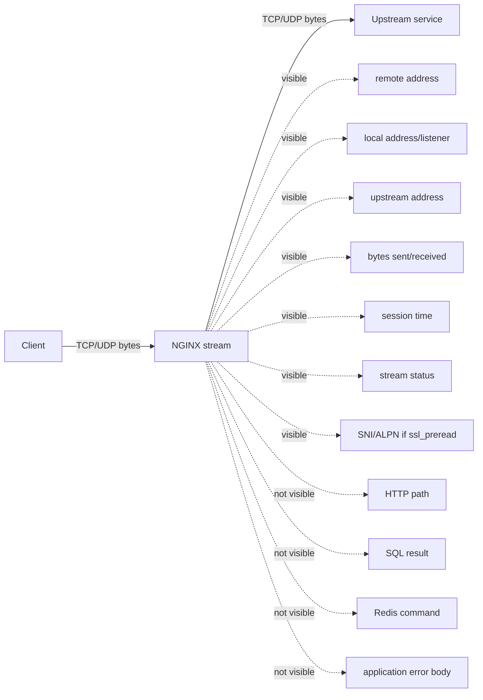
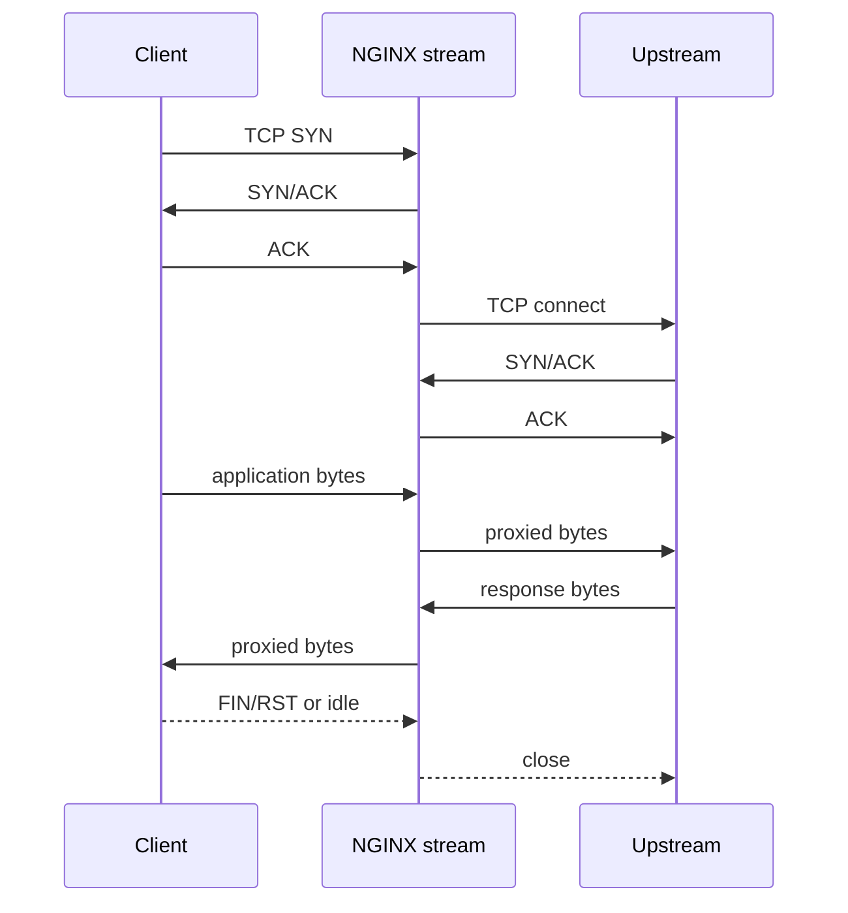
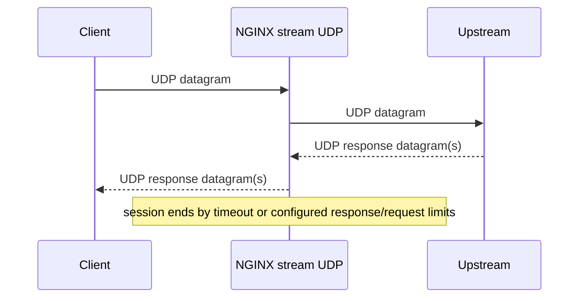
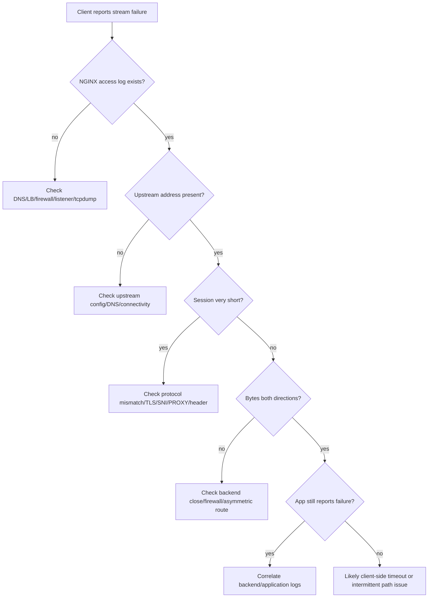

# Part 089 — Stream Observability and Debugging

Di HTTP proxy, kamu punya request method, URI, status code, upstream status, headers, body size, cache status, dan banyak sinyal level aplikasi.

Di `stream`, sebagian besar sinyal itu hilang.

NGINX tidak melihat `GET /api/orders`, tidak melihat `Host`, tidak melihat response JSON, tidak tahu apakah query SQL sukses, tidak tahu apakah Redis command gagal, dan tidak tahu apakah protokol custom mengembalikan error application-level.

Pada layer 4, unit observability utama bukan request. Unitnya adalah **session / connection / datagram flow**.

Itu mengubah cara debugging.



Mental model yang benar:

> Di `stream`, NGINX menjawab pertanyaan: “apakah koneksi bisa diterima, diteruskan, dan ditutup secara sehat?”  
> Ia tidak menjawab penuh: “apakah operasi aplikasi berhasil?”

Karena itu, observability stream harus digabung dengan tiga layer lain:

1. **NGINX stream logs** untuk session-level truth.
2. **Backend logs/metrics** untuk protocol/application truth.
3. **Network evidence** seperti `ss`, `tcpdump`, packet counters, conntrack, firewall logs, dan load balancer metrics.

Bagian ini akan membangun cara berpikir, format log, metric, dan playbook investigasi yang bisa dipakai ketika NGINX menjadi TCP/UDP edge proxy production.

---

## 1. Apa yang berbeda dari observability HTTP?

Di HTTP:

```txt
one request -> one response -> one status code -> one log line
```

Di TCP stream:

```txt
one connection -> many protocol operations -> zero/many backend replies -> one session log line when closed
```

Di UDP:

```txt
one logical session approximation -> datagrams -> timeout-based lifecycle -> one log line depending NGINX session handling
```

Konsekuensinya:

| Area | HTTP proxy | Stream proxy |
|---|---|---|
| Unit utama | Request | Connection/session/datagram flow |
| Status | HTTP status | Stream status/session result |
| Latency | Request latency | Session duration / connect time |
| Routing evidence | URI, host, headers | listener, SNI/ALPN if preread, source IP, upstream |
| Error evidence | 4xx/5xx | connect failure, timeout, premature close, byte counts |
| Application correctness | Bisa terlihat sebagian | Hampir selalu tidak terlihat |
| Debugging tool | access log + app log | stream log + app log + network tools |

Jangan memaksakan dashboard HTTP ke TCP.

Untuk PostgreSQL, satu TCP connection bisa membawa banyak query. Jika satu connection log line menunjukkan session sukses selama 2 jam, itu tidak berarti semua query di dalamnya sukses. Ia hanya berarti koneksi TCP proxied berjalan sampai ditutup.

---

## 2. Stream log adalah audit session, bukan audit request

NGINX menyediakan `ngx_stream_log_module` untuk menulis access log stream. Directive `log_format` mendefinisikan format, dan `access_log` memilih path serta format. Logging bisa dibuffer, dikompresi, dikirim ke syslog, atau dimatikan pada level tertentu.

Contoh minimal:

```nginx
stream {
    log_format stream_basic '$remote_addr:$remote_port '
                            '[$time_local] '
                            '$protocol $status '
                            '$bytes_sent $bytes_received '
                            '$session_time '
                            '$upstream_addr';

    access_log /var/log/nginx/stream-access.log stream_basic;

    upstream postgres_pool {
        server 10.0.10.11:5432;
        server 10.0.10.12:5432;
    }

    server {
        listen 5432;
        proxy_pass postgres_pool;
    }
}
```

Tapi minimal log seperti ini kurang untuk production. Kamu butuh cukup dimensi untuk menjawab:

- client mana yang connect?
- listener mana yang menerima?
- protocol apa?
- upstream mana yang dipilih?
- berapa lama session berjalan?
- berapa byte masuk/keluar?
- apakah upstream connection gagal?
- apakah client close duluan?
- apakah SNI tersedia?
- apakah PROXY protocol dipakai?
- apakah ini TCP atau UDP?
- apakah session terjadi saat deploy/reload?

---

## 3. Format log JSON untuk stream production

Gunakan JSON log supaya bisa diproses oleh Loki, Elasticsearch, OpenSearch, Vector, Fluent Bit, Datadog, Splunk, atau pipeline internal.

Contoh baseline:

```nginx
stream {
    log_format stream_json escape=json
      '{'
        '"ts":"$time_iso8601",'
        '"protocol":"$protocol",'
        '"status":"$status",'
        '"session_time":$session_time,'
        '"remote_addr":"$remote_addr",'
        '"remote_port":"$remote_port",'
        '"server_addr":"$server_addr",'
        '"server_port":"$server_port",'
        '"proxy_protocol_addr":"$proxy_protocol_addr",'
        '"proxy_protocol_port":"$proxy_protocol_port",'
        '"upstream_addr":"$upstream_addr",'
        '"upstream_bytes_sent":$upstream_bytes_sent,'
        '"upstream_bytes_received":$upstream_bytes_received,'
        '"bytes_sent":$bytes_sent,'
        '"bytes_received":$bytes_received,'
        '"ssl_preread_server_name":"$ssl_preread_server_name",'
        '"ssl_preread_alpn_protocols":"$ssl_preread_alpn_protocols",'
        '"ssl_preread_protocol":"$ssl_preread_protocol"'
      '}';

    access_log /var/log/nginx/stream-access.json stream_json;
}
```

Catatan:

- `$ssl_preread_*` hanya meaningful jika `ssl_preread on;` aktif dan module tersedia.
- `$proxy_protocol_*` hanya meaningful jika listener menerima PROXY protocol.
- Tidak semua variable tersedia pada semua build/versi/module. Validasi dengan `nginx -T` dan smoke test log.
- Untuk UDP, interpretasi bytes/session time perlu hati-hati karena lifecycle berbeda dari TCP.

---

## 4. Dimensi log yang harus ada

### 4.1 Identity layer

```txt
remote_addr
remote_port
proxy_protocol_addr
proxy_protocol_port
```

Kamu perlu membedakan:

- IP koneksi langsung ke NGINX.
- IP asli yang dibawa oleh PROXY protocol.
- IP yang diklaim lewat mekanisme lain.

Dalam stream, `remote_addr` bisa saja IP load balancer internal. Jika real client IP dibawa lewat PROXY protocol, jangan lupa mencatat `$proxy_protocol_addr`.

Invariant production:

> Semua dashboard abuse, allowlist, dan audit harus eksplisit memakai identity source yang benar.

Jangan menamai field secara ambigu seperti `client_ip` jika sumbernya tidak jelas. Lebih baik:

```json
{
  "tcp_peer_ip": "10.0.1.10",
  "proxy_protocol_ip": "203.0.113.45",
  "effective_client_ip": "203.0.113.45"
}
```

Jika kamu butuh `effective_client_ip`, buat dengan `map` dan dokumentasikan trust boundary-nya.

---

### 4.2 Listener layer

```txt
server_addr
server_port
protocol
```

Ini penting saat satu NGINX menangani banyak port:

- 443 TLS passthrough
- 5432 PostgreSQL
- 3306 MySQL
- 6379 Redis
- 53 UDP DNS
- 6514 syslog TLS

Tanpa listener fields, kamu tidak tahu traffic yang error berasal dari port mana.

---

### 4.3 Routing layer

```txt
upstream_addr
ssl_preread_server_name
ssl_preread_alpn_protocols
ssl_preread_protocol
```

Untuk TCP biasa, routing biasanya berdasarkan listener port atau source IP.

Untuk TLS passthrough, routing bisa berdasarkan SNI.

Contoh:

```nginx
stream {
    map $ssl_preread_server_name $tls_backend {
        db-a.example.internal db_a;
        db-b.example.internal db_b;
        default reject_tls;
    }

    upstream db_a { server 10.0.20.11:5432; }
    upstream db_b { server 10.0.20.12:5432; }
    upstream reject_tls { server 127.0.0.1:9; }

    server {
        listen 443;
        ssl_preread on;
        proxy_pass $tls_backend;
    }
}
```

Log harus bisa menjawab:

```txt
SNI apa yang dikirim client?
Backend mana yang dipilih?
Berapa banyak request jatuh ke default/reject?
```

---

### 4.4 Volume layer

```txt
bytes_sent
bytes_received
upstream_bytes_sent
upstream_bytes_received
```

Interpretasinya:

- Banyak bytes client → upstream, sedikit upstream → client: mungkin upload/write-heavy, auth gagal, backend menutup cepat, atau protocol mismatch.
- Sedikit bytes client → upstream, banyak upstream → client: mungkin download/read-heavy, replication, atau data leak risk.
- Nol upstream bytes: bisa connect failure, early client close, ACL drop, atau misroute.

Untuk debugging, byte count sering lebih berguna daripada status tunggal.

---

### 4.5 Time layer

```txt
session_time
```

`session_time` bukan latency request. Ia durasi session.

Contoh:

| Protocol | Session time 2 jam artinya? |
|---|---|
| PostgreSQL | Koneksi pooled bertahan lama |
| Redis | Client persistent connection |
| Syslog TCP | Forwarder konek terus |
| TLS passthrough HTTPS | Bisa normal untuk HTTP/2 long-lived |
| DNS UDP | Tidak relevan seperti TCP; perlu lihat pattern datagram |

Jangan membuat alert generik “session_time p95 tinggi” tanpa tahu protocol.

---

## 5. Stream status: baca sebagai transport outcome

Di HTTP, `status=200` berarti HTTP response 200.

Di stream, status bukan application status. Ia outcome session/proxy di layer stream.

Gunakan status untuk mengelompokkan:

- accepted/proxied successfully
- client issue
- upstream connection issue
- timeout
- internal error

Tetapi jangan menafsirkan `status` sebagai query SQL sukses, login Redis sukses, atau TLS cert valid di backend jika NGINX hanya passthrough.

Praktik bagus:

```txt
stream status = transport result
backend status = application/protocol result
business status = domain result
```

Tiga level itu harus punya telemetry sendiri.

---

## 6. Error log di stream

Access log memberi session summary. Error log memberi alasan runtime.

Atur level error log sesuai kebutuhan:

```nginx
error_log /var/log/nginx/error.log warn;
```

Untuk debugging spesifik, kamu bisa menaikkan sementara:

```nginx
error_log /var/log/nginx/error.log info;
```

Atau bila build mendukung debug dan kamu butuh investigasi sangat dalam:

```nginx
error_log /var/log/nginx/error.log debug;
```

Namun debug log bisa sangat ramai. Jangan aktifkan global debug pada edge traffic tinggi tanpa scope dan durasi jelas.

Operational rule:

> Naikkan verbosity untuk window pendek, simpan bukti, lalu turunkan lagi.

---

## 7. Debugging TCP stream: mental model

TCP punya lifecycle:



Pertanyaan debugging TCP harus mengikuti lifecycle:

1. Apakah client bisa mencapai listener NGINX?
2. Apakah NGINX menerima connection?
3. Apakah NGINX memilih backend yang benar?
4. Apakah NGINX bisa connect ke backend?
5. Apakah bytes mengalir dua arah?
6. Siapa yang menutup koneksi?
7. Apakah timeout terjadi di NGINX, backend, client, firewall, atau LB lain?

---

## 8. TCP failure taxonomy

### 8.1 Tidak ada log sama sekali

Kemungkinan:

- traffic tidak sampai NGINX
- wrong port/security group/firewall
- DNS menuju host lain
- cloud load balancer health tidak forward
- NGINX tidak listen pada address/port itu
- access log stream belum dikonfigurasi

Checklist:

```bash
sudo ss -lntup | grep nginx
sudo nginx -T | grep -A20 'stream {'
sudo tcpdump -ni any port 5432
```

Jika `tcpdump` tidak melihat packet, masalahnya sebelum NGINX.

Jika `tcpdump` melihat SYN tapi tidak ada accept/log, cek listener, firewall lokal, SELinux/AppArmor, atau limit kernel.

---

### 8.2 Log ada, upstream_addr kosong atau gagal

Kemungkinan:

- upstream host down
- upstream port salah
- firewall dari NGINX ke upstream
- DNS resolution gagal
- upstream connect timeout
- upstream pool exhausted

Checklist:

```bash
nc -vz 10.0.20.11 5432
ss -ntp | grep ':5432'
tcpdump -ni any host 10.0.20.11 and port 5432
```

Perhatikan beda:

- `connection refused`: host reachable, port closed/service down.
- timeout: packet drop, firewall, route issue, security group, blackhole.
- immediate close after connect: protocol mismatch atau backend rejects.

---

### 8.3 Session pendek, bytes kecil

Kemungkinan:

- client health check membuka TCP lalu close
- TLS client masuk ke plaintext backend
- plaintext client masuk ke TLS backend
- protocol mismatch
- auth handshake gagal
- backend closes idle too aggressively
- SNI default route salah

Log clue:

```json
{
  "session_time": 0.014,
  "bytes_sent": 0,
  "bytes_received": 517,
  "upstream_addr": "10.0.20.11:5432"
}
```

Client mengirim bytes, upstream tidak banyak menjawab. Ini bisa TLS ClientHello ke PostgreSQL plaintext, atau client bicara protokol salah.

Buktikan dengan packet capture terbatas:

```bash
sudo tcpdump -ni any -s 256 -A 'host 10.0.20.11 and port 5432'
```

Jangan capture payload sensitif sembarangan di production. Untuk database/TLS, metadata sering cukup.

---

### 8.4 Session sangat panjang

Kemungkinan normal:

- database pool
- Redis persistent connection
- MQTT
- syslog TCP
- HTTP/2 TLS passthrough

Kemungkinan bermasalah:

- idle connection leak
- client tidak close
- backend tidak enforce idle timeout
- connection limit habis
- deploy/drain tertahan

Metric penting:

```txt
active stream connections by listener
long-lived sessions count
session_time bucket
upstream max connections
backend active connections
```

---

### 8.5 Banyak reset / premature close

Kemungkinan:

- client timeout lebih pendek dari backend
- backend closes idle connection
- network middlebox resets
- health checker aggressive
- connection limit di backend
- TLS handshake failure

Butuh korelasi:

```txt
NGINX stream error log
backend log
client log
LB/firewall log
packet capture with TCP flags
```

Satu log line tidak cukup.

---

## 9. Debugging UDP stream: mental model

UDP tidak punya connection handshake. NGINX membuat session approximation berdasarkan flow dan timeout.



UDP debugging berbeda:

- Tidak ada TCP connect success/failure.
- Packet loss bisa terlihat seperti application timeout.
- Source port/NAT mapping sangat penting.
- Response count dapat dikontrol dengan `proxy_responses`.
- Session timeout menentukan kapan NGINX lupa mapping.

---

## 10. UDP failure taxonomy

### 10.1 Client timeout, NGINX log ada

Kemungkinan:

- upstream tidak menjawab
- response blocked dari upstream ke NGINX
- response blocked dari NGINX ke client
- `proxy_responses` salah
- NAT/firewall timeout
- DNS-like response lebih besar dari MTU/fragment dropped

Checklist:

```bash
sudo tcpdump -ni any udp port 53
sudo conntrack -L | grep 53
```

Untuk DNS:

```bash
dig @nginx-ip example.com
```

Bandingkan:

```bash
dig @upstream-ip example.com
```

---

### 10.2 Response salah client

Kemungkinan:

- transparent proxying salah
- NAT/source port collision edge case
- UDP session mapping timeout terlalu pendek
- upstream response datang terlambat setelah mapping berubah/expired

Untuk UDP high-volume, perhatikan:

```nginx
proxy_timeout 10s;
proxy_responses 1;
```

Nilai ini tidak universal. DNS dan syslog butuh model berbeda.

---

### 10.3 Syslog UDP loss

Kemungkinan:

- UDP tidak reliable
- socket buffer penuh
- backend lambat
- packet drop kernel
- network congestion

Jangan berharap NGINX membuat UDP menjadi reliable. Untuk audit/compliance log, gunakan TCP/TLS syslog atau queue durable.

---

## 11. Metrics yang harus dibuat dari stream log

Minimal dashboard per listener:

```txt
connections/session count per minute
status distribution
session_time p50/p90/p99
bytes_received/sent
upstream selection distribution
upstream connect/error count
SNI distribution
unknown/default SNI count
PROXY protocol source distribution
long-lived session count
short session spike
```

Untuk TCP database proxy:

```txt
active connections by upstream
new connections rate
connection duration histogram
zero-byte session rate
upstream failure rate
backend saturation correlation
```

Untuk TLS passthrough:

```txt
SNI distribution
empty SNI rate
unknown SNI rate
ALPN distribution
TLS protocol from preread if available
route-to-upstream mapping
```

Untuk UDP DNS:

```txt
queries/session approximation
response/no-response ratio
upstream distribution
timeout count
packet volume
large response indicators
```

---

## 12. Structured route labels in stream

HTTP logs often include `$server_name`, `$uri`, route labels, and app names. Stream does not have route names by default.

Tambahkan label dengan `map`.

```nginx
stream {
    map $server_port $stream_service {
        5432 postgres;
        3306 mysql;
        6379 redis;
        53   dns;
        default unknown;
    }

    map $ssl_preread_server_name $stream_route {
        db-a.example.internal db_a_tls;
        db-b.example.internal db_b_tls;
        default unknown_sni;
    }

    log_format stream_json escape=json
      '{'
        '"ts":"$time_iso8601",'
        '"service":"$stream_service",'
        '"route":"$stream_route",'
        '"remote_addr":"$remote_addr",'
        '"server_port":"$server_port",'
        '"upstream_addr":"$upstream_addr",'
        '"status":"$status",'
        '"session_time":$session_time'
      '}';
}
```

Jangan biarkan dashboard menebak service dari port mentah.

Label eksplisit membuat RCA jauh lebih cepat.

---

## 13. Observability untuk SNI routing

Untuk SNI passthrough, log ini wajib:

```nginx
log_format tls_passthrough escape=json
  '{'
    '"ts":"$time_iso8601",'
    '"remote_addr":"$remote_addr",'
    '"sni":"$ssl_preread_server_name",'
    '"alpn":"$ssl_preread_alpn_protocols",'
    '"tls_preread_protocol":"$ssl_preread_protocol",'
    '"upstream_addr":"$upstream_addr",'
    '"status":"$status",'
    '"session_time":$session_time,'
    '"bytes_sent":$bytes_sent,'
    '"bytes_received":$bytes_received'
  '}';
```

Alert yang berguna:

- unknown SNI > baseline
- empty SNI spike
- default backend hit > 0 untuk production strict route
- session_time sangat pendek + bytes kecil pada route tertentu
- ALPN berubah drastis setelah client/library upgrade

SNI pitfalls:

- client lama mungkin tidak mengirim SNI
- IP literal tidak punya SNI hostname
- TLS ClientHello bisa tidak lengkap bila client close cepat
- encrypted client hello dapat mengubah observability masa depan
- SNI bukan authorization proof; hanya routing hint

---

## 14. Observability untuk PROXY protocol

Log field yang harus ada:

```nginx
"remote_addr":"$remote_addr",
"proxy_protocol_addr":"$proxy_protocol_addr",
"proxy_protocol_port":"$proxy_protocol_port"
```

Case yang perlu terdeteksi:

### 14.1 Listener berharap PROXY protocol, client tidak mengirim

Symptoms:

- connection close cepat
- error log menyebut broken/invalid PROXY protocol header
- bytes kecil

Root cause:

- upstream load balancer belum enable PROXY protocol
- direct client bypass ke PROXY-only listener
- wrong port exposure

### 14.2 Listener tidak berharap PROXY protocol, client mengirim

Symptoms:

- backend menerima bytes `PROXY TCP4 ...` sebagai payload protocol
- protocol handshake rusak
- database/TLS error aneh

Root cause:

- mismatch antara LB dan NGINX listener config

Invariant:

> PROXY protocol harus dikonfigurasi simetris di setiap hop yang menerimanya dan mengirimkannya.

---

## 15. Correlating NGINX stream log with backend log

Masalah terbesar di stream: tidak ada request id natural.

Opsi korelasi:

1. **Source IP + source port + timestamp**
2. **PROXY protocol source identity**
3. **Backend connection id** jika backend log mencatat peer socket
4. **TLS SNI + timestamp**
5. **Application-level correlation** jika protokol mendukung startup metadata

Contoh PostgreSQL:

```txt
NGINX log:
remote=203.0.113.50:51044 upstream=10.0.20.11:5432 ts=12:00:03 session=900s

Postgres log:
connection received: host=10.0.10.5 port=44920
```

Backend melihat NGINX IP, bukan client IP, kecuali kamu memakai PROXY protocol dan backend mendukungnya, atau kamu terminate/proxy di layer aplikasi yang bisa membawa metadata.

Untuk banyak database, PROXY protocol tidak didukung langsung. Jangan mengasumsikan real client IP bisa sampai ke DB.

---

## 16. Runtime tools untuk investigation

### 16.1 NGINX config truth

```bash
sudo nginx -T
sudo nginx -V
```

Gunakan `nginx -T` untuk melihat config efektif, termasuk include.

Gunakan `nginx -V` untuk melihat compile flags/module.

Pertanyaan:

```txt
Apakah --with-stream aktif?
Apakah --with-stream_ssl_module aktif?
Apakah --with-stream_ssl_preread_module aktif?
Apakah module dynamic diload?
Config efektif berbeda dari repo?
```

---

### 16.2 Socket truth

```bash
ss -lntup
ss -lnuap
ss -ntp state established
```

Pertanyaan:

```txt
Port benar-benar listen?
Listen di 0.0.0.0 atau IP tertentu?
IPv6 listen?
Banyak established connection ke upstream?
Recv-Q/Send-Q naik?
```

Recv-Q/Send-Q tinggi adalah sinyal backpressure.

---

### 16.3 Packet truth

```bash
sudo tcpdump -ni any port 5432
sudo tcpdump -ni any host 10.0.20.11 and port 5432
sudo tcpdump -ni any 'tcp[tcpflags] & (tcp-syn|tcp-fin|tcp-rst) != 0'
```

Untuk TLS ClientHello/SNI metadata:

```bash
openssl s_client -connect edge.example.com:443 -servername db-a.example.internal -brief
```

Untuk UDP DNS:

```bash
sudo tcpdump -ni any udp port 53
```

Packet truth menjawab: traffic benar-benar lewat mana?

---

### 16.4 Process and limit truth

```bash
ps -ef | grep nginx
systemctl status nginx
cat /proc/$(pgrep -n nginx)/limits
ulimit -n
```

Pertanyaan:

```txt
Worker berjalan?
File descriptor cukup?
Reload sukses?
Worker lama masih drain?
```

---

### 16.5 Kernel/network counters

```bash
netstat -s
nstat
ip -s link
conntrack -S
```

Cari:

- TCP retransmits
- resets
- listen queue overflow
- UDP receive buffer errors
- packet drops
- conntrack full

NGINX log bisa terlihat normal sementara kernel drop packet sebelum aplikasi.

---

## 17. Debugging decision tree



Use this tree during incidents. It prevents random config editing.

---

## 18. Common production incidents

### Incident 1 — PostgreSQL clients randomly fail after adding NGINX stream

Symptoms:

```txt
short sessions
upstream selected
bytes client->upstream small
backend logs auth/protocol failures
```

Likely causes:

- TLS expectation mismatch
- client sends SSLRequest but backend path configured plain incorrectly
- backend `pg_hba.conf` sees NGINX IP not client IP
- connection pooling behavior changed
- idle timeout mismatch

Fix approach:

1. Confirm whether NGINX terminates TLS or passes through.
2. Confirm backend sees expected source identity.
3. Align idle timeouts.
4. Do not use NGINX stream as transparent DB identity proxy unless backend supports identity propagation.

---

### Incident 2 — TLS passthrough sends some clients to default backend

Symptoms:

```txt
sni=""
route="unknown_sni"
short session
client TLS failure
```

Likely causes:

- client did not send SNI
- client used IP address
- SNI typo
- encrypted client hello impact
- `ssl_preread on;` missing
- module not built/loaded

Fix approach:

1. Test with `openssl s_client -servername`.
2. Log SNI explicitly.
3. Decide default route behavior: reject unknown or fallback legacy.
4. Add client compatibility policy.

---

### Incident 3 — UDP DNS works in test but fails under load

Symptoms:

```txt
client timeout spike
packet drops
UDP receive buffer errors
backend no-response spike
```

Likely causes:

- UDP packet loss
- kernel socket buffer exhaustion
- backend slow
- fragmentation/MTU issue
- conntrack table pressure

Fix approach:

1. Capture packet both sides of NGINX.
2. Check kernel UDP errors.
3. Tune buffers if justified.
4. Reduce response size / support TCP fallback for DNS.
5. Add backend capacity.

---

### Incident 4 — PROXY protocol rollout breaks all clients

Symptoms:

```txt
invalid PROXY protocol header
connections close immediately
no backend logs or protocol garbage in backend logs
```

Likely causes:

- enabled `proxy_protocol` on NGINX listener before LB sends it
- LB sends PROXY but NGINX listener does not expect it
- direct clients can hit PROXY-only listener

Fix approach:

1. Roll back listener mismatch.
2. Verify packet first bytes.
3. Make PROXY-only listener internal/private.
4. Update config across hops atomically.

---

## 19. Stream observability anti-patterns

### Anti-pattern: logging only status and remote address

Not enough. You need upstream, bytes, duration, listener, route label.

### Anti-pattern: using stream status as business success

Wrong. Stream status is transport outcome.

### Anti-pattern: no SNI logging for TLS passthrough

You cannot debug routing without SNI evidence.

### Anti-pattern: assuming real client IP exists

For L4 proxying, backend usually sees NGINX IP unless PROXY protocol or transparent proxying is correctly supported.

### Anti-pattern: packet capture as first move for every incident

Start with logs and config. Use packet capture when lifecycle evidence is ambiguous.

### Anti-pattern: enabling debug log globally under high traffic

It can create IO pressure and make incident worse.

---

## 20. Production stream log template

A practical baseline:

```nginx
stream {
    map $server_port $stream_service {
        443  tls_passthrough;
        5432 postgres;
        3306 mysql;
        6379 redis;
        53   dns;
        default unknown;
    }

    map $ssl_preread_server_name $stream_route {
        db-a.example.internal db_a;
        db-b.example.internal db_b;
        default unknown;
    }

    log_format stream_json escape=json
      '{'
        '"ts":"$time_iso8601",'
        '"service":"$stream_service",'
        '"route":"$stream_route",'
        '"protocol":"$protocol",'
        '"status":"$status",'
        '"session_time":$session_time,'
        '"remote_addr":"$remote_addr",'
        '"remote_port":"$remote_port",'
        '"proxy_protocol_addr":"$proxy_protocol_addr",'
        '"proxy_protocol_port":"$proxy_protocol_port",'
        '"server_addr":"$server_addr",'
        '"server_port":"$server_port",'
        '"upstream_addr":"$upstream_addr",'
        '"bytes_sent":$bytes_sent,'
        '"bytes_received":$bytes_received,'
        '"upstream_bytes_sent":$upstream_bytes_sent,'
        '"upstream_bytes_received":$upstream_bytes_received,'
        '"sni":"$ssl_preread_server_name",'
        '"alpn":"$ssl_preread_alpn_protocols",'
        '"tls_preread_protocol":"$ssl_preread_protocol"'
      '}';

    access_log /var/log/nginx/stream-access.json stream_json buffer=64k flush=5s;
    error_log  /var/log/nginx/stream-error.log warn;
}
```

Buffering logs reduces IO overhead but introduces delay and loss risk on crash. For highly sensitive audit traffic, choose log delivery intentionally.

---

## 21. Alert design

Good alerts:

```txt
unknown_sni_rate > 0.5% for 5m on tls_passthrough
stream_connect_failure_rate > 2% for 5m per upstream
short_session_rate doubled from baseline
zero_upstream_bytes spike
udp_timeout/no-response spike
proxy_protocol_invalid_header observed
active_sessions near backend max capacity
```

Bad alerts:

```txt
session_time p99 high for all stream traffic
bytes_sent high globally
status non-zero globally without service grouping
any single failed connection pages human
```

Stream traffic differs too much by protocol. Always group by service/listener/route.

---

## 22. Runbook: “client cannot connect”

```txt
1. Confirm exact endpoint: host, port, protocol, TLS/plain, SNI, source network.
2. Check whether NGINX log has matching session.
3. If no log, check DNS/LB/firewall/listener/tcpdump.
4. If log exists, inspect upstream_addr/status/session_time/bytes.
5. Test NGINX -> upstream connectivity from the NGINX node.
6. Check backend logs at same timestamp.
7. Capture packet only if logs disagree or network path unclear.
8. Fix smallest proven boundary; do not random-edit upstream config.
```

---

## 23. Runbook: “works directly to backend, fails through NGINX”

Likely categories:

```txt
identity changed
TLS changed
source IP changed
idle timeout changed
connection reuse/pooling behavior changed
PROXY protocol mismatch
SNI route mismatch
buffer/socket limits changed
```

Checklist:

```bash
# Direct
openssl s_client -connect backend:443 -servername name.example -brief

# Through NGINX
openssl s_client -connect nginx:443 -servername name.example -brief

# TCP route
nc -vz nginx 5432
nc -vz backend 5432

# Config truth
nginx -T | sed -n '/stream {/,/}/p'
```

Compare evidence, not assumptions.

---

## 24. What stream observability cannot solve

NGINX stream cannot tell you:

- SQL query latency distribution inside a persistent connection.
- Redis command success/failure.
- Kafka protocol-level error.
- TLS certificate details behind passthrough unless you terminate or preread limited metadata.
- User identity inside encrypted application protocol.
- Business transaction outcome.

You need backend instrumentation.

The correct architecture is not “make NGINX see everything”. The correct architecture is:

```txt
NGINX stream = transport/session telemetry
backend = protocol/application telemetry
client/app = user/business telemetry
network = packet/path telemetry
```

---

## 25. Review checklist

Before shipping stream proxy to production:

```txt
[ ] stream access log enabled
[ ] structured JSON log format
[ ] listener/service label present
[ ] upstream_addr logged
[ ] session_time logged
[ ] bytes both directions logged
[ ] PROXY protocol fields logged if applicable
[ ] SNI/ALPN logged if ssl_preread is used
[ ] error_log level documented
[ ] dashboard grouped by listener/service/upstream
[ ] alert thresholds based on baseline
[ ] runbook includes no-log, connect-fail, short-session, timeout cases
[ ] packet capture procedure documented with privacy guardrail
[ ] backend logs can be correlated by timestamp/socket/source identity
[ ] config truth can be retrieved with nginx -T
[ ] build/module truth can be retrieved with nginx -V
```

---

## 26. Key takeaways

Stream observability is not less important than HTTP observability. It is simply different.

The key shift:

```txt
HTTP: debug requests.
Stream: debug sessions and byte flow.
```

Production-grade stream debugging requires four truths:

1. **Config truth** — what NGINX is actually running.
2. **Session truth** — what stream access/error logs say.
3. **Network truth** — what packets and sockets show.
4. **Backend truth** — what the real protocol/application observed.

If those four truths are separated, incidents become guesswork.

If they are connected, NGINX stream becomes a reliable, debuggable Layer 4 edge.

---

## References

- NGINX official documentation — `ngx_stream_log_module`
- NGINX official documentation — `ngx_stream_core_module`
- NGINX official documentation — `ngx_stream_proxy_module`
- NGINX official documentation — `ngx_stream_ssl_preread_module`
- NGINX official documentation — `ngx_stream_ssl_module`
- F5 NGINX documentation — TCP/UDP Load Balancing
- F5 NGINX documentation — Accepting the PROXY Protocol
