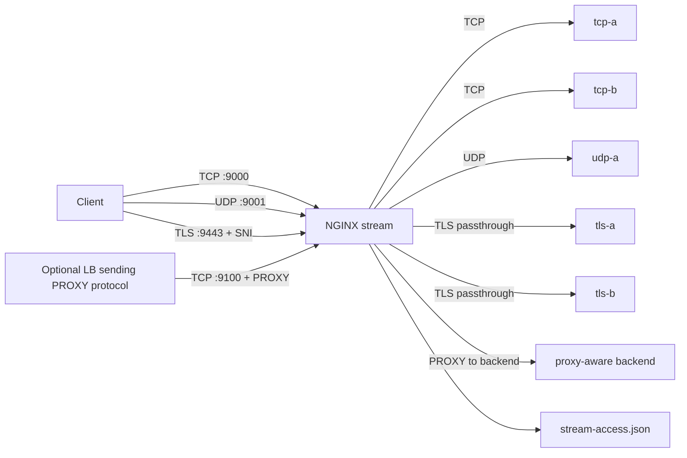

# Part 090 — Stream Production Lab

Pada bagian ini kita membangun lab Layer 4 production-style dengan NGINX `stream`.

Targetnya bukan sekadar “TCP forwarding berhasil”. Targetnya adalah punya edge proxy yang:

- bisa meneruskan TCP service,
- bisa meneruskan UDP service,
- bisa melakukan TLS passthrough berbasis SNI,
- bisa menerima/meneruskan PROXY protocol,
- punya structured stream logs,
- punya smoke test yang jelas,
- punya failure drill,
- dan punya boundary yang tidak menipu operator.

Kita akan membangun lab dengan tiga jalur traffic:

```txt
1. TCP echo-like service
2. UDP echo-like service
3. TLS passthrough by SNI
```

Selain itu kita akan menyiapkan jalur PROXY protocol supaya kamu melihat perbedaan antara:

```txt
client IP yang connect ke NGINX
client IP yang diklaim/dibawa oleh PROXY protocol
upstream yang menerima koneksi dari NGINX
```

---

## 1. Architecture



We will run everything locally with Docker Compose.

This lab intentionally uses simple echo/demo services so the NGINX behavior is visible without database-specific complexity.

---

## 2. Directory layout

```txt
nginx-stream-lab/
  docker-compose.yml
  nginx/
    nginx.conf
    stream.d/
      00-log.conf
      10-upstreams.conf
      20-tcp.conf
      30-udp.conf
      40-tls-passthrough.conf
      50-proxy-protocol.conf
  certs/
    tls-a.crt
    tls-a.key
    tls-b.crt
    tls-b.key
  services/
    tcp_server.py
    udp_server.py
    tls_server.py
    proxy_protocol_server.py
  scripts/
    gen-certs.sh
    smoke.sh
```

Why this layout?

- `nginx.conf` owns process/global config.
- `stream.d` owns Layer 4 config fragments.
- each traffic type has one file.
- logs are centralized in `00-log.conf`.
- certs are generated for lab-only TLS backends.
- services are intentionally small and observable.

---

## 3. Docker Compose

Create `docker-compose.yml`:

```yaml
services:
  nginx:
    image: nginx:1.29-alpine
    container_name: nginx-stream-lab
    depends_on:
      - tcp-a
      - tcp-b
      - udp-a
      - tls-a
      - tls-b
      - proxy-aware
    ports:
      - "9000:9000/tcp"
      - "9001:9001/udp"
      - "9443:9443/tcp"
      - "9100:9100/tcp"
    volumes:
      - ./nginx/nginx.conf:/etc/nginx/nginx.conf:ro
      - ./nginx/stream.d:/etc/nginx/stream.d:ro
      - ./logs:/var/log/nginx
    command: ["nginx", "-g", "daemon off;"]

  tcp-a:
    image: python:3.12-alpine
    container_name: tcp-a
    volumes:
      - ./services:/services:ro
    command: ["python", "/services/tcp_server.py", "0.0.0.0", "7000", "tcp-a"]

  tcp-b:
    image: python:3.12-alpine
    container_name: tcp-b
    volumes:
      - ./services:/services:ro
    command: ["python", "/services/tcp_server.py", "0.0.0.0", "7000", "tcp-b"]

  udp-a:
    image: python:3.12-alpine
    container_name: udp-a
    volumes:
      - ./services:/services:ro
    command: ["python", "/services/udp_server.py", "0.0.0.0", "7001", "udp-a"]

  tls-a:
    image: python:3.12-alpine
    container_name: tls-a
    volumes:
      - ./services:/services:ro
      - ./certs:/certs:ro
    command: ["python", "/services/tls_server.py", "0.0.0.0", "7443", "tls-a", "/certs/tls-a.crt", "/certs/tls-a.key"]

  tls-b:
    image: python:3.12-alpine
    container_name: tls-b
    volumes:
      - ./services:/services:ro
      - ./certs:/certs:ro
    command: ["python", "/services/tls_server.py", "0.0.0.0", "7443", "tls-b", "/certs/tls-b.crt", "/certs/tls-b.key"]

  proxy-aware:
    image: python:3.12-alpine
    container_name: proxy-aware
    volumes:
      - ./services:/services:ro
    command: ["python", "/services/proxy_protocol_server.py", "0.0.0.0", "7100", "proxy-aware"]
```

Version pin note:

- Use an NGINX image available in your environment.
- The lab assumes `stream`, `stream_ssl_preread`, and stream logging support are available in the image.
- Validate with `nginx -V` inside the container.

```bash
docker compose exec nginx nginx -V
```

---

## 4. Demo TCP server

Create `services/tcp_server.py`:

```python
import socket
import sys
import threading
import time

host = sys.argv[1]
port = int(sys.argv[2])
name = sys.argv[3]


def handle(conn, addr):
    print(f"[{name}] connection from {addr}", flush=True)
    with conn:
        conn.sendall(f"hello from {name}\n".encode())
        while True:
            data = conn.recv(4096)
            if not data:
                break
            reply = f"{name} echo: ".encode() + data
            conn.sendall(reply)
    print(f"[{name}] closed {addr}", flush=True)


with socket.socket(socket.AF_INET, socket.SOCK_STREAM) as s:
    s.setsockopt(socket.SOL_SOCKET, socket.SO_REUSEADDR, 1)
    s.bind((host, port))
    s.listen(128)
    print(f"[{name}] listening on {host}:{port}", flush=True)
    while True:
        conn, addr = s.accept()
        threading.Thread(target=handle, args=(conn, addr), daemon=True).start()
```

This is enough to observe:

- NGINX connection forwarding,
- upstream load balancing,
- bytes both directions,
- short/long sessions.

---

## 5. Demo UDP server

Create `services/udp_server.py`:

```python
import socket
import sys

host = sys.argv[1]
port = int(sys.argv[2])
name = sys.argv[3]

with socket.socket(socket.AF_INET, socket.SOCK_DGRAM) as s:
    s.bind((host, port))
    print(f"[{name}] listening on udp {host}:{port}", flush=True)
    while True:
        data, addr = s.recvfrom(4096)
        print(f"[{name}] datagram from {addr}: {data!r}", flush=True)
        s.sendto(f"{name} echo: ".encode() + data, addr)
```

UDP has no connection handshake. We use this service to test datagram forwarding and timeout behavior.

---

## 6. Demo TLS backend server

Create `services/tls_server.py`:

```python
import socket
import ssl
import sys
import threading

host = sys.argv[1]
port = int(sys.argv[2])
name = sys.argv[3]
cert = sys.argv[4]
key = sys.argv[5]

context = ssl.SSLContext(ssl.PROTOCOL_TLS_SERVER)
context.load_cert_chain(certfile=cert, keyfile=key)


def handle(conn, addr):
    print(f"[{name}] tls connection from {addr}", flush=True)
    with conn:
        conn.sendall(f"hello from {name} over tls\n".encode())
        while True:
            data = conn.recv(4096)
            if not data:
                break
            conn.sendall(f"{name} tls echo: ".encode() + data)


with socket.socket(socket.AF_INET, socket.SOCK_STREAM) as raw:
    raw.setsockopt(socket.SOL_SOCKET, socket.SO_REUSEADDR, 1)
    raw.bind((host, port))
    raw.listen(128)
    print(f"[{name}] tls listening on {host}:{port}", flush=True)
    while True:
        client, addr = raw.accept()
        try:
            tls = context.wrap_socket(client, server_side=True)
            threading.Thread(target=handle, args=(tls, addr), daemon=True).start()
        except Exception as e:
            print(f"[{name}] tls error from {addr}: {e}", flush=True)
            client.close()
```

NGINX will not terminate TLS in the passthrough route. It will only inspect ClientHello SNI with `ssl_preread`.

---

## 7. Demo PROXY protocol-aware server

Create `services/proxy_protocol_server.py`:

```python
import socket
import sys
import threading

host = sys.argv[1]
port = int(sys.argv[2])
name = sys.argv[3]


def read_line(conn):
    data = b""
    while not data.endswith(b"\r\n") and len(data) < 512:
        b = conn.recv(1)
        if not b:
            break
        data += b
    return data


def handle(conn, addr):
    print(f"[{name}] connection from tcp peer {addr}", flush=True)
    with conn:
        header = read_line(conn)
        print(f"[{name}] first line: {header!r}", flush=True)
        if header.startswith(b"PROXY "):
            conn.sendall(b"proxy protocol received\n")
        else:
            conn.sendall(b"no proxy protocol header\n")
        while True:
            data = conn.recv(4096)
            if not data:
                break
            conn.sendall(f"{name} echo: ".encode() + data)


with socket.socket(socket.AF_INET, socket.SOCK_STREAM) as s:
    s.setsockopt(socket.SOL_SOCKET, socket.SO_REUSEADDR, 1)
    s.bind((host, port))
    s.listen(128)
    print(f"[{name}] listening on {host}:{port}", flush=True)
    while True:
        conn, addr = s.accept()
        threading.Thread(target=handle, args=(conn, addr), daemon=True).start()
```

This server demonstrates whether NGINX is sending a PROXY protocol header to upstream.

---

## 8. Generate lab certificates

Create `scripts/gen-certs.sh`:

```bash
#!/usr/bin/env bash
set -euo pipefail

mkdir -p certs

openssl req -x509 -newkey rsa:2048 -nodes -days 30 \
  -subj "/CN=tls-a.example.test" \
  -addext "subjectAltName=DNS:tls-a.example.test" \
  -keyout certs/tls-a.key \
  -out certs/tls-a.crt

openssl req -x509 -newkey rsa:2048 -nodes -days 30 \
  -subj "/CN=tls-b.example.test" \
  -addext "subjectAltName=DNS:tls-b.example.test" \
  -keyout certs/tls-b.key \
  -out certs/tls-b.crt
```

Run:

```bash
chmod +x scripts/gen-certs.sh
./scripts/gen-certs.sh
```

These are lab-only self-signed certs.

---

## 9. Main NGINX config

Create `nginx/nginx.conf`:

```nginx
worker_processes auto;

error_log /var/log/nginx/error.log warn;
pid /var/run/nginx.pid;

events {
    worker_connections 4096;
}

stream {
    include /etc/nginx/stream.d/*.conf;
}
```

No `http` block is needed for this lab.

The point is to isolate the `stream` subsystem.

---

## 10. Stream log config

Create `nginx/stream.d/00-log.conf`:

```nginx
map $server_port $stream_service {
    9000 tcp_echo;
    9001 udp_echo;
    9443 tls_passthrough;
    9100 proxy_protocol_demo;
    default unknown;
}

map $ssl_preread_server_name $stream_route {
    tls-a.example.test tls_a;
    tls-b.example.test tls_b;
    default unknown_sni;
}

log_format stream_json escape=json
  '{'
    '"ts":"$time_iso8601",'
    '"service":"$stream_service",'
    '"route":"$stream_route",'
    '"protocol":"$protocol",'
    '"status":"$status",'
    '"session_time":$session_time,'
    '"remote_addr":"$remote_addr",'
    '"remote_port":"$remote_port",'
    '"proxy_protocol_addr":"$proxy_protocol_addr",'
    '"proxy_protocol_port":"$proxy_protocol_port",'
    '"server_addr":"$server_addr",'
    '"server_port":"$server_port",'
    '"upstream_addr":"$upstream_addr",'
    '"bytes_sent":$bytes_sent,'
    '"bytes_received":$bytes_received,'
    '"upstream_bytes_sent":$upstream_bytes_sent,'
    '"upstream_bytes_received":$upstream_bytes_received,'
    '"sni":"$ssl_preread_server_name",'
    '"alpn":"$ssl_preread_alpn_protocols",'
    '"tls_preread_protocol":"$ssl_preread_protocol"'
  '}';

access_log /var/log/nginx/stream-access.json stream_json buffer=64k flush=2s;
```

This gives a single log format for all stream routes.

---

## 11. Upstream config

Create `nginx/stream.d/10-upstreams.conf`:

```nginx
upstream tcp_echo_pool {
    server tcp-a:7000 max_fails=2 fail_timeout=10s;
    server tcp-b:7000 max_fails=2 fail_timeout=10s;
}

upstream udp_echo_pool {
    server udp-a:7001 max_fails=2 fail_timeout=10s;
}

upstream tls_a_backend {
    server tls-a:7443 max_fails=2 fail_timeout=10s;
}

upstream tls_b_backend {
    server tls-b:7443 max_fails=2 fail_timeout=10s;
}

upstream reject_backend {
    # Port 9 discard is normally closed in this lab; it creates a clear failure for unknown SNI.
    server 127.0.0.1:9;
}

upstream proxy_aware_backend {
    server proxy-aware:7100 max_fails=2 fail_timeout=10s;
}
```

Production note:

- `reject_backend` is a lab shortcut.
- In real production, you may route unknown SNI to a controlled reject service or close the connection intentionally.
- Avoid silently routing unknown SNI to a real tenant.

---

## 12. TCP proxy route

Create `nginx/stream.d/20-tcp.conf`:

```nginx
server {
    listen 9000;

    proxy_connect_timeout 2s;
    proxy_timeout 30s;

    proxy_pass tcp_echo_pool;
}
```

Behavior:

- Client connects to `localhost:9000`.
- NGINX selects `tcp-a` or `tcp-b`.
- NGINX forwards raw TCP bytes.
- Access log is written when the session closes.

Test:

```bash
printf 'ping\n' | nc localhost 9000
```

Expected output:

```txt
hello from tcp-a
# or hello from tcp-b
tcp-a echo: ping
```

Depending on timing, output order may differ slightly.

---

## 13. UDP proxy route

Create `nginx/stream.d/30-udp.conf`:

```nginx
server {
    listen 9001 udp reuseport;

    proxy_timeout 10s;
    proxy_responses 1;

    proxy_pass udp_echo_pool;
}
```

Behavior:

- Client sends UDP datagram to `localhost:9001`.
- NGINX forwards datagram to `udp-a:7001`.
- NGINX forwards one response datagram back.
- Session expires by timeout.

Test with `nc` if your local version supports UDP:

```bash
echo 'hello udp' | nc -u -w2 localhost 9001
```

Expected output:

```txt
udp-a echo: hello udp
```

If `nc -u` behaves differently on your OS, use Python:

```bash
python3 - <<'PY'
import socket
s = socket.socket(socket.AF_INET, socket.SOCK_DGRAM)
s.settimeout(2)
s.sendto(b'hello udp', ('127.0.0.1', 9001))
print(s.recvfrom(4096))
PY
```

---

## 14. TLS passthrough route by SNI

Create `nginx/stream.d/40-tls-passthrough.conf`:

```nginx
map $ssl_preread_server_name $tls_passthrough_backend {
    tls-a.example.test tls_a_backend;
    tls-b.example.test tls_b_backend;
    default reject_backend;
}

server {
    listen 9443;

    ssl_preread on;

    proxy_connect_timeout 2s;
    proxy_timeout 60s;

    proxy_pass $tls_passthrough_backend;
}
```

Key point:

> NGINX does not decrypt TLS here. It only reads the TLS ClientHello enough to extract SNI and route.

Test route A:

```bash
openssl s_client -connect localhost:9443 -servername tls-a.example.test -quiet -ign_eof
```

Type:

```txt
hello
```

Expected:

```txt
hello from tls-a over tls
tls-a tls echo: hello
```

Test route B:

```bash
openssl s_client -connect localhost:9443 -servername tls-b.example.test -quiet -ign_eof
```

Expected:

```txt
hello from tls-b over tls
```

Test unknown SNI:

```bash
openssl s_client -connect localhost:9443 -servername unknown.example.test -brief
```

Expected:

```txt
connection failure or handshake failure
```

Then check log:

```bash
tail -f logs/stream-access.json
```

You should see fields like:

```json
{"service":"tls_passthrough","route":"tls_a","sni":"tls-a.example.test","upstream_addr":"172.x.x.x:7443"}
```

---

## 15. PROXY protocol route

Create `nginx/stream.d/50-proxy-protocol.conf`:

```nginx
server {
    listen 9100;

    proxy_connect_timeout 2s;
    proxy_timeout 30s;

    # Send PROXY protocol to the upstream server.
    proxy_protocol on;

    proxy_pass proxy_aware_backend;
}
```

This route demonstrates NGINX **sending** PROXY protocol to upstream.

Test:

```bash
printf 'hello\n' | nc localhost 9100
```

Expected:

```txt
proxy protocol received
proxy-aware echo: hello
```

Check backend logs:

```bash
docker compose logs proxy-aware
```

You should see first line similar to:

```txt
PROXY TCP4 172.x.x.x 172.x.x.x 12345 7100\r\n
```

Important distinction:

- This route does not require the client to send PROXY protocol.
- NGINX creates and sends PROXY protocol to the backend.
- If you also want NGINX to receive PROXY protocol from a previous load balancer, listener config is different.

---

## 16. Receiving PROXY protocol from previous hop

If a cloud LB sends PROXY protocol to NGINX, listener must expect it:

```nginx
server {
    listen 9101 proxy_protocol;

    proxy_pass proxy_aware_backend;
    proxy_protocol on;
}
```

Then logs should include:

```txt
$remote_addr              = previous hop IP
$proxy_protocol_addr      = original client IP from PROXY header
```

Do not expose a PROXY-protocol listener directly to arbitrary clients. A normal client that does not send the PROXY line will fail.

Trust invariant:

> Only enable `listen ... proxy_protocol` on ports reachable exclusively by trusted upstream proxies/load balancers.

---

## 17. Start the lab

Run:

```bash
mkdir -p logs
./scripts/gen-certs.sh
docker compose up -d
```

Validate NGINX config:

```bash
docker compose exec nginx nginx -t
```

Show effective config:

```bash
docker compose exec nginx nginx -T
```

Show compile flags:

```bash
docker compose exec nginx nginx -V
```

Confirm ports:

```bash
docker compose ps
```

---

## 18. Smoke test script

Create `scripts/smoke.sh`:

```bash
#!/usr/bin/env bash
set -euo pipefail

printf '\n== TCP ==\n'
printf 'ping tcp\n' | nc -w2 localhost 9000 || true

printf '\n== UDP ==\n'
python3 - <<'PY'
import socket
s = socket.socket(socket.AF_INET, socket.SOCK_DGRAM)
s.settimeout(2)
s.sendto(b'ping udp', ('127.0.0.1', 9001))
print(s.recvfrom(4096)[0].decode(errors='replace'))
PY

printf '\n== TLS A ==\n'
printf 'ping tls a\n' | openssl s_client -connect localhost:9443 -servername tls-a.example.test -quiet 2>/dev/null || true

printf '\n== TLS B ==\n'
printf 'ping tls b\n' | openssl s_client -connect localhost:9443 -servername tls-b.example.test -quiet 2>/dev/null || true

printf '\n== PROXY to upstream ==\n'
printf 'ping proxy\n' | nc -w2 localhost 9100 || true

printf '\n== Recent stream logs ==\n'
tail -n 10 logs/stream-access.json || true
```

Run:

```bash
chmod +x scripts/smoke.sh
./scripts/smoke.sh
```

---

## 19. Expected log analysis

After smoke test:

```bash
tail -n 20 logs/stream-access.json | jq .
```

You should see records grouped by service:

```json
{
  "service": "tcp_echo",
  "route": "unknown_sni",
  "protocol": "TCP",
  "status": "200",
  "session_time": 0.002,
  "upstream_addr": "172.20.0.3:7000",
  "bytes_sent": 18,
  "bytes_received": 9
}
```

For TLS passthrough:

```json
{
  "service": "tls_passthrough",
  "route": "tls_a",
  "protocol": "TCP",
  "sni": "tls-a.example.test",
  "upstream_addr": "172.20.0.5:7443"
}
```

For UDP:

```json
{
  "service": "udp_echo",
  "protocol": "UDP",
  "upstream_addr": "172.20.0.4:7001"
}
```

Do not obsess over exact byte counts; different client tools add newline/close differently.

---

## 20. Failure drill 1 — one TCP backend down

Stop `tcp-a`:

```bash
docker compose stop tcp-a
```

Run TCP smoke multiple times:

```bash
for i in $(seq 1 10); do printf "ping $i\n" | nc -w2 localhost 9000 || true; done
```

Observe:

```bash
tail -n 20 logs/stream-access.json | jq 'select(.service=="tcp_echo")'
docker compose logs nginx
```

Expected:

- some attempts may fail while passive failure state is learned,
- traffic should use remaining backend after failure marking,
- error log should reveal connect failure/refused/timeout depending shutdown state.

Restore:

```bash
docker compose start tcp-a
```

Lesson:

> Passive health check is reactive. The first client(s) may pay the failure cost.

---

## 21. Failure drill 2 — wrong SNI

Run:

```bash
openssl s_client -connect localhost:9443 -servername wrong.example.test -brief
```

Inspect logs:

```bash
tail -n 10 logs/stream-access.json | jq 'select(.service=="tls_passthrough")'
```

Expected:

```json
{
  "route": "unknown_sni",
  "sni": "wrong.example.test",
  "upstream_addr": "127.0.0.1:9"
}
```

Lesson:

> Unknown SNI must be observable. Silent fallback to a real backend is a tenant isolation risk.

---

## 22. Failure drill 3 — no SNI client

Run:

```bash
openssl s_client -connect localhost:9443 -brief
```

Because no `-servername` is supplied, SNI may be empty.

Expected log:

```json
{
  "sni": "",
  "route": "unknown_sni"
}
```

Decision you must make in production:

```txt
Do we support no-SNI legacy clients?
If yes, which backend is safe default?
If no, do we reject clearly and monitor volume?
```

---

## 23. Failure drill 4 — PROXY protocol mismatch

Modify route temporarily:

```nginx
server {
    listen 9100 proxy_protocol;
    proxy_connect_timeout 2s;
    proxy_timeout 30s;
    proxy_protocol on;
    proxy_pass proxy_aware_backend;
}
```

Reload:

```bash
docker compose exec nginx nginx -t
docker compose exec nginx nginx -s reload
```

Test with normal client:

```bash
printf 'hello\n' | nc -w2 localhost 9100
```

Expected:

- connection fails,
- error log complains about invalid/broken PROXY protocol header.

Rollback the config to `listen 9100;`.

Lesson:

> `listen ... proxy_protocol` changes the wire protocol expected from the previous hop. It is not a harmless metadata flag.

---

## 24. Failure drill 5 — UDP backend down

Stop UDP backend:

```bash
docker compose stop udp-a
```

Run:

```bash
python3 - <<'PY'
import socket
s = socket.socket(socket.AF_INET, socket.SOCK_DGRAM)
s.settimeout(2)
s.sendto(b'ping udp', ('127.0.0.1', 9001))
try:
    print(s.recvfrom(4096))
except Exception as e:
    print(type(e).__name__, e)
PY
```

Observe logs and error log:

```bash
tail -n 20 logs/stream-access.json | jq 'select(.service=="udp_echo")'
docker compose logs nginx
```

Restore:

```bash
docker compose start udp-a
```

Lesson:

> UDP failure may show as client timeout, not clean connection failure. Packet capture and backend counters are often necessary.

---

## 25. Reload safety

Validate before reload:

```bash
docker compose exec nginx nginx -t
```

Reload:

```bash
docker compose exec nginx nginx -s reload
```

Watch logs:

```bash
docker compose logs -f nginx
```

For stream traffic, reload behavior matters for long-lived connections. Existing workers may continue handling old sessions until they drain, while new workers accept new config. During config changes, ask:

```txt
Will old long-lived TCP sessions stay on old route?
Can we tolerate mixed config during drain?
Do we need connection draining at outer LB?
Do clients reconnect automatically?
```

For database/protocol stateful traffic, deployment should be more careful than stateless HTTP.

---

## 26. Capacity checks

Inside NGINX container:

```bash
cat /proc/1/limits
```

On host:

```bash
docker stats
ss -ntp | grep 9000
```

Production capacity variables:

```txt
worker_connections
worker_processes
open file limit
upstream max connections
backend connection limit
kernel listen backlog
NAT/conntrack table
UDP socket buffers
log IO throughput
```

Stream proxy can exhaust file descriptors quickly because each proxied TCP session uses at least one client-side and one upstream-side socket.

Approximate FD model:

```txt
required_fd ≈ active_tcp_sessions * 2 + listening_sockets + logs + overhead
```

If you expect 50k active TCP sessions, a tiny `ulimit -n 1024` is not production-ready.

---

## 27. Security review

Before using a stream proxy pattern in production:

```txt
[ ] Are all exposed ports intentional?
[ ] Is unknown SNI rejected or routed safely?
[ ] Are PROXY protocol listeners reachable only from trusted hops?
[ ] Are backend services protected from direct public access?
[ ] Is TLS passthrough compatible with required inspection/auth policy?
[ ] Are real client IP assumptions documented?
[ ] Are logs free from sensitive payload?
[ ] Are packet-capture procedures restricted?
[ ] Are idle timeouts aligned with client/backend/LB?
[ ] Are long-lived sessions considered during deploy/reload?
```

Remember:

> TLS passthrough protects backend-owned TLS but prevents NGINX from enforcing HTTP-level security policy.

If you need WAF, HTTP auth, header normalization, or URI routing, you need HTTP/TLS termination somewhere before that policy.

---

## 28. Production hardening version of TCP route

A more explicit route:

```nginx
upstream postgres_pool {
    zone postgres_pool 64k;
    server 10.0.20.11:5432 max_fails=2 fail_timeout=10s max_conns=500;
    server 10.0.20.12:5432 max_fails=2 fail_timeout=10s max_conns=500;
}

server {
    listen 5432;

    proxy_connect_timeout 2s;
    proxy_timeout 1h;
    proxy_socket_keepalive on;

    proxy_pass postgres_pool;
}
```

But do not blindly use `proxy_timeout 1h`.

Ask:

- Is the protocol long-lived?
- Does backend have idle timeout?
- Does client pool reconnect safely?
- Will reload/drain be delayed?
- Does this expose too many backend connections?

---

## 29. Production hardening version of TLS passthrough

```nginx
map $ssl_preread_server_name $tls_backend {
    app-a.example.com app_a_tls;
    app-b.example.com app_b_tls;
    default reject_tls;
}

upstream app_a_tls {
    zone app_a_tls 64k;
    server 10.0.30.11:443 max_fails=2 fail_timeout=10s;
    server 10.0.30.12:443 max_fails=2 fail_timeout=10s;
}

upstream app_b_tls {
    zone app_b_tls 64k;
    server 10.0.31.11:443 max_fails=2 fail_timeout=10s;
    server 10.0.31.12:443 max_fails=2 fail_timeout=10s;
}

upstream reject_tls {
    server 127.0.0.1:9;
}

server {
    listen 443;
    ssl_preread on;

    proxy_connect_timeout 2s;
    proxy_timeout 10m;

    proxy_pass $tls_backend;
}
```

Observability must include:

```txt
SNI
ALPN
upstream
session_time
unknown SNI count
empty SNI count
```

---

## 30. Production hardening version of UDP route

```nginx
upstream dns_pool {
    zone dns_pool 64k;
    server 10.0.40.11:53 max_fails=2 fail_timeout=10s;
    server 10.0.40.12:53 max_fails=2 fail_timeout=10s;
}

server {
    listen 53 udp reuseport;

    proxy_timeout 5s;
    proxy_responses 1;

    proxy_pass dns_pool;
}
```

For DNS, also consider:

- TCP fallback for large responses.
- EDNS buffer size.
- MTU/fragmentation behavior.
- cache/recursive resolver policy.
- rate limiting at network edge.

NGINX stream can proxy UDP. It does not make UDP reliable.

---

## 31. CI validation

At minimum, CI should run:

```bash
nginx -t -c /path/to/nginx.conf
```

For generated configs:

```txt
[ ] every stream server has access logging via inherited stream log
[ ] no unknown public listen ports
[ ] no PROXY protocol listener on public CIDR
[ ] every SNI map has default behavior
[ ] every upstream has explicit max_fails/fail_timeout policy
[ ] every long-lived route documents timeout intent
[ ] every TLS passthrough route logs SNI
[ ] every UDP route documents proxy_responses/proxy_timeout
```

A config that passes `nginx -t` can still be operationally unsafe. Add semantic checks.

---

## 32. Lab cleanup

```bash
docker compose down -v
rm -rf logs
```

Keep the files if you want to turn this into a reusable local regression lab.

---

## 33. What this lab proves

This lab proves:

- NGINX can proxy TCP through `stream`.
- NGINX can proxy UDP through `stream`.
- NGINX can inspect TLS ClientHello with `ssl_preread` and route by SNI without terminating TLS.
- NGINX can send PROXY protocol to upstream.
- Stream logs can provide session-level observability.
- Failure drills reveal the boundaries of passive health checks, SNI routing, UDP behavior, and PROXY protocol mismatch.

It does **not** prove:

- database-level query correctness,
- business transaction success,
- transparent client identity preservation for arbitrary backend protocols,
- HTTP-layer security policy under TLS passthrough,
- packet-loss-free UDP delivery,
- active health checking in Open Source NGINX.

Those require separate architecture decisions.

---

## 34. Final mental model for Phase 7

The `stream` module turns NGINX into a Layer 4 proxy/load balancer.

That power is useful, but the abstraction is lower-level than HTTP.

```txt
HTTP proxy: route and inspect requests.
Stream proxy: route and relay byte streams/datagrams.
```

When you choose stream, you gain:

- protocol independence,
- TCP/UDP proxying,
- TLS passthrough,
- SNI-based L4 routing,
- database/custom-protocol edge patterns.

You lose or reduce:

- HTTP header visibility,
- URI routing,
- WAF/header auth control,
- request-level metrics,
- application status insight.

A top-tier engineer does not ask “can NGINX forward this port?” only.

They ask:

```txt
What identity is preserved?
What policy can still be enforced?
What telemetry remains visible?
What failure does the client see?
What happens during reload?
What happens under overload?
What evidence will we have at 03:00 during an incident?
```

That is the production difference.

---

## References

- NGINX official documentation — `ngx_stream_core_module`
- NGINX official documentation — `ngx_stream_proxy_module`
- NGINX official documentation — `ngx_stream_log_module`
- NGINX official documentation — `ngx_stream_ssl_preread_module`
- NGINX official documentation — `ngx_stream_ssl_module`
- NGINX official documentation — `ngx_stream_realip_module`
- F5 NGINX documentation — TCP/UDP Load Balancing
- F5 NGINX documentation — Accepting the PROXY Protocol
