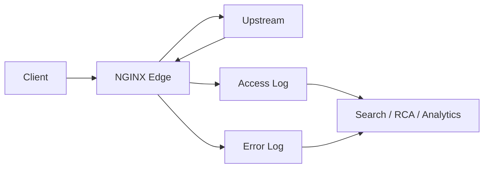

------
title: Learn NGINX In Action - Part 091
description: Access log, error log, dan log_format sebagai telemetry layer untuk root-cause analysis production NGINX.
series: learn-nginx-in-action
seriesTitle: Learn NGINX In Action
order: 91
partTitle: Access Log, Error Log, and log_format for RCA
tags:
- nginx
- observability
- logging
- rca
- production
- series
date: 2026-07-07
---

# Part 091 — Access Log, Error Log, and `log_format` for RCA

> Target bagian ini: kamu tidak hanya bisa “menyalakan access log”, tetapi bisa mendesain log NGINX sebagai **alat investigasi production**: menjawab request mana yang lambat, upstream mana yang rusak, apakah retry terjadi, apakah client abort, apakah cache bekerja, apakah request diblokir di edge, dan apakah problem berada di client, NGINX, network, upstream, atau storage.

NGINX berada di boundary. Hampir semua request melewatinya. Karena itu log NGINX sering menjadi **sumber kebenaran pertama** saat incident.

Tapi default log NGINX bukan format RCA. Default log cukup untuk melihat “ada request masuk”. Ia tidak cukup untuk menjawab:

- request ini diproses oleh virtual host mana?
- route logical mana yang kena?
- upstream mana yang dipilih?
- upstream retry berapa kali?
- latency habis di client upload, queue, upstream connect, upstream header, upstream body, atau response send?
- cache status apa?
- real client IP sudah benar atau masih IP load balancer?
- request ini punya correlation ID apa?
- apakah 499 berasal dari client abort atau timeout layer luar?
- apakah 502/504 terjadi karena connect failure, read timeout, atau backend menutup koneksi?

Logging production harus didesain seperti contract, bukan side effect.

---

## 1. Mental model: log adalah event ledger di edge

NGINX log bukan tracing penuh. NGINX log juga bukan metrics penuh. Ia adalah **event ledger**: satu baris log idealnya merepresentasikan fakta penting tentang satu request atau satu session.



Access log menjawab:

> “Request apa yang selesai, bagaimana hasilnya, dan berapa biayanya?”

Error log menjawab:

> “Apa yang NGINX anggap tidak normal saat memproses request, koneksi, config, file, upstream, TLS, atau runtime?”

Metrics menjawab tren.

Tracing menjawab path lintas service.

Access/error log menjawab detail konkret pada request tertentu.

---

## 2. Access log vs error log

### 2.1 Access log

Access log ditulis oleh HTTP log module. Ia biasanya ditulis saat request selesai. Karena itu field seperti `$request_time` merepresentasikan durasi request penuh dari perspektif NGINX, bukan hanya waktu upstream.

Access log cocok untuk:

- request inventory;
- status code distribution;
- latency analysis;
- upstream attempt analysis;
- cache analysis;
- abuse/rate-limit analysis;
- audit edge routing;
- billing/usage analytics;
- SLO burn investigation;
- replay sampling;
- incident timeline reconstruction.

### 2.2 Error log

Error log mencatat kejadian internal NGINX berdasarkan severity.

Error log cocok untuk:

- config/runtime failures;
- upstream connection errors;
- TLS handshake errors;
- file permission/path errors;
- resolver errors;
- request parsing errors;
- worker process warnings;
- temp file/storage pressure;
- debug-level investigation.

Access log menjawab “hasil request”. Error log menjawab “keluhan mesin”.

Keduanya harus digabung saat RCA.

---

## 3. Golden rule: jangan desain log untuk dashboard saja

Dashboard biasanya butuh agregasi. RCA butuh **identitas, konteks, dan sequence**.

Log yang bagus untuk dashboard tapi buruk untuk RCA biasanya hanya berisi:

```nginx
$status $request_time $upstream_response_time
```

Itu tidak cukup. Saat incident, kamu butuh pertanyaan lanjutan:

- request dari host mana?
- route mana?
- upstream mana?
- retry terjadi atau tidak?
- cache hit atau miss?
- request body berapa besar?
- response body berapa besar?
- apakah client abort?
- apakah user agent tertentu?
- apakah tenant tertentu?
- apakah version/canary tertentu?
- apakah correlation ID tersedia?

Karena itu log format production harus dikembangkan dari **pertanyaan investigasi**, bukan dari contoh config.

---

## 4. Baseline access log: default combined tidak cukup

Default `combined` format secara historis berguna:

```nginx
log_format combined '$remote_addr - $remote_user [$time_local] '
                    '"$request" $status $body_bytes_sent '
                    '"$http_referer" "$http_user_agent"';
```

Untuk production edge modern, ini kekurangan banyak dimensi:

- tidak ada `$request_time`;
- tidak ada upstream address/status/time;
- tidak ada host/server/location label;
- tidak ada request ID;
- tidak ada cache status;
- tidak ada forwarded/proxy identity;
- sulit dibaca mesin jika ada escaping problem;
- sulit join dengan app log.

Default format cocok untuk tutorial. Bukan untuk platform traffic edge.

---

## 5. Prinsip desain log format production

### 5.1 Setiap log line harus menjawab minimal 6 dimensi

| Dimensi | Pertanyaan |
|---|---|
| Identity | Request ini siapa? IP, host, request id, trace id |
| Routing | Masuk ke server/location/upstream/route mana? |
| Outcome | Status apa? Dari NGINX atau upstream? |
| Latency | Total time, upstream connect/header/response time |
| Volume | Request length, body bytes sent, upstream bytes |
| Policy | Cache, rate limit, auth, canary, tenant, mTLS |

### 5.2 Field harus stabil

Jangan mengganti nama field setiap minggu. Log adalah API untuk observability pipeline.

### 5.3 Hindari field ambigu

Contoh buruk:

```json
{"time":"...","latency":"0.2"}
```

Latency apa? Total? Upstream? Header? Unit detik atau ms?

Contoh lebih baik:

```json
{
  "request_time_s": 0.204,
  "upstream_response_time_s": "0.198"
}
```

Catatan: banyak variable NGINX berupa string. Untuk JSON logs, kamu boleh tetap string untuk aman terhadap `-`, multi-upstream values, dan comma-separated retry values.

---

## 6. Core variables untuk RCA

### 6.1 Request identity

| Variable | Fungsi |
|---|---|
| `$request_id` | ID request internal NGINX |
| `$connection` | Nomor koneksi worker-local |
| `$connection_requests` | Jumlah request pada koneksi tersebut |
| `$msec` | Timestamp dalam detik dengan millisecond resolution |
| `$time_iso8601` | Timestamp ISO-8601 |
| `$time_local` | Timestamp local log style |

`$request_id` berguna sebagai fallback correlation ID. Namun untuk sistem distributed tracing, lebih baik log juga header correlation/trace dari client atau upstream boundary.

### 6.2 Client identity

| Variable | Fungsi |
|---|---|
| `$remote_addr` | Alamat peer TCP yang dilihat NGINX, atau real IP setelah realip module |
| `$remote_port` | Port peer |
| `$realip_remote_addr` | Original client address sebelum realip replacement |
| `$http_x_forwarded_for` | Header X-Forwarded-For dari request |
| `$proxy_protocol_addr` | Address dari PROXY protocol jika digunakan |

Jangan percaya `$http_x_forwarded_for` mentah sebagai client IP. Ia header dari client/hop sebelumnya. Client bisa mengirimnya sendiri kecuali boundary trust dikontrol.

### 6.3 Request line dan route

| Variable | Fungsi |
|---|---|
| `$request` | Request line lengkap |
| `$request_method` | Method |
| `$scheme` | Scheme yang dilihat NGINX |
| `$host` | Host hasil request processing |
| `$http_host` | Header Host mentah |
| `$server_name` | Server name yang dipilih |
| `$server_port` | Port server |
| `$uri` | Normalized current URI |
| `$request_uri` | Original URI dengan args |
| `$args` | Query string |

Untuk RCA routing, selalu log minimal `$host`, `$server_name`, `$request_method`, `$uri`, `$request_uri`, dan route label buatan kamu.

### 6.4 Status dan bytes

| Variable | Fungsi |
|---|---|
| `$status` | Final response status |
| `$body_bytes_sent` | Bytes body dikirim ke client |
| `$bytes_sent` | Total bytes dikirim ke client |
| `$request_length` | Panjang request termasuk line, header, body |

`$status` saja tidak cukup. `502` dan `504` butuh upstream fields. `499` butuh konteks client abort dan request time.

### 6.5 Latency

| Variable | Fungsi |
|---|---|
| `$request_time` | Total waktu request dari NGINX perspective |
| `$upstream_connect_time` | Waktu connect ke upstream |
| `$upstream_header_time` | Waktu menerima header upstream |
| `$upstream_response_time` | Waktu menerima response upstream |

`$request_time` tinggi + `$upstream_response_time` rendah bisa berarti:

- client upload lambat;
- client download lambat;
- buffering/temp file/disk issue;
- NGINX queue/resource pressure;
- response besar;
- downstream network lambat.

`$request_time` tinggi + `$upstream_response_time` tinggi berarti upstream/service path kemungkinan dominan.

### 6.6 Upstream attempt fields

| Variable | Fungsi |
|---|---|
| `$upstream_addr` | Address upstream yang dicoba |
| `$upstream_status` | Status response upstream |
| `$upstream_connect_time` | Connect time per attempt |
| `$upstream_header_time` | Header time per attempt |
| `$upstream_response_time` | Response time per attempt |
| `$upstream_bytes_received` | Bytes dari upstream |
| `$upstream_bytes_sent` | Bytes ke upstream |
| `$upstream_cache_status` | HIT/MISS/BYPASS/STALE/etc |

Jika retry terjadi, nilai beberapa upstream variable dapat berisi beberapa nilai, biasanya dipisahkan koma/kolon sesuai semantics variable upstream.

Contoh:

```txt
upstream_addr="10.0.1.10:8080, 10.0.1.11:8080"
upstream_status="502, 200"
upstream_response_time="0.001, 0.123"
```

Itu artinya request gagal pada upstream pertama lalu sukses pada upstream kedua.

---

## 7. RCA-first log format: text mode

Sebelum JSON, kita buat format text yang mudah dibaca manusia.

```nginx
log_format rca_main
    'ts=$time_iso8601 '
    'msec=$msec '
    'rid=$request_id '
    'client=$remote_addr '
    'realip_orig=$realip_remote_addr '
    'method=$request_method '
    'host=$host '
    'server=$server_name '
    'uri="$uri" '
    'request_uri="$request_uri" '
    'status=$status '
    'bytes=$body_bytes_sent '
    'req_len=$request_length '
    'rt=$request_time '
    'u_addr="$upstream_addr" '
    'u_status="$upstream_status" '
    'u_ct="$upstream_connect_time" '
    'u_ht="$upstream_header_time" '
    'u_rt="$upstream_response_time" '
    'cache=$upstream_cache_status '
    'xff="$http_x_forwarded_for" '
    'ua="$http_user_agent" '
    'ref="$http_referer"';

access_log /var/log/nginx/access.log rca_main;
```

Kelebihan:

- mudah `grep`;
- mudah dibaca saat SSH emergency;
- tidak butuh parser JSON.

Kekurangan:

- escaping lebih rentan;
- parsing analytics lebih rapuh;
- nested values sulit;
- value dengan spasi/quote perlu hati-hati.

Untuk production observability pipeline, JSON lebih kuat.

---

## 8. Error log severity

`error_log` punya level. Secara praktis:

| Level | Makna operasional |
|---|---|
| `debug` | Detail sangat besar, hanya untuk targeted investigation |
| `info` | Informasi operasional detail |
| `notice` | Event penting tapi normal |
| `warn` | Tidak ideal, tapi belum fatal |
| `error` | Request/runtime error nyata |
| `crit` | Kondisi serius |
| `alert` | Harus segera ditangani |
| `emerg` | Sistem tidak usable |

Contoh:

```nginx
error_log /var/log/nginx/error.log warn;
```

Production default yang umum: `warn` atau `error`, tergantung noise tolerance dan observability pipeline.

Saat incident tertentu, kamu bisa menaikkan sementara untuk server/location tertentu bila build mendukung debug log dan config mengizinkan.

---

## 9. Jangan gunakan debug log sebagai telemetry permanen

Debug log NGINX sangat detail dan bisa mahal.

Gunakan debug log untuk:

- reproduksi targeted;
- environment staging;
- IP tertentu dengan `debug_connection`;
- periode pendek saat incident.

Jangan gunakan debug log sebagai observability utama production. Untuk itu, desain access log yang cukup kaya.

---

## 10. Conditional logging

Tidak semua request perlu ditulis ke semua log.

Static assets high-volume bisa membuat biaya log besar. Health checks bisa mencemari analytics.

Gunakan `map` untuk conditional logging:

```nginx
map $uri $loggable_uri {
    default 1;
    ~^/assets/ 0;
    =/healthz 0;
}

access_log /var/log/nginx/access.log rca_main if=$loggable_uri;
```

Namun jangan sembarangan mematikan log untuk request yang penting untuk security atau incident.

Pattern yang lebih aman:

- log semua error/status >= 400;
- sampling success high-volume;
- log semua admin/auth/payment/write endpoints;
- drop health checks hanya bila metrics lain sudah cukup.

Contoh:

```nginx
map $status $is_error_status {
    default 0;
    ~^[45] 1;
}

map $uri $is_noise_uri {
    default 0;
    =/healthz 1;
    ~^/assets/ 1;
}

map "$is_error_status:$is_noise_uri" $access_loggable {
    default 1;
    "0:1" 0;
}

access_log /var/log/nginx/access.log rca_main if=$access_loggable;
```

Invariant:

> Jangan pernah mematikan log untuk failure path hanya karena route itu high-volume.

---

## 11. Route labels: jangan memaksa analytics parse URI mentah

URI mentah terlalu granular:

```txt
/api/orders/1001/items/88
/api/orders/1002/items/91
/api/orders/1003/items/93
```

Untuk observability, kamu butuh route label:

```txt
api.orders.items.read
```

NGINX tidak otomatis tahu route template aplikasi. Tapi kamu bisa membuat label kasar di edge:

```nginx
map $uri $route_name {
    default "unknown";
    ~^/api/orders/[^/]+$ "api.orders.get";
    ~^/api/orders/[^/]+/items$ "api.orders.items.list";
    ~^/api/payments/ "api.payments";
    ~^/assets/ "static.assets";
}

log_format rca_main
    'ts=$time_iso8601 '
    'rid=$request_id '
    'route=$route_name '
    'method=$request_method '
    'uri="$uri" '
    'status=$status '
    'rt=$request_time '
    'u_rt="$upstream_response_time"';
```

Route labels membantu:

- dashboard per API group;
- SLO per route family;
- anomaly detection;
- incident blast radius;
- canary comparison.

---

## 12. Status code interpretation dari NGINX edge

### 12.1 `200`, `201`, `204`

Tidak otomatis berarti semua baik.

Cek:

- latency;
- upstream attempt count;
- cache status;
- response size;
- route/canary;
- partial retry.

### 12.2 `301`, `302`, `308`

Bisa normal, bisa redirect loop.

Log host/scheme/uri penting untuk menemukan loop.

### 12.3 `400`

Bisa malformed request, invalid header, oversized header, bad Host, atau client/proxy ambiguity.

Cek error log.

### 12.4 `401`, `403`

Bisa auth policy, mTLS failure, allow/deny, external auth, WAF, atau app response.

Butuh field policy owner.

### 12.5 `404`

Bisa static file missing, wrong root/alias, routing miss, upstream app 404, atau default server sinkhole.

Log `$server_name`, `$uri`, `$request_filename` bila debugging static path.

### 12.6 `413`

Biasanya `client_max_body_size`.

Log `$request_length` dan route.

### 12.7 `429`

Rate/connection limit.

Log key dimension secara aman, zone label, dan route.

### 12.8 `499`

NGINX-specific status ketika client menutup koneksi sebelum response selesai.

Interpretasi hati-hati:

- client memang cancel;
- CDN/load balancer timeout lebih pendek dari NGINX/upstream;
- mobile network drop;
- browser navigasi away;
- user retry;
- upstream terlalu lambat sehingga client menyerah.

`499` bukan selalu “client salah”. Ia sering gejala latency path terlalu panjang.

### 12.9 `500`

Bisa dari NGINX internal, app, upstream, scripting, atau filesystem.

Cek error log dan upstream status.

### 12.10 `502`

Umumnya bad gateway:

- upstream connection refused;
- upstream reset;
- invalid response header;
- TLS upstream mismatch;
- no live upstream;
- resolver/connect failure;
- backend process crash.

Cek `$upstream_status`, `$upstream_addr`, error log.

### 12.11 `504`

Gateway timeout:

- connect timeout;
- read timeout;
- upstream stuck;
- network partition;
- backend queue saturation.

Cek `$upstream_connect_time`, `$upstream_header_time`, `$upstream_response_time`, error log.

---

## 13. Logging cache status

Cache observability minimal:

```nginx
add_header X-Cache-Status $upstream_cache_status always;

log_format cache_rca
    'ts=$time_iso8601 '
    'rid=$request_id '
    'host=$host '
    'uri="$request_uri" '
    'status=$status '
    'cache=$upstream_cache_status '
    'rt=$request_time '
    'u_rt="$upstream_response_time" '
    'u_status="$upstream_status"';
```

Interpretasi umum:

| Status | Makna |
|---|---|
| `HIT` | Served from cache |
| `MISS` | Tidak ada cache entry valid; fetch ke origin |
| `BYPASS` | Bypass read cache karena policy |
| `EXPIRED` | Entry expired, fetch origin |
| `STALE` | Stale digunakan karena failure/policy |
| `UPDATING` | Stale digunakan saat background update |
| `REVALIDATED` | Revalidation berhasil |
| `-` | Cache tidak aktif/tidak relevan |

Saat incident origin lambat, cache fields bisa menjawab apakah cache benar-benar melindungi upstream atau justru semua request MISS.

---

## 14. Logging rate limit dan access policy

NGINX tidak otomatis memberikan field “kenapa request ditolak” untuk semua policy. Buat label sendiri.

Contoh:

```nginx
map $uri $policy_surface {
    default "public";
    ~^/admin/ "admin";
    ~^/api/payments/ "payment";
}

log_format policy_rca
    'ts=$time_iso8601 '
    'rid=$request_id '
    'surface=$policy_surface '
    'client=$remote_addr '
    'method=$request_method '
    'uri="$request_uri" '
    'status=$status '
    'rt=$request_time';
```

Untuk limit zones, nama zone ada di config, bukan otomatis di variable. Karena itu route/policy label membantu mengaitkan log dengan zone.

---

## 15. Logging TLS/mTLS context

Untuk TLS-heavy edge:

```nginx
log_format tls_rca
    'ts=$time_iso8601 '
    'rid=$request_id '
    'host=$host '
    'status=$status '
    'ssl_protocol=$ssl_protocol '
    'ssl_cipher="$ssl_cipher" '
    'ssl_server_name="$ssl_server_name" '
    'ssl_client_verify="$ssl_client_verify" '
    'ssl_client_s_dn="$ssl_client_s_dn" '
    'rt=$request_time';
```

Gunakan hati-hati:

- DN client cert bisa mengandung informasi sensitif;
- jangan log certificate penuh;
- jangan log private key/material;
- pertimbangkan hashing identity bila perlu.

---

## 16. Logging upstream retry sebagai evidence

NGINX retry bisa tersembunyi bila final status `200`.

Contoh final `200` tetapi upstream pertama gagal:

```txt
status=200 u_addr="10.0.0.10:8080, 10.0.0.11:8080" u_status="502, 200" u_rt="0.001, 0.120"
```

Jika kamu hanya melihat final status, kamu akan mengira request sehat. Padahal ada partial failure.

Gunakan retry evidence untuk:

- mendeteksi backend flapping;
- membandingkan canary vs stable;
- menemukan node buruk;
- melihat duplicate write risk;
- mengukur retry amplification.

---

## 17. Error log examples dan cara membacanya

### 17.1 Connect refused

```txt
connect() failed (111: Connection refused) while connecting to upstream
```

Kemungkinan:

- backend process mati;
- port salah;
- service belum ready;
- firewall/security group;
- container not listening;
- service discovery stale.

### 17.2 Upstream timed out

```txt
upstream timed out (110: Connection timed out) while reading response header from upstream
```

Kemungkinan:

- app slow;
- DB slow;
- thread pool saturated;
- upstream queue;
- upstream deadlock;
- timeout terlalu pendek untuk route tertentu.

### 17.3 Upstream prematurely closed connection

```txt
upstream prematurely closed connection while reading response header from upstream
```

Kemungkinan:

- app crash;
- app killed connection;
- memory pressure;
- backend timeout lebih pendek;
- protocol mismatch;
- reverse proxy buffer/body issue.

### 17.4 Permission denied static file

```txt
open() "/var/www/app/index.html" failed (13: Permission denied)
```

Kemungkinan:

- Unix permission salah;
- directory execute bit hilang;
- SELinux/AppArmor;
- wrong user;
- symlink restriction.

### 17.5 No live upstreams

```txt
no live upstreams while connecting to upstream
```

Kemungkinan:

- passive health check menandai semua upstream down;
- upstream config salah;
- health failure storm;
- retry policy terlalu agresif;
- single upstream trap tidak berlaku sesuai asumsi.

---

## 18. Build log taxonomy untuk RCA

Jangan hanya log raw field. Tambahkan taxonomy di config bila bisa.

Contoh route class:

```nginx
map $uri $route_class {
    default "unknown";
    ~^/api/ "api";
    ~^/admin/ "admin";
    ~^/assets/ "static";
    ~^/healthz$ "health";
}
```

Contoh traffic class:

```nginx
map $http_user_agent $traffic_class {
    default "human_or_unknown";
    ~*curl "cli";
    ~*bot "bot";
}
```

Contoh status class:

```nginx
map $status $status_class {
    default "unknown";
    ~^2 "2xx";
    ~^3 "3xx";
    ~^4 "4xx";
    ~^5 "5xx";
}
```

Dengan taxonomy, dashboard dan incident query lebih sederhana.

---

## 19. Sampling: kapan boleh dan kapan tidak

Sampling access log bisa menghemat biaya, tapi salah sampling bisa menghapus evidence.

Boleh sampling:

- static asset success high-volume;
- health check success;
- repeated bot traffic yang sudah diobservasi metrics;
- low-risk 2xx route.

Jangan sampling:

- 4xx/5xx;
- write requests;
- auth/admin/payment routes;
- rate-limited traffic;
- canary route;
- mTLS route;
- routes under incident.

Pattern:

```nginx
map $status $always_log_status {
    default 0;
    ~^[45] 1;
}

map $request_method $always_log_method {
    default 0;
    POST 1;
    PUT 1;
    PATCH 1;
    DELETE 1;
}

map "$always_log_status:$always_log_method:$uri" $loggable {
    default 1;
    ~^0:0:/assets/ 0;
}
```

---

## 20. Log rotation and file descriptor behavior

NGINX keeps log files open. After external log rotation, NGINX must reopen logs.

Operational pattern:

```bash
nginx -s reopen
```

Or via process signal depending deployment.

Failure mode:

- logrotate renames file;
- NGINX still writes to old file descriptor;
- disk fills because deleted/rotated file remains held open;
- operator sees new file empty and thinks no traffic.

Checklist:

```bash
sudo lsof | grep nginx | grep deleted
nginx -s reopen
```

Containerized NGINX often logs to stdout/stderr instead of files:

```nginx
access_log /dev/stdout rca_main;
error_log  /dev/stderr warn;
```

This shifts rotation/retention responsibility to container runtime/log agent.

---

## 21. Syslog logging

NGINX can write access/error logs to syslog.

Example:

```nginx
access_log syslog:server=unix:/dev/log,tag=nginx,severity=info rca_main;
error_log  syslog:server=unix:/dev/log,tag=nginx,severity=warn;
```

Use syslog when:

- host logging standard is syslog;
- local files are not allowed;
- central collector is syslog-native.

Be careful with:

- UDP syslog loss;
- local socket backpressure;
- message size limits;
- inconsistent escaping.

---

## 22. Privacy and security in logs

Logs can become data breach artifacts.

Never log by default:

- Authorization header;
- cookies;
- full query string for sensitive APIs;
- access tokens in URL;
- session IDs;
- password reset tokens;
- mTLS full certificate;
- request body;
- PII unless explicitly governed.

Safer alternatives:

- log route template, not full path if path contains PII;
- log query allowlist, not raw `$args`;
- hash stable user/tenant IDs if needed;
- redact sensitive headers at app/log agent;
- enforce “no secrets in URL” at API design level.

NGINX itself is not a full DLP engine. Do not rely on it to sanitize arbitrary user data perfectly.

---

## 23. Production log format v1

A strong non-JSON starting point:

```nginx
map $uri $route_name {
    default "unknown";
    ~^/api/orders/[^/]+$ "api.orders.get";
    ~^/api/orders$ "api.orders.collection";
    ~^/assets/ "static.assets";
    =/healthz "health";
}

map $status $status_class {
    default "unknown";
    ~^2 "2xx";
    ~^3 "3xx";
    ~^4 "4xx";
    ~^5 "5xx";
}

log_format prod_rca
    'ts=$time_iso8601 '
    'msec=$msec '
    'rid=$request_id '
    'client=$remote_addr '
    'realip_orig=$realip_remote_addr '
    'xff="$http_x_forwarded_for" '
    'host=$host '
    'server=$server_name '
    'scheme=$scheme '
    'method=$request_method '
    'route=$route_name '
    'uri="$uri" '
    'request_uri="$request_uri" '
    'status=$status '
    'status_class=$status_class '
    'bytes=$body_bytes_sent '
    'req_len=$request_length '
    'rt=$request_time '
    'u_addr="$upstream_addr" '
    'u_status="$upstream_status" '
    'u_ct="$upstream_connect_time" '
    'u_ht="$upstream_header_time" '
    'u_rt="$upstream_response_time" '
    'u_cache="$upstream_cache_status" '
    'referer="$http_referer" '
    'ua="$http_user_agent"';

access_log /var/log/nginx/access.log prod_rca;
error_log  /var/log/nginx/error.log warn;
```

---

## 24. RCA playbooks

### 24.1 “Latency naik”

Query:

- p95/p99 `$request_time` by route;
- compare `$request_time` vs `$upstream_response_time`;
- group by `$upstream_addr`;
- separate cache HIT/MISS;
- separate status class;
- inspect 499 rise.

Interpretasi:

| Pattern | Kemungkinan |
|---|---|
| `request_time` tinggi, `upstream_response_time` tinggi | Upstream/app/DB path slow |
| `request_time` tinggi, upstream rendah | Client upload/download, buffering, disk, NGINX pressure |
| `connect_time` tinggi | Network/upstream accept backlog/firewall |
| `header_time` tinggi | App queue/first-byte latency |
| `response_time` tinggi | App streaming/body generation/downstream |
| Cache MISS melonjak | invalidation, key change, cold cache, bypass bug |

### 24.2 “502 naik”

Cek:

- `$upstream_status`;
- `$upstream_addr`;
- error log “connect refused”, “prematurely closed”, “invalid header”;
- deployment/canary label;
- retry attempts;
- backend health.

### 24.3 “504 naik”

Cek:

- timeout directive route;
- `$upstream_connect_time` vs `$upstream_header_time`;
- app logs by request ID;
- DB/queue saturation;
- network partitions;
- client/CDN timeout mismatch.

### 24.4 “499 naik”

Cek:

- route latency;
- downstream network/client segment;
- CDN timeout;
- mobile traffic;
- request/response size;
- backend p99 latency;
- browser/user behavior.

### 24.5 “Cache tidak bekerja”

Cek:

- `$upstream_cache_status`;
- cache key dimensions;
- `Set-Cookie`;
- `Cache-Control`;
- `Vary`;
- bypass/no-cache maps;
- method;
- Authorization header;
- route policy.

---

## 25. Review checklist

Sebelum config log masuk production, tanyakan:

- Apakah ada request ID/correlation ID?
- Apakah host/server/route terlihat?
- Apakah latency total dan upstream dipisah?
- Apakah upstream attempt terlihat?
- Apakah cache status terlihat?
- Apakah real client IP trust boundary benar?
- Apakah 499/502/504 bisa diinvestigasi dari log?
- Apakah sensitive fields tidak bocor?
- Apakah log rotation/reopen terotomasi?
- Apakah container stdout/stderr strategy jelas?
- Apakah error log severity cocok?
- Apakah health/static noise dikontrol tanpa menghapus failure evidence?

---

## 26. Anti-patterns

### Anti-pattern 1 — hanya log final status

```nginx
log_format tiny '$status $request_time';
```

Ini menghapus hampir semua konteks.

### Anti-pattern 2 — log raw Authorization/Cookie

```nginx
'$http_authorization $http_cookie'
```

Ini bisa mengubah log pipeline menjadi credential database.

### Anti-pattern 3 — percaya X-Forwarded-For mentah

```nginx
'$http_x_forwarded_for'
```

Log boleh menyimpan header ini sebagai evidence, tapi jangan menjadikannya identity authoritative tanpa realip trust boundary.

### Anti-pattern 4 — mematikan semua access log saat traffic tinggi

Justru saat traffic tinggi kamu paling butuh evidence. Gunakan sampling/conditional logging yang menjaga failure path.

### Anti-pattern 5 — debug log permanen

Debug log bukan telemetry design. Itu surgical tool.

---

## 27. Minimal production invariant

Untuk NGINX sebagai reverse proxy production, access log minimal harus punya:

```txt
request_id
remote_addr
host
method
uri/request_uri
status
request_time
upstream_addr
upstream_status
upstream_response_time
upstream_cache_status jika cache aktif
route label jika possible
```

Tanpa field-field ini, RCA akan bergantung pada tebakan.

---

## 28. Penutup

Logging NGINX bukan aktivitas administratif. Ia adalah bagian dari desain sistem.

NGINX sering menjadi tempat pertama yang tahu bahwa:

- client menyerah;
- backend lambat;
- upstream retry tersembunyi;
- cache miss storm terjadi;
- TLS/mTLS gagal;
- rate limit menolak traffic;
- route baru salah;
- rollout canary memburuk.

Part berikutnya akan mengubah format ini menjadi **JSON logs**, lalu menghubungkannya dengan **correlation ID** dan **W3C Trace Context** agar log NGINX bisa di-join dengan application logs, distributed traces, dan incident timeline lintas service.

---

## References

- NGINX Documentation — Configuring Logging: https://docs.nginx.com/nginx/admin-guide/monitoring/logging/
- NGINX `ngx_http_log_module`: https://nginx.org/en/docs/http/ngx_http_log_module.html
- NGINX `ngx_http_core_module` variables: https://nginx.org/en/docs/http/ngx_http_core_module.html#variables
- NGINX `ngx_http_upstream_module` variables: https://nginx.org/en/docs/http/ngx_http_upstream_module.html#variables
- NGINX Control: https://nginx.org/en/docs/control.html
